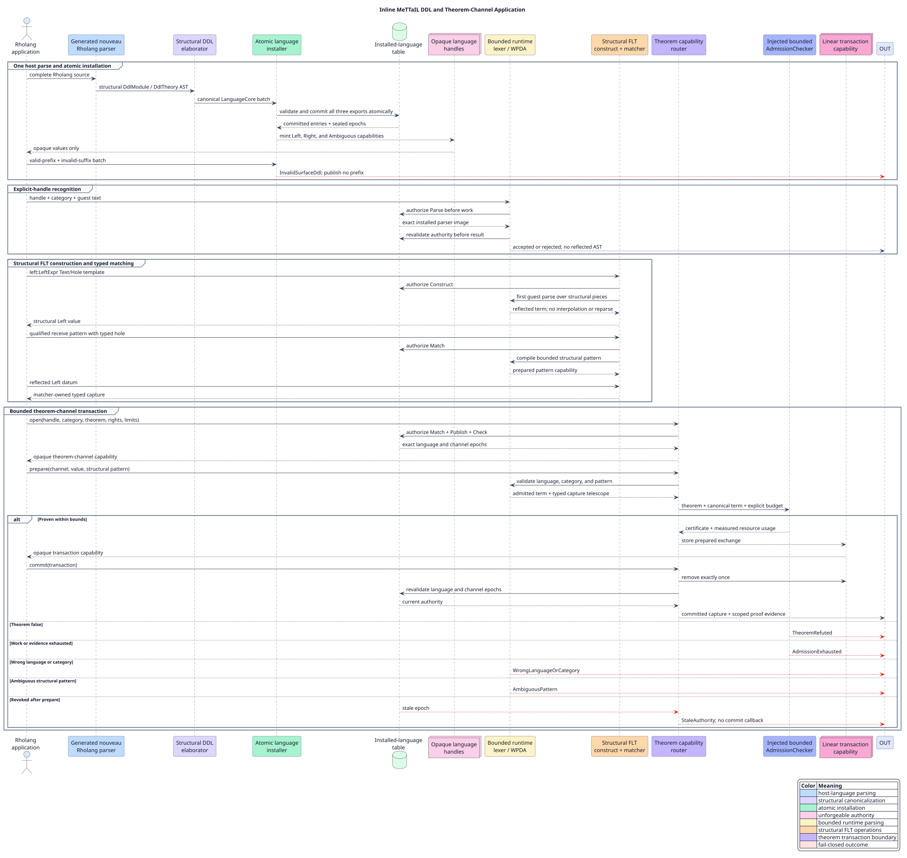

# Inline MeTTaIL DDL in Rholang

This retained application demonstrates that an ordinary Rholang process can
define MeTTaIL theories, install their parser images atomically, receive opaque
language handles, construct and match structural foreign-language terms (FLTs),
and theorem-admit a matched term through a bounded typed channel. It is an
end-to-end Rholang application, not a Rust grammar fixture.

A foreign-language term is a guest-language abstract syntax tree carried as a
Rholang value. Its explicit prefix selects an opaque installed-language handle
and a category; no language is inferred from the guest text. A theorem channel
is a capability-scoped transaction service that accepts a structurally admitted
term only when an injected checker proves the channel theorem within declared
resource bounds.

## Run the complete gate

From the repository root, run exactly:

```console
./scripts/verify-inline-ddl-demo.sh
```

The command runs the committed application on the generated nouveau Rholang
parser and real reducer, the installed-language and theorem-channel
security/resource tests, the system-process collision tests, the memory-capped
Rocq authority proofs, and the diff-integrity check. It prints thirteen labelled
application results and the final installed-language count. Command output is
retained beneath `target/campaign-evidence/inline-ddl-demo/`.

## What the application does

The source is [`inline-ddl.rho`](inline-ddl.rho). `InlineDemo` declares the
independent categories `LeftExpr`, `RightExpr`, and `AmbExpr`. The first two
accept `left` and `right`; the third deliberately gives `amb` two derivations so
the application can demonstrate ambiguity rejection. The installer returns one
opaque handle for each theory. Every parser or FLT request includes that handle
and an explicit category; neither a theory name, Uniform Resource Identifier
(URI), alias, fingerprint, nor public token-channel name can substitute for the
handle.

Each theory explicitly requests the language rights needed by this application:

```rholang
Data({
  "rights": ["Parse", "Construct", "Match", "Publish", "Check"]
})
```

This is a request, not a grant. Installation intersects it with host policy.
The theorem service cannot add a language right that the installed handle lacks.



The application publishes thirteen labelled observations on `@"OUT"`:

| Label | Required result | Meaning |
|---|---|---|
| `left-positive` | `accepted` | `left` belongs to `LeftExpr` under the Left handle |
| `right-positive` | `accepted` | `right` belongs to `RightExpr` under the Right handle |
| `left-negative` | `rejected` | unrelated text is not accepted by Left |
| `right-negative` | `rejected` | unrelated text is not accepted by Right |
| `left-crossfire` | `rejected` | Right's text cannot dispatch through Left's handle |
| `right-crossfire` | `rejected` | Left's text cannot dispatch through Right's handle |
| `atomic-failure` | `InvalidSurfaceDdl` | an invalid second theory rejects its entire two-theory batch |
| `theorem-positive` | `committed` | a typed whole-term hole captures, reconstructs, proves, and commits `left` |
| `theorem-invalid` | `TheoremRefuted` | the bottom theorem cannot admit any term |
| `wrong-language` | `WrongLanguageOrCategory` | a Right term cannot enter a Left theorem channel |
| `stale-authority` | `StaleAuthority` | revocation between prepare and commit invalidates the transaction |
| `ambiguous-pattern` | `AmbiguousPattern` | two structural readings cannot silently choose a receive pattern |
| `theorem-exhausted` | `AdmissionExhausted` | a zero-work proof budget returns undetermined and fails closed |

The executable gate additionally inspects the installed-language table after
evaluation. Its cardinality must be exactly three. Therefore `ValidPrefix` from
the rejected batch did not become visible before `InvalidSuffix` failed.

## Structural FLT and theorem flow

The positive path uses Rholang's qualified FLT surface directly:

```rholang
specimen!(left:LeftExpr`left`) |
for(@left:LeftExpr`${captured:LeftExpr}` <- specimen) {
  // The body reconstructs an FLT from the typed capture before theorem admission.
  left:LeftExpr`${captured:LeftExpr}`
}
```

The generated Rholang parser splits guest text and holes into immutable ordered
`Text`/`Hole` pieces. The guest parser sees those pieces once. It does not receive
interpolated source, and the theory is never rendered and reparsed. The receive
pattern is compiled before publication, and the production spatial matcher owns
the capture telescope.

The theorem transaction follows this state machine:

```text
open(handle, category, theorem, rights, limits)
  -> channel capability
prepare(channel, reflected value, structural pattern)
  -> prove value; derive captures; store linear transaction capability
commit(transaction)
  -> revalidate language epoch, channel epoch, and rights
  -> publish exact matcher-owned captures and proof evidence
```

The response exposes the language fingerprint, category identifier, structural
term hash, theorem identifier, checker and limit-profile identifiers, evidence,
evidence hash, logical work, and evidence-byte usage. The executable test
recomputes the certificate-envelope hash and proves that the whole-term capture
has the same identity as the admitted message.

## Security and resource contract

An `InstalledLanguageHandle` is an unforgeable, process-local capability. The
parse port checks its `Parse` right and sealed revocation epoch before parsing,
runs the parser under the intersection of host and grammar limits, and checks
the same authority again before publishing a result. A parse-only reply reports
one of `accepted`, `rejected`, `ambiguous`, or `exhausted`; it contains no
reflected abstract syntax tree, because reflection has separate authority.

The theorem channel and prepared transaction use distinct private-name domains.
A public string cannot forge either, and a channel token cannot be replayed as a
transaction token. Opening a channel attenuates requested `Produce` and
`Consume` rights against host policy. Preparation returns no transaction for a
refuted, ambiguous, wrong-language, or exhausted judgment. Commit removes the
transaction before revalidation, so success and failure both consume it
linearly. Revocation increments the protected channel epoch and invalidates
already prepared work before any commit callback can run.

These properties are modeled in
[`RholangTheoremService.v`](../../formal/rocq/runtime_grammar/theories/RholangTheoremService.v).
The proof checks authority non-amplification, policy-bounded work/evidence/cache
requests, capability-domain separation, no-transaction failure cases, linear
transaction consumption, revocation safety, and exact capture return.

The application uses the registry-empty runtime and performs no filesystem
access. Future file loading remains behind an injected Rholang File I/O
capability and is outside this demonstration.
