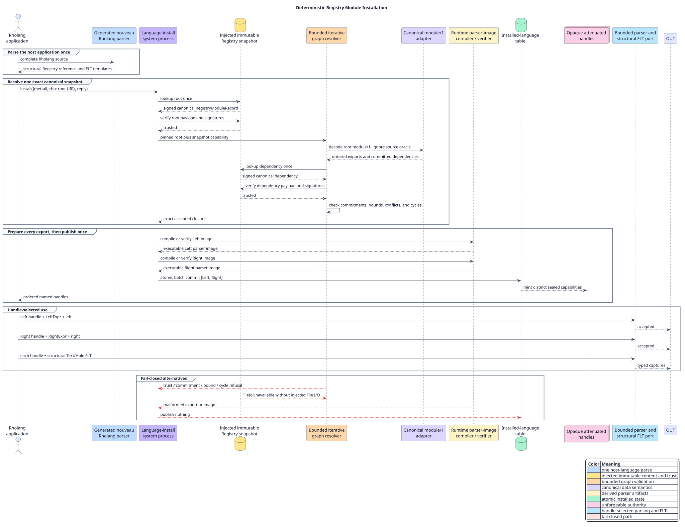

# Registry-backed MeTTaIL modules in Rholang

This retained application demonstrates deterministic reuse of an immutable,
multi-export MeTTaIL module through Rholang's Versioned Registry seam. An
ordinary Rholang process submits a `rho:` module reference to the language
installer, receives two opaque language handles, parses with both installed
grammars, and constructs and matches a structural foreign-language term (FLT)
under each handle.

A Registry snapshot is the capability-injected, immutable view used for one
complete installation. A content commitment is the domain-separated BLAKE3
identity of a signed canonical module-record projection. That projection
includes the source-oracle commitment as provenance, but excludes the optional
source bytes and derived parser-image bytes. The content commitment remains
distinct from each exported language's semantic fingerprint.

## Run the complete gate

From the repository root, run:

```console
./scripts/verify-registry-module-demo.sh
```

The gate runs the application, the bounded module-graph suite, Registry
installation security tests, lexical-alias capability tests, the memory-capped
Rocq model, and repository integrity checks. Evidence is retained under
`target/campaign-evidence/registry-module-demo/`.

## Rholang application

The application source is [`registry-modules.rho`](registry-modules.rho). It
passes an ordinary closed Rholang value to the existing installation system
process:

```rholang
install!(
  {
    "mettail": "mettail-registry-module-ref/1",
    "uri": "rho:demo:registry-pair"
  },
  *installed
)
```

The injected snapshot contains `rho:demo:registry-pair` and its exactly
committed dependency `rho:demo:registry-base`. `RegistryPair` exports `Left`
and `Right` in canonical module order. Installation returns this shape:

```rholang
{
  "ok": {
    "module": "RegistryPair",
    "exports": [
      {"name": "Left", "handle": left},
      {"name": "Right", "handle": right}
    ],
    "programs": []
  }
}
```

`left` and `right` are unforgeable process-local capabilities. The URI,
module name, export name, content commitment, semantic fingerprint, and any
lexical alias are not handles and cannot authorize parsing or FLT operations.

The application produces six labelled observations:

| Label | Required result | Meaning |
|---|---|---|
| `left-positive` | `accepted` | `left` is accepted as `LeftExpr` through the Left handle |
| `right-positive` | `accepted` | `right` is accepted as `RightExpr` through the Right handle |
| `left-crossfire` | `rejected` | Right's spelling cannot be parsed through Left |
| `right-crossfire` | `rejected` | Left's spelling cannot be parsed through Right |
| `left-flt` | structural capture | Left constructs and matches a typed FLT without source interpolation |
| `right-flt` | structural capture | Right constructs and matches a typed FLT without source interpolation |

Fresh snapshots must produce byte-identical observation maps. The executable
test also requires exactly one lookup and one trust check for each of the root
and dependency records, and exactly two installed languages.



## Resolution and installation algorithm

The resolver is an explicit-worklist machine. The prose surrounding this
pseudocode states its invariants: each URI enters the accepted map at most once;
every repeated edge must carry the same commitment; resource limits are checked
before child admission; and no export becomes visible until the entire batch is
prepared.

```text
work := [(root URI, root path, no expected commitment)]
accepted := empty map

while work is not empty:
    pop (URI, path, expected commitment)
    reject if path depth exceeds the policy
    if URI is already accepted:
        require its recorded commitment equals the expected commitment
        continue
    reject if accepting one more module exceeds the count policy
    fetch URI once from the injected snapshot
    verify the signed canonical record through the snapshot trust policy
    require its content commitment equals the edge commitment, when present
    decode canonical module/1; never parse its source-oracle text
    charge per-record bytes, total bytes, and outgoing dependency count
    enqueue dependencies in reverse declaration order
    record exact ordered adjacency and accept the module

reject any cycle in the accepted adjacency graph
prepare every root export and verify any selected parser-image cache
atomically publish the complete batch and mint attenuated handles
```

Reversing child insertion makes a last-in, first-out worklist visit dependencies
in declaration order without native recursion. Cycle checking also uses an
explicit stack, so graph depth consumes bounded heap work rather than the
native call stack.

## Authority and failure boundaries

- Registry retrieval returns immutable content, never parsing authority.
- The local installer revalidates records and mints handles under host policy.
- Rights requested by a grammar are intersected with host grants; data cannot
  grant itself additional rights.
- Publication, retrieval, installation, lexical alias binding, attenuation,
  and revocation remain separate operations.
- A malformed export, failed compilation, trust refusal, commitment conflict,
  resource exhaustion, or installed-table conflict publishes none of the
  module's exports.
- Textual source is an optional developer oracle. It may be checked explicitly,
  but production resolution neither parses it nor derives semantics from it.
- Parser images are replaceable caches selected only by the independently
  computed semantic language fingerprint and accepted only after executable
  image verification.
- `file:` and bare-path syntax is reserved for a future injected Rholang File
  I/O capability. In its absence, resolution returns `FileIoUnavailable`; it
  never consults `std::fs`, the working directory, environment variables, or a
  home directory.

The Rocq model in
`formal/rocq/runtime_grammar/theories/RegistryModuleClosure.v` proves the
admitted closure is trusted, exact, count/depth/byte bounded, free of filesystem
edges and self-cycles, invariant under source-oracle replacement, and published
only as a whole batch.
