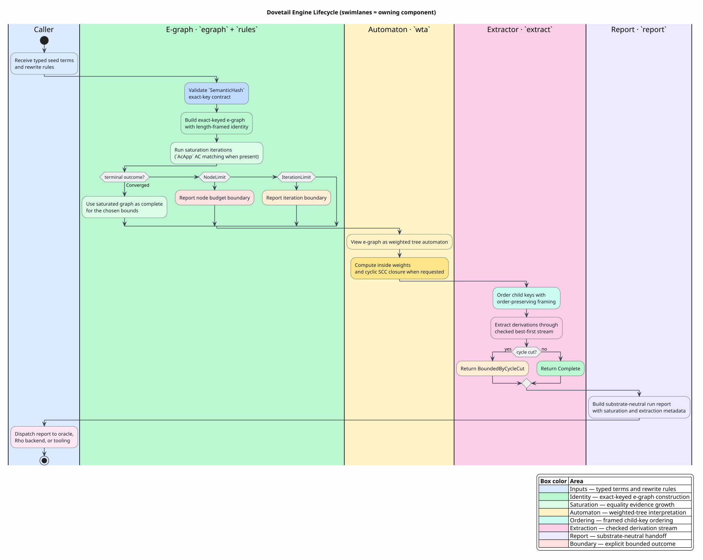

# Engine Architecture

Dovetail is a layered Rust crate. Each layer has a narrow ownership boundary so
that parser code, runtime code, and Rho code do not leak into the rewrite core.



PlantUML source: [figures/02-engine-lifecycle.puml](figures/02-engine-lifecycle.puml).

## Layer Map

| Layer | Rust module | Owns | Does not own |
|---|---|---|---|
| exact identity | `key` | `ContentKey`, `write_framed`, `write_ordered_framed`, `SemanticHash` | term semantics beyond serialization |
| equality evidence | `egraph` | e-classes, e-nodes, merge, rebuild, node budget | rewrite-rule syntax |
| rewrite execution | `rules` | `Pattern`, `RewriteRule`, `Subst`, `saturate` | weighting or extraction policy |
| automaton semantics | `wta` | e-graph-as-WTA view, inside weights, cyclic SCC closure | rule matching |
| extraction | `extract` | derivation trees, lazy frontier, completeness status | saturation growth |
| reporting | `report` | runtime-facing extraction reports | runtime execution |
| rendezvous seam | `space` | generic tuple-space trait and in-memory model | host RSpace implementation |

## Component Rationale

| Component | Why Dovetail chooses it |
|---|---|
| exact-keyed e-graph | an e-graph represents many equivalent terms compactly, while exact keys avoid finite-hash identity collisions |
| rules-as-data | rewrite semantics can be loaded, tested, audited, and lowered without regenerating an Ascent program |
| weighted tree automaton view | every e-class becomes an automaton state, so derivation weighting is a standard algebraic interpretation rather than a side channel |
| lazy extraction frontier | callers can ask for the first answer, the `k`-th answer, or all finite answers without materializing the full product space upfront |
| explicit outcomes | bounded saturation and cyclic extraction remain visible to callers instead of becoming accidental success states |
| substrate-neutral report | Rho, oracle, and local adapters consume the same checked result shape without adding runtime dependencies to Dovetail |

## Lifecycle

The engine lifecycle is:

1. Build seed e-nodes in an e-graph.
2. Load rewrite rules as data.
3. Saturate equalities under explicit bounds.
4. Interpret e-classes and e-nodes as a weighted tree automaton.
5. Extract derivations with checked completeness.
6. Convert derivations into a substrate-neutral report.
7. Hand the report to a caller, oracle, or backend.

Literate pseudocode:

```text
Given a set of seed terms and rewrite rules:
  Create an exact-keyed e-graph.
  Insert each seed term as an e-node tree.
  Repeatedly search rules over current e-classes.
  For each match, instantiate the right-hand side.
  Merge the match root with the instantiated right-hand side.
  Rebuild congruence indexes after rule firings.
  Stop with Converged, NodeLimit, or IterationLimit.
  Extract derivations from requested roots.
  Return values with Complete or BoundedByCycleCut metadata.
```

## Dependency Direction

Dovetail depends downward on `rigail` for algebra. It has no dependency on
parser crates, macro crates, Rho crates, runtime crates, or Ascent.

`MeTTaIL parser → typed terms → Dovetail → report/backend`

The arrow is one-way. Dovetail never calls back into parser generation.

## Inert Milestone

The crate-level status is milestone `M-E.0`, meaning the core exists and is
verified as an inert engine. It can be tested and consumed by adapters, but
language-level production flips still require per-language coverage and backend
selection gates.
