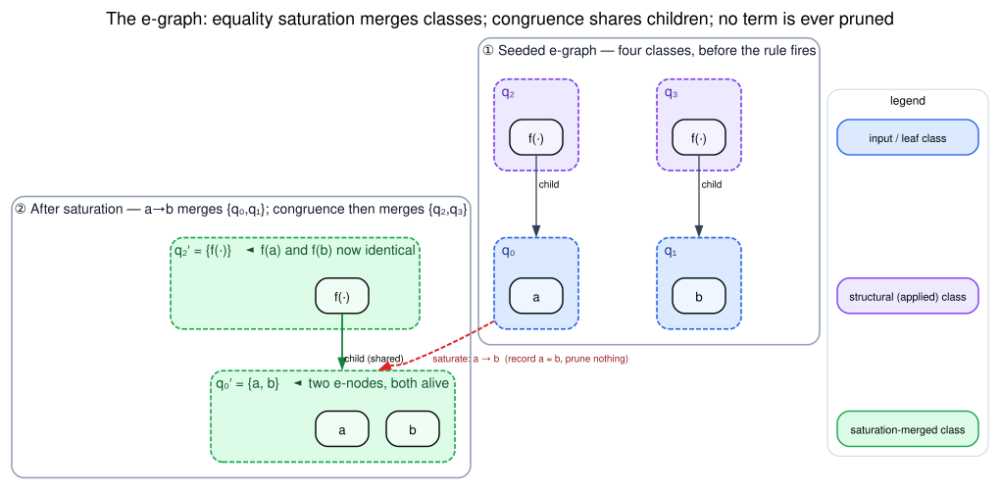

# Data Model and Exact Keys

Dovetail's data model is designed around exact identity. A finite hash is never
the semantic identity of a term or derivation.

## E-Graph Model

An e-node is:

`n = op(children)`

where `op` is a payload-generic label and `children` is an ordered vector of
e-class identifiers.

An e-class is a set of equivalent e-nodes:

`q = { n₁, n₂, … }`

The e-graph maintains:

| Structure | Purpose |
|---|---|
| union-find | canonical representative of each e-class |
| class table | live e-class to e-node vectors and parent links |
| memo table | exact structural hashconsing of canonical e-nodes |
| pending merges | congruence worklist |
| node budget | hard cap for fresh e-node insertion |

The picture to hold in mind — drawn in the **egg convention** (Willsey et al.,
POPL 2021, [doi:10.1145/3434304](https://doi.org/10.1145/3434304)), where a
dashed box is an e-class and a solid box inside it is an e-node — is how a single
rewrite both *merges* classes and lets *congruence* share children for free:



Graphviz source: [figures/03-egraph-term-dag.dot](figures/03-egraph-term-dag.dot).

This is the engine's own `saturate_congruence_via_rule` test (`dovetail/src/rules.rs`):
seeding `f(a)` and `f(b)` under the rule `a → b`, saturation records `a ≈ b` by
**merging** the leaf classes `q₀, q₁` into `q₀′ = {a, b}` — note the merged class
keeps *both* e-nodes, because Dovetail prunes nothing — and congruence closure
then merges `q₂, q₃` into `q₂′ = {f(·)}` because `f`'s only child class is now
shared. No term is deleted; an equality is *added*. The same structure under AC
rules appears in [Rules and Saturation](04-rules-and-saturation.md#associative-commutative-matching).

## Exact Content Key

`ContentKey` is an owned byte stream. Equality and ordering are bytewise.

For e-node identity, Dovetail uses length framing:

`key(op(c₁, …, cₙ)) = bytes(op) · frame(c₁) · … · frame(cₙ)`

Length framing prevents concatenation aliasing:

`frame("ab") · frame("c") ≠ frame("a") · frame("bc")`

For derivation ordering, Dovetail uses ordered framing:

`orderedFrame(b₀…bₙ) = 0x01 b₀ · … · 0x01 bₙ · 0x00`

The ordered frame is prefix-free and lexicographic-order preserving. That is
why parent derivation keys can use child keys as tiebreaking material without
inverting child order.

## The Three E-Graph Keys

A single byte-stream `ContentKey` type backs **three** distinct keying functions,
each with a different invariant. Confusing them is the most common source of
e-graph bugs, so they are tabulated explicitly (all in `dovetail/src/egraph.rs`):

| Key | Defined on | Child order | Resolves union-find? | Role |
|---|---|---|---|---|
| `ENode::content_key()` | one e-node | **sensitive** | no (raw child ids) | **hashcons identity** — two e-nodes are the same node iff equal |
| `ENode::ac_content_key(eg)` | one op-bag e-node | **invariant** (sorted) | yes (canonical child keys) | AC identity — same op + same *multiset* of canonical child classes |
| `EGraph::canonical_class_key(q)` | an e-class | n/a | yes (resolves `q`) | the class's **representative** key: the minimal `content_key` among its live e-nodes |

The relationships are precise:

`content_key(op(c₁,…,cₙ)) = bytes(op) · frame(c₁) · … · frame(cₙ)`   *(positional)*

`ac_content_key(op(c₁,…,cₙ)) = bytes(op) · frame(k_{π(1)}) · … · frame(k_{π(n)})`   where `kᵢ = canonical_class_key(cᵢ)` and `π` sorts the `kᵢ`

`canonical_class_key(q) = min_{n ∈ nodes(find(q))} content_key(n)`   *(total `Ord` on `ContentKey`; ties impossible after `rebuild` dedups exact nodes)*

So `content_key` is the *order-sensitive* hashcons identity (it must stay
order-sensitive — `f(a,b) ≠ f(b,a)` in general), while `ac_content_key` deliberately
sorts the **canonical** child keys to obtain commutative identity *at the key
level* without disturbing hashconsing. Sorting canonical (union-find-resolved)
keys — not raw ids — is what makes the AC key follow merges: after `a ≈ b`, a bag
`⟦a, c⟧` and `⟦b, c⟧` produce the *same* `ac_content_key` (pinned by
`ac_content_key_is_permutation_invariant_but_op_sensitive` and
`ac_content_key_follows_union_find_merges`). Order-invariance is proven in Rocq as
`CollectionAcLowering.canon_iff_permutation`.

## The α-Canonical Binder Key (FIX-A)

Ambient's binder-congruence handler (see
[Binder-Congruence Handler](11-binder-congruence-handler.md)) needs two
α-equivalent binders — `new(x, x[0])` and `new(y, y[0])` — to share an e-graph
key, so the engine treats them as the *same* redex rather than two. But the
underlying `moniker::Scope` carries a process-global `FreeVar::unique_id` that
differs between the two, so the *structural* `Hash`/`Eq` (which Ascent relies on,
and which must stay structural) would split them.

FIX-A resolves this at the `semantic_hash` layer only: a binder slot contributes

`key(binder) = frame(arity) · key(de-Bruijn body)`

i.e. the binder's **arity** and its **de-Bruijn-indexed body**, *excluding* the
binder's `FreeVar::unique_id`. Because de-Bruijn indexing makes α-equivalent
bodies byte-identical (de Bruijn 1972), `new(x, x[0])` and `new(y, y[0])` write
the same content bytes and therefore share a `ContentKey`. The structural
`Hash`/`Eq`/`Ord` on `Scope` are left untouched (Ascent identity must not change);
only the exact-key path is α-canonical. The tests in
`languages/tests/fix_a_alpha_canonical_semantic_key.rs`
(`alpha_equivalent_binders_share_semantic_key`,
`distinct_terms_keep_distinct_keys`) pin `λx.x ≈ λy.y` to one key while keeping
distinct binders distinct.

## SemanticHash Contract

`SemanticHash` is an unsafe trait because implementors promise:

`write_content(x) = write_content(y) ⇔ x ≈ y`

and:

`x = y ⇒ hash(x) = hash(y) ∧ write_content(x) = write_content(y)`

Composite values must frame parts. Failing to frame parts can make structurally
different values write the same byte stream.

## Rebuild Invariants

After `merge` and `rebuild`, these invariants hold:

| Invariant | Meaning |
|---|---|
| canonical children | every live e-node child points through `find` |
| exact memo | no two memo entries represent the same canonical e-node |
| parent links | every parent edge is registered on each canonical child |
| class-local dedup | duplicate canonical e-nodes inside a class are collapsed |
| live node count | `node_count` equals the number of live exact e-nodes |

Literate pseudocode:

```text
To rebuild exact indexes:
  Snapshot union-find representatives.
  For each live class, canonicalize all node children.
  Keep only the first exact canonical copy of each node.
  Clear parent links.
  Rebuild memo from canonical nodes.
  Rebuild parent links from each canonical child to its parent node.
  Recompute live node count from exact memo insertions.
```

## Runtime-Facing Reports

Reports are Dovetail's proof-preserving handoff artifacts. They are not
human-facing logs and they are not Ascent-style fact bags. The dedicated
contract is documented in
[Runtime-Facing Reports](10-runtime-facing-reports.md).

`report_from_extraction` converts checked derivations into:

| Field | Meaning |
|---|---|
| `roots` | exact root keys in extractor order |
| `root_ordinals` | root positions in the term table |
| `terms` | unique derivation nodes by exact key |
| `derivation_edges` | parent-child edges preserving multiplicity and order |
| `completeness` | terminal extraction completeness |

Reports preserve exact identity while giving adapters stable ordinals for table
layout. Ordinals are presentation identifiers; exact keys remain semantic
identifiers.
