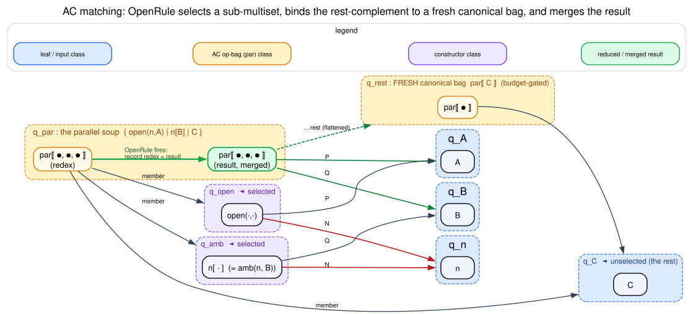

# Rules and Saturation

Dovetail represents rewrite rules as data. A caller supplies `RewriteRule<L>`
values over payload labels `L`.

## Where Rules Come From

In MeTTaIL integration, rules originate in the generated language inventory:

`language! specification → LanguageDef → LanguageMetadata → RewriteRule<L>`

The `language!` macro remains the source of truth for categories,
constructors, equations, rewrites, guards, and native-handler declarations.
Macro parsing produces `LanguageDef`; code generation emits typed AST
constructors and `LanguageMetadata`; the Dovetail adapter derives
`RewriteRule<L>` values from that metadata.

This distinction matters for maintenance. Dovetail should not maintain a
separate hard-coded list of language categories or constructor heads. It should
ask the generated inventory what exists, then lower that inventory into
pattern-and-rule data. A future language edit should therefore flow through the
language definition and generated metadata before reaching Dovetail.
Guarded rules follow the same path. Dovetail receives structural guard
patterns, behavioral predicate premises, typed predicate metadata, and external
coverage evidence from generated inventory. It does not infer guard meaning
from predicate names or from a backend-local list of known category heads.

## Predicate Evidence Boundary

The generalized predicate substrate is upstream of Dovetail. Its job is to
derive guard obligations from `LanguageDef`, generated type metadata, and
rewrite metadata, then classify each obligation with an evidence disposition.
Dovetail consumes that disposition; it does not re-derive symbolic automata,
tree automata, behavioral model-checking, or effective-Boolean-algebra proofs.

The intended disposition vocabulary is:

| Disposition | Meaning for Dovetail |
|---|---|
| `ExactDecidable` | the predicate has complete static or runtime-decidable evidence, such as a structural matcher, EBA/SFT proof, or exact model-checker result |
| `BoundedDecidable` | the predicate is sound and complete only under the recorded bound; Dovetail may report boundedness but must not advertise exhaustive coverage beyond that bound |
| `RejectSafeApprox` | the predicate may conservatively reject matches; Dovetail may use it only in positions where false negatives do not fabricate successful rewrites |
| `TrustedNativeGuard` | a native assertion site owns the contract; Dovetail records the checked disposition in the report and treats missing or incompatible dispositions as coverage failures |
| `MachineCheckedModel` | a machine-checked formal model discharges the guard obligation; the proof is attributed in documentation/comments, not carried as runtime data |
| `RuntimeObservation` | the Rho runtime supplies the behavioral evidence through a named observation or join contract |
| `Unknown` | production-default lowering is refused; Dovetail can still surface the uncovered obligation in a report |

This boundary keeps a separate predicate-substrate implementation
complementary to the Dovetail/Rho runtime-backend work:

`language! → LanguageDef → guard obligations → predicate dispositions → Dovetail guarded rules → DovetailRunReport`

For classical structural predicates, the upstream substrate may expose a full
Boolean algebra. For semi-decidable behavioral predicates, it must expose only a
reject-safe algebraic contract. Dovetail must therefore never reinterpret a
behavioral or mixed structural-behavioral disposition as classical complement
unless the disposition explicitly carries exact decidable evidence.

## Rule Shape

A `RewriteRule<L>` is exactly three fields (`dovetail/src/rules.rs`):

| Field | Type | Meaning |
|---|---|---|
| `lhs` | `Pattern<L>` | pattern matched against e-classes |
| `rhs` | `Pattern<L>` | pattern instantiated under a match substitution |
| `label` | `Option<String>` | optional diagnostic name (e.g. `"OpenRule"`) |

There is **no** `guard` field and **no** `evidence` field on a Dovetail rule.
That is deliberate, and it is the single most important thing to understand
about where guards live: a rule that reaches Dovetail's saturation loop is
**unconditional**. Guard discharge happens entirely *upstream* (in
`mettail-rho-codegen`), before any `RewriteRule` is constructed — see
[Guards Are Discharged Upstream](#guards-are-discharged-upstream) below and the
[Predicate Evidence Boundary](#predicate-evidence-boundary) above. The well-formedness
contract Dovetail *does* enforce on the data is the variable-scope condition
`vars(rhs) ⊆ vars(lhs)` (every right-hand-side variable is bound by the match).

### Patterns

A `Pattern<L>` has **three** variants (not two):

```text
Pattern⟨L⟩ ::= Var(name)                       -- a pattern variable, binds an e-class
             | App  { op: L, args: [Pattern] }  -- POSITIONAL application (fixed arity)
             | AcApp{ op: L,                     -- ASSOCIATIVE-COMMUTATIVE application:
                      fixed: [Pattern],          --   a sub-multiset of an op-bag's children
                      rest:  Option⟨name⟩ }      --   rest binds the multiset COMPLEMENT
```

The third variant, `AcApp`, is what lets Dovetail rewrite over an unordered
*bag* of children — a parallel composition `{P | Q | R | …}`, an associative-
commutative collection — rather than a fixed-arity tuple. It is the engine half
of Ambient's `InRule`/`OutRule`/`OpenRule` and is documented in its own section,
[Associative-Commutative Matching](#associative-commutative-matching), with the
e-graph diagram ④ from the family above. The symbol `b⋆` (a multiset / bag) and
`x ⊎ y` (multiset union) are used there.

A substitution maps variable names to e-classes:

`σ : variableName ↦ EClassId`

In code, `type Subst = HashMap<String, EClassId>`.

## Search And Instantiation

Rule matching is structural over e-nodes. A variable binds to an e-class. If the
same variable appears twice, both occurrences must resolve to the same canonical
e-class.

Literate pseudocode (`collect_matches`, `dovetail/src/rules.rs`):

```text
To match a pattern P against an e-class q (carrying substitution σ):
  If P is Var(name):
    If name is unbound in σ, bind name ↦ canonical(q) and accept.
    If name is already bound to canonical(q), accept (re-bind agrees).
    Otherwise reject (the non-linear constraint: two uses must agree).
  If P is App{op, args}:
    For each e-node n in q with n.op = op and arity(n) = |args|:
      Match args positionally against n's child classes, threading σ.
  If P is AcApp{op, fixed, rest}:
    Match the multiset of `fixed` against a SUB-MULTISET of an op-bag in q,
    binding `rest` to the complement — see Associative-Commutative Matching.
```

Instantiation rejects ill-formed right-hand sides before adding any node:

`vars(rhs) ⊆ vars(lhs)`

If a right-hand-side variable is unbound under σ, Dovetail adds **no** partial
term (`rhs_vars_bound` is checked first; the test
`unbound_rhs_variable_does_not_leave_partial_nodes` pins this).

### Guards Are Discharged Upstream

A reader coming from a Datalog or CHR engine expects a `guard(σ)` to be evaluated
*inside* the rewrite loop, deriving no fact when false. **Dovetail does not work
that way, and its rule data has no guard field to evaluate.** The semantics
`guard(σ) = false ⇒ no derived fact` is still honored — but it is realized
*before* lowering, by the disposition layer described in the
[Predicate Evidence Boundary](#predicate-evidence-boundary):

| Guard situation | What the upstream layer does | What Dovetail sees |
|---|---|---|
| structural, statically decidable | folds the guard into the LHS `Pattern` shape (the non-linear `Var` re-bind check *is* the structural guard) | an ordinary unconditional `RewriteRule` whose match already encodes the condition |
| behavioral / host-decided (channel join, COMM) | routes the rule to the host as a `RhoNativeJoin` disposition; the guard becomes "no RSpace consumption on a failed match" | nothing — the rule never becomes a Dovetail `RewriteRule` |
| native fold / assertion | routes to a `NativeHandler`; the guard is the native function's own precondition | nothing — handled outside saturation |
| unclassifiable (`Unknown`) | the flip gate **fails closed**: the language is left un-flipped | nothing — the rule is never lowered |

So the no-commit law holds end-to-end, but the *mechanism* is upstream
classification, not an inline predicate call. The non-linear shared-variable
check (`N` must be the same name in `open(N,P)` and `N[Q]`) is the one
"guard-like" test that lives in the matcher, and it is purely structural: it
prunes a pairing **by evidence** (the two e-classes are provably distinct), never
by an opaque predicate. For Rho consumers a failed match means no RSpace
consumption; for direct Dovetail consumers it means no rewrite edge is added.

## Associative-Commutative Matching



Graphviz source: [figures/04-egraph-ac-openrule.dot](figures/04-egraph-ac-openrule.dot).

The `AcApp{op, fixed, rest}` pattern matches against an **op-bag** — an e-node
whose `op` label denotes an associative-commutative operator (parallel
composition `|`, a bag/multiset collection). Write a bag of children as
`b⋆ = ⟦c₁, c₂, …, cₘ⟧` (double brackets emphasize *multiset*, so duplicates
matter and order does not). The pattern selects a sub-multiset to match `fixed`
and binds `rest` to the complement:

`match AcApp{op, fixed, rest} against op(b⋆)  ⇔  ∃ s⋆ ⊆ b⋆ . |s⋆| = |fixed| ∧ pair(fixed, s⋆) ∧ rest ↦ op(b⋆ ⊖ s⋆)`

where `⊖` is multiset difference and `pair` tries every bijection between the
`fixed` patterns and the selected children (the non-linear `Var` check prunes
disagreeing pairings). Each surviving `(class, σ)` is a **distinct alternative** —
ambiguity is preserved, never collapsed.

Two properties make this tractable and sound:

1. **Laziness (mandate: laziness over eagerness).** Selecting a size-`k`
   sub-multiset of `m` children has `C(m, k)` choices — exponential. Dovetail
   never materializes them. `lazy_ac_select` is an iterator that holds only the
   current `k`-combination of indices and advances one position at a time
   (lexicographic next-combination, `O(k)` per step). The test
   `lazy_ac_select_is_lazy_partial_consumption` pulls 3 selections from a bag
   whose full count is `C(40, 5) ≈ 658 000` and returns instantly.

2. **Associative flattening on the result.** When `AcApp` is *instantiated* on a
   right-hand side, any member that is itself an `op`-bag is spliced in, so the
   result is **one flat canonical bag**, never a bag-of-bags:
   `op⟦P, op⟦Q, R⟧⟧ ≡ op⟦P, Q, R⟧`. This is `add_flattened_bag`, an iterative
   (stack-based, cycle-guarded) splice; the test
   `ac_open_rule_flattens_nested_ambient_body` pins
   `open(n,A) | n[B|C] ⤳ A | B | C` as one flat bag.

Literate pseudocode (`collect_ac_matches`):

```text
To match AcApp{op, fixed, rest} against e-class q (k = |fixed|):
  For each e-node n in q with n.op = op and arity(n) ≥ k:
    Let bag = canonical child classes of n.
    LAZILY, for each size-k selection (sel, comp) of bag:        ← lazy_ac_select
      For each bijection of `fixed` onto `sel`:                  ← pair_fixed
        Match each fixed[i] against its paired class, threading σ;
        the non-linear Var check prunes disagreeing pairings.
      If `rest` is present:
        Bind rest ↦ a FRESH canonical op-node over `comp`        ← add_canonical_bag
          (budget-gated; if the budget refuses the node, drop this match honestly).
      Emit every surviving (q, σ) as a DISTINCT alternative.
```

The freshly-built complement node is the **only** mutation AC matching performs
on the e-graph, and it is budget-gated like every other insertion — an honest,
reported growth (`NodeLimit`), never a silent one. Diagram ④ in the e-graph
family draws this: the `par`-bag class, the matched `open(n,·)` and `n[·]`
e-nodes, and the `rest` complement as a new canonical bag node.

## Saturation Outcomes

Saturation has three terminal outcomes:

| Outcome | Meaning |
|---|---|
| `Converged` | an iteration produced no new merges |
| `NodeLimit` | the e-node budget refused a fresh node |
| `IterationLimit` | `max_iters` ended before convergence |

This is deliberately not a Boolean success flag. A caller must inspect the
outcome before treating extracted results as complete for a language.

## Saturation Algorithm

Literate pseudocode:

```text
To saturate an e-graph:
  For each iteration up to max_iters:
    Set the iteration merge count to zero.
    For each rewrite rule:
      Search all matches of the left-hand side.
      For each match:
        Reject the match if the right-hand side has an unbound variable.
        Instantiate the right-hand side inside the node budget.
        If the budget refuses a fresh node, return NodeLimit.
        Merge the match root with the instantiated right-hand side.
      If this rule caused merges, rebuild congruence closure.
    If the iteration caused no merges, return Converged.
  Return IterationLimit.
```

## Monotonicity

Saturation adds equality evidence; it does not replace a term with another term.

`Fᵢ ⊆ Fᵢ₊₁`

where `Fᵢ` is the set of represented equality facts after iteration `i`.

This monotonicity is why extraction can enumerate alternatives after
saturation rather than relying on saturation to choose a winner.

## Budget Discipline

`try_add_with_budget` refuses a fresh node before overshooting:

`node_count ≤ max_nodes`

An existing exact node can still be resolved after the budget is reached,
because resolving a duplicate does not grow the graph.
