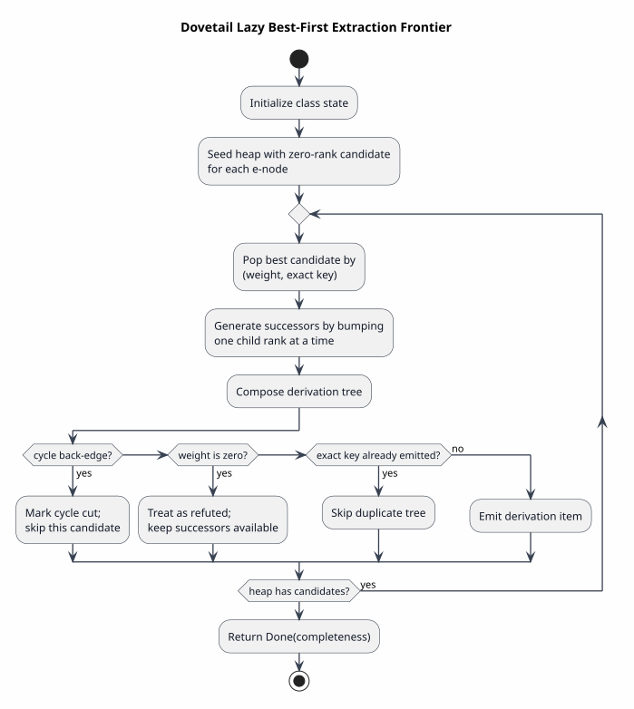

# Extraction and Weights

Extraction is Dovetail's correctness-critical phase. It enumerates derivation
trees from an e-class. The stream is best-first, but best-first never means
beam-pruned.



PlantUML source: [figures/05-extraction-frontier.puml](figures/05-extraction-frontier.puml).

## Derivation Model

A derivation for class `q` chooses one e-node `n ∈ nodes(q)` and one derivation
for each child:

`d = n(d₁, …, dₖ)`

The composed weight is:

`weight(d) = weight(n) ⊗ weight(d₁) ⊗ … ⊗ weight(dₖ)`

The derivation key is:

`key(d) = bytes(op(n)) · orderedFrame(key(d₁)) · … · orderedFrame(key(dₖ))`

## Public Completeness API

The public API carries terminal metadata:

| API | Completeness behavior |
|---|---|
| `kth(root, k)` | returns `Extraction<Option<Derivation>>` |
| `derivations(root).next_checked()` | returns `Item` or `Done(completeness)` |
| `derivations(root).collect_checked()` | returns `Extraction<Vec<Derivation>>` |

The stream intentionally does not expose a plain `Iterator`. Completeness is
terminal metadata, not an item-level error.

## Lazy Frontier Algorithm

For a fixed e-node with `k` children, the candidate space is `ℕᵏ`. A rank vector
`[r₀, …, rₖ₋₁]` means: use child `i`'s `rᵢ`-th derivation.
The engineering pattern is the same family of problem as lazy k-best parsing:
emit the next best composite object without precomputing the full Cartesian
product ([HUANG-CHIANG-2005](references.md#huang-chiang-2005)).

Literate pseudocode:

```text
To initialize an e-class stream:
  For every e-node in the class:
    Create rank vector [0, ..., 0].
    Compose that candidate if every child rank exists.
    Push it into the heap.

To emit the next derivation:
  Pop the best candidate by (weight, exact key).
  For each child index:
    Create a successor by incrementing only that child rank.
    If the successor rank vector is new, compose and enqueue it.
  Build the popped derivation.
  If its weight is not semiring zero and its exact key is new, emit it.
  Otherwise continue popping.
```

## No-Miss Argument

For each e-node, every possible child-choice tuple is a point in `ℕᵏ`. The
successor rule reaches every point from `[0, …, 0]` by finite single-coordinate
increments.

`∀r ∈ ℕᵏ. reachable([0,…,0], r)`

The `seen` set ensures each candidate rank vector is enqueued at most once.
The heap orders candidates, but it does not drop candidates.

## Weight Requirements

The extractor requires `MonotoneBestOrder`, meaning that increasing a child rank
cannot make the parent candidate strictly better under the selected best order.

`a ≤ b ⇒ x ⊗ a ≤ x ⊗ b`

Dovetail seals the marker and implements it only for checked weight types used
by the engine.

## Equal-Weight Alternatives

Equal weight does not merge alternatives:

`weight(d₁) = weight(d₂) ∧ key(d₁) ≠ key(d₂) ⇒ both emitted`

The total ordering key is:

`(weight(d), key(d))`

Only exact duplicate derivation trees share a key.

## Heuristic

`with_heuristic` uses exact closed inside weights as an admissible reachability
skip. It can avoid exploring classes whose inside weight is `0̄`. It cannot
change the emitted sequence for non-refuted derivations.

The verified property is:

`extract(egraph) = extract(with_heuristic(egraph))`
