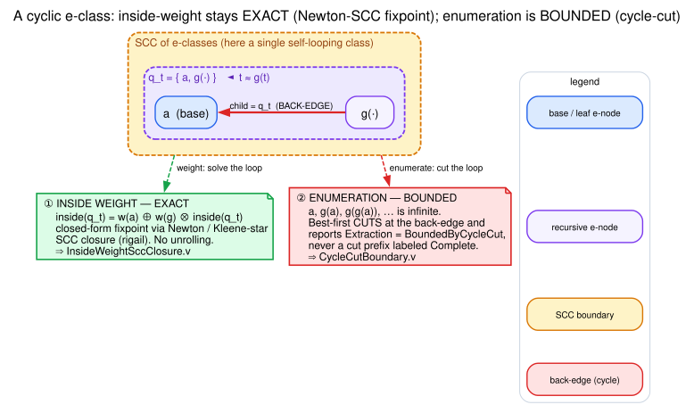

# Cyclic Closure and Boundedness

Dovetail distinguishes two cyclic questions:

1. What is the exact aggregate inside weight of a cyclic e-class?
2. Can every cyclic unrolling be finitely enumerated?

The first is solved by SCC closure. The second is answered honestly through
bounded extraction metadata.



Graphviz source: [figures/06-egraph-cyclic-closure.dot](figures/06-egraph-cyclic-closure.dot).

The diagram shows why the two questions get *different* answers from the *same*
cyclic e-class. After a recursive rewrite `t ⟶ g(t)` saturates, the class `q_t`
holds both a base e-node `a` and `g(·)` whose child is `q_t` itself — a back-edge,
so `q_t` is its own descendant (the e-graph finitely represents the infinite family
`a, g(a), g(g(a)), …`). **Inside weight** is the semiring fixpoint
`inside(q_t) = w(a) ⊕ w(g) ⊗ inside(q_t)`, solved in closed form by Newton/Kleene-star
SCC closure — exact, no unrolling. **Enumeration** cannot unfold the loop forever,
so best-first extraction cuts at the back-edge and reports `BoundedByCycleCut`
rather than a cut prefix mislabeled `Complete`.

## Class Dependency Graph

There is an edge from e-class `q` to e-class `c` when some e-node of `q` has
`c` as a child:

`q → c ⇔ ∃n ∈ nodes(q). c ∈ children(n)`

Dovetail computes deterministic Tarjan SCCs over this graph. Class identifiers
are sorted before indexing so HashMap iteration order cannot affect results.

## Closed Inside Weights

For acyclic classes, repeated fixpoint passes compute inside weights. For a
non-trivial SCC, Dovetail lowers the recurrence to `rigail::PackingFactored`
and calls `solve_scc_weights_newton`.
The external fixed-point background is
[ESPARZA-KIEFER-LUTTENBERGER-2008](references.md#esparza-kiefer-luttenberger-2008)
and
[ESPARZA-KIEFER-LUTTENBERGER-2010](references.md#esparza-kiefer-luttenberger-2010);
the local proof bridge is
`dovetail/formal/rocq/theories/Rigail/NewtonSccAdequacy.v`.

The recurrence is:

`inside(q) = ⊕_{n ∈ nodes(q)} weight(n) ⊗ ⊗_{c ∈ children(n)} inside(c)`

For an SCC, in-SCC children become local unknowns. Out-of-SCC children are
already solved constants because SCCs are processed leaf-first.

Literate pseudocode:

```text
To solve closed inside weights:
  Compute the acyclic inside estimate.
  Compute deterministic SCCs of the class dependency graph.
  For each SCC in leaf-first order:
    If the SCC is a singleton without a self-loop, keep the acyclic value.
    Otherwise build a factored polynomial system:
      Each e-node contributes one packing.
      In-SCC children become unknown indices.
      Out-of-SCC children multiply into the outside product.
    Solve the SCC system with Newton-SCC.
    Replace inside weights for classes in the SCC.
```

## Commutative Star Precondition

SCC lowering groups out-of-SCC child weights into one outside product. That
regrouping is sound only for a commutative multiplication:

`a ⊗ b = b ⊗ a`

Dovetail encodes this as the sealed `CommutativeStarSemiring` marker. Today the
cyclic closed path is implemented for `TropicalWeight`.

## Enumeration Boundary

Closed inside weights can be exact even when full cyclic enumeration is
infinite.

A productive self-cycle with an exit has derivations:

`exit, loop(exit), loop(loop(exit)), …`

There is no finite vector that exhausts that set. Dovetail therefore cuts
recursive back-edges during extraction and reports:

`ExtractionCompleteness::BoundedByCycleCut`

The report remains sound:

`emitted ⊆ validNonZeroDerivations`

but it is not claimed exhaustive:

`BoundedByCycleCut ⇒ ¬Complete`

## Engineering Meaning

Callers must treat `Complete` and `BoundedByCycleCut` differently.

| Status | Caller may claim |
|---|---|
| `Complete` | all non-`0̄` derivations were emitted |
| `BoundedByCycleCut` | emitted derivations are valid, but cyclic unrollings were bounded |

This distinction is part of the public API and is formally modeled.
