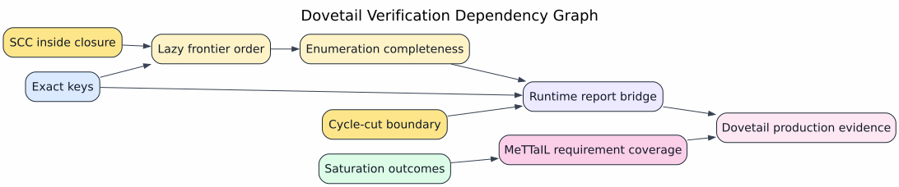

# Formal Verification and Tests

Dovetail has three evidence layers:

1. mechanized proofs under `dovetail/formal/`;
2. Rust example, exhaustive, corpus, and property tests under `dovetail/tests/`;
3. capped project-level commands under `formal/Makefile`.



Graphviz source: [figures/07-verification-dag.dot](figures/07-verification-dag.dot).

## Mechanized Proof Matrix

| Claim | Artifact |
|---|---|
| exact-key dedup preserves distinct keys | `dovetail/formal/rocq/theories/ExactKeys/ExactKeyDedup.v` |
| lazy frontier emits sorted complete candidate stream | `dovetail/formal/rocq/theories/Extraction/LazyFrontierOrder.v` |
| ordered framing is injective and order-preserving | `dovetail/formal/rocq/theories/Extraction/OrderPreservingFraming.v` |
| complete best-first extraction keeps non-`0̄` distinct alternatives | `dovetail/formal/rocq/theories/Extraction/NBestExtraction.v` |
| enumeration covers hyperedge rank-vector products | `dovetail/formal/rocq/theories/Extraction/EnumerationCompleteness.v` |
| cycle cuts cannot be reported as complete | `dovetail/formal/rocq/theories/Extraction/ExtractionOutcome.v` and `CycleCutBoundary.v` |
| productive cyclic enumeration is not finitely exhaustive | `dovetail/formal/rocq/theories/Extraction/CyclicEnumerationImpossibility.v` |
| SCC lowering preserves inside-weight equations | `dovetail/formal/rocq/theories/InsideWeights/InsideWeightSccClosure.v` |
| saturation outcomes are explicit and sound | `dovetail/formal/rocq/theories/Saturation/DovetailSaturation.v` |
| native folds preserve soundness; a re-fired fold is a no-op | `dovetail/formal/rocq/theories/Saturation/DovetailSaturation.v` (`native_fold_saturation_sound`, `native_refire_is_noop`) |
| the fold transition's funding satisfies its four laws + budget bridge | `dovetail/formal/rocq/theories/Saturation/DovetailSaturation.v` (`fold_transition_funded`, `funded_fold_saturates_within_budget`) |
| the native-fold disposition partition is total/exact with exact-key requirements | `dovetail/formal/rocq/theories/Lowering/GeneratedReportCompiler.v` (`NativeFoldLowered`, `native_fold_requirements_are_exact_key`) |
| MeTTaIL rewrite requirements are classified | `dovetail/formal/rocq/theories/Requirements/MeTTaILRewriteCoverage.v` |
| Rust model bridge matches public result enums | `dovetail/formal/rocq/theories/Refinement/RustModelBridge.v` |
| report handoff preserves completeness and keys | `dovetail/formal/rocq/theories/Refinement/RuntimeReportBridge.v` and `RhoReportHandoff.v` |
| key-budget contracts hold in Why3 | `dovetail/formal/why3/key_budget_contract.mlw` |
| Creusot pilot checks Rust budget boundary | `dovetail/formal/creusot/` |

## Rust Test Matrix

| Test file | Coverage |
|---|---|
| `bounded_exhaustive.rs` | exhaustive acyclic extractor agreement with brute-force oracle |
| `properties.rs` | proptest for extraction oracle parity, heuristic invariance, saturation budgets, tuple-space model parity |
| `example_regressions.rs` | named regressions for exact keys, ordering, cycles, and saturation |
| `corpus_replay.rs` | replay-shaped regression coverage |
| `language_inventory.rs` | current language requirement inventory checked against Rocq coverage names |
| `language_shape_parity.rs` | representative MeTTaIL rewrite shapes: native step, lambda beta, ambient open, Rho COMM |
| `languages/tests/rholang_dovetail_fold.rs` | native-fold reduction matrix: saturation-recursion (`int(1+2,8)→3`), single-cast, bare arithmetic, var-defer, bad-cast→`Err`, host-guard literal |
| `languages/tests/rholang_dovetail_op_enum.rs` | typed op-enum exact-key `SemanticHash`: framed-discriminant non-aliasing, payload distinctness/determinism, `Display` label form |

## Required Commands

Run Rust tests under an RSS cap:

```text
systemd-run --user --scope -p MemoryAccounting=yes -p MemoryMax=8G -p MemorySwapMax=0 -p CPUQuota=200% cargo test -j1 -p dovetail
```

Run stronger property tests:

```text
systemd-run --user --scope -p MemoryAccounting=yes -p MemoryMax=8G -p MemorySwapMax=0 -p CPUQuota=200% env PROPTEST_CASES=4096 cargo test -j1 -p dovetail --test properties
```

Run Dovetail formal verification:

```text
make -C formal check-capped FORMAL_CAPPED_TARGET=rocq-dovetail FORMAL_MEMORY_MAX_BYTES=8589934592 FORMAL_MEMORY_HIGH_BYTES=7516192768
make -C formal check-capped FORMAL_CAPPED_TARGET=why3-dovetail-budget FORMAL_MEMORY_MAX_BYTES=8589934592 FORMAL_MEMORY_HIGH_BYTES=7516192768
make -C formal check-capped FORMAL_CAPPED_TARGET=creusot-dovetail-budget FORMAL_MEMORY_MAX_BYTES=8589934592 FORMAL_MEMORY_HIGH_BYTES=7516192768
```

## Zero-Admission Policy

Rocq proofs are expected to be zero-admission:

`NoUnprovedLemma ∧ NoUnsafePostulate ∧ NoUncheckedPremise`

The project-level target `rocq-critical-zero-admission` checks this policy for
the formal tree.
