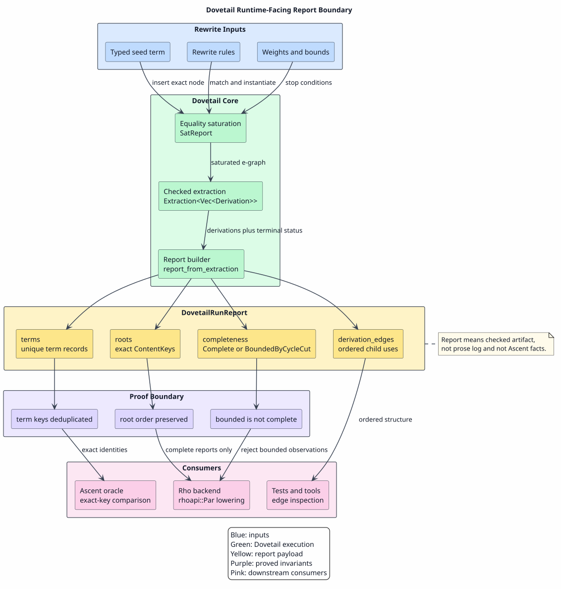
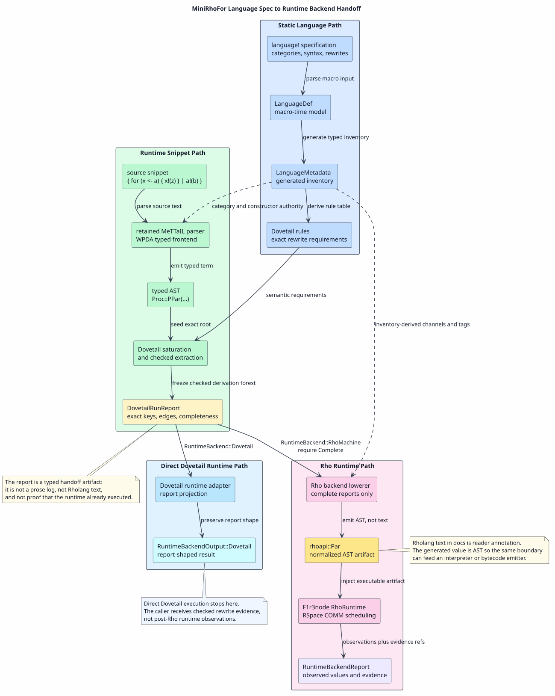

# Runtime-Facing Reports

A Dovetail report is a proof-preserving extraction artifact. It is the
structured value Dovetail hands to downstream consumers after saturation and
checked extraction. It is not a human-facing log, and it is not a lossy
`success` value.

The report exists because a rewrite engine often has more to say than "here is
one answer." Dovetail must preserve ambiguity, exact identity, derivation
structure, ordering, and terminal completeness across the boundary to an
oracle, a local test, or the Rho-native runtime backend.

Put differently: a report is the machine-readable certificate for what the
rewrite engine just proved, enumerated, and bounded. It is called a report
because it reports checked facts to another component, not because it is a
diagnostic transcript for a human.

The chapter is organized in the same order a consumer encounters the artifact:
first the mental model, then the phase boundaries and invariants, then a
concrete `language!`-to-Rho handoff example.

## Reader's Mental Model

The shortest useful definition is:

`Dovetail report = checked rewrite result + exact identities + boundary status`

That definition matters because Dovetail is not just an evaluator. It is the
component that explains a rewrite search well enough for another runtime to
consume it without reopening Dovetail internals. A report is therefore the
handoff object between "the rewrite engine has finished a checked phase" and
"a backend, oracle, or tool may now act on the checked result."

Use this quick test when reading or changing the code:

| If the value answers... | It is this artifact |
|---|---|
| "How did saturation stop?" | `SatReport` |
| "What did extraction emit, and was that emission complete?" | `Extraction<T>` |
| "What exact derivation forest may a backend or oracle consume?" | `DovetailRunReport` |
| "What did a runtime observe after executing a backend artifact?" | Not a Dovetail report; it is a runtime observation |

So a report is not an extra logging layer. It is the reason Dovetail can remain
substrate-neutral while still giving Rho, Ascent-oracle checks, tests, and
future bytecode paths the same exact semantic payload.

## Purpose At A Glance

A Dovetail report exists to make a rewrite run safely consumable outside the
rewrite engine. It is the bridge between Dovetail's internal proof obligations
and the rest of the MeTTaIL runtime stack.

| Purpose | What the report carries | Failure avoided |
|---|---|---|
| preserve exact alternatives | root `ContentKey`s and unique term records | treating two distinct derivations as the same displayed term |
| preserve derivation evidence | parent-to-child edges with child indexes | losing operand order, repeated operands, or sharing |
| preserve ordering | extractor root order and stable term-table ordinals | nondeterministic oracle comparisons or backend handoff |
| preserve boundedness | `Complete` or `BoundedByCycleCut` terminal metadata | claiming a finite cyclic prefix is exhaustive |
| preserve substrate neutrality | data tables rather than Ascent, Rho, parser, or UI types | coupling Dovetail to one runtime backend |

The report is therefore not "the answer" in the usual evaluator sense. The
answer may later become a Rho observation, an oracle comparison, a test
assertion, or a displayed normal form. The report is the checked evidence
envelope from which those downstream values must be derived.

## Why This Belongs In A Rewrite Engine

The word "report" can sound surprising because a rewrite engine is often
introduced as if it only computes a rewritten term. Dovetail has a broader job:
it computes a checked region of a rewrite search space and must hand that
region to components that do not share Dovetail's internal data structures.

That handoff has to answer four questions a plain term cannot answer:

| Question | Why a term alone is insufficient |
|---|---|
| Which exact alternatives were found? | Display text can conflate distinct derivation trees. |
| What derivation structure supports each alternative? | A backend may need ordered children, repeated operands, and shared subterms. |
| Why did the search stop? | Convergence, node limits, iteration limits, and cycle cuts have different meanings. |
| May the consumer claim exhaustiveness? | A finite prefix from a cyclic space is useful evidence, but it is not a complete result. |

The report layer is therefore part of Dovetail's semantic API. It is not an
optional observability feature. Removing it would force each consumer to
reconstruct Dovetail-specific invariants from weaker values, which is exactly
where boundedness, exact identity, and ordering bugs tend to enter runtime
integrations.

For engineering review, use this rule:

`If a value crosses from Dovetail into another subsystem, it must either be a report or be explicitly derived from a report without weakening its obligations.`

## Where Reports Sit In The Rewrite Pipeline

Reports are not a fourth runtime or an after-the-fact audit log. They are the
typed return values at the points where Dovetail would otherwise lose semantic
information by returning a plain term, vector, or Boolean.

| Pipeline stage | Natural but unsafe return shape | Dovetail return shape | Information preserved |
|---|---|---|---|
| saturation | `bool` or mutated e-graph only | `SatReport` | `Converged`, `NodeLimit`, or `IterationLimit`, plus statistics |
| extraction | `Option<Derivation>` or `Vec<Derivation>` | `Extraction<T>` | extracted value kept together with `Complete` or `BoundedByCycleCut` |
| runtime handoff | displayed normal forms | `DovetailRunReport` | exact keys, root order, term records, derivation edges, and completeness |
| direct runtime backend | `AscentResults` compatibility graph | `RuntimeBackendOutput::Dovetail` | the projected Dovetail report remains report-shaped and cannot be mistaken for an Ascent graph |

The pipeline can be read as:

`seeds + rules + bounds → saturated e-graph + SatReport`

`saturated e-graph + root → Extraction<derivations>`

`Extraction<derivations> → DovetailRunReport`

`DovetailRunReport → consumer-specific artifact or observation`

Only the last arrow is backend-specific. The first three arrows are Dovetail's
own semantic boundary. That is why the term belongs in the Dovetail
documentation, not only in the Rho-native integration documentation.

For direct Dovetail runtime execution, the backend-specific arrow is:

`DovetailRunReport → RuntimeBackendReport { backend = Dovetail, output = Dovetail(...) }`

For Rho-native execution, the backend-specific arrow is:

`DovetailRunReport → rhoapi::Par → RhoRuntime → RuntimeBackendReport { backend = RhoMachine, output = Observations(...) }`

The `RuntimeBackendReport { ... }` notation above is logical field notation,
not public construction syntax. In Rust, non-Ascent runtime reports enter the
generic envelope through checked constructors, and the report fields are
private so downstream crates cannot bypass shape validation with a struct
literal.

Both paths start from the same checked report. They differ in what happens
after the report boundary: the direct Dovetail backend exposes the report, while
the Rho backend executes an AST artifact derived from a complete report.

The important negative rule is:

`DovetailRunReport ≠ RuntimeBackendReport ≠ RhoObservationReport`

`DovetailRunReport` is Dovetail's checked extraction artifact.
`RuntimeBackendReport` is the generic MeTTaIL language-level envelope returned
by a selected runtime backend. `RhoObservationReport` is what the Rho runtime
observes after executing a planned Rho artifact. Runtime tests may compare
values through the generic runtime envelope, but Dovetail's own correctness
claim is carried by `SatReport`, `Extraction<T>`, and `DovetailRunReport`.

The direct Dovetail runtime backend uses an adapter-owned projection:

`DovetailRunReport<L,W> → RuntimeDovetailRunReport → RuntimeBackendOutput::Dovetail`

`RuntimeDovetailRunReport` copies exact key bytes, root ordinals, term records,
ordered derivation edges, and completeness into `mettail-runtime` types. It
stores operator and weight displays only as reader-facing fields; semantic
identity remains the exact key bytes. This projection lives in
`mettail-dovetail-runtime`, not in `dovetail`, so the dependency direction
stays one-way. A selected `RuntimeBackend::Dovetail` therefore returns a
Dovetail-shaped runtime backend report, not an `AscentResults` graph and not
Rho observations.

## Report Family

"Report" is a family name for typed artifacts at Dovetail phase boundaries. The
types are intentionally small and specific:

| Type | Phase boundary | What it certifies | What it does not certify |
|---|---|---|---|
| `SatReport` | rule saturation | how equality growth stopped under the configured node and iteration bounds | that every possible rule universe was explored without caller-selected bounds |
| `Extraction<T>` | extraction stream termination | the extracted value and whether the stream is exhaustive or cycle-bounded | that saturation converged |
| `DovetailRunReport` | runtime/tool handoff | exact roots, term records, derivation edges, and extraction completeness in a substrate-neutral shape | that a runtime has executed the result |

The end-to-end completeness claim is deliberately conjunctive:

`EndToEndComplete = SaturationConverged ∧ ExtractionComplete`

No single report is allowed to smuggle that stronger claim on its own.

## Definitions

| Term | Meaning |
|---|---|
| report | A typed, machine-readable artifact that carries checked facts across a Dovetail phase boundary. |
| `SatReport` | The saturation terminal-status artifact: `Converged`, `NodeLimit`, or `IterationLimit`, plus saturation statistics. |
| `Extraction<T>` | The checked extraction envelope: extracted value plus terminal completeness. |
| `DovetailRunReport` | The runtime-facing artifact produced by `report_from_extraction`. |
| `RuntimeDovetailRunReport` | The `mettail-runtime` projection of a Dovetail report, used when `RuntimeBackend::Dovetail` is selected directly. |
| root | A top-level derivation selected by the extractor for the requested e-class. |
| term record | A unique derivation node, recorded once under exact `ContentKey` identity. |
| derivation edge | A parent-to-child dependency edge inside a derivation tree. |
| completeness | Terminal extraction metadata: `Complete` or `BoundedByCycleCut`. |
| consumer | A downstream adapter, oracle, runtime backend, or test that reads the report. |
| observation | A runtime-visible value produced after a consumer executes or interprets the report. |

The core distinction is:

`DovetailRunReport = checked rewrite/extraction artifact`

`RuntimeBackendReport = generic Language-level backend return envelope`

`RuntimeBackendOutput::Dovetail = runtime-envelope output for direct Dovetail execution`

`RhoObservationReport = Rho-runtime observation artifact`

## Naming Discipline

Dovetail documentation and code should use the noun precisely:

| Phrase | Use it when... |
|---|---|
| Dovetail report | the artifact was produced by Dovetail and carries Dovetail's checked semantics |
| saturation report | the topic is specifically `SatReport` and saturation terminal status |
| extraction envelope | the topic is specifically `Extraction<T>` and terminal completeness |
| runtime backend report | the topic is the `mettail-runtime` envelope around a backend's output |
| runtime observation | the value was produced after a backend artifact was executed or observed |
| diagnostic | the value is human-facing explanatory text, not a semantic handoff artifact |

This distinction matters in the Rho-native path. A Dovetail report can be
lowered into a Rho artifact; a Rho runtime observation is produced later by the
Rho machine. Treating those as the same object would blur compilation evidence
with execution evidence.

## Phase Boundaries and Invariants

A plain result shape such as `rewrite(input) -> value` is too weak for the
Dovetail pipeline because it loses both boundary status and exact derivation
identity. Dovetail therefore uses explicit artifacts at each phase boundary:

The boundaries are:

`saturate(seed, rules, bounds) -> SatReport`

`extract(root) -> Extraction(derivations, completeness)`

`report_from_extraction(extraction) -> DovetailRunReport`

These are three different boundaries:

| Boundary | Producer | Main claim |
|---|---|---|
| saturation | `EGraph::saturate` | equality evidence reached a terminal outcome under configured bounds |
| extraction | `Extractor` / `Derivations` | derivations were emitted with terminal completeness metadata |
| runtime-facing report | `report_from_extraction` | checked extraction was frozen into exact-keyed data for consumers |

The runtime-facing report does not replace `SatReport`. A complete
`DovetailRunReport` says extraction was complete for the saturated graph it was
given. `SatReport` says how that graph was produced. Consumers that need an
end-to-end production claim should check both:

`EndToEndComplete = SaturationConverged ∧ ExtractionComplete`

The report carries the facts that later components are allowed to rely on:

| Fact | Why it matters |
|---|---|
| exact root keys | downstream consumers can compare alternatives without display-string equality |
| extractor root order | deterministic review, oracle comparison, and Rho handoff |
| unique term records | compact table layout without losing exact identity |
| ordered derivation edges | repeated operands and child positions remain observable |
| terminal completeness | bounded cyclic evidence cannot be mistaken for exhaustive evidence |

The central report invariant is:

`ReportComplete(r) ⇔ completeness(r) = Complete`

and the safety condition for cyclic extraction is:

`completeness(r) = BoundedByCycleCut ⇒ ¬ReportComplete(r)`

## Consumer Decision Procedure

Consumers should handle reports mechanically. The recommended control flow is:

```text
When a Dovetail consumer receives a report:
  Read the paired saturation outcome if the consumer needs an end-to-end claim.
  If saturation did not converge:
    Keep the report as bounded evidence, but do not claim full language execution.
  Read the report completeness field.
  If completeness is BoundedByCycleCut:
    Reject exhaustive execution or mark the result as explicitly bounded.
  For every root key in extractor order:
    Resolve the root through the term table by exact ContentKey.
    Preserve ordered derivation edges when lowering or comparing.
  Only after those checks:
    Produce a runtime artifact, oracle comparison, or human presentation.
```

The important sequencing is that a report is consumed before runtime
observation. A Rho backend must not produce a "complete" observation from a
`BoundedByCycleCut` report, and an oracle must not compare display strings when
exact keys are present.

## End-To-End Boundary



PlantUML source: [figures/10-report-boundary.puml](figures/10-report-boundary.puml).

The diagram shows the intended lifecycle: saturation grows equality evidence,
checked extraction enumerates derivations and terminal completeness, the report
freezes that checked state into a substrate-neutral artifact, and consumers
must preserve the report's guarantees when producing observations or oracle
comparisons.

## Report Shape

The Rust source of truth is
[`dovetail/src/report.rs`](../../../dovetail/src/report.rs). The primary type
is `DovetailRunReport<L, W>`.

| Field | Meaning | Consumer rule |
|---|---|---|
| `roots` | exact root `ContentKey`s in extractor order | treat as semantic root identities |
| `root_ordinals` | indexes into `terms` for each root | use for table lookup, not semantic equality |
| `terms` | unique derivation records by exact key | preserve keys when lowering |
| `derivation_edges` | ordered parent-child key edges | preserve repeated child uses and child indexes |
| `completeness` | terminal extraction status | reject or explicitly mark bounded reports before exhaustive execution |

Ordinals are stable positions inside one report. They are not semantic
identities. The semantic identity is always `ContentKey`.

The three report shapes look like this at the API boundary:

```rust
SatReport {
    outcome: SaturationOutcome::Converged
        | SaturationOutcome::NodeLimit
        | SaturationOutcome::IterationLimit,
    stats: SatStats {
        iterations: usize,
        total_merges: usize,
    },
}
```

```rust
Extraction<T> {
    value: T,
    completeness: ExtractionCompleteness::Complete
        | ExtractionCompleteness::BoundedByCycleCut,
}
```

```rust
DovetailRunReport<L, W> {
    roots: Vec<ContentKey>,
    root_ordinals: Vec<usize>,
    terms: Vec<DovetailTermRecord<L, W>>,
    derivation_edges: Vec<DovetailDerivationEdge>,
    completeness: ExtractionCompleteness,
}
```

and each term and derivation-edge record has the following logical shape:

```rust
DovetailTermRecord<L, W> {
    ordinal: usize,
    class: EClassId,
    key: ContentKey,
    op: L,
    weight: W,
    is_root: bool,
}

DovetailDerivationEdge {
    ordinal: usize,
    parent_key: ContentKey,
    child_key: ContentKey,
    child_index: usize,
}
```

These snippets show field shape, not a serialization format. In persisted or
cross-process contexts, the exact `ContentKey` bytes are the identity-bearing
payload. Human-friendly labels such as `k_for_a_x` below are abbreviations for
exact byte streams.

## Literate Pseudocode

```text
Algorithm R1: Build a Dovetail report from checked extraction

Given checked extraction output:
  extraction.value is the extractor-ordered root derivation list.
  extraction.completeness is the terminal completeness status.

Create an empty report:
  roots is empty.
  root_ordinals is empty.
  terms is empty.
  derivation_edges is empty.
  completeness is extraction.completeness.

For each root derivation in extraction.value:
  Append root.key to roots.
  Record the root derivation by exact key.
  Append the root's term-table ordinal to root_ordinals.

To record a derivation:
  If its exact key is already present in terms:
    Reuse the existing ordinal.
    Mark the existing record as a root if this occurrence is a root.
  Otherwise:
    Append a new term record with ordinal, class, key, operator, weight, and root flag.
  For each child in child-index order:
    Append a derivation edge from parent key to child key with that child index.
    Record the child derivation recursively.

Return the report.
```

This algorithm is structure-preserving:

`roots(report) = map(key, extraction.value)`

`completeness(report) = completeness(extraction)`

`∀k. k ∈ roots(report) ⇒ k ∈ keys(terms(report))`

## Small Example

Suppose extraction returns two root derivations for the same e-class:

| Extractor order | Display form | Exact key |
|---:|---|---|
| 0 | `S(Z)` | `k₀` |
| 1 | `Add(Z, S(Z))` | `k₁` |

The report root list is:

`roots = [k₀, k₁]`

The term table may record shared sub-derivations once:

| Ordinal | Display form | Exact key | Root? |
|---:|---|---|---|
| 0 | `S(Z)` | `k₀` | yes |
| 1 | `Z` | `k₂` | no |
| 2 | `Add(Z, S(Z))` | `k₁` | yes |

The edge list preserves ordered children:

| Parent | Child | Child index |
|---|---|---:|
| `k₀` | `k₂` | 0 |
| `k₁` | `k₂` | 0 |
| `k₁` | `k₀` | 1 |

The report is therefore a compact graph-shaped representation of the extracted
derivation forest. It is not merely the displayed values `S(Z)` and
`Add(Z, S(Z))`.

## MiniRhoFor Report Example

This example uses a fictitious but `language!`-shaped language to show the
whole path from a language specification to runtime dispatch. It is a tiny
name-passing fragment with parallel composition, output, and a one-input
for-comprehension.

The key distinction is that there are two pipelines:

`language! spec → LanguageDef → LanguageMetadata → Dovetail rewrite rules`

and:

`code snippet → parser → typed AST → DovetailRunReport → rhoapi::Par → RuntimeBackendReport`

The first pipeline is static: it happens when the language is parsed,
validated, and compiled. The second pipeline is dynamic: it happens when a
particular source snippet is run. They meet at generated metadata. Dovetail
does not parse the snippet and does not own the language definition; it consumes
the generated inventory plus the parsed term and returns checked rewrite
evidence.

For comprehension, keep the two tracks separate until runtime dispatch:

| Track | High-level flow | Stable handoff |
|---|---|---|
| language-definition track | `language! spec → LanguageDef → generated AST constructors → LanguageMetadata → Dovetail rules` | generated metadata is the source of truth for categories, constructors, rewrites, guards, and handlers |
| snippet-execution track | `source snippet → WPDA parser → typed AST → selected backend` | the selected backend receives typed terms, not source strings |
| Dovetail report lane | `typed AST + rules → SatReport → Extraction<T> → DovetailRunReport` | the report carries exact roots, term records, derivation edges, ordering, and completeness |
| Rho execution lane | `complete DovetailRunReport → RhoNet plan → rhoapi::Par → RhoRuntime observations` | the executable artifact is host Rholang AST; Rholang-looking text remains reader notation |

This table is the complete high-level story. Later details elaborate these
boundaries; they do not introduce a second language-definition mechanism or a
source-text Rholang generation step.

### How To Read This Example

Read the MiniRhoFor example in four passes:

1. Declaration view: the `language!` body is the author's source of truth and
   parses to `LanguageDef`.
2. Inventory view: generated `LanguageMetadata` exposes categories,
   constructors, rewrites, guards, handlers, and backend capabilities.
3. Report view: a parsed snippet plus metadata becomes `SatReport`,
   `Extraction<T>`, and `DovetailRunReport`; this is checked rewrite evidence
   before runtime execution.
4. Runtime view: the selected backend either exposes the report directly as
   `RuntimeBackendOutput::Dovetail` or consumes a complete report to generate
   `rhoapi::Par` and observe RSpace through `RuntimeBackendReport`.

Those passes share one semantic payload. They differ in shape and owner:
language definition is macro-owned, report construction is Dovetail-owned, and
Rho observation is runtime-owned.

### Reader Checkpoints For The Example

The example is easiest to follow if each row is read as an answer to one
question:

| Question | Artifact in the example | What must stay cohesive |
|---|---|---|
| What did the language author declare? | `language! { name: MiniRhoFor, ... }` | the macro body is parsed into one `LanguageDef` |
| What inventory did generated code expose? | `LanguageMetadata` | adapters derive categories, constructors, rewrites, guards, and handlers from metadata |
| What source value is being run? | `Proc::PPar(...)` | the WPDA parser returns typed AST, not backend output |
| What did Dovetail check? | `SatReport` and `DovetailRunReport` | exact keys, ordered edges, roots, weights, and completeness remain together |
| What can the direct Dovetail backend return? | `RuntimeBackendOutput::Dovetail` | the runtime result is still report-shaped |
| What can the Rho backend execute? | `rhoapi::Par` | the executable artifact is AST generated from a complete report |
| What can a caller observe after Rho execution? | `RuntimeBackendReport` with observations | observations are post-runtime facts, not Dovetail reports |

Those checkpoints are the cohesion test for the rest of this section. If a
sentence says "report," it should be before runtime execution. If a sentence
says "observation," it should be after a selected runtime has consumed an
artifact. If a sentence shows Rholang-like text, it should either be source
syntax for the modeled language or an annotation for readers, not an execution
round trip.

`LanguageDef` is the compile-time language model parsed from the macro input.
`LanguageMetadata` is the generated runtime-facing inventory exposed by
`Language::metadata()`. Dovetail should consume those generated inventories; it
should not duplicate category lists by hand.

This section is the canonical documentation example for the end-to-end
handoff. It is intentionally small enough to keep all boundaries visible, and
the `language!` syntax is checked by
[`macros/src/doc_examples.rs`](../../../macros/src/doc_examples.rs). The
example is a documentation fixture, not a claim that MiniRhoFor is a production
language crate.

Those two pipelines meet at generated language inventory:

| High-level step | Artifact | Owner | Reader question |
|---:|---|---|---|
| 1 | `language!` body | language author | What syntax and rewrite behavior is being declared? |
| 2 | `LanguageDef` | macro parser and validator | Did the macro input become a valid language model definition? |
| 3 | typed AST plus `LanguageMetadata` | generated language crate | What constructors, categories, rules, guards, and backend capabilities are available to engines? |
| 4 | Dovetail rules and seed facts | Dovetail adapter | What exact-keyed rewrite problem should Dovetail solve? |
| 5 | `DovetailRunReport` | Dovetail | What roots, term records, edges, order, and completeness were checked? |
| 6a | `RuntimeBackendOutput::Dovetail` | direct Dovetail runtime adapter | How is the report exposed as the selected runtime backend output? |
| 6b | `rhoapi::Par` | Rho backend | Which normalized AST should F1r3node execute for complete reports? |

The example below uses Rholang-looking text for readability, but the runtime
handoff is not text. Dovetail reports exact-keyed source-language derivations;
the Rho backend constructs host Rholang AST values from complete reports.

Read the example as one chain of typed artifacts, with reader annotations kept
separate from execution values:

| Documentation notation | Actual artifact | Boundary meaning |
|---|---|---|
| `language! { name: MiniRhoFor, ... }` | macro input parsed and validated as `LanguageDef` | static language definition |
| `LanguageMetadata` | generated inventory of categories, constructors, rewrites, guards, and backend capabilities | source of truth for adapters |
| `Proc::PPar(...)` | generated Rust AST term returned by the retained parser | runtime input to the selected backend |
| `k_*` labels | abbreviations for exact `ContentKey` byte identities | semantic identity in Dovetail |
| `DovetailRunReport { ... }` | exact-keyed checked extraction report | rewrite evidence before runtime execution |
| `b!(z)` | Rholang-looking reader annotation | not an execution artifact |
| `rhoapi::Par(send b z)` | normalized host Rholang AST value | executable artifact for RhoRuntime |
| `RuntimeBackendReport` | generic runtime envelope after selected backend execution | caller-facing result shape |

This table is the reason the example can be readable without weakening the
AST-first design. The prose may show Rholang-like text, but the generated Rho
lane constructs `rhoapi::Par` directly.



PlantUML source:
[figures/10-minirho-end-to-end.puml](figures/10-minirho-end-to-end.puml).

The diagram has one deliberate branch. Both runtime lanes begin with the same
`DovetailRunReport`. The direct Dovetail lane projects that report into
`RuntimeBackendOutput::Dovetail`. The Rho lane accepts only complete reports,
lowers the report to `rhoapi::Par`, injects that AST into F1r3node, and returns
post-execution observations. That branch is the page's main cohesion device:
the report is the rewrite-evidence boundary, and each selected runtime backend
has a distinct output shape.

A cohesive way to read the example is to keep one invariant in view:

`source snippet behavior = Dovetail report roots = Rho AST observable sends`

The equality above is observational, not syntactic. The source snippet is
parsed by the retained MeTTaIL frontend, Dovetail proves and reports the
rewrite consequences using exact keys, and the Rho backend lowers only complete
reports to an executable `rhoapi::Par` AST. The for-comprehension is therefore
not special runtime syntax bolted onto Dovetail; it is a language-level
constructor whose communication behavior is declared by `language!`, checked by
Dovetail, and executed by RSpace once the backend has emitted Rho-native AST.

The end-to-end trace for this example is:

| Phase | Artifact | Reader interpretation |
|---:|---|---|
| static specification | `language! { name: MiniRhoFor, ... }` | author declares the language surface and semantic rules |
| macro model | `LanguageDef` | the macro parser has a typed, validated model of the declaration |
| generated inventory | `LanguageMetadata` | runtime backends can discover categories, constructors, rules, guards, and handlers |
| Dovetail rule inventory | `Comm`, `ParCong` | rewrite requirements are converted to exact-keyed rules |
| runtime input | `{ for (x <- a) { x!(z) } | a!(b) }` | source text in the modeled language |
| parsed term | `Proc::PPar({PFor(a, λx. POutput(x, z)), POutput(a, b)})` | the retained parser returns a typed AST |
| checked rewrite evidence | `DovetailRunReport` rooted at `{ b!(z) }` | Dovetail reports exact roots, term records, edges, order, and completeness |
| Rho artifact | `rhoapi::Par` equivalent to `b!(z)` | the Rho backend emits host AST, with Rholang text only as documentation |
| runtime result | `RuntimeBackendReport` with observations | F1r3node executed the AST; this is no longer a Dovetail report |

```rust
language! {
    name: MiniRhoFor,

    options {
        emit_simulator: false,
        emit_blockly: false,
    },

    types {
        Proc
        Name
    },

    terms {
        PZero . |- "0" : Proc ;

        PPar . ps:HashBag(Proc)
            |- "{" ps.*sep("|") "}" : Proc ;

        POutput . n:Name, q:Name
            |- n "!" "(" q ")" : Proc ;

        PFor . n:Name, ^x.p:[Name -> Proc]
            |- "for" "(" x "<-" n ")" "{" p "}" : Proc ;
    },

    equations {},

    rewrites {
        Comm . |- (PPar {(PFor N cont), (POutput N Q), ...rest})
            ~> (PPar {(eval cont Q), ...rest});

        ParCong . | S ~> T
            |- (PPar {S, ...rest}) ~> (PPar {T, ...rest});
    }
}
```

The syntax above follows the repository DSL shape used by the checked
languages and is guarded by
[`doc_examples.rs`](../../../macros/src/doc_examples.rs).
`Proc` and `Name` are categories. `POutput`, `PFor`, and `PPar` are
constructors. Because `Name` has no user-written variable constructor, the
macro follows its normal generated-variable convention: categories without an
explicit variable rule receive a `<first-letter>Var` variant, so `Name` has
logical variable values such as `Name::NVar(a)`. The enum convention is
implemented by `generate_var_label`, and the WPDA generator mirrors it with
synthetic variable rules for parseable categories. That is why the runtime
snippet can use bare names such as `a`, `b`, `x`, and `z` in reader notation.
The `PFor` constructor binds a `Name` variable in a `Proc` body, and `eval cont
Q` applies that generated binding function during the communication rewrite.

### Static Compilation Path

At macro-expansion time, the specification becomes a `LanguageDef`. The
MeTTaIL code generator then emits:

| Generated artifact | What it contains |
|---|---|
| `enum Proc`, `enum Name` | typed AST constructors such as `Proc::PFor`, `Proc::POutput`, and generated name variables |
| parser methods | `parse_term` and weighted/exact seed variants used by runtime entry points |
| display methods | reader-facing rendering such as `for (x <- a) { x!(z) }` |
| `LanguageMetadata` | exact inventory of categories, constructors, equations, rewrites, guards, and backend capabilities |
| `Language` implementation | dispatch methods such as `run_default_backend_report` |

Dovetail's static adapter reads the generated metadata and lowers the rewrite
inventory to Dovetail rules. For the important rule, the high-level meaning is:

`Comm(N, Q, cont, rest): { for (x <- N) { cont(x) } | N!(Q) | rest } → { cont(Q) | rest }`

That is the semantic rule Dovetail must preserve. The displayed Rholang-like
surface is for readers; the generated values are typed AST and metadata.

In implementation terms, this is a metadata-derived lowering. A correct adapter
does not ask "is `Proc` a known category in my hard-coded list?" It asks the
generated `LanguageMetadata` which categories and constructors exist, then
derives the Dovetail rule inventory from that authoritative source. That keeps
future language evolution local to the language definition instead of spreading
category lists across runtime backends.

### Runtime Snippet Path

Consider this source-level example:

```text
{ for (x <- a) { x!(z) } | a!(b) }
```

The runtime path is:

1. `MiniRhoForLanguage::parse_term` parses the snippet.
2. The retained MeTTaIL/WPDA parser path returns a typed AST plus
   exact/weighted rewrite seeds when the generated language exposes them.
3. `Language::run_default_backend_report` dispatches to the selected runtime
   backend.
4. The Dovetail backend saturates the generated rewrite rules and extracts a
   checked report.
5. The Rho backend lowers a complete report to normalized Rholang AST,
   currently represented as `rhoapi::Par`.

At dispatch time, the direct Dovetail and Rho lanes intentionally diverge:

| Lane | Consumes | Produces | What the caller learns |
|---|---|---|---|
| direct Dovetail runtime backend | typed AST, generated metadata, and configured Dovetail bounds | `RuntimeBackendOutput::Dovetail(RuntimeDovetailRunReport)` | the checked rewrite report is the runtime result |
| Rho runtime backend | a complete `DovetailRunReport` and a covered RhoNet plan | normalized `rhoapi::Par`, then RSpace observations | the checked rewrite report has been executed by the host Rho machine |

Both lanes begin with the same parsed source-language AST. The Rho lane does
not parse the Rholang-looking text shown in this document; it constructs the
host AST directly and injects that value into F1r3node.

In high-level artifact form, the runtime dispatch is:

```text
parse source snippet
  -> typed Proc AST
  -> run_default_backend_report
  -> RuntimeBackend::Dovetail or RuntimeBackend::RhoMachine
```

If the selected backend is Dovetail, the runtime envelope contains the checked
report projection. If the selected backend is Rho, the backend first requires a
complete Dovetail report, then emits `rhoapi::Par` and returns observations
after the host Rho runtime has executed it. This is the cohesion point between
"Dovetail as rewrite engine" and "Rho as runtime backend": the report is the
only semantic handoff, and `rhoapi::Par` is the only executable Rho handoff.

The parsed AST is logically:

```text
Proc::PPar {
    Proc::PFor(Name::NVar(a), λx. Proc::POutput(Name::NVar(x), Name::NVar(z))),
    Proc::POutput(Name::NVar(a), Name::NVar(b)),
}
```

Applying `Comm` substitutes `b` for the bound name `x`:

`{ for (x <- a) { x!(z) } | a!(b) } → { b!(z) }`

The same transition can be read at three abstraction levels:

| Level | Representation | What is preserved |
|---|---|---|
| source language | `{ for (x <- a) { x!(z) } | a!(b) } → { b!(z) }` | reader-facing syntax and intended behavior |
| Dovetail | `k_par_comm →* k_par_out_b_z` | exact identity, derivation support, ordering, and completeness |
| Rho backend | `rhoapi::Par(send(channel = b, data = z))` | executable host AST whose observation matches the checked report root |

The arrows intentionally do not rely on reparsing Rholang text.
Rholang-looking snippets in this section are annotations for readers. The
generated runtime value is `rhoapi::Par`, so the path can feed the current
interpreter directly and later feed bytecode generation at the same artifact
boundary.

At the Dovetail boundary, the same idea is represented as exact-keyed terms:

| Display form | Logical constructor | Abbreviated key |
|---|---|---|
| `a` | generated `Name::NVar(a)` | `k_name_a` |
| `b` | generated `Name::NVar(b)` | `k_name_b` |
| `z` | generated `Name::NVar(z)` | `k_name_z` |
| `x!(z)` | `Proc::POutput(x, z)` inside the binding body | `k_body_out_x_z` |
| `for (x <- a) { x!(z) }` | `Proc::PFor(a, λx. x!(z))` | `k_for_a_x` |
| `a!(b)` | `Proc::POutput(a, b)` | `k_out_a_b` |
| `{ for (x <- a) { x!(z) } | a!(b) }` | `Proc::PPar({k_for_a_x, k_out_a_b})` | `k_par_comm` |
| `{ b!(z) }` | `Proc::PPar({Proc::POutput(b, z)})` | `k_par_out_b_z` |

After saturation, Dovetail's saturation report may look like:

```rust
SatReport {
    outcome: SaturationOutcome::Converged,
    stats: SatStats {
        iterations: 2,
        total_merges: 1,
    },
}
```

The exact numbers are implementation data, but their meaning is stable: the run
reached a fixpoint under its configured node and iteration bounds, and one new
equality/merge was added by the communication rewrite.

The runtime-facing report freezes the checked extraction into a graph-shaped
handoff:

```rust
DovetailRunReport<MiniRhoForOp, TropicalWeight> {
    roots: [k_par_out_b_z],
    root_ordinals: [0],
    terms: [
        DovetailTermRecord {
            ordinal: 0,
            class: q_result,
            key: k_par_out_b_z,
            op: Proc::PPar,
            weight: 1.0,
            is_root: true,
        },
        DovetailTermRecord {
            ordinal: 1,
            class: q_out,
            key: k_out_b_z,
            op: Proc::POutput,
            weight: 0.0,
            is_root: false,
        },
        DovetailTermRecord {
            ordinal: 2,
            class: q_name_b,
            key: k_name_b,
            op: Name::NVar,
            weight: 0.0,
            is_root: false,
        },
        DovetailTermRecord {
            ordinal: 3,
            class: q_name_z,
            key: k_name_z,
            op: Name::NVar,
            weight: 0.0,
            is_root: false,
        },
    ],
    derivation_edges: [
        DovetailDerivationEdge {
            ordinal: 0,
            parent_key: k_par_out_b_z,
            child_key: k_out_b_z,
            child_index: 0,
        },
        DovetailDerivationEdge {
            ordinal: 1,
            parent_key: k_out_b_z,
            child_key: k_name_b,
            child_index: 0,
        },
        DovetailDerivationEdge {
            ordinal: 2,
            parent_key: k_out_b_z,
            child_key: k_name_z,
            child_index: 1,
        },
    ],
    completeness: ExtractionCompleteness::Complete,
}
```

The report does not say "the Rho machine has run." It says Dovetail has checked
and extracted the exact derivation forest that a Rho backend may consume. The
Rho backend then lowers the complete report to a normalized AST artifact. The
documentation may annotate that artifact as reader text:

```text
b!(z)
```

but the generated value is a Rholang AST, conceptually:

```text
rhoapi::Par {
    sends: [send(channel = b, data = z)]
}
```

For dynamic calls and witness facts, the implementation constructs that AST
with `mettail_rho_codegen::RhoAstSend` and structured `RhoAstLiteral` payloads.
The payload builder covers simple scalar data and recursive ground data such as
lists, maps, unforgeable names, and tagged rhocalc bags. That keeps the report
handoff AST-first even when examples use Rholang-looking text for readability.

That AST can be injected into F1r3node's Rho runtime today, and the same
boundary can later feed a Rholang bytecode emitter without reparsing source
text. After F1r3node executes the artifact, the result is a
`RhoObservationReport` or generic `RuntimeBackendReport`, not a new
`DovetailRunReport`.

When the observed Rho datum is ground data, the runtime report preserves its
shape explicitly. For example, a complete Dovetail report for a language-level
collection payload may later produce:

| Runtime observation value | Meaning after Rho execution |
|---|---|
| `RuntimeObservationValue::List([Int(1), Text("two")])` | a closed Rholang list payload was left on the observed channel |
| `RuntimeObservationValue::Map([(Text("key"), Int(7))])` | a closed Rholang map payload was observed without display-string comparison |
| `RuntimeObservationValue::Bag([(Text("alpha"), 2), (Text("beta"), 1)])` | a rhocalc tagged bag ABI was decoded with multiplicity preserved |

Those values are runtime observations, not Dovetail report fields. The Dovetail
report supplies the complete exact-keyed rewrite evidence that authorized the
backend artifact; the runtime observation records what the Rho machine left in
RSpace after executing that artifact.

A bounded cyclic case would keep the same table shape but change the terminal
metadata:

```rust
DovetailRunReport<MiniRhoForOp, TropicalWeight> {
    roots: [k_some_finite_prefix],
    root_ordinals: [0],
    terms: [...],
    derivation_edges: [...],
    completeness: ExtractionCompleteness::BoundedByCycleCut,
}
```

That report can still be useful for diagnostics or bounded testing, but a
production Rho backend must not advertise it as an exhaustive execution plan.

## Concrete Handoff Example

The same report can feed different consumers without changing Dovetail:

| Consumer | What it reads from the report | What it may produce later |
|---|---|---|
| Direct Dovetail runtime adapter | exact keys, term table, ordered derivation edges, completeness | `RuntimeBackendOutput::Dovetail(RuntimeDovetailRunReport)` |
| Rho backend | exact roots, term table, ordered derivation edges, completeness | normalized `rhoapi::Par`, and later a Rho runtime observation |
| Ascent oracle | exact roots and derivation identity | a differential comparison against the legacy relation result |
| testkit | roots, output records, and completeness | assertions over observed values or graph-shaped evidence |
| reviewer tooling | saturation and extraction status | human-readable diagnostics derived from checked data |

This distinction is important. A Rho observation is not a Dovetail report; it
is produced after the Rho runtime consumes a backend artifact derived from a
complete report. Likewise, an Ascent comparison is not the report; it is a
consumer-side check against the report's exact semantic payload.

## Formal Contract

The proof source of truth is
[`RuntimeReportBridge.v`](../../../dovetail/formal/rocq/theories/Refinement/RuntimeReportBridge.v).
It proves the facts that downstream consumers may rely on:

| Theorem family | Meaning |
|---|---|
| `report_roots_preserve_extractor_order` | report roots equal extracted root keys in order |
| `report_completeness_matches_extraction` | report completeness is copied from extraction |
| `report_terms_are_deduplicated_exact_keys` | term records are deduplicated |
| `report_root_keys_have_term_records` | every reported root has a term record |
| `bounded_extraction_report_is_not_complete` | bounded cyclic extraction cannot become complete |
| `complete_report_originates_in_complete_extraction` | a complete report came from complete extraction |

The Rho handoff proof then builds on this boundary: complete reports may
produce Rho-visible observations of their root keys, while
`BoundedByCycleCut` reports are rejected before observations are emitted.

The runtime adapter proof
[`DovetailLanguageBackendWrapper.v`](../../../formal/rocq/rho_bridge/theories/DovetailLanguageBackendWrapper.v)
models the direct runtime backend wrapper. It proves that a wrapper-installed
Dovetail default is report-shaped, not Ascent-compatible, delegates non-Dovetail
backend support to the inner generated language, requires an available complete
and well-formed report, rejects `BoundedByCycleCut`, rejects malformed projected
report shape, and rejects Ascent-shaped seeded facts on the Dovetail path.

The Rust adapter enforces the report side of that contract before the default
backend result enters the generic runtime envelope. Formal proof references are
attributed in documentation and source commentary; they are not runtime fields
on the wrapper or report.

## Consumer Obligations

Every report consumer must obey these rules:

1. Use `ContentKey`, not display text or ordinal, as semantic identity.
2. Preserve root order when root order is externally observable.
3. Preserve derivation-edge child indexes and repeated child uses.
4. Treat `Complete` as the only exhaustive status.
5. Treat `BoundedByCycleCut` as useful bounded evidence, not as exhaustive success.
6. Validate projected `RuntimeDovetailRunReport` shape before placing it in a generic runtime envelope.
7. Keep runtime observations separate from Dovetail reports; observations are produced after a runtime consumes a report.

Runtime shape validation means:

`roots.length = root_ordinals.length`

`∀i. terms[i].ordinal = i`

`∀k. k ∈ roots ⇒ k ∈ keys(terms)`

`∀e. e.parent_key ∈ keys(terms) ∧ e.child_key ∈ keys(terms)`

and every term marked `is_root` must correspond to a reported root key. This is
a runtime projection invariant, not a new Dovetail semantics rule: it prevents
a malformed adapter table from weakening the exact-keyed report that Dovetail
already produced.

These rules keep Dovetail substrate-neutral. The Rho backend can lower a report
to normalized `rhoapi::Par`; an Ascent oracle can compare exact keys; a local
test can inspect derivation edges. None of those consumers change what the
report means.

## Anti-Patterns

| Anti-pattern | Problem |
|---|---|
| Treating a report as a debug log | loses the fact that it is a machine-checked artifact boundary |
| Returning only `Vec<Derivation>` | drops terminal completeness |
| Comparing display strings | conflates presentation with exact semantic identity |
| Treating ordinals as keys | ordinals are local table positions only |
| Collapsing reports into `AscentResults` | hides non-Ascent runtime observations and boundedness |
| Treating `RuntimeBackendOutput::Dovetail` as Rho execution | confuses a checked rewrite report with RSpace observations produced after Rho runtime execution |

The report boundary exists to make these mistakes difficult. It is the point
where Dovetail's internal proof obligations become stable engineering data for
the rest of the MeTTaIL runtime stack.
