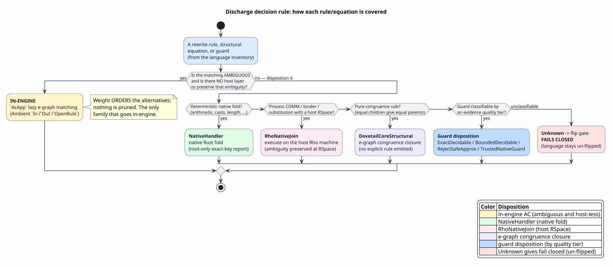
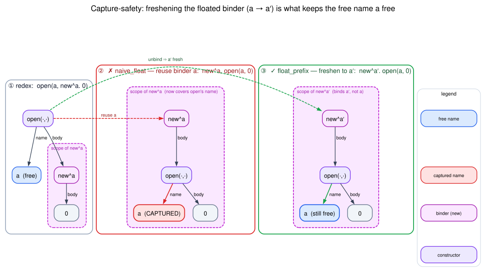
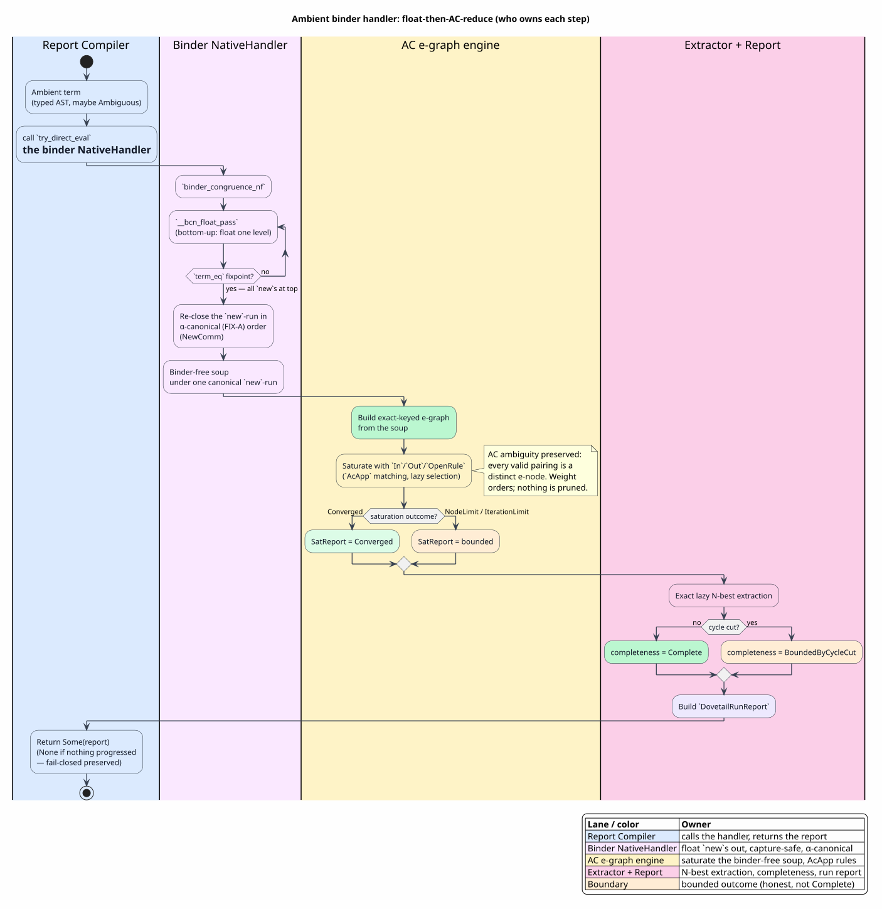

# The Ambient Binder-Congruence Handler

> **Audience & prerequisites.** This page assumes the e-graph and AC-matching
> material in [Data Model and Exact Keys](03-data-model-and-exact-keys.md) and
> [Rules and Saturation](04-rules-and-saturation.md). Every symbol and acronym is
> defined before first use here or in the [Glossary](01-concepts-and-glossary.md).

## 1. What this component is, in one paragraph

The **binder-congruence handler** is the mechanism that lets Dovetail evaluate the
**Ambient calculus** — a calculus whose structural congruence is dominated not by
data rewriting but by *binders* (the `new x. P` name-restriction operator) and the
*freshness* side conditions that govern when a binder may move. A naïve e-graph
rewrite cannot discharge those equations soundly, because moving a term under a
binder can **capture** a free name. The handler sidesteps the whole problem by a
two-step strategy — **float every `new` to the top of the term (capture-safely),
then let the in-engine AC rules reduce the now binder-free soup** — and it is
installed as Ambient's `try_direct_eval`, so the generated Dovetail report
compiler produces a *complete* report instead of failing closed on the unlowered
binder equations.

```
   { new x. (open n. 0)  |  n[0] }            ← surface Ambient term (a "soup")
            │
            │  ① binder-congruence handler: float `new x.` outward (capture-safe)
            ▼
   new x. ( { open n. 0 | n[0] } )            ← binder-free soup under one `new`
            │
            │  ② in-engine AC reduction (OpenRule, §7) on the soup
            ▼
   new x. ( { 0 | 0 } )  ≡  new x. 0          ← reduced; report is Complete
```

The rest of this page explains *why* each step is sound, *how* it is implemented,
and *where* every claim is checked (a Rust test or a zero-admission Rocq theorem).

## 2. Definitions and notation (defined before use)

| Term / symbol | Definition | Source |
|---|---|---|
| **Ambient calculus** | A process calculus of nested, mobile *ambients* `n[P]` with capabilities `in`, `out`, `open`; structural congruence includes name restriction `new x. P` and its scope laws. | Cardelli & Gordon, *Mobile Ambients*, TCS 240(1), 2000 — [doi:10.1016/S0304-3975(99)00231-5](https://doi.org/10.1016/S0304-3975(99)00231-5) |
| **binder** | A constructor introducing a bound name with lexical scope. Ambient's single binder is `new x. P` (in the macro, the `PNew` constructor `^x . P`). | — |
| **`moniker`** | The Rust crate providing safe binders: `Scope`, `Binder`, `FreeVar`, `unbind`, `Scope::new`. A `FreeVar` carries a process-global `unique_id`. | `moniker` crate |
| **free variables** `fv(t)` | The names occurring in `t` not bound by any enclosing binder. `fv(new x. P) = fv(P) \ {x}`. | — |
| **α-equivalence** `≈α` | Equality up to consistent renaming of bound names: `new x. x[0] ≈α new y. y[0]`. | — |
| **de-Bruijn index** | A nameless encoding of a bound variable as the number of binders between its use and its binder; makes α-equivalent terms *byte-identical*. | de Bruijn, Indag. Math. 34, 1972 — [doi:10.1016/1385-7258(72)90034-0](https://doi.org/10.1016/1385-7258(72)90034-0) |
| **freshness** `x # t` | "`x` does not occur free in `t`", i.e. `x ∉ fv(t)`. The nominal-logic relation governing when a binder may pass a term. | Pitts, *Nominal Logic*, Inf.&Comput. 186(2), 2003 — [doi:10.1016/S0890-5401(03)00138-X](https://doi.org/10.1016/S0890-5401(03)00138-X) |
| **capture** | The unsound event where a name *free* in a term becomes *bound* after the term is moved under a binder of the same name. The handler must avoid it. | — |
| **capture-avoiding renaming** | Freshening a binder before moving a term under it, so capture cannot occur. Realized by `moniker` `unbind` (which allocates a fresh `unique_id`). | — |
| **soup** | A parallel composition `{P₁ | P₂ | … }` — an associative-commutative *bag* of processes (`PPar`). | — |
| **disposition** | The upstream decision of how a rule/equation is covered: in-engine, host-routed, native-handler, … (see [Glossary](01-concepts-and-glossary.md)). | — |

Throughout, `C(N, P)` denotes a **prefix** — a constructor carrying a *name*
sub-term `N` and a *body* `P` (Ambient's `in n. P`, `out n. P`, `open n. P`, and
the ambient `n[P]` all share this shape). `new^x. P` denotes the single binder.

## 3. The problem: why binders defeat a plain e-graph rewrite

Ambient's structural congruence includes the **scope-extrusion** law

`  P | new x. Q  ≡  new x. (P | Q)        if   x # P    `   (i.e. `x ∉ fv(P)`)

and the binder-commutation law `new x. new y. P ≡ new y. new x. P`. An e-graph
rewrite engine matches *structure*; it has no native notion of "this subterm
binds a name, so moving another subterm next to it may capture." If the engine
applied scope extrusion as a blind rewrite, it could turn

`  x[0] | new x. 0     ⟶     new x. (x[0] | 0)`

silently **capturing** the free ambient name `x` — the `x` in `x[0]` was a free
name, and now it refers to the restricted name. The two terms are *not*
congruent. This is not hypothetical: §6 shows the project's *own legacy* `run_ascent`
backend commits exactly this unsoundness.

So binders cannot be lowered as ordinary `RewriteRule` data. They need a handler
that *knows* about freshness — which is precisely the disposition the next section
selects.

## 4. The disposition: in-engine iff ambiguous **and** host-less



PlantUML source: [figures/04-disposition-decision-tree.puml](figures/04-disposition-decision-tree.puml).

Dovetail's governing **discharge decision rule** ([Rules and Saturation](04-rules-and-saturation.md#guards-are-discharged-upstream))
is: *lower a family in-engine iff its matching is ambiguous **and** no host layer
already preserves that ambiguity; otherwise disposition it (to the host, or to a
native handler).* Ambient's binder equations sit at a specific point of that rule:

| Calculus | Binder shape | Host? | Disposition |
|---|---|---|---|
| **Ambient** | single `new^x. P` (`PNew . ^x`) | **none** — Ambient is not a message-passing calculus with an RSpace | **NativeHandler** (this page): float in-engine, AC-reduce in-engine |
| rhocalc / guarded_rho | multi-binder `new^[x̄]` + `for(…)`/COMM | **yes** — f1r3node RSpace | **RhoNativeJoin** (host-routed; binders/COMM run on the Rho machine) |

Ambient has **no host** to delegate to, and its AC redexes (which `n[…]` an
`open n` consumes) are genuinely ambiguous, so its binder congruence must be
handled *inside* Dovetail. rhocalc's binders ride COMM, which the Rho machine
already evaluates with ambiguity preserved at the RSpace layer — so rhocalc is
host-routed and must **not** get this handler.

That distinction is enforced by a single generation-time gate
(`macros/src/gen/runtime/binder_congruence.rs`):

```rust
pub(crate) fn should_emit_binder_congruence(language: &LanguageDef) -> bool {
    !language.equations.is_empty()              // there ARE binder/freshness equations
        && has_no_host_disposition(language)    // no RhoNativeJoin / channel host
        && surface_single_binder_label(language).is_some()  // a single-binder `new^x`
}
```

The third conjunct is what separates Ambient (single binder `PNew . ^x` → emits the
handler) from rhocalc (multi-binder `^[x̄]` + COMM → no single-binder label → no
handler). The pin `rhocalc_dovetail_host_routed.rs` asserts rhocalc's
`try_direct_eval` returns `None` for a process term, guaranteeing the gate never
flips a host-backed language onto the host-less binder path.

## 5. The mechanism: float-to-fixpoint, then AC-reduce

### 5.1 Float every `new` to the top — capture-safely

The handler `Proc::binder_congruence_nf` repeatedly applies one **bottom-up float
pass** until a fixpoint:

```
binder_congruence_nf(self):
    current ← float_pass(self)
    loop:
        next ← float_pass(current)
        if term_eq(next, current): return current   ← fixpoint reached
        current ← next
```

A single `float_pass` (`__bcn_float_pass`) recurses into children first, then
floats the binders one level toward the root. For a prefix `C(N, new^x. P)` it
produces `new^{x'}. C(N, P[x:=x'])` — **and the binder is freshened to `x'`**. The
freshening is not cosmetic: it is the entire capture-safety argument (§5.3). The
re-close is done with `moniker`'s safe constructor, never `from_parts_unsafe`:

```rust
// __bcn_close_new_run_canonical — re-close a run of binders around `core`:
let mut acc = core.clone();
for b in order.iter().rev() {
    acc = Proc::PNew(Scope::new(b.clone(), Arc::new(acc)));  // capture-safe re-close
}
```

`Scope::new(binder, body)` recomputes the de-Bruijn coordinates *locally* from the
binder and body, so the moved term is re-bound correctly; the bound name's
`unique_id` was already freshened by the `unbind` that opened the original scope.

### 5.2 NewComm: re-close a `new`-run in α-canonical order

When several `new`s float into a contiguous **run** `new x₁. new x₂. … new x_k. P`,
the binder-commutation law `new x. new y. P ≡ new y. new x. P` makes every ordering
congruent. To give congruent runs *one* representative (so the e-graph treats them
as the same redex), the handler re-closes the run in the order that **minimizes the
α-canonical (FIX-A) semantic key** of the fully re-closed term:

```
__bcn_close_new_run_canonical(binders, core):
    if |binders| ≤ 1 or |binders| > 6:        ← runs are short; cap avoids k! blow-up
        return close_run(binders, core)
    best ← ⊥
    for perm in permutations(binders):         ← Heap's algorithm
        closed ← close_run(perm, core)
        k ← framed_semantic_key(closed)        ← FIX-A α-canonical key (see §5.4)
        if k < key(best): best ← (k, closed)
    return best.term
```

Because the key is α-canonical, `new x. new y. P` and `new y. new x. P` map to the
same representative — NewComm is discharged by *canonical re-closing*, not by a
rewrite rule.

### 5.3 Why floating is always capture-safe (and why blocking is unnecessary)



Graphviz source: [figures/11-capture-safety.dot](figures/11-capture-safety.dot).

The diagram shows the whole argument on one witness. In the redex `open(a, new^a. 0)`
the outer `a` (the `open`'s name) is **free**; the inner `new^a` binds a *different*,
restricted `a`. Reusing the binder (②) slides the free `a` under `new^a`'s scope —
**capture**. Freshening to `a′` (③) leaves `a ≠ a′`, so the free `a` stays free.

The capture-safety property is modeled and proved in
`dovetail/formal/rocq/theories/Lowering/AmbientBinderHandler.v` over a faithful
named-process term (`NVar`, `NPrefix`, `NNew`, `NPar`), with `free_vars` mirroring
`moniker`'s and freshness defined exactly as Pitts':

`  fresh x t  :=  x ∉ free_vars(t)`

The float of a prefix is `float_prefix(N, b', x') := new^{x'}. C(N, b')`, with `x'`
the **freshened** binder. The load-bearing theorem is:

> **`float_preserves_name_free_vars`** — for all `N, b', x', v`:
> if `x' # N` and `v ∈ fv(N)`, then `v ∈ fv(float_prefix(N, b', x'))`.

Read plainly: *every name free in the prefix's name `N` stays free after the
float.* A fresh binder `x'` cannot capture any `v ∈ fv(N)`, because `x' # N` means
`x' ≠ v`. Its dual, `float_preserves_body_free_vars`, shows nothing free in the
body is captured or dropped either. Together they certify the float neither
captures nor loses a free name.

This yields **design simplification #1**: the originally-planned *blocking* guard
(FIX-B — refuse to float when `x ∈ fv(P)`) is **unnecessary**. Because `unbind`
freshens the binder, the float is capture-avoiding α-renaming and is *always*
sound — there is no situation to block. The Rust test
`prefix_float_does_not_capture_a_shared_name` constructs the shared-identity redex
`open(x, new(x, 0))` and asserts (via `free_vars`) that the channel `x` stays free
after the float; capture-avoidance comes from the **re-close**, not from a guard.
The supporting lemma `new_is_fresh_in_its_binder` (`new^x. b` is always fresh in
`x`) is *why* the would-be guard is vacuous.

**Design simplification #2: float-once is already a fixpoint.** A bottom-up float
moves *every* `new` to the top, leaving the soup binder-free. The AC rules (§7)
only rearrange ambients; they never introduce a new `new`. So one full float
normalization reaches the fixpoint — no float↔AC interleaving loop is needed. (The
`__fuel` bound in `binder_congruence_nf` is a paranoia backstop; the `term_eq`
check is the real terminator, and each float strictly decreases the "new-depth"
potential Σ over `new`s of the constructor nodes between the `new` and the root.)

### 5.4 FIX-A: α-equivalent binders must share an e-graph key

For the e-graph to treat `new x. x[0]` and `new y. y[0]` as the *same* redex, they
must share a `ContentKey`. But `moniker::Scope` carries a process-global
`FreeVar::unique_id` that differs between them, so the *structural* hash would
split them. FIX-A makes the **exact-key path α-canonical** — a binder contributes
`frame(arity) · key(de-Bruijn body)`, excluding the binder's `unique_id` — while
leaving the structural `Hash`/`Eq`/`Ord` untouched (Ascent's identity must not
change). The full treatment, with the three e-graph keys it interacts with, is in
[Data Model and Exact Keys — The α-Canonical Binder Key](03-data-model-and-exact-keys.md#the-α-canonical-binder-key-fix-a).

## 6. The legacy `run_ascent` backend is capture-**un**safe (a finding)

The contrast theorem makes the bug in the legacy path precise. The naïve float
reuses the *original* binder (no freshening) — exactly what `from_parts_unsafe` +
structural `normalize()` does in `run_ascent`:

`  naive_float(N, b, x) := new^x. C(N, b)`     ← same `x`, not freshened

> **`naive_float_can_capture`** — there exist `N, b, x, v` with `v ∈ fv(N)` and
> `v ∉ fv(naive_float(N, b, x))`.
> *Witness:* `N = x` (the name `0`), binder `x = 0`, body `0`. The name `0` is free
> in `N` but **captured** by `new^0` in the naïve float.

Its companion `fresh_float_avoids_that_capture` shows that for the *same* witness,
the freshened float `float_prefix(0, 0, 1)` keeps `0` free. So the difference
between the handler and the legacy backend is a single theorem: **the handler
freshens (`unbind`), `run_ascent` does not.** This is the formal twin of the
empirically-verified `run_ascent` capture-unsoundness on Ambient's binder
equations, and it is the principled reason the Dovetail handler replaces it.

## 7. The rewrite rules this handler discharges

Ambient's binder/freshness equations and AC reductions split cleanly by
disposition. The handler owns the **binder congruences** (by floating + canonical
re-closing); the **in-engine AC rules** own the soup reductions; the e-graph's
built-in congruence closure owns the structural congruences.

### 7.1 Binder congruences — discharged by the float (§5)

| Rule | Equation | How discharged |
|---|---|---|
| **NewComm** | `new x. new y. P ≡ new y. new x. P` | canonical re-close of the `new`-run (§5.2) |
| **ScopeExtrusion** | `P \| new x. Q ≡ new x. (P \| Q)`, `x # P` | float `new x.` out of the soup; `x'` fresh ⇒ side condition vacuous |
| **InNew / OutNew / OpenNew** | `C(n, new x. P) ≡ new x. C(n, P)`, `x # n` | float `new x.` past the prefix (`float_prefix`) |
| **AmbNew** | `n[ new x. P ] ≡ new x. n[P]`, `x # n` | float `new x.` past the ambient wrapper |

The `x # n` / `x # P` side conditions are discharged *by construction*: the floated
binder is freshened (`new_is_fresh_in_its_binder` + `float_preserves_name_free_vars`),
so it is fresh in every term it floats past. The multiset version of the side
condition — "fresh in the parallel bag iff fresh in every member" — is
`fresh_par_iff` (`fresh x (NPar ts) ↔ Forall (fresh x) ts`), the full-bag check
with no representative shortcut.

### 7.2 AC reductions — discharged in-engine (see [Rules and Saturation](04-rules-and-saturation.md#associative-commutative-matching))

After floating, the soup is binder-free and the AC rules fire as ordinary
`AcApp` rewrites over the `par` bag:

| Rule | Reduction (over the parallel bag, modulo AC) |
|---|---|
| **InRule** | `{ n[ { in(m,0) } ] \| m[0] }  ⤳  { m[ { n[{0}] \| 0 } ] }` |
| **OutRule** | `{ m[ { n[ { out(m,0) } ] } ] }  ⤳  { m[…] \| n[{0}] }` |
| **OpenRule** | `{ open(n,A) \| n[B] \| …rest }  ⤳  { A \| B \| …rest }` |

`…rest` is the `AcApp` `rest`-complement — the unselected bag members, bound to a
fresh canonical bag node (diagram ④ in [Rules and Saturation](04-rules-and-saturation.md#associative-commutative-matching)).

### 7.3 Structural congruences — the e-graph's job

Parallel-composition associativity/commutativity/identity (`P|Q ≡ Q|P`,
`(P|Q)|R ≡ P|(Q|R)`, `P|0 ≡ P`) are the AC normalization of the bag itself
(canonical sort + flatten + drop-`0`); ambient and `new` congruence
(`P ≡ P' ⇒ n[P] ≡ n[P']`, etc.) are ordinary e-graph **congruence closure**
(equal children imply equal parents). Neither needs a rule.

## 8. Composition: where the handler sits in the pipeline



PlantUML source: [figures/11-binder-float-ac-swimlane.puml](figures/11-binder-float-ac-swimlane.puml).

The handler is Ambient's `try_direct_eval`; the generated Dovetail report compiler
calls it before building the report. The swimlane above shows which actor owns each
step (Report Compiler ‖ Binder NativeHandler ‖ AC e-graph engine ‖ Extractor); the
text version of the same flow:

```
 Ambient surface term  (typed AST, possibly Ambiguous with alternatives)
        │
        │  binder_congruence_nf_term(self) -> Option<Proc>     [§8, the wrapper]
        │     maps binder_congruence_nf over every alternative;
        │     returns Some iff some alternative made progress (else None ⇒ fail-closed)
        ▼
 binder-free soup under a (canonical) `new`-run            ── float, §5
        │
        │  dovetail_report_for(...)  builds e-graph, saturates with the AC rules
        ▼
 e-graph + saturation  (OpenRule / InRule / OutRule fire over the soup)   ── §7.2
        │
        │  exact lazy N-best extraction  (weight orders alternatives, never prunes)
        ▼
 DovetailRunReport   { roots, terms, derivation_edges, completeness = Complete }
```

The wrapper preserves `Ambiguous` alternatives (it maps the NF over each) and
preserves fail-closed semantics (`None` when nothing progressed), so the handler
composes with the rest of Dovetail without weakening either invariant. Because the
soup that reaches saturation is binder-free, the AC half is exactly the in-engine
AC family of [Rules and Saturation](04-rules-and-saturation.md#associative-commutative-matching)
— no binder logic leaks into the e-graph.

## 9. Verification map

Every claim above is checked. Formal model (zero-admission Rocq,
`AmbientBinderHandler.v`; `Require`s only the Coq stdlib):

| Theorem | Establishes |
|---|---|
| `float_preserves_name_free_vars` | the float captures no name free in the prefix's name (capture-safety) |
| `float_preserves_body_free_vars` | the float drops/captures no name free in the body |
| `naive_float_can_capture` | the legacy non-freshening float **can** capture (the `run_ascent` bug) |
| `fresh_float_avoids_that_capture` | the freshened float avoids that capture on the same witness |
| `new_is_fresh_in_its_binder` | `new^x. b` is fresh in `x` ⇒ the would-be blocking guard is vacuous |
| `fresh_prefix_iff`, `fresh_par_iff`, `free_vars_prefix` | the freshness algebra the ScopeExtrusion multiset gate computes |

Rust tests:

| Test (file) | Pins |
|---|---|
| `prefix_float_does_not_capture_a_shared_name` (`ambient_binder_handler.rs`) | the shared-name redex `open(x,new(x,0))` keeps `x` free after the float |
| `ambient_dovetail_compiler_flips_via_native_handler_and_in_engine_ac` (`ambient_dovetail_flip.rs`) | an `OpenRule` redex now yields a **Complete** report (the flip) |
| `ambient_dovetail_reduces_an_in_rule_redex` | the `InRule` AC reduction fires in-engine |
| `ambient_dovetail_flips_a_scope_extrusion_redex` | `new(x,·)` floats out of the parallel bag and the report compiles |
| `alpha_equivalent_binders_share_semantic_key` (`fix_a_alpha_canonical_semantic_key.rs`) | FIX-A: `λx.x ≈ λy.y` share one key |
| `rhocalc_try_direct_eval_has_no_in_engine_binder_handler` (`rhocalc_dovetail_host_routed.rs`) | the gate does **not** emit the handler for host-routed rhocalc |

Build the proof:

```bash
make -C formal check-capped FORMAL_CAPPED_TARGET=rocq-dovetail \
     FORMAL_MEMORY_MAX_BYTES=34359738368        # 32 GiB ≥ FORMAL_MEMORY_HIGH (30 GiB)
```

## 10. Design rationale, distilled

| Decision | Why |
|---|---|
| Float-then-reduce (not rewrite the equations) | binder equations are not sound as blind structural rewrites (§3); floating localizes all capture reasoning to one freshened re-close |
| `unbind`/`Scope::new`, never `from_parts_unsafe` | freshening is the entire capture-safety proof (§5.3, §6); the unsafe constructor is the legacy bug |
| No blocking guard (FIX-B dropped) | freshening makes the float *always* sound ⇒ nothing to block (`new_is_fresh_in_its_binder`) |
| Single float normalization (no float↔AC loop) | floating moves all `new`s up; AC rules add none back ⇒ float-once is a fixpoint |
| α-canonical key only on the exact-key path (FIX-A) | the e-graph must see α-equivalent binders as one redex; Ascent's structural identity must stay structural |
| In-engine, not host-routed | Ambient has no RSpace host and its AC redexes are ambiguous, so the decision rule puts it in-engine (§4) |

## 11. Cross-references

- [Concepts and Glossary](01-concepts-and-glossary.md) — binder, freshness, disposition, AC vocabulary.
- [Data Model and Exact Keys](03-data-model-and-exact-keys.md) — the three e-graph keys and the FIX-A α-canonical binder key.
- [Rules and Saturation](04-rules-and-saturation.md) — `AcApp` matching, the `rest`-complement, upstream guard discharge.
- [Runtime-Facing Reports](10-runtime-facing-reports.md) — the `DovetailRunReport` this handler ultimately produces.
