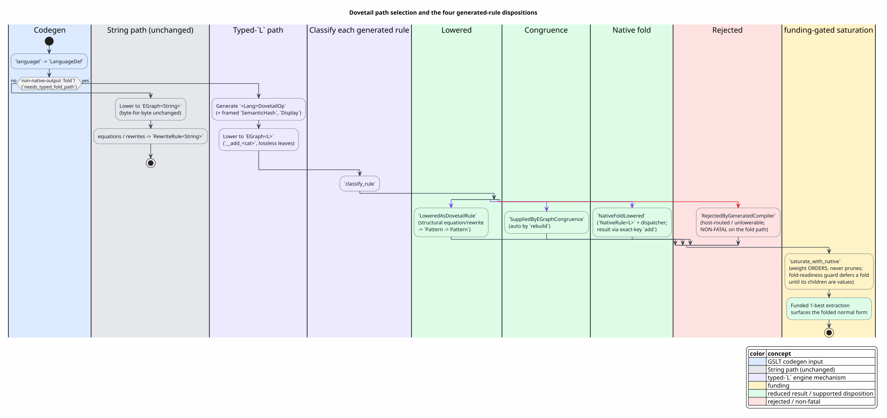

# 12 — Native-Fold Reduction (the typed-`L` path)

This document explains how Dovetail reduces a language's **`fold` rules** — the rules whose
right-hand side is a *native-computed* term rather than a `Pattern → Pattern` rewrite — inside
its funded saturation. It is the architecture-suite view; the full design (theory, literate
pseudocode, rejected alternatives) is
[`docs/design/dovetail-engine/oslf-gslt-native-fold-reduction.md`](../../design/dovetail-engine/oslf-gslt-native-fold-reduction.md),
and the binder counterpart is [11 — Binder-Congruence Handler](11-binder-congruence-handler.md).

## Terms used here

Every symbol/term is defined or glossary-linked before use. **[G]** = defined in
[01 — Concepts and Glossary](01-concepts-and-glossary.md).

| Term | Definition |
|---|---|
| fold rule | A term-constructor rule (`eval_mode = Fold`) whose body `![{ … }]` computes a result by running a Rust expression on its reduced children (e.g. RhoCalc `int(a,w) : Proc`, Calculator `concat(a,b) : List`). |
| native-output vs non-native-output fold | A fold whose result category has a native type (`Int`, …) vs an object/collection category (`Proc`/`List`/`Map`/`Bag`). |
| the cast-eval gap | After the Ascent retirement, non-native-output fold bodies (`numeric_dispatch::rho_proc_*`/`calc_*`) reduced **nowhere** — their RHS was emitted only into the retired Datalog backend. |
| typed op-enum `L` | The generated per-language `<Lang>DovetailOp` enum the e-graph carries on the fold path: one variant per `(category, constructor)`, literal/var payloads inline (lossless). |
| native-computed rewrite | A rewrite whose RHS is *computed* by a trusted Rust function, not by instantiating a pattern. Carried as a `NativeRule<L>` + a `NativeOpId` tag. |
| dispatcher | The one compiled-in escape `Fn(NativeOpId, &mut EGraph<L>, &Subst) → Option<EClassId>` that runs the fold bodies. |
| fold-readiness guard | The three-way classifier deciding whether a fold may fire on a child class: **value op → fire**, **fold-redex op → defer**, **`Var` → defer**. |
| `NativeFoldLowered` | The generated-rule disposition for a native fold (its single requirement is the exact content key `ReqExactContentKey`). [G] disposition. |
| saturation `→*` | Iterative congruence-closing growth of the e-graph to a fixpoint or budget. [G] |
| Funding | `is_funded(Δ, Σ, margin) = Δ + margin ≤ Σ` — the cost discipline gating which rewrites fire; here `Σ` is the node budget. [G] |

## 1. Why a separate path

The production lowering carries `EGraph<String>`: op labels plus literal leaves stringified via
lossy `{:?}` Debug, with no inverse back to a typed term. That is sufficient for structural
equations/rewrites (whose RHS is a pattern), but a **fold** must run a Rust body on *typed,
already-reduced* children and add a *typed* result — which the lossy String node cannot
reconstruct. It also hides a latent bug: a `Map`/`Bag` node keyed by `{:?}` (hash/insertion
order) violates the `Eq ⇔ SemanticHash` contract, so two equal maps can fail to dedup.

Dovetail therefore selects, per language, between two lowerings:

> 

A language is routed to the **typed-`L` path** iff it has at least one non-native-output fold
(`needs_typed_fold_path`); every other language keeps the unchanged `EGraph<String>` path. The
two are *additive* — the String path is byte-for-byte untouched, so the committed
binder/structural flips (Ambient, Lambda, …) do not regress.

## 2. The typed-`L` substrate

The engine (`EGraph<L>`, `Extractor`, `report_from_extraction`) is already **generic over `L`**
(it needs only `L: Clone + Eq + Hash + SemanticHash`, `+ Display` for projection), so the
typed path changes only codegen:

- **op-enum** — `<Lang>DovetailOp` carries literal payloads inline (`Int_NumLit(i64)`,
  `Map_MapLit(HashMapLit)`, …), so reconstruction is total and lossless (no reify map — a reify
  map is unsound under `merge`; see the design doc §8). Its `unsafe impl SemanticHash` writes a
  **framed discriminant** (cross-variant injectivity) followed by `Eq`-agreeing payload bytes:
  integers two's-complement LE, big-numerics/fixed via their canonical bytes, and — the latent-
  bug fix — `Map`/`Bag` via their **sorted** `Display`.
- **lowering** — `__mettail_dovetail_add_<cat>` is the typed analogue of
  `category_lowering` ([04 — Rules and Saturation](04-rules-and-saturation.md)); it preserves
  the FIX-A α-canonical binder-arity key ([03 — Data Model and Exact Keys](03-data-model-and-exact-keys.md))
  and the AC-bag canonical order ([04](04-rules-and-saturation.md)).
- **reconstruction** — `__mettail_dovetail_build_<cat>_d`: the inverse, walking a chosen
  derivation tree back to a typed `<Cat>`. Total for the fold-reachable sub-language; spine
  sentinels reconstruct to `None` (the stuck case).

## 3. Folds as funded native rewrites

A fold lowers to a `NativeRule<L> { lhs : Pattern::app(L::<Cat>_<Label>, [vars…]), op, label }`,
and the dispatcher's `APPLY-NATIVE-FOLD` arm:

1. binds each child class from the match's `Subst`, gating the **object/collection** children on
   the fold-readiness guard (`class_is_fold_value` — a no-extraction scan for a value op);
2. reconstructs the children — in ONE `Extractor` scope that drops before the mutable `add`
   (the borrow discipline) — binding scalar/object params as `&Cat` and collection params as
   the inner native value;
3. runs the user body (reviving `rho_proc_*`/`calc_*`), wrapping a native-output result in its
   literal constructor; and
4. `add`s the typed result and lets saturation `merge` it into the redex class.

The **fold-readiness guard** is what makes this sound: saturation fires a native rule whenever
its LHS matches, with no child-before-parent ordering. Without the guard, `int(Add(1,2), 8)`
could dispatch while `Add(1,2)` is unfolded, and the body would fold a non-numeric child to a
spurious `Proc::Err` and merge it. The guard **defers** a fold until every object child is a
value op, so the inner `Add` fires first, congruence shares the `3`, and only then does the cast
fire — matching the retired Ascent `fold_proc(l, lv)` premise, which always bound `lv` to the
*fully folded* child.

### Progress weight and funding

Extraction must surface the *reduced* form. The typed report extractor weighs a folded value op
strictly below its redex op (`__weigh`: value `1.0`, fold-redex `100.0`), so the funded 1-best
extraction selects the normal form once the fold has fired. This is the funding cost discipline
at work: weight **orders, never prunes** (substructural no-contraction), and the node budget
`Σ` bounds saturation. The fold transition's funding predicate is
`fold_transition_funded(Δ, margin, Σ) = (Δ + margin ≤ Σ)`, satisfying the four funding laws
(`sound`, `supply-monotone`, `reject-underfunded`, decidable) and bridging to the saturation
budget: a funded fold reaches `Converged`, never `BudgetOverflow`.

## 4. The non-fatal three-way gate

For a fold-bearing language the report gate is **three-way** rather than binder-or-plain:

| gate | language | behavior |
|---|---|---|
| binder-handler | Ambient | float `new`s outward, then in-engine AC ([11](11-binder-congruence-handler.md)) |
| **fold (non-fatal)** | RhoCalc, Calculator, … | drop the native-eval short-circuit; residual host-routed `unsupported` rules (`Comm`, `Extrude`) are **not fatal** — they carry no fold body, match no fold LHS, and stay unreduced, correct |
| plain (fail-closed) | Lambda, BaseMath, … | the existing fail-closed gate is preserved (an unlowered binder/substitution rule still errors) |

The non-fatal fold gate is essential: RhoCalc's generated report carries a non-empty
`unsupported` set (the host-routed COMM/scope-extrusion rules), so the old fail-closed gate would
have errored *before any fold ran*. Lambda still fails closed because it has no object-input
fold — the predicate that selects the non-fatal path is structural, never a per-language name.

## 5. Worked example: `int(1 + 2, 8)`

`int(1 + 2, 8)` lowers to `IntBinProc(Add(CastInt 1, CastInt 2), 8)`:

1. iteration 1 — `IntBinProc`'s object child `a = Add(…)` is a fold-redex (not value) → the cast
   **defers**; the `Add` native rule fires (`1 + 2 → CastInt 3`), merging `CastInt 3` into `a`'s
   class;
2. iteration 2 — `a`'s class now holds a value op (`CastInt 3`) → the cast fires:
   `rho_proc_int_bin(&CastInt 3, 8) → CastInt 3`;
3. extraction — the funded 1-best of the root class surfaces `CastInt(NumLit 3)`, the normal
   form, because the value op weighs below the `IntBinProc` redex.

The disposition matrix (`languages/tests/rhocalc_dovetail_fold.rs`, 6/6) pins every case:
fire-recurse (above), fire-once (`int(7, 64)`), defer-on-var (`int(x, 8)` stays unreduced),
fire-to-`Err` (`int("abc", 8)` — a string *value* the body rejects), and no-match (`0`).

## 6. Formal verification

[07 — Formal Verification and Tests](07-formal-verification-and-tests.md) lists the proofs; the
native-fold-specific, zero-admission theorems are:

- **`GeneratedReportCompiler.v`** — the `NativeFoldLowered` disposition: a `GNativeFold` rule is
  dispositioned native-fold iff structurally supported (`native_fold_lowered_requires_structural_support`),
  every requirement of a structural native fold is the exact content key
  (`native_fold_requirements_are_exact_key`), and the partition is total/exact across the four
  dispositions.
- **`DovetailSaturation.v`** — native-fold soundness and funding: `native_generated_sound` and
  `native_fold_saturation_sound` (given the native body computes the GSLT value — a *threaded
  premise*, not an axiom — saturation preserves soundness), `native_refire_is_noop` (a re-fired
  fold whose result is already present adds nothing, since a `Cast*` normal form re-matches no
  fold LHS), and the funding laws + the funding-to-budget bridge.

The native-function soundness is the one trust boundary — the same boundary native eval always
relied on — and it is named honestly as a hypothesis rather than hidden.

## Cross-references

- Design (theory, pseudocode, rejected alternatives): [`oslf-gslt-native-fold-reduction.md`](../../design/dovetail-engine/oslf-gslt-native-fold-reduction.md)
- Binder counterpart: [11 — Binder-Congruence Handler](11-binder-congruence-handler.md)
- Rho integration (how a flipped language surfaces folded reports): the
  [rho-native-integration suite](../rho-native-integration/README.md)
  (`03-dovetail-rewrite-semantics.md`, `06-correctness-and-coverage.md`).
