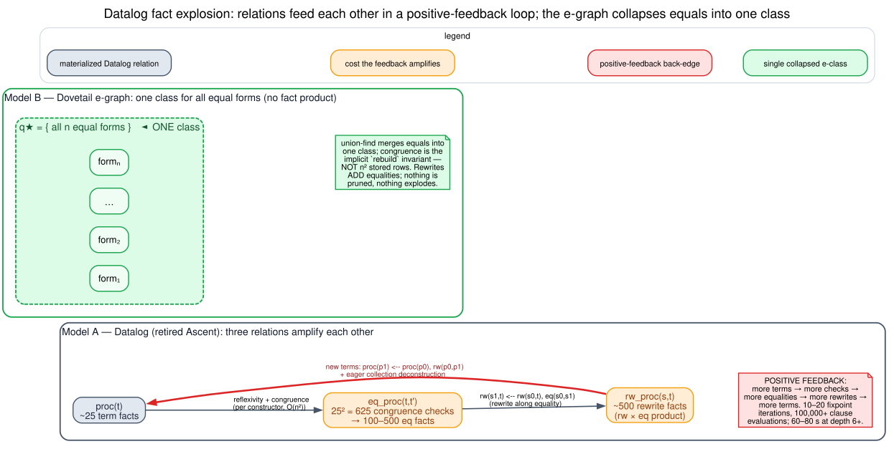
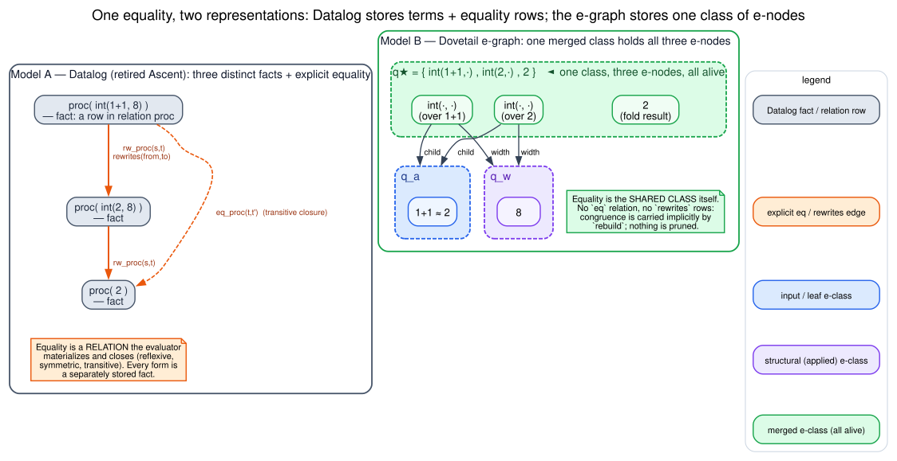
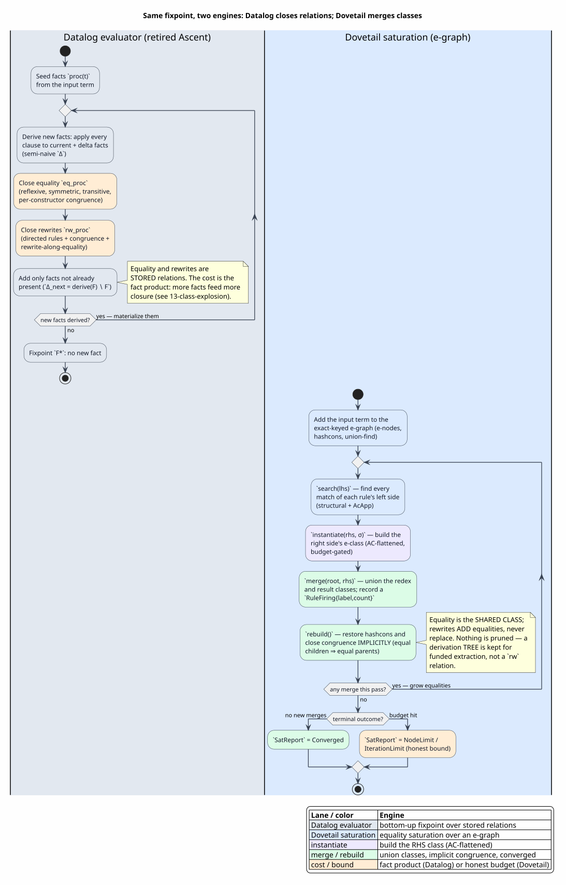

# E-Graph Rewrites vs Datalog Rewrites

## 1. Purpose

This page explains, pedagogically and from first principles, how Dovetail's
**e-graph equality-saturation** model of rewriting differs from the
**Datalog term-relation** model used by the retired Ascent engine. The two
engines compute the *same* rewrite closure, but they represent it with opposite
data structures, and that single representational choice drives everything
downstream: termination behavior, the failure mode under growth, what a query
can ask, and how cost-accounting weights attach.

The one-sentence contrast (the [executive-brief](00-executive-brief.md) thesis,
restated): **Ascent materializes relation facts through generated Datalog;
Dovetail merges terms into equivalence classes in an exact-keyed runtime
e-graph.** Datalog *stores* equality as rows in an `eq` relation it must close;
Dovetail *is* equality — the shared e-class itself — and carries congruence as
an implicit invariant rather than as stored rewrite rows.

This is a comparison page. The mechanics of each Dovetail piece live in
[04 - Rules and Saturation](04-rules-and-saturation.md) (matching, saturation),
[05 - Extraction and Weights](05-extraction-and-weights.md) (derivations,
weights), and [03 - Data Model and Exact Keys](03-data-model-and-exact-keys.md)
(e-classes, e-nodes, content keys). The retired Ascent shapes are quoted from
the historical design records cited in [§9](#9-cross-references).

## 2. Definitions Before Use

The pedagogy mandate is *define every symbol and term before it appears*. The
table marks which terms are already defined in
[01 - Concepts and Glossary](01-concepts-and-glossary.md) (so this page does not
redefine them, only relates them).

| Term | Definition | In glossary? |
|---|---|---|
| Datalog | A bottom-up logic-programming language: a finite set of `head <-- body` rules over relations, evaluated to a least fixpoint. Ascent ([ASCENT-2022](references.md#ascent-2022)) is a Datalog engine embedded in Rust via macros. | new here |
| fact | One ground tuple in a relation — a single row, e.g. `proc( int(2,8) )` asserting that `int(2,8)` is a known term. | new here |
| relation | A named set of facts of a fixed arity, e.g. `proc/1`, `eq_proc/2`, `rw_proc/2`. The whole computation is "grow these relations until nothing new is derivable". | new here |
| bottom-up / semi-naive fixpoint | Datalog's evaluation strategy: repeatedly apply every rule to the facts derived so far, adding new facts, until an iteration adds none. *Semi-naive* means each iteration only revisits rules with at least one premise among the just-added delta `Δ`, so old facts are not re-joined against each other every pass. | new here |
| e-graph | A graph of equivalence classes (e-classes) of expression nodes (e-nodes); Dovetail's core data structure ([EGG-2021](references.md#egg-2021)). | yes |
| e-class | An equivalence class of terms, identified by `EClassId`; all members are provably equal. | yes |
| e-node | A labeled operator with zero or more *child e-classes* (not child e-nodes). | yes |
| congruence closure | The rule "if children are equal, then same-operator parents are equal" ([NELSON-OPPEN-1980](references.md#nelson-oppen-1980)). | yes |
| equality saturation | Iterative growth of the e-graph by *adding* equalities until a fixpoint or a bound stops the run; rewrites never replace a term ([EGG-2021](references.md#egg-2021), [TATE-EQSAT-2009](references.md#tate-eqsat-2009)). | yes |
| hashcons | The `memo: HashMap<ENode, EClassId>` that gives each distinct e-node a single identity, so structurally identical nodes are shared rather than duplicated. | new here |
| union-find | The disjoint-set forest behind `merge`/`find` that makes "are these two classes the same?" near-constant time after path compression. | new here |
| navigable rewrite relation `rewrites(from,to)` | An explicitly stored, queryable relation pairing each term with each term it rewrites to in one step — what the Ascent path materialized as `rw_proc`, and what an e-graph deliberately does *not* keep (see [§6](#6-what-each-engine-can-and-cannot-answer)). | new here |
| derivation tree | A chosen e-node plus one chosen derivation for each child e-class — a *tree*, recorded by extraction, not a flat term-to-term relation. | yes (derivation) |
| extraction | Enumeration of derivation trees from an e-class, ordered by weight, complete or cycle-bounded. | yes |
| class explosion | The Datalog failure mode where the `proc` × `eq` × `rw` relations feed each other in a positive-feedback loop and the materialized fact count grows super-linearly (see [§3.4](#34-the-class-explosion-failure-mode)). | new here |

Symbols used below (`σ`, `b⋆`, `⊆`, `⇒`, `≈`, `→`, `∪`, `∖`, `≡`, `⊗`, `⊕`,
`0̄`, `1̄`, `Fᵢ`, `Δ`) are all defined in the
[glossary Symbols table](01-concepts-and-glossary.md#symbols); this page reuses
them unchanged.

## 3. Model A — The Datalog Term-Relation (Retired Ascent)

In the Datalog model a rewrite system is a set of *relations* over distinct
terms, grown to a least fixpoint. Each distinct term is a separate fact, and
both *equality* and *one-step rewriting* are explicit, materialized relations
the evaluator must derive and close.

### 3.1 Three interacting relations

The generated Ascent program (quoted from
`docs/design/made/ascent_generation.md`) declared, per process category, three
relations:

```text
relation proc(Proc);        // Terms explored      (one row per distinct term)
relation eq(Proc, Proc);    // Equality relation   (an `eqrel` union-find pair)
relation rw(Proc, Proc);    // Rewrite relation    (one row per from→to step)
```

Term *exploration* itself is a closure rule — a term is "explored" if it is the
target of a rewrite or an equality of an explored term, or a sub-term spliced
out of a collection:

```text
proc(p1) <-- proc(p0), rw(p0,p1);
proc(p1) <-- proc(p0), eq(p0,p1);
proc(*p.clone()), proc(*q.clone()) <--
    proc(p0), if let Proc::PPar(p,q) = p0;
```

### 3.2 Equality written out as explicit closure

Equations become facts in `eq`, and the *equivalence-relation laws* are written
out as ordinary clauses the evaluator must run to a fixpoint:

```text
// Reflexivity, symmetry, transitivity
eq(p,p) <-- proc(p);
eq(q,p) <-- eq(p,q);
eq(p,r) <-- eq(p,q), eq(q,r);

// A structural equation, e.g. parallel commutativity  P|Q == Q|P
eq(p0,p1) <--
    proc(p0),
    if let Proc::PPar(p,q) = p0,
    let p1 = Proc::PPar(q.clone(), p.clone());
```

The transitivity clause `eq(p,r) <-- eq(p,q), eq(q,r)` is the one to watch: it
is a self-join of the `eq` relation against itself, quadratic in the size of an
equivalence class.

### 3.3 Congruence written out per constructor

There is no implicit "equal children imply equal parents". Each constructor
gets its *own* congruence clause, both for equality and for rewriting. The real
generated shapes:

```text
// Congruence: a rewrite inside a parallel composition lifts to the whole
rw(s,t) <--
    proc(s),
    if let Proc::PPar(s0,p) = s,
    rw(**s0, t0),
    let t = Proc::PPar(Box::new(t0.clone()), p.clone());

// Congruence: a rewrite inside a binder, with capture-avoiding re-close
rw(s,t) <--
    proc(s),
    if let Proc::PNew(scope) = s,
    let (x, p) = scope.clone().unbind(),
    rw(*p, t0),
    let new_scope = mettail_runtime::Scope::new(x.clone(), Box::new(t0.clone())),
    let t = Proc::PNew(new_scope);

// Extension: rewrite is closed along equality
rw(s1,t) <-- rw(s0,t), eq(s0,s1);
```

For **collection** (associative-commutative) operators the situation is worse:
because a base rewrite can match any sub-multiset of a bag, the generator
synthesizes *projection relations* — one per element pattern that could appear
inside a collection — and a congruence rule lifts each base rewrite into every
larger collection (quoted from
`docs/archive/phase-6/CONGRUENCE-DRIVEN-PROJECTIONS.md`):

```text
// One congruence rule lifts ALL base rewrites into a parallel bag…
if S => T then (PPar {S, ...rest}) => (PPar {T, ...rest});

// …realized by generated projection relations like:
rw_proc(parent, result) <-- ppar_contains(parent, elem), rw_proc(*elem, ...);
```

So AC matching in the Datalog model is *more* materialized relations
(`ppar_contains`, the per-pattern projections), each of which is itself closed.

### 3.4 The class-explosion failure mode



Graphviz source: [figures/13-class-explosion.dot](figures/13-class-explosion.dot).

The three relations do not just grow — they *amplify each other*. The measured
growth on the Rholang 7-process / 3-communication test case (quoted from
`docs/design/exploring/performance.md`) was:

| Stage | Relation | Count produced |
|---|---|---|
| seed + exploration | `proc` | ~25 term facts |
| reflexivity + per-constructor congruence | `eq_proc` | `25² = 625` congruence checks `→` 100–500 eq facts |
| directed rules `×` rewrite-along-equality | `rw_proc` | ~500 rewrite facts |
| fixpoint | (all three) | 10–20 iterations, **100,000+ clause evaluations** |

The root cause named in that analysis is a **positive-feedback loop**:

1. a new term is derived (`proc(p1) <-- proc(p0), rw(p0,p1)`, plus eager
   collection deconstruction);
2. more `proc` facts trigger more reflexivity and per-constructor congruence
   `→` more `eq_proc` facts (the `25²` product);
3. more `eq_proc` facts make more rewrite variants via
   `rw(s1,t) <-- rw(s0,t), eq(s0,s1)` `→` more `rw_proc` facts;
4. more `rw_proc` facts derive more new terms `→` back to step 1.

The wall-clock cost of that loop, recorded in
`docs/archive/phase-3/SESSION-EQUATIONAL-REWRITE.md`, was roughly 1 second for
shallow terms but **60–80 seconds for complex terms at rewrite depth 6+**. The
explosion is intrinsic to materializing equality and rewriting as relations:
the cheapest way to make the closure fast is to *stop storing so many facts*,
which is exactly the structural move the e-graph makes for free.

### 3.5 What the Datalog model gives you

The redeeming property of Model A is that `rw_proc` *is* a navigable
`rewrites(from,to)` relation. After the fixpoint you can directly query "what
does this term rewrite to?", enumerate one-step successors, find normal forms
(`!rw_proc(result, _)`), and walk reachability paths — because every one-step
edge was materialized. The old REPL did exactly this: its step view read
`prog.rw_proc.iter()` straight out of the solved program. [§6](#6-what-each-engine-can-and-cannot-answer)
returns to this, because it is the one dimension where the e-graph asks for work
the Datalog model got for free.

## 4. Model B — E-Graph Equality Saturation (Dovetail)

In the e-graph model a rewrite system grows a single data structure of
equivalence classes. Equality is not a relation; it *is* the class. Congruence
is not per-constructor clauses; it is one implicit invariant restored by
`rebuild`.



Graphviz source: [figures/13-datalog-vs-egraph-rep.dot](figures/13-datalog-vs-egraph-rep.dot).

### 4.1 Merge into classes (union-find), not rows into a relation

Adding a term hashconses its e-nodes into the `memo` map (`dovetail/src/egraph.rs`,
`add` / the `memo: HashMap<ENode<L>, EClassId>` field). Discovering an equality
calls `merge(a, b)` (`egraph.rs`), which unions the two classes in the
union-find forest; `find` (`egraph.rs`) returns the canonical representative.
There is no `eq` relation to close: the equivalence-relation laws
(reflexivity, symmetry, transitivity) are *structural properties of union-find*,
not derived facts. A class with `k` members costs `O(k·α)` to maintain, not the
`O(k²)` of the Datalog transitivity self-join.

### 4.2 Congruence is implicit in `rebuild`

After any batch of merges, `rebuild` (`egraph.rs`) re-canonicalizes every memo
entry and merges any two e-nodes that became congruent (same operator, now-equal
children). This is the single mechanism that replaces *every* per-constructor
congruence clause of [§3.3](#33-congruence-written-out-per-constructor):
`f(a) ≈ f(b)` follows automatically once `a ≈ b`, for *every* operator `f`, with
no generated clause and no quadratic self-join. The basis is classical
congruence closure ([NELSON-OPPEN-1980](references.md#nelson-oppen-1980)).

### 4.3 A rewrite ADDS an equality; it never replaces

Saturation (`saturate_with_native`, `dovetail/src/rules.rs`) iterates: for each
`RewriteRule<L>` it calls `search(&rule.lhs)` (`rules.rs`) to find every match,
`instantiate(&rule.rhs, &subst)` (`rules.rs`) to build the right-hand class, and
`merge(root, rhs)` to union the redex with the result. Crucially the redex
*survives* — both forms remain live e-nodes in one class. This is the
non-destructive law restated in [04 - Rules and Saturation](04-rules-and-saturation.md#monotonicity):
`Fᵢ ⊆ Fᵢ₊₁`. Nothing is pruned, so ambiguity and equal-cost alternatives are
preserved by construction, which is the property the
[executive brief](00-executive-brief.md#design-thesis) calls
*weight orders alternatives; weight never prunes alternatives*.

### 4.4 AC and binders: canonical keys, not projection relations

Where the Datalog model synthesizes projection relations for collections, the
e-graph matches associative-commutative operators directly via the
`AcApp{op, fixed, rest}` pattern over a multiset `b⋆`, selecting a sub-multiset
`s⋆ ⊆ b⋆` **lazily** (`lazy_ac_select`) and flattening the result into one
canonical bag — the full mechanism is
[04 - Associative-Commutative Matching](04-rules-and-saturation.md#associative-commutative-matching).
Binders use α-canonical de-Bruijn keys so α-equivalent bodies are byte-identical
(the FIX-A key in [03](03-data-model-and-exact-keys.md#the-α-canonical-binder-key-fix-a)
and the [Binder-Congruence Handler](11-binder-congruence-handler.md)). In both
cases the unordered/binding structure is folded into the *key*, so equal forms
land in the same class with no extra stored relation.

### 4.5 Recorded evidence: a `RuleFiring` count plus a derivation tree

The e-graph keeps two kinds of evidence, neither of which is a `rewrites`
relation:

- **Aggregate firing counts.** Saturation records a `RuleFiring { label, count }`
  per labeled rule (`dovetail/src/rules.rs`) — *how many distinct merges a rule
  caused*, not the individual `from→to` pairs. This is provenance for the
  `SatReport`, not a navigable graph.
- **A derivation tree at extraction time.** `funded_best` (`dovetail/src/extract.rs`)
  produces a `Derivation<L, W>` (`extract.rs`): a chosen e-node plus a chosen
  child derivation per child e-class, carrying the composed weight and an exact
  `ContentKey`. This is a *tree* rooted at the extracted class, not a flat
  term-to-term relation. It is the structure the `step` view reconstructs in
  [§6](#6-what-each-engine-can-and-cannot-answer).

## 5. Side-by-Side Comparison

This table is the page's centerpiece. Every dimension is something the
representation *forces*; "queryable" and "navigability" are where the two
engines genuinely diverge in capability rather than only in cost.

| Dimension | Datalog term-relation (retired Ascent) | E-graph equality saturation (Dovetail) |
|---|---|---|
| core object | relations (sets of facts) | one e-graph of e-classes + e-nodes |
| term representation | each distinct term is a separate fact row | structurally identical e-nodes are hashconsed and shared |
| equality | an explicit `eq` relation, closed reflexive/symmetric/transitive | the shared e-class itself (union-find); laws are structural, not derived |
| congruence | one written-out clause **per constructor**, for `eq` and `rw` | one implicit `rebuild` invariant for **all** operators ([NELSON-OPPEN-1980](references.md#nelson-oppen-1980)) |
| what a rewrite *is* | a stored row `rw(s,t)`: `s` is replaced/joined to produce `t` | a `merge` that **adds** the equality `redex ≈ result`; redex survives |
| associative-commutative | synthesized projection + `contains` relations, each closed | direct `AcApp` over a multiset `b⋆`, lazy `s⋆ ⊆ b⋆` selection, canonical-key flattening |
| binders | `unbind` / re-`Scope::new` inside each congruence clause | α-canonical de-Bruijn key folds α-equivalence into the exact key |
| termination | least fixpoint of monotone relations; cost is the **fact product** | monotone class growth; explicit `NodeLimit` / `IterationLimit` budgets |
| pruning | none semantically, but the cost pressure pushes toward dropping congruence clauses | none, ever — `Fᵢ ⊆ Fᵢ₊₁`; removal only if `weight = 0̄` or exact-key duplicate |
| failure mode | **class explosion**: `proc × eq × rw` positive feedback, `25 → 625 → 100,000+` evaluations, 60–80 s | bounded by `Σ` (node budget); an honest `NodeLimit`/`IterationLimit` outcome, never a silent blow-up |
| what is queryable | a full navigable `rewrites(from,to)` (`rw_proc`), normal forms via `!rw_proc(x,_)`, reachability paths | membership "is `t` in class `q`?", the funded-best derivation tree, `RuleFiring` counts |
| recorded evidence | the materialized `rw`/`eq` relations themselves | `RuleFiring { label, count }` + a `Derivation<L,W>` tree |
| cost-accounting fit | weights are extra relations or post-hoc; ordering competes with the fixpoint | weights are a semiring `(⊕, ⊗, 0̄, 1̄)` that *orders extraction* (see [05](05-extraction-and-weights.md)) — orthogonal to growth |
| navigability | direct: every one-step edge is stored | reconstructed on demand for the `step` UX (see [§6](#6-what-each-engine-can-and-cannot-answer)) |
| role today | retired in P6; survives only as the fail-closed `run_ascent` differential oracle | the production rewrite engine for flipped languages |

## 6. What Each Engine Can and Cannot Answer

The dimensions above are mostly *cost* differences — both engines compute the
same closure. There is exactly **one capability difference**, and it is the
navigable rewrite relation. This section states the current state of the code
precisely so the trade-off is not over- or under-sold.

### 6.1 The trade-off, conceptually

The Datalog model stores `rw_proc(from,to)` — a *navigable rewrite relation*. To
answer "what are the one-step successors of this term?" you iterate the relation;
the old REPL's step view literally read `prog.rw_proc.iter()`.

The e-graph deliberately keeps **no** term-to-term rewrite relation. It collapses
all equal forms into one class and records only (a) aggregate `RuleFiring` counts
and (b), at extraction time, a *derivation tree* for the funded-best result. So
"enumerate the one-step rewrite successors of this exact term" is not a stored
query on a Dovetail e-graph the way it is on a solved Ascent program. This is the
price of the non-destructive, explosion-free representation: equality is a class,
not a set of directed edges.

### 6.2 How the REPL `step` view is realized today

Because the comprehensible "show me the rewrite" UX still has value, the `step`
path **reconstructs a source-rendered view on demand** from the Dovetail report
rather than reading a materialized relation. The wired path is:

1. The REPL routes `step` through `Language::run_step_backend_report`
   (`runtime/src/language.rs`). Its default delegates to the ordinary Dovetail
   report; the Dovetail+Rho wrapper (`rholang-runtime/src/backend.rs`) overrides
   it to run the step compiler.
2. That wrapper runs the generated **`dovetail_step_report`**
   (`macros/src/gen/runtime/dovetail_report/typed_report.rs`). It performs the
   *same* saturation and extraction as the production
   `dovetail_report_for` — it saturates the e-graph and extracts the
   funded-best derivation — but with `record_source = true`, so each term record
   additionally carries its **reconstructed source syntax** (`source_display`).
3. Reconstruction walks the extracted derivation back into typed AST via the
   generated `__mettail_dovetail_build_<cat>_d` reconstructors and renders it
   with the AST `Display`. To let step-time reconstruction build a rule's
   right-hand class the same way saturation does, `EGraph::instantiate`
   (`dovetail/src/rules.rs`) was made `pub`.

Two things this is **not**, stated so the boundary is unambiguous:

- It is **not** a materialized per-rule rewrite-successor enumerator. The wired
  `step` UX reconstructs a *comprehensible, source-rendered derivation view* from
  the saturate-and-extract report; it does not enumerate, for an arbitrary term,
  every one-step rule successor the way iterating `rw_proc` did. (`instantiate`
  being `pub` enables step-time right-hand-side reconstruction; that is the
  mechanism the report producer reuses, not a separate successor index.)
- It is **not** the reactive COMM stepper. `start_reduction_stepper` /
  `ReductionStepper` (`runtime/src/language.rs`, `rholang-runtime/src/backend.rs`)
  is a *separate* facility that single-steps live COMM reductions on the Rho
  machine. It is unrelated to the e-graph-vs-Datalog navigability question, and
  this page makes no claim about it.

### 6.3 Why this costs `exec` nothing

The step report producer is reached **only** from the REPL's `step` routing.
Production `exec` uses `run_backend_report` with the plain `compiler`
(`record_source = false`, byte-identical output) and never touches the step path.
So the comprehensible-view reconstruction is a REPL convenience layered *over* the
same checked report `exec` already produces — it adds no cost to the production
rewrite path.

The net statement: the e-graph trades a *stored* navigable rewrite relation for a
*reconstructed-on-demand* derivation view. The funded extraction tree
([05](05-extraction-and-weights.md)) is what makes that reconstruction possible
and ordered; the equality classes are what make the engine explosion-free.

## 7. Cost-Accounting Fit

A second reason the e-graph fits MeTTaIL is that weights attach cleanly. In
Dovetail, a weight is a semiring value (`⊕`, `⊗`, `0̄`, `1̄`) and the inside-weight
recurrence
`inside(q) = ⊕_{n ∈ nodes(q)} weight(n) ⊗ ⊗_{c ∈ children(n)} inside(c)`
*orders* derivations during extraction — it never deletes them. The discipline
and the cyclic-closure machinery are documented in
[05 - Extraction and Weights](05-extraction-and-weights.md) and
[06 - Cyclic Closure and Boundedness](06-cyclic-closure-and-boundedness.md); the
substructural reading is "weight orders, never prunes"
([GIRARD-1987](references.md#girard-1987)).

This is structurally cleaner than the Datalog model, where there is no separate
ordering layer: a Datalog relation is an unordered set, so any notion of "best"
has to be encoded as *more relations* (extra facts ranking other facts), and that
ranking computation competes with — and feeds — the very fixpoint that already
tends to explode. In the e-graph, growth (saturation, monotone, budgeted) and
ordering (extraction, weighted, semiring) are *two separate phases over the same
classes*. The semiring is `0̄`-refutation-aware (`removal(d) ⇒ weight(d) = 0̄ ∨ key
duplicate`), which is exactly the evidence-based pruning the
[core contract](README.md#core-contract) permits and nothing more.

## 8. Why MeTTaIL Chose the E-Graph

| Reason | Consequence |
|---|---|
| avoids class explosion | one class per equivalence rather than the `proc × eq × rw` fact product; growth is bounded by the node budget `Σ`, not by a positive-feedback loop |
| one congruence mechanism | `rebuild` replaces every per-constructor `eq`/`rw` congruence clause and every synthesized AC projection relation — far less generated code, no quadratic self-joins |
| non-destructive equality preserves ambiguity | a rewrite *adds* `redex ≈ result`; equal-cost and alternative derivations survive, which MeTTaIL languages depend on (the `weight orders, never prunes` thesis) |
| substrate-neutral | the `dovetail` crate has no parser, runtime, RSpace, or Ascent dependency (see [README - Relation To Other Subsystems](README.md#relation-to-other-subsystems)), so the same rewrite semantics feed a local report, a differential oracle, or the Rho-native backend |
| weights are a clean separate phase | ordering is a semiring over classes, orthogonal to growth ([§7](#7-cost-accounting-fit)) — not extra relations competing with the fixpoint |

The two paradigms are not fundamentally opposed: egglog
([EGGLOG-2023](references.md#egglog-2023)) shows that Datalog and equality
saturation **unify** — an e-graph can be seen as a Datalog database whose
equality relation is maintained by congruence closure, and Datalog rules can run
*over* e-classes. Dovetail sits on the equality-saturation side of that unified
design, choosing implicit congruence and class-collapse precisely to sidestep the
materialized-fact explosion measured on the old path.

### 8.1 Retirement state, not an engine limitation

The Ascent engine was retired in P6
([executive brief - What Dovetail Replaces](00-executive-brief.md#what-dovetail-replaces)).
Only the fail-closed `Language::run_ascent` differential-oracle hook survives; it
is never returned by `selected_default_runtime_backend`. Per-language rollout is
gated by `Coverage(L) ∧ ArtifactValidation(L) ∧ NoNewDeadlocks(L)`, and because
that gate is **fail-closed**, an uncovered language stays on its existing path
rather than being mis-flipped. So a language that has not been flipped is in a
*rollout state*, not blocked by a limitation of the e-graph engine — the same
framing the [executive brief](00-executive-brief.md#current-status) uses.

## 9. Cross-References

Literate side-by-side of the two fixpoints (the parallel that makes the
materialize-vs-merge divergence concrete):



PlantUML source: [figures/13-saturation-fixpoint.puml](figures/13-saturation-fixpoint.puml).

```plantuml
@startuml
title Same fixpoint, two engines: Datalog closes relations; Dovetail merges classes

skinparam backgroundColor #FEFEFE
skinparam shadowing false
skinparam ArrowColor #374151
skinparam ArrowThickness 1.3
skinparam activity {
  BorderColor #1F2937
  FontColor #111827
}

|#E2E8F0|Datalog evaluator (retired Ascent)|
start
:Seed facts `proc(t)`\nfrom the input term; <<#E2E8F0>>
repeat
  :Derive new facts: apply every\nclause to current + delta facts\n(semi-naive `Δ`); <<#E2E8F0>>
  :Close equality `eq_proc`\n(reflexive, symmetric, transitive,\nper-constructor congruence); <<#FFEDD5>>
  :Close rewrites `rw_proc`\n(directed rules + congruence +\nrewrite-along-equality); <<#FFEDD5>>
  :Add only facts not already\npresent (`Δ_next = derive(F) ∖ F`); <<#E2E8F0>>
repeat while (new facts derived?) is (yes — materialize them) not (no)
note right
  Equality and rewrites are
  STORED relations. The cost is the
  fact product: more facts feed more
  closure (see 13-class-explosion).
end note
:Fixpoint `F*`: no new fact; <<#E2E8F0>>
stop

|#DBEAFE|Dovetail saturation (e-graph)|
start
:Add the input term to the\nexact-keyed e-graph (e-nodes,\nhashcons, union-find); <<#DBEAFE>>
repeat
  :`search(lhs)` — find every\nmatch of each rule's left side\n(structural + AcApp); <<#DBEAFE>>
  :`instantiate(rhs, σ)` — build the\nright side's e-class (AC-flattened,\nbudget-gated); <<#EDE9FE>>
  :`merge(root, rhs)` — union the redex\nand result classes; record a\n`RuleFiring{label,count}`; <<#DCFCE7>>
  :`rebuild()` — restore hashcons and\nclose congruence IMPLICITLY (equal\nchildren ⇒ equal parents); <<#DCFCE7>>
repeat while (any merge this pass?) is (yes — grow equalities) not (no)
note right
  Equality is the SHARED CLASS;
  rewrites ADD equalities, never
  replace. Nothing is pruned — a
  derivation TREE is kept for
  funded extraction, not a `rw`
  relation.
end note
if (terminal outcome?) then (no new merges)
  :`SatReport` = Converged; <<#DCFCE7>>
else (budget hit)
  :`SatReport` = NodeLimit /\nIterationLimit (honest bound); <<#FFEDD5>>
endif
stop

legend right
|= Lane / color |= Engine |
|<#E2E8F0> Datalog evaluator | bottom-up fixpoint over stored relations |
|<#DBEAFE> Dovetail saturation | equality saturation over an e-graph |
|<#EDE9FE> instantiate | build the RHS class (AC-flattened) |
|<#DCFCE7> merge / rebuild | union classes, implicit congruence, converged |
|<#FFEDD5> cost / bound | fact product (Datalog) or honest budget (Dovetail) |
endlegend
@enduml
```

The two loops have the **same fixpoint shape** (`repeat until nothing new`), but
the left lane materializes `eq`/`rw` *facts* on each pass while the right lane
merges *classes* and lets congruence fall out of `rebuild`. That single
divergence — store the relation vs collapse into a class — is the whole essay.

Related pages and sources:

- [01 - Concepts and Glossary](01-concepts-and-glossary.md) — the term and symbol
  definitions reused here; the [Naming Boundaries](01-concepts-and-glossary.md#naming-boundaries)
  row places Ascent as the legacy Datalog engine.
- [04 - Rules and Saturation](04-rules-and-saturation.md) — `search`,
  `instantiate`, `merge`, `rebuild`, AC matching, and the
  [Equality closure, not a rewrite relation](04-rules-and-saturation.md#equality-closure-not-a-rewrite-relation)
  subsection.
- [05 - Extraction and Weights](05-extraction-and-weights.md) and
  [06 - Cyclic Closure and Boundedness](06-cyclic-closure-and-boundedness.md) —
  the weighted-ordering phase.
- [00 - Executive Brief](00-executive-brief.md) — the replacement thesis and
  current rollout status.
- The rho-native counterpart,
  [Dovetail Rewrite Semantics](../rho-native-integration/03-dovetail-rewrite-semantics.md),
  states the `Eq_C` / `Rw_Cᵣ` / explicit-congruence rules as the *denotational
  specification* that this engine realizes by class merges.
- [References](references.md) — [ASCENT-2022](references.md#ascent-2022),
  [EGGLOG-2023](references.md#egglog-2023), [EGG-2021](references.md#egg-2021),
  [NELSON-OPPEN-1980](references.md#nelson-oppen-1980), and the local source and
  design documents cited throughout.
