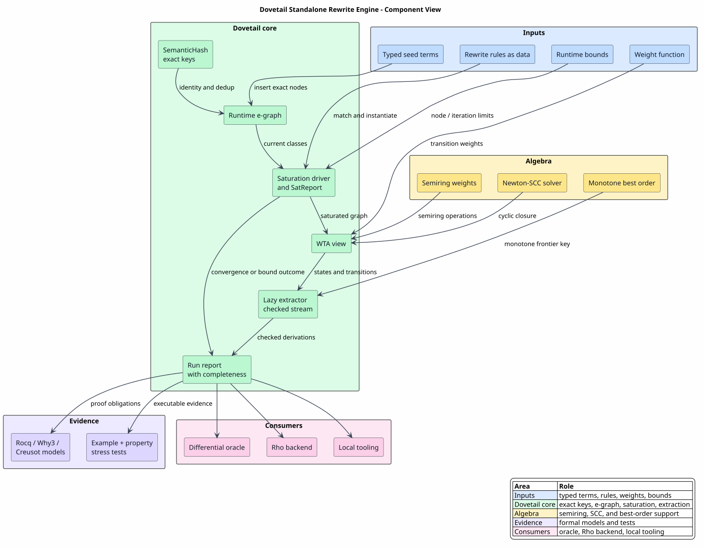

# Dovetail Rewrite Engine Architecture

Last updated: 2026-06-14

Dovetail is the standalone rewrite engine for MeTTaIL. It is not the Rho
machine backend and it is not the WPDA parser. Dovetail owns the
substrate-neutral rewrite semantics: exact-key equality saturation,
weights-as-ordering, checked best-first extraction, cyclic inside-weight
closure, explicit boundedness reports, and runtime-facing extraction reports.

The Rho-native backend consumes Dovetail semantics, but Dovetail is useful and
reviewable on its own. This suite documents Dovetail itself.

The cohesive reading rule is:

`language! inventory enters Dovetail; Dovetail reports checked rewrite evidence; downstream runtimes consume reports.`

Dovetail pages therefore stop at `SatReport`, `Extraction<T>`, and
`DovetailRunReport` unless they are explicitly explaining a consumer. The Rho
backend pages pick up after a complete report and describe `rhoapi::Par`,
RSpace observations, and `RuntimeBackendReport`.

## Reading Paths

For principals:

1. [Executive Brief](00-executive-brief.md)
2. [Engine Architecture](02-engine-architecture.md)
3. [Runtime-Facing Reports](10-runtime-facing-reports.md)
4. [Formal Verification and Tests](07-formal-verification-and-tests.md)

For implementers:

1. [Concepts and Glossary](01-concepts-and-glossary.md)
2. [Data Model and Exact Keys](03-data-model-and-exact-keys.md)
3. [Rules and Saturation](04-rules-and-saturation.md)
4. [Extraction and Weights](05-extraction-and-weights.md)
5. [Cyclic Closure and Boundedness](06-cyclic-closure-and-boundedness.md)
6. [Runtime-Facing Reports](10-runtime-facing-reports.md)
7. [Worked Example](09-worked-example.md)
8. [Engineering Handoff](08-engineering-handoff.md)

For reviewers checking claims:

1. [Formal Verification and Tests](07-formal-verification-and-tests.md)
2. [Requirements Traceability](00-requirements-traceability.md)
3. [References](references.md)
4. [Validation Script](validate.sh)

## Reader Contract

Dovetail is the middle layer. A cohesive reading of every page should be:

`generated language inventory → exact-keyed rewrite engine → checked report`

That is narrower than the full runtime story on purpose. The upstream
`language!` system owns syntax and typed language inventory. Dovetail owns
exact-keyed equality evidence, saturation, extraction, weights, boundedness,
and reports. Downstream runtimes own execution or observation.

Use these questions while reading:

| Question | If yes, read it as... |
|---|---|
| Is the page declaring categories, constructors, syntax, guards, or native handlers? | upstream `language!` inventory consumed by Dovetail |
| Is the page discussing e-classes, rules, weights, extraction, or completeness? | Dovetail core behavior |
| Is the page showing `SatReport`, `Extraction<T>`, or `DovetailRunReport`? | a Dovetail phase-boundary artifact |
| Is the page showing `rhoapi::Par`, RSpace, or runtime observations? | a downstream consumer of a complete Dovetail report |

This contract is also the reason Dovetail documentation uses the word
"report." A report is the point where the engine freezes checked rewrite
evidence into a shape that another component can consume without depending on
the e-graph or extractor internals.

## Document Map

| Document | Question answered |
|---|---|
| [00 - Executive Brief](00-executive-brief.md) | What is Dovetail and why does it replace the production Ascent rewrite path? |
| [00 - Requirements Traceability](00-requirements-traceability.md) | Where is each explicit Dovetail documentation and verification requirement satisfied? |
| [01 - Concepts and Glossary](01-concepts-and-glossary.md) | What do Dovetail symbols, acronyms, and terms mean? |
| [02 - Engine Architecture](02-engine-architecture.md) | What are the modules, ownership boundaries, and execution phases? |
| [03 - Data Model and Exact Keys](03-data-model-and-exact-keys.md) | How are e-classes, e-nodes, content keys, and reports represented? |
| [04 - Rules and Saturation](04-rules-and-saturation.md) | How are rules matched, instantiated, and saturated under budgets? |
| [05 - Extraction and Weights](05-extraction-and-weights.md) | How does Dovetail enumerate derivations without missing alternatives? |
| [06 - Cyclic Closure and Boundedness](06-cyclic-closure-and-boundedness.md) | How are cyclic inside weights exact while cyclic enumeration remains explicit about boundedness? |
| [07 - Formal Verification and Tests](07-formal-verification-and-tests.md) | Which Rocq, Why3, Creusot, example, exhaustive, and property checks cover each claim? |
| [08 - Engineering Handoff](08-engineering-handoff.md) | What does another agent need to maintain or complete Dovetail independently? |
| [09 - Worked Example](09-worked-example.md) | How does a small rewrite system move through e-graphing, saturation, extraction, and reporting? |
| [10 - Runtime-Facing Reports](10-runtime-facing-reports.md) | What is a Dovetail report, why does a rewrite engine need one, and what may downstream runtimes rely on? |
| [References](references.md) | Which local source, test, proof, and design artifacts support the suite? |

## Architecture at a Glance



PlantUML source: [figures/README.puml](figures/README.puml).

## Diagramming Choices

The pgmcp toolbox catalog reports a dedicated diagramming domain with
PlantUML, Graphviz, Mermaid, D2, Structurizr, TikZ/PGF, WaveDrom, and related
SVG-capable tools installed. This suite uses:

| Tool | Why it is used here |
|---|---|
| PlantUML | component, lifecycle, and frontier diagrams where named architecture elements are more useful than geometric precision |
| Graphviz DOT | proof-dependency graphs, because graph layout should follow the actual dependency relation |
| SVG output | reviewable repository artifacts that render consistently in GitHub and browser-based documentation |

Other installed tools remain useful for future packet layouts, timing diagrams,
statistical plots, and publication figures, but they would add little signal to
the core Dovetail architecture pages.

## Core Contract

Dovetail treats a MeTTaIL rewrite system as a finite, exact-keyed hypergraph.
Saturation grows equality evidence. Extraction enumerates derivation trees.
Weights rank derivations; they do not delete derivations. A
[runtime-facing report](10-runtime-facing-reports.md) then packages the checked
extraction as a proof-preserving artifact rather than a human-facing log.

In these documents, "report" means a typed engineering artifact, not a prose
diagnostic. Dovetail uses reports at phase boundaries so later components know
exactly what was proved, what was enumerated, and where bounds applied:

| Artifact | Boundary | Main question answered |
|---|---|---|
| `SatReport` | saturation | Did equality growth converge, hit the node bound, or hit the iteration bound? |
| `Extraction<T>` | extraction | What value was extracted, and is it complete or bounded by a cycle cut? |
| `DovetailRunReport` | runtime handoff | Which exact roots, term records, derivation edges, and completeness status may a consumer rely on? |

The theoretical basis is equality saturation over e-graphs
([EGG-2021](references.md#egg-2021)), k-best style lazy enumeration
([HUANG-CHIANG-2005](references.md#huang-chiang-2005)), and semiring fixed-point
closure for cyclic automaton components
([ESPARZA-KIEFER-LUTTENBERGER-2008](references.md#esparza-kiefer-luttenberger-2008),
[ESPARZA-KIEFER-LUTTENBERGER-2010](references.md#esparza-kiefer-luttenberger-2010)).
The repository-local proof boundary is listed in
[Formal Verification and Tests](07-formal-verification-and-tests.md).

The central invariant is:

`∀d. Valid(d) ∧ weight(d) ≠ 0̄ ⇒ EventuallyEnumerated(d)`

The only accepted removals are evidence-based:

`Removed(d) ⇒ weight(d) = 0̄ ∨ key(d) = key(d′)`

Here `0̄` is the semiring zero, meaning semantic refutation for the chosen
weight algebra, and `key(d) = key(d′)` means exact byte-for-byte derivation-tree
identity.

## Narrative Spine

Read Dovetail as the middle layer of a three-layer story:

| Layer | Owner | Main artifact | Question answered |
|---|---|---|---|
| language definition | MeTTaIL `language!` macro | `LanguageDef` and generated `LanguageMetadata` | What are the categories, constructors, syntax, rewrites, guards, and handlers? |
| rewrite semantics | Dovetail | `SatReport`, `Extraction<T>`, and `DovetailRunReport` | What rewrite evidence was saturated, extracted, ordered, and marked complete or bounded? |
| runtime consumption | selected backend | `RuntimeBackendOutput::Dovetail` or normalized `rhoapi::Par` plus later observations | How does the selected runtime expose or execute the checked rewrite evidence? |

Dovetail does not own the first layer or the third layer. Its correctness claim
is intentionally narrower and sharper:

`language inventory + seed term + bounds → checked rewrite report`

That is why Dovetail pages talk about exact keys, saturation, extraction,
weights, and completeness. They mention Rho only when explaining one downstream
consumer of a complete report.

For a concrete example, use the MiniRhoFor trace in
[Runtime-Facing Reports](10-runtime-facing-reports.md#minirhofor-report-example)
as the canonical walk-through. It ties the two reader questions together:

| Reader question | Artifact chain | Where to read next |
|---|---|---|
| How does a language declaration become Dovetail input? | `language! specification → LanguageDef → LanguageMetadata → Dovetail rewrite rules` | [MiniRhoFor static compilation path](10-runtime-facing-reports.md#static-compilation-path) |
| How does one snippet move through the runtime? | `source snippet → WPDA parser → typed AST → DovetailRunReport → backend artifact` | [MiniRhoFor runtime snippet path](10-runtime-facing-reports.md#runtime-snippet-path) |
| What changes when the selected backend is Rho? | `DovetailRunReport → RhoNet plan → rhoapi::Par → RhoRuntime observations` | [Rho-native end-to-end architecture](../rho-native-integration/02-end-to-end-architecture.md#high-level-dispatch-trace) |

The same example deliberately uses Rholang-like text only for readability.
Generated execution values are typed artifacts, and the Rho lane constructs
`rhoapi::Par` directly.

## Comprehension Contract

Every Dovetail document should preserve the same left-to-right story:

`language! specification → LanguageDef → LanguageMetadata → Dovetail rules → SatReport → Extraction<T> → DovetailRunReport`

Those arrows are ownership boundaries, not just implementation steps:

| Boundary | Reader should understand | Dovetail obligation |
|---|---|---|
| `language! → LanguageDef` | the language author declared a valid typed model | consume the typed model, never invent a parallel language inventory |
| `LanguageDef → LanguageMetadata` | generated code exposes categories, constructors, rewrites, guards, and handlers | derive rules from generated inventory rather than hard-coded category lists |
| `LanguageMetadata → Dovetail rules` | rewrite requirements become exact-keyed rule data | preserve equality, congruence, guard, native-handler, and boundedness distinctions |
| `rules → SatReport` | saturation stopped for a named reason | report `Converged`, `NodeLimit`, or `IterationLimit` explicitly |
| `SatReport → Extraction<T>` | extraction emits ordered derivations with terminal metadata | never report a cycle-cut prefix as complete |
| `Extraction<T> → DovetailRunReport` | consumers receive exact roots, term records, derivation edges, and completeness | keep the report substrate-neutral and proof-preserving |

If a page needs to mention runtime execution, it should do so as a consumer
after `DovetailRunReport`. That keeps the standalone Dovetail design cohesive:
Dovetail explains what rewrite evidence exists and what is safe to consume;
the Rho integration suite explains how a complete report becomes host Rho
machine work.

## Cohesive Integration View

Dovetail's standalone contract is the middle of the runtime replacement chain:

`language! specification → generated semantic inventory → DovetailRunReport → backend artifact`

The upstream `language!` expansion remains the authority for categories,
constructors, syntax, rewrites, guards, predicates, and native-handler
declarations. Dovetail consumes that inventory and produces a checked report.
It does not invent category lists, parse source text, or select a runtime.
Downstream consumers then choose their own artifact: the Rho backend lowers a
complete report to normalized `rhoapi::Par`, an oracle compares exact keys with
a reference backend, and tests inspect the same roots and derivation edges.
Dovetail also consumes structural and behavioral predicated-type inventory as
guarded rewrite obligations. Pure structural obligations may be discharged by
Dovetail's exact-key and pattern semantics; behavioral obligations, effective
Boolean algebras, symbolic finite-state transducers, weighted transducer
analysis, native handlers, and external contracts remain explicit coverage
evidence. Dovetail preserves those distinctions in reports and handoff
metadata; it does not implement every predicate theory itself.

There is also a runtime-facing adapter boundary:

`DovetailRunReport → RuntimeDovetailRunReport → RuntimeBackendOutput::Dovetail`

The adapter crate `mettail-dovetail-runtime` owns that projection so the
substrate-neutral `dovetail` crate does not depend on `mettail-runtime`. This
is the direct Dovetail runtime-backend path. It is distinct from the Rho path,
where a complete Dovetail report is lowered further to `rhoapi::Par` and the
eventual generic runtime output is observation-shaped.

This separation is the main cohesiveness rule for the documentation: when a
page describes a term before the report, it is talking about MeTTaIL inventory
or Dovetail internals; when it describes `rhoapi::Par` or RSpace observations,
it is talking about a downstream consumer of a complete report.

The two runtime lanes are:

| Lane | Artifact chain | Reader intuition |
|---|---|---|
| direct Dovetail backend | `DovetailRunReport → RuntimeDovetailRunReport → RuntimeBackendOutput::Dovetail` | expose the checked rewrite result as the runtime result |
| Rho-native backend | `DovetailRunReport → RhoNet plan → rhoapi::Par → RhoRuntime → RSpace observations` | compile the checked rewrite result into host Rho-machine work |

Both lanes begin with the same Dovetail report. The direct lane stops at a
report-shaped runtime output. The Rho lane executes a generated AST artifact
and therefore returns observation-shaped runtime output. Keeping those lanes
separate is the simplest way to read the design without conflating Dovetail
correctness, Rho lowering correctness, and RhoRuntime execution evidence.

## Relation To Other Subsystems

| Subsystem | Relationship |
|---|---|
| `language!` specification macro | Upstream source of language truth; Dovetail consumes its generated semantic inventory rather than replacing it. |
| WPDA parser | Upstream producer of typed terms; not replaced by Dovetail. |
| Ascent | Legacy production rewrite backend and reference/oracle path during rollout. |
| CESK runtime backend | Runtime backend path being replaced by Dovetail plus Rho-native execution. |
| `mettail-dovetail-runtime` | One-way adapter that installs Dovetail as a selected runtime backend and projects complete checked reports into `RuntimeBackendOutput::Dovetail`. |
| Rho backend | Downstream consumer that lowers covered Dovetail rewrite networks to `rhoapi::Par`. |
| F1r3node/RSpace | Runtime substrate for Rho execution; Dovetail does not depend on it. |
| `rigail` | Algebra crate providing semirings, weights, and Newton-SCC solving. |

## Local Validation

Run the Dovetail documentation suite checks from the repository root:

```text
docs/architecture/dovetail/validate.sh
```

Run the implementation and formal verification gates under an RSS cap:

```text
systemd-run --user --scope -p MemoryAccounting=yes -p MemoryMax=8G -p MemorySwapMax=0 -p CPUQuota=200% cargo test -j1 -p dovetail
make -C formal check-capped FORMAL_CAPPED_TARGET=rocq-dovetail FORMAL_MEMORY_MAX_BYTES=8589934592 FORMAL_MEMORY_HIGH_BYTES=7516192768
```
