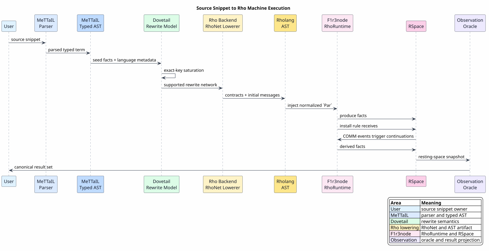
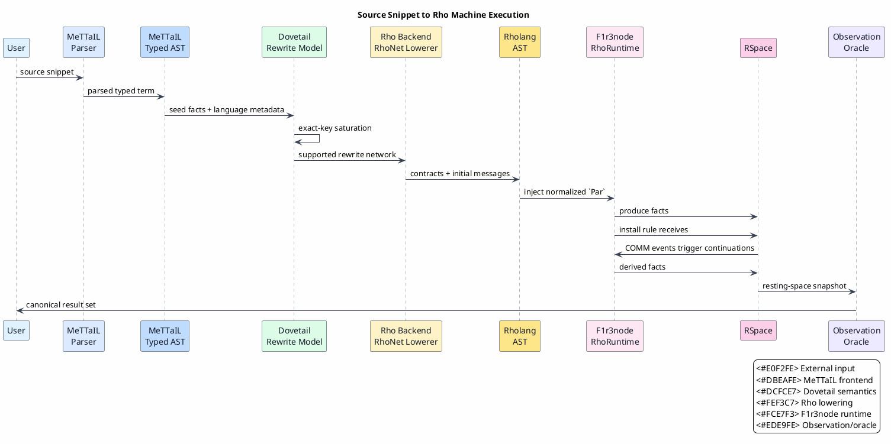

# End-to-End Architecture

Last updated: 2026-06-13

This document explains the whole execution path from a source-language snippet
to native execution on F1r3node's Rho machine, scoped to replacement of the CESK
runtime backend path.

All symbols used here are defined in
[Concepts and Glossary](01-concepts-and-glossary.md).

## Design Thesis

The integration should preserve the best responsibility boundary for each
system:

| System | Primary responsibility | Reason |
|---|---|---|
| MeTTaIL | Model and parse source languages. | It already owns grammar, typed terms, metadata, and user-facing language definitions. |
| Dovetail | Define substrate-neutral rewrite semantics. | It can prove exact-key, saturation, cycle, and extraction properties without assuming a runtime. |
| Rho backend | Lower Dovetail semantics to Rho-native dataflow. | It is the bridge between rewrite facts and RSpace communication. |
| F1r3node / Rholang / RSpace | Execute concurrent processes. | RSpace already owns communication, joins, replay, checkpointing, and parallel scheduling. |

The key architectural move is a runtime-backend move:

`CESK runtime backend scheduling` → `Rho-native dataflow network`

In the centralized model, an engine repeatedly scans rules and facts. In the
Rho-native model, facts are messages and rules are persistent contracts.
Readiness is discovered by RSpace communication.

This move is deliberately downstream of parsing. The active WPDA
parser/recognizer still produces the typed terms consumed by Dovetail, and
Ascent remains available as the reference/oracle path used by differential
gates.

This follows the tuple-space idea that communication can be mediated through a
shared space ([LINDA-1985](references.md#linda-1985)), the process-calculus view
that communication is an operational reduction ([PI-1992-I](references.md#pi-1992-i)),
and Rholang's reflective names and COMM rule
([RHO-2005](references.md#rho-2005),
[RHOLANG-DOCS](references.md#rholang-docs)).

## Bridge Crate Boundary

The design uses small one-way bridge crates rather than a runtime fork:

| Crate | Boundary role |
|---|---|
| `dovetail` | substrate-neutral rewrite engine and formal reference |
| `mettail-rho-codegen` | compile-time lowering from Dovetail/RhoNet to Rholang-facing artifacts |
| `mettail-rho-runtime` | binding to F1r3node's RhoRuntime and observation/oracle harness |
| `mettail-rho-adapter` | OSLF/GSLT cost and funding adapter consumed by F1r3node gates |

The boundary is intentionally asymmetric:

`MeTTaIL bridge crates → F1r3node crates`

and not:

`F1r3node crates → MeTTaIL`

That asymmetry preserves F1r3node as the production Rho-machine substrate and
keeps Dovetail extractable as a substrate-neutral rewrite engine. It also
matches the repository-local Rho target design
([RHOLANG-TARGET-DESIGN](references.md#rholang-target-design)) and M-RHO
execution contract ([RHO-FLIP-DESIGN](references.md#rho-flip-design)).

## Source-to-Rho Lifecycle



PlantUML source:
[figures/02-end-to-end-architecture.puml](figures/02-end-to-end-architecture.puml).



## Component Contracts

### MeTTaIL Contract

MeTTaIL supplies:

- a typed term grammar;
- a parser from source text to terms;
- equations `t ≡ u`;
- directed rewrites `t →ᵣ u`;
- native/fold handlers;
- guard and predicate metadata;
- the inventory of categories and constructors.

MeTTaIL does not decide the runtime schedule. It describes the semantics.

### Dovetail Contract

Dovetail consumes MeTTaIL metadata and produces a rewrite model:

- exact term/e-class keys;
- initial facts;
- rule instances;
- saturation outcomes;
- candidate derivations;
- normal-form candidate sets;
- explicit boundedness information when a cyclic extraction cannot be exhaustive.

The Dovetail contract can be summarized as:

`covered(requirement) ⇒ core_proven(requirement) ∨ external_contract(requirement)`

That formula means each MeTTaIL rewrite requirement must either be handled by
proved Dovetail core behavior or delegated to an explicit native/Rho contract.
Silent gaps are not allowed.

### Rho Backend Contract

The Rho backend consumes the Dovetail model and emits:

- a RhoNet dataflow network;
- normalized Rholang AST (`models::rhoapi::Par`) for the supported fragment;
- Rholang-text annotations for readers, logs, and documentation;
- native handler registrations for operations that cannot be rendered as pure
  Rholang expressions;
- a differential oracle harness that compares Rho observations with Dovetail or
  Ascent reference behavior.

The Rho backend must be total-or-explicit-reject:

`∀r ∈ Rules. lowered(r) ∨ rejected(r)`

The existing M-RHO.0 lowering proof establishes this shape for the scalar
operator subset. The Rho-native roadmap generalizes the same discipline to
communication, guarded rules, and native handlers.

### F1r3node Contract

F1r3node supplies:

- Rholang AST execution through `RhoRuntime::inj`;
- source parsing and normalization for hand-authored regression oracles;
- RhoRuntime evaluation;
- RSpace data and continuation storage;
- atomic `produce`/`consume` matching;
- persistent receives and contracts;
- replay logs and checkpoints;
- cost and funding checks.

F1r3node does not import MeTTaIL. The bridge is one-way.
The current repository-local bridge proof is recorded in
[RHO-BRIDGE-FORMAL](references.md#rho-bridge-formal).
That proof set includes `HostRhoMachineReuse.v`, which makes accepted backend
plans depend on the host Rholang interpreter and host RSpace while excluding a
MeTTaIL-owned reducer, tuple space, matcher, or replay engine.

## Execution Modes

| Mode | Description | Used for |
|---|---|---|
| Local Dovetail | Dovetail saturates and extracts inside MeTTaIL. | Formal reference, tests, non-Rho deployments. |
| Rho differential | Both Dovetail/Ascent and Rho run; result sets are compared. | M-RHO rollout safety. |
| Rho default | Rho is the selected runtime backend for a language in place of the CESK runtime backend. | M-RHO.4 after proof, oracle, coverage, artifact-validation, and deadlock gates. |

## Pedagogical Example: Communication

Consider the source-level rhocalc communication pattern:

```text
{ (c?x).{*(x)} | c!(p) }
```

The intended source rewrite is:

`{ (c?x).{*(x)} | c!(p) } → p`

The Rho-native lowering does not create a central evaluator that searches for
this redex. It emits a receive and a send on the same channel. RSpace performs
COMM when both are available:

```rholang
new out in {
  for (@x <- @"mtl:c") { @"mtl#out"!(x) } |
  @"mtl:c"!(p)
}
```

This example is intentionally small. Real lowering uses fresh private names,
canonical channel rendering, exact keys, and observation fingerprints.

## Literate Algorithm: End-to-End Execution

The algorithm below is pseudocode. It is not Rust, Rholang, or Rocq code.

```pseudocode
Algorithm: Execute a MeTTaIL-modeled snippet on the Rho machine

Given:
  source text S
  language definition L
  backend policy B

Produce:
  canonical result observation O

Steps:
  1. Parse S with L's MeTTaIL parser.
     The result is a typed term t.

  2. Seed Dovetail with t.
     Dovetail creates the initial fact set F₀.

  3. Classify every requirement in L.
     Each requirement is either Dovetail-core, native-handler, Rho-handler,
     or rejected with evidence.

  4. If B is local Dovetail:
       saturate F₀ inside Dovetail and extract O.
     Otherwise continue.

  5. Lower the supported Dovetail network into RhoNet.
     Terms become fact messages.
     Rules become contracts.
     Multi-premise rules become joins.

  6. Lower RhoNet to normalized Rholang AST.
     The AST generator constructs the host `Par` shape directly, including
     De Bruijn indices, locally-free metadata, connective flags, bind counts,
     and receive conditions.

  7. Inject the normalized `Par` into F1r3node RhoRuntime.
     RSpace schedules every enabled COMM.

  8. At quiescence, inspect the resting space.
     Project out scheduler metadata and canonicalize names.

  9. Return the canonical observation O.
```

### Invariant

At every boundary:

`observable_facts_after_lowering ⊆ observable_facts_after_dovetail`

and, for the supported fragment under fair scheduling:

`observable_facts_after_dovetail ⊆ observable_facts_after_lowering`

Together they imply equality of observable result sets.

## Why Normalized Rholang AST?

The generated bridge path builds `models::rhoapi::Par` directly instead of
emitting text and asking a parser to recover the same AST. The reason is
performance and integration clarity: MeTTaIL is the parser/compiler layer, and
the backend artifact should be what the host interpreter consumes.

The AST generator must own and test:

- De Bruijn indexing;
- locally-free annotations;
- connective flags;
- normalization;
- bind-count conventions;
- receive condition representation.

The current Rust gate checks these invariants on the generated contracts. The
Rholang-looking examples in this document are annotations for readers; they are
not a parser round-trip requirement for generated code. When Rholang bytecode is
available, it should become another backend artifact form after the same
semantic gates pass.

## What This Enables

This design allows snippets in MeTTaIL-modeled languages to run natively on
F1r3node after compilation. The runtime artifact is a Rholang/RSpace dataflow
network, not an embedded MeTTaIL interpreter.

The practical result is:

`source snippet → native Rho machine execution`

with MeTTaIL and Dovetail still available as the formal reference and
differential oracle during rollout.
