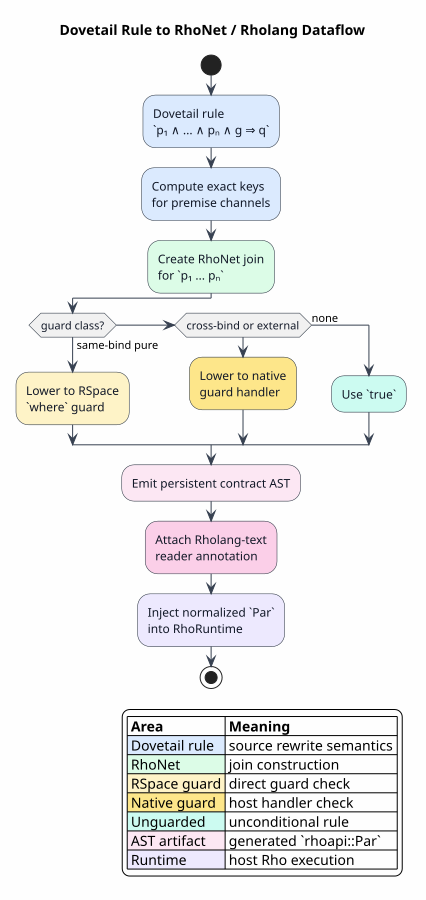

# Rho-Native Dataflow Lowering

Last updated: 2026-06-14

This document explains how Dovetail rewrite semantics are compiled into a
Rho-native dataflow network. The generated execution artifact is normalized
Rholang AST (`models::rhoapi::Par`) that feeds directly into the Rho interpreter;
Rholang source snippets appear here only as reader annotations. The design uses
Rholang and RSpace as intended: communication is the scheduling mechanism.

The lowering is grounded in Rholang's reflective process model
([RHO-2005](references.md#rho-2005)), RSpace's tuple-space API
([RSPACE-DOCS](references.md#rspace-docs)), and Rholang's syntax and
concurrency rules ([RHOLANG-DOCS](references.md#rholang-docs)).

All symbols used here are defined in
[Concepts and Glossary](01-concepts-and-glossary.md).

## Core Correspondence

| Dovetail concept | Rho-native representation |
|---|---|
| fact | RSpace message |
| delta fact | message on a delta channel |
| rewrite rule | persistent Rholang contract |
| premise | receive pattern |
| multi-premise rule | atomic RSpace join |
| guard | RSpace `where` predicate or native guard handler |
| derived fact | send from rule continuation |
| exact key | canonical channel or payload identity |
| ambiguity | explicit candidate facts |
| normal form | observed output fact after quiescence |

The guiding equation is:

`lower(derive(F, Δ)) = comm_step(lower(F), lower(Δ))`

In words: one Dovetail derivation step lowers to one or more RSpace
communications that emit the same observable fact.

## RhoNet Intermediate Calculus

RhoNet is a proof-oriented intermediate representation. It is deliberately
smaller than full Rholang.

### Syntax

| Form | Meaning |
|---|---|
| `Fact(ch, payload)` | A message is present on channel `ch`. |
| `Contract(name, binds, guard, body)` | A persistent receive that fires for every matching message tuple. |
| `Join(binds)` | An atomic multi-channel receive. |
| `Send(ch, payload)` | Emit a fact. |
| `New(names, body)` | Create private names for an evaluation. |
| `Par(p, q)` | Run two subprocesses concurrently. |
| `Observe(ch)` | Declare an observable output channel. |

### Operational Step

The central RhoNet transition is COMM:

`Fact(c₁, a₁) | ... | Fact(cₙ, aₙ) | Contract(k, binds, guard, body) → body[σ]`

provided:

`match(binds, (c₁, a₁), ..., (cₙ, aₙ)) = σ`

and:

`guard(σ) = true`

If `guard(σ) = false`, no fact is consumed and no body is emitted.

## Predicated-Type Lowering Contract

Predicated types lower through the same `guard` field in `Contract`, but the
guard is not invented by the backend. It is derived from the `language!`
`guards {}` inventory:

`LanguageDef.guards → typed predicate inventory → Dovetail guarded rule → RhoNet Contract(..., guard, ...)`

The Rho backend classifies each guard conjunct before emitting `rhoapi::Par`:

| Guard conjunct | Lowering target | Commit rule |
|---|---|---|
| structural match on one received value | receive bind pattern or local match inside the contract | mismatch behaves as no match |
| pure typed predicate over already bound ground values | Rholang/RSpace boolean guard | false behaves as no match |
| multi-channel predicate over a join substitution | atomic join guard or native guard handler before commit | false releases all candidate data |
| `logic {}` relation membership | RhoNet fact lookup or explicit external contract | missing relation fact blocks the rule |
| quantified, AC, lattice, arithmetic, or host-specific predicate | native guard handler with evidence, or explicit rejection | handler failure is no-commit, not partial consumption |

This is the Rho-machine advantage for predicated types: once a guarded rule is
compiled as an atomic join, RSpace can try all enabled communication candidates
in parallel while preserving the Dovetail guard semantics. The backend does not
need a central CESK scheduler to poll every guarded redex.

The lowering is deliberately fail-closed:

`emit(C_g) ⇒ source(g) ∈ LanguageDef.guards ∧ covered(g) ∧ no_commit_on_false(g)`

A guard with unknown predicate meaning, missing typed-predicate metadata, or
unapproved native-handler evidence is rejected during planning rather than
encoded as a permissive Rho contract.

### Guard-Obligation Coverage

The production backend does not maintain a hand-written list of known guard
categories. It derives a finite obligation set from `LanguageDef`:

`O(L) = collect_guard_obligations(LanguageDef(L))`

Each obligation is one of:

| Obligation kind | Induced by | Reader intuition |
|---|---|---|
| `BehavioralPredicate` | `guards {}` built-ins, standard built-ins selected by the language, `?guard:Guard` term slots, and non-structural `BehavioralGuard` premises | a runtime or theory must decide a predicate over already matched values |
| `StructuralPattern` | AC matching and guard premises whose truth depends on decomposing a value shape | Dovetail or an SFT must preserve pattern structure |
| `TheoryRegistration` | `guards { theories { ... } }` entries | the named theory must supply an effective Boolean algebra or equivalent verified adapter |
| `RhoNativeJoin` | `guards { channels { ... } }` and `join` declarations | RSpace must enforce atomic guarded receive behavior |

The gate then checks an evidence value:

`RhoGuardCoverageEvidence = NoGuardObligations ∨ CoveredGuardObligations(dispositions)`

`NoGuardObligations` accepts only when `O(L) = ∅`. Otherwise every obligation
must have exactly one compatible `RhoGuardDisposition`, every disposition must
refer to an existing obligation, and every disposition must carry a nonblank
evidence reference. Extra, duplicate, evidence-less, or incompatible
dispositions block Rho-default selection.

The accepted compatibility matrix is:

| Obligation kind | Accepted dispositions |
|---|---|
| `BehavioralPredicate` | `EffectiveBooleanAlgebra`, `SymbolicFiniteTransducer`, `RhoNativeJoin`, `NativeHandler`, `ExternalContract` |
| `StructuralPattern` | `DovetailCoreStructural`, `SymbolicFiniteTransducer`, `RhoNativeJoin`, `NativeHandler`, `ExternalContract` |
| `TheoryRegistration` | `EffectiveBooleanAlgebra`, `SymbolicFiniteTransducer`, `NativeHandler`, `ExternalContract` |
| `RhoNativeJoin` | `RhoNativeJoin`, `NativeHandler`, `ExternalContract` |

The EBA/SFT split is intentional. An effective Boolean algebra handles
decision problems of the form `x ∈ φ`, `φ ∧ ψ` satisfiable, or `¬φ`; it is the
right disposition for arithmetic ranges, finite enumerations, lattices, and
other decidable predicate domains. A symbolic finite-state transducer handles
guard-preserving transformations, such as normalization before comparison,
structural decomposition of sequences, pre-image pruning across join inputs, or
functional value rewriting. Both are admitted only as evidence-backed
dispositions; neither is assumed from a predicate name.

Literate planning sketch:

```pseudocode
Algorithm: Admit a guarded language to the Rho default backend

Given:
  a parsed and validated LanguageDef L
  a proposed Rho backend evidence bundle E

Produce:
  a RhoDefaultBackendPlan or a complete blocker report

Steps:
  1. Derive O(L), the sorted set of guard obligations, from the generated
     language inventory.

  2. If E.guard_coverage is NoGuardObligations, require O(L) to be empty.
     Otherwise record every obligation id in O(L) as uncovered.

  3. If E.guard_coverage is CoveredGuardObligations(D), check D as an exact
     cover of O(L):
       - no obligation in O(L) may be missing from D;
       - no disposition in D may name an obligation outside O(L);
       - no obligation may appear twice in D;
       - every disposition must carry a stable evidence reference;
       - every disposition kind must be compatible with the obligation kind.

  4. Combine the guard result with the existing proof, oracle,
     rejected-rule coverage, artifact, scheduler-fairness, and deadlock gates.

  5. Emit a plan only when every gate passes; otherwise emit all blockers.
```

This is how the plan covers fully generalized predicated types. The subject
domain of a predicate may be any MeTTaIL-modeled data type: scalar, algebraic
tree, collection, process, name, or host-backed value. Generality comes from
the obligation interface and the evidence-backed disposition, not from one
universal built-in solver. If a language adds a new predicated type over a new
data domain, `LanguageDef` induces a new obligation and the Rho backend stays
fail-closed until Dovetail, an EBA, an SFT, a Rho-native join, a native handler,
or an external contract covers it.

## Lowering Shape



PlantUML source:
[figures/04-rho-native-dataflow-lowering.puml](figures/04-rho-native-dataflow-lowering.puml).

## Example: Unary Rewrite

Source rule:

`Neg(Neg(x)) → x`

Dovetail form:

`Term(Neg(Neg(x))) ⇒ Rw(Neg(Neg(x)), x)`

RhoNet form:

`Contract("rule:double-neg", bind Fact("delta:Proc", Neg(Neg(x))), true, Send("delta:Proc", x))`

Readable Rholang rendering:

```rholang
contract @"mtl:rule:double-neg"(@term) = {
  match term {
    ["Neg", ["Neg", x]] => { @"mtl:delta:Proc"!(x) }
    _ => { Nil }
  }
}
```

The rendering is documentation-only. The implementation constructs the
equivalent normalized `Par` value directly. Text like the rendering may be
stored as an annotation for logs and documents, but it is not parsed as the
execution path.

## Example: Multi-Premise Rewrite as Join

Consider a rule with two premises:

`A(x) ∧ B(x, y) ⇒ C(y)`

RhoNet lowers this to one atomic join:

`for (@a <- ch_A & @b <- ch_B where compatible(a, b)) { ch_C!(project_y(b)) }`

The atomicity matters. If `A(x)` is available but no compatible `B(x, y)` is
available, RSpace does not consume `A(x)`. This matches the logical reading of
conjunction:

`A(x) ∧ B(x, y)` is available only when both conjuncts are available.

## Example: rhocalc COMM

Source term:

```text
{ (c?x).{*(x)} | c!(p) }
```

Source rewrite:

`{ (c?x).{*(x)} | c!(p) } → p`

Rho-native lowering, rendered here as text for readability:

```rholang
new out in {
  for (@x <- @"mtl:c") { @"mtl#out"!(x) } |
  @"mtl:c"!(p)
}
```

RSpace performs the communication when both sides are present. This is not a
simulation of COMM; it is COMM delegated to the host Rho machine.

### AST-First rhocalc Bridge

The executable rhocalc bridge is a transport-pure Rho-machine bridge:

`rhocalc source → MeTTaIL/WPDA Proc AST → normalized rhoapi::Par → RhoRuntime::inj`

The bridge is implemented by `mettail-rho-runtime::lower_rhocalc_proc`,
`lower_rhocalc_name`, and the generated-term boundary `lower_rhocalc_term`. It
does not generate Rholang source text. Reader-facing documents may display an
equivalent Rholang rendering, but the generated value is the Rholang AST form
consumed by the interpreter. This keeps the path aligned with the
forward-looking bytecode plan: bytecode can become another artifact kind after
`Par`, while source text remains a diagnostic annotation rather than an
execution dependency.

This direct bridge is intentionally narrower than the general production
runtime-backend path. It is valid for the rhocalc fragment whose source AST
already is a Rho-calculus process representation. For arbitrary
MeTTaIL-modeled languages, the Rho backend consumes checked Dovetail evidence
first:

`typed term + LanguageMetadata → DovetailRunReport → RhoNet plan → rhoapi::Par`

Thus direct rhocalc lowering is not a replacement for the Dovetail report
boundary. It is the native fast path for a language whose semantic domain is
already Rho-shaped, and it supplies evidence for how a covered Rho fragment is
injected into the host interpreter without a source-text round trip.

### Generic Call-By-Need Thunk Boundary

Not every MeTTaIL-modeled language has a direct Rho process interpretation like
rhocalc. The generic bridge for those computations is call-by-need: a source
computation is represented as a private Rho thunk, and forcing the thunk sends
its result to a continuation while memoizing the first result.

The artifact chain for the current M-RHO.2 boundary is:

`LanguageMetadata + typed computation → CallByNeedThunkSpec → CallByNeedThunkPlan → rhoapi::Par → RhoRuntime observations`

`CallByNeedThunkSpec` is the generated-language parameter block. It carries:

| Field | Meaning | Validation purpose |
|---|---|---|
| initial state | whether the thunk starts cold or already memoized | fixes the admission sequence: miss-then-hit or hit-then-hit |
| value | generated-language result payload as a closed `RhoAstLiteral` for the current thunk artifact | keeps the proof parametric in source value while preserving runtime type tags |
| evaluation marker | observable marker for the cold computation branch | lets runtime tests distinguish compute-once from memo reuse |
| output channel | public value-observation channel | separates value observations from evaluation traces |
| evaluation channel | public evaluation-trace channel | prevents a compute marker from being confused with a result |

The topology does not change across generated languages:

`private thunk contract + state cell + memo cell + observer continuations`

Only payload and public observation names are parameterized. This is what keeps
the proof reusable: `RhoCallByNeedObservation.v` reasons about arbitrary source
values and a fixed memoizing force topology, while Rust validation enforces the
AST profile and the planner enforces lookahead/heap admission.

Literate lowering sketch:

```pseudocode
Algorithm: Lower a generated computation to a planned call-by-need thunk

Given:
  a typed source computation c
  generated language metadata M
  an initial memo state s
  a lookahead and heap budget b

Produce:
  a planned normalized Rho AST thunk or an explicit rejection

Steps:
  1. Derive the source value payload v for c under M's semantic inventory
     as a closed RhoAstLiteral.

  2. Derive distinct observation channels out and eval for this computation.

  3. Build CallByNeedThunkSpec(s, v, eval-marker(c), out, eval).

  4. Reject if eval-marker, out, or eval is empty, if out = eval, or if v
     cannot be encoded as normalized rhoapi::Par.

  5. Admit the force sequence against b:
     cold thunks require one memo miss followed by one memo hit;
     hot thunks require two memo hits.

  6. Construct rhoapi::Par directly:
     create private thunk, state, memo, and continuation names;
     install the persistent thunk contract;
     seed state and, for hot thunks, seed the memo;
     force twice through observer continuations.

  7. Validate the AST with the CallByNeedThunk profile.

  8. Return CallByNeedThunkPlan only if admission, validation, and evidence
     gates all pass.
```

At runtime the value channel is decoded with the same closed-ground-value reader
used by native Rho sends: integer computations report
`RuntimeObservationValue::Int(n)`, predicates report
`RuntimeObservationValue::Bool(b)`, and string computations report
`RuntimeObservationValue::Text(s)`. The evaluation channel is intentionally
separate: it carries only textual trace markers such as `"AddInt"` so
compute-once behavior can be tested without confusing the marker with the
computed value.

The readable Rholang shape is:

```rholang
new thunk, state, memo, ret1, ret2 in {
  state!(initial) |
  contract thunk(k) = {
    for (@s <- state) {
      match s {
        "cold" => {
          state!("hot") | memo!!(value) | eval!(marker) | k!(value)
        }
        "hot" => {
          state!("hot") | for (@v <<- memo) { k!(v) }
        }
      }
    }
  } |
  thunk!(*ret1) |
  for (@v1 <- ret1) { out!(v1) | thunk!(*ret2) } |
  for (@v2 <- ret2) { out!(v2) }
}
```

The rendering is again documentation-only. The executable artifact is
`models::rhoapi::Par`, produced by `mettail_rho_codegen::build_call_by_need_thunk_ast_from_spec`
and accepted for execution only after `plan_call_by_need_thunk_with_spec`
returns a `CallByNeedThunkPlan`.

The supported transport-pure rhocalc core maps directly onto host Rho-machine
constructs:

| rhocalc form | Lowered Rho AST shape | Scheduling consequence |
|---|---|---|
| `PZero` | empty `Par` | no work |
| `PPar(p, q)` | parallel `Par::append(lower(p), lower(q))` | independent subprocesses are scheduled by RhoRuntime |
| `POutput(n, q)` | `Send(lower_name(n), [lower(q)])` | RSpace stores or immediately matches a datum |
| `PInputs([n₁,...,nₖ], ^[x₁,...,xₖ].p)` | one `Receive` with `k` bind sources and body `lower(p)` | all premises form one atomic RSpace join |
| `PDrop(NQuote(p))` | `lower(p)` | quote/drop cancellation is compile-time |
| `PDrop(NVar(x))` | `BoundVar(i)` when `x` is input-bound | received process is executed by the host reducer |
| `PNew(^[x̄].p)` | `New(|x̄|, lower(p))` | private names are allocated by the host reducer |
| ground `Int`, `UInt32`, `BigInt`, `BigRat`, `Fixed`, `Float`, `Bool`, `Str` | native Rho ground expressions | payloads use host scalar representation |

At the `RhoCalcTerm` boundary, ambiguity is explicit. If the generated term is
`Ambiguous([Proc p₁, ..., Proc pₙ])`, the bridge derives exact semantic keys for
the `Proc` alternatives, deduplicates exact duplicates, lowers every remaining
branch, and appends the resulting `Par` values. A cross-category ambiguous
alternative rejects the lowering instead of being dropped. The runtime backend
therefore cannot select the first parse alternative by traversal accident.

### Type-Sensitive Scalar Operator Lowering

Scalar operator lowering is deliberately typed. A surface token is not enough
to select the Rholang AST constructor because MeTTaIL languages may overload
the same terminal at different semantic types. The canonical example is `+`:

| Source rule shape | Operand types | Result type | Rho AST body |
|---|---|---|---|
| `AddInt(a, b) → a + b` | `Int × Int` | `Int` | `ExprInstance::EPlusBody` |
| `AddStr(a, b) → a + b` | `Str × Str` | `Str` | `ExprInstance::EPlusPlusBody` |
| `Concat(a, b) → a ++ b` | `Str × Str` | `Str` | `ExprInstance::EPlusPlusBody` |

Thus the lowering classifier is a partial function:

`classify_scalar_op : Terminal × Type × Type × Type ⇀ RhoOperator`

The classifier is defined only when the operand and result types match a
Rholang-native operator. For example, `classify_scalar_op(+, Int, Int, Int) =
EPlus`, while `classify_scalar_op(+, Str, Str, Str) = EPlusPlus`. Mixed operand
types, boolean `+`, arithmetic returning `Bool`, and logical operations outside
`Bool × Bool → Bool` are rejected with explicit lowering diagnostics.

Literate classifier sketch:

```pseudocode
Algorithm: Classify a scalar operator for Rho AST generation

Given:
  terminal token τ
  left operand scalar type α
  right operand scalar type β
  result scalar type γ

Produce:
  a Rholang AST operator or an explicit rejection

Steps:
  1. If τ is `+`, α = Int, β = Int, and γ = Int, emit integer addition.

  2. If τ is `+` or `++`, α = Str, β = Str, and γ = Str, emit string
     concatenation.

  3. If τ is one of `==`, `!=`, `<`, `>`, `<=`, or `>=`, α = β is one of
     Int, Bool, or Str, and γ = Bool, emit the matching comparison.

  4. If τ is `and` or `or`, α = Bool, β = Bool, and γ = Bool, emit the matching
     boolean operator.

  5. If τ is `-`, `*`, `/`, or `%`, α = Int, β = Int, and γ = Int, emit the
     matching integer arithmetic operator.

  6. Otherwise reject. Rejection is part of the coverage contract, not a
     fallback to an untyped source-text operator.
```

This is a correctness boundary, not merely an implementation preference. The
Rocq model
`formal/rocq/rho_bridge/theories/RhoScalarOperatorTyping.v` proves that
successful scalar lowerings use compatible operand/result types, that integer
`+` lowers to integer addition, and that string `+` and `++` lower to string
concatenation rather than integer addition.

Input binders use f1r3node's de Bruijn convention:

`index(xᵢ, k) = k - 1 - i`

where `k` is the number of binders and `i` is the zero-based syntactic binder
position. Thus the body of `(c?x,d?y).{*(x)|*(y)}` uses `BoundVar(1)` for `x`
and `BoundVar(0)` for `y`, matching the host environment that pushes matched
data in receive-bind order.

Literate lowering sketch:

```pseudocode
Algorithm: Lower a rhocalc process to normalized Rho AST

Given:
  rhocalc process p, or a generated RhoCalcTerm containing Proc alternatives
  bound-name environment Γ mapping free variables to de Bruijn indices

Produce:
  normalized Rholang AST value A or an explicit rejection

Steps:
  1. If the input is an ambiguous generated term, collect every Proc
     alternative. If any alternative is not Proc-shaped, reject. Deduplicate
     by exact semantic key and lower every remaining branch, appending the
     branches as parallel Par members.

  2. If p is zero, return the empty Par.

  3. If p is parallel composition, lower each subprocess and append the Par
     values. Appending preserves parallelism for the host scheduler.

  4. If p is output n!(q), lower n as a channel, lower q as a payload process,
     and build one Send node.

  5. If p is input `(n₁?x₁,...,nₖ?xₖ).{body}`, lower each source name under Γ.
     Extend Γ by shifting existing entries by k and assigning
     `xᵢ ↦ k - 1 - i`. Lower the body under the extended Γ and build one
     Receive node with k sources.

  6. If p is drop of a quoted process, lower the quoted process directly.
     If p is drop of a bound name, emit the corresponding BoundVar.

  7. If p introduces new names, extend Γ using the same de Bruijn convention
     and build one New node around the lowered body.

  8. If p is a ground scalar supported by Rho, emit the corresponding native
     Rho expression.

  9. Otherwise reject explicitly. Rejection is data for the rollout gate, not a
     silent fallback to source-text generation.
```

Correctness statement:

`run_Rho(lower_rhocalc(p)) ≈ obs_rhocalc(p)`

for the transport-pure COMM subset, where `≈` is the documented observation
quotient over public resting facts. The mechanized bridge proof
`formal/rocq/rho_bridge/theories/RhocalcAstLowering.v` proves the AST-only
artifact boundary, quote/drop preservation, one-input COMM correspondence,
two-input atomic-join correspondence, de Bruijn binder ordering, and
two-branch ambiguous-term preservation. The runtime test
`mettail-rho-runtime/tests/rho_rhocalc_ast.rs` exercises the same path with
WPDA parsing, direct `Par` lowering, exact-key ambiguous-branch preservation,
exact duplicate deduplication, RhoRuntime injection, received-name channel
reuse, and private-name non-leakage.

## Semi-Naive Channels

The Rho backend uses two fact families:

| Family | Meaning |
|---|---|
| `fact` | Stable facts already accepted into the known set. |
| `delta` | Newly discovered facts that should trigger rule work. |

The logical equations are:

`Fᵢ₊₁ = Fᵢ ∪ Δᵢ₊₁`

`Δᵢ₊₁ = derive(Fᵢ, Δᵢ) ∖ Fᵢ`

The Rho-native network realizes these equations with contracts:

- delta facts trigger rule contracts;
- derived candidates ask the dedup service whether the exact key is new;
- new facts are emitted to both stable and next-delta channels.

## Literate Algorithm: Lower a Rewrite Rule

The following is pseudocode, not executable code.

```pseudocode
Algorithm: Lower a Dovetail rewrite rule to RhoNet

Given:
  rule r
  premise patterns P = [p₁, ..., pₙ]
  guard g
  right-hand side builder q
  category metadata M

Produce:
  RhoNet contract C

Steps:
  1. Assign a canonical channel to each premise.
     The channel is determined by the premise category, relation kind, and
     exact key fields that are known before matching.

  2. Convert each premise pattern into a RhoNet bind pattern.
     The bind pattern extracts the values needed by the substitution `σ`.

  3. Classify the guard.
     Read guard declarations, typed predicate signatures, theory routing, and
     channel/join metadata from generated language inventory.
     If the guard depends only on variables from one bind and can be rendered
     as a pure Rholang boolean, mark it as an RSpace where-guard.
     If it depends on a multi-channel substitution, mark it as an atomic join
     guard.
     Otherwise mark it as a native guard-handler call or explicit rejection.

  4. Build an atomic join over all premise channels.
     The join has one body and commits only when all binds and the guard hold.

  5. In the body, construct `q(σ)`.
     Compute its exact output key.

  6. Send the candidate fact to the dedup service.
     If the key is new, emit it as stable fact and delta fact.

  7. Wrap the join body in a persistent contract.
     The contract remains available for subsequent arriving facts.
```

### Invariant

Every contract firing corresponds to a substitution satisfying the source rule:

`fires(Cᵣ, σ) ⇒ patternᵣ(σ) ∧ premisesᵣ(σ) ∧ guardᵣ(σ)`

## Literate Algorithm: Deduplicate and Emit a Fact

The following algorithm is the Rho-native analogue of exact-key insertion.

```pseudocode
Algorithm: Deduplicate and emit a Rho fact

Given:
  candidate fact f
  exact key k
  fact channel fact_ch
  delta channel delta_ch
  seen channel seen_ch

Produce:
  zero or more emitted RSpace messages

Steps:
  1. Ask the seen service whether k is already present.

  2. If k is present:
       emit no stable fact and no delta fact.
       The candidate has already been represented.

  3. If k is absent:
       record k on seen_ch.
       emit f on fact_ch.
       emit f on delta_ch.

  4. If k collides with a non-equivalent existing fact:
       emit an exact-key violation diagnostic and stop the run.
```

### Invariant

The emitted Rho fact set is key-equivalent to the Dovetail fact set:

`keys(resting_facts) = keys(F)`

## Ambiguity as Explicit Data

Rholang scheduling is nondeterministic where several communications are enabled.
That nondeterminism must not become semantic pruning.

Bad lowering:

`select candidate₁ or candidate₂`

Correct lowering:

`candidate(candidate₁) | candidate(candidate₂)`

The first representation chooses one. The second represents both. Therefore the
Rho backend represents ambiguity as explicit facts on candidate channels.

In the implementation, an enabled ambiguity witness is a receive-less AST send:

`@"mtl:ambiguity"!("exact-key", "payload")`

The expression above is reader notation. The generated value is
`models::rhoapi::Par`, constructed by `mettail_rho_codegen::RhoAstSend`; it is
not Rholang source text. `RhoAstSend` accepts structured `RhoAstLiteral`
payloads, so the same AST-first boundary carries scalar calls, ambiguity
witness strings, collection payloads, unforgeable names, and rhocalc bags.
Runtime observation reads the resting ambiguity datum as the tuple
`("exact-key", "payload")`, then the adapter inserts it into
`AmbiguityWitnessSet`. Exact duplicate tuples are idempotent, while the same
key with a different payload rejects as an explicit conflict. This keeps RSpace
free to schedule enabled communications in any order without letting the
scheduler erase semantic alternatives.

## Name and Capability Discipline

Every evaluation receives a private namespace:

`New(eval_id, body)`

Within that namespace:

- internal fact channels are private;
- output is routed through `@"mtl#out"`;
- source names are grounded with a disjoint prefix;
- bundles may restrict read/write access when the rendered Rholang can express
  the restriction cleanly.

The safety condition is:

`internal_channel ∉ free_names(user_program)`

and:

`sentinel_channel ∉ image(ground_source_name)`

## Why RhoNet Before Rholang?

RhoNet gives the proof a small target:

`Dovetail → RhoNet → Rholang/RSpace`

The first arrow proves semantic preservation from facts/rules to dataflow. The
second arrow proves that the emitted Rholang uses host primitives in the intended
way.

This avoids proving correctness directly over the full host AST format while
still making the runtime artifact explicit. The second proof/engineering layer
checks that generated `Par` values satisfy the host representation invariants
that source parsing used to hide.
