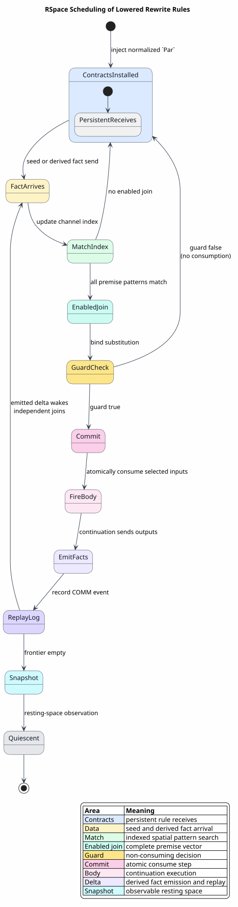
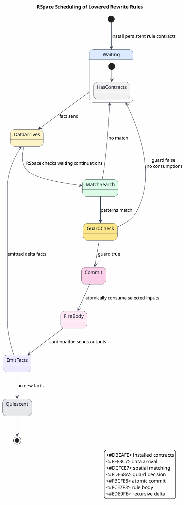

# RSpace Parallel Scheduling

Last updated: 2026-06-13

This document explains why RSpace is the natural scheduler for Dovetail rewrite
networks lowered to Rholang. The central idea is that enabled rewrites are just
enabled communications.

All symbols used here are defined in
[Concepts and Glossary](01-concepts-and-glossary.md).

## Why RSpace Is a Good Fit

Dovetail saturation asks:

`which rule instances are enabled by the available facts?`

RSpace asks:

`which continuations are enabled by the available messages?`

Those are the same question after lowering:

`facts ↦ messages`

`rule premises ↦ receive patterns`

`multi-premise rules ↦ joins`

So the Rho backend does not need to build a second scheduler. It should expose
rewrite readiness as RSpace readiness.

This is the practical convergence of tuple-space coordination
([LINDA-1985](references.md#linda-1985)), Rho/Rholang communication
([RHO-2005](references.md#rho-2005),
[RHOLANG-DOCS](references.md#rholang-docs)), and join-style synchronization
([JOIN-2000](references.md#join-2000)).

## Scheduling Model



PlantUML source:
[figures/05-rspace-parallel-scheduling.puml](figures/05-rspace-parallel-scheduling.puml).



## Parallelism Sources

| Source of parallelism | Rho/RSpace mechanism | Why it helps |
|---|---|---|
| independent subterms | `P | Q` parallel composition | independent branches can run as independent tasks |
| independent channels | per-channel RSpace operations | unrelated rewrite families do not serialize globally |
| multi-premise readiness | atomic joins | rule bodies fire only when all inputs are present |
| persistent rules | contracts / persistent receives | rules stay installed instead of being re-created by a loop |
| non-blocking outputs | sends continue immediately | producers do not wait for consumers unless encoded explicitly |
| replay | event logs | nondeterministic runtime schedules can replay deterministically |

## Atomic Joins

A multi-premise rewrite:

`P₁(σ) ∧ P₂(σ) ∧ ... ∧ Pₙ(σ) ⇒ Q(σ)`

lowers to a join:

`for (b₁ <- c₁ & b₂ <- c₂ & ... & bₙ <- cₙ where g(σ)) { emit(Q(σ)) }`

The commit rule is:

`all_inputs_available ∧ all_patterns_match ∧ guard_true ⇒ consume_all_and_fire`

If any condition fails:

`no_commit`

This exactly matches the logical meaning of conjunction: partial availability
does not fire a rule and does not consume facts.

## Disjoint-Channel Independence

Two rule firings are disjoint when they consume and produce on disjoint channel
sets:

`channels(f₁) ∩ channels(f₂) = ∅`

For disjoint firings, order does not matter:

`f₂(f₁(ρ)) ≈ f₁(f₂(ρ))`

The equivalence `≈` here means equality of canonical observations after
projecting out scheduler metadata and ordering artifacts.

This is the core reason the Rho machine is attractive for Dovetail: many rewrite
instances are independent, and RSpace can run them without a central work queue.

## Scheduler Fairness Gate

Completeness of the Rho execution requires fairness:

`enabled_forever(action) ⇒ eventually_fired(action)`

The runtime may choose any enabled communication first, but it must not starve an
enabled communication forever in the mathematical model. `SchedulerFairness(L)`
is therefore a Rho-default flip-gate input, not an advisory note. Tests and
bounded oracles check representative schedules; the TLA⁺/process-calculus models
and Rocq bridge theorems state fairness explicitly.

## Determinism Versus Ambiguity

Rholang communication can be schedule-dependent. Dovetail semantics may be
ambiguous. These are different phenomena.

| Phenomenon | Meaning | Design response |
|---|---|---|
| scheduler nondeterminism | several communications are enabled | replay logs and observation quotients handle runtime order |
| semantic ambiguity | several valid outcomes exist | represent every outcome as an explicit candidate fact |

The backend must never use scheduler choice to discard semantic alternatives.

## Literate Algorithm: RSpace-Driven Saturation

The following pseudocode describes the conceptual Rho execution. The actual
runtime is RhoRuntime plus RSpace, not this algorithm.

```pseudocode
Algorithm: RSpace-driven saturation

Given:
  RhoNet network N
  initial facts F₀

Produce:
  resting-space observation O

Steps:
  1. Create a private evaluation namespace.

  2. Install every rule contract as a persistent receive.

  3. Emit every seed fact as an RSpace message.

  4. Let RSpace repeatedly perform COMM:
       a. find matching messages and a waiting continuation;
       b. verify the guard;
       c. atomically consume all linear inputs;
       d. run the continuation;
       e. emit derived candidate facts.

  5. Deduplicate each derived candidate by exact key.

  6. Continue until quiescence:
       no new delta fact is emitted and no enabled rule body remains.

  7. Project the resting space to observable facts.
```

### Invariant

At every point in the run:

`resting_facts ⊆ Dovetail_reachable_facts`

Under fairness and for the supported fragment:

`Dovetail_reachable_facts ⊆ eventually_resting_facts`

## Cost and Funding

RSpace owns communication and replay. The Rho reducer owns source-token charging
for the work that causes RSpace operations. The Rho backend should therefore
emit source-level costs as funding facts or native handler costs, not wrap
RSpace with a separate MeTTaIL scheduler.

The cost split is:

`refutation_axis = funded?`

`ordering_axis = demand_magnitude`

The refutation axis decides whether a candidate is admissible. The ordering axis
ranks candidates. Ranking must not prune valid candidates.

Funding settlement is candidate-local:

`reserve(c, amount) = available ⇢ escrow`

`commit(ticket) = escrow ⇢ charged`

`refund(ticket) = escrow ⇢ available`

The generated backend reserves before a candidate can commit, commits only the
winning ticket, and refunds failed or abandoned candidates. The settlement API
does not schedule RSpace; it only makes candidate admission, charging, and
refunds explicit so RSpace can continue to expose enabled COMM actions in
parallel.

The purse ledger is located by `PurseId`. Duplicate purse states are rejected
before execution, absent purse targets fail closed, and actions at distinct
purses commute on the final ledger. This means funding settlement does not
introduce a hidden global serialization point for independent RSpace COMM
actions.

## Failure Modes and Safeguards

| Risk | Safeguard |
|---|---|
| duplicate facts cause nontermination | exact-key seen service |
| scheduler choice hides alternatives | explicit candidate facts |
| guard consumes data before failing | RSpace guard/no-commit discipline |
| private channels collide with source names | `new` namespace plus disjoint channel prefixes |
| replay diverges from original schedule | RSpace replay log |
| cyclic enumeration is infinite | explicit bounded outcome |

## Practical Consequence

Once lowered, a MeTTaIL rewrite network is a Rho program. The runtime no longer
asks a Rust loop which rule to try next. RSpace observes which messages exist,
fires the matching contracts, and naturally parallelizes independent rewrite
work.
