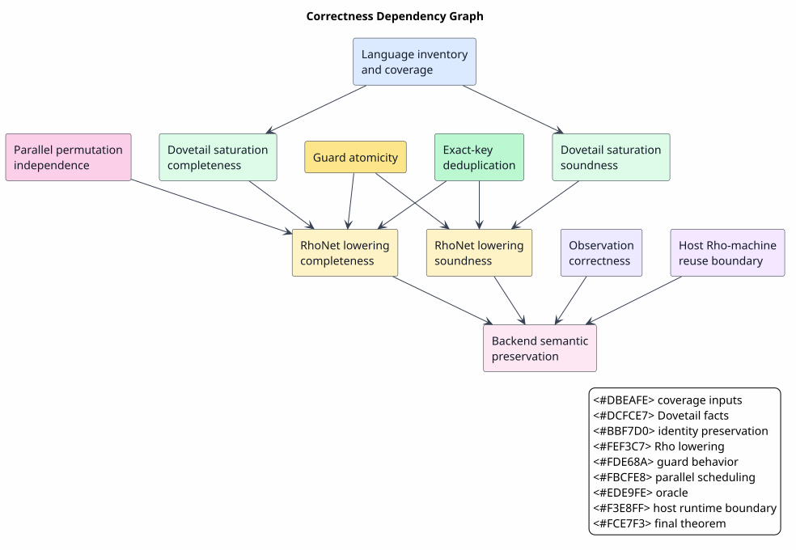
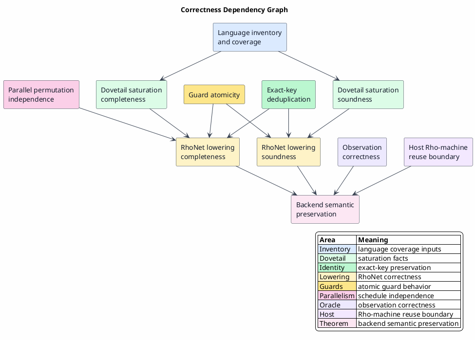

# Correctness and Coverage

Last updated: 2026-06-13

This document states the correctness argument for the Rho-native MeTTaIL
integration. The proofs here are mathematical prose proofs for the architecture.
Mechanized proof targets are listed in
[Verification and Rollout](07-verification-and-rollout.md).

The proof style uses standard operational-correspondence and process-calculus
ideas from the π-calculus and Rho calculus literature
([PI-1992-I](references.md#pi-1992-i),
[PI-1992-II](references.md#pi-1992-ii),
[RHO-2005](references.md#rho-2005),
[LYBECH-2022](references.md#lybech-2022)), plus repository-local Rocq proof
artifacts ([DOVETAIL-FORMAL](references.md#dovetail-formal),
[METTAIL-RUNTIME-FORMAL](references.md#mettail-runtime-formal),
[RHO-BRIDGE-FORMAL](references.md#rho-bridge-formal)).

All symbols used here are defined in
[Concepts and Glossary](01-concepts-and-glossary.md).

## Scope of the Correctness Claim

The claim is intentionally scoped:

`Dovetail-supported requirements + explicit native/Rho contracts`

For those requirements, the Rho-native backend should preserve Dovetail's
observable rewrite semantics when replacing the CESK runtime backend. The claim
is not:

- a replacement for the active WPDA parser/recognizer;
- removal of the retained Ascent reference/oracle path before Dovetail/Rho has
  fully subsumed the required behavior;
- full abstraction for all Rholang contexts;
- strong bisimulation across thunk/force boundaries, because the proved
  call-by-need contract is weak observation equivalence;
- a per-language production flip before that language's proof, runtime oracle,
  coverage, artifact-validation, scheduler-fairness, and deadlock gates pass;
- correctness of arbitrary user-written Rholang mixed into generated code.

## Definitions

### Source Semantics

Let `L` be a MeTTaIL language definition. Let `F₀` be the initial fact set for a
parsed source term. Let `D_L` be Dovetail's monotone derivation operator for
language `L`.

The Dovetail fixed point is:

`Fᴰ = μF. F₀ ∪ D_L(F)`

For semi-naive execution:

`Fᵢ₊₁ = Fᵢ ∪ Δᵢ₊₁`

`Δᵢ₊₁ = derive(Fᵢ, Δᵢ) ∖ Fᵢ`

### RhoNet Semantics

Let `N = lower(L, F₀)` be the RhoNet network produced from `L` and the seed
facts. Let `ρ₀` be the initial RhoNet configuration. Let `ρ → ρ′` be one
RhoNet communication step. Let `ρ ⇓ ρ*` mean that `ρ` reaches a quiescent
configuration `ρ*`.

The observable Rho fact set is:

`Fᴿ = obs(ρ*)`

where `obs` projects out scheduler metadata and canonicalizes names.

### Correctness Target

The main target is:

`Fᴿ = project(Fᴰ)`

for the supported fragment, under fair Rho scheduling and the explicit
native-contract preconditions recorded in the coverage matrix.

`project` removes facts outside the selected observation boundary and applies
the documented name/e-class quotient.

## Theorem 1: Dovetail Saturation Soundness

Statement:

`f ∈ Fᴰ ⇒ f` has a valid derivation from `F₀` using the rules of `L`.

Proof:

The proof is by induction on the first iteration where `f` appears.

Base case: If `f ∈ F₀`, then `f` is a seed fact. The seed rule is valid by
construction of the parsed input.

Induction step: Suppose `f ∈ Δᵢ₊₁`. By the definition of `derive(Fᵢ, Δᵢ)`,
there exists a rule instance `r` and substitution `σ` such that every premise of
`r` is in `Fᵢ`, at least one triggering premise is in `Δᵢ`, and the conclusion
of `r` under `σ` is `f`. By the induction hypothesis, every premise in `Fᵢ` has
a valid derivation from `F₀`. Applying rule `r` to those derivations yields a
valid derivation of `f`. Therefore every fact in `Fᴰ` is sound.

## Theorem 2: Dovetail Saturation Completeness

Statement:

If a fact `f` is derivable by finitely many applications of covered Dovetail
rules from `F₀`, then `f ∈ Fᴰ`, unless execution reports an explicit bounded
outcome.

Proof:

Let the height of a finite derivation be the maximum number of rule applications
on any path from a seed fact to the conclusion. The proof is by induction on
derivation height.

Base case: Height `0` means `f ∈ F₀`, hence `f ∈ Fᴰ`.

Induction step: Let `f` be derived by rule `r` from premises
`p₁, ..., pₙ`, each of smaller derivation height. By the induction hypothesis,
each `pᵢ` eventually appears in the saturation sequence unless an explicit
bound is reported. After the last premise appears, semi-naive evaluation will
consider a rule instance with at least one newly arrived premise in the delta
set. Since `r` is covered and its guard/native contract succeeds for this
derivation, `derive` produces `f`. Exact-key deduplication removes only facts
already represented by the same observational key, so either `f` is inserted or
an equivalent fact is already present. Therefore `f ∈ Fᴰ` up to exact-key
identity.

## Theorem 3: Rho Lowering Soundness

Statement:

Every observable fact emitted by a lowered RhoNet contract corresponds to a
Dovetail derivation:

`f ∈ Fᴿ ⇒ f ∈ project(Fᴰ)`

Proof:

Each emitted observable fact is produced by either a seed send or a contract
body.

Seed sends are generated only from `F₀`, so they are in `Fᴰ`.

For a contract body, the lowering algorithm creates a contract only from a
Dovetail rule `r`. Its receive binds are generated from the premises of `r`.
RhoNet COMM fires only when every bind matches a present fact and the guard is
true. By induction on the RhoNet trace, every consumed premise fact corresponds
to a Dovetail fact. Since the guard result is true and the right-hand side is
constructed by the same substitution `σ`, the Dovetail rule instance derives
the emitted conclusion. Therefore the emitted fact belongs to `Fᴰ` up to the
observation projection.

## Theorem 4: Rho Lowering Completeness

Statement:

For the supported fragment, under fair scheduling:

`f ∈ project(Fᴰ) ⇒ f ∈ Fᴿ`

Proof:

Let `f` be a projected Dovetail fact. By Dovetail completeness, `f` has a finite
derivation from `F₀`, unless an explicit bound applies. The proof proceeds by
induction on derivation height.

Base case: If `f ∈ F₀`, the Rho lowering emits a seed message for `f`; therefore
`f` is present in the Rho configuration or has already been consumed to derive
other represented facts. Stable fact channels preserve the represented key, so
`f ∈ Fᴿ` at observation time.

Induction step: Suppose `f` is derived by rule `r` from premises
`p₁, ..., pₙ`. By the induction hypothesis, each premise is eventually emitted
to its corresponding fact channel. The lowering algorithm installs a persistent
contract for `r`, with a join over exactly those premise channels. Once all
premises are present and the guard is true, the join is enabled. By fairness, an
enabled join eventually fires. Its body emits `f` or an exact-key equivalent.
Deduplication cannot remove a new fact unless an equivalent fact already exists.
Therefore `f ∈ Fᴿ`.

Mechanized bridge support:
[RHO-BRIDGE-FORMAL](references.md#rho-bridge-formal) includes
`CommReductionCorrespondence.v`, whose `lowered_transition_equivalent` and
`lowered_trace_equivalent` theorems prove both directions for the pure RhoNet
rule fragment modeled as exact-key fact-set transitions. It also includes
`LinearCommCorrespondence.v`, whose `comm_step_sound` and `comm_step_complete`
theorems prove both directions for the M-RHO.1 one-shot linear COMM model where
the matched send and receive are consumed.

## Theorem 5: Ambiguity Preservation

Statement:

Semantic alternatives are not lost by Rho scheduling:

`candidate(c) ∈ Fᴰ ⇒ candidate(c) ∈ Fᴿ`

for every supported candidate `c`, under the preconditions of Theorem 4.

Proof:

The lowering represents alternatives as explicit candidate facts. It does not
lower semantic choice to Rholang `select`. Therefore scheduler nondeterminism
can affect the order in which candidates are emitted, but not the set of
candidate contracts or the fact that each enabled contract remains persistent.
By Theorem 4, each candidate fact derivable in Dovetail is eventually emitted by
the Rho network. Since observation canonicalizes sets rather than trace order,
the final candidate set is preserved.

## Theorem 6: Exact-Key Deduplication Preserves Distinct Facts

Statement:

If two facts have distinct exact keys, deduplication cannot merge them:

`key(f) ≠ key(g) ⇒ dedup({f, g})` contains representatives for both keys.

Proof:

The dedup service indexes facts by exact key. Insertion of `f` consults only
`key(f)`. Insertion of `g` consults only `key(g)`. If `key(f) ≠ key(g)`, the two
lookups address different entries. Therefore neither insertion can suppress the
other. Suppression occurs only when a key is already present, in which case the
service must verify observational equality or report a contract violation.

Mechanized support:
[METTAIL-RUNTIME-FORMAL](references.md#mettail-runtime-formal) includes
`ExactReachabilityDedup.v`, whose `legacy_seed_expands_all_exact_keys`,
`exact_successor_preserved`, and `legacy_collision_keeps_both` theorems prove
that older id-only seed ids expand to all exact-key representatives and exact-key
successors are preserved. Its `id_only_dedup_can_drop_exact_candidate` witness
records the counterexample that forbids id-only reachability deduplication.

## Theorem 7: Guard Atomicity

Statement:

A failed lowered guard does not consume facts:

`guard(σ) = false ⇒ no_commit`

Proof:

The lowering places same-bind pure guards in RSpace's receive guard position,
or delegates complex guards to a native guard handler used before commit. In
both cases, the generated receive is specified to commit only when the guard
returns true. Therefore if the guard returns false, the RSpace operation behaves
as no match: data remains available and the continuation remains installed.
Consequently no source fact is consumed by a failed guard.

## Theorem 8: Parallel Permutation Independence

Statement:

For disjoint-channel firings `a` and `b`:

`channels(a) ∩ channels(b) = ∅ ⇒ obs(b(a(ρ))) = obs(a(b(ρ)))`

Proof:

A firing reads and writes only its channel set. If the channel sets are
disjoint, firing `a` cannot alter the facts or continuations observed by firing
`b`, and firing `b` cannot alter those observed by firing `a`. Therefore both
orders perform the same two substitutions, emit the same two conclusion facts,
and leave the same observable fact set. Scheduler metadata and trace order may
differ, but `obs` projects those away. Hence the observations are equal.

## Theorem 9: Observation Correctness

Statement:

The oracle observation equals the represented normal-form candidate set:

`obs(ρ*) = canon(project(resting(ρ*)))`

and this set is comparable to Dovetail normal forms.

Proof:

The observation function reads only documented output and candidate channels. It
ignores scheduler metadata, continuation internals outside the observation
boundary, and replay bookkeeping. It canonicalizes names using the same
rendering discipline used by lowering. It quotients by exact e-class identity,
not by lossy display strings or 64-bit hashes. Therefore every observed item is
the canonical image of an emitted candidate fact, and every emitted candidate
fact on an observed channel contributes exactly one canonical representative.
This is precisely `canon(project(resting(ρ*)))`.

## Theorem 10: Coverage Honesty

Statement:

For every MeTTaIL rewrite requirement:

`Covered(req) ∨ Rejected(req, reason) ∨ ExternalContract(req)`

Proof:

The coverage inventory enumerates requirements from actual language
definitions and classifies each requirement by constructor, equation, rewrite,
guard, native handler, pattern form, cyclic behavior, or Rho contract. The
classification is exhaustive over the inventory. For each class, the matrix
records one of three statuses: handled by Dovetail core, rejected with an
explicit reason, or delegated to an external/native/Rho contract. Therefore no
requirement remains unclassified. The statement is a coverage theorem, not a
claim that every external contract is already mechanized.

For the Rho lowering gate, disposition coverage is exact at the rule-identity
level:
`AllRulesLowered` is acceptable only when the rejected set is empty, and
`CoveredRejectedRules(D)` is acceptable only when the rule ids carried by
`D` are the same set as the lowering rejection set `R`. Each disposition also
carries a kind, such as native handler, external contract, or non-scalar Rho AST
contract, and a non-empty evidence reference. Duplicate disposition claims are
invalid.

`ValidDispositionCoverage(R, D) ⇔ (∀r. r ∈ R ⇔ r ∈ ruleIds(D)) ∧ Auditable(D)`

`Auditable(D) ⇔ noBlankRuleId(D) ∧ noBlankEvidenceRef(D) ∧ noDuplicateRuleId(D)`

Mechanized support:
[RHO-BRIDGE-FORMAL](references.md#rho-bridge-formal) includes
`RhoRejectedCoverage.v`, whose
`all_rules_lowered_exact_iff_no_rejections`,
`covered_rejections_exact_iff_same_rule_set`,
`omitted_rejected_rule_blocks_default_backend`,
`stale_disposition_blocks_default_backend`,
`inauditable_disposition_blocks_default_backend`, and
`duplicate_disposition_blocks_default_backend` theorems prove this gate.

## Theorem 11: Host Rho Machine Reuse Boundary

Statement:

An accepted Rho backend plan includes the host Rholang interpreter and host
RSpace, and excludes a MeTTaIL-owned reducer, tuple space, matcher, or replay
engine.

Proof:

The backend plan is accepted only when the host interpreter and host RSpace are
present and no component is classified as a custom Rho-machine component. From
the first conjunct, the accepted plan delegates process reduction and tuple
space operations to F1r3node. From the second conjunct, the accepted plan cannot
contain a MeTTaIL-owned reducer, tuple space, matcher, or replay engine.
Therefore the Rho backend is a lowering/session/observation bridge, not a
second Rho machine.

Mechanized support:
[RHO-BRIDGE-FORMAL](references.md#rho-bridge-formal) includes
`HostRhoMachineReuse.v`, whose `accepted_backend_uses_host_interpreter`,
`accepted_backend_uses_host_rspace`, and
`custom_machine_component_blocks_acceptance` theorems encode this boundary.

## Theorem 12: Generated Artifact Boundary

Statement:

For generated backend execution, the executable artifact is a validated host
artifact, not Rholang source text:

`GeneratedAccepts(a) ⇒ ¬SourceText(a)`

For the current implementation artifact family:

`GeneratedAccepts(a) ⇒ ∃p. a = Ast(p) ∧ Validated(p)`

Proof:

The generated backend entry point is the planned Rho backend. A planned backend
contains a flip-gated default-backend plan, and the plan contains a
validation-gated execution artifact. The current artifact constructor is the
normalized host AST `rhoapi::Par`; Rholang-looking text is carried only as a
reader annotation. Since source text is not a validated execution artifact,
introducing a source-text artifact into the artifact universe does not make it
acceptable: the generated-backend acceptance predicate rejects it directly.
Therefore generated execution can inject a validated host artifact into
F1r3node, but cannot parse Rholang text as the generated backend's executable
value.

Mechanized support:
[RHO-BRIDGE-FORMAL](references.md#rho-bridge-formal) includes
`RhoArtifactBoundary.v`, whose
`accepted_current_generated_artifact_not_source_text`,
`accepted_current_generated_artifact_has_validated_ast`,
`current_lowered_scalar_artifact_is_ast_not_source_text`, and
`planned_current_execution_never_uses_source_text` theorems encode this
boundary.

## Boundary Non-Claims

These boundaries prevent over-claiming; they are not evidence gaps for the
stated backend-correctness theorem.

| Non-claim | Reason |
|---|---|
| strong bisimulation for generic CBN | force/thunk channels introduce internal behavior not present in the source |
| full abstraction | arbitrary Rholang contexts can observe or interfere beyond the generated boundary unless restricted |
| finite complete enumeration of productive cyclic k-best spaces | `CyclicEnumerationImpossibility.v` proves a productive self-cycle has more derivations than any finite list can exhaust; Dovetail reports bounded cycle cuts explicitly |
| host Rholang compiler correctness | the backend relies on the host compiler and verifies the bridge contract |
| unconditional production flip for every language | the proved flip gate requires that language's proof, oracle, coverage, artifact-validation, scheduler-fairness, and deadlock evidence |

## Proof Dependency Diagram

PlantUML source:
[figures/06-correctness-and-coverage.puml](figures/06-correctness-and-coverage.puml).

## Final Preservation Theorem

Statement:

For a MeTTaIL language `L`, source term `t`, and supported Rho backend lowering:

`obs(run_Rho(lower(L, t))) = project(run_Dovetail(L, t))`

provided:

1. every requirement is covered, rejected, or delegated to an explicit contract;
2. external/native contracts satisfy their stated semantics;
3. exact keys are injective for the observation domain;
4. the Rho scheduler is fair;
5. the observation function uses the documented quotient;
6. no explicit bounded outcome is misreported as complete.

Proof:

By Dovetail soundness and completeness, `run_Dovetail(L, t)` is exactly the
covered fixed point of the source rewrite semantics, modulo explicit bounds and
external contracts. By Rho lowering soundness, every Rho-observed fact belongs
to the projected Dovetail fixed point. By Rho lowering completeness under
fairness, every projected Dovetail fact is eventually emitted by the Rho
network. Exact-key deduplication preserves distinct facts, ambiguity is
represented explicitly, and observation canonicalizes away only documented
runtime artifacts. Therefore the two observed result sets are equal.
