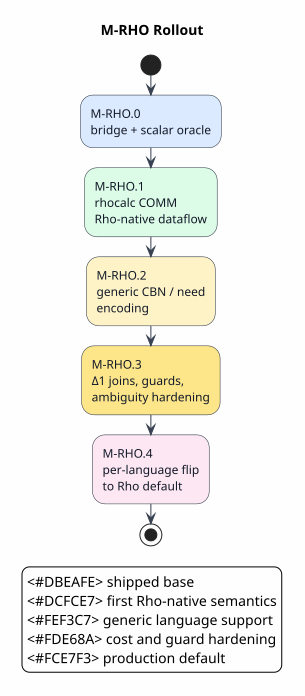

# Verification and Rollout

Last updated: 2026-06-15

This document turns the architecture into an implementation evidence ledger and
gate policy. It distinguishes mechanized bridge contracts from per-language
CESK runtime-backend flip gates: a contract can be proved here, while a language
becomes Rho-default only after checkable coverage, artifact-validation, and
deadlock gates pass. Proof and oracle evidence is attributed in this document
and in implementation comments; it is not carried as runtime data.

All symbols used here are defined in
[Concepts and Glossary](01-concepts-and-glossary.md).

## Current Verified Base: M-RHO.0

M-RHO.0 established an inert, one-way bridge and the first scalar-operation
execution path.
The current proof and coverage sources are
[RHO-BRIDGE-FORMAL](references.md#rho-bridge-formal),
[DOVETAIL-FORMAL](references.md#dovetail-formal), and
[COVERAGE-MATRIX](references.md#coverage-matrix).

| Area | Artifact | Status |
|---|---|---|
| bridge direction | `formal/rocq/rho_bridge/theories/BridgeInertness.v` | proved one-way dependency shape |
| host Rho-machine reuse | `HostRhoMachineReuse.v` | proved accepted backend plans include host Rholang/RSpace and exclude custom reducer, tuple-space, matcher, and replay components |
| OSLF/funding adapter | `MettaOslfLawsConformance.v`, `MettaGsltPresentation.v` | proved modeled funding laws |
| total-or-reject lowering | `RhoLoweringTotalOrRejects.v` | proved every rule lowers or is rejected |
| rejected-rule coverage | `RhoRejectedCoverage.v` | proved `AllRulesLowered` accepts only an empty rejected set; `CoveredRejectedRules` must name exactly the rejected rule set; omitted, stale, duplicate, or blank-rule dispositions block the default-backend gate; advisory rejected-rule classifications preserve rule identity and still require explicit disposition before becoming accepted coverage |
| normalized Rholang AST boundary | `RhoParWellFormedness.v`, `RhoArtifactBoundary.v`, `RhoAstSendBoundary.v` | proved scalar-contract `Par` shape, positive bind counts, bind-count agreement, return-channel convention, validation soundness/completeness, generated-backend rejection of source-text artifacts, and dynamic call/witness sends as AST artifacts rather than source text; checked scalar-contract invocation preserves ABI payloads, rejects arity mismatches, selects the observation report shape from the ABI result type, structured dynamic payloads preserve list, map, and bag literals across the AST boundary, and the codegen-owned `RhoScalarContractInvocation` payload normalizes to the same AST call without becoming source text |
| type-sensitive scalar operator lowering and generated scalar ABI | `RhoScalarOperatorTyping.v`, `mettail-rho-codegen::{lower,plan_scalar_invocations,RhoScalarContractInvocation}`, generated `rho-codegen` helpers | proved and tested that native scalar operators are selected from terminal plus operand/result types; `Int + Int → Int` lowers to Rholang integer addition, `Str + Str → Str` and `Str ++ Str → Str` lower to Rholang string concatenation, unary `not` and unary integer negation lower only at their matching scalar types, ill-typed or mixed scalar operators are rejected, every accepted scalar rule yields a generated `RhoScalarContractAbi` with operands first and the return channel last, ABI-derived invocation plans preserve constructor label, operand order, and result family, and generated language crates emit codegen-owned invocation payloads instead of linking directly to `mettail-rho-runtime` |
| rhocalc AST-first lowering | `RhocalcAstLowering.v`, `mettail-rho-runtime::{lower_rhocalc_proc,lower_rhocalc_term}`, `mettail-rho-runtime/tests/rho_rhocalc_ast.rs` | proved accepted rhocalc lowerings are AST artifacts, quote/drop lowering preserves the body, list order is preserved, map key/value pairs are preserved, bag multiplicities are preserved, ambiguous two-Proc terms preserve both branches, one-input COMM fires the payload, two-input COMM preserves syntactic binder order under f1r3node's de Bruijn convention, and bound-bit filtering removes receive-local variables; runtime tests parse with WPDA, lower to `Par`, preserve every exact-key-distinct ambiguous Proc branch, deduplicate exact duplicates, reject cross-category ambiguity instead of dropping it, inspect list/map/bag AST shape, inject into RhoRuntime, and observe COMM results |
| RhoNet/COMM correspondence | `CommReductionCorrespondence.v` | proved lowered pure-rule traces match Dovetail traces |
| linear COMM correspondence | `LinearCommCorrespondence.v` | proved one-shot COMM consumes the matched send and receive, with sound/complete lowering correspondence |
| Rho name grounding | `RhoGroundingAndNames.v` | proved fresh private names avoid capture of grounded facts |
| resting-space fingerprint and observation report | `RhoObservationFingerprint.v`, `RhoObservationReportBoundary.v`, `RhoRuntimeBackendReportBridge.v`, `mettail-rho-runtime::RhoObservationReport`, `mettail_runtime::RuntimeBackendReport::try_observations` | proved exact-key fingerprints are membership-exact, multiplicity-exact, and order-insensitive; planned runtime reports preserve the planned backend boundary, channel, read-order values, exact set-membership fingerprint, and exact counted fingerprint; conversion to the generic `RuntimeBackendReport` preserves Rho backend identity, normalized-AST artifact kind, channel, read-order values, observed count, and scalar plus structured observation payload tags without fabricating an Ascent-shaped result; the generic runtime envelope rejects observation-shaped reports unless the backend is `RhoMachine` and the artifact is a Rho runtime artifact |
| ambiguity witnesses | `AmbiguityWitnessEnumeration.v` | proved enabled candidates are enumerated independently of schedule order |
| oracle exactness | `OracleQuotientEquivalence.v` | proved weight-erased key equality is exact |
| call-by-need observation, planned AST artifact, typed payloads, and budget | `RhoCallByNeedObservation.v`, `RhoCallByNeedBudget.v` | proved thunk forcing and memoization preserve weak source observation, accepted need artifacts are AST rather than source text and carry the call-by-need validation profile rather than the scalar-contract profile, accepted planned need execution wraps an accepted artifact and admits both force steps, cold/hot AST thunk plans observe the source value twice with the expected memo behavior, typed need reports preserve runtime payload tags separately from textual eval markers, and bounded force admission respects lookahead and heap budgets |
| Δ1 candidate minima | `DeltaOneMinCostJoin.v` | proved selected preformed join candidates are present, non-refuted, and cost-minimal |
| Δ1 min-cost matching | `DeltaOneMinCostMatching.v` | proved selected left-perfect bipartite join-frontier matchings are endpoint-valid, non-refuted, duplicate-free, left-covering, and globally cost-minimal |
| guarded COMM | `GuardedCommSoundness.v` | proved false guards do not commit and attempts fabricate no facts |
| predicated-type guard coverage | `RhoBackendFlipGate.v`, `mettail-rho-codegen::collect_guard_obligations`, `mettail-rho-codegen::RhoGuardCoverageEvidence` | proved and tested that Rho-default selection requires exact coverage of every guard obligation induced by `LanguageDef`: behavioral predicates, structural patterns, theory registrations, and Rho-native channel/join declarations; uncovered, extraneous, duplicate, blank-obligation, or incompatible guard dispositions block the default backend |
| ambiguity-set preservation | `AmbiguitySetPreservation.v` | proved schedule order preserves observed candidate sets |
| cost-axis separation | `RhoCostAxisSeparation.v` | proved ordering costs cannot remove candidates; refutation is explicit |
| escrow/refund settlement | `RhoEscrowSettlement.v`, `mettail-rho-adapter::settlement` | proved reserve/commit/refund conservation, fail-closed blockers, bounded `u64` overflow blockers, and reserve/refund restoration |
| per-purse determinism | `RhoPurseDeterminism.v`, `formal/tla/rho_settlement/`, `mettail-rho-adapter::LocatedEscrowLedger` | proved duplicate purses reject, missing purses reject, local blockers preserve the ledger, located actions are deterministic, and distinct-purse final ledgers commute |
| backend flip gate | `RhoBackendFlipGate.v` | proved Rho default requires checkable exact coverage of rejected rules, exact coverage of guard/predicated-type obligations, artifact validation, and deadlock gates |
| planned Rho execution boundary | `RhoPlannedExecutionBoundary.v`, `mettail-rho-runtime::PlannedRhoBackend` | proved and implemented that generated backend execution consumes a flip-gated plan, not merely a raw shape-validated artifact |
| runtime backend dispatch and wrappers | `RuntimeBackendDispatch.v`, `DovetailLanguageBackendWrapper.v`, `RhoLanguageBackendWrapper.v`, `DovetailRhoLanguageBackendWrapper.v`, `GeneratedLanguageInstallation.v`, `RhoRuntimeBackendReportBridge.v`, `mettail_runtime::RuntimeBackendReport`, `mettail_runtime::LanguageMetadata::definition_fingerprint`, `mettail_ast::identity::language_definition_fingerprint`, `mettail_dovetail_runtime::DovetailCompilerStage`, `mettail_dovetail_runtime::DovetailRuntimeBackedLanguage`, `mettail_rho_runtime::DovetailCompilerStage`, `mettail_rho_runtime::RhoInvocationCompilerStage`, `mettail_rho_runtime::{install_rho_runtime_backend,install_dovetail_rho_runtime_backend}`, `mettail_rho_runtime::RhoRuntimeBackedLanguage`, `mettail_rho_runtime::DovetailRhoRuntimeBackedLanguage` | proved default report execution succeeds only when the selected backend is installed; absent Dovetail/Rho defaults fail closed instead of falling back to Ascent; installed Dovetail defaults return Dovetail-report-shaped runtime output and are rejected by the legacy Ascent-shaped compatibility wrapper; the Dovetail wrapper selects `Dovetail` as the default, strips the legacy Ascent runtime from the production wrapped value, delegates only non-Dovetail and non-Ascent backend support to the inner generated language, requires the Dovetail compiler-stage fingerprint to match the wrapped generated language's macro-expanded `LanguageDef` fingerprint, requires a complete and structurally well-formed checked report, rejects mismatched compiler stages, rejects `BoundedByCycleCut`, rejects malformed projected report tables, and rejects Ascent-shaped seeded facts on the Dovetail path; installed Rho defaults return observation-shaped reports backed by Rho runtime artifacts and are rejected by the legacy Ascent-shaped compatibility wrapper; checked `RuntimeBackendReport::try_dovetail` and `try_observations` constructors are the only public non-Ascent report constructors, and `RuntimeBackendReport` fields are private, so malformed report-shaped and observation-shaped outputs cannot enter through an unchecked runtime API or external struct literal; the runtime report bridge preserves observation value tags for native scalar payloads and structured list/map/bag payloads; the Rho wrapper selects `RhoMachine` as the default, strips the legacy Ascent runtime from the production wrapped value, delegates only non-Rho and non-Ascent backend support to the inner generated language, requires both the planned backend fingerprint and the Rho invocation compiler-stage fingerprint to match the wrapped generated language's macro-expanded `LanguageDef` fingerprint, requires a total typed invocation for Rho reports, rejects same-name fragment/full-definition mismatches, rejects mismatched invocation stages, and rejects Ascent-shaped seeded facts on the Rho path; the composed Dovetail/Rho wrapper selects `RhoMachine` as the default, exposes `Dovetail` only as the checked intermediate report, requires matching macro-expanded `LanguageDef` fingerprints across generated metadata, the planned Rho backend, the Dovetail compiler stage, and the invocation compiler stage, requires Dovetail report availability, structural well-formedness, and `Complete` before Rho invocation construction, rejects fragment/full-definition mismatches, rejects bounded or malformed Dovetail reports before Rho execution, and rejects Ascent plus Ascent-shaped seeded facts. The canonical installer helpers derive the Dovetail and invocation compiler-stage identities from the accepted Rho plan, so generated installer code targets one plan-derived identity instead of hand-threaded fingerprint strings |
| simulation report boundary | `SimulationReportBoundary.v`, `mettail-simulation::{runner,coverage,trace}` | proved and tested that complete Dovetail reports with at least one extracted root satisfy `NormalFormReachable` as terminal rewrite-result evidence, while rootless complete reports, `BoundedByCycleCut` reports, Rho observations, and unsupported report shapes do not; Dovetail reports remain `RuntimeReport` outcomes, Rho observations remain `RuntimeObservations`, and trace coverage records runtime terminal steps without fabricating rewrite-rule firings |
| Dovetail report boundary and Rho handoff | `dovetail::report`, `RuntimeReportBridge.v`, `RhoReportHandoff.v` | proved checked extraction reports preserve exact keys, extractor root order, deduplicated term records, and terminal completeness; Rho handoff observes exactly complete-report roots and rejects `BoundedByCycleCut` without observations |
| COMM schedule family and guarded joins | `RhoCommScheduleFamily.v`, `formal/process/rho_comm_slice.json`, `formal/mcrl2/rho_machine/`, `formal/maude/rho_machine/`, `formal/tla/rho_machine/` | proves every finite independent-redex Rho reserve/fire schedule erases to the same visible observations as the direct Dovetail fire schedule, full permutation schedules enable completion, missing-redex prefixes reject completion, and permutation schedules preserve the fired-redex set; the generated process-calculus suite independently checks no deadlock, all 24 visible fire/complete schedules, premature-completion unreachability, branching bisimilarity modulo hidden reserve actions, unique matching terminal normal forms, weak-fair scheduler completion, and guarded-join non-consumption: a failed guard releases data, a valid join can commit afterward, and the rejected bad datum remains observable |
| runtime smoke | `mettail-rho-runtime/tests/run_calculator.rs` | runs a validated Rho-default backend plan for lowered calculator ops on RhoRuntime using `RhoAstSend` call artifacts |
| AST ambiguity witness smoke | `mettail-rho-runtime/tests/rho_ambiguity_ast.rs` | injects receive-less ambiguity witness facts as normalized AST, observes grouped key/payload tuples, and feeds them into `AmbiguityWitnessSet` |
| differential oracle | `mettail-rho-runtime/tests/rho_vs_ascent.rs` | compares a validated Rho-default backend plan with Ascent results |

The Rho bridge now has mechanized model contracts for pure COMM, name
grounding, exact observation, call-by-need forcing, `Δ1` cost-minimal candidate
selection and exact bipartite matching, guards, ambiguity preservation,
cost-axis separation, escrow/refund settlement, per-purse determinism, exact
rejected-rule delegation, normalized-`Par`
well-formedness, source-text artifact exclusion, backend flip gating,
fail-closed runtime dispatch, and report-aware simulation outcomes.
The flip gate now treats predicated types as first-class coverage obligations:
`mettail-rho-codegen::collect_guard_obligations` derives behavioral predicates,
structural predicates, theory registrations, and Rho-native channel/join
requirements from `LanguageDef`, while
`RhoGuardCoverageEvidence::CoveredGuardObligations` must give every obligation
one compatible evidence-backed disposition. The accepted dispositions are
Dovetail-core structural matching, effective Boolean algebra, symbolic
finite-state transducer, Rho-native join, native handler, and external
contract. This is the mechanism that admits fully generalized predicated types
over scalar, algebraic, collection, process/name, and host-backed data domains
without hard-coded category heads.
Dovetail-to-runtime handoff now starts from a checked Dovetail report rather
than an Ascent-shaped success value. The handoff proof requires complete
reports before emitting Rho-visible observations, preserves the extractor root
order as the observed exact-key sequence, and rejects `BoundedByCycleCut`
reports without observations.
Generated Rho execution now starts from `PlannedRhoBackend`, which wraps the
`RhoDefaultBackendPlan` produced by the flip gate; raw validated artifacts remain
available for oracle/debug helpers only. Direct Rho runtime wrappers also take
a `RhoInvocationCompilerStage`, not a bare invocation closure, so the typed
call builder must carry the same macro-expanded `LanguageDef` fingerprint as
the generated language and the planned backend before `RhoMachine` can become
the selected default. Dynamic contract calls and ambiguity witnesses are
constructed with `mettail_rho_codegen::RhoAstSend`. Its
`RhoAstLiteral` payloads lower scalar values, collections, unforgeable names,
and rhocalc bags directly to normalized `Par`; the rhocalc bag ABI tag is owned
by `mettail-rho-codegen` and re-exported by `mettail-rho-runtime` so send-side
encoding and runtime observation decoding cannot drift. The rhocalc process
bridge lowers MeTTaIL/WPDA `Proc` and `Name` values with `lower_rhocalc_proc`
and `lower_rhocalc_name`, and lowers generated `RhoCalcTerm` values with
`lower_rhocalc_term`, so both dynamic calls and transport-pure rhocalc
programs cross the runtime boundary as normalized `Par` values. Ambiguous
`Proc` terms cross as exact-key-deduplicated parallel branches, while
cross-category ambiguity fails closed rather than choosing one branch. Their
Rholang-looking strings are annotations for logs, tests, and documentation, not
executable source.
Generated Rho observations now use typed `RhoObservationReport<T>` at the
Rho-runtime boundary and `mettail_runtime::RuntimeBackendReport` at the generic
`Language` boundary rather than forcing Rho results into `AscentResults`.
The typed report carries the planned execution boundary, the artifact kind, the
observed channel, the read-order values, an order-insensitive set-membership
fingerprint for set-semantics oracle comparison, and an order-insensitive
counted fingerprint for bag-sensitive observations. With the optional
`mettail-rho-runtime/runtime-report` feature, typed Rho observation payloads
convert through `try_into_runtime_backend_report`, which fails closed for future
unknown artifact kinds and then through `RuntimeBackendReport::try_observations`,
which rejects observation-shaped output unless it names `RhoMachine` and a Rho
runtime artifact. The generic report carries the selected backend, artifact
kind, and channel observations so callers can select
`RhoMachine` without depending on Ascent-shaped fact materialization.
The current planned Rho backend observes lowered native scalar and collection
payloads through `RuntimeObservationValue`: `Int`, `Bool`, and `Str` become
`Int`, `Bool`, and `Text`; byte, URI, bit-exact numeric, unforgeable-name, list,
tuple, set, map, and tagged rhocalc-bag payloads retain their own runtime value
tags. `RhoRuntimeBackendReportBridge.v` names the tag-preservation contract.
The generic call-by-need path now uses the same value domain: a
`CallByNeedThunkSpec` carries its computed payload as a closed `RhoAstLiteral`,
the planned thunk writes that payload directly into the memo and value channel,
and `PlannedCallByNeedThunk::run_and_observe_need_report` decodes the value
channel as typed `RuntimeObservationValue`s while decoding the evaluation
channel only as textual trace markers.
`mettail-rho-runtime/tests/run_calculator.rs` executes the full native
calculator scalar family currently admitted by the lowerer on the real
in-memory RhoRuntime: integer arithmetic, integer, boolean, and string
comparisons, boolean `and`/`or`/`not`, and string concatenation.
`mettail-rho-runtime/tests/rho_language_backend_report.rs` separately checks
the generic call-by-need path over a generated scalar case matrix: each planned
`RhoAstLiteral` payload for supported `Int`, `Bool`, and `Str` operations is
compared against `CalculatorLanguage::run_ascent` normal forms before the
representative thunk plans are executed on RhoRuntime.
`mettail-rho-runtime/tests/rho_rhocalc_ast.rs` exercises the structured path by
lowering rhocalc list, map, and bag typed AST payloads directly to `rhoapi::Par`
and observing recursive runtime values from RSpace.
The string-valued check is deliberately end-to-end at the wrapper boundary:
the Calculator snippets `"rho" ++ "net"` and `"rho" + "net"` are parsed by the
retained MeTTaIL/WPDA frontend, mapped to typed `Str::Concat` and `Str::AddStr`
terms, converted by the Rho wrapper's invocation mapper into normalized
`rhoapi::Par` contract calls, executed by RhoRuntime, and returned as
`RuntimeObservationValue::Text("rhonet")` observations in the generic runtime
report. The second snippet is an important regression: the source token is `+`,
but the typed rule is `Str × Str → Str`, so the generated AST body must be
`EPlusPlus`, not integer `EPlus`.
Generated languages do not need to depend on `mettail-rho-runtime` to become
Rho-default. `RhoRuntimeBackedLanguage<L, F>` lives in the Rho runtime crate and
wraps an existing generated `Language`: `L` still owns parsing, environments,
and type inference, while transition-only explicit Ascent
oracle execution remains outside the wrapped production value. `F` maps a typed
generated term into a dynamic `rhoapi::Par` call or direct observation request.
The wrapper checks language identity before it can advertise `RhoMachine`.
Generated `LanguageMetadata` now exposes a stable compiler-facing fingerprint
computed directly from the macro-expanded `LanguageDef`. `RhoDefaultBackendPlan`
carries the fingerprint of the `LanguageDef` it lowered. Production direct-Rho
installation wraps the Rho invocation compiler in a typed stage carrying the
same fingerprint; composed Dovetail/Rho installation wraps both the Dovetail
compiler and the Rho invocation compiler in typed stages carrying that
fingerprint. A scalar fragment plan may still serve as oracle evidence, but it
cannot be installed as the production backend for a full generated language
whose expanded `LanguageDef` differs, and neither can an invocation compiler
stage derived from a different definition. Once installed, the wrapper
advertises `RhoMachine` as the default runtime backend through the concrete
`Language::runtime_backend_capabilities()` view, not by mutating the generated
`LanguageMetadata::runtime_backends()` table. Static metadata therefore remains
a statement about the generated crate; the runtime capability view is a
statement about the particular wrapped value and its installed checked Rho plan.
This keeps the dependency direction one-way and keeps Rho execution AST-first:
generated calls are `rhoapi::Par` values, with any Rholang-looking text
remaining only a reader annotation.
The `LanguageDef` used to build the Dovetail/Rho plan is the structured value
emitted by `language!`, with a stable fingerprint carried through the Dovetail
and Rho compiler stages. Display strings, pretty-printed snippets, and
`text_annotation` fields are evidence for readers and test diagnostics only;
they are not parsed to reconstruct language metadata.
Executable callers must use the selected runtime-capability view as their
authority. `Language::selected_default_runtime_backend()` and
`Language::default_runtime_backend()` return `None` when a concrete language
value advertises no executable default, and `run_default_*`, the REPL, the
simulation runner, and testkit diagnostics fail closed in that case. No runtime
query fabricates an `Ascent` default for a value that does not advertise one.
The REPL state follows the same authority rule: `exec` stores the selected
backend's `RuntimeBackendReport`, graph cursor commands preserve that cached
report envelope, Ascent rewrite facts are exposed only by projecting an
explicitly Ascent-shaped reference report, and Dovetail graph commands project
the report's derivation-dependency graph without fabricating Ascent facts.
`RuntimeBackendDispatch.v` models that state transition and proves cursor
movement cannot fabricate an Ascent projection from a Dovetail or Rho report;
it also proves that Ascent reports expose rewrite-graph views, Dovetail reports
expose derivation-graph views, and Rho observation reports expose no graph view.
Runtime query execution follows that same model: production callers query a
`RuntimeBackendReport` with `run_query_report`, while raw `AscentResults`
queries use the explicitly named `run_ascent_oracle_query` reference entry.
The raw `Language::run_ascent` trait hook also fails closed by default; only a
generated oracle feature or explicit reference wrapper makes that oracle
callable.
Generated languages likewise do not need a reverse dependency loop to expose
Dovetail as a selected runtime backend. `DovetailRuntimeBackedLanguage<L, F>`
lives in `mettail-dovetail-runtime`, wraps an existing generated `Language`,
and makes `RuntimeBackend::Dovetail` the concrete default for that wrapped
value. Its `DovetailCompilerStage<F>` carries the macro-expanded
`LanguageDef` fingerprint used to build the report producer; installation
rejects a stage whose fingerprint differs from
`Language::metadata().definition_fingerprint()`. The report returned by the
wrapper is still checked before use.
The installed wrapper projects `dovetail::report::DovetailRunReport` into
`RuntimeDovetailRunReport` and returns `RuntimeBackendOutput::Dovetail`. It
rejects incomplete `BoundedByCycleCut` reports for production default execution,
validates that the projected runtime report table is well formed, and rejects
Ascent-shaped seeded facts on the Dovetail path. The well-formedness gate checks
root ordinals, unique term keys, root flags, and non-dangling derivation edges,
which keeps Dovetail reports, Ascent graphs, and Rho observations separate at
the runtime API boundary.

The production replacement boundary composes those two staging wrappers:
`DovetailRhoRuntimeBackedLanguage<L, D, F>` lives in `mettail-rho-runtime` and
represents `typed MeTTaIL term -> checked Dovetail report -> Rho AST invocation`.
It advertises `RhoMachine` as the default runtime backend because the runtime
observable result comes from RhoRuntime/RSpace. It also advertises `Dovetail`
as a non-default intermediate so diagnostics and query tooling can inspect the
checked rewrite report without executing the Rho substrate. The wrapper never
hands a Dovetail report to the Rho invocation mapper until the report is
available, structurally valid, and `Complete`; `BoundedByCycleCut` and malformed
reports fail before any Rho execution. The invocation mapper receives the
checked `RuntimeDovetailRunReport` and constructs `rhoapi::Par` values directly.
Rholang source text remains documentation/test-oracle annotation, not a
generated execution artifact. In the Rust crate, hand-authored Rholang source
helpers are compiled only with the `mettail-rho-runtime/source-oracle` feature;
the default public API exposes validated AST/program execution helpers.
Per-language production flips still require the runtime gates listed below.

## Rollout Phases



PlantUML source:
[figures/07-verification-and-rollout.puml](figures/07-verification-and-rollout.puml).

## M-RHO.1: rhocalc COMM Fast Path

Verified statement:

`rhocalc Comm → RSpace COMM`

Mechanized coverage:

- `CommReductionCorrespondence.v` proves lowered pure-rule traces and Dovetail
  traces coincide.
- `LinearCommCorrespondence.v` proves the M-RHO.1 linear COMM model:
  classifier totality, one-shot send/receive consumption, soundness,
  completeness, quote/drop name canonicalization, grounding/COMM commutation,
  send-arrival permutation coverage for one-bind races, and statement-only
  fences for strong-bisimulation/full-abstraction non-claims.
- `RhocalcAstLowering.v` proves the concrete AST-first rhocalc bridge model:
  accepted lowerings produce AST artifacts rather than source text, quote/drop
  lowers to the quoted body, ambiguous two-branch Proc terms preserve both
  branches, one-input COMM fires the lowered payload, two-input COMM is one
  atomic receive over both channels, syntactic binder order matches f1r3node's
  `k - 1 - i` de Bruijn convention, and receive-local bound bits are removed
  from the enclosing local-free set.
- `RhoGroundingAndNames.v` proves fresh `new` names do not capture grounded
  existing fact names and alpha-renaming a fresh private name is observationally
  inert for existing public names.
- `RhoObservationFingerprint.v` proves resting-space fingerprints are exact
  characteristic functions over fact-key membership, and insertion order is
  irrelevant under that observation.
- `AmbiguityWitnessEnumeration.v` proves every enabled candidate witness is
  enumerated and that schedules with the same enabled witness set have the same
  observation.

Acceptance:

`obs_Rho(term) = obs_Dovetail(term)`

for the M-RHO.1 corpus, under the documented observation quotient.

Runtime corpus:

- single-bind receives;
- distinct-channel joins;
- received-name sends;
- process-valued payloads;
- `new` smoke behavior;
- WPDA rhocalc source parsing followed by direct normalized-`Par` lowering;
- generated-term ambiguity followed by exact-key branch preservation, exact
  duplicate deduplication, and fail-closed cross-category ambiguity rejection;
- received-name channel reuse through the AST path;
- order-sensitive one-bind contention by deterministic send-arrival
  enumeration;
- same-channel duplicate receive joins through direct RSpace `consume_result`;
- same-channel duplicate receive syntax as a negative source-text parser
  boundary.

The historical host parser rejects duplicate receive channels before RSpace
evaluation. The backend therefore verifies the case in two layers: source text
remains a negative parser-boundary regression for hand-authored oracle tests,
while direct RSpace `consume_result` over ADT channel vectors provides the
positive runtime-substrate claim. The generated backend path emits normalized
AST, not source text. The
mechanized model is `LinearCommCorrespondence.v::same_channel_join_sound` and
`same_channel_join_complete`; the runtime gate is
`rho_comm_oracle::duplicate_receive_channels_supported_by_direct_rspace_consume`.

## M-RHO.2: Generic CBN / Call-by-Need Encoding

Verified statement:

Support non-Rho-native languages by compiling computations into thunks.

Core idea:

`thunk = private channel + persistent computation contract`

`force(thunk, k) = send continuation k to thunk`

`call_by_need = force + memo cell`

Mechanized evidence:

`source_eval(t) ≈ weak_observation(rho_need(lower(t)))`

`RhoCallByNeedObservation.v` proves that forcing a sound memoized thunk
observes the same value as source evaluation, that a force miss memoizes the
source value, that repeated force is observationally idempotent, and that a
repeated force after a miss preserves the memo. The source value is arbitrary in
the model, so the proof applies to generated-language payloads rather than only
to the sample string used by tests. It also models the generated artifact
boundary: accepted call-by-need plans are AST artifacts, not Rholang source
text, and they must carry the call-by-need validation profile rather than the
scalar-contract profile. The current cold/hot thunk plans both observe the
source value twice while preserving the expected memo state. The runtime-report
boundary for planned need execution preserves the generated output/evaluation
channels; a cold need report observes the source value twice and emits the
evaluation marker once, while a hot need report observes the source value twice
with no evaluation marker. The typed-report layer models `Int`, `Bool`, `Text`,
and structured payload tags explicitly, proving that the value channel preserves
the source payload tag and that the eval marker stays a separate trace value.

`RhoCallByNeedBudget.v` proves the bounded admission contract for
`Lookahead[n] + HeapBudget`: zero lookahead blocks a force before observation,
a memo hit consumes only lookahead, a memo miss consumes lookahead plus exactly
one heap cell, a memo miss without heap budget blocks without changing the
budget, every successful bounded force has passed admission, and every
successful bounded observation still matches `source_eval(t)`.

Rust/runtime gate:

- `mettail_rho_codegen::admit_call_by_need_force` is the executable admission
  contract mirrored by `RhoCallByNeedBudget.v`.
- `mettail_rho_codegen::CallByNeedBudget` carries the remaining lookahead and
  heap-cell budgets.
- `mettail_rho_codegen::CallByNeedBudgetBlocker::LookaheadExceeded` and
  `mettail_rho_codegen::CallByNeedBudgetBlocker::HeapBudgetExceeded` report the
  explicit boundedness reason.
- `mettail_rho_codegen::CallByNeedThunkSpec` is the generated-language
  parameter block for the thunk artifact. It carries the initial cold/hot state,
  typed source value as `RhoAstLiteral`, evaluation marker, public value
  channel, and evaluation-trace channel. It rejects an unencodable value,
  empty trace/channel fields, and equal public/evaluation channels so
  observations remain unambiguous while still allowing an empty string as a
  legitimate computed value.
- `mettail_rho_codegen::build_call_by_need_thunk_ast` constructs the current
  memoized-thunk execution slice as normalized `rhoapi::Par`; its
  `text_annotation` is reader/debug metadata and is not parsed for execution.
- `mettail_rho_codegen::build_call_by_need_thunk_ast_from_spec` constructs the
  same verified topology from generated-language parameters: one private thunk
  contract, one state cell, one memo cell, and two observer continuations. The
  parameterized value and channels are embedded directly in the AST.
- `mettail_rho_codegen::build_call_by_need_thunk_program` wraps that AST in a
  `RhoProgram` carrying `RhoAstValidationProfile::CallByNeedThunk`, and
  `ValidatedRhoProgram::try_from` rejects the same thunk if it is mislabeled as
  a scalar-contract artifact.
- `mettail_rho_codegen::plan_call_by_need_thunk` and
  `mettail_rho_codegen::plan_call_by_need_thunk_with_spec` are model-planning
  entry points: they admit the two-force sequence under the configured
  lookahead/heap budget and validate the call-by-need AST artifact before
  returning a `CallByNeedThunkPlan`.
- `mettail_rho_runtime::PlannedCallByNeedThunk` consumes `CallByNeedThunkPlan`
  for runtime execution, so M-RHO.2 tests do not inject a bare
  `ValidatedRhoProgram` as the generated need path.
- `mettail_rho_runtime::RhoBackendInvocation::RunCallByNeedThunk` lets a
  generated-language invocation mapper return a planned CBN thunk through the
  same `RhoRuntimeBackedLanguage` and `RuntimeBackendReport` surface as the
  static RhoNet path. The report carries two spec-named observation channels.

- `rho_call_by_need::call_by_need_force_miss_memoizes_and_repeated_force_reuses_value`
  validates a generated cold thunk AST, injects the validated artifact, forces
  it twice in one RhoRuntime run, and observes one compute marker plus two
  public values.
- `rho_call_by_need::call_by_need_memo_hit_observes_value_without_compute_marker`
  validates a generated hot thunk AST, injects the validated artifact, forces it
  twice in one RhoRuntime run, and observes no compute marker.
- `rho_call_by_need::call_by_need_parameterized_payload_and_channels_observe_generated_values`
  validates a generated cold thunk AST with value `answer`, evaluation marker
  `calculator-add`, public channel `RESULT`, and trace channel `TRACE`; runtime
  execution observes `answer` twice on `RESULT` and `calculator-add` once on
  `TRACE`.
- `rho_language_backend_report::rho_runtime_backed_language_dispatches_call_by_need_thunk_report`
  parses a Calculator source term, derives a generated-language CBN plan from
  that typed term, executes it through `RhoRuntimeBackedLanguage`, and observes
  the computed value twice on `NEED_OUT` plus the evaluation marker once on
  `NEED_EVAL`.
- `rho_language_backend_report::call_by_need_plans_match_ascent_golden_for_supported_scalar_families`
  generates the supported scalar `Int`, `Bool`, and `Str` CBN case matrix,
  plans each typed thunk payload, and requires the payload display to match a
  `CalculatorLanguage::run_ascent` normal form for the same source snippet.

Strong bisimulation is not the contract across force boundaries because the
target has internal communication steps that the source observation hides.

## M-RHO.3: Cost, `Δ1` Join, Guards, and Ambiguity

Verified statement:

Harden advanced runtime behavior.

Gate clauses:

- `Δ1` candidate minima for already-formed n-ary join candidates;
- `Δ1` min-cost left-perfect matching over the finite admitted join frontier, where
  the left side is the required join obligations and the right side is the
  message/witness slots admitted to that frontier; all required left obligations
  are covered, and extra right witnesses may remain unused;
- two-axis cost model: refutation versus ordering;
- per-purse determinism: a located funding operation affects exactly one
  unique purse, duplicate purse states reject, and distinct-purse operations
  commute on the final ledger;
- escrow settlement: reserve before candidate commit, charge only committed
  winners, and refund failed or abandoned candidates;
- guarded-COMM soundness;
- structural predicated-type guards: failed pattern, AC, or exact-key shape
  matches must behave as no match and leave candidate data available;
- behavioral predicated-type guards: false relation, theory, or host predicate
  results must fail before commit;
- EBA-backed decisions: every admitted predicate domain must provide decidable
  Boolean operations, satisfiability, and witness behavior appropriate to that
  domain;
- SFT-backed transformations: every admitted transducer must preserve the
  specified transformation, composition, pre-image, or post-image semantics;
- generalized data-domain coverage: guard evidence must name the generated
  source domain it covers rather than relying on scalar-only assumptions;
- ambiguity-set preservation under nondeterministic schedules;
- mergeable-channel optimization only when the algebraic contract matches.

The current Rust matching selector is an exact exhaustive reference search over
the finite enabled frontier: it enumerates feasible left-perfect matchings, sums
edge costs exactly as `u128`, and returns every globally minimum-cost matching. A
Hungarian or min-cost-flow implementation may replace that search only as a
performance optimization behind the same public contract; because semantic
ambiguity is observable, an optimized implementation must still surface every
equal-cost optimum or return a checked certificate that drives an
ambiguity-preserving completion step. This matching frontier is a normalized
`Par`/RSpace-level data structure, not generated Rholang source text.

Mechanized evidence:

- `RhoAstSendBoundary.v`
- `DeltaOneMinCostJoin.v`
- `DeltaOneMinCostMatching.v`
- `GuardedCommSoundness.v`
- `AmbiguityWitnessEnumeration.v`
- `AmbiguitySetPreservation.v`
- `RhoCostAxisSeparation.v`
- `RhoEscrowSettlement.v`
- `RhoPurseDeterminism.v`
- `formal/tla/rho_settlement/RhoPurseSettlement.tla`

Rust adapter evidence:

- `mettail_rho_codegen::RhoAstSend`
- `mettail_rho_codegen::RhoAstLiteral`, including scalar, collection,
  unforgeable-name, and tagged rhocalc-bag payloads
- `mettail_rho_adapter::DeltaOneCandidate`
- `mettail_rho_adapter::DeltaOneMatchEdge`
- `mettail_rho_adapter::DeltaOneMatching`
- `mettail_rho_adapter::AmbiguityCandidate`
- `mettail_rho_adapter::AmbiguityWitnessSet`
- `mettail_rho_adapter::AmbiguityWitnessConflict`
- `mettail_rho_adapter::select_delta1_minima`
- `mettail_rho_adapter::select_delta1_min_cost_left_perfect_matchings`
- `mettail_rho_adapter::collect_enabled_ambiguity_witnesses`
- `mettail_rho_adapter::ambiguity_observes_key`
- `mettail_rho_adapter::{reserve_escrow, commit_escrow, refund_escrow}`
- `mettail_rho_adapter::{LocatedEscrowLedger, SettlementAction}`
- `mettail_rho_adapter::delta1_selects_index`
- `mettail_rho_adapter::delta1_selects_left_perfect_matching_indices`
- `delta1_selects_all_enabled_minimal_ties`
- `delta1_refutation_precedes_ordering`
- `delta1_returns_empty_when_no_candidate_is_enabled`
- `delta1_matching_selects_cheapest_left_perfect_assignment`
- `delta1_matching_preserves_equal_cost_ambiguity`
- `delta1_matching_is_globally_optimal_not_greedy`
- `delta1_matching_refutation_precedes_ordering`
- `delta1_matching_returns_empty_without_left_perfect_assignment`
- `delta1_matching_allows_unused_right_witnesses`
- `delta1_matching_ignores_edges_outside_declared_frontier`
- `delta1_matching_empty_frontier_has_empty_left_perfect_matching`
- `ambiguity::collects_every_enabled_witness`
- `ambiguity::schedule_order_preserves_observed_witness_set`
- `ambiguity::exact_duplicate_witness_is_idempotent`
- `ambiguity::duplicate_key_with_different_payload_is_rejected`
- `ambiguity::disabled_conflicting_payload_is_ignored`
- `ambiguity::observes_key_only_when_enabled_and_conflict_free`
- `rho_ambiguity_ast::ast_witness_facts_preserve_ambiguity_set_across_schedule_order`
- `rho_ambiguity_ast::ast_witness_exact_duplicates_are_idempotent_after_runtime_observation`
- `rho_ambiguity_ast::ast_witness_conflicting_payload_rejects_after_runtime_observation`
- `settlement::located_ledger_rejects_duplicate_purse_states`
- `settlement::located_ledger_missing_purse_preserves_ledger`
- `settlement::located_ledger_updates_only_matching_purse`
- `settlement::located_ledger_local_blocker_preserves_whole_ledger`
- `settlement::located_ledger_distinct_purse_actions_commute`
- `settlement::located_ledger_same_sequence_is_deterministic`
- `settlement::located_ledger_owned_apply_matches_borrowed_apply`
- `settlement::reserve_moves_available_to_escrow_and_returns_ticket`
- `settlement::commit_moves_escrow_to_charged_and_preserves_total`
- `settlement::refund_reverses_a_successful_reserve`
- `settlement::reserve_overflow_preserves_state`
- `settlement::commit_overflow_preserves_state`
- `settlement::refund_overflow_preserves_state`
- `rho_guard_oracle::false_single_bind_guard_leaves_data_and_emits_no_output`
- `rho_guard_oracle::guard_filters_multiple_messages_without_consuming_failed_candidate`
- `rho_guard_oracle::false_cross_bind_guard_leaves_all_join_inputs`
- `rho_guard_oracle::cross_bind_guard_can_commit_later_without_consuming_failed_pair`

Acceptance:

`cost_refutes(c) ⇒ c` is absent from `Δ1` selection for evidence reasons.

`cost_orders(c₁, c₂)` may rank enabled candidates but must not remove either
candidate when their ordering costs are equal.

`ambiguity_enabled(w)` inserts witness `w` into the exact-key witness set.
Scheduler order may change the sequence in which witnesses arrive, but not the
observed set. Exact duplicate witnesses are idempotent; the same exact key with
a different payload rejects as `AmbiguityWitnessConflict` rather than
overwriting one semantic alternative with another. Generated witness facts are
receive-less normalized AST sends of the shape `@"witness"!("key", "payload")`;
runtime observation reads the key/payload tuple as one fact before handing it to
`AmbiguityWitnessSet`.

`located(action)` first selects the unique purse named by the action. If no
purse exists, the ledger is preserved with `MissingPurse`. If duplicate purse
states exist, construction rejects the ledger with `DuplicatePurse`. For
distinct purse IDs `p₁ ≠ p₂`, applying an action at `p₁` and then an action at
`p₂` produces the same final ledger as applying them in the opposite order.

`reserve(c)` moves funds from available balance into escrow and returns a
ticket. `commit(ticket)` moves exactly the ticket amount from escrow to charged.
`refund(ticket)` returns exactly the ticket amount from escrow to available.
Mismatched purses, insufficient available funds, insufficient escrow, and
bounded-machine arithmetic overflow preserve the input state and report an
explicit blocker.

`guard(σ) = false` behaves as no match: no guarded body is emitted, and every
datum considered by the failed match remains resting for a later satisfying
match.

## M-RHO.4: Per-Language Flip

Verified statement:

Make Rho the default runtime backend for a language, in place of the CESK
runtime backend, only after checkable coverage, artifact-validation, and
deadlock gates pass.

Flip condition for language `L`:

`Coverage(L) ∧ ArtifactValidation(L) ∧ NoNewDeadlocks(L)`

`RhoBackendFlipGate.v` proves the Boolean flip gate is exactly this checkable
conjunction and that any missing gate blocks the flip. `RhoParWellFormedness.v` supplies the
shape proof for the current scalar-contract `Par` fragment, `RhoArtifactBoundary.v`
proves source-text artifacts are not accepted generated-backend artifacts, and
the Rust validator is the executable gate for generated artifacts.
`RhoRejectedCoverage.v` proves the Rust default-backend planner's exact
coverage wrapper at the rule-identity level: `AllRulesLowered` is valid only
when the rejected set is empty; `CoveredRejectedRules` is valid only when typed
dispositions name exactly the rejected rule set; and omitted, stale, duplicate,
or blank-rule dispositions block the default-backend gate.
`mettail_rho_codegen::classify_rejected_rules` is an advisory convenience layer
over the same boundary. It derives suggested disposition kinds from the parsed
`LanguageDef`: HOL `fold`/`step` or Rust-code rules suggest native handlers,
constructor labels referenced by equations/rewrites and structured syntax
suggest Rho AST contracts, and unsupported scalar-operator shapes suggest
external contracts. The classifier does not satisfy coverage by itself.
`mettail_rho_codegen::audit_rho_default_backend` is the production planning
view over that same data. It lowers the structured `LanguageDef`, records
rejected-rule classifications, derives guard obligations, validates the
generated `rhoapi::Par` artifact, carries the deadlock report through the
normal flip decision, and reports whether the language would pass with no
external coverage. Its suggestions are still planning diagnostics; they become
acceptance evidence only when supplied back to `plan_rho_default_backend` as
exact rejected-rule and guard coverage.
`RhoRejectedCoverage.v` models this explicitly: a classification with no
suggested kind yields no disposition, and a classification with a blank rule id
remains an invalid disposition. Production flips therefore still pass only
through exact `CoveredRejectedRules` coverage.
`RhoBackendFlipGate.v` also models the coverage counters consumed by the flip
gate, including the `invalid_dispositions` counter. Its
`deadlock_diagnostic_blocks_flip` theorem models the codegen analyzer output:
any non-empty channel-deadlock diagnostic list makes `NoNewDeadlocks(L)` false.
`clean_deadlock_report_reduces_to_other_gates` theorem proves that an empty
deadlock report leaves coverage and artifact-validation as the remaining
checkable flip obligations.
The `no_blockers_iff_can_flip` and `any_blocker_blocks_flip` theorems model the
Rust blocker-list API: a language can flip exactly when no blocker remains.
The `default_backend_gate_iff_all_requirements` theorem models
`plan_rho_default_backend`: artifact validation, coverage audit, no uncovered
rejected rules, no extraneous disposition claims, no invalid dispositions, and
no deadlock diagnostics are jointly necessary and sufficient. Formal proofs and
oracle comparisons remain attributed verification artifacts, not runtime gate
fields.

Rust flip-gate evidence:

- `mettail_rho_codegen::plan_rho_default_backend`
- `mettail_rho_codegen::RhoDefaultBackendPlan`
- `mettail_rho_codegen::RhoDefaultBackendPlanError`
- `mettail_rho_codegen::RhoDefaultBackendRequirements`
- `mettail_runtime::RuntimeBackendReport`
- `mettail_runtime::RuntimeBackendArtifact`
- `mettail_runtime::RuntimeChannelObservation`
- `mettail_rho_runtime::PlannedRhoBackend`
- `mettail_rho_runtime::RhoObservationReport`
- `mettail_rho_runtime::IntoRuntimeObservationValue`
- `mettail_rho_runtime::RuntimeReportConversionError`
- `mettail_rho_runtime::RhoExecutionBoundary`
- `mettail_rho_codegen::RhoProgram`
- `mettail_rho_codegen::validate_rho_program`
- `mettail_rho_codegen::RhoValidationError`
- `mettail_rho_codegen::RhoCoverageEvidence`
- `mettail_rho_codegen::audit_rho_default_backend`
- `mettail_rho_codegen::RhoDefaultBackendAudit`
- `mettail_rho_codegen::classify_rejected_rules`
- `mettail_rho_codegen::RhoRejectedRuleClassification`
- `mettail_rho_codegen::RhoRejectedRuleClassificationReason`
- `mettail_rho_codegen::RhoRejectedRuleDisposition`
- `mettail_rho_codegen::RhoRejectedRuleDispositionKind`
- `mettail_rho_codegen::RhoRejectedRuleDispositionDiagnostic`
- `mettail_rho_codegen::decide_rho_flip`
- `mettail_rho_codegen::RhoFlipDecision::can_flip_to_rho`
- `mettail_rho_codegen::RhoFlipBlocker`
- `mettail_rho_codegen::RhoFlipBlocker::ArtifactValidation`
- `mettail_rho_codegen::analyze_channel_deadlocks`
- `mettail_rho_codegen::ChannelDeadlockReport`
- `mettail_rho_codegen::ChannelDeadlockReport::no_new_deadlocks`
- `mettail_rho_codegen::ChannelDeadlockDiagnostic::MissingProducer`
- `mettail_rho_codegen::ChannelDeadlockDiagnostic::ClosedWaitCycle`
- `scalar_lowering_emits_clean_deadlock_report`
- `missing_internal_producer_blocks_gate`
- `closed_wait_cycle_blocks_gate`
- `seed_breaks_wait_cycle`
- `all_gates_and_clean_deadlock_report_allow_flip`
- `missing_proofs_or_oracle_or_coverage_blocks_flip`
- `channel_deadlock_diagnostics_block_flip`
- `decision_reports_all_blockers_together`
- `artifact_validation_blocks_flip`
- `scalar_lowering_deadlock_report_allows_flip_when_coverage_gate_is_external`
- `lowering_emits_normalized_ast_not_source_text`
- `binary_contract_uses_operands_first_return_channel_last_abi`
- `validates_generated_scalar_contract_ast`
- `rejects_mutated_nonpersistent_contract`
- `rejects_mutated_top_level_metadata`
- `rejects_mutated_pattern_metadata`
- `rejects_mutated_body_metadata`
- `rejects_huge_bind_count_without_allocating_from_it`
- `rejects_mutated_operand_metadata`
- `default_backend_plan_succeeds_when_all_rules_lower`
- `default_backend_plan_blocks_uncovered_rejections`
- `default_backend_plan_accepts_exact_covered_rejections`
- `default_backend_plan_rejects_stale_disposition_claims`
- `default_backend_plan_rejects_duplicate_dispositions`

The CESK runtime backend is transition-only. After a language flip, Rho becomes
that language's default runtime backend; the active WPDA parser/recognizer
remains upstream. At campaign completion, Ascent/CESK runtime paths are deleted
from the live production tree rather than retained as dormant legacy code.

The current production `Language` trait surface has already removed the old
CEK decomposition hook. Generated `language!` implementations no longer emit
`decompose_into_cek`, Rho/Dovetail runtime wrappers do not override such a hook,
and `mettail-runtime` does not re-export CEK/CESK evaluator, store, or GC types
as a runtime-backend API. Historical CEK/CESK proofs and prattail internals may
remain as parser or archive evidence, but they are not a live runtime backend
boundary for Dovetail/Rho.

## Formal Verification Commands

All commands must run under the repository's capped formal entry point or an
equivalent `systemd-run` cap.

```text
Verify Rho bridge Rocq theories:

  make -C formal check-capped FORMAL_CAPPED_TARGET=rocq-rho-bridge
```

```text
Verify Dovetail Rocq theories:

  make -C formal check-capped FORMAL_CAPPED_TARGET=rocq-dovetail
```

```text
Verify Dovetail requirement coverage:

  make -C formal check-capped FORMAL_CAPPED_TARGET=rocq-dovetail-requirements
```

```text
Verify Dovetail cyclic extraction boundary:

  make -C formal check-capped FORMAL_CAPPED_TARGET=rocq-dovetail-cyclic-boundary
```

```text
Verify Dovetail budget contracts:

  make -C formal check-capped FORMAL_CAPPED_TARGET=why3-dovetail-budget
  make -C formal check-capped FORMAL_CAPPED_TARGET=creusot-dovetail-budget
```

```text
Verify Dovetail/Rho proof-hole hygiene:

  make -C formal check-capped FORMAL_CAPPED_TARGET=rocq-critical-zero-admission
```

```text
Verify finite Rho process-calculus projection:

  make -C formal check-capped FORMAL_CAPPED_TARGET=process-rho-comm-slice
```

## Rust Verification Commands

Run under an RSS cap such as:

```text
systemd-run --user --scope \
  -p MemoryMax=8G \
  -p MemorySwapMax=0 \
  -p CPUQuota=200% \
  <command>
```

Required tests:

```text
cargo test -p mettail-rho-codegen
cargo test -p mettail-rho-adapter
cargo test -p mettail-rho-runtime
cargo test -p mettail-languages --no-default-features --features rhocalc --test rhocalc_tests
```

M-RHO.1 Rho machine COMM oracle:

```text
cargo test -p mettail-rho-runtime --test rho_comm_oracle
```

M-RHO.3 guarded-COMM oracle:

```text
cargo test -p mettail-rho-runtime --test rho_guard_oracle
```

The Rho-vs-Ascent differential oracle intentionally compiles the generated
language suite and should be run as an explicit heavyweight gate:

```text
cargo test -p mettail-rho-runtime --features oracle-ascent --test rho_vs_ascent
```

## pgmcp Evidence

Every implementation pass should record:

- task public id;
- proof commands run;
- test commands run;
- git commit;
- any bounded or excluded cases;
- channel-deadlock output if Rho/RSpace code changed.

The channel-deadlock analyzer is the generated-communication-structure gate for
`NoNewDeadlocks(L)`. It checks for static waits without producers and closed
wait cycles without external or seed entry. It complements the semantic Rocq
proofs; it does not replace them.

## Audit Checklist

| Gate | Required condition |
|---|---|
| proof hygiene | no admitted proofs, unsupported axioms, or unproved conjectures in completed target theories |
| claim hygiene | M-RHO.2/.3/.4 claims name the proof/test gates that discharged them; per-language Rho-default flips still require the M-RHO.4 gate |
| exactness | no identity comparison based only on lossy hashes |
| ambiguity | no semantic alternatives represented by scheduler `select` |
| boundedness | no bounded cyclic extraction reported as complete; `CyclicEnumerationImpossibility.v` explains why productive cyclic spaces cannot be finitely exhausted |
| dependency | no reverse dependency from F1r3node to MeTTaIL |
| runtime path | generated bridge execution uses `DovetailRhoRuntimeBackedLanguage` plus `PlannedRhoBackend` built from a flip-gated `RhoDefaultBackendPlan`; the plan carries a normalized `rhoapi::Par` artifact injected directly through opaque `ValidatedRhoProgram`; the composed wrapper can wrap a generated language as Rho-default only when the generated metadata fingerprint, plan fingerprint, Dovetail compiler-stage fingerprint, and invocation compiler-stage fingerprint all match the same macro-expanded `LanguageDef`, and it does so without adding a reverse dependency from generated crates to the Rho runtime; raw generated backend metadata is substrate-neutral and currently advertises no production runtime default, while `Language::runtime_backend_capabilities()` exposes the concrete wrapper-installed Rho default and non-default Dovetail intermediate; executable default dispatch uses `Language::selected_default_runtime_backend()` and fails closed when no concrete default is selected; the generic `Language` path returns `RuntimeBackendReport` for selected backends, Rho execution returns observations rather than `AscentResults`, and Rho invocation construction is gated by a complete, structurally valid Dovetail report; source-text evaluation is limited to hand-authored regression oracles |
| source boundary | duplicate receive-channel joins are positive through direct RSpace consume and negative only at the historical source parser boundary |
| docs | coverage matrix and this suite updated together |

## Evidence Loop

1. Define the semantic surface in this suite.
2. Add or update the corresponding Rocq theory.
3. Add AST/direct-injection and differential runtime tests for the same surface.
4. Run the capped proof and test gates.
5. Run proof-hole, claim-hygiene, and documentation validators.
6. Record the command evidence in pgmcp.
7. Update coverage tables only for gates that passed.
