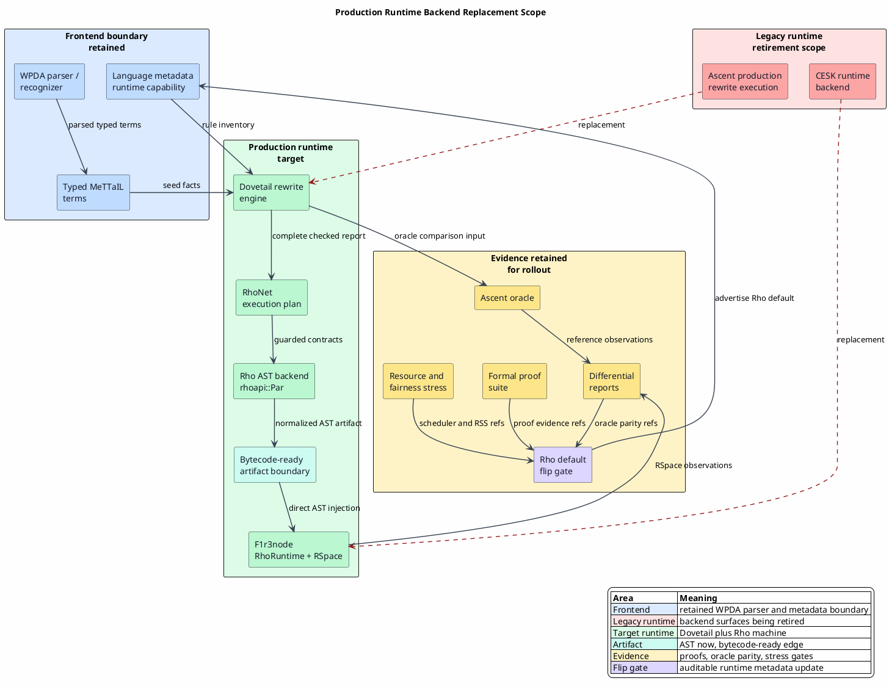

# Production Runtime Backend Completion Guide

Last updated: 2026-06-13

This guide turns the architecture suite into an executable handoff for an
agent completing the runtime backend replacement. Here, **backend** means
**runtime backend**: the parser/recognizer boundary remains the WPDA path.

The target state is:

| Current role | Production role |
|---|---|
| Ascent production rewrite execution | Dovetail production rewrite execution |
| Ascent differential evidence | retained oracle evidence during rollout |
| CESK runtime backend execution | Rho machine execution on F1r3node |
| WPDA parser/recognizer | retained source-to-typed-term frontend |
| Rholang source strings as executable artifacts | direct `rhoapi::Par` AST artifacts |

The runtime path is therefore:

`typed MeTTaIL term -> Dovetail report -> RhoNet plan -> rhoapi::Par -> RhoRuntime -> RSpace observations -> RuntimeBackendReport`

## Runtime Scope Diagram


PlantUML source:
[figures/08-production-runtime-backend-completion.puml](figures/08-production-runtime-backend-completion.puml).



## Completion Evidence DAG


Graphviz source: [figures/08-production-readiness-dag.dot](figures/08-production-readiness-dag.dot).

The DAG is intentionally sparse. It names the evidence nodes that must all be
true before a language can select Dovetail/Rho as its production runtime path.

## Backend Inventory

| Surface | Current evidence | Production completion condition |
|---|---|---|
| `dovetail` core | exact keys, checked extraction reports, bounded-cycle completeness, saturation outcomes, Rocq/Why3/Creusot gates | every MeTTaIL runtime rewrite requirement has a Dovetail-core proof or an explicit external contract |
| `mettail-rho-codegen` | flip-gated `PlannedRhoBackend`, artifact validation, no source-text generated-backend artifacts | every supported RhoNet rule emits validated `rhoapi::Par` and every rejected rule is exactly listed |
| `mettail-rho-runtime` | host RhoRuntime injection, observation reports, COMM oracle, direct rhocalc AST lowering, `RhoRuntimeBackedLanguage` wrapper | every runtime execution surface consumes validated `Par` plans and reports typed observations through `RuntimeBackendReport` without requiring generated language crates to depend on the Rho runtime |
| `mettail-rho-adapter` | report handoff proofs and adapter smoke coverage | complete Dovetail reports enter the Rho backend without Ascent-shaped success values |
| Ascent path | oracle and regression baseline | available only as a differential reference for languages whose Dovetail/Rho gate is still under evaluation |
| CESK runtime path | legacy runtime backend | unavailable as the selected production backend once the Rho gate is satisfied for a language |
| WPDA parser | active parser/recognizer | retained; runtime-backend work must not weaken parser guarantees |

## AST Artifact Contract

Generated runtime artifacts are `models::rhoapi::Par` values from the
F1r3node `models` crate. Rholang-looking text in documents and tests is a
reader annotation unless the test explicitly names a hand-authored source
oracle.

| MeTTaIL/rhocalc construct | Rho artifact |
|---|---|
| `PZero` | empty `Par` |
| parallel process bag `PPar` | `Par::append` over members |
| output `n!(p)` | `Send` with lowered channel and payload |
| input join `(n₁?x₁,...,nₖ?xₖ).{p}` | one `Receive` with `k` `ReceiveBind` values |
| new scope `new(x₁,...,xₖ)in{p}` | `New` with adjusted local-free metadata |
| quote/drop `@(...)` and `*(...)` | direct `Par` embedding of the quoted process |
| ground scalar literals | corresponding `ExprInstance` ground node |
| `List::ListLit` | `ExprInstance::EListBody` |
| `Map::MapLit` | `ExprInstance::EMapBody` |
| `Bag::BagLit` | tagged `EList` ABI: private tag plus ordered `[element, count]` entries |

Mapping a MeTTaIL bag to a Rholang set is incorrect because set lowering
discards multiplicity. The tagged list ABI preserves multiplicity and keeps the
representation nominal by using a private unforgeable tag rather than a user
string.

## Production Gates

| Gate | Required evidence |
|---|---|
| semantic coverage | coverage matrix maps each language rewrite requirement to Dovetail, RhoNet, native handler, or exact rejection |
| AST artifact purity | generated backend accepts `rhoapi::Par` artifacts and rejects source-text artifacts |
| RSpace schedule correctness | independent-redex schedules erase to the same visible Dovetail observations |
| guarded join correctness | failed guards release data and valid joins can commit afterward |
| extraction completeness honesty | complete reports and cycle-bounded reports are distinguishable at the API and proof boundary |
| oracle agreement | Rho observations match Ascent oracle observations for the language corpus selected for rollout |
| memory bound | capped tests and stress workloads stay within the agreed RSS envelope |
| backend selection | default runtime backend fails closed unless proof, oracle, coverage, artifact, scheduler, and deadlock gates all pass, and every positive external gate carries nonblank stable evidence references for generated metadata |

## Generated-Language Runtime Wrapper

Generated language crates remain substrate-neutral. They expose `Language`,
metadata, parsing, environments, type inference, direct evaluation helpers, and
the explicit Ascent oracle. The Rho runtime crate supplies
`RhoRuntimeBackedLanguage<L, F>` when a language has passed the Rho flip gate:

```text
Given a generated language L, a planned Rho backend B, and an invocation mapper F:
  keep L as the owner of parsing, environments, type inference, and Ascent oracle execution
  expose RhoMachine as the default runtime backend through Language methods
  delegate explicit non-Rho backend requests back to L
  map each typed term to a RhoBackendInvocation through F
  execute B with the invocation as normalized rhoapi::Par
  return RuntimeBackendReport with RhoMachine, RhoNormalizedAst, observations, and evidence refs
  reject Ascent-shaped seeded facts on the Rho path unless the fact set is empty
```

The wrapper is intentionally outside the generated language crate. This avoids
a Cargo cycle with `mettail-rho-runtime` while still allowing a verified
language instance to become Rho-default. The wrapper does not parse generated
Rholang text; invocation mappers construct `rhoapi::Par` values directly, and
future bytecode variants can use the same report boundary.

## User-Facing REPL Boundary

The REPL is part of the runtime-backend replacement surface because `exec`
selects the language's default runtime backend. Its production-facing execution
path must therefore consume `RuntimeBackendReport`, not only `AscentResults`.

The intended REPL behavior is:

```text
When a user runs exec:
  parse the source with the retained WPDA language frontend
  ask the selected default backend for a RuntimeBackendReport
  if the report is Ascent-shaped:
    keep the historical rewrite-graph display and navigation behavior
  if the report is observation-shaped:
    display backend, artifact, channel, and observed values
    store the report as the current runtime result
    do not fabricate Ascent rewrite facts

When a user runs step, apply, equations, rewrites, normal-forms, or queries:
  require an Ascent-shaped rewrite graph
  reject non-Ascent selected backends before executing step
  reject observation-shaped reports with an explicit message
```

This preserves old graph-navigation ergonomics while allowing Rho-default
languages to return typed RSpace observations. The REPL crate also exposes the
bundled generated language registry behind its default `bundled-languages`
feature. Normal CLI builds keep that feature enabled. Focused state tests may
disable default features so report-state behavior can be checked without
compiling every generated language.

## Diagram Tooling Policy

pgmcp's local diagramming toolbox includes PlantUML, Structurizr CLI, D2,
Graphviz, Mermaid CLI, Pikchr, TikZ/PGF, Asymptote, WaveDrom, bytefield-svg,
and SVG conversion tools such as Inkscape and `rsvg-convert`.

Use the smallest clear diagram set for each document:

| Concept | Preferred tool | Reason |
|---|---|---|
| component, sequence, state, deployment, C4 views | PlantUML or Structurizr | stable architecture notation and reviewable text source |
| dependency graphs and readiness DAGs | Graphviz DOT | deterministic graph layout and strong DAG rendering |
| polished conceptual architecture | D2 | concise source with good visual defaults |
| GitHub-native quick sketches | Mermaid | readable inline Markdown preview |
| protocol fields, byte layouts, timing | bytefield-svg or WaveDrom | domain-specific visual grammar |
| publication-grade mathematical figures | TikZ/PGF or Asymptote | native mathematical typography |

Prefer committed SVG outputs beside their source files. A source-only diagram is
acceptable only in prose drafts outside this validated suite.

## Agent Completion Checklist

An agent can complete a language runtime backend migration by following this
order:

1. Classify every language rule as Dovetail-core, RhoNet-lowerable,
   native-handler, covered by a typed disposition, or rejected.
2. Add Dovetail proofs for Dovetail-core rules and external contracts for
   native-handler rules.
3. Implement RhoNet lowering to `rhoapi::Par` for each lowerable rule.
4. Add RhoRuntime observation tests that execute the validated `Par` artifact.
5. Add differential oracle tests against the Ascent reference path.
6. Add process-calculus and schedule-family checks for the rule's concurrency
   shape when the rule has multiple independent redexes or guarded joins.
7. Run the language's capped Dovetail/Rho proof and runtime gate suite.
8. Enable the language's Dovetail/Rho backend selection only through the
   flip-gated planner.

Completion means the backend selection gate succeeds from current evidence,
not merely that a lowered artifact exists.
