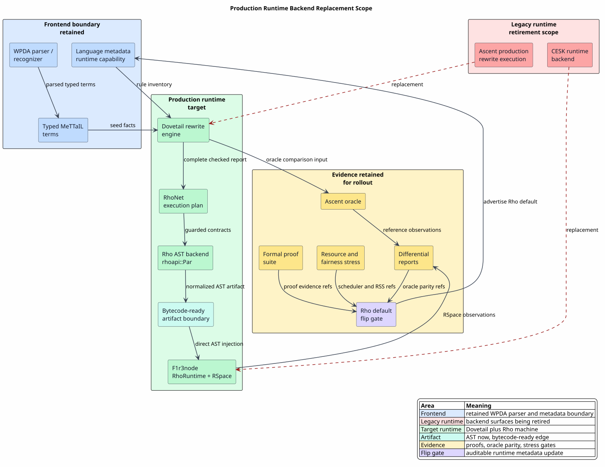
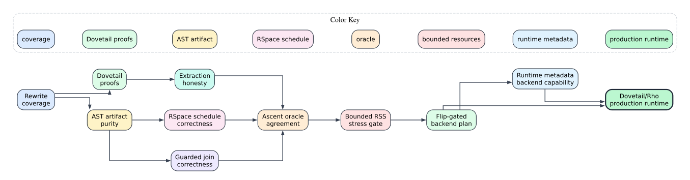

# Production Runtime Backend Completion Guide

Last updated: 2026-06-15

This guide turns the architecture suite into an executable handoff for an
agent completing the runtime backend replacement. Here, **backend** means
**runtime backend**: the parser/recognizer boundary remains the WPDA path.

The target state is:

| Current role | Production role |
|---|---|
| Ascent production rewrite execution | Dovetail production rewrite execution |
| Ascent differential evidence | retained oracle evidence during rollout |
| CESK runtime backend execution | Rho machine execution on F1r3node |
| WPDA parser/recognizer | retained source-to-typed-term frontend |
| Rholang source strings as executable artifacts | direct `rhoapi::Par` AST artifacts |

The full Rho-native runtime path is therefore:

`typed MeTTaIL term -> RuntimeDovetailRunReport(Complete, well-formed) -> RhoBackendInvocation(rhoapi::Par) -> PlannedRhoBackend -> RhoRuntime -> RSpace observations -> RuntimeBackendReport`

The direct Dovetail runtime-backend path stops at the checked report:

`typed MeTTaIL term -> Dovetail report -> RuntimeDovetailRunReport -> RuntimeBackendOutput::Dovetail`

Both paths are production-relevant. Dovetail replaces the production rewrite
engine; Rho replaces the CESK runtime backend when a language has enough RhoNet
coverage to execute the checked rewrite semantics natively on F1r3node.

## Runtime Scope Diagram



PlantUML source:
[figures/08-production-runtime-backend-completion.puml](figures/08-production-runtime-backend-completion.puml).

## Completion Evidence DAG



Graphviz source: [figures/08-production-readiness-dag.dot](figures/08-production-readiness-dag.dot).

The DAG is intentionally sparse. It names the evidence nodes that must all be
true before a language can select Dovetail/Rho as its production runtime path.

## Backend Inventory

| Surface | Current evidence | Production completion condition |
|---|---|---|
| `dovetail` core | exact keys, checked extraction reports, bounded-cycle completeness, saturation outcomes, Rocq/Why3/Creusot gates | every MeTTaIL runtime rewrite requirement has a Dovetail-core proof or an explicit external contract |
| `mettail-dovetail-runtime` | one-way projection from checked Dovetail reports into `RuntimeDovetailRunReport`, structural report validation, `RuntimeBackendOutput::Dovetail`, direct Dovetail default wrapper, fingerprint-checked `DovetailCompilerStage`, REPL/simulation/testkit report handling, Rocq wrapper model | generated languages can select Dovetail as the production rewrite backend only when the report producer was derived from the same macro-expanded `LanguageDef`, and without fabricating Ascent-shaped graphs, accepting malformed report tables, or accepting incomplete cycle-bounded reports as exhaustive |
| `mettail-rho-codegen` | flip-gated `PlannedRhoBackend`, artifact validation, no source-text generated-backend artifacts | every supported RhoNet rule emits validated `rhoapi::Par` and every rejected rule is exactly listed |
| `mettail-rho-runtime` | host RhoRuntime injection, observation reports, COMM oracle, direct rhocalc AST lowering, checked observation-shaped `RuntimeBackendReport` conversion, fingerprint-checked `RhoInvocationCompilerStage`, `RhoRuntimeBackedLanguage` wrapper, composed `DovetailRhoRuntimeBackedLanguage` wrapper | every runtime execution surface consumes validated `Par` plans and reports typed observations through `RuntimeBackendReport` without requiring generated language crates to depend on the Rho runtime, allowing observation-shaped output under non-Rho backend/artifact identities, installing a direct Rho invocation compiler derived from a different macro-expanded `LanguageDef`, or constructing a Rho invocation before the Dovetail report is complete and structurally valid |
| `mettail-rho-adapter` | report handoff proofs and adapter smoke coverage | complete Dovetail reports enter the Rho backend without Ascent-shaped success values |
| Ascent/CESK path | oracle and regression baseline during transition | removed from the live production runtime path once the Dovetail/Rho gates and replacement tests are complete; git history remains the archive |
| CESK runtime path | legacy runtime backend; the public `Language::decompose_into_cek` bridge and `mettail-runtime` CEK/CESK re-exports have been removed from the production runtime API | unavailable as the selected production backend once the Rho gate is satisfied for a language; no generated `Language` implementation emits a CEK decomposition hook |
| WPDA parser | active parser/recognizer | retained; runtime-backend work must not weaken parser guarantees |

## AST Artifact Contract

Generated runtime artifacts are `models::rhoapi::Par` values from the
F1r3node `models` crate. Rholang-looking text in documents and tests is a
reader annotation unless the test explicitly names a hand-authored source
oracle. Those source-oracle helpers are isolated behind the
`mettail-rho-runtime/source-oracle` feature; generated runtime paths compile
and execute validated AST artifacts without exposing source-text execution as
the default crate surface.

| MeTTaIL/rhocalc construct | Rho artifact |
|---|---|
| `PZero` | empty `Par` |
| parallel process bag `PPar` | `Par::append` over members |
| output `n!(p)` | `Send` with lowered channel and payload |
| input join `(n₁?x₁,...,nₖ?xₖ).{p}` | one `Receive` with `k` `ReceiveBind` values |
| new scope `new(x₁,...,xₖ)in{p}` | `New` with adjusted local-free metadata |
| quote/drop `@(...)` and `*(...)` | direct `Par` embedding of the quoted process |
| ground scalar literals: `Int`, `Bool`, `Str` | corresponding `ExprInstance::GInt`, `ExprInstance::GBool`, or `ExprInstance::GString` ground node |
| `List::ListLit` | `ExprInstance::EListBody` |
| `Map::MapLit` | `ExprInstance::EMapBody` |
| `Bag::BagLit` | tagged `EList` ABI: private tag plus ordered `[element, count]` entries |
| generic call-by-need computation | private thunk/state/memo `Par` topology from `CallByNeedThunkSpec` |

Mapping a MeTTaIL bag to a Rholang set is incorrect because set lowering
discards multiplicity. The tagged list ABI preserves multiplicity and keeps the
representation nominal by using a private unforgeable tag rather than a user
string.

Dynamic calls and witness facts use the same AST discipline. The generated
builder `mettail_rho_codegen::RhoAstSend` takes `RhoAstLiteral` payloads and
constructs `Par` directly; it does not emit text for the Rholang parser to
recover. `RhoAstLiteral` covers scalar payloads, byte/URI/numeric payloads,
unforgeable names, closed list/tuple/set/map payloads, and rhocalc bags. The
bag tag constant `RHOCALC_BAG_ABI_TAG` is defined in `mettail-rho-codegen` and
re-exported by `mettail-rho-runtime`, so the producer and observer share one
nominal ABI.

Generic call-by-need artifacts use the same AST discipline. The generated
language supplies a `CallByNeedThunkSpec` containing initial cold/hot state,
result payload as a closed `RhoAstLiteral`, evaluation marker, output channel,
and evaluation-trace channel.
`plan_call_by_need_thunk_with_spec` then admits the two-force sequence under
lookahead/heap budgets, validates the normalized `rhoapi::Par` artifact with
the call-by-need profile, and returns a `CallByNeedThunkPlan`. Runtime
execution uses `PlannedCallByNeedThunk`, which
rejects non-audited need plans and reads the spec-named channels rather than the
sample fixture channel names.
Generated-language wrappers can return that plan through
`RhoBackendInvocation::RunCallByNeedThunk`; the Rho runtime adapter then
produces an observation-shaped `RuntimeBackendReport` containing the spec-named
value and evaluation-trace channels. The value channel is decoded as typed
`RuntimeObservationValue`s; the evaluation-trace channel remains textual, so a
reported `RuntimeObservationValue::Int(5)` is not confused with a trace marker
such as `RuntimeObservationValue::Text("AddInt")`.

The REPL uses the same concrete runtime-capability view. Its `languages` and
`info` commands show whether a registered language value has no installed
runtime, a non-default backend set, or a selected default. Raw generated
language entries therefore remain useful for parsing and introspection, but
`exec` fails with explicit Dovetail/Rho wrapper guidance until a checked
runtime wrapper is registered.

## Runtime Observation Payloads

`RuntimeBackendReport` is the common user-facing envelope for Ascent,
Dovetail, and Rho-backed execution. Its output is intentionally variant-shaped:
Ascent returns a legacy rewrite graph, Dovetail returns a checked report
projection, and Rho returns runtime observations. For Rho-backed execution the
report is observation-shaped: it names a quoted RSpace channel and the ground
values left resting there. The planned Rho backend reads closed Rho ground data
into `RuntimeObservationValue`; it rejects arbitrary processes, open collection
remainders, connective bodies, sends, receives, bundles, and operator
expression bodies as non-ground observations.

| Rho ground payload | Generic runtime payload | Example lowerable rules |
|---|---|---|
| `GInt(n)` | `RuntimeObservationValue::Int(n)` | `AddInt`, `SubInt`, `MulInt`, `DivInt`, `ModInt`, unary `Neg` |
| `GBool(b)` | `RuntimeObservationValue::Bool(b)` | `EqInt`, `NeInt`, `LtInt`, `GtInt`, `LtEqInt`, `GtEqInt`, the same six comparisons for `Bool` and `Str`, plus `And`, `Or`, `Not` |
| `GString(s)` | `RuntimeObservationValue::Text(s)` | `Concat`, `AddStr`, ambiguity-witness key/payload facts |
| `GUri(u)` | `RuntimeObservationValue::Uri(u)` | URI-valued native handlers |
| `GByteArray(bytes)` | `RuntimeObservationValue::Bytes(bytes)` | byte-array native handlers and future bytecode-facing data |
| `GDouble(bits)` | `RuntimeObservationValue::DoubleBits(bits)` | bit-exact `Float` payloads |
| `GBigInt(bytes)` | `RuntimeObservationValue::BigIntBytes(bytes)` | arbitrary-precision integer payloads |
| `GBigRat(n,d)` | `RuntimeObservationValue::BigRationalBytes { numerator: n, denominator: d }` | exact rational payloads |
| `GFixedPoint(unscaled, scale)` | `RuntimeObservationValue::FixedPointBytes { unscaled, scale }` | fixed-point decimal payloads |
| unforgeable private/deploy/deployer/sysauth names | `PrivateName`, `DeployId`, `DeployerId`, or `SysAuthToken` | private channels, ABI tags, and host authority names |
| closed `EList`, `ETuple`, `ESet`, `EMap` | recursive `List`, `Tuple`, `Set`, or `Map` values | rhocalc and future language collection payloads |
| rhocalc tagged bag ABI | `RuntimeObservationValue::Bag([(value,count),...])` | `Bag::BagLit` without losing multiplicity |

A production flip must still prove coverage for the actual observed payload
domain of the language being flipped. The envelope being wider than one
language's current needs is not, by itself, a coverage proof. The current
rhocalc gate exercises the structured path in two directions: direct rhocalc
process lowering emits list, map, and bag typed AST payloads to `rhoapi::Par`,
and `RhoAstSend` emits structured dynamic send payloads for list, map, bag,
URI, byte, and private-name values. Both paths execute on the host RhoRuntime
and observe the corresponding recursive runtime values.

Scalar operation coverage is type-sensitive and inventory-derived. The generated
Rho backend must not select Rholang operators from terminals alone or from
category names because the same source token can have different meanings after
MeTTaIL type checking, and a category may be renamed without changing its native
payload. The classifier first maps each rule category through the
macro-expanded `LanguageDef` native type inventory. For the current Rho-native
scalar families:

| Typed rule | Reader-facing source shape | Required Rho AST operator |
|---|---|---|
| `Int × Int → Int` addition | `a + b` | `EPlus` |
| `Str × Str → Str` concatenation via `+` | `a + b` | `EPlusPlus` |
| `Str × Str → Str` concatenation via `++` | `a ++ b` | `EPlusPlus` |
| `τ × τ → Bool` comparisons for `τ ∈ {Int, Bool, Str}` | `==`, `!=`, `<`, `>`, `<=`, `>=` | matching comparison body |
| `Bool × Bool → Bool` logic | `and`, `or` | matching boolean body |
| `Bool → Bool` negation | `not a` | `ENot` |
| `Int → Int` negation | `-a` | `ENeg` |

The proof `formal/rocq/rho_bridge/theories/RhoScalarOperatorTyping.v` captures
this contract, including the fact that renamed native categories lower
identically while scalar-looking structural categories reject. It also models
the generated scalar contract ABI: binary contracts receive two operands plus a
return channel at position `2`, unary contracts receive one operand plus a
return channel at position `1`, and no ABI entry exists for rejected rules. The
Rust lowering exposes that data as `RhoLowering::scalar_contract_abi` in exact
`RhoLowering::lowered` order, making it the source of truth for generated
invocation dispatch. `mettail_rho_codegen::plan_scalar_invocations` consumes
that inventory with the same `LanguageDef` and derives the constructor-level
dispatch plan used by generated extractor code: every plan entry preserves the
rule label, operand field order, parameter names, source categories, native
scalar families, result category, and ABI result family. It fails closed if a
stale or mismatched ABI is paired with the wrong generated definition. The
macro-generated `rho-codegen` helper turns a typed generated AST constructor
into `mettail_rho_codegen::RhoScalarContractInvocation`, a runtime-independent
payload containing the ABI, constructor-field-order scalar literals, and output
channel. This keeps generated language crates independent from
`mettail-rho-runtime`; only runtime-facing adapters call
`mettail_rho_runtime::build_scalar_contract_invocation_from_contract`. That
adapter is the checked dynamic call boundary for this inventory: it validates
operand arity and scalar payload families against `RhoScalarContractAbi`, emits
a normalized `rhoapi::Par` contract call, and selects integer, boolean, or
string observation reports from the ABI result family. The proof
`formal/rocq/rho_bridge/theories/RhoAstSendBoundary.v` models the same checked
invocation boundary: accepted calls preserve `arguments ++ [return]`, arity
mismatches reject, result observations follow the ABI result type, and
normalizing a codegen-owned invocation payload produces an AST artifact rather
than source text. The proof
`formal/rocq/rho_bridge/theories/RhoScalarOperatorTyping.v` also proves that an
invocation plan derived from a successful scalar ABI preserves the typed operand
order and result family. The
executable regressions
`mettail-rho-codegen::scalar_lowering_uses_native_type_inventory_not_category_names`,
`mettail-rho-codegen::scalar_named_structural_categories_do_not_lower_as_native_scalars`, and
`mettail-rho-codegen::string_plus_lowers_to_rholang_concat_not_integer_plus`
then inspect the generated AST and ABI inventory, require Calculator `AddStr`
to use `ExprInstance::EPlusPlusBody` with `Str × Str → Str` ABI, and require
renamed native categories to keep the same native scalar ABI. Runtime wrapper
tests route the parsed term through
`CalculatorLanguage::rho_scalar_contract_invocation_to`, normalize the returned
`RhoScalarContractInvocation`, execute `"rho" + "net"`, and observe
`RuntimeObservationValue::Text("rhonet")`, completing the end-to-end chain from
source snippet through WPDA parsing, typed invocation mapping, validated
`rhoapi::Par`, RhoRuntime execution, and generic runtime report.
The call-by-need wrapper test covers the same value domain in two layers:
cheap planning assertions generate a scalar case matrix for every currently
supported `Int`, `Bool`, and `Str` arithmetic, predicate, logical, and string
operation, compare each planned typed `RhoAstLiteral` payload with
`CalculatorLanguage::run_ascent` normal forms, and then full RhoRuntime
executions sample representative `Int`, `Bool`, and `Str` payloads to ensure
the thunked path reports typed values rather than stringifying all computed
results.

Rejected-rule coverage should start from generated inventory, not hand-written
category lists. The build-time installer should first call
`mettail_rho_codegen::audit_rho_default_backend(def)`. The audit lowers the
structured `LanguageDef`, returns the exact `RhoLowering::lowered` and
`RhoLowering::rejected` sets, derives advisory rejected-rule classifications,
collects guard obligations, records artifact-validation errors, and runs the
normal flip decision under the deliberately strict assumption that no external
coverage has been supplied yet. This answers “what is missing?” without
answering “is it accepted?”.

`mettail_rho_codegen::classify_rejected_rules(def, lowering)` remains the
lower-level advisory classifier used by the audit. It derives a classification
for every label in `RhoLowering::rejected` from the parsed `LanguageDef`:
native evaluation metadata suggests a native handler, equation/rewrite
references and structured syntax suggest a Rho AST contract, and unsupported
scalar-operator shapes suggest an external contract. These helpers are for
planning and review. They do not satisfy the production coverage gate until
each suggestion is supplied as exact `RhoCoverageEvidence::CoveredRejectedRules`
coverage and every guard obligation is supplied as exact
`RhoGuardCoverageEvidence::CoveredGuardObligations` coverage.

## Predicated-Type And Guard Coverage

Predicated types have the same fail-closed shape as rejected-rule coverage, but
their unit of evidence is a guard obligation rather than a lowered rewrite
rule. The planner derives the obligation set directly from `LanguageDef`:

`language! spec → LanguageDef.guards + guarded terms + guarded rules → RhoGuardObligation[]`

No backend-local function should ask whether a constructor is in a known
category list. The generated inventory already contains the relevant facts:
typed predicate declarations, theory registrations, channel declarations,
join declarations, term parameters such as `?guard:Guard`, and rewrite
premises such as `BehavioralGuard`.

The current Rust API is:

| API | Role |
|---|---|
| `collect_guard_obligations(def)` | derives the exact obligation set from a parsed language definition |
| `RhoGuardObligationKind` | classifies each obligation as behavioral predicate, structural pattern, theory registration, or Rho-native join |
| `RhoGuardDispositionKind` | records how the obligation is covered: Dovetail structural matching, EBA, SFT, Rho-native join, native handler, or external contract |
| `RhoGuardCoverageEvidence` | supplies either `NoGuardObligations` or an exact `CoveredGuardObligations` list |
| `RhoDefaultBackendPlanError` | reports uncovered obligations, extraneous dispositions, and invalid dispositions as blockers |

The generalized predicate classifier may produce a wider disposition vocabulary
than the current Rho flip gate admits directly:

| Classifier disposition | Rho production meaning |
|---|---|
| `ExactDecidable` | may map to an accepted Dovetail-core, EBA, SFT, Rho-native join, native-handler, or external-contract disposition when the disposition names the exact mechanism |
| `BoundedDecidable` | may support bounded reports or diagnostics, but is not enough for an unqualified Rho production default unless the bound is part of the selected runtime contract |
| `RejectSafeApprox` | may reject enabled behavior conservatively; it is usable only where false negatives are an accepted approximation and must not be presented as complete Rho coverage |
| `TrustedNativeGuard` | maps to native-handler coverage only when the assertion site and implementation contract are stable |
| `MachineCheckedModel` | maps to the mechanism justified by a named checked theorem or model; the model itself is not a rewrite rule |
| `RuntimeObservation` | maps to Rho-native join or observation coverage when the named channel/join contract is the evidence |
| `Unknown` | production-default Rho lowering is refused |

This keeps a separate symbolic-transducer/EBA/tree/behavioral-predicate
implementation complementary to the runtime backend. That implementation emits
evidence; the Rho backend consumes only the dispositions that are compatible
with the selected production contract.

The admission equation is:

`RhoDefault(L) ⇒ ∀o ∈ O(L). ∃!d. covers(d, o) ∧ evidence_ref(d) ≠ ""`

where `O(L)` is `collect_guard_obligations(LanguageDef(L))`. The existential
is unique: a duplicated disposition is invalid because duplicated evidence can
hide disagreement about which mechanism owns a guard.

The disposition compatibility table is:

| Obligation | Why it exists | Compatible dispositions |
|---|---|---|
| behavioral predicate | runtime predicate over already matched values or derived relations | effective Boolean algebra, symbolic finite-state transducer, Rho-native join, native handler, external contract |
| structural pattern | value-shape, binding-shape, AC, or exact-key decomposition | Dovetail-core structural matching, symbolic finite-state transducer, Rho-native join, native handler, external contract |
| theory registration | typed predicate domain needs a decision procedure | effective Boolean algebra, symbolic finite-state transducer, native handler, external contract |
| Rho-native join | channel/join declaration needs atomic RSpace scheduling | Rho-native join, native handler, external contract |

Effective Boolean algebras and symbolic finite-state transducers are not
side-channel documentation terms; they are production admission choices.
Use an EBA disposition when the guard reduces to decidable predicate algebra
over a domain, such as interval arithmetic, finite enumerations, lattice
membership, byte ranges, URI classes, or a verified theory adapter. Use an SFT
disposition when the guard performs or requires a value transformation while
preserving symbolic reasoning, such as normalization before comparison,
sequence transduction, pre-image pruning for multi-channel joins, or
guard-directed structural rewriting. Use a Rho-native join disposition only
when the host RSpace receive/guard mechanism itself is the evidence for
atomicity and no-consumption behavior.

This scheme is fully generalized over MeTTaIL data domains. A predicate may be
over `Int`, `Bool`, `Str`, bytes, URIs, exact numerics, lists, maps, bags,
algebraic syntax trees, Rho processes, Rho names, or host-backed values. The
planner does not need a case for every data type; it needs the generated
language inventory to induce the obligation and an evidence-backed disposition
whose theory or handler is valid for that domain. A new data type therefore
extends the system by adding generated metadata and a disposition/evidence
artifact, not by patching a backend-local category table.

Literate implementation checklist:

```pseudocode
Algorithm: Add a new predicated type to a Rho-default language

Given:
  a language edit that introduces a new guard predicate or guarded pattern

Produce:
  a flip-gated Rho default plan or a precise blocker

Steps:
  1. Declare the predicate, theory, channel, join, or guarded term slot in the
     language specification so the generated LanguageDef records it.

  2. Run the guard-obligation collector and inspect the new obligation id.

  3. Choose the narrowest compatible disposition:
       - DovetailCoreStructural for pure exact-key structural matching;
       - EffectiveBooleanAlgebra for decidable predicate domains;
       - SymbolicFiniteTransducer for symbolic transformations and pre-images;
       - RhoNativeJoin for host RSpace atomic guarded joins;
       - NativeHandler or ExternalContract only when the evidence is outside
         the generated RhoNet contract.

  4. Rebuild the Rho default backend plan. Treat any uncovered, extraneous, or
     invalid guard disposition as a production blocker.
```

## Production Gates

| Gate | Required evidence |
|---|---|
| semantic coverage | coverage matrix maps each language rewrite requirement to Dovetail, RhoNet, native handler, or exact rejection |
| predicated-type coverage | every `guards {}` predicate, typed predicate overload, theory registration, channel/join declaration, and guarded rule is derived from generated inventory and exactly covered by a compatible Dovetail-core, EBA, SFT, Rho-native join, native-handler, or external-contract disposition |
| AST artifact purity | generated backend accepts `rhoapi::Par` artifacts and rejects source-text artifacts |
| RSpace schedule correctness | independent-redex schedules erase to the same visible Dovetail observations |
| guarded join correctness | failed guards release data and valid joins can commit afterward |
| extraction completeness honesty | complete reports and cycle-bounded reports are distinguishable at the API and proof boundary |
| runtime report shape honesty | Dovetail outputs are Dovetail-report-shaped, Rho outputs are observation-shaped and backed by Rho runtime artifacts, Ascent outputs remain Ascent-shaped, and public non-Ascent runtime reports enter only through checked constructors |
| oracle agreement | during transition, Rho observations match reference/oracle observations for the language corpus selected for rollout; completion removes the old runtime backend from the live production path |
| memory bound | capped tests and stress workloads stay within the agreed RSS envelope |
| backend selection | default runtime backend fails closed unless checkable coverage, artifact-validation, and deadlock gates pass; formal proof/oracle results are tracked as verification evidence and documentation, not runtime gate fields |

## Generated-Language Runtime Wrapper

Generated language crates remain substrate-neutral. They expose `Language`,
metadata, parsing, environments, type inference, direct evaluation helpers, and
the explicit transition oracle. The Rho runtime crate supplies a direct
`RhoRuntimeBackedLanguage<L, F>` wrapper for Rho-only plans and the composed
production wrapper `DovetailRhoRuntimeBackedLanguage<L, D, F>` when a language
has passed both the Dovetail rewrite-coverage gate and the Rho flip gate. The
direct wrapper is useful for Rho-native fragments and transition tests, but it
is not a shortcut around identity: `F` is installed as a
`RhoInvocationCompilerStage` and must carry the same macro-expanded
`LanguageDef` fingerprint as `L` and the planned backend.

The composed production wrapper follows this flow:

```text
Given a generated language L, a planned Rho backend B, a Dovetail compiler D,
and an invocation mapper F:
  build a RhoDefaultBackendPlan with plan_rho_default_backend
  require exact rejected-rule and guard coverage
  require normalized rhoapi::Par artifact validation
  require no generated channel-deadlock diagnostics
  compute L.definition_fingerprint directly from the macro-expanded LanguageDef
  require B.plan.definition_fingerprint = L.definition_fingerprint
  wrap D as DovetailCompilerStage(L.definition_fingerprint, D)
  wrap F as RhoInvocationCompilerStage(L.definition_fingerprint, F)
  require D and F stage fingerprints to match L.definition_fingerprint
  keep L as the owner of parsing, environments, and type inference
  expose RhoMachine as the default runtime backend through Language methods
  expose Dovetail as a non-default checked intermediate report
  reject Ascent as a supported production runtime backend
  build RuntimeDovetailRunReport through D
  require the Dovetail report to validate shape
  require the Dovetail report to be Complete, not BoundedByCycleCut
  pass the checked Dovetail report to F
  map the typed term plus checked report to a RhoBackendInvocation through F
  execute B with the invocation as normalized rhoapi::Par
  if F returns a planned call-by-need thunk, execute that thunk plan through the same report boundary
  return RuntimeBackendReport with RhoMachine, RhoNormalizedAst, and observations
  reject Ascent-shaped seeded facts on the Dovetail and Rho paths unless the fact set is empty
```

The wrapper is intentionally outside the generated language crate. This avoids
a Cargo cycle with `mettail-rho-runtime` while still allowing a verified
language instance to become Dovetail-checked and Rho-executed by construction.
The wrapper does not parse generated Rholang text; invocation mappers construct
`rhoapi::Par` values directly from the typed term and checked Dovetail report,
and future bytecode variants can use the same report boundary.
The identity check is definition-derived, not name-derived: the macro emits a
stable compiler-facing fingerprint from the expanded `LanguageDef`, and Rho
plans carry the fingerprint of the `LanguageDef` they lowered. This prevents a
partial scalar fragment from being installed as the production runtime for a
larger generated language merely because the names match. Such fragments remain
useful as oracle tests, but production installation requires full-definition
identity across generated metadata, Dovetail compilation, and Rho invocation
compilation.
Default execution is selected from the concrete runtime-capability view, not
from a display/default metadata fallback. Production callers must ask
`selected_default_runtime_backend()` or `default_runtime_backend()` and fail
closed when they return `None`.
This is the rule implemented by `run_default_*`, the REPL, the simulation
runner, and production testkit helpers. No default-backend query is allowed to
report `Ascent`; an advertised Ascent capability is treated as reference/oracle
metadata and is filtered out of production default selection. The separate
`run_ascent_oracle_report` test helper is intentionally named as a reference
oracle and does not participate in production default dispatch.
Macro-generated language crates now mirror that rule at compile time. Generated
Ascent structs, `ascent_source!` source-inspection exports, the crate-root
`eqrel` re-export, and the dual-indexed Ascent relation provider are behind
`mettail-languages/oracle-ascent`. Without that feature, generated
`Language::run_ascent*` methods return an oracle-disabled error and the
parser/AST/Rho-codegen crate surface has no normal dependency on `ascent` or
`ascent-byods-rels`.
Graph-shaped test utilities follow the same runtime-view rule. When a property
such as an LTL execution-model check needs rewrite-graph evidence, it prefers
an installed `Dovetail` report over the selected default report: a selected
`RhoMachine` default returns observations, while the companion `Dovetail`
capability carries the complete checked rewrite graph. A complete Dovetail
report is graph evidence; a `BoundedByCycleCut` report is not proof of
termination or temporal-property satisfaction.
Test utilities that only need output membership, such as equation-symmetry
smoke checks, consume the generic `RuntimeBackendReport` output projection and
therefore accept Ascent graphs, Dovetail report summaries, or Rho observations
without forcing an Ascent-shaped graph.
The runtime integration tests construct `RhoDefaultBackendPlan` values through
the same checkable gates as production: exact coverage, artifact validation, and
deadlock diagnostics. `PlannedRhoBackend::from_plan` consumes that plan directly
and does not accept raw source text as the generated-backend boundary.
Generated installers should then call
`mettail_rho_runtime::install_dovetail_rho_runtime_backend` for the production
replacement path, or `mettail_rho_runtime::install_rho_runtime_backend` for
Rho-only integration tests and dynamic-call fixtures. Those helpers derive the
Dovetail and Rho invocation compiler-stage identities from the accepted
`RhoDefaultBackendPlan`, so the wrapped generated language is checked against
one plan-derived definition identity instead of hand-wired fingerprint strings.
The actual language-specific inputs remain the Dovetail report compiler and the
AST-first Rho invocation compiler; neither helper accepts Rholang source text as
an executable artifact.

The wrapper has two capability surfaces, and the distinction is operationally
important:

| Surface | Owner | Mutability | Meaning |
|---|---|---|---|
| static metadata, `LanguageMetadata::runtime_backends()` | generated language crate | compile-time constant | backends that the generated crate can execute without an external runtime wrapper |
| runtime view, `Language::runtime_backend_capabilities()` | concrete `Language` value | value-level overlay | backends executable by this particular value, including wrapper-installed defaults |

For a generated language such as Calculator, static metadata is
substrate-neutral and advertises no production runtime backend. After the
language is wrapped with a flip-gated `PlannedRhoBackend`, the production
runtime view starts with
`RuntimeBackendCapability { backend: RhoMachine, is_default: true, … }` and
continues to hide the legacy Ascent runtime from the wrapped value. This is the
reason `language.metadata().runtime_backends()` can be empty while
`language.default_runtime_backend()` reports `Some(RhoMachine)`,
`language.supports_runtime_backend(RuntimeBackend::Ascent)` reports `false`,
and `language.run_default_backend_report(…)` uses the production Rho surface
for that wrapped value. The Rocq model
`formal/rocq/rho_bridge/theories/RhoLanguageBackendWrapper.v` proves that the
runtime capability list supports exactly the backends reported by the wrapper
and that inherited Ascent capability is not exposed after wrapping.

For the RhoCalc process path, the reusable mappers include
`mettail_rho_runtime::rhocalc_observe_values_invocation` for closed Rho ground
values plus the narrower scalar helpers
`rhocalc_observe_strings_invocation` and `rhocalc_observe_ints_invocation`.
The convenience wrappers are `rho_runtime_backed_rhocalc_values`,
`rho_runtime_backed_rhocalc_strings`, and `rho_runtime_backed_rhocalc_ints`.
They accept the generated
`RhoCalcLanguage` term returned by the retained MeTTaIL/WPDA parser, downcast it
to a typed `Proc` alternative, lower that process directly to `rhoapi::Par`, and
execute it as a dynamic call against a flip-gated `PlannedRhoBackend`. The
Rholang text shown in examples remains reader annotation; the runtime value is
the AST.

This convenience path is scoped to the RhoCalc/Rho-shaped fragment. It is the
native fast path where the parsed MeTTaIL term is already a process-calculus
term whose host execution meaning is RhoRuntime execution. The general
production path for other modeled languages remains report-first:

```text
typed language AST
  -> generated LanguageMetadata
  -> SatReport + complete DovetailRunReport
  -> RhoNet plan
  -> validated rhoapi::Par
  -> RhoRuntime observations
```

The flip gate must therefore record which path a language is using. A direct
RhoCalc mapper must prove the parsed process AST is in the covered Rho
fragment. A generic language mapper must prove that the Rho artifact is derived
from a complete Dovetail report and a covered RhoNet plan.

## User-Facing REPL Boundary

The REPL is part of the runtime-backend replacement surface because `exec`
selects the language's default runtime backend. Its production-facing execution
path must therefore consume `RuntimeBackendReport`, not only `AscentResults`.

The intended REPL behavior is:

```text
When a user runs exec:
  parse the source with the retained WPDA language frontend
  ask the selected default backend for a RuntimeBackendReport
  if the report is Ascent-shaped:
    keep the historical rewrite-graph display and navigation behavior
  if the report is Dovetail-report-shaped:
    display backend, artifact, completeness, roots, terms, and edge counts
    store the report as the current runtime result
    do not fabricate Ascent rewrite facts
  if the report is observation-shaped:
    display backend, artifact, channel, and observed values
    store the report as the current runtime result
    do not fabricate Ascent rewrite facts

When a user runs step, apply, equations, rewrites, normal-forms, or queries:
  require an Ascent-shaped rewrite graph
  reject non-Ascent selected backends before executing step
  reject Dovetail-report-shaped and observation-shaped reports with an explicit message
```

This preserves old graph-navigation ergonomics while allowing Dovetail-default
languages to return checked report evidence and Rho-default languages to return
typed RSpace observations. The REPL crate also exposes the bundled generated
language registry behind its default `bundled-languages` feature. Normal CLI
builds keep that feature enabled. Focused state tests may disable default
features so report-state behavior can be checked without compiling every
generated language.

## Simulation Runner Boundary

The simulation runner is also part of the runtime-backend replacement surface.
It executes a language's selected default runtime backend during
`SimulationRunner::run_to_normal_form`, so it must consume
`RuntimeBackendReport` rather than forcing every backend into `AscentResults`.

The intended simulation behavior is:

```text
When SimulationRunner executes a term:
  parse with the retained WPDA language frontend
  ask the selected default backend for a RuntimeBackendReport
  if the report is Ascent-shaped:
    keep the existing rewrite-graph BFS normal-form trace
    preserve rule-coverage collection over Ascent rewrite edges
  if the report is Dovetail-report-shaped:
    record one terminal runtime step with backend and artifact identity
    summarize completeness, roots, terms, and edges as TraceOutcome::RuntimeReport
    write the report outcome through the JSONL trace format
    do not fabricate an Ascent rewrite graph or normal-form claim
  if the report is observation-shaped:
    record one terminal runtime step with backend and artifact identity
    summarize observed channels and values as TraceOutcome::RuntimeObservations
    write the observation outcome through the JSONL trace format
    do not fabricate an Ascent rewrite graph or normal-form claim
  if the report has a future output shape:
    fail closed with an unsupported report-shape simulation failure
```

Report-shaped and observation-shaped runtime outputs are terminal simulation
outcomes. They are not normal-form graph evidence, and they intentionally
bypass the Ascent-only normal-form BFS. Explicit Ascent-oracle tests may still
provide legacy reference evidence, while Dovetail-default languages expose
checked report evidence and Rho-default languages are simulated by their actual
runtime observations.

`mettail-simulation` remains substrate-neutral: its focused unit tests use a
small mock language that returns a Rho-shaped observation report. Generated
language integration tests and examples live under `mettail-languages`, which
already owns the generated-language dependency graph. That separation keeps the
simulation crate testable under the RSS cap without compiling every generated
language, while still preserving generated-language integration coverage in the
crate that owns those generated artifacts. Focused generated-language
simulation checks should use the owning language feature, for example
`cargo test -p mettail-languages --no-default-features --features calculator --test simulation_integration`,
when the test only exercises Calculator.

## Generated Operational Test Boundary

Generated operational tests are part of the runtime-backend replacement surface
because they define the regression corpus future generated language crates will
compile. While a test is explicitly serving as legacy reference evidence, its
template calls `mettail_testkit::runtime_report::run_ascent_oracle_report` so
the use of the old engine is visible at the call site. Production and
application-level tests use the selected default runtime backend through
`RuntimeBackendReport`; they must not recover Ascent through metadata fallback.

The intended generated-test behavior is:

```text
When a generated operational test evaluates a parsed term as reference evidence:
  run the explicit Ascent oracle and wrap it as a RuntimeBackendReport
  compare expected values through report-aware helpers
  accept Ascent normal forms as the reference output
  use semantic outputs, not channel-summary diagnostics, for parseability checks
  keep graph-only assertions behind explicit Ascent-shaped graph checks

When an application-level runtime test evaluates a parsed term:
  ask the selected default backend for a RuntimeBackendReport
  accept Dovetail report roots and Rho/runtime observations as production backend outputs
  fail closed when the concrete language value has no selected default
```

This boundary lets generated expected-output, smoke, precedence,
associativity, type-preservation, and algebraic-property tests continue to
work as explicit oracle regressions during the replacement campaign, while
application-level tests exercise the wrapper-installed Dovetail or Rho default.
The templates also generate property-based identity-law checks for both
`f(e,a)=a` and `f(a,e)=a`; the side of the identity element is part of the
detected property, not a hard-coded convention.

## Diagram Tooling Policy

pgmcp's local diagramming toolbox includes PlantUML, Structurizr CLI, D2,
Graphviz, Mermaid CLI, Pikchr, TikZ/PGF, Asymptote, WaveDrom, bytefield-svg,
and SVG conversion tools such as Inkscape and `rsvg-convert`.

Use the smallest clear diagram set for each document:

| Concept | Preferred tool | Reason |
|---|---|---|
| component, sequence, state, deployment, C4 views | PlantUML or Structurizr | stable architecture notation and reviewable text source |
| dependency graphs and readiness DAGs | Graphviz DOT | deterministic graph layout and strong DAG rendering |
| polished conceptual architecture | D2 | concise source with good visual defaults |
| GitHub-native quick sketches | Mermaid | readable inline Markdown preview |
| protocol fields, byte layouts, timing | bytefield-svg or WaveDrom | domain-specific visual grammar |
| publication-grade mathematical figures | TikZ/PGF or Asymptote | native mathematical typography |

Prefer committed SVG outputs beside their source files. A source-only diagram is
acceptable only in prose drafts outside this validated suite.

## Agent Completion Checklist

An agent can complete a language runtime backend migration by following this
order:

1. Classify every language rule as Dovetail-core, RhoNet-lowerable,
   native-handler, covered by a typed disposition, or rejected.
2. Classify every predicated-type guard from generated `guards {}` inventory:
   structural patterns, typed predicate overloads, theory-routed predicates,
   relation queries, channel declarations, and guarded joins.
3. For every structural guard, record whether the evidence is
   Dovetail-core structural matching, SFT transformation/pre-image evidence,
   Rho-native join behavior, native handler, or external contract.
4. For every behavioral guard, record whether the evidence is EBA decision
   evidence, SFT transformation evidence, Rho-native join behavior, native
   handler, or external contract.
5. Confirm that every generated data domain referenced by a guard has a
   matching disposition and that WFST/selectivity evidence is used only for
   ordering or scheduling, never for dropping semantic candidates.
6. Add Dovetail proofs for Dovetail-core rules and external contracts for
   native-handler rules.
7. Implement RhoNet lowering to `rhoapi::Par` for each lowerable rule.
8. Add RhoRuntime observation tests that execute the validated `Par` artifact.
9. Add differential oracle tests against the Ascent reference path.
10. Add process-calculus and schedule-family checks for the rule's concurrency
   shape when the rule has multiple independent redexes or guarded joins.
11. Run the language's capped Dovetail/Rho proof and runtime gate suite.
12. Enable the language's Dovetail/Rho backend selection only through the
   flip-gated planner.

Completion means the backend selection gate succeeds from current checkable
coverage, artifact-validation, and deadlock evidence, not merely that a lowered
artifact exists. Formal proof/oracle results remain required campaign evidence,
but they do not authorize a runtime default through source-level proof tokens.
