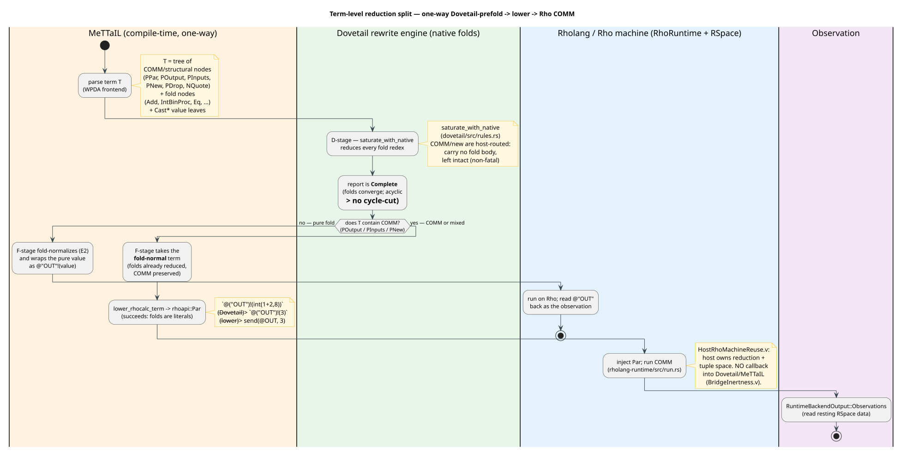

# Term-Level Reduction Split: Dovetail Folds and Rholang COMM in One Term

Last updated: 2026-06-23

This document answers a precise architectural question:

> When a term executes on the Rholang backend (a `PAR`/COMM runs on the Rho
> machine), how is reduction performed over the **sub-terms that should be
> reduced by the Dovetail rewrite engine** (native folds)? Is there a
> bidirectional communication mechanism between the two engines?

The short answers are: **the two engines never talk to each other at run time —
the bridge is strictly one-way** (`MeTTaIL → f1r3node`, never back); and a single
term that needs **both** engines is handled by a **one-way pipeline**:
*Dovetail reduces the folds first (preserving the COMM structure), MeTTaIL lowers
the now-fold-normal term to `rhoapi::Par`, and the Rho machine performs the COMM.*

[Verification and Rollout](07-verification-and-rollout.md) documents this split at
the *language* level (which backend a language selects). This document documents
it at the *term* level (how one term is divided between the engines). All symbols
are defined in [Concepts and Glossary](01-concepts-and-glossary.md); the
backend-routing types are defined in
[Dovetail Rewrite Semantics](03-dovetail-rewrite-semantics.md).

## 1. Terms, folds, and COMM

A RhoCalc term `T` is a tree built from three kinds of node (grammar:
`languages/src/rhocalc.rs`):

| Node kind | Constructors | Reduced by |
|---|---|---|
| **Value leaf** | `CastInt`, `CastStr`, `CastBool`, `CastList`, `CastBag`, `CastMap`, … (a `Cast*` over a ground literal) | already a value — nothing to do |
| **Fold node** | `Add`, `Sub`, `Mul`, `Div`, `IntBinProc`, `Eq`, `And`, `Not`, `ConcatList`, … (every rule marked `fold`) | **Dovetail** (`saturate_with_native`) |
| **COMM / structural node** | `PPar`, `POutput`, `PInputs`, `PNew`, `PDrop`, `NQuote` | **Rholang / Rho machine** (RSpace COMM) |

- A **pure-fold** term contains only value leaves and fold nodes (e.g. `1 + 2`,
  `int(1+2,8)`). It reduces entirely in Dovetail.
- A **pure-COMM** term contains COMM nodes whose payloads are already values
  (e.g. `{ (@("c")?x).{*(x)} | @("c")!(@("OUT")!("p")) }`). It reduces entirely on
  the Rho machine.
- A **mixed** term contains a COMM node with a fold node somewhere inside it
  (e.g. `@("OUT")!(int(1+2,8))` — a send whose payload is the fold `int(1+2,8)`).
  It needs **both** engines.

The mixed case is the heart of the question, because the two engines have
disjoint jobs: Dovetail performs native folds but never performs COMM; the Rho
machine performs COMM but is never handed a MeTTaIL fold to evaluate.

## 2. The bridge is strictly one-way (no bidirectional channel)

There is **no** runtime callback from the Rho machine into Dovetail or MeTTaIL.
The dependency edge `MeTTaIL → f1r3node` is the only one that exists, and it is
mechanically enforced:

- `formal/rocq/rho_bridge/theories/BridgeInertness.v` (zero-admission) proves
  `f1r3node_never_depends_on_mettail` and `f1r3node_does_not_reach_mettail` — no
  transitive chain back from the host to MeTTaIL.
- A host guard test, `mettail_rust_is_not_a_cargo_dependency`
  (`f1r3node-rust/rholang/src/rust/interpreter/accounting/resource_logic.rs`),
  scans every f1r3node `Cargo.toml` and asserts none names `mettail-rust`, so
  f1r3node cannot even *link* MeTTaIL, let alone call into it.
- `HostRhoMachineReuse.v` proves the accepted backend plans reuse the host
  Rholang reducer, RSpace tuple space, and matcher, and exclude any custom
  re-entrant reducer.

`rholang-runtime/src/run.rs` is the single chokepoint that touches the
interpreter: it injects a normalized `rhoapi::Par` and **reads resting RSpace
data back out**. It is handed no MeTTaIL/Dovetail handle and registers no host
function. The Rho machine evaluates Rholang's own constructs (sends, receives,
`EPlus`, …); it is never asked to reduce a MeTTaIL fold redex.

Consequently the engines compose in **one direction only**, as a pipeline — not
as a dialogue.

## 3. The one-way pipeline

The split rides on the two-stage runtime wrapper
`DovetailRhoRuntimeBackedLanguage<L, D, F>`
(`rholang-runtime/src/backend.rs`, `run_backend_report` for `RuntimeBackend::RhoMachine`).
For one input term `T`:

1. **D stage — Dovetail fold reduction.**
   `D(T)` runs `RhoCalcLanguage::dovetail_report_for` → `saturate_with_native`
   (`dovetail/src/rules.rs`). Every fold redex fires; COMM/`new` nodes carry no
   fold body, match no fold LHS, and stay intact (host-routed, *non-fatal* — see
   [Dovetail 12 §4](../dovetail/12-native-fold-reduction.md)). The report is
   `Complete`: folds converge, the e-graph is acyclic, so extraction reports no
   cycle cut (`dovetail/src/extract.rs`). `checked_complete_dovetail_report`
   (`backend.rs`) asserts this completeness *before* the next stage.

2. **F stage — route the whole term.**
   `F(T, report)` inspects `T`:
   - **pure fold** (no `POutput`/`PInputs`/`PNew`/`PDrop`): return
     `RhoBackendInvocation::DeferToDovetailReport`. The fold-normal value *is* the
     answer; the wrapper surfaces it as `RuntimeBackendOutput::Dovetail`. The Rho
     machine is not used.
   - **contains COMM**: take the **fold-normal** term (the folds reduced in step 1,
     the COMM structure preserved), `lower_rhocalc_term` it to `rhoapi::Par` — which
     now succeeds, because every fold sub-term has become a literal — and return a
     Rho invocation.

3. **Rho stage — COMM on the host.**
   The wrapper injects the `Par` into an in-memory `RhoRuntime`/RSpace
   (`run.rs`), the COMM fires, and the resting data is read back as
   `RuntimeBackendOutput::Observations`.

Why fold-normalization is required before lowering: `lower_rhocalc_proc`
(`rholang-runtime/src/rhocalc_ast.rs`) lowers a `Cast*` over a ground literal but
has **no arm** for a fold node such as `Add`/`IntBinProc`; an unreduced fold falls
to `UnsupportedProc("computed rhocalc expression")`. The D stage is exactly what
turns those fold nodes into the literals the lowerer accepts.

This is a one-way composition: `T → D(T) → lower → Rho → observe`. No step calls
backward.

## 4. Worked examples

### 4.1 Pure fold — `int(1+2,8)`

D stage saturates: the inner `Add(1,2)` fires (`1+2 → 3`), then the `int`
cast fires (`int(3,8) → 3`). `T` has no COMM, so F returns
`DeferToDovetailReport`; the result is the Dovetail value `3`. (Proven:
`languages/tests/rhocalc_dovetail_fold.rs::nested_int_cast_folds_via_saturation`.)
The Rho machine is never invoked.

### 4.2 Pure COMM — `{ (@("c")?x).{*(x)} | @("c")!(@("OUT")!("p")) }`

No fold redex, so the D-stage report is the term itself (Complete). F sees COMM
and lowers directly: the receiver `(@("c")?x).{*(x)}` and the sender
`@("c")!(@("OUT")!("p"))` rendezvous, `*(x)` runs the received process, and `"p"`
rests on `OUT`. (Proven: `rholang-runtime/tests/rho_rhocalc_ast.rs`.) Dovetail
contributes nothing.

### 4.3 Mixed — `@("OUT")!(int(1+2,8))`

```text
        T  =  POutput( @("OUT") , int(1+2,8) )       <- COMM node wrapping a fold
   D stage:  int(1+2,8)  --Dovetail folds-->  3       (POutput preserved)
   F stage:  POutput( @("OUT") , 3 )  --lower-->  send(@OUT, 3)
  Rho stage: inject + COMM  -->  OUT : [3]
```

The fold `1+2` reduces in **Dovetail**; the send fires on **Rholang**. One pass,
one direction, no callback. The Dovetail and Rho phases touch disjoint parts of
the same term.

## 5. The boundary: folds over COMM-received variables

A one-way bridge cannot reduce a fold whose operands only become known **after a
COMM fires**, e.g. a continuation `(@("c")?x).{ *(x) + 1 }` joined with a sender
on `@("c")`. The redex `*(x) + 1` does not exist until `x` is substituted, and
that substitution happens on the **Rho** side — which never calls back into
Dovetail. Such a residual fold is therefore **not** reduced one-shot under this
architecture.

This case is frequently not even expressible: `c?x` binds a **Name**, not a
**Proc**, so an arithmetic fold directly over a received binder does not typecheck
without an intervening `*` (drop). Where it is expressible, the runtime
**detects and reports it** (the residual fold fails to lower with a clear error)
rather than silently mis-reducing. Closing it would require either lowering folds
to Rho-native arithmetic (so the host performs them post-substitution — which
moves fold authority off Dovetail) or a genuinely interleaved reducer (which the
one-way bridge forbids); both are out of scope here and noted as future work.

## 6. Why not a bidirectional design?

A bidirectional design — the Rho machine calling back into Dovetail when a COMM
exposes a fresh fold — would reduce mixed/interleaved terms in full generality.
It is deliberately **rejected**:

- it would add a reverse `f1r3node → MeTTaIL` dependency, breaking the inertness
  contract (`BridgeInertness.v`) and the host-reuse boundary
  (`HostRhoMachineReuse.v`);
- it would make the host reducer depend on a foreign rewrite engine, defeating
  the goal of reusing the *stock* Rholang machine unchanged;
- the one-way pipeline already covers the common cases (pure fold, pure COMM, and
  mixed terms whose folds are statically present) with a strictly simpler and
  formally inert composition.

## 7. Citations

- One-way bridge: `formal/rocq/rho_bridge/theories/BridgeInertness.v`,
  `HostRhoMachineReuse.v`.
- Dovetail fold reduction: `dovetail/src/rules.rs::saturate_with_native`;
  [Dovetail 12 — Native-Fold Reduction](../dovetail/12-native-fold-reduction.md);
  `languages/tests/rhocalc_dovetail_fold.rs`.
- COMM on the host: `rholang-runtime/src/run.rs`;
  `rholang-runtime/tests/rho_rhocalc_ast.rs`;
  `LinearCommCorrespondence.v`, `RhocalcAstLowering.v`.
- Term routing: `rholang-runtime/src/backend.rs`
  (`DovetailRhoRuntimeBackedLanguage`, `RhoBackendInvocation::DeferToDovetailReport`);
  [03 — Dovetail Rewrite Semantics](03-dovetail-rewrite-semantics.md),
  [07 — Verification and Rollout](07-verification-and-rollout.md).

## 8. Diagram



PlantUML source:
[figures/09-term-level-reduction-split.puml](figures/09-term-level-reduction-split.puml).
