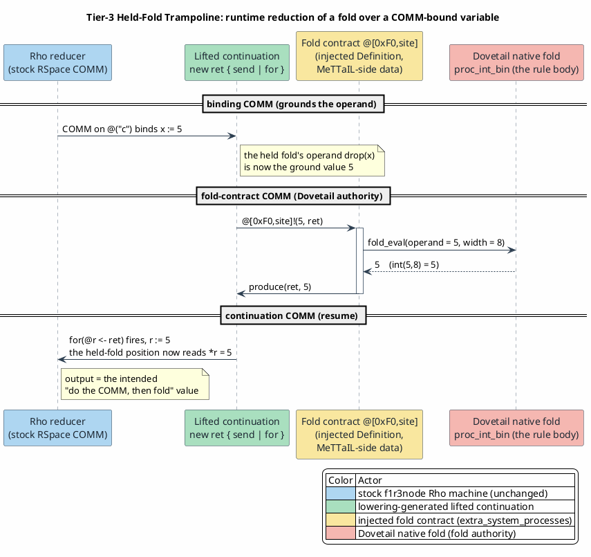

# 10 — Adaptive Evaluation Model: Sequential by Default, Trampoline When Needed

Last updated: 2026-06-24

This document specifies how a MeTTaIL `language!` reduction is evaluated across the
Dovetail rewrite engine and the f1r3node Rho machine, and how the one remaining
boundary of [09 — Term-Level Reduction Split](09-term-level-reduction-split.md) — a
native fold whose operand is bound by a COMM `receive` — is closed by the **Tier-3
held-fold trampoline** without breaking the one-way bridge.

The decision of *where* each reduction runs is made **once, statically, at
lowering**, so the common path carries **zero runtime overhead** and the trampoline
cost is paid only at the rare site that needs it.

## 0. The rule partition and the three tiers

The engine boundary is fixed at compile time by the rho-flip lowering
(`RhoLoweringTotalOrRejects.v`): each `language!` rewrite is either **lowered to
Rho** (COMM to RSpace; scalar ops to contracts; structural to par) or **rejected to
Dovetail-native** (folds, casts, BigInt, collections — no Rholang primitive). On top
of that partition, evaluation runs in one of three tiers:

| Tier | When | Where the reduction runs | Runtime cost |
|---|---|---|---|
| **1 — Sequential** | pure fold, pure COMM, or mixed with statically-present folds | folds in the Dovetail D-stage, COMM on the Rho machine | none added (today's path) |
| **2 — Detect & report** | a fold whose operand is COMM-bound, where Tier 3 does not apply | neither — surfaced as a typed "stuck" diagnostic | none added |
| **3 — Trampoline** | a fold whose operand is COMM-bound, operand reducible to a value leaf | the fold runs in an injected contract on the Rho machine, post-substitution | one extra contract install + two COMMs, only at the held-fold site |

Tiers 1 and 2 are the existing, proven behavior, restated as first-class tiers.
Tier 3 is the new mechanism and is the subject of §4.

## 1. Tier 1 — sequential (byte-for-byte unchanged)

The static "detection" *is* the existing `lower_rhocalc_term` to `lower_proc`
recursion (`rholang-runtime/src/rhocalc_ast.rs`): a pure-fold term fold-normalizes
(extension E2) and lowers to a `Par` run on the Rho machine; a pure-COMM or
mixed-with-statically-present-folds term
pre-folds the ground folds in place and lowers the rest to a `Par` the Rho machine
runs. General Rholang is **all-Rho** (the host reduces its own `EPlus` / `match` /
`if` / `new` inline); MeTTaIL-native folds pre-reduce in the Dovetail D-stage. The
**COMM is the step unit**. No new pass, no new runtime branch.

A ground fold is reduced **in place** during lowering by the exact native fold body
the rule declares (`try_eval_fold_proc` to `proc_int_bin` / `proc_uint_bin` / ...),
recursively for nested ground folds: `int(int(5,8),16)` lowers to `5`. This is the
same value the Dovetail engine would produce — it *is* the rule's `![{…}]` body — so
the partition's fold authority is unchanged.

## 2. Tier 2 — detect and report

A native fold whose operand is **bound by a COMM `receive`** cannot be pre-reduced
(the operand is unknown until the rendezvous) and has no Rholang primitive. Where
Tier 3 does not apply — the operand cannot become a ground value leaf after the COMM
(`GInt` / `GBool` / `GString`) — the model **fail-closes** to a clear "stuck"
diagnostic rather than a silent mis-reduction, surfaced in `step` as a typed node.
This is the honest Tier-3 boundary (§4.6).

## 3. Tier 3 — the held-fold trampoline

### 3.1 The hold (no `Par` to MeTTaIL lift)

The unsound alternative would be to lower the held fold to Rho-native arithmetic so
the host performs it after substitution — but that moves fold authority off Dovetail
(`09 §5`). The other unsound alternative would be to lift the post-COMM `Par` back
into a MeTTaIL term to re-fold it — but lowering is **lossy at value leaves** (it
erases the fold's provenance), so this `Par` to MeTTaIL lift is intractable. Tier 3
instead **never lowers the held fold**: it keeps the fold's static shape and runs the
*exact native fold body* on the now-ground operand inside an injected contract.

### 3.2 The lift (continuation rewrite)

The lowering rewrites the receive body, replacing the held fold with a fresh
result-variable drop `*r` and wrapping it in a `new ret` that calls a private fold
contract and binds its reply (`rholang-runtime/src/rhocalc_ast.rs`
`lower_receive_body`):

```
(@("c")?x).{ C[int(*(x), 8)] }
  ==>  (@("c")?x).{ new ret in { @"<fold>"!(*(x), ret)
                               | for(@r <- ret){ C[int(*(x),8) |-> *r] } } }
```

`C[·]` is any continuation context (the fold may sit in a send payload, a parallel
member, or be the body itself); the rewrite is innermost-first and recursive, so
nested held folds each get their own `new ret`. Because RhoCalc's `POutput` is
single-argument, the two-argument contract send `@"<fold>"!(operand, ret)` is built
at the rhoapi `Par` level (`Send.data` is a `Vec<Par>`), with all de Bruijn
bookkeeping carried by `extend_env`.

### 3.3 The injected fold contract (a `Definition`)

The private channel `@"<fold>"` carries a **Dovetail-backed system-process
`Definition`** built entirely MeTTaIL-side and injected as **data** through the
existing `extra_system_processes: &mut Vec<Definition>` DI seam
(`rholang-runtime/src/fold_contract.rs` `fold_definition`;
`rholang-runtime/src/run.rs` fills the `Vec` that was previously `&mut Vec::new()`).
It is a synchronous, deterministic, value-returning contract of the exact shape
f1r3node already ships (modeled on `hash_contract`): arity 2 (`[operand, ack]`); its
handler `unapply`s the message, runs the native fold (`fold_eval` to `proc_int_bin`)
on the ground operand, and `produce`s the result on `ack`. The channel is a reserved
two-byte unforgeable `@[0xF0, site]` (disjoint from f1r3node's std and test bands),
and the `body_ref` is in a reserved band absent from `non_deterministic_ops()`, so
dispatch is a `DeterministicCall` and replay reproduces it bit-identically.

Because the `Definition` is handed to f1r3node as data, f1r3node gains **no**
MeTTaIL dependency: the host-guard test `mettail_rust_is_not_a_cargo_dependency`
stays green and the inertness contract (`BridgeInertness.v`) holds.

### 3.4 The runtime dispatch loop




PlantUML source:
[figures/10-adaptive-evaluation-model.puml](figures/10-adaptive-evaluation-model.puml).

The binding COMM fires on the stock reducer and substitutes `x := datum`; the lifted
body sends the now-ground operand to `@"<fold>"`; the contract install
(`introduce_system_process`) matches it, dispatches the `ScalaBodyRef` handler, runs
the Dovetail fold, and `produce`s on `ret`; the `for(@r <- ret)` resumes the
continuation with the fold's value. Every arrow is an ordinary produce/consume,
observable at `log_comm` — so the reactive stepper
([11 — Reactive COMM Stepper](11-reactive-comm-stepper.md)) traces the trampoline for
free.

### 3.5 Binding-time shift of the `NativeHandler` disposition

Tier 3 lifts the existing rho-flip `NativeHandler` disposition from a **pre-reduction**
fold (performed in the D-stage before lowering) to a **runtime contract** (performed
after the binding COMM). It is the *same* disposition at a *later binding time*: the
fold still runs on Dovetail, on a ground operand, by the same `![{…}]` body. Any
`language!` native fold under any COMM binder qualifies whenever its operand can be a
ground value leaf after the COMM.

### 3.6 The Tier-3 boundary (fail-closed)

The trampoline covers folds whose operand becomes a **ground value leaf**
(`GInt` / `GBool` / `GString`, via `par_ground_to_proc`). An operand that the COMM
binds to a non-value process makes the contract handler return a clear
`operand-not-ground` error rather than mis-reduce, and a fold whose result must be a
compile-time literal for a value-category evaluator (not a Proc slot) stays Tier 2.
These are honest, non-silent boundaries.

## 4. Zero-overhead argument (Tiers 1 and 2)

No held-fold site means the lowering records no `FoldSpec`, so the
`extra_system_processes` `Vec` stays empty and `create_rho_runtime` chains an empty
iterator — identical maps, dispatch table, and RSpace events to the pre-Tier-3 path.
The common path is **byte-identical**. The held-fold detection itself is part of the
existing `lower_proc` recursion (an AST predicate, `proc_references_bound_var`), not a
new traversal.

## 5. Soundness and determinism

The trampoline is proven sound at the linear-COMM abstraction by
`formal/rocq/rho_bridge/theories/HeldFoldContractSound.v` (zero-admission):
`lift(C[fold(*x)]) ; COMM ; fold-contract` is weak-barb-equivalent to
`intended_eval(C[fold(*x)])` — after the binding COMM substitutes the operand, the
two-COMM trampoline runs to a terminal state whose single output is exactly
`fold_eval(datum, width)`, the intended "do the COMM, then evaluate the fold in place"
result. The output is a pure function of the datum and the static width
(`trampoline_run_deterministic`), so replay reproduces it — matching the
`DeterministicCall` classification of the contract `body_ref`.

The fold authority stays on Dovetail (the handler is MeTTaIL-side data, never
Rho-native arithmetic), and there is **no** `f1r3node → MeTTaIL` callback — the
contract is an ordinary one-shot receive the stock reducer dispatches. So the
inertness (`BridgeInertness.v`) and host-reuse (`HostRhoMachineReuse.v`) boundaries
are preserved, and the rejection of a bidirectional design (`09 §6`) still holds:
Tier 3 is a one-way-injected contract, not a reverse dependency.

## 6. Worked example

For `{ (@("c")?x).{ @("OUT")!(int(*(x), 8)) } | @("c")!(int(5,8)) }`:

1. The send-side `int(5,8)` is a ground fold, reduced in place at lowering to `5`, so
   the send is `@("c")!(5)`.
2. The receive body `@("OUT")!(int(*(x),8))` holds a fold over the COMM-bound `x`, so
   it is lifted to `new ret { @[0xF0,0]!(*(x), ret) | for(@r <- ret){ @("OUT")!(*r) } }`,
   and one fold contract is recorded.
3. At runtime the binding COMM binds `x := 5`; the lifted send delivers `5` to the
   contract; the contract folds `int(5,8) → 5` and replies on `ret`; the `for`
   resumes and `@("OUT")!(5)` lands the value on `OUT`.

This is exactly the integration test
`held_fold_over_comm_received_value_execs_to_the_folded_value`
(`rholang-runtime/tests/rho_rhocalc_ast.rs`), which observes `OUT = 5`; the stepper
test `held_fold_over_comm_received_value_reduces_via_trampoline`
(`rholang-runtime/src/step.rs`) traces the two COMMs.

## 7. Citations

- Tier-3 lift and contract: `rholang-runtime/src/rhocalc_ast.rs`
  (`lower_receive_body`, `find_held_fold`, `try_eval_fold_proc`),
  `rholang-runtime/src/fold_contract.rs` (`fold_definition`, `fold_eval`),
  `rholang-runtime/src/run.rs` / `backend.rs` (the `extra_system_processes` threading).
- Soundness: `formal/rocq/rho_bridge/theories/HeldFoldContractSound.v`;
  `LinearCommCorrespondence.v`; `GuardedCommSoundness.v`.
- One-way bridge: `BridgeInertness.v`, `HostRhoMachineReuse.v`; host-guard test
  `mettail_rust_is_not_a_cargo_dependency`.
- The rule partition: `RhoLoweringTotalOrRejects.v`;
  [03 — Dovetail Rewrite Semantics](03-dovetail-rewrite-semantics.md);
  [09 — Term-Level Reduction Split](09-term-level-reduction-split.md).
- Native fold body: `runtime/src/numeric_cast_adapter.rs` (`proc_int_bin`);
  [Dovetail 12 — Native-Fold Reduction](../dovetail/12-native-fold-reduction.md).
