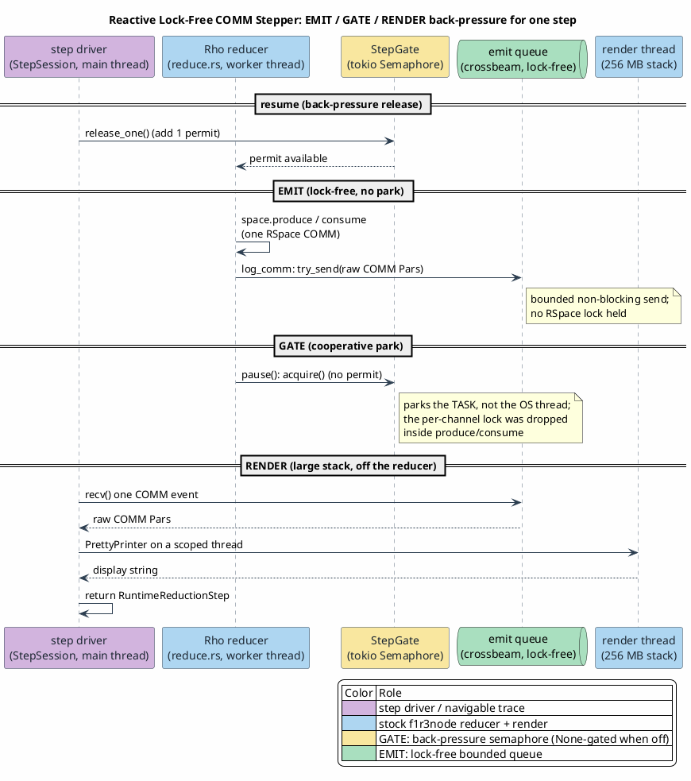
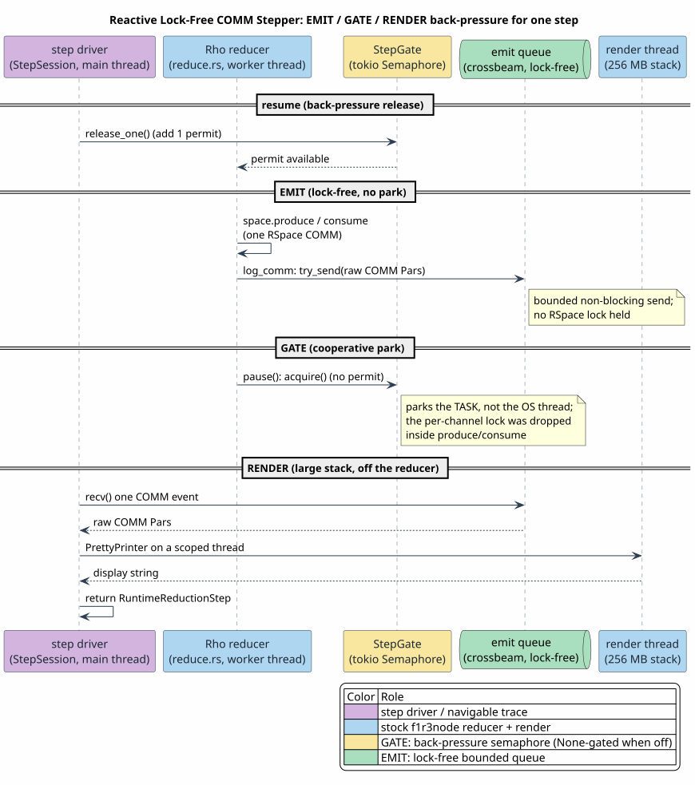

# 11 — Reactive Lock-Free COMM Stepper

Last updated: 2026-06-24

The `step` command single-steps a MeTTaIL term's reduction on the **metered Rho
machine**, emitting one navigable node per COMM. For a pure-fold term it reuses the
Dovetail derivation graph; for a term with COMMs it drives a **reactive, lock-free,
back-pressured** single-stepper over a small, surgical f1r3node fork that imposes
**zero cost when not stepping**. This document specifies that stepper; the
[Adaptive Evaluation Model](10-adaptive-evaluation-model.md) specifies what runs
where, and the Tier-3 trampoline it traces.

## 0. Three concerns, three lock-free lanes

A single COMM step is split into three independent concerns so none blocks another:

| Lane | What it does | Mechanism |
|---|---|---|
| **EMIT** | publish the raw COMM `Par`s as they fire | a bounded **lock-free** `crossbeam` queue `try_send` in `RSpace::log_comm` |
| **GATE** | pause the reducer between steps (back-pressure) | a `StepGate` (tokio `Semaphore`); the reducer `pause()`s **holding no RSpace lock** |
| **RENDER** | turn the `Par`s into displayable text | the recursive `PrettyPrinter` on a large-stack thread, **off** the reducer |

PlantUML source:
[figures/11-reactive-comm-stepper.puml](figures/11-reactive-comm-stepper.puml).

## 1. The fork seam (zero cost when off)

The f1r3node fork is **additive and `None`-gated** — there is no Cargo feature in the
hot path:

- **`rspace++/.../rspace.rs`** — `RSpace` gains a
  `step_observer: Option<Arc<dyn StepCommObserver<…>>>` field (appended last,
  `None` by default). In `log_comm` an installed observer clones and `try_send`s the
  COMM `Par`s; a `None` observer is one branch-predicted `is_none` check.
- **`rspace++/.../logging.rs`** — the `StepCommObserver` trait (the emit hook) and the
  `StepGate` (the back-pressure semaphore).
- **`rholang/.../reduce.rs`** — after `space.{produce,consume}().await` returns and
  **before** continuing the process (an async boundary holding no RSpace lock), the
  reducer calls `self.space.step_gate()` and, if `Some`, `pause()`s. `step_gate()`
  returns `None` by default.

When not stepping, the only added work per COMM is one `Option` check in `log_comm`
and one `step_gate()` call returning `None` — no allocation, no lock, no task park. So
a non-stepping `inj` runs the same path as the unforked machine plus two
branch-predicted checks; the no-regression sweep (`rholang-runtime` suite, the
rho-bridge gate) confirms the fork breaks nothing. The companion f1r3node-side design
document — `docs/theory/cost-accounting-impl/w3-live-single-step-comm-observation-oslf-fold-seam.md`
in the fork worktree — is the authoritative principal-review record of this seam, tied
to the cost-accounting workstream.

## 2. The `StepSession` driver

`rholang-runtime/src/step.rs` hosts a `StepSession`: a dedicated worker thread runs
`inj` on a current-thread runtime with the deterministic
`Blake2b512Random::create_from_bytes(FIXED_SEED)`, the installed `StepObserver`, the
emit queue receiver, and (for Tier 3) the held-fold contract `Definition`s. Each
`next_step()` does `gate.release_one()` then `receiver.recv()` — an explicit `loop`,
**O(1)** live memory, pay-as-you-go, so it works for divergent Rholang (halt anytime).
`Drop` aborts: `gate.abort()` unblocks the parked reducer (which unwinds with no lock
held) and the worker is joined. The wrapper's `start_reduction_stepper`
(`backend.rs`) composes the program (`contracts.append(call)`), collects the held-fold
contracts, and starts the session.

## 3. The navigable trace

`runtime/src/language.rs` adds `RuntimeBackendOutput::ReductionTrace` carrying a
`RuntimeReductionTrace` of `RuntimeReductionStep`s (ordinal, engine, display, optional
COMM event). `repl/src/repl.rs` routes a `step` on the Rho machine with at least one
COMM to this trace (a pure-fold term falls back to the Dovetail graph), via a new
`RuntimeGraphKind::RhoReductionTrace`. The trace projects to a **linear chain** (node
id = ordinal, root = `0`, normal form = last, edge `i → i+1`), so the existing
`apply` / `rewrites` / `normal-forms` navigation traverses it unchanged. Each node
carries a per-step **engine label** — `Rho COMM` for a rendezvous, a Dovetail-fold
label for a Tier-3 fold-contract COMM, or `stuck` for a Tier-2 diagnostic — so a
trampoline trace interleaves the fold-contract COMM with the user COMMs only when
Tier 3 fires.

## 4. Stack-safety, per component

Each component is bounded independently (the project `normalize_iterative` mandate):

- **GATE** — the reducer gate is a flat `await` inside the existing stack-growing
  future; it adds no recursion depth.
- **EMIT** — a bounded queue push; constant stack.
- **RENDER** — the stock `PrettyPrinter` is recursive and unguarded, so every
  COMM-payload `Par → String` render runs on a dedicated large-stack scoped thread
  (256 MB) rather than the reducer's stack. (Making the interpreter itself stack-safe
  is tracked as a separate f1r3node change; the stepper enlarges the render stack so
  the campaign does not depend on it.)
- **DRIVER / projection / navigation** — explicit `loop` / `for`, no recursion in the
  COMM count.

## 5. Determinism

The trace shows one admissible interleaving: a current-thread poll order, the
content-hash match order of RSpace (no RNG), the `FIXED_SEED`, and a monotone emit
ordinal. Tier-3 fold contracts are classified deterministic (their `body_ref` is
absent from `non_deterministic_ops()`), so a replayed session reproduces the same
trace. Witness enumeration across all interleavings is a separate concern
(`AmbiguityWitnessEnumeration.v` covers the parser side).

## 6. MeTTaIL-side consumption of the fork

The mettail crates build against the fork through a **held-local `[patch]`** on the
f1r3node path dependency (pointing at the `../f1r3node-rust-mettail` worktree on branch
`feature/mettail`). This patch is a local build convenience and is **not committed** —
it mirrors the held-local f1r3node patch convention used elsewhere in the campaign.
The crossbeam queue dependency is a normal manifest entry on `rholang-runtime`.

## 7. Citations

- Driver and report types: `rholang-runtime/src/step.rs` (`StepSession`,
  `StepObserver`); `runtime/src/language.rs` (`RuntimeReductionTrace`,
  `ReductionStepper`); `rholang-runtime/src/backend.rs` (`start_reduction_stepper`).
- REPL trace: `repl/src/repl.rs` (`RuntimeGraphKind::RhoReductionTrace`, the linear
  projection).
- Fork seam: `rspace++/src/rspace/{rspace.rs,logging.rs}`,
  `rholang/src/rust/interpreter/reduce.rs` in the `feature/mettail` worktree; the
  principal-review record
  `docs/theory/cost-accounting-impl/w3-live-single-step-comm-observation-oslf-fold-seam.md`.
- Tier-3 trampoline traced for free:
  [10 — Adaptive Evaluation Model](10-adaptive-evaluation-model.md);
  `formal/rocq/rho_bridge/theories/HeldFoldContractSound.v`.
- COMM correspondence: `LinearCommCorrespondence.v`; `RholangAstLowering.v`.
