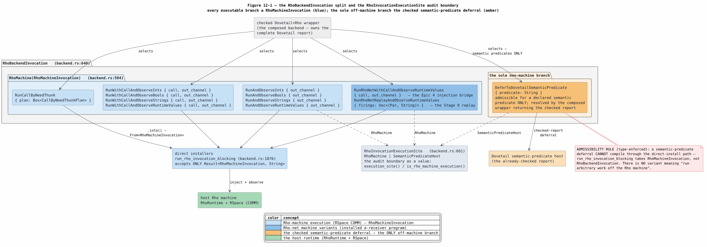

# 12 — Runtime Invocation Migration: `RhoBackendInvocation` Split

## Purpose

The Rho-native refactor split the single legacy `RhoBackendInvocation` enum into two
types so that the **execution site** of every backend action is visible in the type
system. This note is the migration guide for any downstream crate that constructed or
matched the previous `RhoBackendInvocation` variants.

> **Audit boundary (why this change exists).** Every executable backend action must run
> on the host **Rho machine** (RSpace COMM). The *only* action allowed off the Rho
> machine is a **semantic-predicate** deferral, resolved by the checked Dovetail+Rho
> wrapper that already owns the complete Dovetail report. The old enum mixed both on one
> level, so a non-machine disposition (`DeferToDovetailReport`) was indistinguishable at
> the type level from executable work. The split makes the boundary a type, not a
> convention — see `rholang-runtime/src/backend.rs` (`RhoInvocationExecutionSite`).

## What changed

| Legacy (`RhoBackendInvocation`, removed) | New home |
|---|---|
| `RunAndObserveInts { out_channel }` (…`Bools`/`Strings`/`RuntimeValues`) | `RhoMachineInvocation::RunAndObserveInts { out_channel }` (same fields) |
| `RunWithCallAndObserveInts { call, out_channel }` (…`Bools`/`Strings`/`RuntimeValues`) | `RhoMachineInvocation::RunWithCallAndObserveInts { call, out_channel }` |
| `RunCallByNeedThunk { plan }` | `RhoMachineInvocation::RunCallByNeedThunk { plan }` |
| `DeferToDovetailReport` (catch-all native-handler disposition) | `RhoBackendInvocation::DeferToDovetailSemanticPredicate { predicate: String }` — **semantic predicates only** |

The two new types:

```rust
// rholang-runtime/src/backend.rs  (feature = "runtime-report")

/// Every executable branch runs on the host Rho machine.
pub enum RhoMachineInvocation {
    RunAndObserveInts { out_channel: String },
    RunAndObserveBools { out_channel: String },
    RunAndObserveStrings { out_channel: String },
    RunAndObserveRuntimeValues { out_channel: String },
    RunWithCallAndObserveInts { call: Par, out_channel: String },
    RunWithCallAndObserveBools { call: Par, out_channel: String },
    RunWithCallAndObserveStrings { call: Par, out_channel: String },
    RunWithCallAndObserveRuntimeValues { call: Par, out_channel: String },
    RunCallByNeedThunk { plan: Box<CallByNeedThunkPlan> },
}

/// Selected by a checked Dovetail+Rho backend. The ONLY non-machine branch is a
/// semantic-predicate deferral whose payload is the already-checked Dovetail report.
pub enum RhoBackendInvocation {
    RhoMachine(RhoMachineInvocation),
    DeferToDovetailSemanticPredicate { predicate: String },
}

impl From<RhoMachineInvocation> for RhoBackendInvocation { /* wraps in RhoMachine */ }

/// The audit boundary as a value.
pub enum RhoInvocationExecutionSite { RhoMachine, SemanticPredicateHost }
```



*Figure 12-1. The split as components: every executable branch is a
`RhoMachineInvocation` (blue) selected by the checked Dovetail+Rho wrapper and
executed on the host Rho machine through the direct installers
(`run_rho_invocation_blocking`, which accepts only
`Result<RhoMachineInvocation, String>`); the sole non-machine branch is
`DeferToDovetailSemanticPredicate` (amber), resolved by the composed wrapper
returning the checked report. `RhoInvocationExecutionSite` is the audit boundary
as a value. The two `RunRhoNet*` variants are post-split additions — the Epic 4
injection bridge and the Stage 0 replay driver — with no legacy counterpart in
the migration table above; the diagram shows the enum as it stands in
`rholang-runtime/src/backend.rs`. Source:
[figures/12-invocation-split.puml](figures/12-invocation-split.puml).*

## How to migrate downstream code

1. **Constructing executable invocations.** Replace `RhoBackendInvocation::RunAndObserve*`
   / `RunWithCallAndObserve*` / `RunCallByNeedThunk` with the identical
   `RhoMachineInvocation::…` variant (fields are unchanged). Where a `RhoBackendInvocation`
   is required (composed Dovetail+Rho wrapper), wrap with `.into()` or
   `RhoBackendInvocation::RhoMachine(inv)`.

2. **Direct Rho installers** (`run_rho_invocation_blocking` and the direct-install path)
   now accept **only** `Result<RhoMachineInvocation, String>` — they cannot receive a
   semantic-predicate deferral. If your call site produced `DeferToDovetailReport`, it must
   now route through the **composed** `RhoBackendInvocation` path instead of the direct one.

3. **The old `DeferToDovetailReport`** was a broad "native-handler disposition." It is
   replaced by `DeferToDovetailSemanticPredicate { predicate }`, which is admissible **only**
   for a semantic predicate and is resolved by the composed wrapper returning the checked
   Dovetail report. Non-semantic native handlers no longer defer through the invocation
   enum; they are Rho-machine `NativeSystemProcess` work (installed as data via the
   system-process DI seam) or an explicit rejected-rule disposition at plan time.

4. **Matching.** Match `RhoBackendInvocation::RhoMachine(inv)` then on `inv`, or use the
   audit-boundary accessors instead of matching every variant:
   - `invocation.execution_site() -> RhoInvocationExecutionSite`
   - `invocation.is_rho_machine_execution() -> bool`
   - `invocation.program_par() -> Option<&Par>` (the dynamic call `Par`, if any)
   - `invocation.out_channel() -> Option<&str>` (the observation channel, if any)

## In-workspace consumers (already migrated)

All in-tree consumers were updated in checkpoint `313e7d09`:
`repl/src/rho_backends.rs`, `rholang-runtime/src/{backend,lib,rholang_ast}.rs`, plus the
scalar-invocation planner `rholang-codegen/src/invocation.rs`
(`plan_scalar_invocations` now yields `RhoMachineInvocation`). External crates depending on
the legacy constructors should follow steps 1–4 above.

## Invariants preserved by the split

- **Type-enforced boundary.** A direct installer cannot compile against a semantic-predicate
  deferral; only the composed wrapper can produce `DeferToDovetailSemanticPredicate`.
- **No silent host fallback.** There is no longer a variant that means "run this arbitrary
  work off the Rho machine." Every `RhoMachine(_)` executes on RSpace; every
  `SemanticPredicateHost` is a checked-report deferral for a declared semantic predicate.
- **Fingerprint stability.** The invocation carries the same observation channels and dynamic
  `Par` payloads as before; only the enum shape changed, so generated-artifact identity is
  unaffected.
