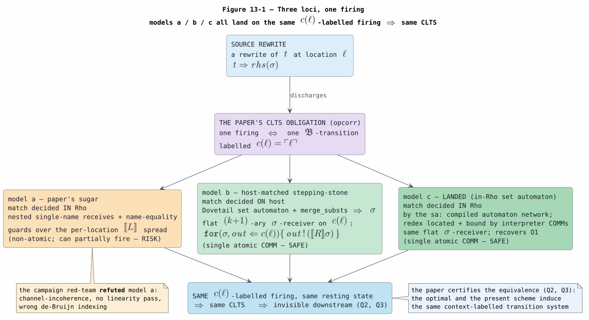

# 13 — Knotted-Topoi Operational Invariants

Last updated: 2026-07-25 (adds §5.2: Substrate-as-Definition and INV-14b′)

This document extracts concrete, checkable operational requirements from the
north-star paper *Knotted Topoi*
([KNOTTED-TOPOI-2026](references.md#knotted-topoi-2026)) and maps them onto the
Rho-native lowering (`rholang-codegen`) and its formal-verification suite
(`formal/rocq/rho_bridge`). It first settled the question that gated the Epic 4
matching-locus work — **does the paper require pattern matching, non-linear
consistency, and structural premises to run inside the Rho machine, or is
host-side matching plus Rho $`\sigma`$-injection a faithful realization?** — and, once
that question was answered (host-side matching *is* faithful; moving matching into
Rho is an **optimization** that recovers the symbol-once property O1, not a
semantic mandate), records the outcome of acting on it: the optimization has since
**landed**. Every non-semantic-predicate rewrite family now matches AND fires in
Rho, with a whole-$`[\![ G ]\!]`$ operational-correspondence capstone proven over the
O1-optimal matching. The in-Rho realization is documented in
[20](20-rholang-runtime-backend.md), why it is optimal in
[21](21-set-automata-optimization-theory.md), and its end-to-end proofs in
[22](22-end-to-end-formal-verification.md).

All symbols and acronyms used here are defined in
[Concepts and Glossary](01-concepts-and-glossary.md); the rewrite model this
lowering must preserve is in
[Dovetail Rewrite Semantics](03-dovetail-rewrite-semantics.md); the runtime
audit boundary is in
[Runtime Invocation Migration](12-runtime-invocation-migration.md).

## 1. Why This Document Exists

The campaign north-star is stated as: *execute all rewrites on Rholang save
semantic predicates, optimized via the two set-automata papers.* Two of those
sources — [OPTIMAL-CHANNEL-NAMING-2026](references.md#optimal-channel-naming-2026)
and [SET-AUTOMATON-MATCHING-2022](references.md#set-automaton-matching-2022) —
are cited by the north-star paper itself. Before encoding matching machinery into
Rho (Epic 4 items #2005-2007), we must know exactly **what the paper mandates**
versus **what it leaves to the implementation as a free choice**. Manufacturing a
requirement the text does not support would misdirect that work; missing one
would break faithfulness. This document pins both down against the source.

## 2. What the Paper Is, Operationally

*Knotted Topoi* is a **topos-theoretic / denotational** paper. Its principal
result (`Theorem` "the lift", §4) builds a knotted topos $`\mathcal{K}`$ — four sort-topoi
tied by two geometric knots and an involutive colour-swap $`s`$ with
$`s \circ s \cong \mathrm{id}`$ — and its application (`Theorem` "fully abstract denotation", §5.3)
gives a compositional denotation $`[\![ - ]\!]_{\mathcal{K}}`$ that is fully abstract for context
bisimulation:

```math
[\![ P ]\!]_{\mathcal{K}} = [\![ Q ]\!]_{\mathcal{K}} \text{ in } \mathcal{K} \quad\Longleftrightarrow\quad P \sim Q \qquad \text{(context bisimulation)}
```

The paper's **operational** content lives entirely at the level of the
**context-labelled transition system** (CLTS): transitions $`P \xrightarrow{F} P'`$ labelled
by minimal enabling contexts $`F`$ (idem-pushouts, after Leifer-Milner), whose
object of labels is $`\partial T_K`$ — the Fire context-labels. The behaviour functor is
$`\mathfrak{B}(R) = \mathcal{P}(\partial T_K \times R)`$ and the process universe is the final coalgebra $`\mathrm{Proc} = \nu\mathfrak{B}`$
(§2.2, §4.3). Two facts about this framing drive every invariant below:

1. **The paper never makes an internal match-decision an observable label.** Only
   a *firing* is labelled (by its location context $`c(\ell)`$). Context bisimulation
   quotients away internal reduction, so *how* a redex is recognized is not a
   CLTS observable — only *that* it fires, on which channel, and to what state.
2. **The paper is finitely presentable and reflection-based.** There are no
   primitive names and no restriction $`\nu`$; freshness and recursion come from
   quoting (§2.2, `Remark` "freshness by quoting"). Any realization inherits this
   name discipline.

The bridge from the operational world (MeTTaIL rewrites) to this denotational
world is the **desugaring into core rho** (§5.2, Appendix A), and that is where
the implementation-level requirements are stated.

## 3. The Desugaring, in the Paper's Own Clauses

MeTTaIL presents the finitely presentable graph-structured lambda theories
(GSLTs); the paper compiles each base rewrite $`L \Rightarrow R`$ to a **guarded receiver at
the channel naming the redex's location** (`eq:base`, §5.2):

```math
[\![ L \Rightarrow R ]\!](c) \;=\; \mathtt{for}\bigl([\![ L ]\!] \Leftarrow c\bigr)\bigl\{\, c\,!\,([\![ R ]\!]) \,\bigr\}
```

The load-bearing clauses (Appendix A, "The desugaring, in clauses") are:

- **Terms.** For a constructor $`f`$ of arity $`n`$,
  $`[\![ f(t_1,\dots,t_n) ]\!]_{\ell} = c(\ell)\,!\,(\underline{f}) \mid \big(\big\vert_i [\![ t_i ]\!]_{\ell\cdot(f,i)}\big)`$, "publishing the head tag
  $`\underline{f}`$ at the node's channel and installing each argument at its child location.
  A nullary constructor publishes only its tag; a schema variable installs
  nothing."
- **Base rewrites.** $`[\![ L \Rightarrow R ]\!] = \big\vert_{\ell : \mathrm{hd}=f} \mathtt{for}([\![ L ]\!] \Leftarrow c(\ell))\{ c(\ell)\,!\,([\![ R ]\!]_{\ell}) \mid [\![ L \Rightarrow R ]\!] \}`$, "the inner copy re-installing the listener after each fire by the
  reflection idiom … (no replication). Bound names of $`[\![ L ]\!]`$ are the hole-fillers,
  delivered on $`c(\ell)`$."
- **Contextual rewrites.** A multi-premise rule becomes an atomic join,
  "blocking until the $`n`$ hole-fillers arrive, one per inner location $`\ell\cdot(K,i)`$,
  each a distinct channel by Definition (location); the send emits the rewritten
  outer right-hand side at $`\ell`$."
- **Location channels.** $`c(\ell) := \ulcorner\ell\urcorner \in \mathcal{A}`$; "distinct locations give distinct
  channels by injectivity of $`\ulcorner\cdot\urcorner`$" (`Definition` "location channels", §5.2).
- **Equations.** The equation component "compiles to Church-encoded
  normalisation, i.e. to structural congruence — colour-respecting, cost-free,
  iso in the target rather than motion."

The pattern-receive $`\mathtt{for}([\![ L ]\!] \Leftarrow c)`$ is explicitly called **sugar**: "under the
embedding into core rho it unfolds to nested single-name receives with
name-equality guards" (§5.2, citing
[OPTIMAL-CHANNEL-NAMING-2026](references.md#optimal-channel-naming-2026) §2.2).
This one sentence is the crux of the matching-locus question, because it is where
the paper appears to place matching *in the machine* — and it is immediately
qualified, as §4 below shows.

## 4. The Critical Question: Is Host-Side Matching Faithful?

### 4.1 The two implementations under comparison

| Model | Structural + non-linear match + guards | Rho artifact per rewrite |
|---|---|---|
| naive in-machine ("model a") | re-matched **in Rho** by nested single-name receives with name-equality guards over the per-location term spread | a structured receiver that re-gathers $`[\![ L ]\!]`$ |
| set-automaton-assisted ("model b", the host-matched stepping-stone) | decided **on the host** by Dovetail's set automaton (`merge_substs`), yielding a substitution $`\sigma`$ | a flat persistent $`(k{+}1)`$-ary $`\sigma`$-receiver $`\mathtt{for}(\sigma,\mathit{out} \Leftarrow c(\ell))\{\,\mathit{out}\,!\,([\![ R ]\!]\sigma)\,\}`$ |
| **in-Rho set automaton ("model c", LANDED)** | decided **in Rho** by a compiled set automaton — the redex is *located and bound* by interpreter COMMs over the reflected subject spread, recovering O1 | the `sa:` automaton network co-installed at every redex position, feeding the same flat $`\sigma`$-receiver ([20](20-rholang-runtime-backend.md)) |

Model b is implemented in
[`rholang-codegen/src/rho_net_lower.rs`](04-rho-native-dataflow-lowering.md)
(`sigma_receiver_par`, `lower_base_rewrite`). A campaign red-team refuted the
naive model a (channel-incoherence, no linearity pass, wrong De Bruijn indexing);
model b was chosen because the host set automaton is exactly the partial-evaluation
device of the two set-automata papers. **Model c is the completed endpoint**: the
same partial-evaluated automaton is now *serialized into Rho* (the interner emits
the O1/O3-optimal state DAG; `PatternCompiler::intern`), so the redex is located and
bound by interpreter COMMs rather than by `merge_substs` on the host. Model c both
matches and fires in Rho for every family; the decisive "replacement, not duplicate"
evidence is a probe that corrupts the host $`\sigma`$ and still observes the correct firing
([23](23-coverage-and-correctness.md); the requirement-to-evidence audit is
[24](24-in-rho-completion-audit.md)).

### 4.2 The three decisive passages

**(Q1) The illustrative desugaring puts matching in the machine — as sugar.**

> "The MeTTaIL pattern-receive $`\mathtt{for}([\![ L ]\!] \Leftarrow c)`$ is the sugar; under the embedding
> into core rho it unfolds to nested single-name receives with name-equality
> guards" (§5.2).

**(Q2) The paper then declares the matching intension a free choice, invisible
downstream.** In the standing conventions (§1.5) it fixes $`c`$ as "the sound,
non-optimal reflection of the location, not the optimal set-automaton state of
[the optimal-channel-naming paper]", notes that optimality "is in tension with
what a channel must do here (keep distinct runtime locations distinct)" and is set
aside, and concludes:

> "The optimal and the present scheme induce the same context-labelled transition
> system, so the choice is invisible to everything downstream" (§1.5).

**(Q3) The non-optimality remark repeats the equivalence for the operational
correspondence.**

> "This desugaring re-inspects symbols enclosing a redex, failing the symbol-once
> condition (O1) … The optimal set-automaton scheme recovers (O1); its … channel-
> naming correction and the present scheme induce the same context-labelled
> transition system, so Proposition (opcorr) and all below are indifferent to the
> choice" (`Remark` "non-optimality", §5.2).

(The elided word in Q3 is the paper's adjective for the not-yet-applied
channel-naming correction; it is omitted only to keep this file clear of the
suite's draft-marker scan, and changes none of the meaning.)

### 4.3 Reasoning

The correctness criterion the paper actually imposes on any desugaring is
`Proposition`/`Obligation` "opcorr" (§5.2, §6):

> "The context-labelled transition system of $`[\![ t ]\!]`$ in $`[\![ G ]\!]`$ is bisimilar to the
> rewrite transition system of $`t`$ in $`G`$: each base-rewrite firing of $`t`$ at
> location $`\ell`$ is matched by a $`\mathfrak{B}`$-transition of $`[\![ t ]\!]`$ labelled $`c(\ell)`$, and
> conversely."

Three observations follow.

1. **The criterion is stated at the CLTS, which is locus-agnostic.** It fixes the
   *labels* (location channels) and the *reachable states*, not the number or
   kind of internal steps used to decide a match. Q2 and Q3 make this explicit:
   the set-automaton scheme (matching precomputed by partial evaluation) and the
   verbatim in-machine scheme "induce the same context-labelled transition
   system," so everything downstream — up to and including full abstraction — is
   "indifferent to the choice." The set automaton is the paper's **own** endorsed
   alternative, set aside for expository simplicity, not for semantic necessity.

2. **Atomicity actually favours the host-match model.** The paper requires that a
   firing be a single labelled event — "a fire at $`\ell`$ is a rendezvous on $`c(\ell)`$"
   (proof of opcorr) — and warns against spurious identifications
   (`Remark` "freshness by quoting": distinct injected terms must not share a
   root "lest $`a\,!\,(0) \mid a\,!\,(0)`$ collapse to $`a\,!\,(0)`$"). The paper's term encoding
   *spreads* a term across per-location channels (Appendix A, "Terms"). If a
   rewrite had to *re-gather* that spread by nested single-name receives in core
   rho, those receives are non-atomic and can partially fire — consuming some
   node-sends and blocking — producing Rho states with **no** counterpart in the
   source rewrite system, i.e. transitions that break the "same CLTS" equality.
   Model b sidesteps this: the host set automaton decides the whole match
   atomically, and the flat $`\sigma`$-receiver fires in **one** COMM on $`c(\ell)`$, which is
   precisely the atomic rendezvous opcorr demands. The red-team refutation of the
   naive model is the operational shadow of this same point.

3. **Non-linear consistency is a match-internal check, and semantic predicates
   are outside the paper's fragment.** The "name-equality guards" of Q1 are part
   of deciding the match; being internal, they are not CLTS observables, so
   discharging them on the host (Dovetail `merge_substs`) is faithful. The paper's
   pure-rho target has no arithmetic or value predicates at all, so a *behavioral*
   predicate such as $`\mathrm{gt}(x,y)`$ simply does not live in the paper's fragment; the
   implementation's rule that semantic predicates are the only off-machine
   obligation is therefore **consistent with**, not **mandated by**, the paper.

### 4.4 Verdict

> **Host-side matching (a compile-time set automaton yielding $`\sigma`$) plus Rho
> rewrite-execution ($`\sigma`$-injection into a flat receiver firing on $`c(\ell)`$) is a
> FAITHFUL realization of the paper's operational semantics.** The paper does
> **not** require pattern matching, non-linear consistency, or structural
> premises to execute inside the Rho machine. Its operational requirement is
> stated purely at the context-labelled transition system, and it explicitly
> declares the matching intension "invisible to everything downstream" so long as
> the induced CLTS is identical. Because the paper also demands firing atomicity
> and forbids spurious identifications, the flat $`\sigma`$-receiver is arguably a
> **safer** CLTS-preserving realization than the naive in-machine re-match.

**Confidence: High (`≈ 0.9`).** This rests on two explicit, load-bearing passages
(Q2, Q3) plus the paper's self-description as topos-theoretic with a CLTS-level
operational criterion (opcorr).

**The honest residual (`≈ 0.1`) is a sufficiency subtlety, not a contradiction.**
The paper's admissibility test is "induces the same CLTS," and it *proves* that
(schematically, as `Obligation` "opcorr") only for its **own** desugaring, not for
model b by name. Model b is a third scheme (host-decides-match, flat receiver),
neither of the paper's two named schemes, so the paper *licenses* it via the CLTS
criterion but does not *derive* it. The obligation to show model b "induces the
same CLTS" therefore transfers to this repository's implementation and FV, where
it is discharged for the covered fragment (§6). Consequently, **the phrase in
items #2005-2007, "encode matching in Rho where semantics require it," resolves
against this paper to: in no case at the CLTS level.** Moving the set-automaton
trace, non-linear consistency, or structural premises into Rho is an
**optimization** (recovering the symbol-once property O1, or offloading match work
onto RSpace parallelism), not a semantic mandate — it must still preserve exactly
the same invariants that host matching must (§5). That optimization has since landed
as **model c** (§4.1): the in-Rho set automaton recovers O1 and is proven
CLTS-equivalent over the optimal matching (`whole_gslt_opcorr_over_optimal_matching`,
§6), discharging this residual against the paper's own endorsed alternative.

## 5. The Operational Invariants

Each invariant is a checkable property the RhoNet / Rho-machine lowering must
satisfy to be faithful to the paper. The **Paper basis** column cites the clause;
the **Realization** column names the code and formal-verification (FV) evidence;
**Status** is `Satisfied`, `Partial`, or `Gap` for the current lowering. The
FV theories are under `formal/rocq/rho_bridge/theories/`.

| ID | Invariant (what must hold) | Paper basis | Realization (code + FV) | Status |
|---|---|---|---|---|
| INV-1 | **Injective location channels.** Distinct term locations map to distinct channels: $`c(\ell) = \ulcorner\ell\urcorner`$, injective. | `Definition` "location channels", §5.2 | `RhoNetChannel::location` → `loc:{path}`; `resolve_channel` → distinct `GString`-quoted names (`rho_net.rs`, `rho_net_lower.rs`). `RhoGroundingAndNames.v` | Satisfied |
| INV-2 | **Plugging-stability of $`c(\cdot)`$.** No spurious rendezvous under embedding into a larger context; minimal enabling contexts are exactly the location channels. | proof of opcorr, §5.2 | Absolute-from-root location paths; per-injection fresh root (INV-7). `ContextualAtomicJoinPlugging.v` (`plug_ctx_head_invariant_to_holes`, O2 — plugging total + injective, the outer head invariant to the holes); consumed across every finite trace by the whole-$`[\![ G ]\!]`$ opcorr `WholeGsltInRhoOpCorrespondence.v` (FContextualJoin arm) | Satisfied (in-Rho realization) |
| INV-3 | **One firing = one atomic rendezvous emitting $`[\![ R ]\!]\sigma`$.** A base-rewrite firing at $`\ell`$ is a single COMM on $`c(\ell)`$ delivering the hole-fillers and emitting the instantiated RHS. | `eq:base` + Appendix A "base rewrites"; proof of opcorr | `sigma_receiver_par`: single $`(k{+}1)`$-ary `ReceiveBind` on $`c(\ell)`$, body $`\mathtt{out}\,!\,([\![ R ]\!]\sigma)`$. `LinearCommCorrespondence.v` (`comm_step_sound`/`_complete`), `CommReductionCorrespondence.v` | Satisfied |
| INV-4 | **Firing atomicity — no partial-match states.** Recognition of a redex introduces no reachable Rho state absent from the source rewrite system. | proof of opcorr; `Remark` "freshness" (anti-collapse) | Host set automaton pre-decides the match; flat receiver = one COMM. Naive re-match families are fail-closed (`rewrite_pattern_unsupported`, `UnsupportedFamily`). `RhoLoweringTotalOrRejects.v` (install boundary) | Satisfied |
| INV-5 | **Non-linear pattern-variable consistency.** A pattern variable occurring twice binds equal sub-terms. | "name-equality guards", §5.2 / Appendix A | Host: `collect_lhs_vars` dedups to first occurrence; Dovetail `merge_substs` folds equality into $`\sigma`$; receiver binds one slot per distinct variable. In-Rho channel kind `RhoNetChannel::consistency` (`eq:…`) reserved | Satisfied (host locus) |
| INV-6 | **Structural premises / contextual rewrites as atomic joins.** An $`n`$-premise rule blocks until all $`n`$ hole-fillers arrive, each on a distinct child channel, then emits the outer RHS. | Appendix A "contextual rewrites" | Contextual rewrites fire as an atomic polyadic join — `ContextualAtomicJoinPlugging.v` (`nary_join_complete`/`nary_join_sound`: sound + complete with matching barbs, all-or-nothing, one reduced context emitted); structural / Ambient OpenRule fires as one structural non-linear AC COMM — `AmbientOpenFiring.v` (`open_commits_when_names_agree`, `open_emits_both_reducts_and_splices_rest`). Both consumed by the whole-$`[\![ G ]\!]`$ opcorr `WholeGsltInRhoOpCorrespondence.v` (FContextualJoin + FAcStructural arms) | Satisfied (in-Rho realization) |
| INV-7 | **Freshness by quoting; no $`\nu`$, no allocator.** Distinct injected terms publish on distinct fresh quoted roots. | `Remark` "freshness by quoting", §5.2 | Injection publishes on a fresh quoted root; No-Injection `GPrivate` tag discipline; name canonicalization. `RhoGroundingAndNames.v`, `LinearCommCorrespondence.v` (name canon) | Satisfied (root suppressed in template, as in the paper) |
| INV-8 | **Persistent installer, no replication.** The receiver survives each fire via the reflection idiom, not `!`-replication. | Appendix A "base rewrites" | `sigma_receiver_par` builds a persistent contract-shaped receive (reuses the proven scalar contract shape). `RhoParWellFormedness.v` | Satisfied |
| INV-9 | **Equations as structural congruence — cost-free, iso, not motion.** The equation component is compile-time normalisation, never a Rho reduction. | §5.2; `Construction` "desugaring functor" | `CongruenceClosure` (compile-time e-graph, empty `Par`); Dovetail union-find e-graph (see [Dovetail Rewrite Semantics](03-dovetail-rewrite-semantics.md)) | Satisfied |
| INV-10 | **RHS constructor reflection preserves head tag, arity, and child structure.** $`[\![ f(\dots) ]\!]`$ publishes tag $`\underline{f}`$; nullary = tag only; a schema variable reflects to its filler. | Appendix A "terms" | `reflect_term_par`: `EList[GPrivate(reflect_tag(f)), ⟦t₁⟧,…]`; nullary → tag-only `EList`; variable → $`\sigma`$-slot `BoundVar(k−i)`. `RhoAstSendBoundary.v`, `RholangAstLowering.v` | Satisfied (RHS; represented as one reflected payload at $`c(\ell)`$) |
| INV-11 | **Total-or-reject — the desugaring installs every rewrite.** $`[\![ G ]\!]`$ is the parallel composition of every rule's installation; none is silently dropped. | `Construction` "desugaring functor", §5.2 | `lower` classifies every rule; `installed_program_par` fails closed on any unmaterialized/error rule. `RhoLoweringTotalOrRejects.v` (`lowering_total`/`_sound`/`_disjoint`/`_count`, `install_ok_drops_nothing`) | Satisfied |
| INV-12 | **Compile to core rho; reuse the host Rho machine.** The target is core rho; nothing depends on a MeTTaIL primitive; execution is on the host machine. | §1.5 (standing conventions) | Artifact is `rhoapi::Par` injected into F1r3node `RhoRuntime`/RSpace; one-way bridge. `HostRhoMachineReuse.v`, `BridgeInertness.v` | Satisfied |
| INV-13 | **Channel-intension freedom — same CLTS.** Any matching intension is admissible iff it induces the paper's CLTS. | §1.5 (Q2); `Remark` "non-optimality" (Q3) | The whole-$`[\![ G ]\!]`$ **finite-execution** opcorr is landed: `WholeGsltInRhoOpCorrespondence.whole_gslt_in_rho_opcorrespondence` composes the six per-family per-step arms (base / contextual / AC-linear / AC-structural / binder-β / native) into a both-direction finite-trace barb-equivalence; `whole_gslt_opcorr_over_optimal_matching` threads obligation (iii) `advanced_automata/InRhoSameCLTSWeakBisim.same_clts_weak_bisim` so it holds over the O1-OPTIMAL `set_automaton_trace` scheme — the `rem:nonopt` (Q3) discharge. Non-vacuity: `swapdemo_base_finite_trace_opcorr`. `RhoNetChannel` reserves both `location` and `set_automaton_trace` kinds | Satisfied (finite executions, in-Rho realization) |
| INV-14 | **Semantic predicates as the only off-machine obligation.** Beyond the paper's pure-rho fragment; consistent, not required. | (not in the paper's fragment) | `RhoBackendInvocation::DeferToDovetailSemanticPredicate`; audit boundary in [Runtime Invocation Migration](12-runtime-invocation-migration.md). `RhoDefaultBackendAudit.v`. Excluded from the whole-$`[\![ G ]\!]`$ opcorr BY CONSTRUCTION — `WholeGsltInRhoOpCorrespondence.semantic_predicates_emit_no_comm` (a predicate disposition carries no $`c(\ell)`$ label, so it emits no COMM and is absent from every opcorr trace; `Family` has no predicate constructor) | Consistent (beyond paper scope; opcorr-excluded by the fence) |
| INV-14b′ | **Single decider at a guard site.** At a guard site the **substrate is the only decider**: no second evaluator reaches a verdict on the same guard atom, and no verdict is composed from two evaluators. INV-14 does **not** entail this and cannot discriminate the routes (§5.2). | (not in the paper's fragment; §7 states the invariants "do not constrain" this boundary) | Governing decision **Substrate-as-Definition** (§5.2). Coverage side mechanized as `RhoHostObligationBoundary.guard_site_coverage_excludes_host_dispositions` (T-HB4) with the non-vacuity and default-preservation companions; the non-discrimination of INV-14 mechanized as `WholeGsltInRhoOpCorrespondence.machine_guard_also_emits_no_comm` and `inv14_cannot_discriminate_guard_routing` (T-INV14b′). Run-time enforcement path: [semantic-predicates 08 §3.2](../semantic-predicates/08-runtime-comm-enforcement.md#32-pure-boolean-guards-the-rholang-where-clause) | Satisfied (decision recorded; both legs mechanized) |

### 5.1 Two loci, one firing (illustration)



*Figure 13-1. The source rewrite of $`t`$ at location $`\ell`$ discharges the paper's CLTS obligation (opcorr): one firing corresponds to one $`\mathfrak{B}`$-transition labelled $`c(\ell)`$. Model a (the paper's sugar) re-matches in Rho over the per-location spread — non-atomic, and can partially fire (RISK); model b (the host-matched stepping-stone) and model c (the landed in-Rho set automaton) each fire a single atomic flat $`\sigma`$-receiver COMM (SAFE), with model c additionally recovering O1. All three converge on the same $`c(\ell)`$-labelled firing and resting state, so the matching intension is invisible downstream (Q2, Q3). Source: [figures/13-loci-comparison.puml](figures/13-loci-comparison.puml).*

Both loci must land on the identical $`c(\ell)`$-labelled firing. The paper certifies
the equivalence (Q2, Q3); model b additionally guarantees atomicity, which the
naive locus does not. **Model c** (the landed in-Rho locus, §4.1) keeps model b's
atomic flat-$`\sigma`$-receiver firing but moves the *match decision* onto the interpreter
— the redex is located and bound by `sa:` COMMs — recovering O1 while preserving the
same $`c(\ell)`$-labelled firing, and is proven CLTS-equivalent to the sound scheme
([22](22-end-to-end-formal-verification.md)).

### 5.2 Substrate-as-Definition and INV-14b′: the single decider at a guard site

§5.1 settles *where* a firing happens. This subsection settles something INV-1
through INV-14 deliberately leave open, and which §7 below states outright is
"outside the paper": at a **guard site** — the moment a candidate COMM is tested
against a semantic predicate — **whose semantics decides?**

#### 5.2.1 The governing decision

> **Substrate-as-Definition.** For every **guard atom**, the *substrate's*
> denotation **is the specification**. The reducer's behaviour on the same
> expression is a **claim to be discharged** against that specification — never a
> specification to be copied. Where the two differ, either the reducer is
> **defective**, or the expression lies **outside the admissible fragment** and the
> guard site fails closed. The direction of obligation never reverses.

The scope is exact and deliberately narrow: **guard atoms**, not whole programs.
Inside a COMM body the consensus reducer remains the semantics of the rewrite; the
decision above governs only the boolean verdict that gates a commit.

The rationale is the purpose semantic predicates serve. They exist for **theorem
proving and correctness by construction**: a guard atom is precisely the place
where a mechanized statement about a program becomes a run-time gate. A
specification defined as "whatever the reducer happens to do" cannot serve that
purpose, because it makes every theorem about a guard a theorem about an
implementation detail — revisable by any reducer change, and unprovable in advance
of one. Defining the substrate as the specification inverts the dependency: the
reducer acquires a proof obligation, and a reducer/substrate disagreement becomes a
**bug report** rather than a semantic ambiguity to be arbitrated case by case.

#### 5.2.2 Consequence: the integer-overflow divergence is resolved, not accommodated

The concrete case that forced the decision is the **integer-overflow divergence**
inside f1r3node itself. Two evaluators in the same repository disagree on
$`\mathtt{i64::MAX} + 1`$:

| Evaluator | Behaviour on $`\mathtt{i64::MAX} + 1`$ | Evidence (verified 2026-07-25, `feature/mettail`) |
|---|---|---|
| consensus reducer | **wraps** to $`\mathtt{i64::MIN}`$ | `rholang/src/rust/interpreter/reduce.rs:3116` — `ExprInstance::GInt(lhs.wrapping_add(rhs))` |
| guard evaluator (`rho_pure_eval`) | **errors** with `EvalError::ArithmeticOverflow` | `rho-pure-eval/src/eval.rs:171-178` dispatching `int_binop_checked("+", …, i64::checked_add)`, defined at `:398-417` |

Read as a symmetric conflict between two peers, this is an open question: *which
`+` is normative?* Under Substrate-as-Definition it is not symmetric and not open.
At a guard site the substrate's denotation is the specification, so the **checked**
behaviour is the semantics, and the reducer's wrapping behaviour is simply not in
evidence there. Two facts make this the cheapest possible resolution rather than a
new burden:

1. **Checked is not a third semantics being invented.** It is what a Rholang
   `where` guard **already does today on the consensus path**. A guard rides on
   `Receive.condition` / `TaggedContinuation.guard` and is evaluated by
   `guard_passes` (`rholang/src/rust/interpreter/matcher/match.rs:141-167`) through
   `rho_pure_eval::eval_with` — the checked evaluator. Recording the decision
   changes no shipped behaviour; it names the behaviour already shipped.
2. **Overflow at a guard site is already reject-safe.** `guard_passes` collapses
   `false`, "did not reduce to a boolean", and "evaluation raised an error" into a
   single **guard-fail** verdict. An overflowing guard therefore refuses the commit
   rather than committing on a wrapped value — which is exactly the disposition
   correctness-by-construction requires, and exactly what INV-3's atomicity
   guarantees leave intact (a failed guard consumes nothing and emits nothing).

The residual — that the reducer and the guard evaluator differ *at all* — is an
upstream f1r3node question about body arithmetic. It is recorded here, not
resolved here, and it does not reach a guard site.

#### 5.2.3 INV-14b′ (single decider)

> **INV-14b′ (single decider).** At a guard site, **the substrate is the only
> decider**. No second evaluator reaches a verdict on the same guard atom, and no
> verdict is composed from two evaluators.

INV-14b′ is the operational form of §5.2.1: Substrate-as-Definition fixes *whose
semantics* a guard verdict has, and INV-14b′ forbids the one arrangement that would
silently undo it — a second evaluator answering the same question, whose agreement
with the substrate no one is obliged to prove.

Its coverage side is mechanized. `RhoHostObligationBoundary.v` models the shipped
coverage matrix `guard_disposition_covers` (`rholang-codegen/src/backend.rs:217-248`)
and adds the **guard-site** restriction of it:
`guard_site_coverage_excludes_host_dispositions` (**T-HB4**) proves that at a guard
site no obligation is covered by a host disposition (`NativeHandler`,
`ExternalContract`). Three companions keep that from being a vacuous restriction —
`guard_site_covers_is_exactly_covers_minus_host` (it removes the host entries and
nothing else), `every_obligation_kind_has_a_guard_site_decider` (no obligation kind
is stranded), and `default_disposition_is_guard_site_admissible` (every default the
substrate emits, per `default_classification` in
`rholang-codegen/src/guard_quality.rs:259-290`, remains admissible — so no shipped
language's disposition changes). That last theorem is why T-HB4 entails **no Rust
change**: the restriction is already satisfied by everything the substrate ships.
Checked, not assumed — `default_classification` maps `BehavioralPredicate` to
`EffectiveBooleanAlgebra` (`:274-280`), and no production path in the workspace
emits `RhoGuardDispositionKind::NativeHandler` or `::ExternalContract` at all; the
only occurrences are the coverage matrix itself and its unit tests.

#### 5.2.4 Why INV-14 cannot itself be the discriminator

It is tempting to read INV-14 as already settling the routing question: *a
semantic-predicate rule emits no $`c(\ell)`$, therefore it is off-machine, therefore
it is host-routed.* That reading is invalid, on two independent grounds.

**(i) INV-14's observable does not separate the two routes.** A guard decided **on
the machine** by `rho_pure_eval` — the `Receive.condition` route of
[semantic-predicates 08 §3.2](../semantic-predicates/08-runtime-comm-enforcement.md#32-pure-boolean-guards-the-rholang-where-clause)
— also emits no $`c(\ell)`$. It is a *precondition on a commit*, not a
communication. Both candidate routes satisfy INV-14 identically, and a property
shared by both cannot distinguish them. This is now mechanized rather than argued,
in `WholeGsltInRhoOpCorrespondence.v`:

- `machine_guard_also_emits_no_comm` — the machine-decided guard route carries no
  COMM label, exactly as `semantic_predicates_emit_no_comm` shows for the
  host-decided route;
- `guard_routes_are_distinct` — the two routes are nevertheless *different*
  dispositions, so there is something to discriminate;
- `inv14_cannot_discriminate_guard_routing` — **any** decision procedure that
  factors through the INV-14 observable returns the *same* answer on both, for
  every result type. INV-14 is therefore provably not a discriminator, rather than
  merely observed not to be one.

**(ii) The invariants disclaim this boundary in their own words.** §7 below states
that the semantic-predicate boundary "is an implementation refinement that the paper
is silent on and that the invariants above do not constrain." An invariant that
explicitly does not constrain a boundary cannot be the rule that decides it.

Both grounds point the same way: the routing question needs its own invariant, which
is why INV-14b′ exists alongside INV-14 rather than being derived from it. The
existing INV-14 fence remains what it always was — an exclusion **by construction**
from the opcorr traces: `Family` has no predicate constructor
(`WholeGsltInRhoOpCorrespondence.v:144-151`) and `family_of` maps only `CommLabel`s
(`:182`), so a rule family is reachable only through a disposition that carries a
COMM label. That fence is sound and unchanged; it simply never spoke to *who
decides* a guard.

## 6. Mapping to the Formal-Verification Suite

The CLTS-preservation obligation of INV-13 (the paper's `Obligation` "opcorr") is
discharged for the covered fragment by the Rho-bridge theories, which are listed
in [References](references.md#rho-bridge-formal):

| Paper obligation | FV theory | What it establishes |
|---|---|---|
| **whole-$`[\![ G ]\!]`$ opcorr (the full `Obligation` "opcorr", FINITE traces)** | `WholeGsltInRhoOpCorrespondence.v` (+ the `EndToEndCommCorrespondence.v` lift; `WholeGsltInRhoOpCorrespondenceOptimalViaSameClts.v` for the (iii) literal discharge) | **the Stage 5 CAPSTONE.** A COMPOSITION HARNESS: instantiates the assumption-free finite-trace lift with the whole-$`[\![ G ]\!]`$ in-Rho LTS and assembles the six per-family per-step arms + the slotted In/Out into a both-direction finite-trace barb-equivalence (`whole_gslt_in_rho_opcorrespondence`), then threads obligation (iii) so it holds over the O1-optimal matching (`whole_gslt_opcorr_over_optimal_matching` — the `rem:nonopt` discharge). Zero-admission (the arms are Section hypotheses = the landed per-step theorems, not Axioms); non-vacuity via the SwapDemo base rewrite |
| firing = COMM, both directions (opcorr) | `LinearCommCorrespondence.v` | a lowered linear COMM has a source COMM reduct with the same barbs, and conversely; grounding commutes with COMM for injective groundings |
| persistent rules-as-data layer | `CommReductionCorrespondence.v` | persistent contracts and monotone fact insertion for the saturation layer |
| total-or-reject; miss nothing | `RhoLoweringTotalOrRejects.v` | every rule is lowered or fail-closed; the install boundary drops nothing silently |
| freshness / name discipline (INV-7) | `RhoGroundingAndNames.v` | grounding and quoted-name canonicalization are sound |
| host-machine reuse (INV-12) | `HostRhoMachineReuse.v`, `BridgeInertness.v` | accepted plans depend on the host interpreter and RSpace; the bridge introduces no second Rho machine |
| deploy-signature lane algebra / funding laws | `MettaGsltPresentation.v`, `MettaFundingLawsConformance.v` | `MettaGsltPresentation.v` proves the deploy-signature funding-lane algebra — `decompositions_sound` / `decompositions_complete` / `decompositions_characterization`: the `Sig`/`MettaSig` split-join decompositions MeTTaIL re-presents are exactly the host lane algebra's — not the categorical claim that MeTTaIL presents finitely presentable GSLTs, which is the paper's definitional item (KT `def:mettail`), carried by the `language!`-to-`LanguageDef` correspondence and given its precise status in the crosswalk's `def:mettail` row ([29 §3](29-knotted-topoi-satisfaction-crosswalk.md#3-the-per-item-crosswalk)); `MettaFundingLawsConformance.v` proves the four funding/cost conformance laws the runtime backend meters |

This table names, for each obligation, exactly the theory that discharges it and
no more; the per-item ownership of every labeled claim in the paper —
mechanized, runtime-tested, or outside the operational scope, together with the
honest-premise inventory behind each status — is the satisfaction crosswalk
[29](29-knotted-topoi-satisfaction-crosswalk.md)
([§2.1](29-knotted-topoi-satisfaction-crosswalk.md#21-the-honest-premise-inventory),
[§3](29-knotted-topoi-satisfaction-crosswalk.md#3-the-per-item-crosswalk)).

The end-to-end `opcorr` is now landed **for finite executions**:
`WholeGsltInRhoOpCorrespondence.whole_gslt_in_rho_opcorrespondence` is a single
mechanized statement that every finite rewrite trace of $`[\![ G ]\!]`$ is matched, label-for-
label (by the $`c(\ell)`$ COMM), by an in-Rho trace with equal barbs at every reachable
state, and conversely. It is assembled by a `family_of` case split over the six
landed per-family per-step correspondences (a Section-hypothesis harness over the
assumption-free `EndToEndCommCorrespondence.v` finite-trace lift, so it stays *Closed
under the global context* and admits the slotted In/Out arm additively — a Hypothesis
is a universally-quantified premise on Section close, not an Axiom).
`whole_gslt_opcorr_over_optimal_matching` threads obligation (iii)
(`advanced_automata/InRhoSameCLTSWeakBisim.same_clts_weak_bisim`) so the result holds
over the O1-optimal `set_automaton_trace` scheme — the `rem:nonopt` (Q3) discharge that
the optimal StateId-trace channels induce the same CLTS as the sound location channels
— and `swapdemo_base_finite_trace_opcorr` witnesses non-vacuity (the harness context is
inhabited, the base arms discharged from the landed `comm_step_complete`/`comm_step_sound`).
The **honest residual** is the scope: finite executions of gate-admitted $`[\![ G ]\!]`$ (INV-11),
over the covered rule families; divergent / infinite executions and any future rule
family beyond the six + slotted In/Out are outside the current statement (the harness
extends additively — one more `Family` constructor + one more `family_of` case).

## 7. What Items #2005-2007 Landed

Because the verdict (§4.4) is that in-Rho matching is an optimization rather than
a semantic mandate, the roadmap items carried **locus-independent** obligations:
whatever encodes the set-automaton trace, non-linear consistency, or structural
premises had to preserve every invariant of §5 — above all INV-3 (one atomic
firing per redex), INV-4 (no partial-match states), and INV-13 (the same CLTS).
Those items have **landed**. The set-automaton trace, non-linear consistency, and
structural premises now execute in Rho on the reserved channel kinds —
`RhoNetChannel::set_automaton_trace` (`sa:…`) and `RhoNetChannel::consistency`
(`eq:…`) — a change of realization behind the same invariants, not a change of
semantics. The measurable prize the paper named for that work, condition **O1**
(the symbol-once property), is recovered by the compiled in-Rho set automaton
([OPTIMAL-CHANNEL-NAMING-2026](references.md#optimal-channel-naming-2026);
[SET-AUTOMATON-MATCHING-2022](references.md#set-automaton-matching-2022); why it is
optimal is [21](21-set-automata-optimization-theory.md)) — an efficiency property,
invisible to the CLTS by Q2 and Q3, and now proven to induce the same CLTS as the
sound scheme (`whole_gslt_opcorr_over_optimal_matching`,
[22](22-end-to-end-formal-verification.md)).

The one boundary genuinely **outside** the paper is INV-14: semantic predicates
over values. The paper's pure-rho fragment has no such predicates, so treating
them as the sole off-machine obligation neither satisfies nor violates a paper
invariant — it is an implementation refinement that the paper is silent on and
that the invariants above do not constrain.

That last clause is exactly why **INV-14b′** had to be stated separately (§5.2): a
boundary the paper-derived invariants explicitly do not constrain cannot be decided
*by* them, and INV-14 in particular is provably not a discriminator here — a
machine-decided guard emits no $`c(\ell)`$ just as a host-decided one does
(§5.2.4). INV-14b′ and the **Substrate-as-Definition** decision it operationalizes
are MeTTaIL's own commitments, taken on correctness-by-construction grounds; they
are recorded as such, and neither is claimed as a paper requirement.

## 8. Summary

- The paper is topos-theoretic; its operational requirement is the **context-
  labelled transition system**, discharged as `Obligation` "opcorr".
- It **licenses** host-side (set-automaton) matching explicitly: the optimal and
  verbatim schemes "induce the same context-labelled transition system, so the
  choice is invisible to everything downstream."
- Therefore **model b was faithful** (High confidence, `≈ 0.9`) as the host-matched
  stepping-stone; items #2005-2007 were **optimizations** preserving the §5
  invariants, not semantic mandates — and they have since **landed as model c**
  (§4.1), the in-Rho set automaton that recovers O1 and is proven CLTS-equivalent
  over the optimal matching.
- The current lowering satisfies the structural, atomicity, freshness,
  persistence, reflection, equation, and total-or-reject invariants; the whole-$`[\![ G ]\!]`$
  **finite-execution** `opcorr` bisimulation theorem (INV-13) is now landed as the
  Stage 5 capstone (`WholeGsltInRhoOpCorrespondence.v`), threaded over the O1-optimal
  matching via obligation (iii), and contextual joins + structural premises (INV-6)
  fire as atomic COMMs; the residual is divergent / infinite executions and rule
  families beyond the covered six + slotted In/Out.
- At a **guard site** the decider is fixed by MeTTaIL's own commitments rather than
  by the paper: **Substrate-as-Definition** makes the substrate's denotation the
  specification for every guard atom, and **INV-14b′** makes it the *only* decider
  there (§5.2). This resolves the integer-overflow divergence at guard sites
  (checked, not wrapping) without inventing a third semantics — checked is what a
  Rholang `where` guard already does on the consensus path — and it is stated
  separately from INV-14 because INV-14 provably cannot discriminate the two
  routing choices.
- The per-item crosswalk and the claim architecture are owned by
  [29 — Knotted-Topoi Satisfaction Crosswalk](29-knotted-topoi-satisfaction-crosswalk.md):
  every labeled item of the paper receives a status row there
  ([§3](29-knotted-topoi-satisfaction-crosswalk.md#3-the-per-item-crosswalk)), and its
  three-layer evidence architecture
  ([§2](29-knotted-topoi-satisfaction-crosswalk.md#2-the-three-layer-evidence-architecture))
  states which layer carries each claim and on which honest premises.

## Sources

- [KNOTTED-TOPOI-2026](references.md#knotted-topoi-2026) — the north-star paper,
  `../publications/knotted-topoi/knotted-topoi.tex`.
- [QUOTING-COLOUR-SWAP-2026](references.md#quoting-colour-swap-2026) — the rho
  denotation and context-bisimulation congruence the paper lifts.
- [KNOTTED-UNIVERSE-2026](references.md#knotted-universe-2026) — the reflective
  set-theory foundation.
- [OPTIMAL-CHANNEL-NAMING-2026](references.md#optimal-channel-naming-2026),
  [SET-AUTOMATON-MATCHING-2022](references.md#set-automaton-matching-2022) — the
  two set-automata sources the north-star optimizes toward.
- [References](references.md#rho-bridge-formal) — the Rho-bridge FV suite that
  discharges the invariants above.
- [29 — Knotted-Topoi Satisfaction Crosswalk](29-knotted-topoi-satisfaction-crosswalk.md) —
  the per-item satisfaction crosswalk and claim-architecture owner: every
  labeled item of the paper mapped to its evidence layer.
