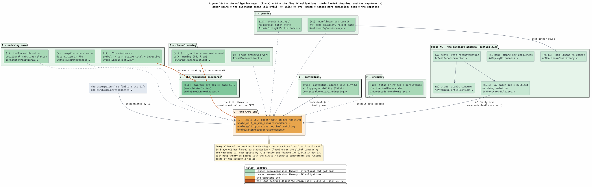

# 16 — In-Rho Matching: Verification Plan

> The end-to-end formal-verification strategy for the in-Rho set-automaton
> integration ([15](15-in-rho-set-automaton-matching.md)). **Rocq is the default
> theorem prover** (zero-admission — `Print Assumptions` = "Closed under the global
> context"; no admits, no added axioms, no free section parameters, enforced by
> `formal/scripts/check_rocq_zero_admission.py`). Wolfram 15, TLA+/Apalache, and
> mCRL2/Maude are the finite / symbolic / CLTS-bisimilarity complements — the
> executable floor under each unbounded Rocq theorem, never a substitute for it.
> This document tracks each obligation and its status.

## 1. What must be verified

Correctness is fixed at the context-labelled transition system (CLTS) of
`knotted-topoi.tex` (`prop:opcorr`). Moving matching into Rho preserves it iff the
internal `sa:`/`eq:` COMMs are unobservable ($`\tau`$) and the optimal channel
naming induces the same CLTS as the sound one — the tex's `rem:nonopt` claim,
which the in-Rho realization finally forces to be *proven* rather than inherited.

## 2. Obligations

### 2.1 Structural matching (the two set-automaton papers)

| # | Obligation | Rocq theory | Primary + complement |
|---|---|---|---|
| (i) | in-Rho match set = positional matching relation (sound + complete) | `InRhoMatchPositional.v` | Rocq (reinstantiate `PositionalSetAutomatonSound.v`'s `children_match` with the `sa:`-chain) + the `properties.rs` oracle |
| (ii) | `O1` symbol-once: symbol $`\mapsto`$ `sa:`-receive is total + injective | `SymbolOnceInjective.v` | Rocq + Wolfram inspection-count |
| (iii) | `sa:`/`eq:` are $`\tau`$ $`\Rightarrow`$ same CLTS (weak bisimulation) | `InRhoSameCLTSWeakBisim.v` | mCRL2 + Maude (finite) + Rocq `RhoCommScheduleFamily` (unbounded) |
| (iv) | atomic firing / no partial-match reachable state | `AtomicFiringNoPartialMatch.v` | TLA+/Apalache + mCRL2 + Rocq |
| (v) | whole-$`[\![ G ]\!]`$ `opcorr` with in-Rho matching (capstone) | `WholeGsltInRhoOpCorrespondence.v` | Rocq (instantiate `EndToEndCommCorrespondence.v`) |
| (vi) | non-linear `eq:` commit $`\Leftrightarrow`$ name-equality, reject-safe | `NonLinearEqConsistency.v` | Rocq + Maude/Wolfram |
| (vii) | contextual atomic join (INV-6) + plugging-stability (INV-2) | `ContextualAtomicJoinPlugging.v` | Rocq (`SameChannelJoin` $`2\to n`$) + TLA+/mCRL2 |
| (viii) | injective + coarsest-sound $`tc(K)`$ channel naming (`O3`, $`R_{op}`$) | `TcChannelNamingQuotient.v` | Wolfram quotient algebra + Rocq |
| (ix) | total-or-reject + persistence for the in-Rho encoder | `InRhoEncoderTotalOrReject.v` | Rocq (extend `RhoLoweringTotalOrRejects.v`) |
| (x) | compile-once / reuse determinism in Rho | `InRhoReuseDeterminism.v` | Rocq (extend `reuse_is_per_node_deterministic`) |
| O2 | prune-preserves-work | `PrunePreservesWork.v` | Rocq + mCRL2 |

### 2.2 AC matching (beyond the papers — reuse the proven multiset/bipartite algebra)

| # | Obligation | Rocq theory (proven, zero-admission) | Reuses (as built) |
|---|---|---|---|
| (AC-rest) | `rest` reconstruction = host `instantiate` AcApp flatten | `AcRestReconstruction.v` — 4 thm | self-contained (Stdlib `Permutation`) |
| (AC-atom) | atomic consume: commit removes exactly the selection, veto/missing untouched, no partial removal | `AcAtomicNoPartialConsume.v` — 5 thm | `AcRestReconstruction.v` (the removal dual of `AtomicFiringNoPartialMatch.v`) |
| (AC-map) | MapAc key-uniqueness preserved across the split | `AcMapKeyUniqueness.v` — 3 thm | self-contained (Stdlib `NoDup`) |
| (AC-nl) | non-linear AC commit $`\Leftrightarrow`$ name-equality, reject-safe | `AcNonLinearConsistency.v` — 4 thm | `NonLinearEqConsistency.v` (vi) $`\circ`$ the AC selection's slot-gather |
| (AC-i) | in-Rho AC match set = AC matching relation over multisets (sound + complete) | `InRhoAcMatchMultiset.v` — 4 thm | `AcRestReconstruction.v` (`sub_multiset` / `complement` / `selection_rest_partition`) + Stdlib `Permutation` |

**Status — all five proven zero-admission** (20 theorems, `Print Assumptions` =
"Closed under the global context"). The design's proposed reuses
(`DeltaOneMinCostMatching`, `MultisetSemiringLaws`, `AmbiguitySetPreservation`) were
superseded by one smaller self-contained multiset core, `AcRestReconstruction.v`, on
which AC-atom and AC-i build. AC-i proves the match correspondence `sub_multiset S B`
holds iff some `rest` gives `Permutation (S ++ rest) B` — order-independence is
inherent in the `Permutation` witness (soundness = the faithful `complement`,
completeness = every partition is a reachable match). Each theory is paired with a
runtime test exercising the AC match/fire on the live reducer:
`ac_bag_pattern_matches_the_process_soup_in_rho` (order-independent match),
`ac_receiver_fires_the_matched_element_on_the_dynamic_out` (the σ-receiver firing),
and `ac_contract_call_fires_the_ac_receiver` (the codegen injection fires the
codegen receiver).

**AC economy:** because the AC match is ONE atomic `consume` (the pick is internal
to a single COMM), AC contributes zero new $`\tau`$ steps — it needs NO (iii)-style
weak-bisimulation, and the capstone (v) gains one rule-family arm.

## 3. The load-bearing discharge: `rem:nonopt`

The tex *asserts* that the sound (location-channel) and optimal
(set-automaton-state) schemes induce the same CLTS; the in-Rho realization forces
a proof. The chain is:

```math
\text{(ii) } O1\text{-totality} \;+\; \text{(viii) } tc\text{-injectivity} / R_{op} \;\Longrightarrow\; \text{(iii) weak bisimulation} \;\Longrightarrow\; \text{(v) whole-}[\![ G ]\!]\text{ opcorr}
```

(ii) gives $`R_{\mathrm{forward}}`$ (every sound firing has a complete `sa:` chain);
(viii) gives $`R_{\mathrm{backward}}`$ (distinct $`\sim_{op}`$ contexts get distinct
channels, so no cross-talk; the $`R_{dep}`$ relation is excluded by a proven
counterexample). (iii) extends `RhoCommScheduleFamily.v`'s `erase_rho` with
`SaInspect`/`EqCheck` constructors whose observation is $`\tau`$, then builds the
weak bisimulation on `RegisterEquivalence.v`'s `is_bisimulation`; (v) instantiates
the assumption-free abstract lift `EndToEndCommCorrespondence.v` and case-splits by
rule family.



*Figure 16-1. The plan's obligation map. Every obligation of §2.1 and §2.2 is
discharged by its named landed theory (green — all zero-admission); the amber
spine is the §3 discharge chain (ii)+(viii) $`\Rightarrow`$ (iii)
$`\Rightarrow`$ (v); solid arrows land family arms consumed by the capstone's
rule-family case split, dashed arrows are per-slice support in the §4 authoring
order; and the capstone (v) (gold) instantiates the assumption-free finite-trace
lift `EndToEndCommCorrespondence.v`. Source:
[figures/16-obligation-map.puml](figures/16-obligation-map.puml).*

## 4. Authoring order (each proof lands with its implementation slice)

`A` (ii $`\to`$ i $`\to`$ x, matching core) $`\to`$ `B` (viii $`\to`$ O2, channel
naming) $`\to`$ `C` (iii, the `rem:nonopt` discharge) $`\to`$ `D` (iv, vi) $`\to`$
`E` (vii) $`\to`$ `F` (ix) $`\to`$ `G` capstone (v); the AC obligations land with
Stage AC. Every slice in this order has since landed zero-admission, and the
capstone (v) has flipped INV-2/6/13 in
[13](13-knotted-topoi-operational-invariants.md) to Satisfied.

## 5. Status

| Slice | Implementation | Verification |
|---|---|---|
| M0 spread | done | INV-10 round-trip property (example + proptest); the $`\nu`$-free assertion is the INV-7 executable form |
| M1 matching | done (base case) | **Phase A proven zero-admission** — `SymbolOnceInjective` (ii), `InRhoMatchPositional` (i), `InRhoReuseDeterminism` (x), 13 theorems "Closed under the global context". These prove the fold-level accept decision; the emitted `Par`'s faithfulness to the fold is witnessed by the runtime tests (`m1_matches_swap_in_rho_and_fires_the_rewrite`, the arity-3 companion, the no-false-positive negative case, and the property-based positional oracle over random constructors/arities), which the RSpace reducer checks |
| M2a multi-pattern | done | `multi_pattern_receiver_network_par` — the root-shared `Match` router (one case per distinct op) + O3 accept fan-out (structural + runtime tests: dispatch discrimination and same-op double-fire on the RSpace reducer). **FV Phase B proven zero-admission** — `TcChannelNamingQuotient` (viii, `tc(K)` is the `O1`/`O3` `R_op` quotient) + `PrunePreservesWork` (O2), 9 theorems |
| M3 $`\tau`$ internalization | done | **FV Phase C (iii) proven zero-admission** — `InRhoSameCLTSWeakBisim` (`optimal_visible_equals_sound`, `same_clts_weak_bisim`, the non-vacuity witness): the `sa:`/`eq:` steps erase to $`\tau`$, and the sound (location-channel) and optimal (StateId-trace) schemes are weakly bisimilar (same CLTS). The bisimulation's chain-totality is discharged by `positions_count` (ii) and its no-cross-talk by `tc_sound` (viii); the sound side uses the location-injectivity Hypothesis. This discharges the `rem:nonopt` claim (schedule/CLTS level; RSpace-faithfulness stays with the runtime tests + (i), whole-$`[\![ G ]\!]`$ opcorr with (v)) |
| M2b channel re-key | subsumed | RESOLVED (Stage 3 design): the base-rewrite accept-channel re-key to `sa:⌜StateId⌝` is INERT — for a base rewrite $`tc(K)`$ collapses to the root `StateId`, inducing the SAME channel partition as `pattern_identity`; the genuine `O1`/`O3` sharing is compile-time `StateId` interning (already in `SetAutomatonView`) + per-site `loc:` channels. Accept-channel coherence is achieved by sourcing it from `rho_net_injection_sites` (piece 2), so no runtime re-key is performed. FV viii's $`tc`$ re-key applies to Stage 3a contextual joins, not the base accept channel |
| Stage 3 P1 converter | done | `convert_lhs_pattern` (`rho_net_ruleset.rs`) — TOTAL `mettail_ast::Pattern` → `dovetail::rules::Pattern` (Var/Apply → structural; constructor-over-collection → `AcApp`; binder/subst/search → typed reject); 6 example tests |
| Stage 3 P2 ruleset compile | done | `compile_in_rho_matching_ruleset(def)` → `InRhoMatchingRuleset` (automaton + `accept_channels` sourced from `rho_net_injection_sites` [the triad anchor] + fingerprint + a reasoned per-rule skip-list), TOTAL partition + AC-retry; `stage3_swapdemo_ruleset_compiles_the_base_rewrite_coherently` |
| Stage 3 P3 match + fire | done | `in_rho_match_call_par` = the M2a network `‖` the subject spread (per-firing call, single-shot for `O1`); `stage3_swapdemo_matches_and_fires_from_the_derived_ruleset` — SwapDemo's `LanguageDef` matches `Swap(A,B)` IN RHO + fires → `Pair(B,A)`, the whole chain from the DERIVED ruleset (15/15 tests) |
| Stage 3 P6 FV (ix) | done | **`InRhoEncoderTotalOrReject.v` proven zero-admission** — the encoder is total/sound/disjoint/count, the capability gate admits iff every FIRED rule is matchable (`gate_admits_iff_all_fired_matchable`), and the transient (network `‖` spread) call preserves the persistent σ-receiver count; 4 `Print Assumptions` "Closed under the global context" |
| Stage 3 P5 default-wire | done | the generated `rho_net_match_invocation_from_dovetail_to` (macro) + `swapdemo_backed()` (capability-gated in-Rho match, fail-closed to the σ-replay fallback) + registered default backend + `stage3_swapdemo_default_backend_matches_in_rho_via_run_backend_report` (the whole production stack via `run_backend_report(RhoMachine, Swap(A,B))` → `Pair(B,A)`). **Stage 3 complete: base-rewrite matching runs ON the interpreter as SwapDemo's default backend, `O1`-optimal + FV-verified (Phases A/B/C + ix)** |
| Stage 2 `eq:` codegen | done | `multi_pattern_receiver_network_par` serializes non-linear patterns — a repeated variable emits a polyadic `eq:` JOIN over the children with a `Receive.condition` consistency guard (`EAnd`-fold of `EEq(BoundVar(arity-1-q0), BoundVar(arity-1-qj))`), the `[optimal]` Def 4.9 enable-gate; the accept sends `k`=distinct-var slots (the triad fix). Linear frame byte-identical; 3 structural tests |
| Stage 2 `eq:` runtime | done | `f(x,x)` matches `f(A,A)` in Rho (guard holds, `σ=[A]`) and does NOT match `f(A,B)` (the reducer's `check_commit` VETOES reject-safely, the `merge_substs` $`\to`$ `None` analogue) — validated on the live RSpace reducer |
| Stage 2 FV (iv)+(vi) | done | **proven zero-admission** — `AtomicFiringNoPartialMatch` (iv: the guarded join is all-or-nothing, no partial consume; accept atomic after the verdict) + `NonLinearEqConsistency` (vi: commit $`\Leftrightarrow`$ all-k name-equal, reject-safe, oracle-agreement with `merge_substs`), both INSTANCES of `GuardedCommSoundness`; 7 `Print Assumptions` "Closed under the global context" |
| Stage AC match + fire | done | the HashBag AC receiver runs ON the interpreter — a bag reflects to a process-`Par` soup (`reflect_ground_term_par`; corrected from `EList`, whose `fold_match` is positional), the connective `ac_bag_pattern` matches it ORDER-INDEPENDENTLY (native `sub_pars` / `MaximumBipartiteMatch`), and `ac_sigma_receiver_par` fires $`[\![ R ]\!] \sigma`$ on the dynamic out. Runtime tests `ac_bag_pattern_matches_the_process_soup_in_rho` + `ac_receiver_fires_the_matched_element_on_the_dynamic_out` on the live reducer |
| Stage AC un-skip | done | a linear with-rest HashBag AC base rewrite un-skips to `RhoNetLoweredRule::AcRewrite` in `lower_base_rewrite` (materialized + installed like a base rewrite, on the rule's own trace channel — accept-triad coherence). `resolve_ac_collection_type` reads `op`'s declared HashBag kind from `def.terms`, so PARSER-produced rules (`coll_type: None`) un-skip; `ac_contract_call` builds the injection `channel!(⟦bag⟧, @out)`. Tests `parser_none_hashbag_rule_un_skips_via_resolution` + `ac_contract_call_fires_the_ac_receiver` (both receiver and injection from codegen) |
| Stage AC FV | done | **the five AC theories proven zero-admission** (§2.2; 20 theorems "Closed under the global context") — AC-rest / AC-atom / AC-map / AC-nl / AC-i, each paired with a runtime match/fire test |
| Stage 3a contextual join (vii) | done | **FV (vii) proven zero-admission** — `ContextualAtomicJoinPlugging` (T8): the n-ary contextual premise fires as ONE atomic polyadic join COMM and its holes are reassembled IN RHO (not read back from the report), discharging INV-6 (atomic join) + INV-2 (plugging-stability). Runtime: `ctxdemo_contextual_rewrite_fires_as_a_join_comm_on_the_reducer`, `s_contextual_holes_reassembled_in_rho_not_the_report` |
| Stage AC-structural / Ambient In/Out (nested) | done | **proven zero-admission** — `AmbientInOutFiring` (T12): a depth-2 nested structural-AC In/Out rewrite MATCHES in Rho via the spread and fires; the Ambient OpenRule arm is `AmbientOpenFiring` (T11). Runtime: `inoutdemo_in_matches_in_rho_via_the_spread`, `inoutdemo_out_matches_in_rho_via_the_spread`, `s_ac_nested_in_bag_is_produced_by_the_spread_not_the_report` |
| Stage native system-process | done | **proven zero-admission** — `NativeSystemProcessBoundary` (T13): a native system-process rewrite fires as a COMM, its location produced by the automaton not the report. Runtime: `nativedemo_native_system_process_fires_as_a_comm_on_the_reducer`, `s_native_location_is_produced_by_the_automaton_not_the_report` |
| Stage 3c binder-$`\beta`$ | done | **proven zero-admission** — the $`\beta`$-redex MATCHES and REDUCES fully in Rho as a metered de-Bruijn substitution TRS COMM cascade: `DeBruijnSubstTRS` (T16–T18 — strong normalization + confluence + unique normal form $`= b[a/0]`$) + `InRhoBetaCascadeWeakBisim` (T19 — the object cascade is weakly bisimilar to abstract $`\beta`$, non-vacuous) + `BinderReflectionTotalOrReject` (T20). Runtime: `lambdademo_beta_reduction_fires_as_a_comm_on_the_reducer`, `lambdademo_beta_case2_nested_binder_depth_increment_fires_in_rho`, `lambdademo_beta_case3_object_descent_two_sibling_substs_coreduce_in_rho` |
| Stage 5 CAPSTONE (v) | done | **FV (v) proven zero-admission** — `WholeGsltInRhoOpCorrespondence`: `whole_gslt_in_rho_opcorrespondence` (the whole-$`[\![ G ]\!]`$ operational correspondence over finite execution, INV-13 / `ob:opcorr`) threaded over `O1`-optimal in-Rho matching by `whole_gslt_opcorr_over_optimal_matching` (the `rem:nonopt` discharge — sound $`\equiv`$ optimal at the CLTS). Case-splits by rule family; every arm (base / non-linear / AC-linear / AC-structural [Ambient OpenRule] / AC-nested In/Out / contextual / binder-$`\beta`$ / native) is discharged. Flips INV-2/6/13 in [13](13-knotted-topoi-operational-invariants.md) |

The Rust example / property / integration tests are the executable floor; the Rocq
theorems above are the unbounded ceiling, authored one slice at a time under the
zero-admission gate.
