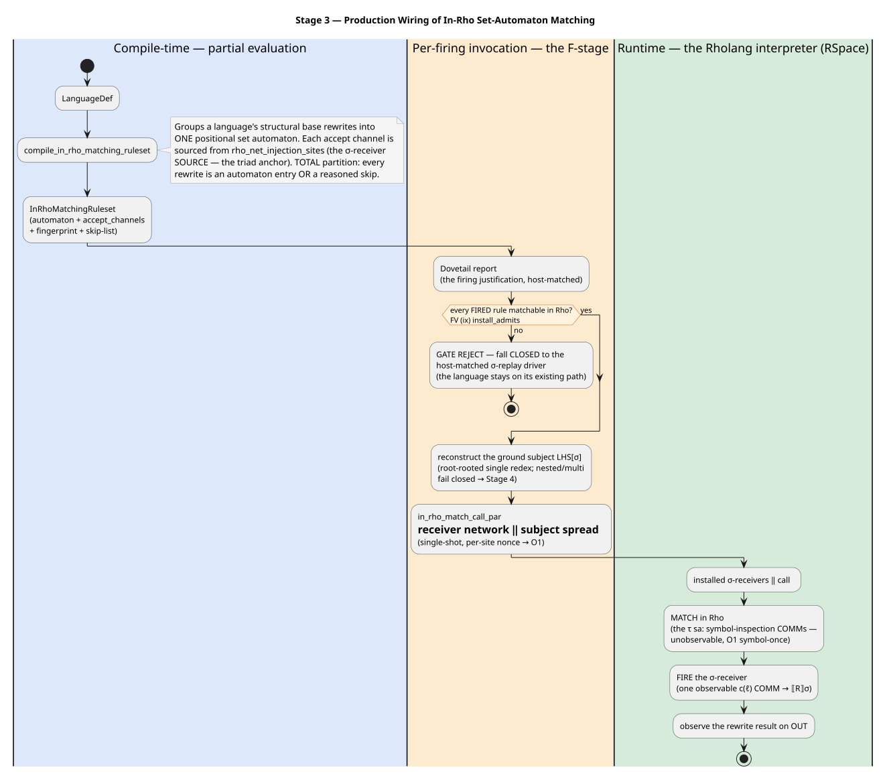

# 17 — Stage 3: Production Wiring of In-Rho Set-Automaton Matching

> **Status: landed.** Stage 3 made in-Rho matching the **actual default backend** a language runs — first for base rewrites (SwapDemo). Stage 1 (docs [15](15-in-rho-set-automaton-matching.md)/[16](16-in-rho-verification-plan.md)) built the in-Rho matching *mechanism*; Stage 3 wires it as production. Base-rewrite matching executes ON the Rholang interpreter — the internal `sa:` inspection COMMs are unobservable $`\tau`$ steps and the rewrite fires as one `c(\ell)` COMM — via the production `run_backend_report(RhoMachine, …)` path, `O1`-optimal and formally verified (FV Phases A/B/C + (ix), all zero-admission). The remaining families — non-linear, AC, contextual join, binder-$`\beta`$, native, and whole-term — have since landed the same way; see [18](18-in-rho-ac-matching.md)/[19](19-in-rho-binder-beta-substitution.md)/[25](25-in-rho-base-family-reference.md)/[26](26-in-rho-ac-family-reference.md) and the proofs in [22](22-end-to-end-formal-verification.md).

## 0. What Stage 3 removes

The passing Stage 1 test `stage3_swapdemo_matches_and_fires_from_the_derived_ruleset` already ran the whole chain on the live f1r3node reducer. Stage 3 removes its three hard-codings — the hand-built `dovetail::rules::Pattern`, the hand-picked accept channel, and the hand-spread subject — and drives them from a `LanguageDef` behind a capability gate. It is **not new matching machinery**; it is the wiring that makes the mechanism the default.

## 1. The pipeline

The Stage 3 flow, from a language's definition to a fired rewrite observed on `OUT`:



The one invariant that governs every piece is the **accept triad**: for each base rewrite, three independently-derived channels must be byte-equal — the **σ-receiver source** (the installed contract's input channel), the **injection site** (`rho_net_injection_sites`), and the **M2a accept channel** — and all three flow from a single source, `pattern_trace_channel(LHS)`. Wherever a piece re-derives a channel instead of threading the shared one, coherence breaks; Stage 3 sources every accept channel from `rho_net_injection_sites` so the triad holds by construction.

## 2. Piece 1 — the `mettail_ast` → `dovetail` converter

`convert_lhs_pattern` (`rholang-codegen/src/rho_net_ruleset.rs`) maps a structural LHS pattern to the dovetail set-automaton input. It is **total** over `mettail_ast::Pattern` — every node either converts or returns a typed `PatternConvertReject` (no panics), the executable half of FV (ix)'s total-or-reject:

| `mettail_ast` node | → `dovetail::rules::Pattern<String>` | Rationale |
|---|---|---|
| `Term(Var(id))` | `Pattern::var(id)` | structural leaf |
| `Term(Apply{c, args})` | `Pattern::app(c, args.map(convert))` | structural application (recursion propagates rejects) |
| `Term(Apply{c, [Collection{…}]})` | `Pattern::ac(c, …)` | AC — a valid pattern that `compile_structural` rejects → the AC path (Stage AC) |
| `Term(Lambda \| MultiLambda)` | `Err(Binder)` | no positional image → Stage 3c |
| `Term(Subst \| MultiSubst)` | `Err(Subst)` | host-computed ground σ slot → Stage 3c |
| `Map \| Zip \| bare Collection` | `Err(CollectionSearch)` | collection-search metasyntax → Stage AC / off-machine |

The converter agrees with the existing `lower_lhs_vars` σ-receiver LHS-var classifier on "structural", so a rule can never be admitted by one path and rejected by the other.

## 3. Piece 2 — compile a language's base rewrites into one automaton

`compile_in_rho_matching_ruleset(def) -> InRhoMatchingRuleset` groups a language's structural base rewrites into ONE positional set automaton:

```rust
pub struct InRhoMatchingRuleset {
    pub automaton: SetAutomaton<String>,
    pub accept_channels: Vec<(PatternId, String)>, // PatternId → σ-receiver SOURCE (the triad anchor)
    pub language_fingerprint: String,
    // + a reasoned per-rule skip-list of the rewrites NOT matched in Rho
}
```

A rewrite becomes an automaton entry **iff** it has a base-rewrite σ-receiver site (so it lowered to a `BaseRewrite` — congruence / unsafe-premise / AC / binder rules have none → `NotBaseRewrite`) **and** its LHS converts (`Convert`) **and** it compiles AC-free (an `AcApp` is moved to `Ac` via a `compile_structural` retry). The partition is TOTAL: every rewrite is either an entry or in the skip-list with its reason — nothing dropped. The accept channel is sourced from `rho_net_injection_sites`, so it is the SAME channel the installed σ-receiver was compiled with (the triad anchor).

## 4. Piece 3 — match + fire from the derived ruleset

`in_rho_match_call_par(ruleset, subject, site, out)` builds the per-firing call — the M2a receiver network composed with the subject spread:

$`\text{call} = \text{multi\_pattern\_receiver\_network\_par}(\text{automaton}, \text{site}, \text{accept\_targets}) \;\|\; \text{spread\_term\_par}(\text{subject}, \text{site})`$

The network is **single-shot** (`O1` symbol-once requires it — the spread publishes each head tag exactly once), so it rides the per-firing call, not the persistent install; a fresh `site` nonce per firing keeps redex sites disjoint. Every channel and tag flows from `ruleset` (one fingerprint, the σ-receiver-source accept channels), so the triad holds by construction. The load-bearing test drives SwapDemo's `LanguageDef` end-to-end: `Swap(A,B)` is matched IN RHO (the host does not inject σ) and fires the SwapStep σ-receiver → `Pair(B,A)`.

## 5. Piece 4 — M2b is subsumed (the accept-channel re-key is inert)

The plan's M2b (re-key the accept channel to `sa:⌜StateId⌝`) is **inert** for a base rewrite: $`tc(K)`$ collapses to the root `StateId`, which induces the SAME channel partition as the current `pattern_identity`. The genuine `O1`/`O3` sharing is **compile-time `StateId` interning** (already in `SetAutomatonView`) plus **per-site `loc:` channels** (already single-shot). The accept-channel coherence M2b sought is achieved by sourcing it from `rho_net_injection_sites` (piece 2), so there is no runtime re-key to perform; FV (viii)'s $`tc`$ re-key applies to Stage 3a *contextual* joins, not the base accept channel.

## 6. Piece 5 — the capability-gated default-wire

The generated method `rho_net_match_invocation_from_dovetail_to` (emitted by the macro alongside the σ-injection F-function) is the production entry point. Its body:

1. `report.assert_complete()`.
2. Reconstruct the def via `reconstruct_language_def` (one def, one fingerprint — coherent with the installed σ-receivers, no separate metadata read).
3. `compile_in_rho_matching_ruleset`.
4. **Capability gate** (FV (ix) `install_admits`, via `in_rho_match_gate_reject`): fail closed BEFORE any Rho reduction if any FIRED rule is in the skip-list.
5. Single-root-redex scope guard.
6. Rebuild the ground subject `LHS[σ]` (`reconstruct_redex_subject`).
7. `in_rho_match_call_par` → `RhoNetInjectionInvocation` (the same driver target as the σ path — no new variant).

**The subject-provenance boundary (an honest constraint).** The input `term` is `&dyn Term`, and there is **no** `Term → GroundTerm` structural reflection, so the subject is the fired redex `LHS[σ]`, reconstructed from the firing's σ. This is legitimately "match in Rho" — the automaton still does the matching work on the interpreter (the $`\tau`$ `sa:` COMMs re-bind σ′ from the ground subject) — but it reconstructs only the *root-rooted single redex*; nested/multi-redex terms were fail-closed at the Stage 3 boundary and are handled by Stage 4 (whole-term spreading / `Term` reflection), which has since landed.

The repl's `swapdemo_backed()` installs this as SwapDemo's default backend, **falling closed** to the proven Stage-0 host-matched σ-replay driver on a gate/scope rejection ("the language stays on its existing path"), so every input stays correct. The integration test drives the whole production stack through `run_backend_report(RhoMachine, Swap(A,B))` → `Pair(B,A)`.

## 7. Piece 6 — FV (ix): the encoder is total-or-reject + persistence-preserving

`InRhoEncoderTotalOrReject.v` (zero-admission) proves the rule-classification layer: the encoder's partition is total / sound / disjoint / exact (`encoder_count`); the capability gate admits in-Rho matching **iff** every fired rule is matchable (`gate_admits_iff_all_fired_matchable`, the model of `in_rho_match_gate_reject`); and the per-firing `network ‖ spread` call is transient, so appending it preserves the installed σ-receivers' persistent-input count (`appending_the_call_preserves_persistent_inputs` — why the network rides the call, not the persistent install). It does NOT re-prove matching correctness (that is (i)/(ii)/(iii), Phases A–C) — it proves the WIRING is fail-closed.

## 8. What runs where (all families landed)

At the Stage 3 endpoint for a base rewrite: **matching = $`\tau`$ `sa:` COMMs on the interpreter; firing = one observable `c(\ell)` COMM on the interpreter.** The host Dovetail engine survives only as the compile-time partial-evaluator (it emits the automaton + names the channels) and the report's σ-source for subject reconstruction; it does no runtime structural matching for a flipped base rewrite.

**Every downstream stage has since landed the same way**, so the split above holds for every rewrite family, not just base rewrites: **2** (non-linear `eq:` receivers), **AC** (in-Rho AC matching — [18](18-in-rho-ac-matching.md), [26](26-in-rho-ac-family-reference.md)), **3a** (contextual atomic joins, FV (vii)/(viii)), **3b–3f** (Rholang `Comm` / Lambda $`\beta`$ / Ambient / native — [19](19-in-rho-binder-beta-substitution.md)), **4** (encoder boundary + whole-term spreading + `Term` reflection, with adaptive `L` subsumed by the interned-DAG quotient), and **5** (the capstone (v) — whole-$`[\![ G ]\!]`$ `opcorr`, `WholeGsltInRhoOpCorrespondence.v`). Each family both MATCHES and FIRES on the interpreter; the consolidated present-tense references are [25](25-in-rho-base-family-reference.md) (base) and [26](26-in-rho-ac-family-reference.md) (AC), with every arm proven zero-admission in [22](22-end-to-end-formal-verification.md). The host report is now a fail-closed fallback only — there is no dual runtime matching path.
