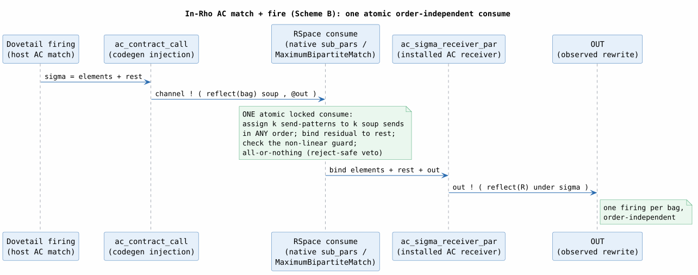

# 18 — In-Rho AC (Associative–Commutative) Matching

> **Campaign.** The two set-automaton papers cover STRUCTURAL matching only; the
> associative-commutative operands of the source languages (Rholang's parallel
> composition, Ambient congruence, HashBag/HashSet/HashMap collections) are Greg
> Meredith's extension — matched ORDER-INDEPENDENTLY, ON the Rholang interpreter,
> inside ONE atomic `RSpace` `consume`. This document records the verified in-Rho
> AC match + fire mechanism (Stage AC). It complements the structural architecture
> ([15](15-in-rho-set-automaton-matching.md)) and its verification plan
> ([16](16-in-rho-verification-plan.md) §2.2). Approved plan: `floofy-rolling-shore`
> (§DM-AC).

## 1. The execution model (Scheme B)

A HashBag AC rewrite `op{L_1, …, L_k, ...rest} ~> R` fires when the subject bag
contains, in ANY order, a sub-multiset matching the `k` fixed element patterns; the
residual multiset binds `rest`. The correctness constraint from `knotted-topoi.tex`
is the same as the base case — one atomic COMM rendezvous emitting
$`[\![ R ]\!] \sigma`$ — with the extra requirement that the match is
INVARIANT under the bag's shuffle order and cannot PARTIALLY fire (bind only some of
the `k` elements and leave the residual unbound).

**Scheme B** meets both by reflecting the whole operand bag as ONE process-`Par`
"soup" value and matching it with ONE connective receive. f1r3node's spatial matcher
does par-bag AC natively — `sub_pars` (selection / complement enumeration) plus
`MaximumBipartiteMatch` (element $`\leftrightarrow`$ pattern assignment) plus the
`remainder` binding — so the entire AC decision (pick-`k`, bind `rest`, check the
non-linear guard) resolves INSIDE the single locked `consume` (`check_commit`,
all-or-nothing, reject-safe). No reserve/commit protocol, no partial-fire hazard.

**The load-bearing correction.** The operand bag is a process-`Par` soup, NOT an
`EList`. `EList`'s `fold_match` is POSITIONAL (`Vec` semantics — element `i` matches
pattern `i`); only the connective / `sub_pars` path over a process-`Par` (or an
`ESet`/`EMap` carrier) matches ORDER-INDEPENDENTLY and binds a par-level remainder.
Matching a bag against a positional `EList` pattern would silently impose an order.

## 2. The carrier — `reflect_ground_term_par`

A HashBag `GroundTerm` (tagged by `coll_type`) reflects to the soup: each element
`e` becomes a send `@"ac:{op}"!(⟦e⟧)` on the operand's shared element channel, and
the bag is their PARALLEL composition. Order-independence is inherited from `par`
(a multiset of processes):

```math
[\![ \mathtt{op}\{e_1, \dots, e_m\} ]\!] \;=\; \Big\Vert_{i=1}^{m} \; \mathtt{@"ac:}\mathtt{op"}!\bigl([\![ e_i ]\!]\bigr)
```

The element channel is `ac:{fingerprint}/{op}`, derived by `ac_soup_channel`
(`rholang-codegen/src/rho_net_lower.rs`) — both the carrier and the pattern go through
that one helper, so they cannot disagree.

> **★ INV-S6 (2026-07-25) — this paragraph previously read "it needs no fingerprint".**
> The reason given was that the bare `ac:{op}` name is scoped INSIDE the carried message
> and is never free in the tuplespace. The premise is true — a bag soup is a `Par` *value*,
> matched structurally by `ac_bag_pattern` inside one `consume`, not a live rendezvous
> name — but the conclusion did not follow. A structural name is still a **discriminator**,
> and an unscoped one discriminates only by operator label. Two co-installed languages that
> each declare an AC constructor named `PPar` therefore produced *structurally
> indistinguishable* bags, so either language's `ac_bag_pattern("PPar", k)` would bind the
> other's elements wherever a value crossed between them. `PPar` is the actual name used in
> `rholang` and in every AC/Ambient demo, so two co-installed process calculi collided here
> **by default** — no attacker required. See
> [25 §2.1](25-in-rho-base-family-reference.md#21-inv-s6-the-channel-name-fingerprint-invariant)
> for the invariant and the scoping ABI.
>
> The site-keyed sibling `ac_carrier_channel(loc_channel, op)` — which *is* a live
> tuplespace channel — takes no fingerprint argument, because it already inherits one from
> the `loc:` path it is keyed on.

## 3. The connective pattern — `ac_bag_pattern`

`ac_bag_pattern(op, k)` builds the AC receiver's matching side: a connective
process-`Par` with `k` send-patterns `@"ac:{op}"!(FreeVar(i))` (each binding one
element slot $`\sigma_i`$) plus a process remainder `EVar(FreeVar(k))` (binding
`rest`). The remainder is exactly the `var_level` the spatial matcher reads
(`new_freevar_par(k)`'s top-level `EVar` in `exprs`).

| Piece | Rho shape | Binds |
|---|---|---|
| element slot `i` ($`i < k`$) | `@"ac:{op}"!(FreeVar(i))` send-pattern | one bag element, $`\sigma_i`$ |
| `rest` | top-level `EVar(FreeVar(k))` | the residual soup (par remainder) |

The native `MaximumBipartiteMatch` assigns the `k` send-patterns to `k` carrier sends
in ANY order and binds the residual to the remainder — the order-independent multiset
match, all inside one `consume`.

## 4. The receiver and firing — `ac_sigma_receiver_par`

`ac_sigma_receiver_par(op, k, rhs, source)` wraps the pattern in the σ-receiver
shape `for( <ac_bag_pattern(op,k)> , out <- source ){ out!(rhs) }`. The bind has
`k+2` free variables (the `k` elements, `rest`, and `out`), so under the reverse
De Bruijn frame `out = BoundVar(0)`, `rest = BoundVar(1)`, and element `i` is
`BoundVar(k+2-i)`. The RHS $`[\![ R ]\!] \sigma`$ reuses the flat
`reflect_term_par` at `k+1` over the `[x_1..x_k, rest]` σ order — that shift yields
exactly this frame, so NO new reflection machinery is needed. Verified end to end by
`ac_receiver_fires_the_matched_element_on_the_dynamic_out`.

## 5. The un-skip — `AcRewrite`

A HashBag AC LHS has no flat σ-receiver: `lower_lhs_vars` rejects any collection with
`CollectionAc`. A LINEAR WITH-REST HashBag rule instead un-skips, in
`lower_base_rewrite`, to a new lowered-rule variant `RhoNetLoweredRule::AcRewrite`
carrying the receiver `Par` — MATERIALIZED and INSTALLED exactly like a `BaseRewrite`
(so it rides the same `installed_program_par` `‖` `call` seam), on the rule's OWN
trace channel. Nested / non-linear / no-rest AC rules and Set/Map keep failing closed.

The parser leaves a rewrite-LHS collection's `coll_type` as `None` ("inferred from
the enclosing constructor's grammar"), so `resolve_ac_collection_type(def, left)`
reads the kind from the constructor's declared collection parameter in `def.terms`
(the `GrammarRule.term_context`'s `TypeExpr::Collection`). Thus REAL parsed AC rules
un-skip — the effective kind is the pattern's `coll_type` when set, else the resolved
kind, and only a HashBag lowers this slice. Proven by
`parser_none_hashbag_rule_un_skips_via_resolution`.

**Accept-triad coherence.** The AC receiver's `source` channel, the AC injection's
target channel, and the rule's trace channel are ONE channel, derived symmetrically on
both sides from `input_channels.first()` — the same discipline the flat base-rewrite
path uses.

## 6. The injection — `ac_contract_call`

`ac_contract_call(channel, whole_bag, fp, out)` builds `channel!(⟦whole_bag⟧, @out)`
— the process-soup carrier plus the quoted out name, the exact two-value message the
receiver consumes. When driven from a Dovetail firing, the whole bag reconstructs as
the matched element sub-terms followed by the CHILDREN of the `rest` sub-term (the
residual bag node). `ac_contract_call_fires_the_ac_receiver` fires `PPar{A,B}` to
`OUT` with BOTH the receiver and the injection produced by codegen.

## 7. Verification

The five AC obligations are proven zero-admission (`Print Assumptions` = "Closed
under the global context"); see [16](16-in-rho-verification-plan.md) §2.2 for the
theory table.

| Obligation | What it fixes | Theory |
|---|---|---|
| AC-i | the native match set EQUALS the multiset matching relation (`sub_multiset S B` iff some `rest` gives `Permutation (S ++ rest) B`) — sound + complete, order-independent | `InRhoAcMatchMultiset.v` |
| AC-rest | the `rest` binding = `bag ⊖ selection` (the partition) + the flatten byte-identity | `AcRestReconstruction.v` |
| AC-atom | the consume is all-or-nothing: commit removes exactly the selection, veto/missing leaves the bag untouched, no partial removal reachable | `AcAtomicNoPartialConsume.v` |
| AC-nl | non-linear AC consistency = the Stage-2 `eq:` guard composed with the selection's slot-gather | `AcNonLinearConsistency.v` |
| AC-map | MapAc key-uniqueness preserved across the split | `AcMapKeyUniqueness.v` |

**AC economy.** Because the whole match is ONE atomic `consume`, the AC path adds
ZERO new $`\tau`$ steps to the CLTS — its matching-locus independence is immediate, so
(unlike the structural `sa:` chain) it needs NO `(iii)`-style weak-bisimulation. The
capstone opcorr gains one rule-family arm discharged by AC-i + AC-atom + AC-rest.

## 8. The match + fire flow

Figure 18-1 traces one firing. The codegen injection carries the whole bag as a
process-soup value; the RSpace `consume` assigns the `k` send-patterns to `k` soup
sends in ANY order, binds the residual to `rest`, and checks the non-linear guard —
all in ONE atomic all-or-nothing COMM — and the receiver fires
$`[\![ R ]\!] \sigma`$ on the dynamic out.


