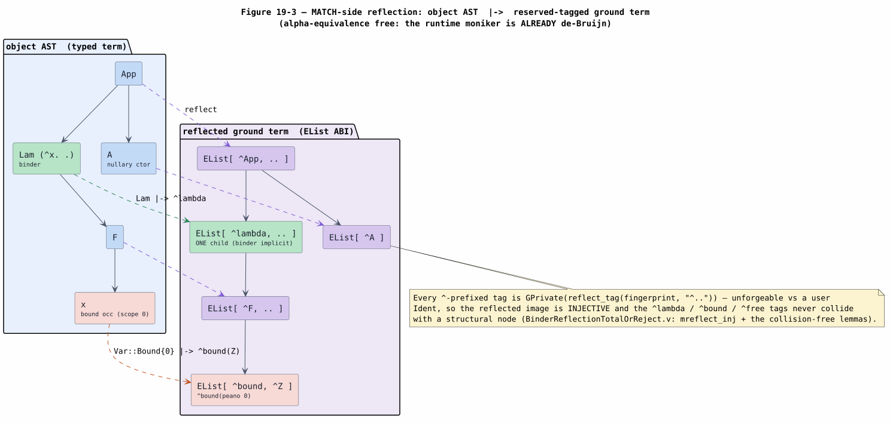
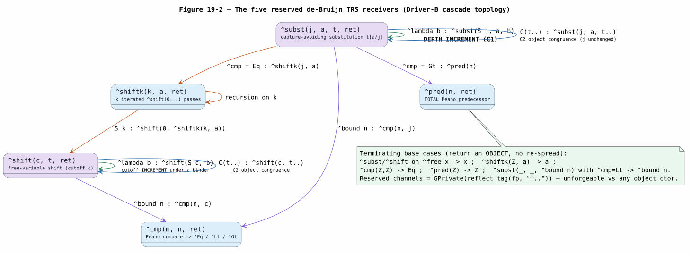
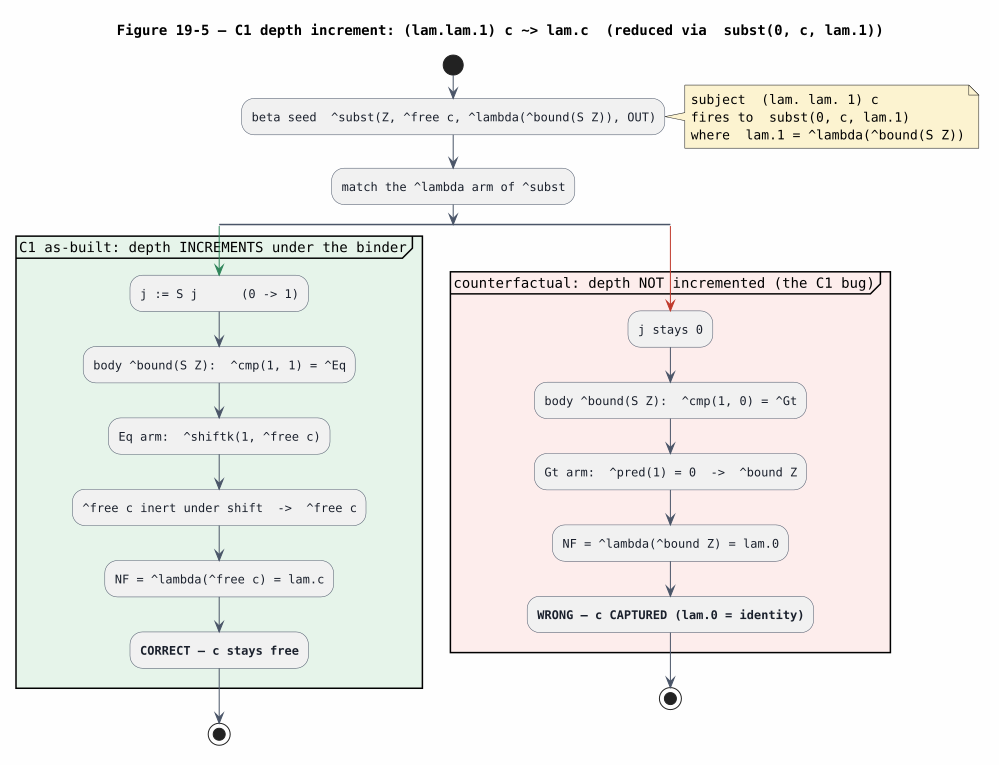
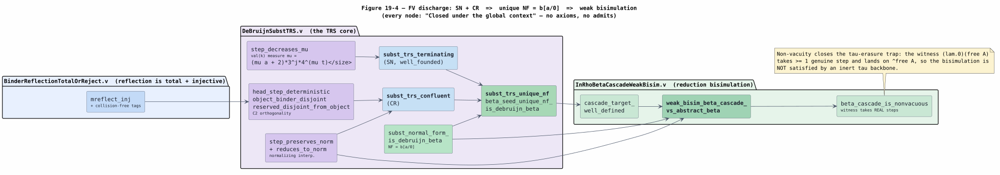

# 19 — In-Rho Binder Beta-Substitution: the de-Bruijn Substitution TRS Cascade

> **Campaign.** This is the flagship deliverable of the in-Rho set-automaton
> campaign: Greg Meredith's terminal set-automaton endpoint — $`\beta`$-reduction
> running FULLY in Rho, both the MATCH *and* the capture-avoiding SUBSTITUTION, as
> a metered cascade of COMMs on the live f1r3node reducer. The knotted-topoi paper
> ([KNOTTED-TOPOI-2026](references.md#knotted-topoi-2026)) names the
> $`\lambda`$-calculus as the graph-structured lambda theory (GSLT) whose base
> rewrite is $`\beta`$, but its base-rewrite desugaring cannot express
> $`b[a/x]`$; the paper routes $`\lambda`$ through an SKI encoding instead, leaving the
> direct realization open. This document records the mechanism that closes that
> gap, riding the in-Rho matcher already built in
> [15](15-in-rho-set-automaton-matching.md)/[17](17-stage-3-production-wiring.md)
> and the AC extension in [18](18-in-rho-ac-matching.md). Every claim is
> cross-checked against the committed code (branch `codex/rho-native-set-automata`,
> the S-binder snapshot) and the zero-admission Rocq suite. Verification strategy:
> [16](16-in-rho-verification-plan.md).

## 1. Motivation: the endpoint the north-star paper left open

The knotted-topoi program ([KNOTTED-TOPOI-2026](references.md#knotted-topoi-2026))
classifies every finitely presentable model of computation as a **GSLT** — a triple
$`(\text{grammar},\ \text{equations},\ \text{rewrites})`$ — and states (paper §, near
line 144):

> *The $`\lambda`$-calculus is the GSLT with $`\beta`$ as its base rewrite.*

The paper compiles a GSLT into core Rho by desugaring each base rewrite
$`L \Rightarrow R`$ into a guarded receiver at the channel $`c(\ell)=\ulcorner \ell \urcorner`$ that names the redex's location $`\ell`$:

```math
[\![ L \Rightarrow R ]\!](c)\ =\ \mathtt{for}\bigl([\![ L
]\!] \Leftarrow c\bigr)\bigl\{\ c\,!\,([\![ R ]\!])\ \bigr\}.
```

This schema is exactly right for a rewrite whose right-hand side $`R`$ is a
**constructor tree over the pattern variables** of $`L`$ — a communication step, a
tape move, a combinator contraction. It reflects $`[\![ R ]\!]`$ once, at
compile time, as a fixed term with holes for the matched sub-terms. But the
$`\beta`$-rule's right-hand side is not a constructor tree: it is a
**capture-avoiding substitution**

```math
(\lambda x.\,b)\ a\ \Rightarrow\ b[a/x],
```

and $`b[a/x]`$ is a *computation on the term* $`b`$, not a fixed tree over $`b`$ and $`a`$.
The desugaring `for(⟦L⟧ ⇐ c){ c!(⟦R⟧) }` has no way to express it: there is no
finite constructor tree, uniform in $`b`$, that equals $`b[a/x]`$. The paper
acknowledges this in Obligation "Functoriality on the encoded regime" (paper §, near
line 626), which realizes $`\lambda`$ only through *structural context* — the
$`\lambda`$-into-SKI encoding — rather than by animating $`\beta`$ directly. Completing
the direct set-automaton realization was earmarked as the endpoint of the design and
was left open at the time of writing; it always presupposed a working in-Rho matcher,
which the earlier stages of this campaign supply.

**What this document delivers.** The in-Rho de-Bruijn substitution
term-rewriting system (TRS) fills that gap directly. It compiles $`b[a/x]`$ into a
small family of persistent Rholang receivers on reserved channels whose
mutually-recursive `Match` bodies *compute* the substitution as a cascade of COMMs
on the host reducer. The $`\beta`$-fire is one observable COMM (a send that seeds the
cascade); the substitution itself is the cascade's internal reduction to a unique
normal form. Because the argument $`a`$ is generic (a runtime sub-term captured by the
automaton), no compile-time constructor tree is required, and because the receivers
are ordinary persistent receivers, no new reducer primitive is introduced.

## 2. Preliminaries and glossary

Every symbol and acronym used below is defined here before first use. The reflected
values live in the same normalized `rhoapi::Par` AST that the rest of this suite
lowers to (see [04](04-rho-native-dataflow-lowering.md)); Rholang-looking snippets
are reader annotations for those `Par` values.

| Term | Definition |
|---|---|
| **de-Bruijn index** | A nameless variable representation ([DEBRUIJN-1972](references.md#debruijn-1972)): a bound variable is written as a natural number counting the binders between its occurrence and the $`\lambda`$ that binds it. The innermost binder is index $`0`$. Under this encoding $`\alpha`$-equivalent terms are *syntactically identical*, so capture is a purely arithmetic condition. |
| **$`\alpha`$-equivalence** | Equality of terms up to renaming of bound variables. de-Bruijn indices quotient it away for free. |
| **object term** | A term of the source language being reduced (an `App`, a `Lam`, a constructor node), as opposed to the reserved reduction machinery. |
| **TRS** | Term-rewriting system: a set of rewrite rules $`\ell \to r`$ over a term algebra, applied under any context ([KNUTH-BENDIX-1970](references.md#knuth-bendix-1970), [HUET-1980](references.md#huet-1980)). |
| **$`\lambda\sigma`$-calculus** | The explicit-substitution calculus of Abadi, Cardelli, Curien, and Lévy ([EXPLICIT-SUBST-1991](references.md#explicit-subst-1991)): substitution and shifting are first-class rewrite operators (`subst`, `shift`) rather than a meta-level operation. The in-Rho TRS is the $`\sigma`$-fragment of a de-Bruijn $`\lambda\sigma`$ presentation. |
| **SN** | Strong normalization: no infinite reduction sequence exists from any term (the rewrite relation is well founded). |
| **CR** | Church-Rosser / confluence: if $`t`$ reduces to both $`u_1`$ and $`u_2`$, then $`u_1`$ and $`u_2`$ reduce to a common term. SN $`+`$ CR $`\Rightarrow`$ a *unique* normal form. |
| **NF** | Normal form: an irreducible term. Here, an object term with no reduction machinery left in it. |
| **$`\tau`$ (tau) step** | An *internal*, unobservable reduction step (silent action), by analogy with process calculus. Each substitution-cascade COMM is a $`\tau`$ step; the single $`\beta`$-fire is the *visible* label. |
| **weak bisimulation** | A relation $`\mathrel{R}`$ between two labelled transition systems such that a visible move on one side is matched by (silent steps, the same visible move, silent steps) on the other, preserving $`\mathrel{R}`$, and vice versa. Written $`\approx`$. It equates systems up to internal ($`\tau`$) activity. |
| **COMM** | One RSpace communication: a send rendezvousing with a receive, the atomic reduction event of the Rho machine ([RHO-2005](references.md#rho-2005), [RSPACE-DOCS](references.md#rspace-docs)). |
| **$`\sigma`$-receiver** | The persistent Rholang receiver a base rewrite lowers to (see [17](17-stage-3-production-wiring.md)): `for(σ₀,…,σ_{k-1}, out <= c){ … }`, binding the $`k`$ matched sub-terms plus the output channel. |
| **phlogiston (phlo)** | Rholang's metering unit — the cost/gas consumed by execution ([RHOLANG-DOCS](references.md#rholang-docs)). Each reduction charges phlogiston through the interpreter's cost accounting; an exhausted budget halts the computation. |
| **reserved channel / reserved tag** | An unforgeable ground name `GPrivate(reflect_tag(fp, "^label"))`, where `fp` is the language fingerprint and the label is `^`-prefixed (`^subst`, `^lambda`, …). A source-language constructor is a Rust `Ident` and can never contain `^`, so reserved names are disjoint from object names by construction. |
| **reflected-EList ABI** | The tagged-list encoding of a term as a `Par`: a constructor $`C(t_0,\dots,t_{m-1})`$ becomes `EList[ GPrivate(⌜C⌝), ⟦t₀⟧, …, ⟦t_{m-1}⟧ ]`. This is the single wire format shared by the automaton, the $`\beta`$ seed, and the TRS receivers, so a captured sub-term flows between them with no re-encoding. |
| **depth $`j`$ / cutoff $`c`$** | The de-Bruijn index threshold a substitution or shift is currently operating at. It *increments* on descent under a binder — the arithmetic core of capture-avoidance (correction C1, §5.3). |
| **$`d_{\max}`$** | The maximum binder nesting depth of the scope term $`b`$ — the largest cutoff the cascade reaches. |

Throughout, $`[\![ t ]\!]`$ denotes the reflected `Par` image of a term
$`t`$, and $`b[a/j]`$ the de-Bruijn substitution of $`a`$ for index $`j`$ in $`b`$ (so the
$`\beta`$-reduct is $`b[a/0]`$). Peano numerals encode indices: $`\text{\textasciicircum}\mathtt{Z}`$ is zero and
$`\text{\textasciicircum}\mathtt{S}\,n`$ is the successor of $`n`$. Both tags carry the reserved
`^` prefix, like every other machinery tag. That is a *completeness* property, not a
convention: the reserved namespace is **exactly** the `^`-prefixed labels
(`mettail_ast::validation::is_reserved_reflect_label`), with no named exceptions, and a
user constructor label is a Rust `Ident`, which cannot contain `^`. The two sets are
therefore disjoint by construction, so no language can collide with a Peano numeral —
including one that names its own successor `S`, which several fixtures in this tree do.

## 3. Reflection: object term to de-Bruijn ground term

The runtime already represents binders in de-Bruijn form: the moniker layer stores a
bound occurrence as `Var::Bound{scope,…}`, so $`\alpha`$-equivalence is already
quotiented away and the reflection is a *greenfield*, capture-free walk. The
MATCH-side reflection (`reflect_category_fn`, `macros/src/gen/runtime/rho_invocation.rs`)
maps every runtime sub-term to a reserved-tagged ground term:

- a single binder node `Lam(^x. body)` reflects to `^lambda([⟦body⟧])` — the reserved
  `^lambda` tag over the reflected scope **body**, read through `unsafe_body()` so the
  body's de-Bruijn coordinates survive. The bound variable is de-Bruijn-**implicit**:
  the `^lambda` node has exactly one child, which is the shape an
  `App(^lambda(body), arg)` automaton entry matches. A multi-binder reflects to
  `^multilambda` identically. A binder carrying pre-scope fields (for example
  `PInput(chan, ^x. body)`) has no single-child `^lambda` image in this mechanism and
  reflects with a fail-closed rejection;
- a bound occurrence `Var::Bound{scope = n}` reflects to `^bound(peano n)`;
- a free occurrence reflects to `^free x`;
- a structural constructor node reflects to its op-tagged `EList`.

The reflected-EList ABI is the following single wire format (from
`rholang-codegen/src/rho_net_subst_trs.rs`), where $`\ulcorner L \urcorner = \mathtt{GPrivate}(\mathtt{reflect\_tag}(\mathit{fp}, L))`$ is the unforgeable
per-language tag:

| object / de-Bruijn shape | reflected `Par` |
|---|---|
| nullary constructor `A` | `EList[ GPrivate(⌜A⌝) ]` |
| constructor `C(t₀,…,t_{m-1})` | `EList[ GPrivate(⌜C⌝), ⟦t₀⟧, …, ⟦t_{m-1}⟧ ]` |
| Peano `^Z` | `EList[ GPrivate(⌜^Z⌝) ]` |
| Peano `^S(n)` | `EList[ GPrivate(⌜^S⌝), ⟦n⟧ ]` |
| `^bound(n)` | `EList[ GPrivate(⌜^bound⌝), ⟦n⟧ ]` (`n` a Peano numeral) |
| `^lambda(b)` | `EList[ GPrivate(⌜^lambda⌝), ⟦b⟧ ]` |
| `^free(x)` | `EList[ GPrivate(⌜^free⌝), ⟦x⟧ ]` |
| `^cmp` result `Eq`/`Lt`/`Gt` | `EList[ GPrivate(⌜^Eq⌝ / ⌜^Lt⌝ / ⌜^Gt⌝) ]` (internal only) |

Figure 19-3 shows the reflection of the running redex `App(Lam(^x. f(x)), A)` into
its ground image `App(^lambda(F(^bound(^Z))), A)`.



*Figure 19-3. The reflection map. `Lam` becomes `^lambda` (binder implicit, one
child); a bound occurrence at scope $`0`$ becomes `^bound(peano 0)`; a nullary
constructor becomes a singleton `EList`. Source: [figures/19-reflection-debruijn-tree.puml](figures/19-reflection-debruijn-tree.puml).*

**Totality and injectivity.** This subject reflection is total — every runtime term
has a ground image, with no substitution-slot failure — and injective: distinct
runtime terms produce distinct ground images, and the `^`-prefixed reserved tags
never collide with a structural node. These facts are proved zero-admission in
`BinderReflectionTotalOrReject.v` (`mreflect_inj`, `mreflect_lambda_collision_free`,
`mreflect_bound_collision_free`, `mreflect_free_collision_free`), with the injective
Peano numeral core `mpeano_inj`. The two reduction tags added in §5 (`^subst`,
`^shift`) are shown pairwise-distinct from the subject tags and injective through the
same `mpeano` (`sbreflect_inj`, `subst_five_shapes_distinct`). Consequently the
automaton entry `App(^lambda(body), arg)` matches the reflected $`\beta`$-redex
unambiguously.

## 4. The Beta MATCH: locating the redex and seeding the cascade

The $`\beta`$-redex is located by the same positional set-automaton that drives every
in-Rho match ([15](15-in-rho-set-automaton-matching.md),
[SET-AUTOMATON-LOCATE-2021](references.md#set-automaton-locate-2021),
[SET-AUTOMATON-MATCHING-2022](references.md#set-automaton-matching-2022)). Four points
turn a located $`\beta`$-redex into a seeded cascade.

1. **Reflect.** The Binder arm (§3) gives `App(Lam(body), arg)` its
   `App(^lambda(body), arg)` image.
2. **Spread and locate.** The subject is spread on location channels and the
   automaton locates `App` roots; the `^lambda`-headed nested `App` entry is admitted
   as the $`\beta`$ pattern, and the automaton captures the **raw** pair
   $`(\text{body},\ \text{arg})`$ on the reducer. This is proved located-and-bound in
   `InRhoMatchPositional.v` (`binder_beta_pattern`,
   `binder_locates_all_and_binds_positional_sigma`, and the concrete witness
   `binder_locates_beta_and_binds_body_arg`, which yields
   $`\sigma = [\text{body},\ \text{arg}]`$).
3. **Admit the LHS.** The rewrite-LHS conversion admits the `Lambda` LHS arm so that
   `App(^lambda(body), arg)` compiles to a nested `App` entry capturing $`(b,a)`$ with
   the binder de-Bruijn-implicit; substitution nodes stay rejected on the LHS.
4. **Seed.** Instead of forwarding a host-computed reduct, the `Beta` $`\sigma`$-receiver
   body **sends** the seed on the reserved `^subst` channel, threading the output
   channel `out` as the cascade's continuation (shown below).

```text
for(s_scope, s_repl, out <= c_beta) {          // the Beta sigma-receiver (the SEED)
  ^subst ! ( [[Z]], s_repl, s_scope, out )      // THIS send is the observable beta-fire
}
```

Here `s_scope` is the captured lambda body $`b`$ and `s_repl` the captured argument $`a`$;
the seed asks for $`b[a/0]`$ starting at depth $`\mathtt{Z}`$. This is
`subst_seed_receiver_par` in `rho_net_subst_trs.rs`, wired by `lower_subst_rewrite` in
`rho_net_lower.rs`. **This single COMM is the observable $`\beta`$-fire**; the reduct is
the cascade's normal form delivered on `out`.

The scope and replacement slots are surfaced by `subst_rule_shape`
(`rho_net_lower.rs`), the single extraction shared by the receiver materializer and
the runtime injection site so both agree on the $`\sigma`$ order and the
scope/replacement positions. A $`\beta`$-rule written `(App (Lam fun) arg) ~> (eval fun
arg)` parses to a `MultiSubst { scope: fun, replacements: [arg] }`; both `fun` and
`arg` must be bound LHS variables, and an open substitution reflects with a
fail-closed rejection.

## 5. The de-Bruijn substitution TRS

### 5.1 Five reserved receivers on reserved channels

The substitution is computed by five persistent receivers
(`subst_trs_program_par`), each a `for(… <= chan){ Match … }` whose reserved
rendezvous channel is `GPrivate(reflect_tag(fp, LABEL))`:

| receiver | channel | computes |
|---|---|---|
| `subst_receiver_par` | `^subst` | capture-avoiding substitution $`t[a/j]`$ |
| `shift_receiver_par` | `^shift` | free-variable shift with cutoff $`c`$ |
| `shiftk_receiver_par` | `^shiftk` | $`k`$ iterated `^shift(Z, ·)` passes |
| `cmp_receiver_par` | `^cmp` | Peano comparison to `^Eq`/`^Lt`/`^Gt` |
| `pred_receiver_par` | `^pred` | total Peano predecessor |

Each receiver's body is the same `Match`/`MatchCase` `Par` family the automaton
already emits, so the TRS introduces **no new reducer feature**. `^cmp`, `^pred`, and
`^shiftk` are language-independent; `^subst` and `^shift` carry object-congruence arms
derived from the language's constructor inventory (C2, §5.4). The receivers reference
one another by sends on the public reserved channels — there is no enclosing `new`
scope binding them together — so the five are built independently and
parallel-composed into the installed program, disturbing no landed base, AC,
contextual, or native receiver.

### 5.2 The rules

The corrected, depth-indexed rule set (from the `rho_net_subst_trs.rs` module header;
`^bound`-arm comparison dispatch shown inline as the nested `Match` on the `^cmp`
return):

```text
^subst(j,a,^bound n) → ^cmp(n,j){ Eq → ^shiftk(j,a) ; Gt → ^bound(^pred n) ; Lt → ^bound n }
^subst(j,a,^lambda b)→ ^lambda(^subst(S j, a, b))            -- depth INCREMENTS under a binder (C1)
^subst(j,a,^free x)  → ^free x
^subst(j,a,C(t…))    → C(^subst(j,a,t)…)                     -- C2: one MatchCase per object ctor
^shift(c,^bound n)   → ^cmp(n,c){ Lt → ^bound n ; _ → ^bound(S n) }
^shift(c,^lambda b)  → ^lambda(^shift(S c, b))
^shift(c,^free x)    → ^free x
^shift(c,C(t…))      → C(^shift(c,t)…)
^shiftk(^Z,a)=a ; ^shiftk(^S k,a)=^shift(^Z, ^shiftk(k,a))
^cmp(Z,Z)=Eq; ^cmp(Z,S_)=Lt; ^cmp(S_,Z)=Gt; ^cmp(S m,S n)=^cmp(m,n)
^pred(Z)=Z; ^pred(S n)=n                                     -- TOTAL
```

The reduction of a bound variable is the heart of substitution: at
`^subst(j, a, ^bound n)`, comparing $`n`$ to the current depth $`j`$ yields `Eq`
(the variable **is** the one being replaced — deliver $`a`$, lifted past the $`j`$
intervening binders by `^shiftk(j, a)`), `Gt` (a variable bound *outside* the removed
binder — decrement it, `^bound(^pred n)`), or `Lt` (a variable bound *inside* — leave
it, `^bound n`).

Figure 19-2 draws the five receivers as a self-re-spreading cascade: each edge is a
rule that sends reduced sub-work on a reserved channel, and the base cases (a `^free`
leaf, `^shiftk(^Z, ·)`, `^cmp(^Z,^Z)`, `^pred(^Z)`, an `Lt` bound variable) return an
object without re-spreading.



*Figure 19-2. The reserved-channel cascade. Green self-loops are the binder-crossing
depth increments (C1); blue self-loops are the object-congruence descents (C2).
Source: [figures/19-subst-shift-trs.puml](figures/19-subst-shift-trs.puml).*

### 5.3 Correction C1 — the depth-indexed binder crossing

Substitution under a binder must **increment** the depth: `^subst(j, a, ^lambda b) →
^lambda(^subst(S j, a, b))`. Skipping the increment causes variable capture. The
witness $`(\lambda.\lambda.\mathtt{1})\,c`$ reduces via $`\mathrm{subst}(0, c, \lambda.\mathtt{1})`$, where the scope $`\lambda.\mathtt{1}`$ reflects to
`^lambda(^bound(S Z))`:

- **as built (C1).** Descending the `^lambda` raises the depth $`0 \to 1`$; the body
  `^bound(S Z)` (index $`1`$) compares `Eq` with the new depth $`1`$, so `^shiftk(1, c)`
  fires, and since $`c`$ is a free variable it is inert under shifting: the reduct is
  $`\lambda.c`$ — correct;
- **without the increment.** The depth stays $`0`$; `^bound(S Z)` (index $`1`$) compares
  `Gt` with $`0`$, so `^pred(1) = 0` fires and the reduct is $`\lambda.\mathtt{0}`$ — the
  identity, with $`c`$ silently captured and lost.

Figure 19-5 contrasts the two paths.



*Figure 19-5. `(λ.λ.1) c` reduces to `λ.c` only because the substitution depth
increments under the binder; without it the free `c` is captured, giving the wrong
`λ.0`. Source: [figures/19-c1-depth-witness.puml](figures/19-c1-depth-witness.puml).*

This is the reducer test `lambdademo_beta_case2_nested_binder_depth_increment_fires_in_rho`
and the Rocq lemma `osubst_under_binder`.

### 5.4 Correction C2 — object congruence is reserved-disjoint

The generic object-congruence arms `^subst(j,a,C(t…)) → C(^subst(j,a,t)…)` and
`^shift(c,C(t…)) → C(^shift(c,t)…)` are generated **only** for non-reserved
constructors — the `object_congruence_constructors` walk of the language's terms
excludes every binder (which reflects to `^lambda`/`^multilambda`, handled by the
depth-incrementing arm) and every reserved tag. If a binder received a *generic*
congruence arm, its descent would drop the `S j` increment, breaking confluence and
re-introducing capture. This is load-bearing, and it is guarded on both sides:

- a codegen-time assertion in `object_congruence_constructors` panics (fail-closed) if
  any emitted object constructor's tag collides with a reserved tag — which cannot
  happen, because reserved tags are `^`-prefixed and a user constructor is a Rust
  `Ident`, but the assertion keeps it true if a binder-tag mapping ever regressed;
- the Rocq lemma `reserved_disjoint_from_object` (with `object_binder_disjoint` and
  `head_step_deterministic`) formalizes that an object node is a distinct constructor
  from a binder and from the machinery nodes, so exactly one rule fires per
  `(subst|shift, head)` — orthogonality (left-linear, no critical pairs).

The comparison-result dispatch (`Eq`/`Gt`/`Lt` at a bound variable) is realized
**inline** as a nested `Match` on the `^cmp` return channel rather than as separate
first-order `^sb`/`^shb` rewrite receivers. Those two labels are retained in the
reserved-exclusion set as a defensive measure, but the installed program has exactly
five receivers (asserted by `the_program_has_five_reserved_receivers`), not seven.

### 5.5 Correction C3 — the val(k)-weighted strong-normalization measure

The obvious termination measure — the pair $`\langle\#\text{nodes},\ \text{size}\rangle`$
— is **non-monotone** for this system: `^shiftk(S k, a) → ^shift(Z, ^shiftk(k, a))`
*spawns a new `^shift` node*, so a naive node count can increase even though a
`^shiftk` was consumed. The SN proof therefore uses a weighted interpretation $`\mu`$
that pre-pays the $`k`$ shift passes as an exponential factor:

```math
\mu(\mathtt{shift}\ c\ t) = 2\cdot\mu(t), \qquad
\mu(\mathtt{shiftk}\ k\ a) = (\mu(a) + 2)\cdot 3^{k}, \qquad
\mu(\mathtt{subst}\ j\ a\ t) = (\mu(a) + 2)\cdot 3^{j}\cdot 4^{\mu(t)}.
```

Every rule strictly decreases $`\mu`$: a `^shift` is size-preserving (factor $`2`$,
index-independent, so descending a binder does not grow it); a `^shiftk(S k)` loses
one factor of $`3`$; and a `^subst` beats its `S j` depth increment because $`4 > 3`$
dominates the extra factor of $`3`$ the increment costs. Strong normalization then
follows by well-founded descent on $`\mu`$ (`step_decreases_mu`, `head_decreases_mu`,
`subst_trs_terminating`). This is the $`\sigma`$-fragment termination content of the
$`\lambda\sigma`$-calculus ([EXPLICIT-SUBST-1991](references.md#explicit-subst-1991),
[CURIEN-HARDIN-LEVY-1996](references.md#curien-hardin-levy-1996)).

## 6. Driver-B: the receivers are the driver

Once installed, the five receivers *are* the driver — a single `^subst(Z, a, b, out)`
send cascades to the normal form with **no host loop**. This realizes the paper's
persistence idiom `for(⟦L⟧ ⇐ c){ c!(⟦R⟧) | <re-install> }`: each receiver re-sends its
reduced sub-work on a reserved channel, with a fresh `new`-bound return channel per
descent. Two properties make the cascade well behaved.

**Structural sequencing (no partial term is observable).** Each object-congruence arm
reassembles its result through an atomic continuation join:

```text
C(t₀,…,t_{m-1}) => new r₀,…,r_{m-1} in {
    ^subst(depth, a, t₀, r₀) | … | ^subst(depth, a, t_{m-1}, r_{m-1}) |
    for(@s₀ <- r₀ & … & @s_{m-1} <- r_{m-1}){ ret!(C(s₀,…,s_{m-1})) }
}
```

The join publishes `C(s₀,…,s_{m-1})` only after **every** child substitution has
delivered its normal form, so a half-substituted `C(^subst(…))` is never observable.
The object-$`\beta`$ layer alone is intentionally non-terminating (recursion may create
new redexes); the inner substitution layer proved here is confluent and terminating.

**No widening (the cascade is off the all-sites path).** The base-automaton's
multi-site locate path (`in_rho_match_all_sites` / the nested multi-site entry) is the
MATCH path; the cascade never routes through it — it uses sends against persistent
receivers. RSpace serves parallel same-shape requests on a reserved channel with no
contention, so two sibling substitutions co-reduce independently. The reducer test
`lambdademo_beta_case3_object_descent_two_sibling_substs_coreduce_in_rho` fires
`subst(Z, A, App(^bound Z, ^bound Z))` to `App(A, A)` — the two siblings co-reduce and
rejoin, with no widening.

The rejected alternative, **Driver-A**, drove the cascade from the host by repeatedly
invoking the all-sites locator and de-reflecting each intermediate value back to a
`GroundTerm`. It fails on nested substitution (a `^subst` inside a `^subst` has no
`Value → GroundTerm` image), routes the cascade through the widening multi-site path,
and its replay loop has no feedback that a sub-term reached its normal form. Driver-B
avoids all three by making reduction *be* communication.

Figure 19-1 traces the whole path for the running redex.

![Figure 19-1 — the in-Rho beta fire then the tau subst-cascade to b[a/0]](figures/19-beta-cascade-flow.svg)

*Figure 19-1. `App(Lam(^x. f(x)), A)` reduces to `f(A)`. The `^subst(Z, A, …, OUT)`
seed send (orange) is the single visible COMM; every reserved-channel COMM after it is
internal ($`\tau`$), and the final green `OUT!(f(A))` is the observed reduct. Source:
[figures/19-beta-cascade-flow.puml](figures/19-beta-cascade-flow.puml).*

## 7. Metering: charged by construction

Because every cascade step is a COMM on the host reducer, it is metered by the
interpreter's own cost accounting with **no manual hook and no unmetered host
pre-computation**. Each send charges `send_eval_cost`, each receive/match charges
`receive_eval_cost`/`match_eval_cost`, and every substitution the reducer performs
during a COMM goes through `substitute_and_charge`
(`f1r3node/rholang/src/rust/interpreter/substitute.rs`), whose phlogiston cost is
proportional to the encoded length of the term. The total phlogiston is therefore the
sum of the encoded lengths touched — proportional to the actual substitution work —
and an exhausted phlogiston budget halts a pathological reduction as a fail-safe
(strong normalization guarantees termination on any well-formed input; the budget
bounds a blow-up in resource terms).

This contrasts sharply with a **host substitution handler**, which would perform the
capture-avoiding substitution in Rust and would have to charge phlogiston manually (or
not at all) to remain faithful to the metered semantics. The in-Rho mechanism inherits
metering for free.

The $`\beta`$-firing tests evaluate under `Cost::unsafe_max()` (in the RhoRuntime
`evaluate_with_env_and_phlo` path), so metering is effectively unbounded — OFF — while
they assert *functional* results; the cost path above is exercised whenever a real
phlogiston budget is set. (The blueprint cited this as `run.rs:458`; in the committed
tree the unbounded-budget entry point is
`f1r3node/rholang/src/rust/interpreter/rho_runtime.rs`.)

## 8. Cost model (stated honestly)

The mechanism is not "one COMM per $`\beta`$-step". A single $`\beta`$-fire is one visible
COMM, but the substitution it seeds is a cascade whose length is the substitution
work. For a scope term $`b`$, argument $`a`$, maximum binder depth $`d_{\max}`$, and $`occ`$
occurrences of the substituted variable, the cascade cost is

```math
O\bigl(|b|\cdot|a|\cdot d_{\max}\ +\ occ\cdot|a|\cdot d_{\max}^{2}\bigr).
```

The first term is the traversal of $`b`$ carrying $`a`$ through up to $`d_{\max}`$ binder
levels. The $`d_{\max}^{2}`$ in the second term is the current `^shiftk(j, a)`
realization: at each of the $`occ`$ matched occurrences it performs $`j \le d_{\max}`$
sequential `^shift` passes over $`a`$, each pass costing $`O(|a|\cdot d_{\max})`$.

A drop-in mitigation replaces `^shiftk(k, a)` with a native single-pass shift-by-$`k`$
receiver — shifting by $`k`$ in one traversal, $`O(|a|)`$ rather than $`O(k\cdot|a|)`$ —
lowering the second term to $`O(occ\cdot|a|\cdot d_{\max})`$; an explicit-substitution
sharing discipline ($`\lambda\sigma`$ closures,
[EXPLICIT-SUBST-1991](references.md#explicit-subst-1991)) is the further step. Either
is an additional reserved receiver with no soundness change. This document does not
credit the mechanism with hidden constant-time substitution: the honest cost above is
what the installed receivers pay.

## 9. Verification

Four zero-admission Rocq theories discharge the mechanism. Every listed theorem prints
`Closed under the global context` — no admits, no added axioms, no parameters.

| Theory | What it proves | Key results |
|---|---|---|
| `BinderReflectionTotalOrReject.v` | the reflection is total, injective, and collision-free (subject tags **and** the two reduction tags) | `mreflect_inj`, `mpeano_inj`, `sbreflect_inj`, `subst_five_shapes_distinct`, the collision-free lemmas — 13 results |
| `DeBruijnSubstTRS.v` | the TRS is strongly normalizing and confluent, and its normal form is exactly $`b[a/0]`$ | `subst_trs_terminating` (SN via $`\mu`$), `subst_trs_confluent` (CR via the normalizing interpretation), `subst_normal_form_is_debruijn_beta` (NF), `subst_trs_unique_nf`, `beta_seed_unique_nf_is_debruijn_beta` — 14 results |
| `InRhoBetaCascadeWeakBisim.v` | object-$`\beta`$ realized by the in-Rho cascade is weakly bisimilar to abstract $`\beta`$ | `weak_bisim_beta_cascade_vs_abstract_beta`, `cascade_target_well_defined`, `beta_cascade_is_nonvacuous`, `beta_fire_then_cascade_reaches_reduct` — 4 results |
| `InRhoMatchPositional.v` | the $`\beta`$-redex is located and positionally bound in Rho, and the reduct is a function of the subject captures — not the report | `binder_locates_beta_and_binds_body_arg`, `corrupt_report_preserves_reduct`, `reduct_from_automaton_not_report`, `witness_reduct_is_report_independent` — part of 31 results |

### 9.1 SN and CR give a unique normal form; the bisimulation pins it to $`b[a/0]`$

Confluence is established not by critical-pair analysis but by a **normalizing
interpretation** $`\mathrm{norm} : \mathtt{Tm} \to \mathtt{Obj}`$ that evaluates every
machinery node to its intended object result. The proof shows that every `step`
*preserves* $`\mathrm{norm}`$ (`step_preserves_norm`) and that every term reduces to the
embedding of its $`\mathrm{norm}`$ (`reduces_to_norm`); together these give Church-Rosser
directly, with the common reduct exhibited as $`\mathrm{embed}(\mathrm{norm}\ t)`$.
Combined with SN, this yields `subst_trs_unique_nf`: every normal form reachable from a
term — under any RSpace interleaving of the cascade's $`\tau`$-COMMs — is *the* unique one.
`beta_seed_unique_nf_is_debruijn_beta` then identifies the seed's normal form with the
capture-avoiding de-Bruijn reduct $`b[a/0]`$.

The reduction bisimulation (`InRhoBetaCascadeWeakBisim.v`) is a *genuine* one, modelled
on `CommReductionCorrespondence.v`, not the vacuous $`\tau`$-erasure trap. Its $`\tau`$
steps *are* the real TRS reductions, and its up-to-$`\tau`$ target is pinned down by the
SN $`+`$ CR result above (`cascade_target_well_defined`): object-$`\beta`$ is the single
visible label; each `^subst`/`^shift`/`^shiftk`/`^cmp`/`^pred` COMM is $`\tau`$; and the
relation $`R\,o\,c \iff \mathrm{norm}\,c = o`$ is a weak bisimulation because the cascade
preserves $`\mathrm{norm}`$ and the seed's $`\mathrm{norm}`$ is $`b[a/0]`$. Non-vacuity is
witnessed explicitly: `(λ.0)(free A)` fires to a seed that takes at least one genuine
step and normalizes to `^free A`, so the $`\tau`$ backbone is not inert. Figure 19-4 is
the discharge DAG.



*Figure 19-4. The zero-admission proof dependency graph. Reflection injectivity and the
C2 orthogonality guards feed confluence; the $`\mu`$ measure feeds strong normalization;
together they give a unique normal form, which the NF theorem identifies with $`b[a/0]`$
and the bisimulation lifts to the object level. Source:
[figures/19-fv-discharge-dag.puml](figures/19-fv-discharge-dag.puml).*

### 9.2 The modeling note (stated transparently)

`DeBruijnSubstTRS.v` models the de-Bruijn indices $`j`$, $`c`$, $`k`$, $`n`$ as Coq `nat` and
folds the numeral dispatch `^cmp`/`^pred` into the `if n <? c` / `match n ?= j`
conditionals of the `shift`/`subst` head rules. This is a sound, standard abstraction,
and it is the *more* rigorous modelling choice: the numeral dispatch is a bounded,
deterministic, obviously-terminating sub-cascade over Peano numerals that computes
`Nat.compare` and `Nat.pred`, and representing that arithmetic as `nat` arithmetic is
faithful; embedding Peano numerals as *reducible* subterms would instead force a
non-monotone `min`-interpretation for the `^cmp` cutoff and break the monotone SN
measure of §5.5. The structural substitution and shift — the genuine $`\lambda\sigma`$
$`\sigma`$-fragment content the theorems are about — is modelled as fully reducible
$`\tau`$, and the abstraction leaves the SN, CR, NF, and bisimulation statements intact.

The abstracted arithmetic is not merely assumed: the real `^cmp`/`^pred`/`^shiftk`
receivers run over actual reflected Peano numerals end-to-end on the live reducer in
the three reducer-driven TRS cases (`rho_net_subst_trs_reducer.rs`: object descent
plus `^shiftk`; the depth increment; sibling co-reduction) and the two $`\beta`$-firing
tests (`rho_net_beta_firing.rs`). So the numeral machinery the proof abstracts is
exercised concretely, and the two lines of evidence — the structural proof and the
end-to-end reducer runs — meet.

## 10. The empirical proof: the reduct is the automaton's, not the report's

The strongest end-to-end evidence is the corrupted-input probe
`s_binder_reduct_is_report_sigma_independent` (`rho_net_beta_firing.rs`). It routes the
`Beta` rule through the MATCH path, parses `(lam x. f(x), A)`, then **corrupts both**
the Dovetail report's $`\sigma`$ **and** its `contractum` to a `NONSENSE` term, leaving
valid only the two things the match path reads the report for as a *gate*: the fired
`rule_label = "Beta"` and the completeness flag. It then runs the invocation on the
reducer and asserts:

- `OUT` carries exactly one value, `f(A)` — the cascade's normal form;
- `OUT` is **not** the corrupted `contractum` (`NONSENSE`); and
- `OUT` is **not** the raw captured body `f(^bound Z)`.

Because $`f(A)`$ appears even though both the report $`\sigma`$ (a redex locator) and the
report `contractum` (the retired host reduct) were replaced with nonsense, the reduct
must have been computed by the in-Rho automaton capture plus the TRS cascade — there is
**zero host residue** in the reduct. This is strictly stronger than the S-native
residue separation ([15](15-in-rho-set-automaton-matching.md)), where the host still
supplies a native value; here the reduct is entirely the reducer's. Its formal analogue
is `witness_reduct_is_report_independent` (with `corrupt_report_preserves_reduct` and
`reduct_from_automaton_not_report`) in `InRhoMatchPositional.v`. The companion test
`lambdademo_beta_reduction_fires_as_a_comm_on_the_reducer` confirms the uncorrupted
path also lands $`f(A)`$, non-vacuous against the input `App(Lam(^x. f(x)), A)`.

## 11. Where this sits

This mechanism is the binder analogue of the base firing
([15](15-in-rho-set-automaton-matching.md),
[17](17-stage-3-production-wiring.md)), the AC firing
([18](18-in-rho-ac-matching.md)), and the contextual firing: each animates one GSLT
rule family fully in Rho as one or more COMMs on the reducer. With the $`\beta`$-rule now
firing FULLY in Rho — MATCH and capture-avoiding SUBSTITUTION alike — the
$`\lambda`$-calculus GSLT that the knotted-topoi paper named as $`\beta`$-over-a-base-rewrite
is realized directly, without the $`\lambda`$-into-SKI detour, on the same host Rho
machine as every other rule family. The capstone operational-correspondence theory
gains one S-binder arm; the landed native, AC, and contextual arms are unchanged.

## References

See [references.md](references.md). Primary sources for this document:
[KNOTTED-TOPOI-2026](references.md#knotted-topoi-2026) (the north-star construction and
the base-rewrite desugaring),
[OPTIMAL-CHANNEL-NAMING-2026](references.md#optimal-channel-naming-2026) and
[SET-AUTOMATON-LOCATE-2021](references.md#set-automaton-locate-2021) /
[SET-AUTOMATON-MATCHING-2022](references.md#set-automaton-matching-2022) (the set
automaton that locates the redex), [DEBRUIJN-1972](references.md#debruijn-1972) (the
nameless indices), [EXPLICIT-SUBST-1991](references.md#explicit-subst-1991) and
[CURIEN-HARDIN-LEVY-1996](references.md#curien-hardin-levy-1996) (the $`\lambda\sigma`$
substitution/shift lineage and its confluence), and
[RHO-2005](references.md#rho-2005) / [RSPACE-DOCS](references.md#rspace-docs) /
[RHOLANG-DOCS](references.md#rholang-docs) (the host reduction, COMM, and metering).
