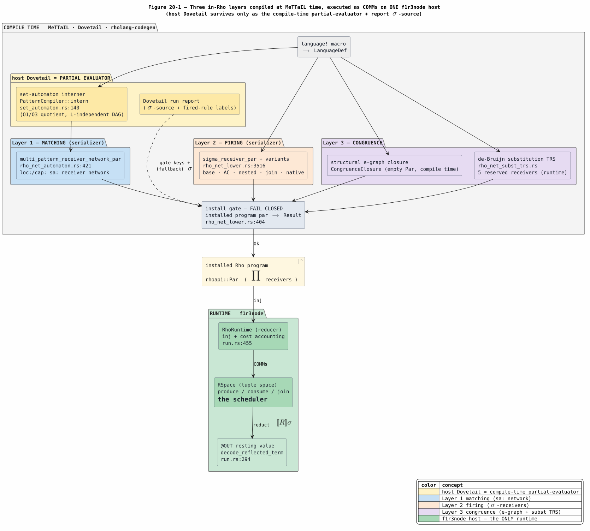
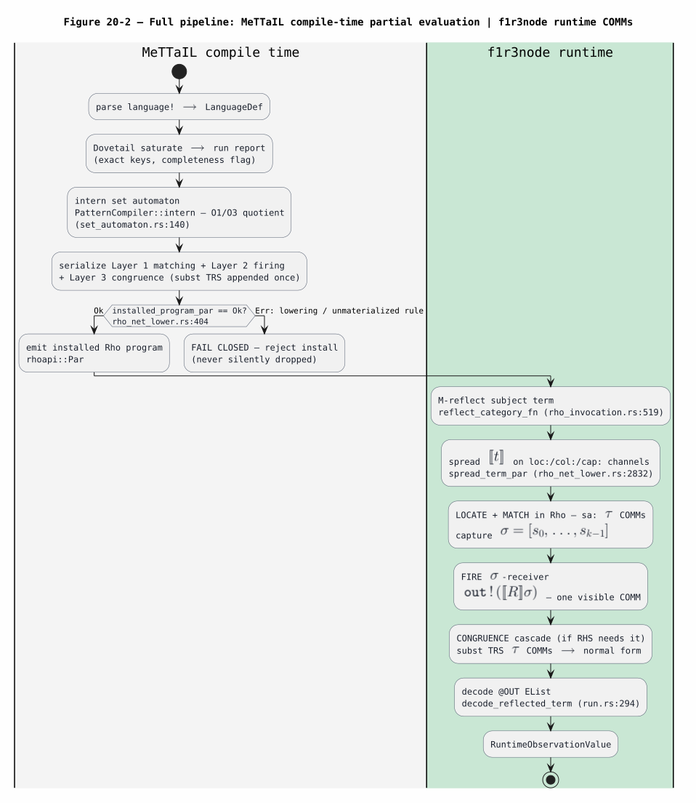
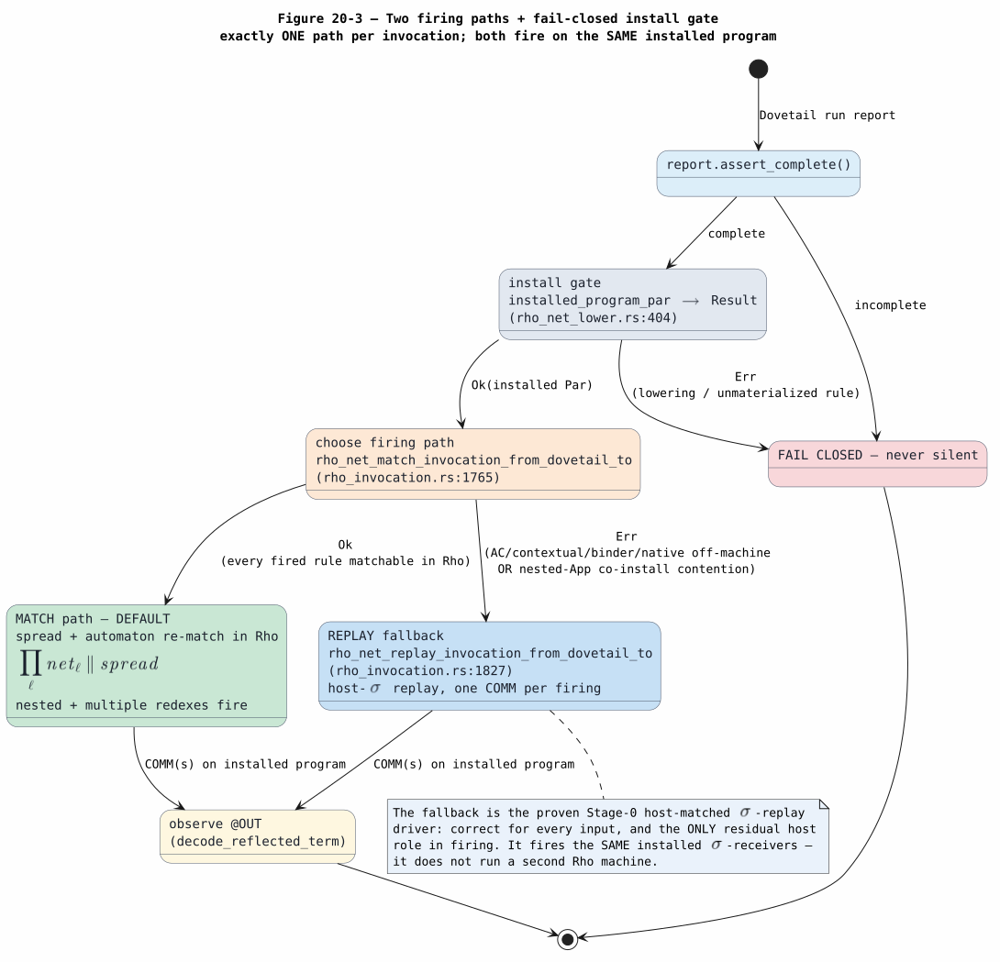
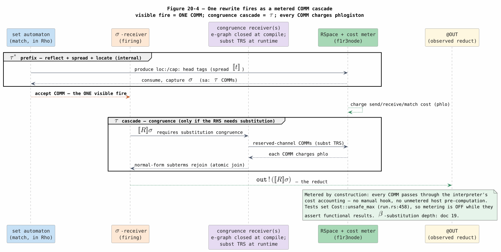

# 20 — The Rholang Runtime Backend: How In-Rho Matching and Firing Run on f1r3node

> **Altitude — HOW it runs.** This document owns the *realization*: the code,
> the channels, the end-to-end data flow, the two firing paths, and the
> metering. It spans the rule families at architecture level and does **not**
> re-derive any single family's mechanism — the binder-$`\beta`$ family is
> [19](19-in-rho-binder-beta-substitution.md), the base family is
> [25](25-in-rho-base-family-reference.md), and the associative-commutative (AC)
> family is [26](26-in-rho-ac-family-reference.md). *Why* the matching is optimal
> is [21](21-set-automata-optimization-theory.md); the *proof* that the whole
> thing is correct is [22](22-end-to-end-formal-verification.md); *what* is
> covered is [23](23-coverage-and-correctness.md); the paper-mandate invariant
> map is [13](13-knotted-topoi-operational-invariants.md). Shared vocabulary is
> [01](01-concepts-and-glossary.md); this document opens with its own glossary so
> every symbol is defined before use. Every claim below is cross-checked against
> the committed code on branch `codex/rho-native-set-automata`, cited as
> `file:line`.

## 1. Landed state: what runs where

The in-Rho set-automaton campaign moved the entire rewrite loop onto the
f1r3node host. Before the campaign, a rewrite was *matched* on the host in Rust
(Dovetail's set automaton produced a substitution) and only the *firing* was a
Rho communication. The landed system is stronger:

- **Matching runs in Rho.** The subject term is reflected and spread onto
  location channels, and a compiled set-automaton *receiver network* re-locates
  every redex — at any depth, several at once — as a run of communications on
  the f1r3node reducer. There is no host re-match.
- **Firing runs in Rho.** Each located redex hands its captured substitution to
  a persistent $`\sigma`$-receiver, whose body emits the reflected right-hand
  side as one communication. Every non-semantic-predicate rewrite family fires
  this way.
- **$`\beta`$ additionally *reduces* in Rho.** The $`\lambda`$-calculus base
  rewrite $`b[a/0]`$ is computed by a metered cascade of communications on
  reserved de-Bruijn channels (the substitution term-rewriting system, or TRS),
  so capture-avoiding substitution itself is host-machine work — the terminal
  endpoint documented in [19](19-in-rho-binder-beta-substitution.md).
- **Whole executions drive to rest in Rho (A-S5).** For a drive-admitted
  language (production Lambda and Ambient — the `DRIVE_OPT_IN` const,
  `rholang-codegen/src/rho_net_drive.rs`) one `exec` is one generated
  `rho_net_drive_invocation_to` seed: the **`^drive` receiver family** — the
  redex arms (fuel-gated, firing through the $`\sigma`$ ABI, contractum
  re-driven), the congruence-descent arm (concurrent child drives with
  per-path fuel, atomic join, inline post-join re-check), the binder arm, and
  the AC bag arms (peel / drive / three-case splice, flatness-preserving) —
  drives the reflected subject to quiescence with **zero host work between
  firings**. The host reads back four observation channels (OUT value, fired
  multiset, typed error, typed `^drive-fuel`) and runs an always-on
  fired-vs-NF-scan cross-check. The admission is recorded per language
  (`DriveAdmission`: `Admitted` / `NotRequested` / `Unsupported` with every
  failed conjunct named); a non-opted-in language's generated module is
  byte-identical to the pre-driver form. On this path the
  `NestedEntryMultiSite` locate-all boundary cannot arise — the per-node
  descent replaces the single-shot locate-all, so multi-site subjects (the
  $`\lambda`$-chain ladder $`n \le 8`$,
  `rholang-runtime/tests/rho_net_lambda_firing.rs`) drive to rest in-Rho.
  Audit detail: [24 §5.1](24-in-rho-completion-audit.md#51-the-a-s5-quiescence-driver-exec-drives-to-rest-in-rho);
  FV: `InRhoQuiescenceDriver.v`.

What survives of the host Dovetail engine is exactly two roles, both
compile-time or gate/deferral-only:

1. **A partial evaluator.** The set-automaton interner
   (`PatternCompiler::intern`, `dovetail/src/set_automaton.rs:140`) computes the
   automaton's shared-state quotient *once, at MeTTaIL compile time*, and the
   result is serialized into the installed Rho program. The runtime pays no
   pattern-compilation cost. This is the optimization whose theory is
   [21](21-set-automata-optimization-theory.md).
2. **A lazy $`\sigma`$-source behind a static gate.** Since A-S2 the install
   capability gate is STATIC (`in_rho_static_gate` — an off-machine rule fails
   the install closed with no report built), and the Dovetail run report is
   built LAZILY, exactly on the deferral path (report checked $`\iff`$
   deferral taken); only there does it supply the host-computed substitution
   replayed into the same installed receivers (§5). An admitted term executes
   with ZERO Dovetail work (`repl/tests/zero_dstage_exec.rs`).

Everything downstream of the installed program — scheduling, communication,
substitution charging, checkpoint, replay — is f1r3node's existing RhoRuntime
and RSpace. MeTTaIL grows no second Rho machine; the dependency direction stays
one-way (MeTTaIL bridge crates may depend on f1r3node, not the reverse). Figure
20-1 is the component view of this split.



*Figure 20-1. The three layers (matching, firing, congruence) are serialized at
compile time into one installed `Par`; the f1r3node host is the only runtime.
Host Dovetail is the yellow compile-time partial-evaluator plus the report
$`\sigma`$-source that gates the install. Source:
[figures/20-runtime-backend-component.puml](figures/20-runtime-backend-component.puml).*

## 2. Glossary

Every symbol and acronym below is defined here before first use. Reflected
values live in the same normalized `rhoapi::Par` AST the rest of this suite
lowers to ([04](04-rho-native-dataflow-lowering.md)); Rholang-looking snippets
are reader annotations for those `Par` values.

| Term | Definition |
|---|---|
| **RhoRuntime** | f1r3node's Rholang interpreter — the reducer that evaluates a `Par`, performs communications, and charges cost ([RHOLANG-DOCS](references.md#rholang-docs)). The in-memory instance is built and driven from `rholang-runtime/src/run.rs`. |
| **RSpace** | f1r3node's tuple space ([RSPACE-DOCS](references.md#rspace-docs), [LINDA-1985](references.md#linda-1985)): the `produce`/`consume`/join store that rendezvouses sends with receives. RSpace readiness *is* the scheduler — enabled communications fire in parallel with no MeTTaIL-side loop ([05](05-rspace-parallel-scheduling.md)). |
| **COMM** | One RSpace communication: a send rendezvousing with a receive, the atomic reduction event of the Rho machine ([RHO-2005](references.md#rho-2005)). Every match step, fire, and substitution step below is a COMM. |
| **`Par`** | A normalized Rholang process AST (`rhoapi::Par`) — the executable artifact. The backend emits `Par`, never Rholang source text. |
| **GSLT** | Graph-structured lambda theory — the north-star paper's $`(\text{grammar},\ \text{equations},\ \text{rewrites})`$ classification of a model of computation ([KNOTTED-TOPOI-2026](references.md#knotted-topoi-2026)). A MeTTaIL `language!` is a GSLT. |
| **$`[\![ t ]\!]`$** | The reflected `Par` image of a term $`t`$ — the *reflected-EList ABI* (next row). |
| **reflected-EList ABI** | The tagged-list wire format: a constructor $`C(t_0,\dots,t_{m-1})`$ reflects to `EList[ GPrivate(⌜C⌝), ⟦t₀⟧, …, ⟦t_{m-1}⟧ ]`. The tag $`\ulcorner C \urcorner`$ is `GPrivate("mettail.term.<fp>.C")` (prefix `REFLECTED_TERM_ABI_PREFIX`, `rholang-codegen/src/lib.rs:66`; assembled at `rho_net_lower.rs:1379`). One format shared by the spread, the automaton, and the $`\sigma`$-receivers, so a captured sub-term flows between them with no re-encoding. |
| **fingerprint (`fp`)** | The per-language tag salt that makes reserved names unforgeable and disjoint across languages. Every tag on the spread, the receivers, and the reflected RHS shares one `fp`, or they would not rendezvous. |
| **M-reflect** | The runtime reflection of the *whole subject term* into its ground image (`reflect_category_fn`, `macros/src/gen/runtime/rho_invocation.rs:519`) — the input to the spread. Distinct from the report $`\sigma`$: M-reflect reflects the subject, not the host match result. |
| **spread** | The `Par` that publishes the reflected subject onto location channels for the automaton to walk (`spread_term_par`, `rho_net_lower.rs:2832`). |
| **$`\rho`$ / $`\ell`$** | $`\rho`$ is a spread's root site nonce; $`\ell`$ is a redex location (position) in the subject. The north-star location channel is $`c(\ell)=\ulcorner \ell \urcorner`$. |
| **`loc:` / `col:` / `cap:` / `sa:` / `eq:` / `ac:` channels** | The channel-kind scheme the spread and receivers rendezvous on. `loc:` carries head tags for the automaton's positional walk (`spread_root_location`, `rho_net_lower.rs:2761`; children via `spread_child_location:2770`). `col:` is a node's *chain*-collapse value, read once by the parent's fold (`collapse_chain_location:2778`). `cap:` is the *capture*-collapse value, read once by a Var-leaf state (`collapse_capture_location:2786`). `sa:` is a $`\sigma`$-receiver's source/dispatch channel (the accept target). `eq:` is a non-linear consistency (name-equality) guard channel (`RhoNetChannelKind::Consistency`, `rholang-codegen/src/rho_net.rs:77`). `ac:` is a site-keyed AC operand-bag carrier ([26](26-in-rho-ac-family-reference.md)). |
| **set automaton** | The compiled positional pattern matcher of [SET-AUTOMATON-LOCATE-2021](references.md#set-automaton-locate-2021) / [SET-AUTOMATON-MATCHING-2022](references.md#set-automaton-matching-2022): it visits each subject symbol once to locate all pattern matches. `SetAutomaton` / `SetAutomatonView`, `dovetail/src/set_automaton.rs:158`/`:183`. |
| **interner / partial evaluator** | `PatternCompiler::intern` (`set_automaton.rs:140`): a `StateKey → StateId` table that collapses structurally-equal sub-patterns to one shared state, computing the automaton's quotient at compile time. Theory: [21](21-set-automata-optimization-theory.md). |
| **$`\sigma`$ (substitution)** | The flat list of matched sub-terms $`[s_0,\dots,s_{k-1}]`$, in canonical first-occurrence order, that a match binds for a $`k`$-variable rewrite. |
| **$`\sigma`$-receiver** | The persistent Rholang receiver a rewrite lowers to: `for(f₀,…,f_{k-1}, out ⇐ c(ℓ)){ out!(⟦R⟧σ) }` — $`k`$ matched sub-terms plus the output channel (`sigma_receiver_par`, `rho_net_lower.rs:3516`, and the AC/nested/join/native variants of §3.2). Firing it is one COMM. |
| **redex / `out` channel** | A redex is a located rule instance ready to fire; the `out` channel is the last $`\sigma`$-tuple slot, where the receiver publishes the reflected RHS. |
| **congruence** | Closing a rewrite under context and equality. Structural-congruence equations are closed at compile time by an e-graph (`CongruenceClosure`, empty `Par`); $`\beta`$-substitution congruence is closed at runtime by the de-Bruijn subst TRS (§3.3). |
| **install gate** | `installed_program_par` (`rho_net_lower.rs:404`) returning `Result<Par, RhoNetInstallError>`: it fails closed if any rule failed to lower or any classified rule was left unmaterialized, so an off-machine rule can never silently vanish. |
| **$`\tau`$ step** | An internal, unobservable reduction step (a silent COMM), by analogy with process calculus. The spread/locate COMMs and the substitution-cascade COMMs are $`\tau`$; the single accept COMM that fires a rule is the visible label. |
| **phlogiston (phlo)** | Rholang's metering unit — the cost consumed by execution ([RHOLANG-DOCS](references.md#rholang-docs)). Every COMM charges phlo through the interpreter's cost accounting; an exhausted budget halts the computation. |
| **$`\sigma`$-source / run report** | A completed `RuntimeDovetailRunReport`: the exact-keyed, completeness-checked host rewrite result. It gates the install and, on the fallback path only, supplies the replayed $`\sigma`$. |

## 3. The three layers

The backend is three serialization layers that all compile to receivers on the
one installed `Par`, plus one compile-time closure. Layer 1 *locates* redexes,
Layer 2 *fires* them, and Layer 3 *closes* the result under congruence. All
three are emitted at MeTTaIL compile time from the classified rules of a
`RhoNetProgram` (`rho_net_lower.rs:1-28`).

### 3.1 Layer 1 — matching (the compiled set automaton)

The matcher is a positional set automaton compiled from the rewrite left-hand
sides. Compilation is a two-step partial evaluation:

1. **Intern.** `PatternCompiler::compile` (`set_automaton.rs:129`) walks each
   LHS pattern and calls `intern` (`:140`) on every sub-pattern. `intern` keeps a
   `StateKey → StateId` table: a structurally-equal sub-pattern already seen
   returns its existing `StateId`, so equal sub-patterns share one state and the
   interned DAG's size is independent of how many rules reuse a shape. This is
   the compile-time quotient — the interner *is* the partial evaluator, and its
   optimality is the subject of [21](21-set-automata-optimization-theory.md).
   (The host-side evaluator `eval_app_state`, `set_automaton.rs:364`, is the
   reference matcher used for differential checks; the runtime does not call it.)
2. **Serialize.** `multi_pattern_receiver_network_par`
   (`rholang-codegen/src/rho_net_automaton.rs:421`) turns a
   `SetAutomatonView` over that interned DAG into **one** in-Rho `sa:`-receiver
   network sharing a single root `loc:` receive. The root head tag is received
   once and `Match`-dispatched — one case per distinct root operator — and
   entries that share an operator and arity share their child `for`-receives and
   announce in parallel to each rule's accept channel. Each accept routes to its
   rule's own $`\sigma`$-receiver source via an `AutomatonAcceptTarget`
   (`rho_net_automaton.rs:402`), which carries the accept channel and the `out`
   channel — the seam from Layer 1 into Layer 2.

At runtime the subject is M-reflected and spread (§4). The automaton network
consumes the spread's `loc:` head tags, descends nested applications, collapses
Var-leaf subtrees off the `cap:` channels, and — when a positional match
completes — sends the captured $`\sigma`$ on the matched rule's `sa:` accept
channel. Because the walk consumes each head tag once and several entries can
announce from a shared descent, a nested redex and multiple simultaneous
redexes all match from one spread. The associative-commutative operators are the
one exclusion: `contains_ac` (`set_automaton.rs:406`) keeps AC bags off the
positional automaton, because an AC bag matches order-independently as one
atomic multiset consume rather than by positional descent
([26](26-in-rho-ac-family-reference.md)).

### 3.2 Layer 2 — firing (the sigma-receiver family)

A firing is a persistent receiver whose body sends the reflected RHS. The base
shape is a flat $`(k+1)`$-ary receive (the $`k`$ LHS variables in
first-occurrence order plus the `out` channel):

```math
\texttt{for}\bigl(f_0,\dots,f_{k-1},\ \mathtt{out}\ \Leftarrow\ c(\ell)\bigr)\ \bigl\{\ \mathtt{out}\,!\,([\![ R ]\!]\sigma)\ \bigr\}
```

That is `sigma_receiver_par` (`rho_net_lower.rs:3516`), built by
`lower_base_rewrite` (`:685`). De-Bruijn indices collapse to the scalar-operator
case: formal $`i`$ maps to `BoundVar(k - i)` and the `out` channel (formal
$`k`$) to `BoundVar(0)` (`rho_net_lower.rs:1-17`). Each rule family that a
`language!` can declare has a firing variant with the same install-then-fire
seam but a shape suited to its rewrite:

| Family | Firing receiver | Site |
|---|---|---|
| base rewrite | `sigma_receiver_par` | `rho_net_lower.rs:3516` |
| non-linear equality guard | `sigma_receiver_par` + `eq:` consistency channel | `rho_net.rs:77` |
| contextual (congruence) join | `contextual_join_receiver_par` | `rho_net_lower.rs:3573` |
| AC-linear / with-rest | `ac_sigma_receiver_par` | `rho_net_lower.rs:3625` |
| structural (non-linear) AC | `structural_ac_rule_receiver` | `rho_net_lower.rs:4680` |
| nested (depth-2) structural AC | `nested_structural_ac_rule_receiver` | `rho_net_lower.rs:5824` |
| declared join (`Comm`) | `comm_rule_receiver` | `rho_net_lower.rs:4308` |
| binder-$`\beta`$ seed | `subst_seed_receiver_par` | `rho_net_subst_trs.rs:1021` |

Every variant lowers to the same `Match`/`MatchCase`/`Receive` `Par` family the
automaton already emits, so no family introduces a new reducer primitive. The
receivers are parallel-composed into the installed program; a matched
$`\sigma`$ reaching a receiver's `sa:` source is one atomic COMM that publishes
$`[\![ R ]\!]\sigma`$ on `out`. The per-family internals live in
[19](19-in-rho-binder-beta-substitution.md) (binder),
[25](25-in-rho-base-family-reference.md) (base), and
[26](26-in-rho-ac-family-reference.md) (AC); the correspondence proof that each
firing is one faithful COMM is [22](22-end-to-end-formal-verification.md).

### 3.3 Layer 3 — congruence (compile-time e-graph + runtime subst TRS)

Congruence closes a rewrite under context and under the language's equations.
It has two mechanisms, split by whether the closure is finite at compile time:

- **Structural congruence (compile time).** A language's equations are closed by
  Dovetail's e-graph; the lowering records a `CongruenceClosure` with an empty
  `Par` contribution (`rho_net_lower.rs:23`). The equal forms are already folded
  into the interned automaton, so no runtime receiver is needed. A *contextual*
  rewrite — reducing a premise redex inside an outer context $`K`$ — fires an
  atomic join (`lower_contextual_rewrite`, `rho_net_lower.rs:1146`) fed by the
  in-Rho reduced hole, not by a host reconstruction.
- **$`\beta`$-substitution congruence (runtime).** Capture-avoiding
  substitution $`b[a/0]`$ is *not* a finite constructor tree over $`b`$ and
  $`a`$, so it cannot be a compile-time fold. It is computed by the de-Bruijn
  substitution TRS: five persistent reserved receivers whose mutually-recursive
  `Match` bodies drive the substitution as a cascade of COMMs
  (`rho_net_subst_trs.rs:1-57`). A $`\beta`$-fire seeds
  `^subst(⟦Z⟧, a, b, out)` and the cascade self-drives to the normal form on
  `out`.

| Reserved receiver | Channel | Computes | Site |
|---|---|---|---|
| `subst_receiver_par` | `^subst` | capture-avoiding $`t[a/j]`$ | `rho_net_subst_trs.rs:663` |
| `shift_receiver_par` | `^shift` | free-variable shift with cutoff | `:568` |
| `shiftk_receiver_par` | `^shiftk` | $`k`$ iterated shift passes | `:524` |
| `cmp_receiver_par` | `^cmp` | Peano comparison | `:417` |
| `pred_receiver_par` | `^pred` | total Peano predecessor | `:494` |

`installed_program_par` appends this TRS program exactly once
(`subst_trs_program_par`, `:1003`), on disjoint reserved roots, so it disturbs
no landed base, AC, contextual, or native receiver
(`rho_net_lower.rs:437-443`). That the installed program has exactly five
reserved receivers is asserted by `the_program_has_five_reserved_receivers`
(`:1102`). The full de-Bruijn mechanism, the depth-increment correction, the
strong-normalization measure, and the confluence proof are
[19](19-in-rho-binder-beta-substitution.md); this document only places the TRS
as the runtime congruence layer.

## 4. End-to-end data flow (one invocation)

Figure 20-2 is the whole pipeline as a two-lane activity: the left lane is
MeTTaIL compile time, the right lane is f1r3node runtime.



*Figure 20-2. The install gate is fail-closed: a rule that cannot match and fire
in Rho stops the install rather than silently dropping. Source:
[figures/20-runtime-backend-activity.puml](figures/20-runtime-backend-activity.puml).*

**Compile time (once per language).**

1. `language!` expands to a `LanguageDef`; Dovetail saturates the term and
   produces the run report (exact keys, completeness flag).
2. `PatternCompiler::intern` computes the automaton quotient
   (`set_automaton.rs:140`).
3. The three layers are serialized: Layer 1 (`multi_pattern_receiver_network_par`),
   Layer 2 (the $`\sigma`$-receiver family), Layer 3 (the subst TRS appended once).
4. `installed_program_par` (`rho_net_lower.rs:404`) folds every rule's `Par` into
   one program and returns `Result` — the fail-closed install gate (§5).

**Runtime (once per subject term).**

5. **M-reflect.** `reflect_category_fn` (`rho_invocation.rs:519`) reflects the
   *whole subject* into its ground image — a structural walk that maps each
   constructor to its reserved-tagged `EList`, a bound occurrence to
   `^bound(peano n)`, and a free occurrence to `^free x`.
6. **Spread.** `spread_term_par` (`rho_net_lower.rs:2832`) publishes
   $`[\![ t ]\!]`$ onto `loc:`/`col:`/`cap:` channels for the
   automaton to walk.
7. **Locate and match.** The Layer-1 network consumes the head tags — the `sa:`
   $`\tau`$ COMMs — descends nested applications, and captures
   $`\sigma = [s_0,\dots,s_{k-1}]`$ at each located redex.
8. **Fire.** Each accept sends $`\sigma`$ on the rule's `sa:` channel; the
   Layer-2 $`\sigma`$-receiver publishes $`[\![ R ]\!]\sigma`$ on
   `out` — the visible COMM.
9. **Congruence cascade (when the RHS needs it).** A $`\beta`$ seed drives the
   Layer-3 subst TRS to the normal form via reserved-channel $`\tau`$ COMMs.
10. **Decode.** `decode_reflected_term` (`rholang-runtime/src/run.rs:294`) reads
    the resting `EList` on `out` and rebuilds a `RuntimeObservationValue::Term`;
    scalars, unforgeable names, and AC bag soups are decoded by
    `par_as_runtime_observation_value` (`run.rs:315`).

The reflected-EList ABI is the single wire format across steps 5-10, so the
sub-term the automaton captures in step 7 is byte-for-byte the sub-term the
receiver sends in step 8 and the value decoded in step 10 — no re-encoding, no
host round-trip.

## 5. The two firing paths and the fail-closed install gate

A firing invocation takes exactly one of two paths, and never both — the
*no-dual-path* property. Both paths fire the **same installed
$`\sigma`$-receivers**; they differ only in whether the match is redone in Rho
or replayed from the report. Figure 20-3 is the state view.



*Figure 20-3. Exactly one path fires per invocation; both fire as COMMs on the
same installed program. Source:
[figures/20-runtime-backend-two-paths.puml](figures/20-runtime-backend-two-paths.puml).*

**The default: the MATCH path.**
`rho_net_match_invocation_from_dovetail_to`
(`macros/src/gen/runtime/rho_invocation.rs:1765`) compiles the language's in-Rho
matching ruleset, **gates** it (fail closed if any fired rule is not matchable
in Rho), M-reflects the whole subject term (not the report $`\sigma`$), and
assembles one call:

```math
\textstyle\prod_{\ell}\ \mathit{net}_\ell \ \parallel\ \mathit{spread}\bigl([\![ t ]\!]\bigr)
```

a positional network co-installed at every redex position $`\ell`$ over one
spread. The automaton re-does the matching and location on the interpreter, and
each located site's accept fires its $`\sigma`$-receiver — so a nested redex and
multiple redexes all fire in Rho, the observed channel collecting every located
redex's contractum.

**The fallback: the REPLAY path.**
`rho_net_replay_invocation_from_dovetail_to` (`rho_invocation.rs:1827`) asserts
the report is complete, then emits one injection per rewrite firing in the
report — each host-computed $`\sigma`$ replayed onto its own `out` channel
against the same installed receivers. It is the proven Stage-0 host-matched
driver: correct for every input, and the only residual host role in firing. An
empty result is a valid normal-form state, not a failure.

**The gate that chooses.** The default backend calls the MATCH path and falls
back to the REPLAY path only when the gate rejects — a fired rule is off-machine
(AC, contextual, binder, or native) or the ruleset has a nested-application
entry whose co-installation would contend. The choice is a single `match` in the
SwapDemo backend (`repl/src/rho_backends.rs:184-200`, `swapdemo_invocation`):

```text
match SwapDemoLanguage::rho_net_match_invocation_from_dovetail_to(term, report, OUT) {
    Ok(invocation)          => /* MATCH path: spread + in-Rho re-match */,
    Err(_gate_or_scope)     => /* REPLAY fallback: host-σ replay onto the same receivers */,
}
```

**Fail-closed install.** Upstream of both paths, `installed_program_par`
(`rho_net_lower.rs:404`) returns `Err(RhoNetInstallError::LoweringErrors …)` if
any rule failed to lower and `Err(UnmaterializedRule …)` if any classified rule
(`Comm`, `NativeSystemProcess`, `Unsupported`) was left unmaterialized. An
off-machine rule therefore cannot silently disappear: either it is materialized
and installed, or the install fails and the caller learns which rule and family
were unmaterialized. This is the mechanism behind the "no dual runtime path"
guarantee — there is one installed program, and both firing paths drive it.

## 6. f1r3node integration (RhoRuntime, RSpace, COMMs)

The installed program is a `Par`; running it is entirely f1r3node's job. The
integration surface is two files in the `rholang-runtime` crate.

**Composition — install $`\parallel`$ call.** A language's $`\sigma`$-receivers
live in its installed Rho-net program
(`RhoDefaultBackendPlan::installed_rho_net_program_par`,
`rholang-codegen/src/backend.rs:1068`), **not** in the scalar program. A firing
therefore only rendezvouses when its call is composed against the installed
program. `run_installed_program_with_call_and_read_runtime_values`
(`rholang-runtime/src/run.rs:842`) does exactly that:

```text
let composed = installed_program.append(call.clone());
run_par_and_read_ground(&composed, out_channel, par_as_runtime_observation_value)
```

Without this `append` the injection would reach no receiver and `out` would be
empty — a silent false pass — so the composition is the critical step of the
injection bridge (`run.rs:827-848`).

**Injection.** `inj_on_runtime` (`run.rs:455`) takes a soft checkpoint, sets the
budget, and injects the composed program into the RhoRuntime:

```text
let checkpoint = runtime.create_soft_checkpoint().await;
runtime.cost().set(Cost::unsafe_max());
match runtime.inj(program, Env::new(), rand).await { Ok(()) => …, Err(err) => revert }
```

On an evaluation error the runtime reverts to the checkpoint — the fail-safe that
keeps a rejected injection from leaving partial state. RSpace then schedules the
enabled communications: the spread's `loc:`/`cap:` produces rendezvous with the
automaton network's consumes, the accept sends rendezvous with the
$`\sigma`$-receivers, and (for $`\beta`$) the reserved-channel sends rendezvous
with the subst TRS. RSpace readiness is the scheduler; sibling redexes co-reduce
with no MeTTaIL-side loop ([05](05-rspace-parallel-scheduling.md)).

**Observation.** After reduction, the closed values resting on `@"<out>"` are
read back and decoded (`decode_reflected_term`, `run.rs:294`;
`par_as_runtime_observation_value`, `:315`) into `RuntimeObservationValue`s — the
post-execution facts that a `RuntimeBackendReport` carries to callers. A Rho
observation is post-execution RSpace evidence, distinct from the pre-execution
Dovetail report that seeded the run (the vocabulary discipline of the suite
README).

## 7. Metering by construction

Because every step — spread, locate, fire, and substitution cascade — is a COMM
on the host reducer, the entire rewrite is metered by the interpreter's own cost
accounting, with no manual hook and no unmetered host pre-computation. Each send
charges a send cost, each receive and match charges a receive/match cost, and a
substitution the reducer performs during a COMM is charged in proportion to the
encoded length of the term ([RHOLANG-DOCS](references.md#rholang-docs)). The
total phlogiston is therefore the sum of the encoded lengths touched —
proportional to the actual rewrite work — and an exhausted budget halts a
pathological reduction as a fail-safe. Figure 20-4 traces one firing as a metered
cascade.



*Figure 20-4. Every COMM passes through the interpreter's cost accounting. The
visible fire is one COMM; the congruence cascade is a run of internal $`\tau`$
COMMs. The $`\beta`$-specific cost model is [19](19-in-rho-binder-beta-substitution.md).
Source: [figures/20-runtime-backend-metered-comm.puml](figures/20-runtime-backend-metered-comm.puml).*

This contrasts with a host handler that performs matching or substitution in
Rust: such a handler would have to charge phlogiston manually — or omit it — to
stay faithful to the metered semantics. The in-Rho mechanism inherits metering
for free. The firing tests evaluate under `Cost::unsafe_max()`
(`run.rs:458`), so metering is effectively unbounded — off — while they assert
*functional* results; the cost path above is exercised whenever a real
phlogiston budget is set. The metering guarantee is a property of the mechanism,
not of the test harness.

## 8. Where this sits

This document is the architecture-level realization: the three layers, the
end-to-end flow, the two firing paths, the fail-closed install gate, the
f1r3node integration, and the metering. The depth of each rule family, the
optimality theory, the proofs, and the coverage live in single-owner documents:

- **Family mechanism.** Binder-$`\beta`$ and its substitution TRS:
  [19](19-in-rho-binder-beta-substitution.md). Base family, reconstruction
  grade: [25](25-in-rho-base-family-reference.md). AC family (including AC set,
  map, and zip): [26](26-in-rho-ac-family-reference.md). The campaign stages that
  built these: [15](15-in-rho-set-automaton-matching.md),
  [17](17-stage-3-production-wiring.md), [18](18-in-rho-ac-matching.md).
- **Why the matching is optimal.** The locate automaton, the channel-naming
  scheme, and the interner-as-partial-evaluator argument:
  [21](21-set-automata-optimization-theory.md).
- **Proof it is correct.** The operational-correspondence corpus, from per-family
  COMM correspondence to the whole-$`[\![ G ]\!]`$ capstone over
  optimal matching: [22](22-end-to-end-formal-verification.md); the verification
  plan is [16](16-in-rho-verification-plan.md).
- **What is covered.** The family-by-capability matrix, the corrupted-$`\sigma`$
  probes, and the honest limits: [23](23-coverage-and-correctness.md).
- **Paper-mandate invariants.** The knotted-topoi operational invariants this
  realization satisfies: [13](13-knotted-topoi-operational-invariants.md).

With matching and firing both on the f1r3node RhoRuntime and RSpace, and with the
host Dovetail reduced to a compile-time partial evaluator plus a gate-only
$`\sigma`$-source, the north-star desugaring — a rewrite $`L \Rightarrow R`$ as a
guarded receiver at the location channel $`c(\ell)=\ulcorner \ell \urcorner`$
([KNOTTED-TOPOI-2026](references.md#knotted-topoi-2026),
[OPTIMAL-CHANNEL-NAMING-2026](references.md#optimal-channel-naming-2026)) — is
realized directly on the same host machine for every rule family, with
multi-channel synchronization handled by RSpace joins
([JOIN-2000](references.md#join-2000)).

## References

See [references.md](references.md). Primary sources for this document:
[RHO-2005](references.md#rho-2005) (the reflective higher-order calculus and
COMM-style reduction), [RHOLANG-DOCS](references.md#rholang-docs) and
[RSPACE-DOCS](references.md#rspace-docs) (RhoRuntime evaluation, the tuple space,
and cost accounting), [LINDA-1985](references.md#linda-1985) and
[JOIN-2000](references.md#join-2000) (tuple-space and join-style
synchronization), [SET-AUTOMATON-LOCATE-2021](references.md#set-automaton-locate-2021)
and [SET-AUTOMATON-MATCHING-2022](references.md#set-automaton-matching-2022) (the
positional set automaton the matcher compiles), and
[KNOTTED-TOPOI-2026](references.md#knotted-topoi-2026) with
[OPTIMAL-CHANNEL-NAMING-2026](references.md#optimal-channel-naming-2026) (the
north-star desugaring and the optimal channel-naming scheme).
