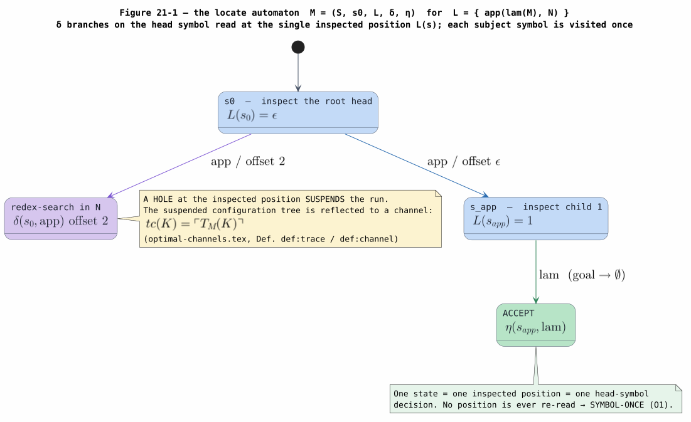
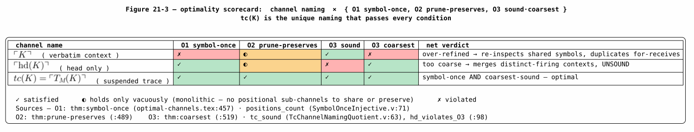
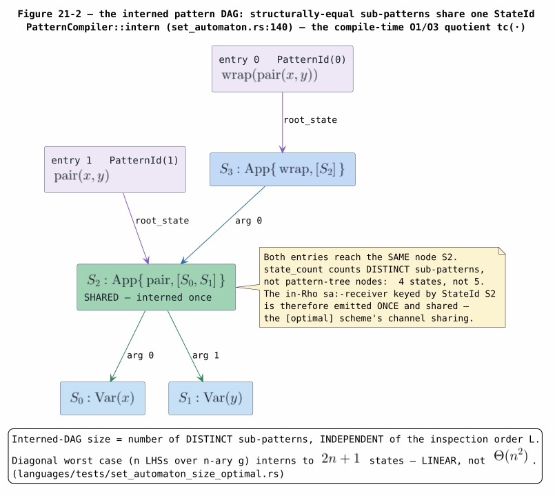
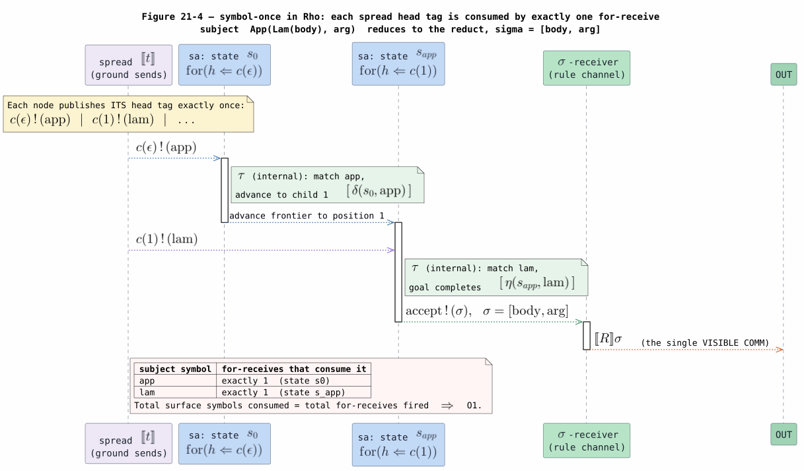
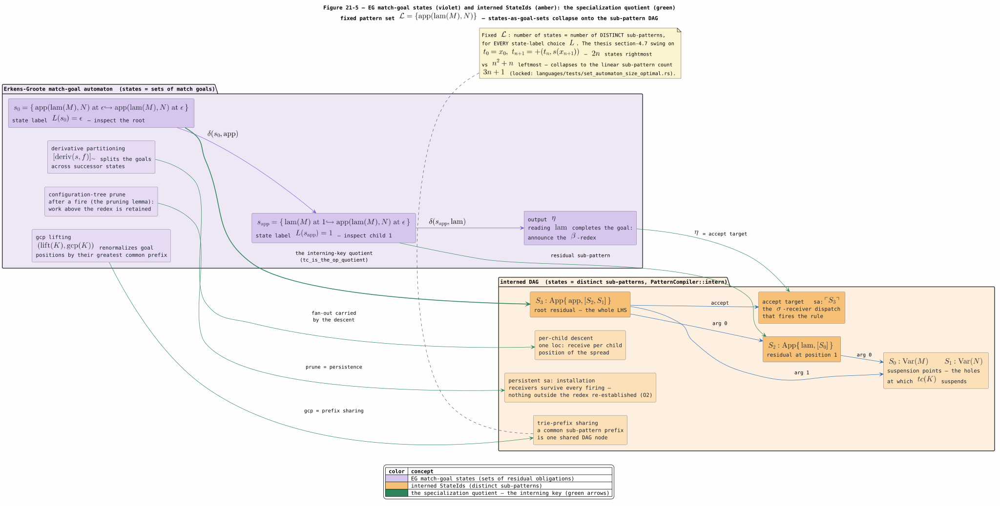

# 21 — Set-Automaton Optimization Theory: Why In-Rho Matching Is Optimal

> **Altitude.** This document owns the **WHY-it-is-optimal** tier of the in-Rho
> set-automaton campaign. It explains, in pure theory, why naming the matching
> channel for a redex context $`K`$ by the reflected set-automaton trace
> $`tc(K)=\ulcorner T_M(K)\urcorner`$ is the *optimal* choice — symbol-once
> inspection, work-preserving pruning, and the coarsest sound channel quotient —
> and why the compiler's pattern **interner** is exactly the partial evaluator that
> computes that quotient at compile time. It does **not** re-derive the runtime
> mechanism (the spread subject, the `sa:`/`eq:` receiver network, the firing COMM):
> that HOW is owned by [20 — Rholang Runtime Backend](20-rholang-runtime-backend.md)
> and the stage-by-stage realization in
> [15 — In-Rho Set-Automaton Matching](15-in-rho-set-automaton-matching.md). The
> mechanized **PROOF** of every optimality claim below is owned by
> [22 — End-to-End Formal Verification](22-end-to-end-formal-verification.md); the
> **coverage** account is [23 — Coverage and Correctness](23-coverage-and-correctness.md).
> The paper-mandate mapping (INV-1..14) lives in
> [13 — Knotted-Topoi Operational Invariants](13-knotted-topoi-operational-invariants.md).
> The single normative theory source is
> [OPTIMAL-CHANNEL-NAMING-2026](references.md#optimal-channel-naming-2026)
> (`docs/papers/optimal-channels.tex`), built on
> [SET-AUTOMATON-LOCATE-2021](references.md#set-automaton-locate-2021) and
> [SET-AUTOMATON-MATCHING-2022](references.md#set-automaton-matching-2022).

## 1. Preliminaries and glossary

Every symbol, acronym, and term is defined here before first use. Terms already
shared across the suite ($`[\![ t]\!]`$ for the lowering of $`t`$,
COMM, $`\tau`$, weak equivalence $`\approx`$, GSLT, RhoNet, $`\sigma`$)
are defined in [01 — Concepts and Glossary](01-concepts-and-glossary.md); the
matching-specific vocabulary is defined here.

| Term | Definition |
|---|---|
| **ranked alphabet** $`\mathbb{F}`$ | A finite set of function symbols with an arity map $`\#\colon\mathbb{F}\to\mathbb{N}`$ ([SET-AUTOMATON-MATCHING-2022](references.md#set-automaton-matching-2022)). A source-language constructor $`C`$ of arity $`m`$ is such a symbol. |
| **position** $`p\in\mathbb{P}`$ | A path from a term's root to a subterm, written as a dotted sequence of child indices; $`\epsilon`$ is the root. $`t\rvert_{p}`$ is the subterm at $`p`$. |
| **head symbol** $`\mathrm{hd}(t)`$ | The outermost function symbol of a term $`t`$. |
| **pattern / left-hand side** $`\ell\in\mathcal{L}`$ | A term over $`\mathbb{F}`$ and pattern variables; the left side of a rewrite $`\ell\Rightarrow r`$. $`\mathcal{L}`$ is a rule set's full LHS collection. |
| **redex context** $`K`$ | A term with $`n`$ distinguished *holes* $`\Box_1,\dots,\Box_n`$, each occurring once. $`K[t_1,\dots,t_n]`$ fills the holes. A *contextual rewrite* fires the outer $`K`$ when inner rewrites fire at its holes. |
| **surface** $`\mathrm{surf}(K)`$ | The function-symbol skeleton of $`K`$ with each hole collapsed to a wildcard — the part of $`K`$ the matcher actually inspects (optimal-channels.tex, Def. `def:surface`). |
| **set automaton** $`M=(\mathcal{S},s_0,L,\delta,\eta)`$ | The matching automaton for $`\mathcal{L}`$ (§3): states $`\mathcal{S}`$, initial $`s_0`$, position-labelling $`L\colon\mathcal{S}\to\mathbb{P}`$, transition $`\delta\colon\mathcal{S}\times\mathbb{F}\to\mathcal{P}(\mathcal{S}\times\mathbb{P})`$, output $`\eta\colon\mathcal{S}\times\mathbb{F}\to\mathcal{P}(\mathcal{L}\times\mathbb{P})`$. |
| **locate automaton** | The [SET-AUTOMATON-LOCATE-2021](references.md#set-automaton-locate-2021) automaton that finds *all* matches of $`\mathcal{L}`$ in a subject while inspecting each subject symbol exactly once. |
| **match goal** | A residual matching task $`\ell_1@p_1,\dots,\ell_n@p_n\hookrightarrow\ell@p`$ — "to announce $`\ell`$ at $`p`$, still observe each $`\ell_i`$ at $`p_i`$". A state is a set of these. |
| **suspended trace** $`T_M(K)`$ | The configuration tree of $`M`$ run on $`\mathrm{surf}(K)`$, *suspended* at every configuration whose next inspection position falls inside a hole (Def. `def:trace`). |
| **channel name** $`tc(K)`$ | $`tc(K)=\ulcorner T_M(K)\urcorner`$, the canonical reflection of the suspended trace to a rho-calculus name (Def. `def:channel`). |
| **reflection** $`\ulcorner\cdot\urcorner`$ | The rho-calculus quoting that maps distinguishable objects to distinct names ([RHO-2005](references.md#rho-2005)); here it names an automaton state/trace. |
| **$`R_{\mathrm{dep}}`$ / $`R_{\mathrm{op}}`$** | The *direct-dependency* relation (goals sharing a position) giving the smallest strategy-agnostic automaton, and the *outermost-preserving* relation (prefix-comparable announcement positions) whose depth-first traversal yields outermost matches first (optimal-channels.tex §`ssec:set-automata`). |
| **O1 / O2 / O3** | The three optimality conditions — *symbol-once*, *prune-preserves*, *coarsest-sound* (§6). |
| **interner** | `PatternCompiler::intern` (`dovetail/src/set_automaton.rs:140`): the hash-consing compiler pass that assigns each distinct sub-pattern a `StateId` (§7). |
| **StateId** | The dense index of one interned automaton state; the in-Rho lowering keys one `sa:` receiver per `StateId` (`set_automaton.rs:89`). |
| **partial evaluation** | Specializing a program to a known part of its input. Here: specializing the automaton $`M`$ to the fixed pattern set $`\mathcal{L}`$, precomputing the $`tc(\cdot)`$ quotient at compile time. |
| **AC** | Associative-commutative — an order-insensitive operator whose match may bind a *rest* complement (§8). |

Throughout, $`n`$ denotes a size parameter (spine length, arity, or pattern
count as stated), and $`\mathcal{P}(X)`$ is the powerset of $`X`$.

## 2. The problem: one channel per redex context

The knotted-topoi program ([KNOTTED-TOPOI-2026](references.md#knotted-topoi-2026))
compiles a GSLT rewrite into core Rho by desugaring it into a guarded receiver on a
channel that *names the rewrite's location*. A single rule $`L\Rightarrow R`$
compiles to

```math
[\![ L \Rightarrow R ]\!](t\ell) \;=\; \mathsf{for}\bigl([\![ L]\!] \Leftarrow t\ell\bigr)\bigl\{\; t\ell\,!\,([\![ R]\!]) \;\bigr\},
```

and a *contextual* rewrite — inner rewrites $`L_i\Rightarrow R_i`$ licensing an
outer $`K\Rightarrow K'`$ — compiles to a receiver on a channel $`tc`$
that is a function of the outer context $`K`$ (optimal-channels.tex,
Def. `def:compile`):

```math
[\![\, L_1\Rightarrow R_1,\dots,L_n\Rightarrow R_n \;\Rightarrow\; K\Rightarrow K'\,]\!] \;=\; \mathsf{let}\;tc = [\![ K]\!]\;\mathsf{in}\; \mathsf{for}\bigl(([\![ L_1]\!],\dots,[\![ L_n]\!]) \Leftarrow tc\bigr)\bigl\{\; tc\,!\,([\![ K']\!]([\![ R_1]\!],\dots,[\![ R_n]\!])) \;\bigr\}.
```

The clause $`\mathsf{let}\;tc=[\![ K]\!]`$ is the **locus of
optimization**. Because $`K`$ is a term-with-holes, the channel $`tc`$ is
a function only of $`K`$'s *surface shape*, not of the hole-fillers; the
hole-fillers are precisely the data communicated on $`tc`$ when the rule fires.
The question this document answers is: **which function of $`K`$ makes the whole
translation optimal?**

The tension is a genuine one, absent when a rewrite engine is written in an
imperative host. In a host, a matcher can freely re-traverse the subject, and a good
matcher inspects each symbol once ([SET-AUTOMATON-MATCHING-2022](references.md#set-automaton-matching-2022)).
In a *process calculus* every traversal step is a communication, every intermediate
matching state must be reified as a channel, and every firing must be a send/receive
pair. Naming choices sit between two failing extremes:

- **Too many channels** — name each context by its full syntax. Two
  syntactically distinct contexts that match the *same* patterns then get *different*
  channels, so the shared surface symbols are inspected once *per channel*: work is
  duplicated (fails **O1**).
- **Too few channels** — name each context by its head symbol alone. Contexts that
  fire *different* rules then collide on one channel, and the firing decision becomes
  unsound (fails **O3**).

The set automaton sits exactly at the equivalence quotient between these extremes.
The rest of this document builds that automaton (§3–§4), names the channel by it
(§5), states the three optimality conditions it satisfies (§6), shows the compiler's
interner *is* the partial evaluator that computes the quotient (§7), delimits the AC
boundary (§8), and bridges to the proofs (§9).

## 3. The Erkens–Groote locate automaton

The foundation is the **locate automaton** of
[SET-AUTOMATON-LOCATE-2021](references.md#set-automaton-locate-2021): a deterministic
device that finds *all* matches of a fixed pattern set $`\mathcal{L}`$ in a
subject term while visiting **each subject function symbol exactly once**. It is the
tuple $`M=(\mathcal{S},s_0,L,\delta,\eta)`$ of §1. Its states are non-empty sets
of match goals; the initial state holds the fresh root goals
$`\{\ell@\epsilon\hookrightarrow\ell@\epsilon \mid \ell\in\mathcal{L}\}`$. Two
features make it *locate* rather than merely *match*:

1. **One inspected position per state.** The labelling $`L(s)`$ names the single
   position the automaton reads next in state $`s`$. It never reads two positions
   in one state, and — by determinism of the construction — never re-reads a position
   it has already resolved.
2. **Head-symbol dispatch.** Reading the head symbol $`f`$ at $`L(s)`$ fires
   the transition $`\delta(s,f)`$, which *reduces* every goal whose obligation sat
   at $`L(s)`$, adds fresh sub-goals at the children of $`L(s)`$, and lifts
   the result into successor states. A completed goal is announced through
   $`\eta(s,f)`$.

Figure 21-1 draws $`M`$ for the campaign's running pattern set — the single
$`\lambda`$-calculus $`\beta`$-redex LHS
$`\mathcal{L}=\{\,\mathrm{app}(\mathrm{lam}(M),N)\,\}`$ (optimal-channels.tex
§`ssec:lambda`). State $`s_0`$ inspects the root
($`L(s_0)=\epsilon`$); reading $`\mathrm{app}`$ sends the matcher both to
$`s_{\mathrm{app}}`$ (offset $`\epsilon`$, the root $`\beta`$ attempt)
and back to a redex-search state at offset $`2`$ (the argument $`N`$). State
$`s_{\mathrm{app}}`$ inspects child $`1`$ ($`L(s_{\mathrm{app}})=1`$);
reading $`\mathrm{lam}`$ completes the goal and announces the $`\beta`$-redex.
No position is read twice.



*Figure 21-1. The locate automaton $`M`$ for
$`\mathcal{L}=\{\mathrm{app}(\mathrm{lam}(M),N)\}`$. Each state inspects one
position $`L(s)`$; $`\delta`$ branches on the head symbol read there; a hole
at the inspected position suspends the run, and the suspended trace is what
$`tc(K)`$ reflects. Source:
[figures/21-locate-automaton.puml](figures/21-locate-automaton.puml).*

The single-visit discipline is the theorem the whole edifice rests on
([SET-AUTOMATON-LOCATE-2021](references.md#set-automaton-locate-2021), Theorem 1): the
nodes of the run are in bijection with the function-symbol positions of the subject.
The number of inspection steps is therefore *linear* in the subject size, never
quadratic — the property §6 transports into the channel setting as **O1**.

## 4. The Bouwman–Erkens rewriting layer

[SET-AUTOMATON-MATCHING-2022](references.md#set-automaton-matching-2022) turns the
locator into a *rewriting* engine. Three of its elements are load-bearing here.

**Two dependency relations.** The construction partitions each transition's goals by
an equivalence on positions. The **direct-dependency** relation $`R_{\mathrm{dep}}`$
(goals sharing a position) yields the smallest automaton sound for *arbitrary*
reduction strategies; independent positions land in distinct classes and may be
explored concurrently. The **outermost-preserving** relation $`R_{\mathrm{op}}`$
(prefix-comparable announcement positions) yields a larger automaton in which a
depth-first traversal reports *outermost* matches first — the relation the coarsest
theorem of §6 uses, because rewriting fires at the outermost redex.

**Pruning.** When a redex fires at position $`p`$, the matcher *prunes* its
configuration tree back to the redex's initialization configuration; matching already
done strictly *above* $`p`$ is retained, never recomputed. This is the imperative
seed of condition **O2** (§6): the pruning correctness lemma
([SET-AUTOMATON-MATCHING-2022](references.md#set-automaton-matching-2022), Lemma 1)
guarantees pruning never *adds* configuration nodes.

**Non-linearity bookkeeping.** A set automaton cannot enforce that a repeated pattern
variable binds equal subterms. Bouwman–Erkens delegate the check to the rewrite
procedure, tracking each pre-match as *ambiguous*, *disabled*, or *enabled*. §5's
channel scheme mirrors this with **consistency receives** (the in-Rho `eq:` guarded
join realizes it — [15 §3.6](15-in-rho-set-automaton-matching.md)).

## 5. Meredith's channel naming $`tc(K)`$

[OPTIMAL-CHANNEL-NAMING-2026](references.md#optimal-channel-naming-2026) resolves §2's
question by **partial evaluation of the set automaton against the context** $`K`$.
Running $`M`$ on $`\mathrm{surf}(K)`$ and *suspending* wherever the next
inspection would fall inside a hole yields the finite suspended trace $`T_M(K)`$;
its canonical reflection is the channel (Def. `def:channel`):

```math
tc(K) \;=\; \ulcorner T_M(K)\urcorner .
```

When $`K`$ has a single hole and the trace collapses to one suspended
configuration $`(s,p)`$, this simplifies to the closed-form slogan of the paper's
abstract:

```math
tc(K) \;=\; \ulcorner \delta^{*}(s_0,\mathrm{surf}(K))\urcorner ,
```

where $`\delta^{*}`$ is the iterated transition along the surface's head-symbol
sequence. The general suspended-tree form is the technically correct one; it
accommodates $`R_{\mathrm{dep}}`$-parallel independent holes and the bounded
look-ahead of the set-automaton construction. The computation is a terminating
unfold (optimal-channels.tex, Construction `constr:tc`): grow each *bud*
$`(s,p)`$ whose inspection position $`p\cdot L(s)`$ is not a hole by reading
$`f=\mathrm{hd}(\mathrm{surf}(K)\rvert_{p\cdot L(s)})`$ and replacing it with its
$`\delta(s,f)`$ successors; suspend at holes; reflect the finished tree. It runs
in $`O(|\mathrm{surf}(K)|)`$ steps.

The operational reading is the crux. The $`\mathsf{for}`$-receive on $`tc(K)`$
blocks until the hole-fillers arrive; their arrival *is* taking the suspended
transitions and continuing the match on the fillers. Two contexts that lead $`M`$
to the *same* suspended trace get the *same* channel and so *share* all their matching
work; two contexts $`M`$ distinguishes get *distinct* channels. That the induced
partition is exactly the right one is the content of §6.

## 6. The three optimality conditions

The paper characterizes an *optimal* translation by three properties
(optimal-channels.tex, §`ssec:optimal-meaning`, lines 307–318):

- **(O1) Symbol-once.** Whenever the rule fires, each function symbol of $`K`$ is
  processed by *exactly one* $`\mathsf{for}`$-receive in the translation.
- **(O2) Prune-preserves.** When an inner contextual rewrite fires *below* a position
  $`p`$, the channels and suspended receives strictly *outside* $`p`$ remain
  valid — no re-establishment of the outer channel structure is needed.
- **(O3) Coarsest-sound.** If two contexts are observationally equivalent — no
  hole-filling distinguishes which rule fires — they share a channel; if they are
  observationally distinct, they receive distinct channels. Read as two facets: a
  *soundness* facet (never merge distinct-firing contexts) and a *coarsest* facet
  (share whenever firing-equivalent).

### 6.1 The two failing baselines

Two naive namings each satisfy one condition and fail another; they delimit the
optimum from both sides.

- **$`tc(K)=\ulcorner K\urcorner`$ (verbatim context).** Reflecting the whole
  syntactic context trivially never merges distinct-firing contexts (O3 *soundness*
  holds), but it *over-refines*: two syntactically distinct, match-equivalent contexts
  get different channels, so their shared surface symbols are inspected once per
  channel — **O1 fails** (optimal-channels.tex lines 320–322). Equivalently,
  $`\ulcorner K\urcorner`$ is the *finest* partition and so also fails the O3
  *coarsest* facet; the paper records this one phenomenon as the O1 failure.
- **$`tc(K)=\ulcorner\mathrm{hd}(K)\urcorner`$ (head only).** Naming by the head
  symbol is maximally cheap and never re-inspects (**O1 holds**), and it is maximally
  coarse, but it *merges* contexts that share a head yet fire different rules —
  **O3 soundness fails** (lines 323–324; mechanized as `hd_violates_O3`,
  [22](22-end-to-end-formal-verification.md)).

For both monolithic baselines, **O2 holds only vacuously**: with one channel per whole
context (or per head) there is no positional sub-channel *structure* for an inner
firing to invalidate or for pruning to preserve. O2's actual *benefit* — sharing outer
matching work across firings and sites — requires the sub-channel decomposition that
only $`tc(K)`$ provides.

### 6.2 Why $`tc(K)`$ satisfies all three

The set-automaton trace threads the needle. The three optimality theorems of
[OPTIMAL-CHANNEL-NAMING-2026](references.md#optimal-channel-naming-2026) are transports
of the corresponding Bouwman–Erkens theorems into the channel setting:

- **O1** (Theorem `thm:symbol-once`, tex:457). The nodes of $`T_M(K)`$ are in
  bijection with the surface positions of $`K`$ (via the locate automaton's
  single-visit theorem), and each node is one $`\mathsf{for}`$-receive. The map
  *surface symbol* $`\mapsto`$ *consuming receive* is total and injective — every
  symbol consumed once, no symbol consumed twice.
- **O2** (Theorem `thm:prune-preserves`, tex:489). The pruning-correctness lemma
  transports to: an inner firing at $`p`$ sends on the sub-channel
  $`tc(K_{\mathrm{in}})`$ of $`tc(K)`$, and the outer receives for positions
  $`q\not\succeq p`$ are exactly those that existed before — no outer receive is
  created or destroyed. In-Rho this is realized structurally: the `sa:` receiver
  network is a *persistent* installation that is built once for the whole program and
  survives every firing ([15 §3](15-in-rho-set-automaton-matching.md),
  [19 §6](19-in-rho-binder-beta-substitution.md)).
- **O3** (Theorem `thm:coarsest`, tex:519). The equivalence
  $`K\sim_{\mathrm{op}}K'\iff T_{M_{R_{\mathrm{op}}}}(K)=T_{M_{R_{\mathrm{op}}}}(K')`$
  is the **coarsest** equivalence such that equivalent contexts always fire the same
  outermost rule set for *every* hole-filling. Soundness follows from the
  matching-correctness theorem; coarsest follows because any strictly coarser relation
  would identify two contexts whose traces differ at some goal, and a hole-filling that
  completes that goal in one and not the other exhibits divergent firing.

Figure 21-3 is the scorecard. $`tc(K)`$ is the unique row that passes every
condition; each baseline fails a *different* facet, and their failures are
complementary — $`\ulcorner K\urcorner`$ is the finest (sound but not coarsest)
partition, $`\ulcorner\mathrm{hd}(K)\urcorner`$ the coarsest (but unsound) one, and
$`tc(K)`$ the unique coarsest-*sound* partition strictly between them.



*Figure 21-3. The optimality scorecard. O3 is shown as its two facets (sound,
coarsest). $`\ulcorner K\urcorner`$ fails O1 and the O3-coarsest facet;
$`\ulcorner\mathrm{hd}(K)\urcorner`$ fails the O3-sound facet; $`tc(K)`$ passes
all. Source: [figures/21-optimality-conditions.puml](figures/21-optimality-conditions.puml).*

### 6.3 The consequence: linear, not quadratic

The payoff is visible on a chain of head $`\beta`$-redexes
$`t_0=\mathrm{app}(\mathrm{app}(\mathrm{app}(\mathrm{lam}(M_3),N_3),N_2),N_1)`$,
reduced by three successive firings down the head spine (optimal-channels.tex,
lines 663–701). By **O1**, the three $`\mathrm{app}`$ symbols are processed by
*exactly three* $`\mathsf{for}`$-receives regardless of how many $`\beta`$
firings occur; a syntax-directed translation that re-allocates receivers for the outer
$`\mathrm{app}`$s after each inner reduction does $`O(n^2)`$ work in the
spine length, while the set-automaton encoding keeps it $`O(n)`$. By **O2**, the
outer receivers stay live across each inner firing (no re-parse). By **O3**, the
argument $`N`$ — which no LHS inspects — never splits the channel, so all
instances share one channel structure. The reflective corollary (the rho-calculus
compiled into itself, tex lines 830–835) is sharper still: a process pool of $`n`$
parallel components with $`m`$ enabled $`\mathsf{Comm}`$ redexes costs
$`O(n+m)`$ redex-discovery communications, not the $`O(n^2)`$ a naive
"try every $`(\mathrm{in},\mathrm{out})`$ pair" self-interpreter would incur.

## 7. The interner as partial evaluator

The compiler realizes $`tc(\cdot)`$ not as a runtime automaton walk but as a
**compile-time quotient**: `PatternCompiler::intern` (`dovetail/src/set_automaton.rs:140`)
hash-conses every sub-pattern, so structurally-equal sub-patterns receive **one**
shared `StateId`. This *is* the partial evaluation the paper names — the automaton
specialized to the fixed pattern set, its $`tc`$-classes precomputed.

### 7.1 The quotient, as pseudocode

The interner keys each state by a `StateKey`: a pattern variable by its *name*, an
application by its operator and the `StateId`s of its already-interned children
(`set_automaton.rs:101`, `:129`, `:140`). Compilation is bottom-up, so children are
interned before parents:

```text
compile(pattern):
    match pattern:
        Var(name)      → intern(Key::Var(name))
        App(op, args)  → intern(Key::App(op, [compile(a) for a in args]))

intern(key):
    if key ∈ table:  return table[key]          # structural equality ⇒ share
    id ← fresh StateId (= states.len())
    states.push(key);  table[key] ← id
    return id
```

Because the key of an `App` embeds the *child `StateId`s* (not the child syntax), two
applications intern to the same state iff they have the same operator and their
children already interned to the same states — i.e. iff they are structurally equal.
This is precisely the O1/O3 collapse: equal sub-patterns become one node, distinct
sub-patterns stay distinct. Note the quotient is *variable-name-aware*: $`\mathrm{Var}(x)`$
and $`\mathrm{Var}(y)`$ are different states, so
$`\mathrm{Swap}(x,y)`$ and $`\mathrm{Pair}(a,b)`$ share nothing and intern to
$`6`$ states, while $`\mathrm{wrap}(\mathrm{pair}(x,y))`$ and
$`\mathrm{pair}(x,y)`$ share their common $`\mathrm{pair}(x,y)`$ node
(`set_automaton.rs:479`, `:517`).

Figure 21-2 draws that shared collapse: two rule entries reach one interned
$`S_2=\mathrm{App}\{\mathrm{pair},[S_0,S_1]\}`$, so the in-Rho lowering — which
keys one `sa:` receiver per `StateId` — emits and shares that receiver once.



*Figure 21-2. The interned pattern DAG. $`\mathrm{wrap}(\mathrm{pair}(x,y))`$ and
$`\mathrm{pair}(x,y)`$ share the interned node $`S_2`$, so `state_count`
counts distinct sub-patterns ($`4`$), not pattern-tree nodes ($`5`$). Source:
[figures/21-interned-dag.puml](figures/21-interned-dag.puml).*

### 7.2 Why the interned size is inspection-order-independent

There is a subtlety that makes this representation *strictly* better-behaved than the
textbook set automaton, and it is the reason an *adaptive inspection order* $`L`$
— the classic device for shrinking set automata — is unnecessary here. The
Bouwman–Erkens automaton's states are *sets of match goals*: partial-match
configurations whose count the inspection order $`L`$ multiplies, so a naive
$`L`$ is worst-case quadratic and an adaptive $`L`$ is what recovers linear
size. This campaign's `SetAutomaton` states are *interned sub-patterns* instead. Hence

```math
\#\text{states} \;=\; \#\{\text{distinct sub-patterns of }\mathcal{L}\} \;\le\; \#\{\text{raw pattern nodes of }\mathcal{L}\},
```

a quantity **independent of any inspection order** $`L`$: there are no
partial-match configuration-states for an $`L`$ to multiply. The size-optimal
automaton that an adaptive $`L`$ would target is *already achieved by the
interning quotient itself*.

This is not a claim — it is a locked regression invariant
(`languages/tests/set_automaton_size_optimal.rs`):

- **`per_language_in_rho_automaton_is_size_optimal`** pins, for every bundled language,
  $`\#\text{states}\le\#\text{raw nodes}`$ (the quotient never grows the DAG),
  $`\#\text{states}\le\text{pin}`$ (no bloat), and
  $`\#\text{states}\le\tfrac{3}{2}\,\#\text{entries}+8`$ (near-linear; measured
  slope $`\approx 1.05`$). Measured baselines: RhoCalc $`124`$ states /
  $`117`$ entries / $`314`$ raw nodes; Calculator $`72/70/188`$; every
  demo language $`\le 4`$ states.
- **`diagonal_discrimination_set_is_linear_not_quadratic`** locks the textbook
  $`\Theta(n^2)`$ discrimination worst case — the "diagonal" of Sekar, Ramesh, and
  Ramakrishnan (1995, *Adaptive Pattern Matching*, SIAM J. Comput. 24(6))
  ($`n`$ patterns over an $`n`$-ary $`g`$, a nullary sentinel walking
  the $`n`$ positions) — to *exactly* $`2n+1`$ interned states ($`2`$ at
  $`n=1`$): **linear, with no quadratic term**, under the plain host inspection
  order and no adaptive $`L`$.
- **`spine_wide_and_multipattern_state_count_is_linear`** locks spines
  ($`\text{depth }n\to n+1`$), wide arities ($`n\to n+1`$), and multi-pattern
  sets ($`n`$ flat binaries sharing variable names $`\to n+2`$) as exactly
  linear.

Figure 21-4 shows the same symbol-once accounting operationally: because the subject is
spread as a single-shot linear parallel composition of ground sends, each head tag is
consumed by exactly one $`\mathsf{for}`$-receive (one interned state), so no symbol
is re-inspected — O1 made concrete on the reducer. The `sa:` COMMs are internal
($`\tau`$); only the final rule firing is visible. The mechanism of the spread and
the receiver network is owned by [15 §3](15-in-rho-set-automaton-matching.md) and
[20](20-rholang-runtime-backend.md); the figure carries only the counting argument.



*Figure 21-4. Symbol-once on the reducer. The spread of
$`\mathrm{App}(\mathrm{Lam}(\mathit{body}),\mathit{arg})`$ publishes each head tag
once; the $`\mathrm{app}`$ tag is consumed by the state-$`s_0`$ receive and the
$`\mathrm{lam}`$ tag by the state-$`s_{\mathrm{app}}`$ receive — each exactly
once — and the accept fires the single visible COMM. Source:
[figures/21-symbol-once-sequence.puml](figures/21-symbol-once-sequence.puml).*

### 7.3 The interned DAG and the Erkens–Groote match-goal automaton

§7.1–§7.2 presented the interner on its own terms; this section closes the loop
back to §3–§4 by exhibiting the interned DAG as a **specialization** of the
Erkens–Groote match-goal-set automaton — the same device, partially evaluated
against a fixed pattern set until only the sub-pattern quotient remains.

A state of the Bouwman–Erkens automaton is a *set of match goals* (§1): residual
obligations $`\ell_1@p_1,\dots,\ell_n@p_n\hookrightarrow\ell@p`$ still to be
observed before an announcement. Three ingredients parameterize that state
space: the pattern set $`\mathcal{L}`$, the state label $`L(s)`$ (which position
is inspected next), and the derivative construction — reading a symbol computes
$`\mathrm{deriv}(s,f)`$, partitions it into equivalence classes
$`[\mathrm{deriv}(s,f)]_{\sim}`$, and lifts each class by its greatest common
prefix (gcp), $`\delta(s,f)=\{(\mathrm{lift}(K),\mathrm{gcp}(K))\}`$
([ERKENS-THESIS-2024](references.md#erkens-thesis-2024) §4.2). For the matching
problem in general — arbitrary subjects, streamed symbol-by-symbol — the goal
sets are genuinely richer than sub-patterns, and the label choice $`L`$ matters:
thesis §4.7 measures the swing at a **quadratic factor** on the nested family
$`t_0 = x_0`$, $`t_{n+1} = {+}(t_n,\, s(x_{n+1}))`$ — a rightmost label choice
yields $`2n`$ states while a leftmost choice yields $`n^2 + n`$.

For a **fixed** pattern set, however — the campaign's situation, where
$`\mathcal{L}`$ is frozen at compile time and every subject position is walked
by its own `loc:` receive — each reachable goal-set state is determined by the
one residual sub-pattern it still has to observe at its inspected position: the
locate-all fan-out (fresh root goals at child positions) is carried by the
per-site descent rather than by the state, and what remains of the goal set is
exactly a sub-pattern of $`\mathcal{L}`$. Quotienting states by the interning
key therefore collapses the goal-set automaton onto the sub-pattern DAG of
§7.1 — states-as-goal-sets **specialize under the interning key to the
sub-pattern quotient**. That quotient is mechanized: `tc_sound` proves the
interned trace never merges contexts that fire different rules (the O3
soundness facet) and `tc_is_the_op_quotient` proves it is exactly the
$`R_{\mathrm{op}}`$ equivalence, both directions (`TcChannelNamingQuotient.v`,
§9); `positions_count` (`SymbolOnceInjective.v`) supplies the O1 side — the
bijection between surface positions and consuming receives. And because the
sub-pattern count is independent of any inspection order (§7.2), the §4.7
quadratic swing has no purchase here: on the same family $`\{t_n\}`$ the
interning key yields exactly the distinct sub-patterns $`t_1,\dots,t_n`$,
$`s(x_1),\dots,s(x_n)`$, and $`x_0,\dots,x_n`$ — $`3n+1`$ states, linear for
**every** label choice — the behavior
`languages/tests/set_automaton_size_optimal.rs` locks as a regression invariant
on the analogous diagonal, spine, wide, and multi-pattern families.

Row by row, the correspondence is:

| Erkens–Groote / Bouwman–Erkens concept | Campaign artifact (the specialization) |
|---|---|
| match-goal state — a set of residual obligations | interned `StateId` — the one residual sub-pattern (§7.1) |
| state label $`L(s)`$ — the single position inspected next | the positional recursion of `compile` — children interned before parents, one inspected position per state |
| output $`\eta`$ — announce a completed match | the accept target — the `sa:`-keyed $`\sigma`$-receiver dispatch that fires the rule |
| configuration-tree prune after a fire (pruning lemma, §4) | the persistent `sa:` installation — receivers survive every firing, nothing outside the redex is re-established (O2, §6.2) |
| derivative partitioning — $`[\mathrm{deriv}(s,f)]_{\sim}`$ splits the goals across successor states | per-child descent — one `loc:` receive per child position of the spread |
| gcp lifting — every goal position renormalized by $`\mathrm{gcp}(K)`$ on entry to a state | trie-prefix sharing in the interned DAG — a common sub-pattern prefix is one shared node (§7.1) |

Figure 21-5 draws the two columns and the quotient between them on the running
$`\beta`$ pattern set $`\mathcal{L}=\{\mathrm{app}(\mathrm{lam}(M),N)\}`$.



*Figure 21-5. The Erkens–Groote match-goal automaton (violet, left) and the
interned DAG (amber, right) for the running $`\beta`$ pattern set, joined by the
green specialization quotient: each reachable goal-set state maps to the
interned `StateId` of its residual sub-pattern (`tc_is_the_op_quotient`), the
output $`\eta`$ to the accept target, derivative partitioning to the per-child
descent, configuration-tree pruning to the persistent installation, and gcp
lifting to the DAG's trie-prefix sharing. Source:
[figures/21-eg-correspondence.puml](figures/21-eg-correspondence.puml).*

## 8. The associative-commutative exclusion boundary

Positional set-automaton matching assumes **ordered, fixed-arity** children. An
associative-commutative operator has neither: its operands are an unordered multiset,
and a match may bind a **rest complement** — the operands left over after the pattern's
are consumed — whose materialization can enumerate sub-multisets and is therefore
**budget-gated**. Compiling such a pattern into a fixed positional trace would be
unsound, because there is no single positional $`T_M(K)`$ uniform over the
operand order.

The compiler draws the boundary explicitly. `contains_ac`
(`dovetail/src/set_automaton.rs:406`) flags any pattern containing an `AcApp` anywhere,
and `compile_structural` (`:233`) returns those `PatternId`s in
`SetAutomatonError::unsupported` rather than compiling them; after that rejection an
`AcApp` is `unreachable!` inside the compiler (`:136`, `:257`). AC patterns therefore
never enter the positional state machine. This is a clean separation of optimality
regimes, not a loss of coverage:

- The **structural** fragment gets the exact, deterministic, symbol-once automaton of
  §3–§7 — the optimum this document is about.
- The **AC** fragment keeps its budget-accounted lazy semantics and fires as **one
  atomic multiset consume** (a single connective `for`-join over the process-soup
  carrier), which is its *own* optimum: order-independent matching in one COMM, with no
  positional trace to compute. That mechanism and its five zero-admission theorems are
  owned by [26 — In-Rho AC Family Reference](26-in-rho-ac-family-reference.md) and
  [18 — In-Rho AC Matching](18-in-rho-ac-matching.md).

The boundary is itself verified: `ac_pattern_not_compilable` and
`ac_root_not_dispatched` ([../dovetail/14-positional-set-automaton-matching.md](../dovetail/14-positional-set-automaton-matching.md),
`PositionalSetAutomatonSound.v`) prove the positional automaton admits *exactly* the
AC-free patterns and never dispatches an `AcApp`.

## 9. Bridge to the proofs

Every optimality claim above is mechanized zero-admission; the QED-style presentation
is owned by [22 — End-to-End Formal Verification](22-end-to-end-formal-verification.md).
The map from WHY-claim to proof is:

| Claim (this doc) | Theory | Key results |
|---|---|---|
| **O1** symbol-once: each surface symbol consumed by exactly one receive (§6.2) | `SymbolOnceInjective.v` | `positions_count` (`:71`), `chan_injective_on_positions` (`:101`) |
| **O3** $`tc(\cdot)`$ is the coarsest-sound quotient; $`\ulcorner\mathrm{hd}(K)\urcorner`$ is not (§6.1–§6.2) | `TcChannelNamingQuotient.v` | `tc_sound` (`:63`), `tc_injective` (`:75`), `tc_is_the_op_quotient` (`:88`), `hd_violates_O3` (`:98`) |
| **Same-CLTS**: the sound (location-keyed) and optimal ($`tc(K)`$-keyed) schemes induce the *same* observable behavior — the `rem:nonopt` claim (§5–§7) | `InRhoSameCLTSWeakBisim.v` | `optimal_visible_equals_sound` (`:142`), `optimal_chain_total_from_O1` (`:200`, $`\Leftarrow`$ O1), `optimal_no_crosstalk_from_tc` (`:215`, $`\Leftarrow`$ O3), `same_clts_weak_bisim` (`:231`) |
| **Positional soundness**: the interned automaton's match set equals the recursive oracle's; AC excluded (§7–§8) | `PositionalSetAutomatonSound.v` | `index_never_drops_match` (`:113`), `app_match_requires_root_agreement` (`:100`), `ac_pattern_not_compilable` (`:139`) |
| **Located-and-bound**: the redex is positionally captured in Rho, reduct independent of the report (§3, §7) | `InRhoMatchPositional.v` | `binder_locates_beta_and_binds_body_arg`, `reduct_from_automaton_not_report` |

The load-bearing bridge is `InRhoSameCLTSWeakBisim.v`: it discharges the theory's
asserted **`rem:nonopt`** claim — that re-keying channels from the sound *location*
$`\ell`$ to the optimal interned trace $`tc(K)`$ is *invisible* — by showing
the `sa:`/`eq:` matching COMMs erase to $`\tau`$ and the two schemes are weakly
bisimilar. Its forward condition is O1 totality (`optimal_chain_total_from_O1`
$`\Leftarrow`$ `positions_count`); its backward condition is O3 no-cross-talk
(`optimal_no_crosstalk_from_tc` $`\Leftarrow`$ `tc_sound`). This is what licenses
the campaign to *use* the optimal scheme in production while keeping the correctness
argument fixed at the location-keyed CLTS — the mandate recorded as INV-13 in
[13](13-knotted-topoi-operational-invariants.md), and threaded through the whole-⟦G⟧
capstone `whole_gslt_opcorr_over_optimal_matching`
([22](22-end-to-end-formal-verification.md)).

## 10. Where this sits

The optimality theory is the WHY-tier of a four-part account: the runtime realization
(HOW) is [20](20-rholang-runtime-backend.md) with per-family depth in
[15](15-in-rho-set-automaton-matching.md), [19](19-in-rho-binder-beta-substitution.md),
and [26](26-in-rho-ac-family-reference.md); the mechanized correctness (PROOF) is
[22](22-end-to-end-formal-verification.md); the coverage (WHAT) is
[23](23-coverage-and-correctness.md). The single thesis carried here: naming the
matching channel by the reflected set-automaton trace $`tc(K)`$ is not one
engineering choice among many but the **unique** naming that is simultaneously
symbol-once (O1), prune-preserving (O2), and coarsest-sound (O3); the compiler's
sub-pattern interner is the partial evaluator that computes that quotient at compile
time, with an interned-DAG size independent of the inspection order and linear in the
pattern set; and moving matching onto the reducer under this optimal naming changes no
observable behavior, because the optimal and sound schemes induce the same CLTS.
The measured shadow of this WHY-tier — the pre-registered efficiency gate, its
counter-identical refutations, and the capability split the numbers exposed — is
recorded in [29 §5](29-knotted-topoi-satisfaction-crosswalk.md).

## References

See [references.md](references.md). Primary sources for this document:
[OPTIMAL-CHANNEL-NAMING-2026](references.md#optimal-channel-naming-2026) (the
$`tc(K)`$ construction and the O1/O2/O3 optimality theorems),
[SET-AUTOMATON-LOCATE-2021](references.md#set-automaton-locate-2021) (the symbol-once
locate automaton), [SET-AUTOMATON-MATCHING-2022](references.md#set-automaton-matching-2022)
(the rewriting layer, pruning, and non-linear bookkeeping),
[SEKAR-RAMESH-RAMAKRISHNAN-1995](references.md#sekar-ramesh-ramakrishnan-1995)
(the $`\Theta(n^2)`$ discrimination-net worst case the interner linearizes),
[KNOTTED-TOPOI-2026](references.md#knotted-topoi-2026) (the desugaring schema and the
location-channel CLTS the optimal scheme preserves), and
[RHO-2005](references.md#rho-2005) (reflection and the rho-calculus target).
