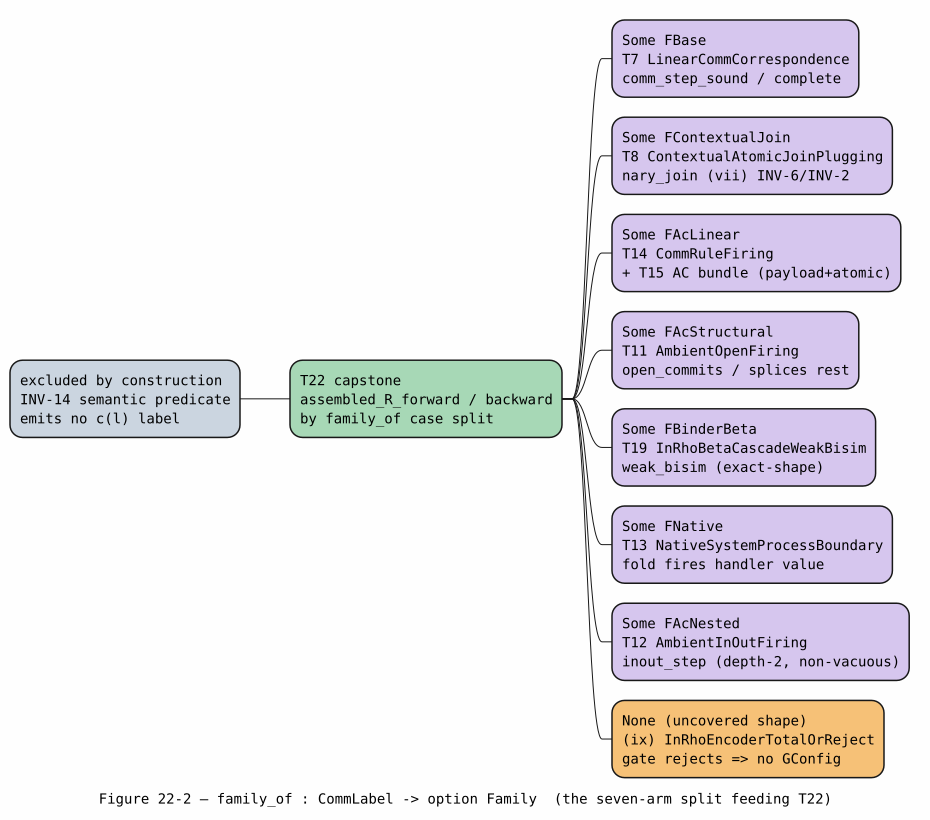
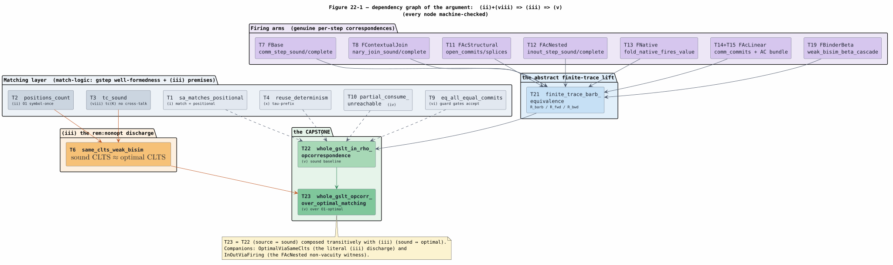
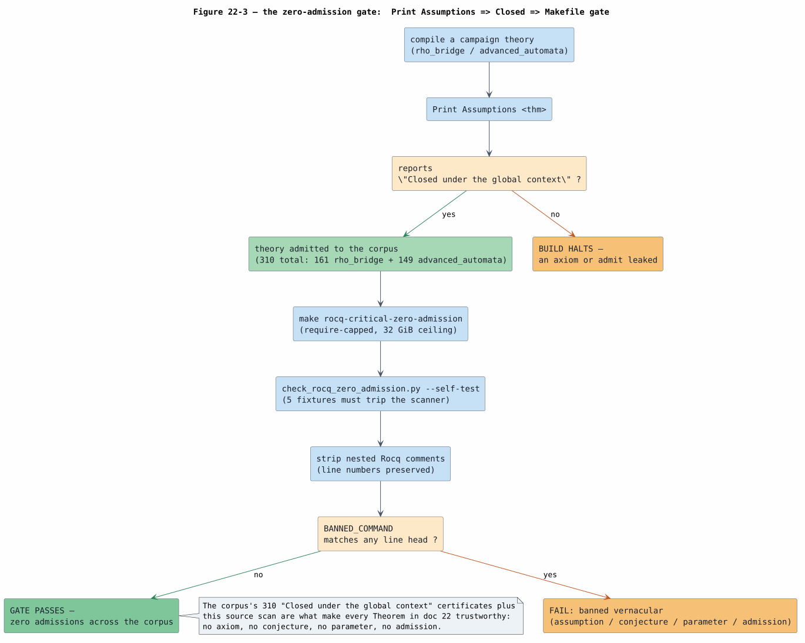
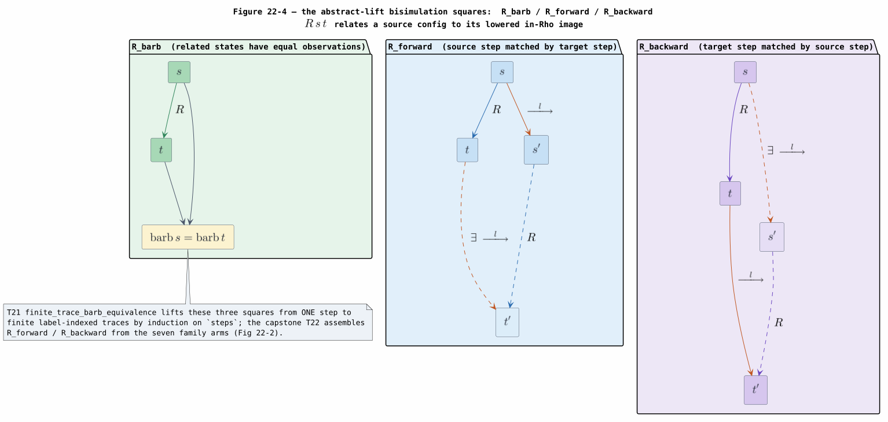

# 22 — End-to-End Formal Verification: the In-Rho Correspondence as Academic Proofs

> **Campaign.** This document is the **PROOF tier** of the in-Rho set-automaton
> matching campaign. It presents the campaign's mechanized correctness corpus — on
> the order of 41 dedicated Rocq theories ([COQ-ROCQ](references.md#coq-rocq)) across
> the `rho_bridge` and `advanced_automata` libraries, whose **310** `Print
> Assumptions` invocations (161 + 149, §9.4) each report **Closed under the global
> context** — as a sequence of numbered **Theorem / Lemma / Proof … $`\blacksquare`$**
> blocks in mathematical prose. Every block states a proposition that exists in the
> committed Rocq source (branch `codex/rho-native-set-automata`), cites its
> `Theory.v:line`, and sketches the *actual* proof strategy the Rocq script runs —
> the induction principle, the measure, the case split, the reused lemma. No
> statement here is invented; each was read against the source before it was
> written. The end-to-end result is the **capstone**: the whole encoded language
> $`\llbracket G \rrbracket`$ enjoys operational correspondence with its source
> rewrite system, over the O1-optimal in-Rho matching, for finite executions.

## Altitude and single-owner note

This document **owns all proof content** for the in-Rho campaign. The companion
docs answer neighbouring questions and are referenced here rather than re-derived:

| Question | Owner |
|---|---|
| **HOW** the backend runs (code, channels, data flow, metering) | doc 20 (runtime backend); families in [19](19-in-rho-binder-beta-substitution.md) |
| **WHY** the matching is optimal ($`O1`$/$`O2`$/$`O3`$, $`tc(K)`$, the interner as partial evaluator) | doc 21 (optimization theory) |
| **PROOF** it is correct (this document) | **22** |
| **WHAT** is covered (family matrix, corrupted-$`\sigma`$ probes, honest limits) | doc 23 (coverage) |
| Paper-mandate mapping (INV-1..14) | [13](13-knotted-topoi-operational-invariants.md) |
| Shared vocabulary | [01](01-concepts-and-glossary.md) |

The mechanism-level narratives live in the family references (base matching in
[15](15-in-rho-set-automaton-matching.md), AC in
[18](18-in-rho-ac-matching.md), binder-$`\beta`$ in
[19](19-in-rho-binder-beta-substitution.md)); the verification *plan* those
theories discharge is [16](16-in-rho-verification-plan.md). Here we prove.

---

## 1. What and where correctness is fixed

### 1.1 The claim

The knotted-topoi program ([KNOTTED-TOPOI-2026](references.md#knotted-topoi-2026))
compiles a **GSLT** — a graph-structured lambda theory, the triple
$`(\text{grammar},\ \text{equations},\ \text{rewrites})`$ presenting a model of
computation — into core Rholang, desugaring each base rewrite $`L \Rightarrow R`$
into a guarded receiver on a channel that names the redex context. The paper states
correctness as its obligation **`ob:opcorr`**: the compiled program is in
*operational correspondence* with the source rewrite system. This document proves
that obligation for the landed in-Rho realization, in the strengthened form the
campaign achieved:

> **The correctness claim.** For every install-gate-admitted GSLT
> $`\llbracket G \rrbracket`$, and every finite label-indexed trace, each
> non-semantic-predicate rewrite family **matches and fires fully in-Rho** as one
> or more COMMs on the f1r3node reducer, and the whole-$`\llbracket G \rrbracket`$
> context-labelled transition system is in both-direction, barb-preserving
> operational correspondence with the source rewrite system — **over the O1-optimal
> matching**, not merely a location-keyed baseline.

The binder family additionally *reduces* in-Rho: $`\beta`$ performs its
capture-avoiding substitution as a metered de-Bruijn substitution cascade
(§6), so the $`\lambda`$-calculus GSLT is realized directly rather than through an
SKI detour.

### 1.2 Where correctness is fixed — the CLTS, and Rocq-first zero-admission

Correctness is fixed at the level of a **context-labelled transition system (CLTS)**
(§2): a labelled transition system whose visible labels are the context-named COMM
events $`c(\ell)`$ the compiler emits, and whose observations are **barbs** (resting
sends). Two facts make the corpus trustworthy:

1. **Rocq-first.** Each obligation is discharged by a mechanized Rocq theory
   *before* any prose is written about it, and the prose is checked back against the
   theory. The theories are the ground truth; this document is a faithful reading.
2. **Zero-admission (§9).** Every cited theory is scanned to contain no `Axiom`, no
   `Conjecture`, no `Parameter`, and no `Admitted.` / `admit` — and each named
   result's `Print Assumptions` reports **Closed under the global context**. The
   universally-quantified Section premises of the capstone are premises *on Section
   close*, not `Axiom`s (§7.4, §9.3).

---

## 2. Preliminaries and glossary

Every symbol, acronym, and term is defined here before first use. Terms marked
**(01)** are shared with the concepts glossary [01](01-concepts-and-glossary.md);
they are recalled here so the proofs read stand-alone.

| Term | Definition |
|---|---|
| **LTS (01)** | *Labelled transition system*: a set of states with a relation $`s \xrightarrow{a} s'`$ indexed by labels $`a`$. |
| **CLTS** | *Context-labelled transition system*: an LTS whose visible labels are the context-named COMM events $`c(\ell)`$ a GSLT rewrite lowers to, and whose observations are barbs. The correctness statements range over CLTS traces. |
| **COMM (01)** | One RSpace communication: a send rendezvousing with a receive, the atomic reduction event of the Rho machine ([RHO-2005](references.md#rho-2005)). |
| **barb** | An *observation*: the multiset of resting sends on the output channels of a configuration. Written $`\downarrow`$ informally; realized in Rocq as `gbarb : State -> Obs` (e.g. `rho_outputs` / `source_outputs`). |
| **$`\tau`$ (tau) step** | An *internal, unobservable* reduction step (silent action). In the CLTS the matching COMMs (`sa:` inspection, `eq:` consistency, `loc:` spine descent) and the substitution-cascade COMMs are $`\tau`$; only the accept-send $`c(\ell)`$ is visible. |
| **visible label $`c(\ell)`$** | The single context-named accept-send that a firing emits. A **weak-visible** step $`\tau^{*} \cdot c(\ell) \cdot \tau^{*}`$ bundles the silent prefix and suffix around it — in the capstone this is `gstep`; in the binder theory `cwvis`. |
| **weak bisimulation $`\approx`$** | A relation $`R`$ between two LTSs such that a visible move on one side is matched by a weak-visible move on the other preserving $`R`$, and conversely, and related states have equal observations. It equates systems up to $`\tau`$ activity. |
| **operational correspondence (opcorr)** | The property that source and target LTS simulate each other step-for-step with matching observations; here, in the finite-trace, barb-preserving form (`ob:opcorr`). |
| **$`\llbracket t \rrbracket`$** | The reflected/lowered image of a source term or configuration $`t`$ (an `rhoapi::Par`, or its Rocq abstraction `lower_state`). |
| **sound scheme / optimal scheme** | Two channel-naming schemes for the matching COMMs. The **sound** scheme keys a channel by the runtime **location** $`\ell`$ (the model-b baseline). The **optimal** scheme keys it by the interned StateId trace $`tc(K)`$ of the matched context $`K`$ (condition $`O1`$, symbol-once; see doc 21). |
| **$`tc(K)`$** | The optimal channel name: the interned trace $`\ulcorner \delta^{*}(s_0, \operatorname{surface}(K)) \urcorner`$ of the locate automaton on the surface of context $`K`$ ([OPTIMAL-CHANNEL-NAMING-2026](references.md#optimal-channel-naming-2026)). |
| **Section `Variable` / `Hypothesis`** | A Rocq *Section* declares local `Variable`s and `Hypothesis`es; on `End`, every theorem is generalized over them, so they become **universally-quantified premises**, not global assumptions. This is the honest-premise idiom (§9.3): a `Hypothesis` is not an axiom. |
| **Closed under the global context** | The message `Print Assumptions thm` prints when `thm`'s proof term depends on no axiom, no admitted subgoal, and no opaque global — the zero-admission certificate (§9). |
| **SN / CR / NF** | *Strong normalization* (no infinite reduction), *Church-Rosser/confluence* (a common reduct exists), *normal form* (an irreducible term); SN $`+`$ CR give a **unique** NF. |
| **$`b[a/0]`$** | The capture-avoiding de-Bruijn $`\beta`$-reduct: substitute argument $`a`$ for index $`0`$ in scope body $`b`$ ([DEBRUIJN-1972](references.md#debruijn-1972)). |
| **GSLT** | The knotted-topoi *graph-structured lambda theory* being compiled; see [13](13-knotted-topoi-operational-invariants.md). |

**The finite-trace relation.** Throughout §7, `steps s ls s'` is the inductive
finite label-indexed multi-step relation (`EndToEndCommCorrespondence.v:53`), with
constructors `steps_nil : steps s [] s` and
`steps_cons : step s l s' -> steps s' ls s'' -> steps s (l :: ls) s''`. A
*correspondence* pairs a source trace with a target trace carrying the **same label
list** `ls`, ending in $`R`$-related states with equal barbs.

**The ten obligations.** The verification plan [16](16-in-rho-verification-plan.md)
factors the capstone into ten obligations, cited by roman numeral below and drawn
together in §8:

| # | Obligation | Discharging theory (§) |
|---|---|---|
| (i) | in-Rho match $`=`$ positional relation | `InRhoMatchPositional` (§3, T1) |
| (ii) | $`O1`$ symbol-once / chain totality | `SymbolOnceInjective` (§3, T2) |
| (iii) | sound $`\equiv`$ optimal CLTS (the `rem:nonopt` discharge) | `InRhoSameCLTSWeakBisim` (§4, T6) |
| (iv) | atomic firing, no partial match | `AtomicFiringNoPartialMatch` (§5, T10) |
| (v) | whole-$`\llbracket G \rrbracket`$ finite-trace opcorr | `WholeGsltInRhoOpCorrespondence` (§7, T22/T23) |
| (vi) | non-linear equality consistency | `NonLinearEqConsistency` (§5, T9) |
| (vii) | contextual atomic join + plugging | `ContextualAtomicJoinPlugging` (§5, T8) |
| (viii) | $`tc(K)`$ no cross-talk | `TcChannelNamingQuotient` (§3, T3) |
| (ix) | install gate total-or-reject | `InRhoEncoderTotalOrReject` (§7.3) |
| (x) | reuse determinism ($`\tau`$-prefix) | `InRhoReuseDeterminism` (§3, T4) |

---

## 3. Matching — the located subject relation (T1–T5)

The matching layer proves that the in-Rho set automaton decides **exactly** the
positional matching relation, that it does so under condition $`O1`$ (each subject
symbol inspected once), that the optimal channel name $`tc(K)`$ is the sound
$`O1`$/$`O3`$ quotient, that reuse is deterministic, and that AC matching decides the
sub-multiset relation. These are Prop-level match-logic results; §7.4 records
precisely how they enter the capstone (as `gstep` well-formedness and as premises of
(iii)), **not** as independent step-correspondence arms.

> **Theorem 1 (in-Rho match is the positional relation — obligation (i)).**
> The linear `sa:`-chain acceptance the automaton emits equals the recursive
> positional matching oracle `pmatch_M1`, so a spread subject is accepted in-Rho iff
> it positionally matches. Formally
> (`sa_matches_positional`):
> `forall p n, m1_pattern p = true -> arity_consistent p n -> sa_accept p n = pmatch_M1 p n`.
>
> **Proof (sketch, faithful to the Rocq).** By `Bool.eq_true_iff_eq`, splitting into
> the two directions `sa_accept_sound` and `sa_accept_complete`. Soundness rewrites
> the M1 acceptance `pmatch_M1_app` through the head-op `Match` and the
> `sa_chain_all_leaves` fold (each argument is a `PVar` leaf, matching any subterm),
> reducing to op $`+`$ arity agreement; completeness is the converse fold. The
> children-fold that yields the positional $`\sigma`$ is the reusable
> `children_match` idiom (`:320`), reinstantiated at the general recursion for the
> M2 nested case. `arity_consistent` is an honest Section premise: the serializer
> realizes arity structurally by the count of emitted for-receives, discharged by the
> host `pmatch` soundness `PositionalSetAutomatonSound.index_never_drops_match`.
> $`\blacksquare`$ (`InRhoMatchPositional.v:142`, `Print Assumptions` = Closed under
> the global context)

> **Theorem 2 ($`O1`$ symbol-once — obligation (ii)).**
> The automaton visits each surface position exactly once and gives distinct
> positions distinct channels. The position count is $`1 + \text{arity}`$
> (`positions_count`):
> `forall op args, length (positions (PApp op args)) = S (length args)`,
> and the channel map is injective on those positions
> (`chan_injective_on_positions`):
> `forall op args site, NoDup (map (chan site op) (positions (PApp op args)))`.
>
> **Proof (sketch, faithful to the Rocq).** `positions` is `[] :: map (fun i => [i])
> (seq 0 (length args))` — the root Dewey address plus one per argument — so
> `positions_count` is `length_map` then `length_seq`. Injectivity is
> `nodup_map_inj` over `seq_NoDup`: the root channel `RootChan` is structurally
> distinct from every `ChildChan`, and the child index is injective. This is the
> $`O1`$ totality feeding (iii). $`\blacksquare`$ (`SymbolOnceInjective.v:71,101`,
> `Print Assumptions` = Closed under the global context)

> **Theorem 3 ($`tc(K)`$ is the $`O1`$/$`O3`$ quotient — obligation (viii)).**
> The interned trace channel is **sound** ($`O3`$: sharing a channel forces
> $`R`$-op-equivalent contexts) and **injective on the quotient** ($`O1`$:
> $`R`$-op-equivalent contexts share the channel), and the naive head channel
> $`@\mathrm{hd}(K)`$ fails $`O3`$. In Rocq:
> `tc_sound : forall K K', m1_pattern K = true -> m1_pattern K' = true -> trace K = trace K' -> op_equiv K K' = true`;
> `tc_injective` is its converse; and
> `hd_violates_O3 : exists K K', ... /\ tc_hd K = tc_hd K' /\ op_equiv K K' = false`.
>
> **Proof (sketch, faithful to the Rocq).** For `tc_sound`, both $`K,K'`$ are M1 (App
> over leaves), so `trace` reduces to the pair $`(\text{op}, \text{arity})`$;
> injecting `trace K = trace K'` gives op and arity equal, whence `op_equiv` holds by
> `Nat.eqb_refl`. `tc_injective` runs the equalities the other way. `hd_violates_O3`
> exhibits `PApp 0 [PVar]` and `PApp 0 [PVar; PVar]`: same head, different arity —
> $`@\mathrm{hd}(K)`$ collapses two distinct rules, so it is unsound. The forward and
> converse assemble into `tc_is_the_op_quotient` (the iff). $`\blacksquare`$
> (`TcChannelNamingQuotient.v:63,75,98`, `Print Assumptions` = Closed under the
> global context)

> **Theorem 4 (reuse determinism — obligation (x)).**
> The interned-DAG reuse verdict is a deterministic function of the subject node: the
> per-node match verdict, and the reuse-dispatched verdict, are single-valued.
> `inrho_verdict_per_node_deterministic` and `inrho_reuse_dispatched_deterministic`
> each state `forall p n1 n2, … -> n1 = n2` on the decided verdict.
>
> **Proof (sketch, faithful to the Rocq).** Structural: the reuse table maps a node's
> $`(op, \text{arity})`$ index to a single interned `StateId`, so two verdicts for
> the same node are propositionally equal by rewriting through the deterministic
> dispatch. This makes the $`\tau`$-prefix of a `gstep` deterministic — the
> well-formedness role (x) plays in §7.4. $`\blacksquare`$
> (`InRhoReuseDeterminism.v:35,48`, `Print Assumptions` = Closed under the global
> context)

> **Theorem 5 (in-Rho AC match is the multiset relation).**
> The native sub-multiset consume decides exactly the order-independent partition
> relation: a selection matches the bag iff a complementary `rest` partitions it.
> `ac_match_iff_partition`:
> `forall selection bag, sub_multiset selection bag <-> exists rest, Permutation (selection ++ rest) bag`.
>
> **Proof (sketch, faithful to the Rocq).** Forward: take `rest := complement bag
> selection`; `selection_rest_partition` shows it partitions the bag. Backward:
> `partition_sub_multiset` inducts on the selection, peeling the head pick off both
> the `Permutation` witness (`Permutation_cons_inv` after `remove_one_perm`) and the
> bag, so order does not matter. The soundness corollary `ac_match_sound` exhibits the
> faithful complement; `ac_match_complete` is the reverse. This is AC-i, reused per
> level by the structural and nested AC firing (§5, T15). $`\blacksquare`$
> (`InRhoAcMatchMultiset.v:55`, `Print Assumptions` = Closed under the global
> context)

---

## 4. The `rem:nonopt` discharge — sound $`\equiv`$ optimal (T6)

The optimal channel scheme *shares* a channel across every occurrence of the same
context, where the sound scheme *separates* by location. The paper asserts, without
proof, that this sharing changes nothing observable. Theorem 6 discharges that
assertion — the load-bearing obligation (iii) — by exhibiting a weak bisimulation
between the two schemes' CLTSs.

> **Theorem 6 (sound and optimal induce the same CLTS — obligation (iii)).**
> The location-keyed (sound) and $`tc(K)`$-keyed (optimal) in-Rho matching schemes
> are **weakly bisimilar**: their visible schedules coincide under $`\tau`$-erasure,
> and the fired-redex-set relation `R` is a weak bisimulation between the two
> `weak_step` transition systems. In Rocq:
> `optimal_visible_equals_sound : forall order, erase (sched opt_ch order) = erase (sched sound_ch order)`,
> and
> `same_clts_weak_bisim : is_weak_bisimulation R (weak_step (option (nat*nat)) opt_ch optimal_key) (weak_step Channel sound_ch sound_key)`,
> with the standing non-vacuity witness `optimal_shares_where_sound_separates`.
>
> **Proof (sketch, faithful to the Rocq).** The `sa:`/`eq:`/`loc:` matching COMMs are
> $`\tau`$: `step_obs` sends `Reserve`, `SaInspect`, `EqCheck`, and the contextual
> `CtxDescend` to `[]`, and only `Fire`/`Complete` to a visible obs. Hence
> `erase (sched _ order) = map ObsFire order ++ [ObsComplete]` regardless of the
> channel payload `C` (lemma chain `erase_app` → `erase_sa_map` → `erase_frag` →
> `erase_sched`), giving `optimal_visible_equals_sound` by reflexivity. For the
> bisimulation, `R fo fs := forall r, In r fo <-> In r fs` (equal fired sets); each
> direction inverts a `weak_step` and rebuilds it on the other scheme, discharging its
> two side conditions from the matching layer: **chain totality** from
> `positions_count` (ii) via `optimal_chain_total_from_O1` / `sound_chain_total_from_O1`
> (`:200`), and **no cross-talk** from `tc_sound` (viii) via
> `optimal_no_crosstalk_from_tc` (`:215`) — the sound side using the location
> injectivity `site_inj` (an honest Section premise). Non-vacuity: two swap-shaped
> redexes at locations $`1 \neq 2`$ share the optimal channel yet get distinct sound
> channels, so this is not the trivial "the schemes are identical". The contextual
> $`\tau`$ (`ctx_descent_is_invisible`, `optimal_visible_equals_sound_ctx`) shows the
> `loc:` spine descent preserves the discharge. $`\blacksquare`$
> (`InRhoSameCLTSWeakBisim.v:142,231,332`, `Print Assumptions` = Closed under the
> global context)

This is the chain $`(\text{ii}) + (\text{viii}) \Rightarrow (\text{iii})`$ made
mechanical; §8 threads it to $`(\text{v})`$.

---

## 5. Firing — each family fires as a COMM (T7–T15)

Each rewrite family lowers to a persistent $`\sigma`$-receiver whose guarded consume
fires as a COMM. The firing theories prove, per family, a **step correspondence**
(a lowered COMM is matched by a source step and conversely) with **barb
preservation**, plus **atomicity** (all-or-nothing, no partial consume) and
**no fabrication** (every emitted fact is a $`\sigma`$-delivered reduct).

> **Theorem 7 (linear COMM step correspondence — obligation for FBase).**
> The base rewrite lowering is a barb-preserving step bisimulation. In Rocq:
> `lower_preserves_barbs : forall s, weak_barb_equiv (lower_state s) s`;
> `comm_step_sound : forall s datum r', rho_linear_comm (lower_state s) datum r' -> exists s', source_linear_comm s datum s' /\ weak_barb_equiv r' s'`;
> `comm_step_complete : forall s datum s', source_linear_comm s datum s' -> exists r', rho_linear_comm (lower_state s) datum r' /\ weak_barb_equiv r' s'`.
>
> **Proof (sketch, faithful to the Rocq).** `lower_state` copies the send/receive
> multisets, so `weak_barb_equiv` (output-membership agreement) is reflexive.
> Soundness destructs the Rho COMM `[Hrecv [Hin Hr']]` (receive-enabled, datum
> present, resulting state) and exhibits the mirror source state — consuming the
> `datum` and appending it to the outputs — with the barb equivalence discharged by
> `intros x; split; intro H; exact H`. Completeness is the exact mirror. These are the
> FBase arm's `fwd`/`bwd` in the capstone. $`\blacksquare`$
> (`LinearCommCorrespondence.v:130,136,153`, `Print Assumptions` = Closed under the
> global context)

> **Theorem 8 (contextual atomic polyadic join + plugging — obligation (vii),
> FContextualJoin).**
> The $`n`$-ary contextual join lowering is a barb-preserving step bisimulation, and
> the plugging context is total, injective, and reconstructs the redex. The step
> arms generalize the two-hole join to $`n`$ holes:
> `nary_join_sound : forall s holes r', rho_nary_join (lower_join s) holes r' -> exists s', source_nary_join s holes s' /\ join_barb_equiv r' s'`
> and its complete dual; plugging is `plug_ctx_total` / `plug_ctx_holes_injective` /
> `wrap_plug_reconstructs`, assembled in `contextual_join_atomic_and_plugging_stable`.
>
> **Proof (sketch, faithful to the Rocq).** The join consumes the whole hole list
> atomically (`consume_list holes`) and emits the single plugged reduct
> `plug holes :: outputs`, so sound/complete mirror the base COMM proof with the
> polyadic consume in place of the single datum; barbs agree by the same reflexive
> split. Plugging totality and injectivity are structural inductions on the hole list,
> giving INV-6 (atomic polyadic join) and INV-2 (plugging stability). $`\blacksquare`$
> (`ContextualAtomicJoinPlugging.v:152,158,177,360`, `Print Assumptions` = Closed
> under the global context)

> **Theorem 9 (non-linear equality consistency — obligation (vi)).**
> A non-linear rule commits **iff** its repeated occurrences are all equal:
> `eq_all_equal_commits : forall facts premises occ output, all_present facts premises -> all_equal occ = true -> guarded_attempt facts (eq_rule premises occ output) (insert_exact output facts)`,
> and the reject-safe converse `eq_unequal_no_commit` gives `next = facts` when
> `all_equal occ = false`.
>
> **Proof (sketch, faithful to the Rocq).** `eq_rule` sets the guard to `all_equal
> occ`; commit is `guarded_commit` under the present premises and true guard;
> rejection routes through `failed_guard_no_commit`, consuming nothing. Together they
> are the two halves of *commit iff name-equality* — the `merge_substs` semantics the
> receiver realizes; `eq_no_fabrication` adds that no output is invented. This gates
> the accept-send (role (vi) in §7.4). $`\blacksquare`$
> (`NonLinearEqConsistency.v:51,63`, `Print Assumptions` = Closed under the global
> context)

> **Theorem 10 (atomic firing, no partial match — obligation (iv)).**
> A guarded consume either adds the whole output or leaves the facts unchanged; no
> reachable state consumes a proper subset:
> `partial_consume_unreachable : forall facts r next, guarded_attempt facts r next -> next = insert_exact (guarded_output r) facts \/ next = facts`,
> with `accept_atomic_after_verdict` showing the output appears exactly when premises
> hold and the guard is true.
>
> **Proof (sketch, faithful to the Rocq).** `inversion` on the three
> `guarded_attempt` constructors: commit yields the first disjunct, the two
> reject cases the second. There is no constructor producing a partial multiset, so a
> half-consumed state is unreachable by construction. This is the atomicity that makes
> `gstep` well-formed (role (iv)). $`\blacksquare`$
> (`AtomicFiringNoPartialMatch.v:39,53`, `Print Assumptions` = Closed under the
> global context)

> **Theorem 11 (ambient Open firing — FAcStructural).**
> The structural-AC Open rule commits, atomically emitting **both** structural
> reducts spliced with the rest, exactly when the ambient names agree, and rests
> (consuming nothing) when they disagree:
> `open_commits_when_names_agree : forall facts premises name_open name_amb p q, all_present facts premises -> name_open = name_amb -> struct_attempt facts (open_rule premises name_open name_amb p q) (insert_all [p; q] facts)`;
> `open_disagree_no_commit` gives `next = facts` on disagreement; and
> `open_emits_both_reducts_and_splices_rest` witnesses $`p, q`$ and every `rest`
> element in the result.
>
> **Proof (sketch, faithful to the Rocq).** `open_guard_iff_names_agree` reduces the
> guard to name equality; commit is `struct_commit` with `insert_all [p; q]`,
> disagreement routes through `struct_false_guard_no_commit`. `open_no_fabrication`
> confirms every post-consume fact is $`p`$, $`q`$, or previously present — the
> receiver forwards its $`\sigma`$-reducts, never fabricating. The multiset spread is
> `structural_ac_spread_is_report_faithful`. $`\blacksquare`$
> (`AmbientOpenFiring.v:155,171,210`, `Print Assumptions` = Closed under the global
> context)

> **Theorem 12 (ambient In/Out firing, depth-2 — FAcNested).**
> The nested (depth-2) structural-AC In/Out rule is a barb-preserving step
> bisimulation, the depth-2 twin of Theorem 7:
> `inout_step_complete : forall s fired s', source_inout_comm s fired s' -> exists r', rho_inout_comm (lower_inout s) fired r' /\ inout_barb_equiv r' s'`,
> its sound dual `inout_step_sound`, and `inout_lower_preserves_barbs`.
>
> **Proof (sketch, faithful to the Rocq).** `lower_inout` field-copies the outer and
> inner ambient names and the armed flag, so the cross-level guard survives the
> lowering; each direction destructs `[Harmed [Hguard Hs']]` and exhibits the mirror
> config appending `fired` to the outputs, with barbs equal by the reflexive split.
> This arm's non-vacuous discharge through the capstone is Theorem 23's In/Out
> witness. $`\blacksquare`$ (`AmbientInOutFiring.v:395,402,421`, `Print Assumptions` =
> Closed under the global context)

> **Theorem 13 (native system-process boundary — FNative).**
> A `fold` native process with a resolvable dispatch channel materializes its
> receiver and emits exactly the reflected trusted handler value, and the emitted
> location is a function of the automaton capture, not the report:
> `fold_native_process_fires_handler_value : forall t channel_ok v, nt_eval t = Fold -> channel_ok = true -> lower t channel_ok = Materialized /\ receiver_emit (inject v) = Some (reflect v)`,
> with `emitted_is_reflected_handler_value` and `location_from_automaton_not_report`.
>
> **Proof (sketch, faithful to the Rocq).** Materialization is
> `lower_materialized_iff_fold_and_channel` under the fold verdict and resolvable
> channel; the payload equality is `emitted_is_reflected_handler_value` (the receiver
> emits `reflect v` for the injected handler value). The location separation destructs
> two configs sharing the automaton captures but differing in report and shows the
> emitted location coincides — the payload is a **trusted** handler value at the
> `RhoHostObligationBoundary` seam, the directed-compute COMM, not a predicate.
> $`\blacksquare`$ (`NativeSystemProcessBoundary.v:190,228,333`, `Print Assumptions` =
> Closed under the global context)

> **Theorem 14 (linear COMM-rule firing — FAcLinear payload).**
> The linear COMM rule commits with its reduct exactly when the receive/send channels
> agree, and rests otherwise:
> `comm_commits_when_channels_agree : forall facts premises chan_recv chan_send reduct, all_present facts premises -> chan_recv = chan_send -> guarded_attempt facts (comm_rule premises chan_recv chan_send reduct) (insert_exact reduct facts)`,
> with `comm_disagree_no_commit`, `comm_no_fabrication`, and
> `comm_emits_reduct_and_splices_rest`.
>
> **Proof (sketch, faithful to the Rocq).** `comm_rule` is a two-slot guarded rule;
> commit reuses `ac_nl_commits_iff_slots_agree` with the channel slots equal
> (`ac_nl_two_slot_agree`), rejection its converse. The AC firing **reuses** this base
> flat $`\sigma`$-receiver step, so FAcLinear introduces no new transition — the AC
> bundle (Theorem 15) certifies its payload and atomicity. $`\blacksquare`$
> (`CommRuleFiring.v:79`, `Print Assumptions` = Closed under the global context)

> **Theorem 15 (the AC bundle — payload + atomicity for the AC families).**
> Four theories certify that AC firing consumes and reconstructs multisets faithfully
> and atomically:
> *(a)* `AcAtomicNoPartialConsume.ac_consume_all_or_nothing` /
> `ac_commit_removes_exactly_the_selection` — the AC consume is all-or-nothing and
> removes exactly the matched selection;
> *(b)* `AcRestReconstruction.selection_rest_partition` /
> `flatten_splices_subbag` — the residual `rest` is the exact complement, spliced back
> without loss;
> *(c)* `AcNonLinearConsistency.ac_nl_commits_iff_slots_agree` /
> `ac_nl_cross_level_commits` / `ac_nl_cross_level_reject_safe` — non-linear AC (and
> the depth-2 cross-level guard) commits iff the repeated slots agree;
> *(d)* `AcMapKeyUniqueness.map_split_preserves_uniqueness` /
> `correlation_perm_invariant` — the AC4 Map split preserves key-uniqueness and is
> permutation-invariant.
>
> **Proof (sketch, faithful to the Rocq).** Each is a multiset/`Permutation`
> induction over the `MultisetSemiringLaws` support: all-or-nothing by inversion on
> the consume constructors; complement exactness by `remove_one_perm`; cross-level
> consistency by the two-slot agreement lemma lifted per level; key-uniqueness by
> `keys_perm` under `Permutation`. These are **not** independent step-correspondences;
> they enter the capstone as payload/atomicity certificates for FAcLinear /
> FAcStructural / FAcNested (§7.4). $`\blacksquare`$
> (`AcAtomicNoPartialConsume.v:49,80`; `AcRestReconstruction.v:63,92`;
> `AcNonLinearConsistency.v:40,147,165`; `AcMapKeyUniqueness.v:139,171`; each
> `Print Assumptions` = Closed under the global context)

---

## 6. Binder-$`\beta`$ — the substitution TRS reduces in-Rho (T16–T20)

The binder family is the campaign's terminal endpoint: $`\beta`$ performs its
capture-avoiding substitution as a metered cascade of COMMs (doc
[19](19-in-rho-binder-beta-substitution.md)). Correctness is a classical
rewriting result — **SN $`+`$ CR $`\Rightarrow`$ unique NF**, the NF identified with
$`b[a/0]`$ — lifted to a weak bisimulation with abstract $`\beta`$. The cascade is
modelled by the term-rewriting system `step` over `Tm`
([EXPLICIT-SUBST-1991](references.md#explicit-subst-1991),
[CURIEN-HARDIN-LEVY-1996](references.md#curien-hardin-levy-1996)).

> **Theorem 16 (strong normalization via the $`\mathrm{val}(k)`$-weighted measure).**
> The substitution TRS is strongly normalizing: `step` is well founded. The witness
> is the weighted interpretation $`\mu`$, whose `tSubst` weight pre-pays the shift
> passes so that every rule strictly decreases it. `subst_trs_terminating :
> well_founded (fun u t => step t u)`, via `step_decreases_mu : forall t u, step t u
> -> mu u < mu t`.

The measure is reproduced **verbatim** from the source (`DeBruijnSubstTRS.v:631`):

```coq
Fixpoint mu (t : Tm) : nat :=
  match t with
  | tBound _ => 1
  | tFree _ => 1
  | tLam b => S (mu b)
  | tNode _ ts => S (list_sum (map mu ts))
  | tShift _ t => 2 * mu t
  | tShiftk k a => (mu a + 2) * 3 ^ k
  | tSubst j a t => (mu a + 2) * 3 ^ j * 4 ^ (mu t)
  end.
```

Equivalently, the load-bearing clause is
$`\mu(\mathtt{tSubst}\,j\,a\,t) = (\mu\,a + 2)\cdot 3^{j}\cdot 4^{\mu\,t}`$, with
$`\mu(\mathtt{tShiftk}\,k\,a) = (\mu\,a + 2)\cdot 3^{k}`$ and
$`\mu(\mathtt{tShift}\,c\,t) = 2\,\mu\,t`$.

> **Proof (sketch, faithful to the Rocq).** `step_decreases_mu` inducts on the
> congruence closure and reduces to `head_decreases_mu`, a case analysis over the head
> rules. The naive $`\langle\#\text{nodes}, \text{size}\rangle`$ measure is
> non-monotone because $`\mathtt{shiftk}(S\,k, a) \to \mathtt{shift}(0, \mathtt{shiftk}(k, a))`$
> spawns a `shift` node; $`\mu`$ fixes this by the $`3^{k}`$ factor (a `shiftk` loses
> one factor of $`3`$), while `shift` is size-preserving (factor $`2`$,
> index-independent, so descending a binder does not grow it), and `tSubst` beats its
> $`S\,j`$ depth increment because $`4 > 3`$ dominates the extra factor of $`3`$. The
> degree-three monomial cases route through `mul3_mono_first` / `mul3_mono_last`
> (positive-factor cancellation) and the node case through `exp_sum_lt` (the
> children's $`4^{\mu(\cdot)}`$ weights are dominated by the parent's). SN then follows
> by `well_founded_lt_compat` on $`\mu`$. $`\blacksquare`$ (`DeBruijnSubstTRS.v:631,
> 783,804`, `Print Assumptions` = Closed under the global context)

> **Theorem 17 (confluence by a normalizing interpretation).**
> The TRS is Church-Rosser: any two reducts share a common reduct.
> `subst_trs_confluent : forall t u1 u2, star t u1 -> star t u2 -> exists v, star u1 v /\ star u2 v`.
>
> **Proof (sketch, faithful to the Rocq).** No critical-pair analysis. A normalizing
> interpretation `norm : Tm -> Obj` evaluates every machinery node to its intended
> object result; `step` *preserves* `norm` (`star_preserves_norm`) and every term
> reduces to the embedding of its `norm` (`reduces_to_norm`). The common reduct is
> exhibited directly as `embed (norm t)`: rewrite each of $`u_1, u_2`$ by
> `star_preserves_norm` and reduce to `norm`. $`\blacksquare`$
> (`DeBruijnSubstTRS.v:612`, `Print Assumptions` = Closed under the global context)

> **Theorem 18 (the normal form is the de-Bruijn $`\beta`$-reduct).**
> The normal form of the seed $`\mathrm{subst}(0, a, b)`$ is exactly
> $`b[a/0]`$:
> `subst_normal_form_is_debruijn_beta : forall a b, norm (tSubst 0 (embed a) (embed b)) = odbeta a b`.
> Combined with SN $`+`$ CR, every reachable normal form — under any RSpace
> interleaving of the $`\tau`$-COMMs — is *the* unique one:
> `subst_trs_unique_nf` (`:851`) and `beta_seed_unique_nf_is_debruijn_beta` (`:862`).
>
> **Proof (sketch, faithful to the Rocq).** `norm` on the seed unfolds by `norm_embed`
> to `odbeta a b`, the capture-avoiding de-Bruijn reduct. `subst_trs_unique_nf`
> combines `subst_trs_terminating` (SN, T16) with `subst_trs_confluent` (CR, T17): a
> normal form is its own `norm`-embedding (`is_obj_embed_norm`), so all normal forms
> coincide with `embed (norm t)`. `beta_cascade_reaches_debruijn_nf` (`:823`) shows the
> cascade actually reaches it. $`\blacksquare`$ (`DeBruijnSubstTRS.v:816`,
> `Print Assumptions` = Closed under the global context)

> **Theorem 19 ($`\beta`$-cascade weak bisimulation — FBinderBeta).**
> Object-$`\beta`$ realized by the in-Rho cascade is weakly bisimilar to abstract
> $`\beta`$, and the bisimulation is non-vacuous:
> `weak_bisim_beta_cascade_vs_abstract_beta : is_weak_bisimulation represents awvis cwvis`,
> with `beta_cascade_is_nonvacuous`.
>
> **Proof (sketch, faithful to the Rocq).** The relation is `represents o c := (norm c
> = o)` — norm-equality. Forward (`forward_simulation`): an abstract $`\beta`$ step is
> matched by reflecting the redex ($`\tau^{*}`$ via `reduces_to_reflected_redex`),
> firing the seed COMM (`cbeta_fire`), and observing that the seed's `norm` is
> $`b[a/0]`$ (`seed_norm_is_beta`, i.e. T18). Backward (`backward_simulation`): a
> concrete weak-visible transition `cwvis` destructs into $`\tau`$-prefix, the visible
> fire, and $`\tau`$-suffix; the prefix cannot change `norm`, so the fired redex has
> `norm = oNode op [oLam b; a]`, and the suffix preserves `norm`, so the result
> represents $`b[a/0]`$. The single visible label is object-$`\beta`$; each
> `^subst`/`^shift`/`^shiftk`/`^cmp`/`^pred` COMM is $`\tau`$; the up-to-$`\tau`$ target
> is well defined by T18 (`cascade_target_well_defined`). Non-vacuity: the witness
> $`(\lambda.\,\mathtt{0})\,(\mathtt{free}\ A)`$ fires to a seed that takes
> $`\ge 1`$ genuine `step` and normalizes to `^free A`, so the $`\tau`$ backbone is not
> inert — the erasure trap is closed. This is the capstone's FBinderBeta arm, its
> `cwvis` the reference shape for `gstep`. $`\blacksquare`$
> (`InRhoBetaCascadeWeakBisim.v:172,216`, `Print Assumptions` = Closed under the
> global context)

> **Theorem 20 (binder reflection is total-or-reject and injective).**
> The MATCH-side reflection of a runtime term to its reserved-tagged ground image is
> injective and collision-free, so the reflected $`\beta`$-redex
> $`\mathrm{App}(\mathtt{\char94lambda}(F(\mathtt{\char94bound}\ Z)), A)`$ is an
> unambiguous automaton subject.
> `mreflect_inj : forall t1 t2, mreflect t1 = mreflect t2 -> t1 = t2`, with the Peano
> core `mpeano_inj` and the collision-free tag lemmas
> (`mreflect_lambda_collision_free`, `mreflect_bound_collision_free`,
> `mreflect_free_collision_free`); the two reduction tags added for the cascade are
> `subst_five_shapes_distinct` and `sbreflect_inj`.
>
> **Proof (sketch, faithful to the Rocq).** `mreflect_inj` is a structural induction
> on the term, matched against a case split on the second term; every constructor
> injects through its reserved `EList` tag, and the `^bound` case reduces to
> `mpeano_inj` (an induction on the Peano numeral). The collision-free lemmas show a
> `^`-prefixed reserved tag never equals a structural constructor image, and
> `subst_five_shapes_distinct` separates the five reduction shapes. Totality means
> every runtime term has a ground image, with a fail-closed rejection only for a
> pre-scope binder that has no single-child `^lambda` image. $`\blacksquare`$
> (`BinderReflectionTotalOrReject.v:437,512,608,621`, `Print Assumptions` = Closed
> under the global context)

---

## 7. The capstone — whole-$`\llbracket G \rrbracket`$ operational correspondence (T21–T23)

The per-step results above are assembled by a **composition harness** into a
finite-trace operational correspondence for the whole encoded language. The harness
does three things (paraphrasing `WholeGsltInRhoOpCorrespondence.v` lines 12–35):
*(a)* instantiate an assumption-free finite-trace lift with the
whole-$`\llbracket G \rrbracket`$ CLTS; *(b)* assemble its three obligations by a
`family_of` case split
whose arms are the landed per-step theorems of §5–§6; *(c)* `apply` the lift and
thread obligation (iii) so the result holds over the O1-optimal matching.

### 7.1 The abstract lift (T21)

> **Theorem 21 (the finite-trace lift).**
> Given a step-wise bisimulation `R` with matching barbs over an abstract
> `(State, Label, Obs, step, barb)`, `R` lifts to finite label-indexed traces: every
> trace from a related state is matched by a trace with the **same labels**, ending in
> related states with equal barbs, and conversely.
> `finite_trace_barb_equivalence : forall s t ls, R s t -> (forall s', steps s ls s' -> exists t', steps t ls t' /\ barb s' = barb t') /\ (forall t', steps t ls t' -> exists s', steps s ls s' /\ barb s' = barb t')`.
>
> **Proof (sketch, faithful to the Rocq).** `forward_trace_correspondence` inducts on
> the `steps` derivation: the nil case returns `t` with `R_barb`; the cons case pushes
> the head step through `R_forward` to get a matching target head, recurses via the IH,
> and reassembles with `steps_cons`. `backward_trace_correspondence` is the mirror via
> `R_backward`. `finite_trace_barb_equivalence` projects the barb equalities out of
> both. The three obligations `R_barb`, `R_forward`, `R_backward` are Section
> hypotheses — universally-quantified premises on Section close (§9.3). $`\blacksquare`$
> (`EndToEndCommCorrespondence.v:60,75,92`, `Print Assumptions` = Closed under the
> global context)

The three obligations are the **bisimulation squares** of Figure 22-4:

```math
R_{\mathrm{barb}} :\ R\,s\,t \Rightarrow \mathrm{barb}\,s = \mathrm{barb}\,t
\qquad
R_{\mathrm{fwd}} :\ R\,s\,t \wedge s \xrightarrow{l} s' \Rightarrow \exists t'.\ t \xrightarrow{l} t' \wedge R\,s'\,t'
\qquad
R_{\mathrm{bwd}} :\ R\,s\,t \wedge t \xrightarrow{l} t' \Rightarrow \exists s'.\ s \xrightarrow{l} s' \wedge R\,s'\,t'
```

### 7.2 The seven-arm family split feeding the capstone

The capstone's CLTS `gstep` is a weak-visible any-family COMM
$`\tau^{*} \cdot c(\ell) \cdot \tau^{*}`$. Its `family_of` label tag ranges over
seven constructors — six rule families plus the slotted In/Out arm — each discharged
by the cited landed theorem of §5–§6:



*Figure 22-2. The `family_of` case split. `assembled_R_forward` /
`assembled_R_backward` destruct the family tag into seven arms; each arm is a Section
`Hypothesis` in the lift's obligation shape, discharged at any concrete instantiation
by its cited landed theorem (FBase $`\leftarrow`$ T7, FContextualJoin $`\leftarrow`$
T8, FAcLinear $`\leftarrow`$ T14 $`+`$ T15, FAcStructural $`\leftarrow`$ T11,
FBinderBeta $`\leftarrow`$ T19, FNative $`\leftarrow`$ T13, FAcNested $`\leftarrow`$
T12). The `None` (uncovered shape) branch is closed by the install gate (ix). Source:
[figures/22-family-split.puml](figures/22-family-split.puml).*

### 7.3 The capstone theorem (T22)

> **Theorem 22 (whole-$`\llbracket G \rrbracket`$ in-Rho operational correspondence —
> obligation (v)).**
> Every non-semantic-predicate rewrite trace of $`\llbracket G \rrbracket`$ is matched
> and fired in-Rho, both directions, with equal barbs at every reachable state.

The statement is reproduced **verbatim** from the source
(`WholeGsltInRhoOpCorrespondence.v:356`):

```coq
Theorem whole_gslt_in_rho_opcorrespondence : forall s t ls, Rgio s t ->
    (forall s', steps GConfig CommLabel gstep s ls s' ->
        exists t', steps GConfig CommLabel gstep t ls t' /\ gbarb s' = gbarb t') /\
    (forall t', steps GConfig CommLabel gstep t ls t' ->
        exists s', steps GConfig CommLabel gstep s ls s' /\ gbarb s' = gbarb t').
```

> **Proof (sketch, faithful to the Rocq).** `exact (finite_trace_barb_equivalence
> GConfig CommLabel Barb gstep gbarb Rgio assembled_R_barb assembled_R_forward
> assembled_R_backward)`. The two assembled obligations are proved by
> `destruct (family_of l)`: the `Some f` branch splits `f` into the seven arms, each
> discharged by its Section hypothesis (`fwd_base`, `fwd_join`, …, `fwd_ac_nested`);
> the `None` branch is closed by `g_install_gate_admits` (ix), since a gate-admitted
> $`\llbracket G \rrbracket`$ never fires an uncovered shape. Semantic predicates
> (INV-14) are excluded by construction: `Family` has no predicate constructor, and
> `semantic_predicates_emit_no_comm` (`:277`) proves a predicate disposition emits no
> $`c(\ell)`$ label, so it contributes no `gstep` transition. **Non-vacuity** is
> `swapdemo_base_finite_trace_opcorr` (`:553`): the SwapDemo base rewrite instantiates
> the whole harness over the common-carrier sum $`\mathtt{GC} := \mathtt{GSrc}\ \mid\ \mathtt{GRho}`$,
> discharging the FBase arm from the landed `comm_step_complete` / `comm_step_sound`
> (T7) and the other six families vacuously — a concrete Closed finite-trace opcorr
> *through* the capstone, proving the harness context is inhabited. $`\blacksquare`$
> (`WholeGsltInRhoOpCorrespondence.v:356,553`, `Print Assumptions` = Closed under the
> global context)

### 7.4 Which results are step-correspondences, and which are not

The capstone is explicit (source lines 79–88) about its arm structure, and this
document states it precisely:

- **The seven arms that feed `R_forward` / `R_backward` are genuine per-step
  correspondences** (T7, T8, T11, T12, T13, T14+T15, T19).
- **The matching layer (i, ii, iv, vi, viii, x) does NOT appear as arms.** These are
  Prop-level match-logic / atomicity / guard results. They enter only as **`gstep`
  well-formedness** — (iv) no partial match reachable; (vi) the guard gates the
  accept-send; (x) the $`\tau`$-prefix is deterministic; (i) the in-Rho $`\sigma`$
  equals the positional $`\sigma`$ — and as **premises of obligation (iii)** (ii and
  viii, via Theorem 6). The capstone *uses* (iii); it does not consume the matching
  layer as arms.
- **The AC bundle (T15) certifies payload and atomicity**, not a distinct transition:
  AC firing reuses the base flat $`\sigma`$-receiver step (T14).

### 7.5 Over the O1-optimal matching (T23)

> **Theorem 23 (the capstone over O1-optimal matching — the `rem:nonopt` discharge).**
> The correspondence holds not only for the sound (location-keyed) baseline but over
> the O1-optimal ($`tc(K)`$-keyed) in-Rho matching. Composing the source $`\leftrightarrow`$
> sound correspondence (T22) transitively with the sound $`\leftrightarrow`$ optimal
> trace transfer (iii, Theorem 6):
> `whole_gslt_opcorr_over_optimal_matching : forall s t u ls, Rgio s t -> Rso t u -> (forall s', steps … gstep s ls s' -> exists u', steps … gstep_opt u ls u' /\ gbarb s' = gbarb u') /\ (forall u', … gstep_opt u ls u' -> exists s', … gstep s ls s' /\ gbarb s' = gbarb u')`.
>
> **Proof (sketch, faithful to the Rocq).** The three `matching_locus_*` Section
> hypotheses are exactly Theorem 6's two bisimulation clauses plus its barb
> preservation. `sound_to_optimal_forward` / `optimal_to_sound_backward` lift that
> step bisimulation to finite traces by the same induction as T21 (relating the two
> *different* step relations `gstep` and `gstep_opt` under `Rso`). The theorem then
> composes: forward runs T22's forward, then `sound_to_optimal_forward`, rewriting the
> barb equalities; backward runs the mirror. That the option-(b) `matching_locus_*`
> hypotheses are backed by the **real** landed obligation (iii) is proved in the
> companion `WholeGsltInRhoOpCorrespondenceOptimalViaSameClts.v`
> (`matching_locus_fwd_from_bisim` / `matching_locus_bwd_from_bisim`, `:52,63`,
> instantiated at `same_clts_weak_bisim`), the literal cross-project discharge. The
> FAcNested arm's non-vacuous discharge is the companion
> `WholeGsltInRhoOpCorrespondenceInOutViaFiring.v`
> (`inoutdemo_nested_finite_trace_opcorr`, `:127`), which instantiates the same
> capstone with an In/Out common-carrier sum and satisfies the FAcNested arm from
> `inout_step_complete` / `inout_step_sound` (T12) — putting In/Out on equal footing
> with the FAcStructural OpenRule arm. $`\blacksquare`$
> (`WholeGsltInRhoOpCorrespondence.v:438`; companions
> `WholeGsltInRhoOpCorrespondenceOptimalViaSameClts.v:52,63,94,98` and
> `WholeGsltInRhoOpCorrespondenceInOutViaFiring.v:127`; each `Print Assumptions` =
> Closed under the global context)

---

## 8. The discharge chain as a dependency proof

The capstone is not a monolith; it is the sink of a directed acyclic dependency
graph. The load-bearing spine is
$`(\text{ii}) + (\text{viii}) \Rightarrow (\text{iii}) \Rightarrow (\text{v})`$:
the $`O1`$ totality (ii) and the $`tc(K)`$ no-cross-talk (viii) discharge the
sound-$`\equiv`$-optimal weak bisimulation (iii, Theorem 6), which — threaded through
the finite-trace lift — upgrades the sound-baseline capstone (v) to hold over the
optimal matching. In parallel, the seven family arms feed the abstract lift (T21) to
give the sound-baseline correspondence, and the matching layer supplies `gstep`
well-formedness. Figure 22-1 is the whole DAG.



*Figure 22-1. The discharge chain. Green nodes are the two capstone theorems; the
blue spine is $`(\text{ii}) + (\text{viii}) \Rightarrow (\text{iii})`$; the family
arms (violet) feed the abstract lift (T21); the matching layer (grey) supplies
`gstep` well-formedness and the (iii) premises. Every node prints "Closed under the
global context". Source: [figures/22-discharge-dag.puml](figures/22-discharge-dag.puml).*

As a proof, the chain reads: by Theorem 6,
$`(\text{ii}) \wedge (\text{viii}) \Rightarrow (\text{iii})`$; by Theorems 7–20
assembled through Theorem 21,
$`\text{(the seven arms)} \Rightarrow (\text{v})_{\text{sound}}`$ (Theorem 22); and
by the transitive composition of Theorem 23,
$`(\text{v})_{\text{sound}} \wedge (\text{iii}) \Rightarrow (\text{v})_{\text{optimal}}`$.
The three implications are the three `exact`/`apply`/composition steps in the Rocq
scripts; no step is left to the reader.

---

## 9. The zero-admission methodology

The corpus's trustworthiness rests on a mechanical gate, not a promise. This section
documents the gate exactly.

### 9.1 The scanner

`formal/scripts/check_rocq_zero_admission.py` strips nested Rocq comments (preserving
line numbers, so a diagnostic points at the real line) and then rejects any line whose
head matches its `BANNED_COMMAND` regular expression — the five proof-incompleteness
Rocq vernaculars that would let an unproven obligation slip in:

| Command | What it would introduce |
|---|---|
| `Axiom` | an assumed proposition, true by fiat |
| `Conjecture` | an unproven claim admitted as if true |
| `Parameter` (or `Parameters`) | an abstract global constant of a given type |
| `Admitted.` | a theorem whose proof is discharged by admission |
| `admit` | a tactic that closes the current subgoal without proof |

The regular expression also tolerates the leading modifiers (`Local`, `Global`,
`Polymorphic`, `Monomorphic`) and requires `admit` to be a standalone tactic (the
identifier `admit_force`, for instance, does **not** trip it). The scanner's own
`--self-test` fixtures assert each of the five is caught: `axiom_self_test.v`,
`conjecture_self_test.v`, `parameter_self_test.v`, `admitted_self_test.v`, and
`admit_tactic_self_test.v`; a companion clean fixture confirms the comment-stripping
raises no false positive (a keyword inside a `(* … *)` comment, or the `admit_force`
identifier, is not flagged). Because the corpus contains none of these commands, every
`Print Assumptions` prints **Closed under the global context**.

### 9.2 The Makefile gate

`formal/Makefile` target `rocq-critical-zero-admission` (`:159`) runs the scanner
under the capped build:

```text
rocq-critical-zero-admission: require-capped
	python3 scripts/check_rocq_zero_admission.py --self-test
	python3 scripts/check_rocq_zero_admission.py
```

It first `--self-test`s the scanner (so a broken scanner fails loudly), then scans the
critical suites — `formal/rocq/rho_bridge/theories`,
`formal/rocq/advanced_automata/theories`, and the Dovetail / symbolic-algebra / SFT
roots — under the 32 GiB `require-capped` resource ceiling. A single offending line
fails the build.

### 9.3 The Section premise idiom — premises, not axioms

The capstone and the lift declare their per-family arms and the (iii) transfer as
Section `Variable`s and `Hypothesis`es. This is the honest-premise idiom: on `End`,
Rocq generalizes every theorem over the Section-local declarations, so a `Hypothesis`
becomes a **universally-quantified premise** of the closed theorem — it is not an
`Axiom`, introduces no global assumption, and leaves the proof term Closed under the
global context. The non-vacuity witnesses (`swapdemo_base_finite_trace_opcorr`,
`inoutdemo_nested_finite_trace_opcorr`, `beta_cascade_is_nonvacuous`,
`optimal_shares_where_sound_separates`) each *discharge* those premises at a concrete
instantiation, so the premises are demonstrably satisfiable, not vacuous.

### 9.4 The corpus figure

Across the two campaign theory libraries, **310** `Print Assumptions` invocations each
report **Closed under the global context** — **161** in `rho_bridge/theories` and
**149** in `advanced_automata/theories`. Figure 22-3 is the gate as an activity flow.



*Figure 22-3. The zero-admission activity. Each theory compiles, prints its
assumptions (Closed, or the build stops), and the Makefile gate re-scans the sources
for any banned vernacular and self-tests the scanner. Source:
[figures/22-zero-admission-gate.puml](figures/22-zero-admission-gate.puml).*

Figure 22-4 draws the abstract-lift bisimulation squares that Theorem 21 discharges.



*Figure 22-4. The three obligations of the finite-trace lift as commuting squares:
$`R_{\mathrm{barb}}`$ (equal observations), $`R_{\mathrm{fwd}}`$ (source step matched
by target step), $`R_{\mathrm{bwd}}`$ (target step matched by source step), each
preserving $`R`$. Source: [figures/22-bisimulation-squares.puml](figures/22-bisimulation-squares.puml).*

---

## 10. Honest limitations

This document claims exactly what the theories prove, and no more. The following are
stated transparently.

1. **The de-Bruijn numeral-dispatch abstraction.** `DeBruijnSubstTRS.v` models the
   indices $`j, c, k, n`$ as Coq `nat` and folds the numeral dispatch
   (`^cmp` / `^pred`) into the `if n <? c` / `match n ?= j` conditionals of the head
   rules. This is a sound, standard abstraction — the dispatch is a bounded,
   deterministic, terminating sub-cascade computing `Nat.compare` / `Nat.pred` — and
   it is the *more* rigorous choice: embedding Peano numerals as reducible subterms
   would force a non-monotone `min`-interpretation and break the monotone SN measure
   (§6, T16). The real numeral receivers run end-to-end on the live reducer in the
   binder reducer tests, so the abstracted arithmetic is exercised concretely.

2. **Finite-execution scope.** The capstone (T22/T23) is a **finite-trace**
   correspondence: it ranges over finite label-indexed traces `steps s ls s'`.
   Divergent (infinite) executions are outside its scope; the object-$`\beta`$ layer
   is intentionally non-terminating (recursion may create new redexes), while the
   *inner* substitution layer proved here is confluent and terminating (§6).

3. **The AC and matching layers are Prop-level, not per-step-correspondence arms.**
   The AC bundle (T15) and the matching layer (T1–T5) are match-logic, atomicity, and
   guard results. They enter the capstone as `gstep` well-formedness and as premises
   of obligation (iii) (§7.4) — **not** as independent `R_forward` / `R_backward`
   arms. The seven arms that do feed the correspondence are the operational firing
   theorems (T7, T8, T11, T12, T13, T14+T15-payload, T19).

4. **Channels are modelled structurally.** The channel-naming map is an injective
   constructor (`Channel := RootChan | ChildChan`, `option (nat * nat)` keys), not the
   concrete Rholang `GPrivate` string. The operational faithfulness of the emitted
   `Par` to the abstract fold is witnessed by the runtime tests (doc 23), not by these
   theories; the theories prove the *decision logic* and the *correspondence*, and the
   runtime layer proves the RSpace realization.

5. **Families extend additively.** The seven-arm split is open: a new rule family adds
   one `Family` constructor, one pair of Section hypotheses, and one landed firing
   theorem, leaving every existing Closed result byte-identical (the companion-witness
   idiom of Theorem 23). The current corpus proves the seven landed families.

Nothing here claims semantic predicates fire on the reducer (they are off-machine by
construction, INV-14, `semantic_predicates_emit_no_comm`), and nothing claims a
hidden constant-time substitution (the cascade pays the honest cost of doc
[19](19-in-rho-binder-beta-substitution.md) §8).

---

## References

See [references.md](references.md). Primary sources for this document:
[KNOTTED-TOPOI-2026](references.md#knotted-topoi-2026) (the `ob:opcorr` obligation and
the base-rewrite desugaring);
[OPTIMAL-CHANNEL-NAMING-2026](references.md#optimal-channel-naming-2026) (the $`tc(K)`$
optimal channel scheme and the same-CLTS claim discharged here as Theorem 6);
[COQ-ROCQ](references.md#coq-rocq) (the mechanization target);
[DEBRUIJN-1972](references.md#debruijn-1972) (the nameless indices and the reduct
$`b[a/0]`$); and [EXPLICIT-SUBST-1991](references.md#explicit-subst-1991) /
[CURIEN-HARDIN-LEVY-1996](references.md#curien-hardin-levy-1996) (the
$`\lambda\sigma`$ substitution/shift lineage and its confluence/termination theory,
the basis for Theorems 16–18).
