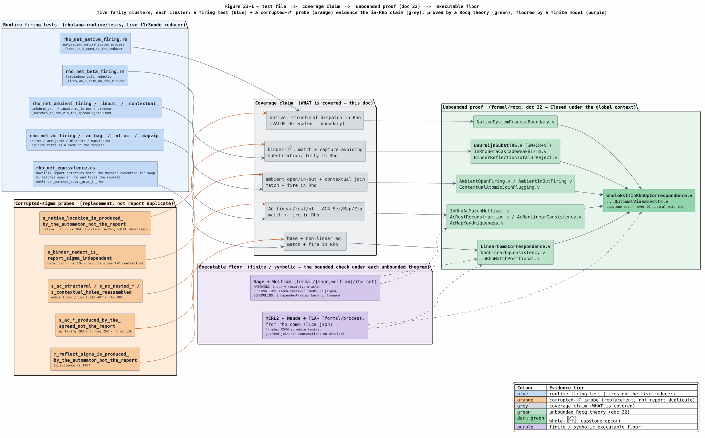
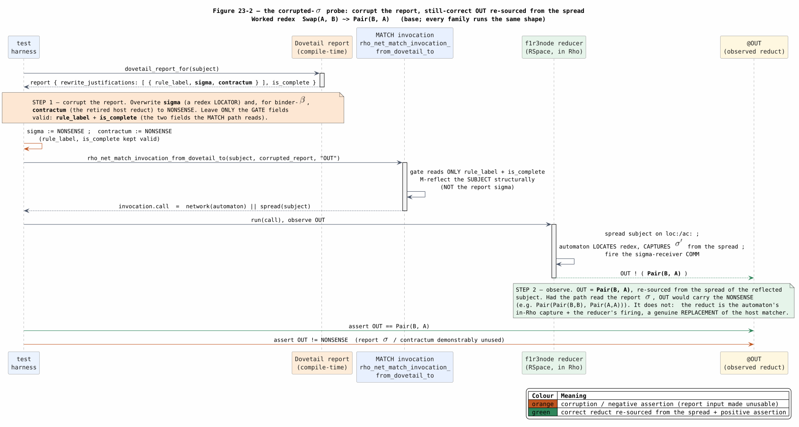
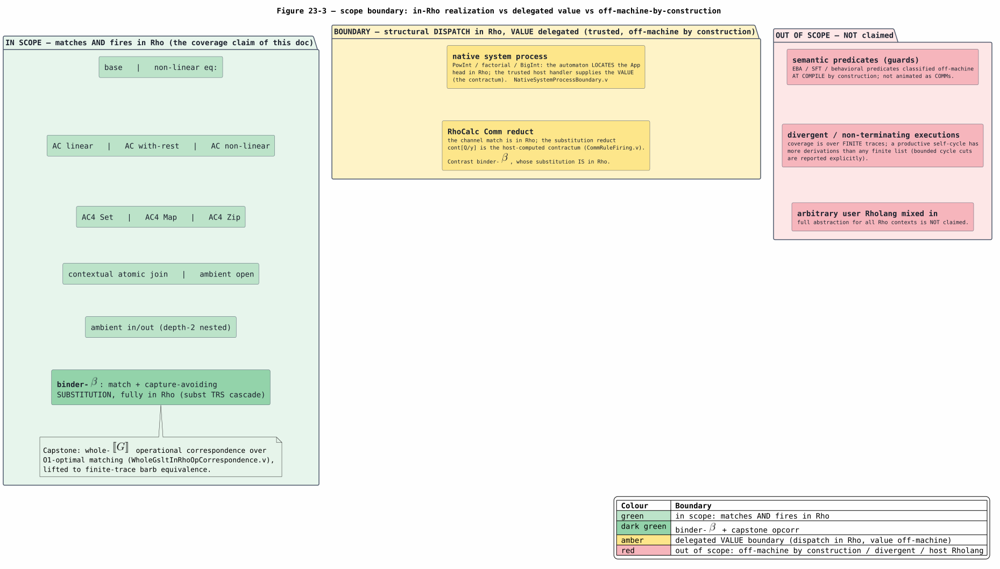

# 23 — Coverage and Empirical Correctness: the WHAT-Is-Covered Tier

> **Altitude.** This document owns the **WHAT is covered** tier of the in-Rho
> set-automaton campaign: which rewrite families match *and* fire on the live
> f1r3node reducer, what runtime evidence witnesses each one, and where the honest
> boundaries lie. It is the coverage complement to the three sibling consolidation
> docs, and it re-uses their content by reference rather than re-deriving it:
> **HOW** the backend runs is [20](20-rholang-runtime-backend.md); **WHY** the
> matching is optimal is [21](21-set-automata-optimization-theory.md); the
> **PROOF** that it is correct — every Theorem/Lemma/QED block, the discharge chain,
> the zero-admission methodology — is [22](22-end-to-end-formal-verification.md).
> The paper-mandate invariant ledger (INV-1..14) is
> [13](13-knotted-topoi-operational-invariants.md). This doc supplies the
> family-by-capability matrix, the decisive corrupted-$`\sigma`$ probe
> methodology, and the finite/symbolic executable floor beneath the unbounded Rocq
> theorems; it states theorems only by reference to [22](22-end-to-end-formal-verification.md).
> It supersedes the host-matched-era coverage argument of
> [06](06-correctness-and-coverage.md) (kept as historical record with a
> supersession banner). Every claim is cross-checked against the committed code on
> branch `codex/rho-native-set-automata`.

## 1. The scoped correctness claim (inherited from doc 06, updated to the in-Rho locus)

The correctness target is inherited verbatim from
[06 — Correctness and Coverage](06-correctness-and-coverage.md#scope-of-the-correctness-claim):
for the supported fragment, under fair Rho scheduling and the explicit
native-contract preconditions, the Rho-observed result set equals the projected
Dovetail result set,

```math
F^{\mathsf{R}} \;=\; \operatorname{project}\!\bigl(F^{\mathsf{D}}\bigr),
```

where $`F^{\mathsf{D}}`$ is Dovetail's saturated fixed point, $`F^{\mathsf{R}}`$
the observable Rho fact set, and $`\operatorname{project}`$ the documented
name/e-class quotient. What has **changed** since doc 06 is the *locus* at which
this equality is realized, not the equality itself.

**Doc 06's locus (host-matched era, superseded).** Doc 06 proved the target for a
backend in which Dovetail computed the structural match host-side, resolved the
substitution $`\sigma`$, and the Rho backend *replayed* the firing as a COMM
whose message value was the host-computed reduct. Its prose still asks "is host-side
matching faithful?"; that question is now answered by construction, because the
matching moved onto the reducer.

**The landed locus (in-Rho realization, this campaign).** Both the **match** and the
**fire** now execute on the f1r3node Rholang interpreter. A language's structural
base rewrites compile to a single positional set automaton that is serialized into a
receiver network; the subject is *spread* across location channels; the automaton
**locates the redex and captures $`\sigma'`$ on the reducer** (the internal
inspection steps are unobservable $`\tau`$ COMMs on `sa:` / `loc:` / `cap:`
channels), and on accept it fires the installed $`\sigma`$-receiver as one
observable $`c(\ell)`$ COMM. The host Dovetail engine survives only as (i) the
**compile-time partial evaluator** that emits the automaton and names the channels,
(ii) the report's $`\sigma`$-source used to *reconstruct the ground subject* for
the fail-closed replay fallback, and (iii) the **fail-closed capability gate**. It
does no runtime structural matching for a flipped rewrite. This is the state
recorded in [17 — Stage 3](17-stage-3-production-wiring.md#8-what-runs-where-all-families-landed),
generalized across every family by the later stages.

**Strengthened claim.** Because matching is now on the reducer, the campaign proves
more than doc 06's replay correspondence: a **whole-$`[\![ G ]\!]`$
operational correspondence** (`opcorr`) holds over **O1-optimal** matching — the
capstone of [22](22-end-to-end-formal-verification.md), threading the O1/O3 "same
context-labelled transition system" weak bisimulation that discharges the `rem:nonopt`
optimization obligation. The $`\beta`$-family additionally *reduces* in Rho: the
capture-avoiding substitution `b[a/0]` is computed by a metered de-Bruijn substitution
TRS cascade of COMMs, not a host pre-computation ([19](19-in-rho-binder-beta-substitution.md)).

The non-claims of doc 06 (no full abstraction; no strong bisimulation across
thunk/force; no unconditional per-language flip; no correctness of arbitrary
user-authored Rholang) are inherited unchanged and restated, coverage-framed, in
§6–§7.

## 2. Preliminaries and glossary

Terms are defined here before first use. Symbols shared across the consolidation
docs ($`\sigma`$, $`\tau`$, $`\approx`$, `⟦t⟧`, $`c(\ell)`$,
COMM, barb) carry the meanings fixed in
[01 — Concepts and Glossary](01-concepts-and-glossary.md); the entries below are the
ones specific to this coverage tier.

| Term | Definition |
|---|---|
| **rewrite family** | A class of source rewrite rule sharing one in-Rho realization mechanism: base, non-linear, the AC variants, contextual join, the ambient rules, binder-$`\beta`$, and native. The unit of a matrix row. |
| **match-locus** | *Where* the structural match is decided. "In-Rho" means the automaton locates the redex and (re-)binds $`\sigma'`$ by $`\tau`$ COMMs on the reducer (`sa:` / `loc:` / `cap:` / `eq:` / `ac:` channels), not host-side. |
| **fire (COMM)** | The single *observable* communication that commits the rewrite: a $`\sigma`$-receiver $`c(\ell)`$ send/receive rendezvous, an atomic join, or a $`\beta`$ seed send. All internal inspection is $`\tau`$. |
| **spread** | The lowering of a subject term into per-location channel sends (`spread_term_par` / `reflect_ground_term_par`) that the automaton consumes; the in-Rho source of $`\sigma'`$. |
| **M-reflect** | The structural reflection of the *whole subject* term into the reflected-`EList` ABI (`reflect_category_fn`) that the spread carries — as opposed to reading the substitution from the report. |
| **$`\sigma`$-receiver** | The persistent Rholang receiver a rewrite lowers to; on accept it binds the matched sub-terms and emits the reflected right-hand side `⟦R⟧σ`. |
| **contractum** | The reduct field the Dovetail report carries for a firing — the *retired host reduct*. In-Rho families re-source the reduct from the spread instead; only the delegated-value boundary (native, RhoCalc Comm) still consumes it. |
| **gate fields** | The two report fields the in-Rho MATCH path reads: the fired `rule_label` and the completeness flag (`is_complete`). They admit or reject the path; they are not the reduct source. |
| **corrupted-$`\sigma`$ probe** | A runtime test that overwrites the report's $`\sigma`$ (and, for $`\beta`$, the `contractum`) with nonsense, leaves only the gate fields valid, runs the MATCH path, and asserts a still-correct `OUT`. Decisive evidence the reduct is a **replacement**, not a report **duplicate**. |
| **delegated-value boundary** | A family whose structural *dispatch* moved into Rho but whose *value* is supplied by a trusted host handler (native arithmetic) or the host contractum (RhoCalc Comm substitution). Off-machine **by construction**, not by omission. |
| **executable floor** | A finite or symbolic model (Sage, Wolfram, mCRL2, Maude, TLA+) that checks a bounded instance of a property an unbounded Rocq theorem proves in general — an independent, runnable lower bound under each theorem. |
| **non-vacuity** | The property that a positive `OUT` observation could not have arisen trivially: the input differs from the asserted reduct (e.g. `Swap(A, B)` is not `Pair(B, A)`), so a correct `OUT` genuinely witnesses the firing. |
| **opcorr** | Operational correspondence: a labelled-transition relation (here weak barbed, up to $`\tau`$) between the source rewrite semantics and the in-Rho execution. Owned by [22](22-end-to-end-formal-verification.md). |

## 3. The family × capability matrix

Eleven rewrite families match **and** fire on the live reducer. The matrix below is
the coverage inventory. Because it is wide, it is presented as one logical matrix in
two physical parts — **part 1 (mechanism)**: the in-Rho match-locus, the firing
COMM, and the unbounded Rocq theory that proves it (owned by
[22](22-end-to-end-formal-verification.md)); **part 2 (evidence)**: the runtime
firing test and the corrupted-$`\sigma`$ probe (§4). Both parts are keyed by
the same family rows. A Markdown table is the best representation here — the
capability structure is a dense two-dimensional grid, which a table renders exactly
and a diagram would only approximate; the diagram (Figure 23-1) instead maps the
*test files* to the *claims* they evidence.

### 3.1 Matrix, part 1 — mechanism (match-locus / fire / FV theory)

| Family | Match-locus (in-Rho) | Fire (COMM) | FV theory (see [22](22-end-to-end-formal-verification.md)) |
|---|---|---|---|
| **base** | positional automaton over `loc:` head tags; deep `cap:` collapse; $`\sigma'`$ from the spread | one $`\sigma`$-receiver $`c(\ell)`$ COMM emitting `⟦R⟧σ` | `LinearCommCorrespondence.v`, `InRhoMatchPositional.v`, `PositionalSetAutomatonSound.v` |
| **non-linear** (`eq:`) | base locate + an `eq:` consistency join whose `EEq(h0, h1)` guard commits only on equal head tags | one guarded-consume COMM (reject-safe: the reducer's `check_commit` vetoes on unequal args) | `NonLinearEqConsistency.v` |
| **AC-linear** | order-independent HashBag `ac:` connective consume (`ac_bag_pattern`) binding one element + residual | one `ac_sigma_receiver` COMM firing the matched element on the dynamic out | `InRhoAcMatchMultiset.v`, `AtomicFiringNoPartialMatch.v`, `AcAtomicNoPartialConsume.v` |
| **AC-with-rest** | `ac:` consume binding the k structured elements + the `rest` remainder | one COMM emitting the bag RHS with `rest` spliced back | `AcRestReconstruction.v`, `AcBagRhsReflection.v` |
| **AC-non-linear** | `ac:` consume + a cross-element `Receive.condition` `EEq` enforcing a repeated variable | one COMM (commits only under the non-linear guard) | `AcNonLinearConsistency.v` |
| **AC4 Set/Map/Zip** | native `ESet` / `EMap` connective consume (`ac_set_pattern` / `ac_map_pattern`); `ZipAc` adds an `EEq` correlation guard; map keys deduped on reflect | one COMM per collection firing the picked element/value | `AcMapKeyUniqueness.v` |
| **contextual-join** | `loc:` spine descent locates the hole's premise redex, fires it in Rho, routes the reduced hole to a multi-channel atomic join `for(… & …)` | one atomic join COMM emitting the reassembled reduced context | `ContextualAtomicJoinPlugging.v`, `InRhoSameCLTSWeakBisim.v` |
| **ambient-open** | structural non-linear AC over the process soup (`PPar`) with an `EEq` name guard; site-keyed `ac:` carrier from the spread | one COMM splicing `{P, Q, rest}` | `AmbientOpenFiring.v` |
| **ambient-in/out (nested)** | depth-2 nested structural AC (a `PAmb` wrapping a `PPar`); a *cross-level* `EEq` guard relates a name one level down to one at the outer level | one COMM building the restructured nested bag from the in-Rho-bound slots | `AmbientInOutFiring.v`, `WholeGsltInRhoOpCorrespondenceInOutViaFiring.v` |
| **binder-$`\beta`$** | positional locate of `App(^lambda(body), arg)`; the de-Bruijn subst/shift TRS (`^subst` / `^shift` / `^cmp` / `^shiftk` / `^pred`) computes `b[a/0]` | one visible seed COMM (`^subst` send) then a $`\tau`$ cascade to the normal form on `OUT` | `DeBruijnSubstTRS.v`, `InRhoBetaCascadeWeakBisim.v`, `BinderReflectionTotalOrReject.v`, `InRhoMatchPositional.v` |
| **native** | positional locate + capture of the native App head from the reflected subject; the located accept gates the value bridge | one dispatch COMM forwarding the trusted handler's value (the delegated-value boundary, §7) | `NativeSystemProcessBoundary.v` |

The whole-$`[\![ G ]\!]`$ capstone `WholeGsltInRhoOpCorrespondence.v`
(with `…OptimalViaSameClts.v`) composes these arms into a single operational
correspondence over O1-optimal matching; its `family_of` split has one arm per family
group above. The capstone and every listed theory print
`Closed under the global context` (zero-admission) — established in
[22 §9](22-end-to-end-formal-verification.md).

### 3.2 Matrix, part 2 — evidence (runtime firing test / corrupted-$`\sigma`$ probe)

Test paths are under `rholang-runtime/tests/`; each runs on an in-memory f1r3node
Rho machine. The corrupted-$`\sigma`$ methodology is §4.

| Family | Runtime firing test | Corrupted-$`\sigma`$ probe |
|---|---|---|
| **base** | `rho_net_equivalence.rs`: `dovetail_report_semantics_match_rho_machine_execution_for_swap` (`:104`), `m1_matches_swap_in_rho_and_fires_the_rewrite` (`:424`) | `m_reflect_sigma_is_produced_by_the_automaton_not_the_report` (`rho_net_equivalence.rs:1407`) |
| **non-linear** | `rho_net_equivalence.rs`: `nonlinear_matches_equal_args_in_rho` (`:700`), `nonlinear_rejects_unequal_args_in_rho` (`:741`) | reject-safety on the reducer (the `eq:` guard vetoes `f(A, B)`); the $`\sigma`$-corruption analogue is the AC-non-linear probe below |
| **AC-linear** | `rho_net_ac_firing.rs`: `acdemo_ac_rewrite_fires_as_a_comm_on_the_reducer` (`:129`) | `s_ac_bag_is_produced_by_the_spread_not_the_report` (`rho_net_ac_firing.rs:283`) |
| **AC-with-rest** | `rho_net_ac_bag_firing.rs`: `acbagdemo_bag_rhs_ac_rewrite_fires_as_a_comm_on_the_reducer` (`:168`) | `s_ac_rest_and_bag_rhs_are_produced_by_the_spread_not_the_report` (`rho_net_ac_bag_firing.rs:268`) |
| **AC-non-linear** | `rho_net_nl_ac_firing.rs`: `nlacdemo_nonlinear_ac_rewrite_fires_as_a_comm_on_the_reducer` (`:86`) | `s_ac_nonlinear_guard_fires_in_rho_from_the_spread_not_the_report` (`rho_net_nl_ac_firing.rs:136`) |
| **AC4 Set/Map/Zip** | `rho_net_mapzip_firing.rs`: `mapzipdemo_{set,map,zip}_rewrite_fires_as_a_comm_on_the_reducer` (`:74`, `:90`, `:141`) | direct-construction (no report in the loop); `mapzipdemo_map_key_uniqueness_survives_the_reflect_match_split` (`rho_net_mapzip_firing.rs:109`) |
| **contextual-join** | `rho_net_contextual_firing.rs`: `ctxdemo_contextual_rewrite_fires_as_a_join_comm_on_the_reducer` (`:97`) | `s_contextual_holes_reassembled_in_rho_not_the_report` (`rho_net_contextual_firing.rs:209`); n-ary: `s_contextual_nary_holes_reassembled_in_rho_not_the_report` (`rho_net_bicong_firing.rs:170`) |
| **ambient-open** | `rho_net_ambient_firing.rs`: `ambdemo_open_fires_as_a_comm_on_the_reducer` (`:184`), `ambdemo_open_matches_in_rho_via_the_spread` (`:317`) | `s_ac_structural_bag_is_produced_by_the_spread_not_the_report` (`rho_net_ambient_firing.rs:366`); under-`new`: `s_ac_under_new_bag_is_produced_by_the_spread_not_the_report` (`:517`) |
| **ambient-in/out** | `rho_net_inout_firing.rs`: `inoutdemo_in_matches_in_rho_via_the_spread` (`:178`), `inoutdemo_out_matches_in_rho_via_the_spread` (`:260`) | `s_ac_nested_in_bag_is_produced_by_the_spread_not_the_report` (`rho_net_inout_firing.rs:343`), `s_ac_nested_out_bag_is_produced_by_the_spread_not_the_report` (`:407`) |
| **binder-$`\beta`$** | `rho_net_beta_firing.rs`: `lambdademo_beta_reduction_fires_as_a_comm_on_the_reducer` (`:108`) | `s_binder_reduct_is_report_sigma_independent` (`rho_net_beta_firing.rs:176`) — corrupts $`\sigma`$ **and** `contractum` |
| **native** | `rho_net_native_firing.rs`: `nativedemo_native_system_process_fires_as_a_comm_on_the_reducer` (`:84`) | `s_native_location_is_produced_by_the_automaton_not_the_report` (`rho_net_native_firing.rs:204`) — location in-Rho, value delegated |

**Supplementary families (complete, close variants).** Three further families fire in
Rho and are covered by the same machinery but are not separate matrix rows: **RhoCalc
Comm** (`rho_net_comm_firing.rs`: `commdemo_communication_fires_as_a_comm_on_the_reducer:193`,
theory `CommRuleFiring.v`) — a delegated-value boundary whose channel match is in Rho
but whose substitution reduct is the host contractum (§7); **n-ary contextual**
(bicong, `rho_net_bicong_firing.rs:89`) — the multi-hole generalization of
contextual-join; and **native-fold** (`rho_net_native_fold_firing.rs:86`, theory
`HeldFoldContractSound.v`) — a scalar fold contract. They are enumerated here so the
inventory is exhaustive, not scoped down.

Figure 23-1 maps each test file to the coverage claim it evidences, to the unbounded
Rocq theory that proves that claim, and to the finite model that floors it (§5). The
three evidence tiers — a firing test (it fires on the reducer), a
corrupted-$`\sigma`$ probe (it is a *replacement*, not a report duplicate), and
an unbounded proof — are colour-coded per family cluster.



*Figure 23-1. Evidence map. Blue = a runtime firing test on the live reducer; orange
= a corrupted-$`\sigma`$ probe (the replacement-not-duplicate evidence); grey =
the coverage claim (WHAT is covered); green = the unbounded Rocq theory ([22](22-end-to-end-formal-verification.md));
dark green = the whole-$`[\![ G ]\!]`$ capstone; purple = the
finite/symbolic executable floor (§5). Source:
[figures/23-test-evidence-map.puml](figures/23-test-evidence-map.puml).*

## 4. The corrupted-$`\sigma`$ probe methodology (replacement, not duplicate)

The single most important coverage question is not "does `OUT` carry the right value?"
— a faithful *replay* of a host-computed reduct would also produce the right value.
The question is **"is the in-Rho path a genuine replacement of the host matcher, or a
$`\sigma`$-replay duplicate that merely re-packages the report?"** The
corrupted-$`\sigma`$ probe answers it decisively.

### 4.1 The general schema

Every probe follows the same four steps, illustrated for the base redex `Swap(A, B)`
in Figure 23-2:

1. **Produce a real report.** Compile a genuine, complete Dovetail report for the
   subject: `LanguageDef::dovetail_report_for(subject, …)`. It carries, per firing, a
   `rule_label`, a $`\sigma`$ (the matched sub-terms), a `contractum` (the
   retired host reduct), and a completeness flag.
2. **Corrupt the report.** Overwrite $`\sigma`$ — the redex **locator** a replay
   path would key off — with nonsense, leaving only the **gate fields**
   (`rule_label` + `is_complete`) valid. For binder-$`\beta`$ the `contractum`
   is corrupted too, because there the host reduct itself is the thing being retired.
3. **Run the MATCH path.** Call the family's in-Rho invocation builder
   (`rho_net_match_invocation_from_dovetail_to` or the family variant). It reads only
   the gate fields, M-reflects the **subject** structurally, and assembles
   `network(automaton) ‖ spread(subject)`. Execute it on the reducer.
4. **Assert re-sourcing.** Assert `OUT` is the **correct** reduct (re-sourced from the
   spread) **and** assert `OUT` differs from the corrupted $`\sigma`$ / `contractum`.

The logic is a clean contrapositive: *if* the path had read $`\sigma`$ from the
report, `OUT` would carry the corruption. The base probe corrupts $`\sigma`$ to
`{x ↦ Pair(A, A), y ↦ Pair(B, B)}`, so a replay would land
`Pair(Pair(B, B), Pair(A, A))`. Since `OUT` is instead the correct `Pair(B, A)`, the
reduct must have been computed from the automaton's in-Rho capture and the reducer's
firing — there is **zero host residue** in the structural reduct.



*Figure 23-2. The probe sequence. The test corrupts the report $`\sigma`$ (orange),
the MATCH path M-reflects the subject and ignores $`\sigma`$, the reducer
locates and captures $`\sigma'`$ from the spread and fires, and `OUT` carries the
correct reduct (green) — provably not the corruption. Source:
[figures/23-corrupted-sigma-probe.puml](figures/23-corrupted-sigma-probe.puml).*

### 4.2 Three flavours of the probe

The families divide into three probe flavours by *how much* of the firing is
re-sourced from the spread:

- **Full re-sourcing ($`\sigma`$-independent / spread-not-report).** base, AC-linear,
  AC-with-rest, AC-non-linear, contextual-join, ambient-open, ambient-in/out, and
  binder-$`\beta`$ re-source the *entire* reduct. Corrupting $`\sigma`$ (and,
  for $`\beta`$, the `contractum`) leaves `OUT` correct. binder-$`\beta`$ is
  the strongest: `s_binder_reduct_is_report_sigma_independent`
  (`rho_net_beta_firing.rs:176`) corrupts *both* $`\sigma`$ and the `contractum`
  to `NONSENSE`, then asserts `OUT` is `f(A)` — the substitution normal form — and is
  neither the corrupted `contractum` nor the raw captured body `f(^bound Z)`. The
  reduct is *entirely* the reducer's: not just the match but the capture-avoiding
  substitution ran in Rho.
- **Location-only re-sourcing (location-not-report).** native re-sources the redex
  **location** from the automaton but keeps the **value** from the trusted handler.
  `s_native_location_is_produced_by_the_automaton_not_the_report`
  (`rho_net_native_firing.rs:204`) corrupts the location $`\sigma`$ while leaving
  the `contractum` (the handler's `NumLit(8)` value) valid; `OUT` is the correct `8`
  because the automaton located `PowInt` from the reflected subject, and the value
  bridge delivered the trusted payload. This is the delegated-value boundary made
  explicit (§7): only the structural dispatch moved.
- **Direct construction (no report in the loop).** AC4 Set/Map/Zip build the carrier
  and receiver directly from the production codegen builders, with **no** host-$`\sigma`$
  report to corrupt; `OUT` is provably the native pick over the reflected collection —
  the only input. The decisive AC4 probe is
  `mapzipdemo_map_key_uniqueness_survives_the_reflect_match_split`
  (`rho_net_mapzip_firing.rs:109`): a carrier map with a duplicated key collapses to
  one entry on reflect (the `ParMap` sorted-dedup invariant), so the receiver fires
  **once**, not twice — a semantic invariant that survives the reflect/match/RHS split.

### 4.3 Why this is stronger than value equality

The base equivalence test `dovetail_report_semantics_match_rho_machine_execution_for_swap`
already checks `OUT` against the report's *own* $`\sigma`$ (not a hard-coded
oracle) and against the concrete `Pair(B, A)`, with non-vacuity from `Swap(A, B)` not
being `Pair(B, A)`. The corrupted-$`\sigma`$ probe adds the *provenance*
dimension the equivalence test cannot: it removes the report as a possible source and
shows the answer survives. Together they witness both that the in-Rho path is
**correct** (value equality) and that it is a **replacement** rather than a duplicate
(provenance). The formal analogues live in
[22](22-end-to-end-formal-verification.md) — e.g. `InRhoMatchPositional.v`'s
`corrupt_report_preserves_reduct`, `reduct_from_automaton_not_report`, and
`witness_reduct_is_report_independent`, and the contextual/native location-independence
arms.

## 5. The finite and symbolic complements (the executable floor)

The Rocq theorems of [22](22-end-to-end-formal-verification.md) are unbounded — they
quantify over all subjects, all schedules, all cascade interleavings. Beneath each
sits a **finite or symbolic** model that runs and checks a bounded instance, giving an
independent, executable lower bound. These are not a second proof; Rocq remains
authoritative (the authority boundary is stated in `formal/process/README.md`). They
are counterexample-search and sanity nets tied to the same lowering shape.

| Complement | Location | What it checks (bounded) | Floors (Rocq theorem, [22](22-end-to-end-formal-verification.md)) |
|---|---|---|---|
| **Sage** | `formal/sage/rho_net/rho_net_small_state.sage` | MATCHING: the positional root index equals the recursive matcher on 5 patterns over a small subject universe (50 pairs); OBSERVATION: the SwapDemo $`\sigma`$-receiver lands `RHS[σ]` non-vacuously off-diagonal; SCHEDULING: independent-redex barb multiset confluent over all firing orders | `PositionalSetAutomatonSound.v`; `LinearCommCorrespondence.v`; `EndToEndCommCorrespondence.v` |
| **Wolfram** | `formal/wolfram/rho_net/rho_net_small_state.wl` | the same three facets via native term rewriting (`Swap[x_, y_] :> Pair[y, x]`): a real `MatchQ` implies the `(Head, Length)` index admits it; the rule lands `Pair[b, a]` non-vacuously; independent redexes schedule-confluent | same three theorems |
| **mCRL2** | `formal/mcrl2/rho_machine/` (generated from `rho_comm_slice.json`) | a bounded 4-redex COMM fragment + a guarded-join fragment: no deadlock; reject-then-commit reachable; commit still enabled after a failed guard; the rejected datum stays observable; branching-bisimilar to the Dovetail fact-step fragment with Rho reserve steps hidden as $`\tau`$ | `RhoCommScheduleFamily.v` |
| **Maude** | `formal/maude/rho_machine/` (same slice) | rewrite-logic reachability: all 24 visible fire/complete schedules reachable on both the RhoNet and Dovetail projections; every completion trace with fewer than all four fires is unreachable; guarded reject-then-commit and commit-first normal forms reachable, reject-only is not | `RhoCommScheduleFamily.v` |
| **TLA+** | `formal/tla/rho_machine/RhoNetScheduler.tla` | the matching-scheduler boundary over the same 4 redexes: Apalache bounded-safety invariants; TLC checks weak fairness for each redex + completion implies eventual completion | `RhoCommScheduleFamily.v` (with `EndToEndCommCorrespondence.v`) |

The three process-calculus models (mCRL2, Maude, TLA+) are **generated from one
specification** (`formal/process/rho_comm_slice.json` via `rho_comm_slice.py`) and
checked for drift before model checking, so all three project the same finite lowering
shape; the generator's `--self-test` also validates the arity-parametric schedule
derivation over one-through-five independent redexes. The two small-state scripts
(Sage, Wolfram) are self-checking and exit non-zero on any failed check. The full
bibliographic entry for these artifacts is
[RHO-PROCESS-FORMAL](references.md#rho-process-formal); the tool roles are
[TLA-2002](references.md#tla-2002) (TLA+) and [COQ-ROCQ](references.md#coq-rocq)
(the authoritative Rocq layer above the floor).

## 6. Honest limitations (coverage-framed)

These are true limitations of the *coverage*, stated plainly. None is an evidence gap
in the stated claim; each marks the edge of what the matrix asserts.

1. **Delegated values are trusted, not animated.** For **native** system processes
   (`PowInt`, factorial, BigInt), the automaton locates the App head in Rho, but the
   *value* is the trusted host handler's payload — arithmetic outside Rho's own
   reduction. For **RhoCalc Comm**, the channel match is in Rho but the substitution
   reduct `cont[Q/y]` is the host-computed contractum. These are correct by the
   handler/contractum contract, not by an in-Rho reduction. binder-$`\beta`$ is
   the deliberate contrast: its substitution *is* animated in Rho, which is why its
   probe corrupts the `contractum` too.
2. **binder-$`\beta`$ cost is a cascade, not one COMM per step.** A single
   $`\beta`$-fire is one visible COMM, but the substitution it seeds is a
   $`\tau`$ cascade whose length is the substitution work
   ($`O(|b|\cdot|a|\cdot d_{\max} + \mathit{occ}\cdot|a|\cdot d_{\max}^{2})`$, per
   [19 §8](19-in-rho-binder-beta-substitution.md)). Coverage asserts *correctness* of
   the reduct, not a constant-time substitution.
3. **The finite complements are finite.** The Sage/Wolfram small-state universe and
   the 4-redex process slice are bounded by construction; they floor the unbounded
   theorems, they do not extend them. Generality lives in Rocq
   ([22](22-end-to-end-formal-verification.md)), not in the floor.
4. **Nested/whole-term reassembly is per-family staged.** Several probes observe the
   inner contractum at the fired hole (e.g. the ambient under-`new` HOLE bag `{A | B}`
   without the `NewCong` re-wrap; the base nested-redex site reduct without whole-term
   congruence reassembly). The capstone lifts these to a whole-$`[\![ G ]\!]`$
   finite-trace correspondence ([22](22-end-to-end-formal-verification.md)); the
   per-family runtime tests observe at the firing site.
5. **The modeling abstractions of doc 22 apply.** The de-Bruijn numeral dispatch is
   modeled as `nat` arithmetic; correspondence is over finite executions; channels are
   modeled structurally. These are the transparently-stated limitations of
   [22 §10](22-end-to-end-formal-verification.md), inherited here.

## 7. What is NOT claimed

The boundary between what the matrix covers and what it does not is drawn in
Figure 23-3. Two categories sit outside the "matches AND fires in Rho" claim.

**Delegated-value boundary (dispatch in Rho, value off-machine by construction).**
native and RhoCalc Comm, as in §6.1. The dispatch is genuinely in Rho and is proved
report-independent (the native probe), but the value is delegated. This is off-machine
*by construction* — BigInt arithmetic and the host substitution are the trusted host's
job — not an unfinished in-Rho realization.

**Out of scope (not claimed at all).**

- **Semantic predicates (guards).** Behavioral and structural predicates classified
  through the effective-Boolean-algebra / symbolic-finite-transducer substrate are
  decided **at compile time by construction**; they are not animated as COMMs and are
  not part of the in-Rho firing claim. The guard *coverage* discipline (every
  obligation covered, rejected, or delegated) is doc 06's Theorem 7a/10 territory and
  is unchanged; this doc simply does not claim guards fire in Rho.
- **Divergent / non-terminating executions.** Coverage is over **finite** traces. A
  productive self-cycle has more derivations than any finite list can exhaust
  (Dovetail reports bounded cycle cuts explicitly, per doc 06's
  `CyclicEnumerationImpossibility.v` non-claim); the in-Rho firing evidence and the
  capstone are finite-trace.
- **Arbitrary user Rholang mixed in.** No full abstraction for all Rho contexts is
  claimed. A lowered program exercises only the authority its source rule carried
  (doc 06's security model); an adversarial context outside the generated boundary is
  out of scope.



*Figure 23-3. The scope boundary. Green = in scope (matches and fires in Rho), with
binder-$`\beta`$ and the capstone in dark green; amber = the delegated-value
boundary (dispatch in Rho, value off-machine by construction); red = out of scope
(semantic predicates, divergent executions, arbitrary host Rholang). Source:
[figures/23-scope-boundary.puml](figures/23-scope-boundary.puml).*

These non-claims mirror and extend doc 06's
[Boundary Non-Claims](06-correctness-and-coverage.md#boundary-non-claims): they prevent
over-claiming and are not evidence gaps in the stated in-Rho coverage.

## References

See [references.md](references.md). Primary sources for this document:
[RHO-BRIDGE-FORMAL](references.md#rho-bridge-formal) (the linear/COMM correspondence
and the bridge boundary theories), [S-BINDER-FORMAL](references.md#s-binder-formal)
(the binder-$`\beta`$ reflection, subst TRS, cascade bisimulation, and the
positional match with report-independent reduct separation),
[RHO-PROCESS-FORMAL](references.md#rho-process-formal) (the mCRL2 / Maude / TLA+
finite projections generated from `rho_comm_slice.json`, and the Sage / Wolfram
small-state scripts), [TLA-2002](references.md#tla-2002) (the TLA+ scheduler and
fairness modeling), and [COQ-ROCQ](references.md#coq-rocq) (the authoritative
mechanized layer above the executable floor).
