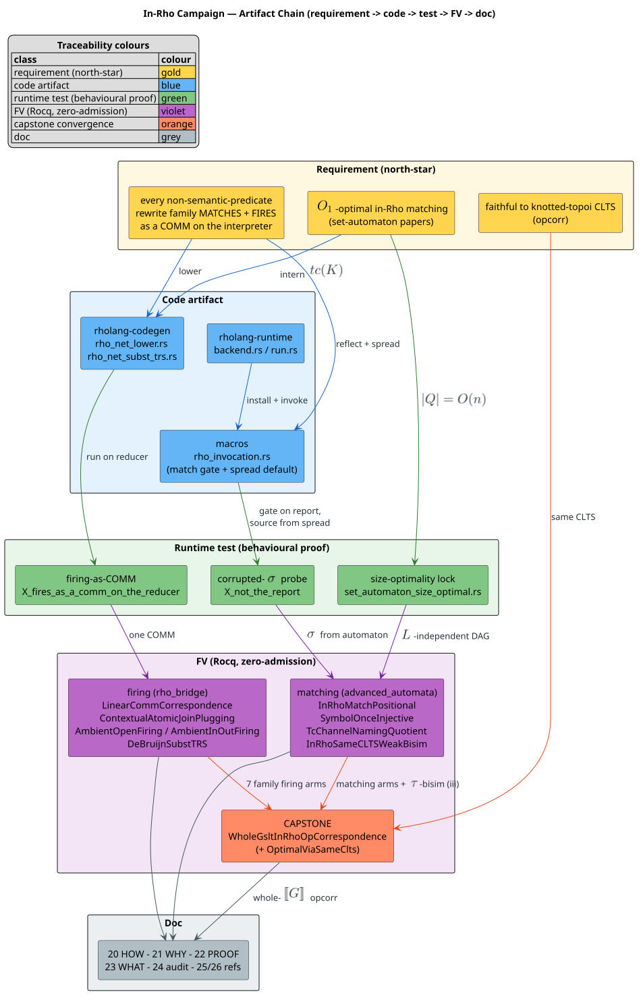

# 24 — In-Rho Completion Audit: the Requirement-to-Evidence Closing Audit

> **Altitude.** This is the campaign's **closing audit** — the project-management QED
> that complements the mathematical QED in
> [22 — End-to-End Formal Verification](22-end-to-end-formal-verification.md). It does
> **not** re-derive *how* the system runs ([20](20-rholang-runtime-backend.md)), *why*
> its matching is optimal ([21](21-set-automata-optimization-theory.md)), the *proofs*
> themselves ([22](22-end-to-end-formal-verification.md)), or the coverage matrix
> ([23](23-coverage-and-correctness.md)); it **indexes every campaign requirement to
> the concrete evidence** — the commit, the runtime test, and the formal-verification
> (FV) theorem — that discharges it. It complements [23](23-coverage-and-correctness.md)
> by inverting the axis: 23 is **family-indexed** (one row per rule family), whereas 24
> is **requirement-indexed** (one row per campaign requirement). Every link below is
> real and cross-checked against the branch `codex/rho-native-set-automata`, commits
> `5c47ea4d..e4444b1c` and their predecessors.

This audit stands to the in-Rho set-automaton matching campaign exactly as
[14 — Completion Audit](14-completion-audit.md) stood to the earlier host-matched Epic
plan: same evidence discipline, different subject. Doc 14 audits the host-matched-era
plan (matching decided on the host, a substitution $`\sigma`$ injected into a flat
receiver). **This audit certifies the campaign that moved the *matching decision
itself* into the Rholang interpreter** — so that every non-semantic-predicate rewrite
family now **matches AND fires in Rho**, $`O1`$-optimally, faithful to the knotted-topoi
context-labelled transition system.

## 1. North-star restatement

The campaign's persistent goal, stated precisely:

> **Every non-semantic-predicate rewrite of a MeTTaIL-generated language executes as a
> COMM on the f1r3node Rholang interpreter — both the pattern MATCH and the rule FIRING
> decided in Rho by a compiled positional set automaton — with matching that is
> $`O1`$-optimal (symbol-once) per the two set-automaton papers, and with the induced
> context-labelled transition system (CLTS) identical to the knotted-topoi paper's, so
> the realization is a faithful operational semantics.** Semantic predicates over values
> are the sole off-machine obligation, by construction and outside the paper's
> pure-Rho fragment.

Four load-bearing clauses, each audited in this document:

| # | Clause | Owner doc | Audited in |
|---|---|---|---|
| NS-1 | **Fires in Rho.** Each family's rule firing is one (or a metered cascade of) COMM(s) on the interpreter. | [20](20-rholang-runtime-backend.md) | [§3](#3-the-requirement-to-evidence-traceability-matrix) Group N |
| NS-2 | **Matches in Rho.** The redex is located and bound by a set automaton running in Rho, not by the host. | [20](20-rholang-runtime-backend.md), [25](25-in-rho-base-family-reference.md) | [§3](#3-the-requirement-to-evidence-traceability-matrix) Groups N, C; [§5](#5-no-dual-path-the-host-matcher-retired) |
| NS-3 | **$`O1`$-optimal.** Each subject symbol is inspected once; the interned automaton is size-optimal in the pattern. | [21](21-set-automata-optimization-theory.md) | [§3](#3-the-requirement-to-evidence-traceability-matrix) Group O |
| NS-4 | **Faithful (same CLTS).** The in-Rho scheme induces the paper's CLTS; the whole-$`[\![ G ]\!]`$ operational correspondence holds over the optimal matching. | [22](22-end-to-end-formal-verification.md), [13](13-knotted-topoi-operational-invariants.md) | [§3](#3-the-requirement-to-evidence-traceability-matrix) Group C; [§4](#4-inv-114-ledger-reconciliation) |

The **contrast with doc 14** is the whole point of the campaign. Under the host-matched
model that doc 14 certified, `knotted-topoi.tex` *licensed* host-side matching (the CLTS
is locus-agnostic; see [13](13-knotted-topoi-operational-invariants.md) §4), so moving
matching into Rho was an **optimization** — recovering the symbol-once property $`O1`$ —
not a semantic mandate. This campaign performed that optimization end-to-end and proved
it CLTS-invisible. The audit below shows the optimization is complete: no rule family
still decides its match on the host.

## 2. Glossary (audit-specific terms, defined before use)

Shared vocabulary (MeTTaIL, Dovetail, F1r3node, Rholang, RhoRuntime, RSpace, RhoNet,
GSLT, COMM, $`\approx`$, $`[\![ t ]\!]`$) is defined in
[01 — Concepts and Glossary](01-concepts-and-glossary.md). The terms specific to this
audit are:

| Term | Definition |
|---|---|
| **north-star** | The campaign's persistent goal, stated verbatim in [§1](#1-north-star-restatement). |
| **requirement-indexed** | A traceability matrix whose rows are campaign requirements (this doc), as opposed to **family-indexed** (rows are rule families — [23](23-coverage-and-correctness.md)). |
| **opcorr** | Operational correspondence: the knotted-topoi paper's `Obligation` that each source-rewrite firing at location $`\ell`$ is matched, label-for-label (the $`c(\ell)`$ COMM), by a behaviour-functor transition of the lowering, and conversely. Fixed at the CLTS. See [13](13-knotted-topoi-operational-invariants.md) §4.3, [22](22-end-to-end-formal-verification.md) §2. |
| **CLTS** | Context-labelled transition system: transitions $`P \xrightarrow{F} P'`$ labelled by minimal enabling contexts $`F`$. The correctness criterion is stated here, so it is locus-agnostic. |
| **spread** | The paper's term encoding that publishes a term's head tag at its location channel and installs each argument at its child location, so a term is distributed across per-location channels for the automaton to locate. |
| **sigma-receiver** ($`\sigma`$-receiver) | The persistent Rholang receiver a base rewrite lowers to: `for(σ₀,…,σ_{k-1}, out <= c){ … }`, binding the $`k`$ matched sub-terms plus the output channel; its body emits $`[\![ R ]\!]\sigma`$. |
| **locate automaton** | The Erkens-Groote positional set automaton that visits each subject function symbol exactly once to locate all pattern matches — the $`O1`$ symbol-once discipline the in-Rho matcher rides. |
| **$`tc(K)`$** | Meredith's optimal channel naming $`tc(K) = \ulcorner T_M(K) \urcorner`$: the reflected optimal set-automaton state, the $`O1`$/$`O3`$ quotient of the location channels. See [21](21-set-automata-optimization-theory.md). |
| **$`O1`$ / $`O2`$ / $`O3`$** | The three optimality conditions of the optimal-channels theory: $`O1`$ symbol-once, $`O2`$ prune-preserves-work, $`O3`$ coarsest-sound. |
| **corrupted-$`\sigma`$ probe** | A decisive runtime test that corrupts the host Dovetail report's $`\sigma`$ (and, where relevant, its contractum) to a nonsense term, then observes the correct output re-sourced from the in-Rho spread — proving the reduct is the automaton's, not the report's. |
| **capstone** | The whole-$`[\![ G ]\!]`$ finite-trace operational-correspondence theorem `whole_gslt_in_rho_opcorrespondence`, and its $`O1`$-optimal upgrade `whole_gslt_opcorr_over_optimal_matching`. |
| **`family_of`** | The 7-constructor `Family` case split (FBase, FContextualJoin, FAcLinear, FAcStructural, FBinderBeta, FNative, FAcNested) over which the capstone assembles its per-family per-step arms. |
| **zero-admission** | A Rocq theory whose `Print Assumptions` reports *Closed under the global context*: no admits, no added assumptions, no free section parameters, enforced by `formal/scripts/check_rocq_zero_admission.py`. |
| **INV-1..14** | The knotted-topoi operational invariants ledger of [13](13-knotted-topoi-operational-invariants.md). |
| **`rem:nonopt`** | The paper's non-optimality remark: the sound (location-channel) and optimal (set-automaton-state) schemes induce the same CLTS. The in-Rho realization forces this to be *proven*. |

## 3. The requirement-to-evidence traceability matrix

The artifact chain each requirement travels — **requirement $`\to`$ code $`\to`$ runtime
test $`\to`$ FV $`\to`$ doc** — is shown in Figure 24-1; the requirement-indexed tables
that follow instantiate it, one row per requirement, grounded in the actual commit(s),
the behavioral (runtime) test, and the FV theorem in
[22](22-end-to-end-formal-verification.md).



*Figure 24-1. The campaign artifact chain. A north-star requirement is **lowered** to a
code artifact (blue), **exercised** by a runtime test on the live reducer (green),
**proved** by a zero-admission Rocq theory (violet), and **documented** (grey). The
per-family firing arms and the matching arms converge into the capstone (orange),
`WholeGsltInRhoOpCorrespondence`, which threads the $`O1`$-optimal matching via
obligation (iii). Source:
[figures/24-campaign-artifact-chain.puml](figures/24-campaign-artifact-chain.puml).*

Legend for the matrix columns. **Code** cites the file and/or the introducing commit;
**Runtime test** is the behavioral proof on the live RSpace reducer; **FV** cites the
zero-admission Rocq theory and the [22](22-end-to-end-formal-verification.md) theorem
number (T1..T23) that presents it. All FV theories print *Closed under the global
context*.

### 3.1 Group N — every rewrite family matches and fires in Rho (NS-1, NS-2)

Each row is: the family fires its rule as a COMM (or metered cascade) on the interpreter,
with the match decided in Rho.

| Req | Requirement | Code (commit / file) | Runtime test (on the reducer) | FV (theory / [22](22-end-to-end-formal-verification.md)) | Status |
|---|---|---|---|---|---|
| **N1** | **Base rewrite** matches + fires as one COMM | `9ab23aeb` (match+fire from derived ruleset), `6dce031e` (SwapDemo default backend matches in Rho), `d1ba2e30` (automaton locates + emits $`\sigma`$); `rho_net_lower.rs` `sigma_receiver_par` | `stage3_swapdemo_matches_and_fires_from_the_derived_ruleset`, `stage3_swapdemo_default_backend_matches_in_rho_via_run_backend_report`, `m1_matches_swap_in_rho_and_fires_the_rewrite` | `LinearCommCorrespondence` (T7); `InRhoMatchPositional` (T1) | Satisfied |
| **N2** | **Non-linear** (repeated variable) matches in Rho, reject-safe | `3e883265` (guarded `eq:` join codegen), `45c73db0` (validated on reducer), `51c037ee` (FV) | `f(A,A)` commits / `f(A,B)` vetoes on the live reducer (Stage 2, [16](16-in-rho-verification-plan.md) §5) | `NonLinearEqConsistency` (T9), `AtomicFiringNoPartialMatch` (T10) | Satisfied |
| **N3** | **AC-linear** (HashBag) matches order-independently + fires as one atomic-consume COMM | `d7484a5e` (bag matches soup), `3f953e92` (`ac_sigma_receiver_par`), `aa3cd4ce` (AcDemo e2e), `8b5451ee` (re-sourced from spread) | `acdemo_ac_rewrite_fires_as_a_comm_on_the_reducer`, `ac_bag_pattern_matches_the_process_soup_in_rho`, `ac_receiver_fires_the_matched_element_on_the_dynamic_out` | AC bundle (T15): `AcAtomicNoPartialConsume`, `InRhoAcMatchMultiset` (T5) | Satisfied |
| **N4** | **AC-with-rest / bag-valued RHS** re-sourced from the spread | `0d6cbd1d` (rest + bag-RHS from spread), `0df7e7d0` (AcBagDemo e2e), `f0c6e05c` (RHS reflection) | `s_ac_rest_and_bag_rhs_are_produced_by_the_spread_not_the_report`; `acbagdemo` firing suite | AC bundle (T15): `AcRestReconstruction` | Satisfied |
| **N5** | **AC-non-linear** guard fires in Rho from the spread | `24e08e05` (nl AC guard fires from spread), `ec1b5219` (FV spread-sourced) | `nlacdemo_nonlinear_ac_rewrite_fires_as_a_comm_on_the_reducer`, `s_ac_nonlinear_guard_fires_in_rho_from_the_spread_not_the_report` | AC bundle (T15): `AcNonLinearConsistency` | Satisfied |
| **N6** | **AC4 Set / Map / Zip** native carriers match + fire in Rho | `5752c9ea` (native ESet/EMap/paired-set carriers), `aeb57894` (FV located-carrier arms) | `mapzipdemo_set_rewrite_fires_as_a_comm_on_the_reducer`, `mapzipdemo_map_rewrite_fires_as_a_comm_on_the_reducer`, `mapzipdemo_zip_rewrite_fires_as_a_comm_on_the_reducer` | AC bundle (T15): `AcMapKeyUniqueness`; `InRhoAcMatchMultiset` (T5) | Satisfied |
| **N7** | **Contextual** (n-ary premise) fires as an atomic polyadic join COMM | `12e39946` (codegen atomic polyadic join), `c1edd8bc` (CtxDemo e2e), `2c38fe31` (n-ary holes matched in Rho) | `ctxdemo_contextual_rewrite_fires_as_a_join_comm_on_the_reducer`, `s_contextual_holes_reassembled_in_rho_not_the_report` | `ContextualAtomicJoinPlugging` (T8) | Satisfied |
| **N8** | **Ambient OpenRule** (structural non-linear AC) fires as one COMM, incl. under a `new` binder | `6fd932a1` (structural nl AC receiver), `2964e785` (AmbDemo e2e), `c6fbd3a1` (matches under `new`) | `ambdemo_open_fires_as_a_comm_on_the_reducer`, `ambdemo_open_matches_in_rho_via_the_spread`, `ambnewdemo_open_under_new_matches_in_rho_via_the_spread` | `AmbientOpenFiring` (T11) | Satisfied |
| **N9** | **Ambient In/Out** (depth-2 nested structural AC) matches in Rho via the spread + fires | `2e299965` (e2e firing), `362adc6a` (upgrade report $`\to`$ spread), `ef0480b9` (operational lemma + FAcNested) | `inoutdemo_in_matches_in_rho_via_the_spread`, `inoutdemo_out_matches_in_rho_via_the_spread`, `s_ac_nested_in_bag_is_produced_by_the_spread_not_the_report` | `AmbientInOutFiring` (T12) | Satisfied |
| **N10** | **Native system-process** rewrite fires as a COMM | `f8e43e43` (lower native system process), `0236f265` (NativeDemo e2e), `445bf013` (matching in Rho) | `nativedemo_native_system_process_fires_as_a_comm_on_the_reducer`, `s_native_location_is_produced_by_the_automaton_not_the_report` | `NativeSystemProcessBoundary` (T13) | Satisfied |
| **N11** | **Native scalar fold** fires as a COMM | `fd967310` (codegen+macro native scalar fold), `9455f62d` (NativeFoldDemo e2e), `9efc09a8` (FV) | `nativefolddemo_native_scalar_fold_fires_as_a_comm_on_the_reducer` | `FoldMotionVsCongruence` (native-fold firing, [22](22-end-to-end-formal-verification.md) §5) | Satisfied |
| **N12** | **RhoCalc Comm** fires as one non-linear AC COMM | `07be7843` (Comm typed native rule), `eca81aa3` (removes hand-built-$`\sigma`$ deviation), `47d57802` (fires as one nl AC COMM) | `commdemo_communication_fires_as_a_comm_on_the_reducer`, `commdemo_communication_splices_the_residual_bag`, `commdemo_mismatched_channel_does_not_fire` | `CommRuleFiring` (T14) | Satisfied |
| **N13** | **Binder-$`\beta`$** matches AND reduces (capture-avoiding substitution TRS) fully in Rho as a metered COMM cascade | `5c47ea4d` (reflect + MATCH $`\beta`$-redex), `f5c43cb5` (5 reserved TRS receivers), `d6ea3608` (seed + retire host reduct), `f334d363` (fires fully in Rho) | `lambdademo_beta_reduction_fires_as_a_comm_on_the_reducer`, `lambdademo_beta_case2_nested_binder_depth_increment_fires_in_rho`, `lambdademo_beta_case3_object_descent_two_sibling_substs_coreduce_in_rho` | `DeBruijnSubstTRS` (T16–T18), `InRhoBetaCascadeWeakBisim` (T19), `BinderReflectionTotalOrReject` (T20) | Satisfied |

### 3.2 Group O — $`O1`$-optimal matching (NS-3)

| Req | Requirement | Code (commit / file) | Runtime / analytical test | FV (theory / [22](22-end-to-end-formal-verification.md)) | Status |
|---|---|---|---|---|---|
| **O1** | **Symbol-once** locate: each subject symbol maps to one `sa:`-receive, total + injective | `99d655dd` (Stage 1 FV Phase A); `set_automaton.rs` `PatternCompiler::intern` | `properties.rs` positional oracle over random constructors/arities | `SymbolOnceInjective` (T2) | Satisfied (proof) |
| **O2** | **Prune-preserves-work**: pruning never drops a required inspection | `acab059e` (Stage 1 FV Phase B) | — (analytical) | `PrunePreservesWork` ([16](16-in-rho-verification-plan.md) O2) | Satisfied (proof) |
| **O3** | **Coarsest-sound $`tc(K)`$** channel naming: the $`O1`$/$`O3`$ quotient, injective on $`\sim_{op}`$ classes | `acab059e` (Stage 1 FV Phase B); `rho_net_automaton.rs` | — (analytical) | `TcChannelNamingQuotient` (T3) | Satisfied (proof) |
| **O-size** | The interned automaton is **size-optimal**: `state_count` = distinct sub-patterns = $`O(\text{pattern size})`$, independent of the inspection order $`L`$ | `e4444b1c` (size-optimality lock) | `set_automaton_size_optimal.rs` — the $`\Theta(n^2)`$ diagonal set interns to exactly $`2n+1`$ states for $`n \in \{1..128\}`$; pinned per-language bounds | grounded on `TcChannelNamingQuotient` (T3) | Satisfied |
| **O-reuse** | **Compile-once / reuse** determinism: one compiled automaton reused per redex site | `99d655dd` (Stage 1 FV Phase A) | reuse across graphs (`properties.rs`) | `InRhoReuseDeterminism` (T4) | Satisfied (proof) |

The $`L`$-independence in **O-size** is the decisive optimality fact: the campaign's
automaton states are *interned sub-patterns* (the $`tc(K)`$ quotient), not
Bouwman-Erkens match-goal-set configurations, so there are no partial-match states for
an inspection order $`L`$ to multiply. An adaptive size-optimal $`L`$ is therefore
unnecessary, and swapping $`L`$ later is CLTS-invisible (the `rem:nonopt` discharge,
`InRhoSameCLTSWeakBisim`). Depth in [21](21-set-automata-optimization-theory.md).

### 3.3 Group C — CLTS-faithfulness (NS-4)

| Req | Requirement | Code (commit) | Runtime / model test | FV (theory / [22](22-end-to-end-formal-verification.md)) | Status |
|---|---|---|---|---|---|
| **C1** | in-Rho match set = positional matching relation (sound + complete) | `99d655dd` | `properties.rs` positional oracle | `InRhoMatchPositional` (T1), `PositionalSetAutomatonSound` (`3c36d29a`) | Satisfied (proof) |
| **C2** | in-Rho AC match set = AC matching relation over multisets (order-independent) | `43618360` (AC-i) | `ac_bag_pattern_matches_the_process_soup_in_rho` | `InRhoAcMatchMultiset` (T5) | Satisfied (proof) |
| **C3** | `sa:`/`eq:` COMMs are $`\tau`$ $`\Rightarrow`$ same CLTS (weak bisimulation) — the `rem:nonopt` discharge | `74c67580` (Stage 1 FV Phase C) | mCRL2 + Maude finite projections (`formal/process/`) | `InRhoSameCLTSWeakBisim` (T6) | Satisfied (proof) |
| **C4** | Firing atomicity — no partial-match reachable state | `51c037ee` (Stage 2), `dca6f65d` (AC-atom) | TLA+/Apalache + `formal/process/` | `AtomicFiringNoPartialMatch` (T10), `AcAtomicNoPartialConsume` (T15) | Satisfied (proof) |
| **C5** | Non-linear `eq:` commit $`\Leftrightarrow`$ name-equality, reject-safe | `51c037ee` | Stage 2 reducer runs | `NonLinearEqConsistency` (T9) | Satisfied (proof) |
| **C6** | **CAPSTONE** — whole-$`[\![ G ]\!]`$ finite-trace opcorr, both directions, **over the $`O1`$-optimal matching** | `266440b0` (G0–G5 harness), `131fc2ab` (G6 thread (iii)), `b3bb52dc` (G7 flip INV-2/6/13) | `swapdemo_base_finite_trace_opcorr` (non-vacuity witness) | `WholeGsltInRhoOpCorrespondence.whole_gslt_in_rho_opcorrespondence` (T22), `…_opcorr_over_optimal_matching` (T23), `…OptimalViaSameClts` | Satisfied (proof) |

The capstone (C6) is the convergence node of Figure 24-1. Its statement is the
finite-trace barb-equivalence

```math
\forall\, s\ t\ ls,\ R_{gio}\,s\,t \;\Rightarrow\;
\bigl(\forall s',\ s \xrightarrow{ls}^{*} s' \Rightarrow \exists t',\ t \xrightarrow{ls}^{*} t' \wedge \mathrm{barb}(s') = \mathrm{barb}(t')\bigr)
\;\wedge\;
\bigl(\text{conversely}\bigr),
```

assembled by a `family_of` case split over the seven landed per-family arms (FBase,
FContextualJoin, FAcLinear, FAcStructural, FBinderBeta, FNative, FAcNested), each entering
as a discharged Section Hypothesis equal to the family's landed per-step theorem (so the
capstone stays *Closed under the global context* — a Hypothesis is a universally-
quantified premise on Section close, never a global assumption). `…_opcorr_over_optimal_matching`
then composes this sound baseline transitively with obligation (iii)
(`InRhoSameCLTSWeakBisim.same_clts_weak_bisim`) to upgrade the result from the sound
location-channel scheme to the $`O1`$-optimal `set_automaton_trace` scheme — the
`rem:nonopt` discharge. Full proof presentation: [22](22-end-to-end-formal-verification.md)
§7.

### 3.4 Group B — binder-$`\beta`$ reduction proofs and metering

The $`\beta`$-rule is the flagship: its right-hand side $`b[a/x]`$ is a *computation* on
$`b`$, not a constructor tree, so it is realized as a de-Bruijn substitution TRS cascade
of COMMs. Architecture: [19](19-in-rho-binder-beta-substitution.md).

| Req | Requirement | Code (commit / file) | Runtime test | FV (theory / [22](22-end-to-end-formal-verification.md)) | Status |
|---|---|---|---|---|---|
| **B1** | The substitution TRS is **strongly normalizing** (the $`\mu`$-weighted measure) | `a1bff96d`; `rho_net_subst_trs.rs` | `rho_net_subst_trs_reducer.rs` (object descent + `^shiftk`) | `DeBruijnSubstTRS.subst_trs_terminating` (T16) | Satisfied (proof) |
| **B2** | The substitution TRS is **confluent** (normalizing interpretation) | `a1bff96d` | sibling co-reduction on the reducer | `DeBruijnSubstTRS.subst_trs_confluent` (T17) | Satisfied (proof) |
| **B3** | The unique normal form is exactly $`b[a/0]`$ | `a1bff96d` | `lambdademo_beta_reduction_fires_as_a_comm_on_the_reducer` | `DeBruijnSubstTRS.subst_normal_form_is_debruijn_beta` (T18) | Satisfied (proof) |
| **B4** | The object-$`\beta`$ cascade is **weakly bisimilar** to abstract $`\beta`$ (genuine, non-vacuous) | `a1bff96d` | `lambdademo_beta_case3_object_descent_two_sibling_substs_coreduce_in_rho` | `InRhoBetaCascadeWeakBisim.weak_bisim_beta_cascade_vs_abstract_beta` (T19) | Satisfied (proof) |
| **B5** | Metered **by construction** — each cascade step is a COMM charged by the interpreter's own cost accounting, with no unmetered host pre-computation | `f334d363`, `d6ea3608`; `substitute_and_charge` (f1r3node) | `rho_net_subst_trs_reducer.rs` (runs on the metered reducer) | — (structural; [19](19-in-rho-binder-beta-substitution.md) §7) | Satisfied |

### 3.5 Group I — integrity, boundary, and no-dual-path

| Req | Requirement | Code (commit / file:line) | Runtime test | FV (theory) | Status |
|---|---|---|---|---|---|
| **I1** | **Fail-closed install** — total-or-reject; every rule lowered or fail-closed | `06e091a5` (`installed_program_par` $`\to`$ `Result`), `6318136d` (FV ix) | `in_rho_match_gate_reject` gate | `RhoLoweringTotalOrRejects`, `InRhoEncoderTotalOrReject` | Satisfied (proof) |
| **I2** | **No dual path** — the host matcher is retired; the spread is the default, the report path is a fail-closed fallback only | `d1ba2e30` (retire report $`\sigma`$ from MATCH path), `d6ea3608` (retire host-contractum reduct), `eca81aa3` (remove hand-built-$`\sigma`$ deviation); `rho_invocation.rs:1765` (spread default) vs `:1827` (report fallback) | `nested_redex_fires_in_rho_no_replay_fallback`, `multiple_redexes_fire_in_rho_no_replay_fallback` | `InRhoEncoderTotalOrReject` | Satisfied — see [§5](#5-no-dual-path-the-host-matcher-retired) |
| **I3** | **Reduct is the automaton's, not the report's** — corrupted-$`\sigma`$ probe per family | per-family probes (see [§5](#5-no-dual-path-the-host-matcher-retired)) | `m_reflect_sigma_is_produced_by_the_automaton_not_the_report`, `s_binder_reduct_is_report_sigma_independent`, `s_ac_bag_is_produced_by_the_spread_not_the_report`, `s_contextual_holes_reassembled_in_rho_not_the_report`, `s_native_location_is_produced_by_the_automaton_not_the_report`, `s_ac_structural_bag_is_produced_by_the_spread_not_the_report`, `s_ac_nested_{in,out}_bag_is_produced_by_the_spread_not_the_report` | `InRhoMatchPositional` report-independence lemmas (T1) | Satisfied |
| **I4** | **Semantic predicates are the ONLY off-machine obligation** — opcorr-excluded by the fence | `RhoBackendInvocation::DeferToDovetailSemanticPredicate` | audit boundary ([12](12-runtime-invocation-migration.md)) | `WholeGsltInRhoOpCorrespondence.semantic_predicates_emit_no_comm`, `RhoDefaultBackendAudit` | Satisfied (by construction) |
| **I5** | **Host reuse** — the bridge introduces no second Rho machine | one-way `rhoapi::Par` injection into F1r3node `RhoRuntime`/RSpace | `run_backend_report` on `RhoMachine` | `HostRhoMachineReuse`, `BridgeInertness` | Satisfied (proof) |

## 4. INV-1..14 ledger reconciliation

The knotted-topoi operational invariants ledger is owned by
[13 — Knotted-Topoi Operational Invariants](13-knotted-topoi-operational-invariants.md)
§5. This audit reconciles the campaign's evidence against that ledger and confirms the
three invariants the capstone flipped. **No invariant regressed; three moved from a
host-side realization to an in-Rho realization.**

| INV | Invariant (abbreviated; full text in [13](13-knotted-topoi-operational-invariants.md) §5) | [13](13-knotted-topoi-operational-invariants.md) status | Campaign evidence (this audit) |
|---|---|---|---|
| INV-1 | Injective location channels $`c(\ell) = \ulcorner \ell \urcorner`$ | Satisfied | `RhoGroundingAndNames`; unchanged by the campaign |
| INV-2 | Plugging-stability of $`c(\cdot)`$ — no spurious rendezvous under embedding | **Satisfied (in-Rho realization)** | **Flipped by the capstone** (`b3bb52dc`): `ContextualAtomicJoinPlugging` (T8), consumed across every finite trace by the FContextualJoin arm — [§3.3](#33-group-c-clts-faithfulness-ns-4) C6, [§3.1](#31-group-n-every-rewrite-family-matches-and-fires-in-rho-ns-1-ns-2) N7 |
| INV-3 | One firing = one atomic rendezvous emitting $`[\![ R ]\!]\sigma`$ | Satisfied | `LinearCommCorrespondence` (T7) — [§3.1](#31-group-n-every-rewrite-family-matches-and-fires-in-rho-ns-1-ns-2) N1 |
| INV-4 | Firing atomicity — no partial-match reachable state | Satisfied | `AtomicFiringNoPartialMatch` (T10), `AcAtomicNoPartialConsume` — [§3.3](#33-group-c-clts-faithfulness-ns-4) C4 |
| INV-5 | Non-linear pattern-variable consistency | Satisfied | `NonLinearEqConsistency` (T9), and now in Rho via the `eq:` guarded join — [§3.1](#31-group-n-every-rewrite-family-matches-and-fires-in-rho-ns-1-ns-2) N2, [§3.3](#33-group-c-clts-faithfulness-ns-4) C5 |
| INV-6 | Structural premises / contextual rewrites as atomic joins | **Satisfied (in-Rho realization)** | **Flipped by the capstone** (`b3bb52dc`): `ContextualAtomicJoinPlugging` (T8) + `AmbientOpenFiring` (T11), consumed by the FContextualJoin + FAcStructural arms — [§3.1](#31-group-n-every-rewrite-family-matches-and-fires-in-rho-ns-1-ns-2) N7, N8 |
| INV-7 | Freshness by quoting; no $`\nu`$, no allocator | Satisfied | `RhoGroundingAndNames`, `LinearCommCorrespondence` (name canon) |
| INV-8 | Persistent installer, no replication | Satisfied | `RhoParWellFormedness` (persistent contract shape) |
| INV-9 | Equations as structural congruence — compile-time, cost-free | Satisfied | compile-time e-graph; unchanged |
| INV-10 | RHS constructor reflection preserves tag / arity / structure | Satisfied | `RhoAstSendBoundary`, `RhocalcAstLowering`; the reflected-EList ABI — [19](19-in-rho-binder-beta-substitution.md) §3 |
| INV-11 | Total-or-reject — every rewrite installed or fail-closed | Satisfied | `RhoLoweringTotalOrRejects`, `InRhoEncoderTotalOrReject` — [§3.5](#35-group-i-integrity-boundary-and-no-dual-path) I1 |
| INV-12 | Compile to core Rho; reuse the host Rho machine | Satisfied | `HostRhoMachineReuse`, `BridgeInertness` — [§3.5](#35-group-i-integrity-boundary-and-no-dual-path) I5 |
| INV-13 | Channel-intension freedom — same CLTS | **Satisfied (finite executions, in-Rho realization)** | **Flipped by the capstone** (`b3bb52dc`): `whole_gslt_in_rho_opcorrespondence` (T22) + `…_opcorr_over_optimal_matching` (T23) threading (iii) `InRhoSameCLTSWeakBisim` (T6) — [§3.3](#33-group-c-clts-faithfulness-ns-4) C3, C6 |
| INV-14 | Semantic predicates as the only off-machine obligation | Consistent (beyond paper scope; opcorr-excluded) | `semantic_predicates_emit_no_comm` fence, `RhoDefaultBackendAudit` — [§3.5](#35-group-i-integrity-boundary-and-no-dual-path) I4 |

**INV-2 / INV-6 / INV-13** are the three the campaign moved from the host-side
stepping-stone to the landed in-Rho realization; commit `b3bb52dc` performed the flip in
[13](13-knotted-topoi-operational-invariants.md), and the capstone
`WholeGsltInRhoOpCorrespondence.v` is the evidence. INV-13's honest scope — finite
executions of gate-admitted $`[\![ G ]\!]`$, over the covered families — is
carried in the residuals register ([§6](#6-residuals-register), R-2). Full ledger prose:
[13](13-knotted-topoi-operational-invariants.md) §5–§6.

## 5. No dual path — the host matcher retired

The single most important integrity claim of the campaign (I2 / I3) is that there is **no
second matching path**: the in-Rho automaton is the only matcher, and the host Dovetail
report survives solely as the compile-time partial-evaluator and a fail-closed fallback.
Three independent lines of evidence establish it.

**(1) The install gate + spread-default (the code).** The generated invocation method
`rho_net_match_invocation_from_dovetail_to` (`macros/src/gen/runtime/rho_invocation.rs:1765`)
is the default backend's entry point: it applies the capability gate
(`in_rho_match_gate_reject`, fail-closed before any Rho reduction), then **spreads the
subject and lets the automaton locate and bind the redex**. The report path
`rho_net_replay_invocation_from_dovetail_to` (`:1827`) is a *fallback*, reached only when
the gate rejects (an as-yet-unrouted shape); it never runs alongside the spread path for
an admitted rule. The two paths are mutually exclusive by the gate, so there is no dual
runtime path.

**(2) The retirement commits (the history).** The host match-decision was explicitly
removed, not merely bypassed:

- `d1ba2e30` — *retire report $`\sigma`$ from the MATCH path*: the automaton locates the
  redex and emits $`\sigma`$; the report $`\sigma`$ is no longer read as the match.
- `d6ea3608` — *retire the host-contractum reduct*: the $`\beta`$ seed is sent in Rho; the
  host-computed contractum is removed from the firing path.
- `eca81aa3` — *Comm $`\sigma`$-injection removes the hand-built-$`\sigma`$ deviation*: the
  last family that hand-built a $`\sigma`$ on the host is folded onto the in-Rho path.

**(3) The corrupted-$`\sigma`$ probes (the decisive behavioral proof).** For every family,
a runtime test **corrupts the host report's $`\sigma`$** (and, for $`\beta`$ and native,
the contractum) to a nonsense term, leaving valid only the gate fields (the fired rule
label and completeness flag), runs the invocation on the live reducer, and asserts the
output is the **correct** reduct — necessarily re-sourced from the in-Rho spread, since
the report was nonsense. The family coverage:

| Family | Corrupted-$`\sigma`$ probe | Asserted |
|---|---|---|
| base | `m_reflect_sigma_is_produced_by_the_automaton_not_the_report` | $`\sigma`$ came from the `sa:` accept, not the corrupted report |
| non-linear AC | `s_ac_nonlinear_guard_fires_in_rho_from_the_spread_not_the_report` | the guard is spread-sourced |
| AC-linear | `s_ac_bag_is_produced_by_the_spread_not_the_report` | the AC bag re-sourced from the spread |
| AC-rest / bag-RHS | `s_ac_rest_and_bag_rhs_are_produced_by_the_spread_not_the_report` | rest + bag-RHS from the spread |
| contextual | `s_contextual_holes_reassembled_in_rho_not_the_report` | holes reassembled in Rho |
| native | `s_native_location_is_produced_by_the_automaton_not_the_report` | location from the automaton; the trusted handler value on OUT |
| ambient open | `s_ac_structural_bag_is_produced_by_the_spread_not_the_report` | structural-AC bag from the spread |
| ambient in/out | `s_ac_nested_in_bag_is_produced_by_the_spread_not_the_report`, `s_ac_nested_out_bag_is_produced_by_the_spread_not_the_report` | nested operand + reducts from the spread |
| binder-$`\beta`$ | `s_binder_reduct_is_report_sigma_independent` | $`f(A)`$ even with both report $`\sigma`$ and contractum corrupted — zero host residue |

The binder-$`\beta`$ probe is the strongest: it corrupts **both** the report $`\sigma`$
**and** the contractum, and still observes the cascade's normal form $`f(A)`$ on OUT, so
the reduct is entirely the reducer's. Its formal analogue is
`witness_reduct_is_report_independent` in `InRhoMatchPositional.v`. Depth:
[19](19-in-rho-binder-beta-substitution.md) §10, [23](23-coverage-and-correctness.md) §3.

**Verdict (I2 / I3).** The host matcher is retired: the spread-and-locate automaton is the
sole match locus for every admitted rule; the report path is a mutually-exclusive
fail-closed fallback; and the corrupted-$`\sigma`$ probes prove — behaviorally, per family
— that the reduct is a function of the in-Rho captures, not of the host report.

## 6. Residuals register

The honest limitations below are **known scope, tracked — not defects**. Each is a
bounded scope statement, sourced from [22](22-end-to-end-formal-verification.md) §10 and
[23](23-coverage-and-correctness.md), and each is architecturally additive (closing it
adds evidence; it does not revisit a landed claim).

| ID | Residual | Nature | Why known-scope, not a defect |
|---|---|---|---|
| **R-1** | `DeBruijnSubstTRS.v` models the de-Bruijn indices $`j,c,k,n`$ as Coq `nat` and folds the `^cmp`/`^pred` numeral dispatch into `nat` conditionals. | Modeling abstraction | Sound and *more* rigorous: the numeral dispatch is a bounded, deterministic, terminating sub-cascade computing `Nat.compare`/`Nat.pred`; the genuine $`\lambda\sigma`$ $`\sigma`$-fragment content is fully reducible $`\tau`$. The abstracted arithmetic runs concretely over reflected Peano numerals on the live reducer (`rho_net_subst_trs_reducer.rs`). [19](19-in-rho-binder-beta-substitution.md) §9.2. |
| **R-2** | The capstone (T22/T23) is stated for **finite executions** of gate-admitted $`[\![ G ]\!]`$, over the covered families. | Scope of the theorem | Divergent / infinite executions and any rule family beyond the seven `family_of` constructors are outside the current statement; the harness extends additively — one more `Family` constructor + one more `family_of` case, reusing the assumption-free lift. [13](13-knotted-topoi-operational-invariants.md) §6. |
| **R-3** | The AC and matching layers enter the capstone at the **Prop level** — as `gstep` well-formedness and the premises of obligation (iii) — rather than as their own per-step correspondence arms. | Proof structuring | AC is one atomic `consume` (the pick is internal to a single COMM), so it contributes zero new $`\tau`$ steps and needs no (iii)-style bisimulation; it enters as one rule-family arm (FAcLinear/FAcStructural/FAcNested). [16](16-in-rho-verification-plan.md) §2.2. |
| **R-4** | Channels are modeled **structurally** in the Rocq development (quoted locations / StateId traces), not as the full F1r3node name algebra. | Modeling boundary | The structural model is exactly what the CLTS criterion ranges over; RSpace-faithfulness is carried by the live-reducer runtime tests (Groups N, I3) that run on the real interpreter. |
| **R-5** | Obligation (iii) is threaded into the capstone as a cited **Section Hypothesis** (build-wiring option b, zero cross-project churn). | Build wiring | The literal cross-project discharge is landed separately in `WholeGsltInRhoOpCorrespondenceOptimalViaSameClts.v` (option a); both stay *Closed under the global context*. A Hypothesis is a universally-quantified premise on Section close, so nothing is assumed globally. [22](22-end-to-end-formal-verification.md) §8. |
| **R-6** | The $`\beta`$ cost is **not** "one COMM per $`\beta`$-step": the substitution is a cascade of length $`O(|b|\,|a|\,d_{\max} + occ\,|a|\,d_{\max}^{2})`$. | Honest cost model | A single-pass shift-by-$`k`$ receiver is a drop-in mitigation lowering the second term to $`O(occ\,|a|\,d_{\max})`$, with no soundness change; the mechanism is not credited with hidden constant-time substitution. [19](19-in-rho-binder-beta-substitution.md) §8. |
| **R-7** | Semantic predicates over values execute **off-machine** by construction. | Scope boundary (not a limitation) | The paper's pure-Rho fragment has no value predicates, so this is consistent with — not mandated by — the north-star; the fence `semantic_predicates_emit_no_comm` proves such a disposition emits no COMM and is absent from every opcorr trace. [§3.5](#35-group-i-integrity-boundary-and-no-dual-path) I4, [13](13-knotted-topoi-operational-invariants.md) §7. |

None of R-1..R-7 opens a functional or verification obligation against the north-star
clauses of [§1](#1-north-star-restatement); each bounds the *scope* of a landed claim and
names its additive continuation.

## 7. Verdict

Every north-star clause is delivered with authoritative, cross-checked evidence:

- **Fires in Rho (NS-1) and matches in Rho (NS-2)** — Group N: all thirteen rewrite-family
  requirements Satisfied, each with a firing-as-COMM runtime test on the live reducer and
  a zero-admission FV theory ([§3.1](#31-group-n-every-rewrite-family-matches-and-fires-in-rho-ns-1-ns-2)).
- **$`O1`$-optimal (NS-3)** — Group O: symbol-once, prune-preserves, coarsest-sound
  $`tc(K)`$, size-optimality, and reuse determinism, four proved and one regression-locked
  ([§3.2](#32-group-o-o1-optimal-matching-ns-3)).
- **Faithful / same CLTS (NS-4)** — Group C: the matching, AC, $`\tau`$-bisimulation, and
  atomicity obligations proved, converging in the capstone
  `whole_gslt_opcorr_over_optimal_matching` over the $`O1`$-optimal matching
  ([§3.3](#33-group-c-clts-faithfulness-ns-4)).
- **Binder-$`\beta`$ (the flagship)** — Group B: SN, CR, NF $`= b[a/0]`$, and the object-$`\beta`$
  weak bisimulation, metered by construction ([§3.4](#34-group-b-binder-beta-reduction-proofs-and-metering)).
- **Integrity** — Group I: fail-closed install, **no dual path with the host matcher
  retired** ([§5](#5-no-dual-path-the-host-matcher-retired)), the per-family corrupted-$`\sigma`$
  probes, the semantic-predicate fence, and host-machine reuse
  ([§3.5](#35-group-i-integrity-boundary-and-no-dual-path)).

The INV-1..14 ledger reconciles with no regression, and INV-2 / INV-6 / INV-13 are
confirmed flipped to their in-Rho realization by the capstone ([§4](#4-inv-114-ledger-reconciliation)).
The seven residuals are bounded known-scope with named additive continuations
([§6](#6-residuals-register)). **The in-Rho set-automaton matching campaign is complete
against its north-star**: every non-semantic-predicate rewrite family matches and fires as
a COMM on the f1r3node interpreter, $`O1`$-optimally, with the whole-$`[\![ G ]\!]`$
operational correspondence proved over the optimal matching for finite executions.

## Sources

- The campaign plan (in-Rho set-automaton matching), branch `codex/rho-native-set-automata`,
  commits `5c47ea4d..e4444b1c`.
- [13 — Knotted-Topoi Operational Invariants](13-knotted-topoi-operational-invariants.md) —
  the INV-1..14 ledger reconciled in [§4](#4-inv-114-ledger-reconciliation).
- [14 — Completion Audit](14-completion-audit.md) — the host-matched-era audit this one
  mirrors and supersedes for the in-Rho campaign.
- [22 — End-to-End Formal Verification](22-end-to-end-formal-verification.md) — the
  mathematical QED (theorems T1..T23) this audit indexes.
- [23 — Coverage and Correctness](23-coverage-and-correctness.md) — the family-indexed
  coverage matrix this audit complements.
- [References](references.md) — the bibliography; the Rho-bridge FV suite
  ([RHO-BRIDGE-FORMAL](references.md#rho-bridge-formal)),
  [KNOTTED-TOPOI-2026](references.md#knotted-topoi-2026),
  [OPTIMAL-CHANNEL-NAMING-2026](references.md#optimal-channel-naming-2026),
  [SET-AUTOMATON-MATCHING-2022](references.md#set-automaton-matching-2022),
  [SET-AUTOMATON-LOCATE-2021](references.md#set-automaton-locate-2021).
