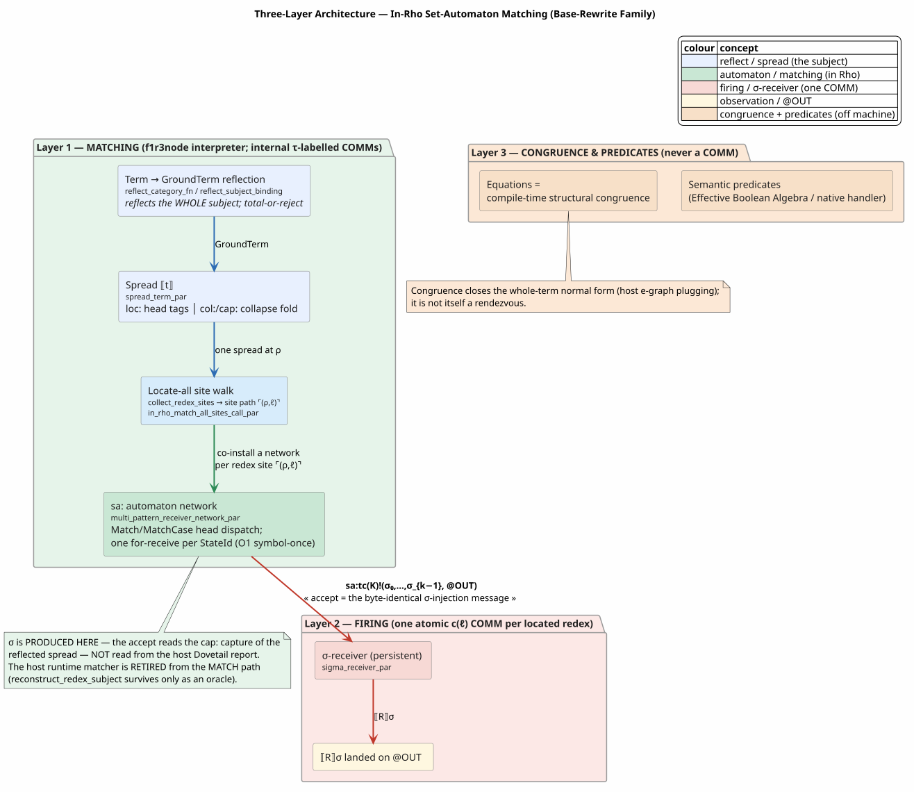
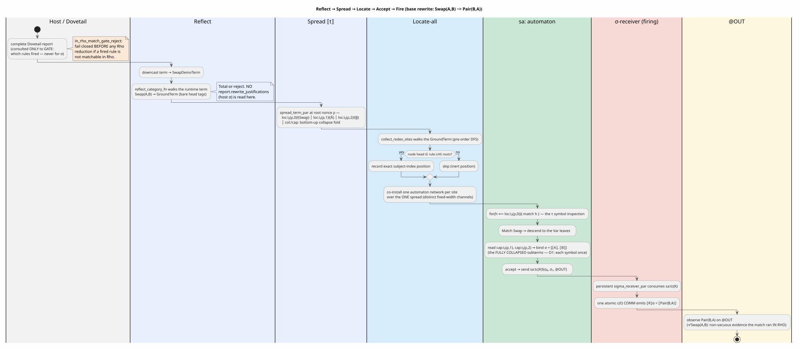
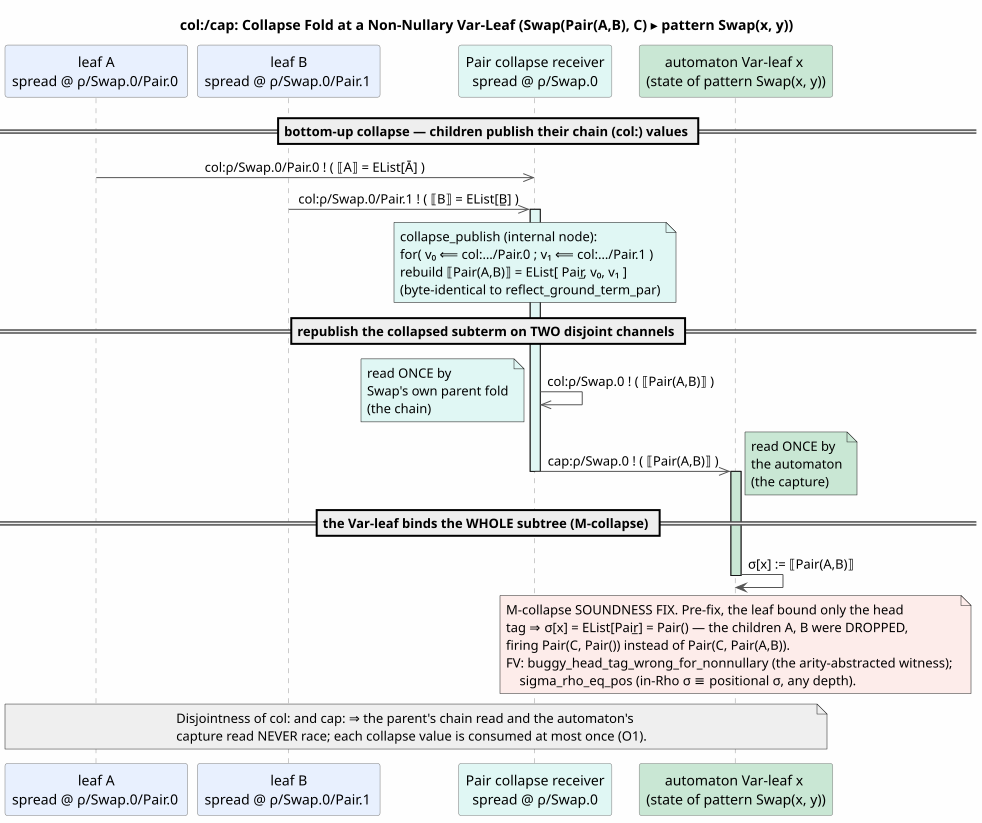
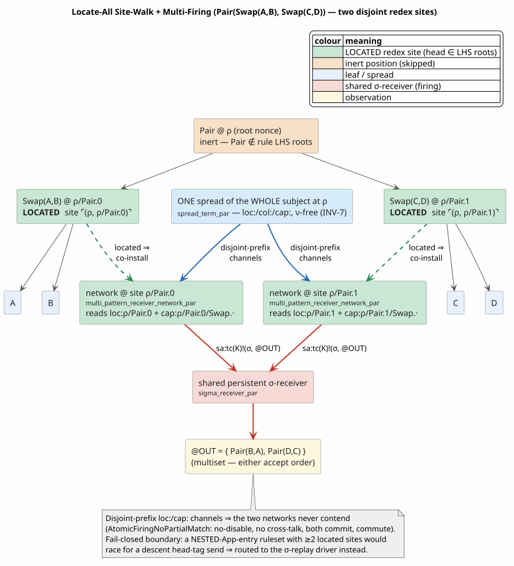
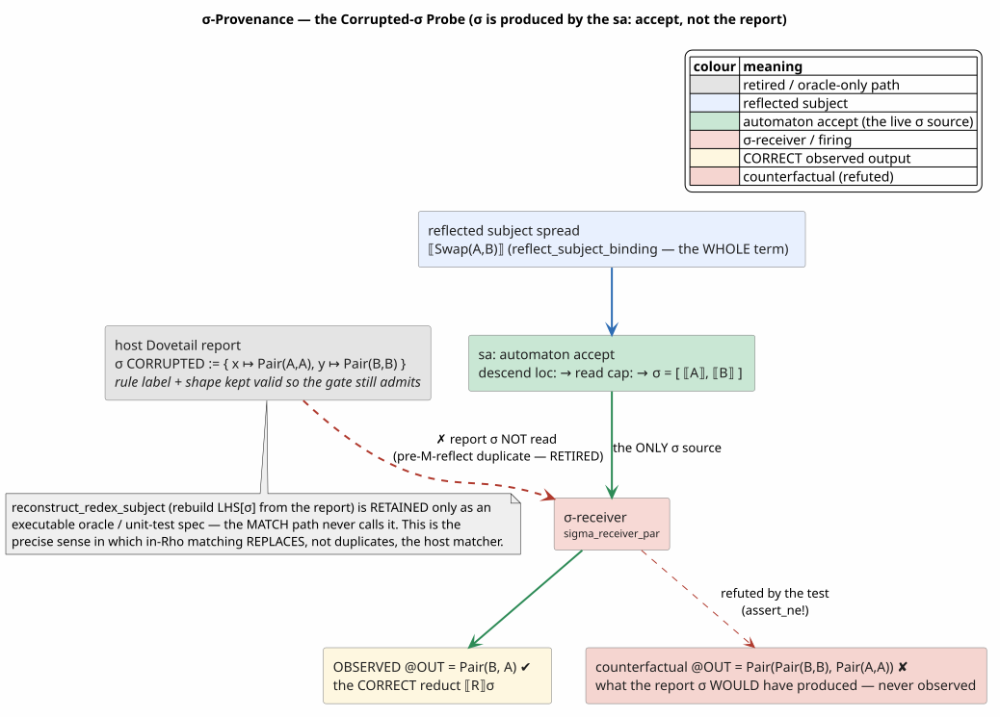

# 25 — In-Rho Set-Automaton Matching: The Base-Rewrite Family

> **Status.** COMPLETE and formally verified for the **base-rewrite family**
> (structural, `Apply`-rooted rewrites, linear and flat non-linear, at any depth and
> any number of redexes). The matching *and* the firing run ON the f1r3node Rholang
> interpreter; the host runtime matcher is **retired** from the match path. The
> associate families — associative-commutative (AC), contextual/congruence, binder,
> and native — now **also match and fire in Rho** (their matching is no longer host-side);
> see [section 11](#11-the-associate-families-completed) and, for the full treatment,
> [26](26-in-rho-ac-family-reference.md) (AC), [19](19-in-rho-binder-beta-substitution.md)
> (binder-β), and [22](22-end-to-end-formal-verification.md) (the whole-$`[\![ G ]\!]`$ capstone).
>
> **How this document relates to the campaign log.** The numbered file
> [`15-in-rho-set-automaton-matching.md`](15-in-rho-set-automaton-matching.md) is the
> *incremental campaign log*, authored one stage per section (Stage 0 firing driver,
> Stage 1 matching, Stage 2 non-linear, and so on). **This** document is the
> consolidated, reconstruction-grade **architecture reference** for the finished
> base-rewrite family: it re-derives the mechanism from first principles so a reader
> can rebuild it from scratch, folding in the Stage-4 work (whole-term reflection, the
> `col:`/`cap:` collapse fold, and locate-all multi-firing) that the campaign log
> predates. Where the two overlap, this document is authoritative for the *completed*
> mechanism; the log retains the staging history.

---

## Table of contents

1. [What problem this solves](#1-what-problem-this-solves)
2. [Notation and glossary](#2-notation-and-glossary)
   - [2.1 INV-S6: the channel-name fingerprint invariant](#21-inv-s6-the-channel-name-fingerprint-invariant)
3. [Theoretical basis](#3-theoretical-basis)
4. [The three-layer architecture](#4-the-three-layer-architecture)
5. [Layer 1a: Term to GroundTerm reflection](#5-layer-1a-term-to-groundterm-reflection)
6. [Layer 1b: the `col:`/`cap:` collapse fold](#6-layer-1b-the-colcap-collapse-fold)
7. [Layer 1c: the automaton network](#7-layer-1c-the-automaton-network)
8. [Layer 1d: locate-all and multi-firing](#8-layer-1d-locate-all-and-multi-firing)
9. [Substitution provenance: replacement, not duplicate](#9-substitution-provenance-replacement-not-duplicate)
10. [The formal-verification backing](#10-the-formal-verification-backing)
11. [The associate families (completed)](#11-the-associate-families-completed)
12. [References](#12-references)

---

## 1. What problem this solves

MeTTaIL languages are defined by a `language! { … }` macro that declares
**constructors** (an algebraic signature), **equations** (structural congruence), and
**rewrites** (directed reductions). Historically, applying a rewrite meant: the host
*Dovetail* engine (an e-graph saturation plus best-first extractor) matched a rule's
left-hand side against the term, computed a substitution $`\sigma`$, and the runtime
*replayed* that firing on the Rholang interpreter by injecting $`\sigma`$ into a
pre-installed receiver. Matching happened **in Rust**; the interpreter only saw the
*consequences* of a match.

The north-star (`knotted-topoi`, [section 3](#3-theoretical-basis)) requires the
*matching itself* to be Rholang: a base rewrite must fire as **one atomic COMM
rendezvous**, and the act of *recognizing a redex* must be a sequence of interpreter
COMMs, not a host computation. This document describes the mechanism that achieves
exactly that for the base-rewrite family, and — critically — does so as a **genuine
replacement** of the host matcher, not a second copy of it running alongside. The
decisive evidence for "replacement, not duplicate" is a probe test that *corrupts* the
host's $`\sigma`$ and observes that the fired result is nonetheless correct
([section 9](#9-substitution-provenance-replacement-not-duplicate)).

The design goals, in order:

| Goal | Meaning | Realized by |
|---|---|---|
| **On-interpreter matching** | recognizing a redex is interpreter COMMs, not Rust | the `sa:` automaton network ([section 7](#7-layer-1c-the-automaton-network)) |
| **Symbol-once optimality ($`O1`$)** | each subject symbol is inspected exactly once | one `for`-receive per interned state; `SymbolOnceInjective` |
| **Whole-term, any depth** | the redex may be nested and non-nullary | whole-term reflection plus `col:`/`cap:` collapse ([sections 5](#5-layer-1a-term-to-groundterm-reflection)–[6](#6-layer-1b-the-colcap-collapse-fold)) |
| **Locate-all, multi-fire** | every redex at every position, simultaneously | the site walk ([section 8](#8-layer-1d-locate-all-and-multi-firing)) |
| **Replacement** | $`\sigma`$ comes from the automaton, not the report | the corrupted-$`\sigma`$ probe ([section 9](#9-substitution-provenance-replacement-not-duplicate)) |
| **Fail closed** | never emit an incorrect network | typed `AutomatonUnsupported` rejections routing to the replay driver |

Throughout, the running example is **SwapDemo** (`languages/tests/definitions/swapdemo.rs`), the
minimal one-rule language:

```
A . |- "A" : Proc ;
B . |- "B" : Proc ;
Pair . x:Proc, y:Proc |- "pair" "(" x "," y ")" : Proc ;
Swap . x:Proc, y:Proc |- "swap" "(" x "," y ")" : Proc ;
rewrites { SwapStep . |- (Swap x y) ~> (Pair y x) ; }
```

Because $`\mathrm{Swap}(A,B) \neq \mathrm{Pair}(B,A)`$ syntactically, a positive
observation of $`\mathrm{Pair}(B,A)`$ is *non-vacuous* evidence that the match happened
in Rho.

---

## 2. Notation and glossary

We fix notation used throughout. Mathematical prose uses MathJax; monospace names are
Rust items or Rholang channels. Every symbol is defined here before first use.

- **Constructor / head symbol** $`f`$: an algebraic operator, e.g. $`\mathrm{Swap}`$,
  $`\mathrm{Pair}`$, $`A`$. Its **arity** is its number of arguments; a **nullary**
  constructor (e.g. $`A`$) has arity $`0`$.
- **Term** $`t`$: a runtime AST value implementing the `mettail_runtime::Term` trait.
- **`GroundTerm`**: a codegen-side, *variable-free* tree $`f(t_1,\dots,t_n)`$ with a
  **bare** constructor label. Reflection
  ([section 5](#5-layer-1a-term-to-groundterm-reflection)) maps a `Term` to a
  `GroundTerm`.
- **Head tag** $`\underline{f}`$: the reflected, interned ground representation of a
  constructor label, produced by `reflect_tag(fingerprint, f)` and carried as a
  `GPrivate` name. The `fingerprint` disambiguates languages so tags of different
  languages never collide.
- **Reflection** $`[\![ t ]\!]`$: the canonical `Par` (Rholang process)
  encoding of a ground term,
  ```math
  [\![ f(t_1,\dots,t_n) ]\!] \;=\; \mathtt{EList}\!\left[\,\underline{f},\ [\![ t_1 ]\!],\ \dots,\ [\![ t_n ]\!]\,\right],
  ```
  implemented by `reflect_ground_term_par` (`rholang-codegen/src/rho_net_lower.rs`). A
  nullary leaf is $`[\![ a ]\!] = \mathtt{EList}[\underline{a}]`$.
- **Substitution** $`\sigma`$: a finite map from a rule's left-hand-side variables to
  ground subterms, e.g. $`\sigma = \{x \mapsto A,\ y \mapsto B\}`$. We write
  $`[\![ R ]\!]\sigma`$ for the reflected right-hand side with $`\sigma`$
  applied.
- **$`\sigma`$-receiver**: the persistent Rholang contract `sigma_receiver_par` that, on
  receiving a $`\sigma`$-tuple, emits $`[\![ R ]\!]\sigma`$. It is the
  **firing seam** ([section 4](#4-the-three-layer-architecture), Layer 2).
- **`sa:` channel** and **trace $`tc(K)`$**: the accept channel is `sa:` followed by
  $`tc(K)`$, where $`tc(K) = \ulcorner T_M(K) \urcorner`$ is the reflected, interned
  **suspended automaton trace** of a context $`K`$ — the paper's *optimal* channel name
  ([section 3](#3-theoretical-basis)). Structurally equal sub-patterns share one
  interned `StateId`, hence one `sa:` channel. Built by
  `RhoNetChannel::set_automaton_trace(fingerprint, trace)`
  (`rholang-codegen/src/rho_net.rs`), which yields `sa:{fingerprint}/{trace}`
  ([section 2.1](#21-inv-s6-the-channel-name-fingerprint-invariant)).
- **`loc:` / `col:` / `cap:` channels**: the three *spread* channel families
  ([section 6](#6-layer-1b-the-colcap-collapse-fold)). `loc:` carries a node's head tag
  (head-symbol dispatch); `col:` (chain) carries a fully-collapsed subterm *up to its
  parent's fold*; `cap:` (capture) carries the *same* collapsed subterm *to the
  automaton*, on a disjoint name.
- **Location $`\ell`$ and site path $`\ulcorner(\rho,\ell)\urcorner`$**: a **position**
  $`\ell`$ in the spread is a path from the root, e.g. `Pair.0`. Each site is opened at a
  fresh **root nonce** $`\rho`$; the ground, `nu`-free quoted name
  $`\ulcorner(\rho,\ell)\urcorner`$ is the automaton's handle on that position.
  "`nu`-free" means **no `New` / name allocation** is needed — freshness is by
  *quoting* (invariant INV-7).
- **`StateId`**: the host `PatternCompiler`'s interned identifier for an automaton
  state (a sub-pattern up to the $`O1`$/$`O3`$ quotient). Re-keying `sa:` channels by
  `StateId` realizes the optimal scheme.
- **$`O1`$ (symbol-once)**: the discipline that *each symbol of the subject is inspected
  exactly once* — one `for`-receive per state, the position-to-channel map injective.
  Proven by `SymbolOnceInjective`.
- **$`O3`$ (share-the-match fan-out)**: when several rules share one left-hand side, the
  single match is shared and the accept is announced to *every* rule's channel in
  parallel.
- **CLTS**: the **context-labelled transition system** of `knotted-topoi` — the
  reference semantics. A transition is labelled by the *context* in which a redex
  fires. Correctness means the in-Rho realization induces the *same* CLTS as the sound
  location-channel scheme.
- **$`\tau`$ (internal step)**: an unobservable transition. The `loc:`/`col:`/`cap:`
  matching COMMs are $`\tau`$; only the firing COMM is observable.
- **Redex**: a subterm matching a rule left-hand side. **Normal form**: a term with no
  redex.

The single semantic law the whole design serves is the CLTS **firing law**: a base
rewrite $`L \Rightarrow R`$ firing at location channel $`c`$ is one atomic COMM,

```math
[\![ L \Rightarrow R ]\!](c) \;=\; \mathtt{for}\bigl([\![ L ]\!] \Leftarrow c\bigr)\,\bigl\{\, c!\bigl([\![ R ]\!]\bigr) \,\bigr\}.
```

Everything below is the machinery that lets the interpreter *locate* $`c`$ and *bind*
$`\sigma`$ so this law can fire, in Rho, at every redex.

---

### 2.1 INV-S6: the channel-name fingerprint invariant

> **INV-S6.** Every channel name emitted by the driver network contains the emitting
> language's fingerprint.

**The ABI.** Every name in every driver-network family is minted by one primitive,
`rho_net::scoped_channel_name` (`rholang-codegen/src/rho_net.rs`):

```math
\mathrm{chan}(\mathit{family}, \mathit{fp}, \mathit{path}) \;=\;
\mathit{family} \;\Vert\; \mathtt{":"} \;\Vert\; \mathit{fp} \;\Vert\; \mathtt{"/"} \;\Vert\; \mathit{path}
```

where $`\mathit{fp}`$ is `language_definition_fingerprint(def)`, rendered
`mettail-langdef-v1:{16 hex}`. The fingerprint rides **verbatim**, so two names are equal
iff their $`(\mathit{family}, \mathit{fp}, \mathit{path})`$ triples are equal: the scheme
is collision-free *by construction*, with no probability to bound. Because $`\mathit{fp}`$
is slash-free, the first `/` after the family prefix splits scope from path unambiguously.

**Why the scoping lives at the KEY, not at the emission sites.** Only the *roots* are
scoped; every derived name inherits by composition:

```math
\begin{aligned}
\texttt{spread\_child\_location}(\mathit{parent}, f, i) &= \mathit{parent} \Vert \mathtt{"/"} \Vert f \Vert \mathtt{"."} \Vert i \\
\texttt{ac\_carrier\_channel}(\mathit{loc}, \mathit{op}) &= \mathtt{"ac:"} \Vert \mathit{loc} \Vert \mathtt{"/"} \Vert \mathit{op} \\
\texttt{contextual\_premise\_hole\_channel}(c) &= \mathtt{"ph:"} \Vert c
\end{aligned}
```

so scoping the roots scopes the whole tree. This matters practically: `RhoNetChannel::
location` alone has **nineteen** production callers, and two separate attempts to fix the
defect below by enumerating emission sites both came up short. The requirement is therefore
stated as a property of the emitted `Par` and **checked by sweep**
(`rholang-codegen/tests/s6_channel_fingerprint_invariant.rs`), which walks every channel
position of two fully compiled production languages, buckets each name by the runtime COMM
taxonomy, and fails on any unscoped name or unrecognized family.

#### The defect it closes: a cross-fingerprint WRONG FIRING

Before INV-S6 the families were keyed on values two languages routinely share:

| family | old key | collides when |
|---|---|---|
| `sa:pattern/…` | `fnv1a64(pattern_identity(lhs))` | two LHS patterns have the same TEXT |
| `ac:{op}` | the bare constructor label | two languages declare an AC constructor of the same NAME |
| `loc:`/`col:`/`cap:` | a caller-supplied site string | two languages spread at the same site string |

The third is the sharpest, and it is a wrong firing rather than mere starvation. A pure
`loc:` collision alone would only starve both parties: `wrap_descent` emits
`for(h <- loc){ match h { f̲ => … } }`, so the receive binds `h` **unconditionally** and the
tag test is a `match` *inside* the continuation with a single ground arm and no wildcard —
the COMM fires, the match finds no arm, and the value is consumed and lost. But `cap:` is
**not an independent family**: `spread_root_location` and `collapse_capture_location` derive
from the *same* `root_location`, and `rho_net_automaton` derives both roots together. And a
σ capture **cannot discriminate by construction** — `wrap_children` / `wrap_capture_chain`
bind the fully collapsed subterm, because a pattern variable must accept an *arbitrary*
subterm, so there is no tag to match on and there could not be one. Language B's capture
receiver therefore consumed language A's collapsed subterm and instantiated **B's RHS with
A's operand**.

```text
       language A (fp_A)                        language B (fp_B)
   ┌──────────────────────────┐             ┌──────────────────────────┐
   │ spread ⟦Swap(X,Y)⟧ at ρ  │             │ automaton for Swap(x,y)  │
   └───────────┬──────────────┘             └───────────┬──────────────┘
               │ publishes ⟦X⟧                          │ reads σ-slot
               ▼                                        ▼
      BEFORE:  cap:ρ/Swap.0  ●───────── SAME NAME ──────● cap:ρ/Swap.0
                             ↑
                     no tag test is possible here — a Var-leaf
                     binds an arbitrary subterm by definition
                             ↓
                     B fires ITS RHS on A's operand   ⚠ WRONG FIRING

      AFTER:   cap:fp_A/ρ/Swap.0  ✗   ≠   ✗  cap:fp_B/ρ/Swap.0
                                 disjoint by construction
```

**The site nonce was not a defence.** `spread_root_location`'s documentation described
`root_location` as "the quoted per-site nonce $`\rho`$ of the $`\ulcorner(\rho,\ell)\urcorner`$
idiom", which reads as though it separated languages. It did not: `root_location` is a plain
caller-supplied `&str`, and `spread_term_par(term, language_fingerprint, root_location)`
takes the fingerprint **for the tags** and the location as an **independent** argument, never
derived from it. Two languages spreading at `"site0"` — or at a `rewrite/{label}/…` path built
from a constructor name they happen to share — collided on every location channel of that site.

**Consequence for incremental compilation.** Appending a rewrite changes the whole-definition
fingerprint, so the E-3 T-INCR bypass's reused accept channels and contextual premise channels
must be re-scoped (`rescope_channel_fingerprint`); its debug cross-check against the full batch
derivation is what proves the re-scope exact. See `rholang-codegen/src/rho_net_incremental.rs`.

---

## 3. Theoretical basis

Three sources fix the design.

**Set-automaton matching (Erkens and Groote; Bouwman and Erkens).** A *set automaton*
compiled from a set of patterns reads a subject term and **locates all matches** in a
single traversal that inspects each subject symbol **once** — the $`O1`$ property. Erkens
and Groote (ICTAC 2021) give the automaton that "locates all pattern matches in a
term"; Bouwman and Erkens (2022) build term rewriting on top of it. Our host
`dovetail::set_automaton` is a faithful implementation; the codegen serializes *its
compiled states* into Rholang receivers, so the in-Rho matcher inherits the papers'
symbol-once traversal by construction rather than re-deriving it.

**Optimal channel naming (Meredith, `[optimal]`).** To render matching as Rholang
COMMs, each automaton state becomes a `for`-receive over a channel. Naming that channel
by the *whole* left-hand side (the rejected `@K` scheme) is sound but wasteful; naming
it by the **interned suspended-trace** $`tc(K) = \ulcorner T_M(K) \urcorner`$ makes
structurally-equal sub-patterns **share** one channel — Meredith's *optimal*,
condition-$`O1`$ scheme (its section 2.2 unfolds a pattern-receive into nested
single-name receives with name-equality guards, exactly our linear descent plus `eq:`
guard). The host `PatternCompiler::intern` already computes this quotient, so re-keying
`sa:` channels by `StateId` *is* the optimal scheme with no extra work.

**Knotted-topoi (Meredith).** This is the reference semantics. It fixes: (i) the firing
law above; (ii) location channels $`c(\ell) = \ulcorner \ell \urcorner`$; (iii)
**freshness-by-quoting** (no central name allocator — the `nu`-free INV-7 scheme); (iv)
equations as *structural congruence* (never a COMM); and (v) the assertion
(`rem:nonopt`) that the **sound** (location-keyed) and **optimal** (state-keyed) channel
schemes induce the **same** CLTS. That assertion is not free in our setting — moving
matching into Rho *forces* it to be proven, and it is (`InRhoSameCLTSWeakBisim`,
[section 10](#10-the-formal-verification-backing)).

**Why this is a replacement, not a duplicate.** In the pre-Stage-4 model the host
computed $`\sigma`$ and the runtime merely *replayed* it; the interpreter never matched.
Stage 4 reflects the **whole subject term** structurally and lets the automaton
**locate the redex and produce $`\sigma`$** on the interpreter. The host report survives
only to (a) **gate** — decide which rules fired, fail closed if a fired rule is not
matchable in Rho — and (b) drive the **replay fallback** for the shapes still out of
scope. The host runtime *matcher* (`reconstruct_redex_subject`, which rebuilds
$`L\sigma`$ from the report) is **no longer on the match path**; it is retained only as
an executable oracle. [Section 9](#9-substitution-provenance-replacement-not-duplicate)
proves this empirically.

---

## 4. The three-layer architecture

The mechanism is three layers, each faithful to the same CLTS (Figure A).



**Figure A — the three layers.** *Layer 1 (Matching)* and *Layer 2 (Firing)* run on the
f1r3node interpreter; *Layer 3 (Congruence and predicates)* is off the COMM machine.

1. **Matching (Layer 1).** The runtime subject `term` is *reflected* to a `GroundTerm`
   ([section 5](#5-layer-1a-term-to-groundterm-reflection)), *spread* across
   `loc:`/`col:`/`cap:` channels
   ([section 6](#6-layer-1b-the-colcap-collapse-fold)), and a network of persistent
   `sa:` receivers is *co-installed at every redex site*
   ([section 8](#8-layer-1d-locate-all-and-multi-firing)). Each state is one
   `for`-receive — the $`\tau`$ symbol inspection of the set-automaton papers —
   dispatching on head symbols via `Match`/`MatchCase`. These are internal ($`\tau`$)
   COMMs.

2. **Firing (Layer 2).** On an accepting match the network sends
   $`\texttt{sa:}tc(K)!(\sigma_0,\dots,\sigma_{k-1}, @\mathit{out})`$ — **byte-identical**
   to the message the host injection built — so the *existing* persistent
   `sigma_receiver_par` fires unchanged and lands $`[\![ R ]\!]\sigma`$ in one
   atomic $`c(\ell)`$ COMM.

3. **Congruence and predicates (Layer 3).** Equations compile to compile-time
   structural congruence (never a COMM). Semantic predicates are the sole off-machine
   class, evaluated by an Effective-Boolean-Algebra / native handler. The whole-term
   normal form is closed by host e-graph plugging — itself not a rendezvous, consistent
   with the tex leaving the whole-program `opcorr` open.

The **seam** between Layer 1 and Layer 2 is a single message shape. Because Layer 1
emits *exactly* the tuple Layer 2 already consumes, the firing infrastructure is reused
verbatim; only the *producer* of that tuple changed (from host injection to in-Rho
accept). This is the architectural key to "replacement, not rewrite".

The end-to-end pipeline for one base rewrite is Figure B.



**Figure B — the pipeline** for $`\mathrm{Swap}(A,B) \Rightarrow \mathrm{Pair}(B,A)`$. The
host report is consulted only to *gate*; the substitution is produced by the `sa:`
accept reading the spread.

The generated entry point is
`<Lang>::rho_net_match_invocation_from_dovetail_to(term, report, out)`
(`macros/src/gen/runtime/rho_invocation.rs`, the `match_body`), whose body is:

```text
⟨rho_net_match_invocation_from_dovetail_to⟩ ≡
  1. report.assert_complete()                       ▷ shape check only
  2. ⟨Reflect the subject to __subject : GroundTerm⟩ ▷ section 5, NO host σ
  3. reconstruct the LanguageDef; compile the InRhoMatchingRuleset
  4. gate: reject if any FIRED rule is not matchable in Rho (fail closed, pre-reduction)
  5. (__call, _sites) ← in_rho_match_all_sites_call_par(ruleset, __subject, "site0", out)  ▷ section 8
  6. return RhoNetInjectionInvocation { call : __call, out_channel : out }
```

---

## 5. Layer 1a: Term to GroundTerm reflection

**Intuition.** The automaton must be handed the subject as data it can spread. The old
path rebuilt the subject from the report's $`\sigma`$ (`reconstruct_redex_subject`, i.e.
$`L\sigma`$); the new path reflects the **whole runtime `term`** *structurally*, without
ever reading $`\sigma`$. This is the greenfield hinge that lets the automaton — not the
host — decide *where* the redex is and *what* $`\sigma`$ is.

**Mechanism.** For each declared category the macro emits a per-category function
`__mettail_rho_net_reflect_<cat>` (`reflect_category_fn`,
`macros/src/gen/runtime/rho_invocation.rs`). The functions are mutually recursive nested
`fn`s, so cross-category structural fields resolve without a trait surface. The subject
binding (`reflect_subject_binding`) downcasts `term` to `<Lang>Term` and reflects
`typed_term.0` — the primary category, or, for a multi-category language, the first
structurally-reflectable alternative of the `<Lang>TermInner` cross-category enum (fail
closed otherwise).

Each per-category function is **total-or-reject** over the category's variants:

| Variant | Reflects? | Ground image |
|---|---|---|
| **Nullary** $`a`$ | yes | `GroundTerm::new("a", [])` |
| **Regular** $`f(g_1,\dots)`$, *all fields structural* | yes | `GroundTerm::new("f", [reflect(g_1)?, …])` |
| Regular with a **non-structural** field | **reject** | (no positional ground image) |
| **Var** / **Literal** leaf | **reject** | (a variable/literal has no structural image) |
| **Collection** (AC bag/list) | **reject** | (matched via the AC path, [section 11](#11-the-associate-families-completed)) |
| **Binder** / **MultiBinder** | **reject** | (matched via the binder path, [section 11](#11-the-associate-families-completed)) |

A field is *structural* (`is_structural_category_field`) if and only if it is a
non-collection, non-optional, non-predicate subterm whose category is a language
non-terminal (not a builtin like `i32`). Rejections are **typed reasons**, not panics: a
rejected shape routes the firing to the replay driver rather than emitting a wrong
match.

Literate form of the generated reflector (one category shown):

```text
⟨reflect_<cat>(term) → Result<GroundTerm, String>⟩ ≡
  match term:
    <cat>::a                               ⇒ Ok(GroundTerm("a", []))            ▷ Nullary
    <cat>::f(g₁, …, gₙ)  if all structural  ⇒
        Ok(GroundTerm("f", [ reflect_<catᵢ>(gᵢ.as_ref())? for i in 1..=n ]))   ▷ Regular
    <cat>::f(..)                            ⇒ Err("non-structural field")        ▷ reject
    <cat>::v(..) | <cat>::lit(..)           ⇒ Err("variable/literal leaf")        ▷ reject
    <cat>::coll(..)                         ⇒ Err("AC/collection node")           ▷ reject
    <cat>::bind(..)                         ⇒ Err("binder node")                  ▷ reject
```

For SwapDemo, reflecting the runtime value `Proc::Swap(Arc(Proc::A), Arc(Proc::B))`
gives the `GroundTerm` $`\mathrm{Swap}(A,B)`$ with children $`A`$ and $`B`$ — no $`\sigma`$
consulted. That reflected tree is the automaton's input.

---

## 6. Layer 1b: the `col:`/`cap:` collapse fold

**Intuition.** The automaton reads the subject not as one message but *spread out*:
every node publishes its head tag on its own quoted channel, so a state can inspect one
symbol with one COMM (the $`O1`$ discipline). But a *variable* leaf of a pattern must bind
a **whole subterm**, which may be arbitrarily deep — so the spread also runs a
**bottom-up fold** that reassembles each subtree's full reflection and offers it on a
capture channel. This fold is the subtle, load-bearing part of the design; it is the fix
for a real soundness bug (below).

**The spread law.** `spread_term_par` (`rholang-codegen/src/rho_net_lower.rs`) realizes,
for a node at location $`\ell`$,

```math
[\![ f(t_1,\dots,t_n) ]\!]_\ell \;=\; \underbrace{\texttt{loc:}\ell\,!(\underline{f})}_{\text{head tag}} \;\bigm|\; \prod_{i=1}^{n} [\![ t_i ]\!]_{\ell\cdot(f,i)} \;\bigm|\; \underbrace{\mathrm{collapse}(\underline{f}; \ell)}_{\text{fold}}.
```

Each node publishes **only** its head tag $`\underline{f}`$ on its deterministic location
channel `loc:`$`\ell`$ (`spread_root_location` gives `loc:fp/ρ`; `spread_child_location`
gives `loc:fp/ρ/f.i`); child locations are *derived*, never carried in the message. The
scheme is **`nu`-free** (INV-7): a flat parallel composition of ground sends — no `New`,
no bound variable.

**The collapse fold.** `collapse_publish` emits, per node, its fully-collapsed subterm
value $`[\![ \text{subtree} ]\!]`$ on **two disjoint channels**:

- **`col:`** $`\ell`$ (chain, `collapse_chain_location`, i.e. `"col:" + fp + "/" + ℓ`):
  read **once** by the *parent's* fold, so a parent can rebuild *its* subtree from its
  children.
- **`cap:`** $`\ell`$ (capture, `collapse_capture_location`, i.e. `"cap:" + fp + "/" + ℓ`):
  read **once** by the *automaton's* Var-leaf state, so a variable binds the subtree.

Here $`\mathit{fp}`$ is the language fingerprint that scopes every channel name
([section 2.1](#21-inv-s6-the-channel-name-fingerprint-invariant)); it is the *only*
discriminator available on `cap:`, because a Var-leaf capture binds an arbitrary subterm
and so admits no tag test.

A **leaf** publishes two ground sends
$`\texttt{col:}\ell\,!(\mathtt{EList}[\underline{f}]) \mid \texttt{cap:}\ell\,!(\mathtt{EList}[\underline{f}])`$.
An **internal** node is a polyadic join that consumes its children's `col:` values and
republishes its own:

```math
\mathtt{for}\bigl(v_0 \Leftarrow \texttt{col:}\ell\!\cdot\!(f,0);\ \dots;\ v_{n-1} \Leftarrow \texttt{col:}\ell\!\cdot\!(f,n\!-\!1)\bigr)\ \bigl\{\ \texttt{col:}\ell\,!(E) \mid \texttt{cap:}\ell\,!(E)\ \bigr\},\quad E = \mathtt{EList}[\underline{f}, v_0, \dots, v_{n-1}].
```

Because child $`i`$ binds $`\mathtt{BoundVar}(n-1-i)`$ (the join flattens in bind order), the
rebuilt $`E`$ reproduces `reflect_ground_term_par`'s
$`[\underline{f}, [\![ c_0 ]\!], \dots]`$ shape **byte-for-byte**. In other
words, the value published at a node's collapse channels *equals*
$`[\![ \text{subtree} ]\!]`$ — the fold is the Rho realization of
`reflect_ground_term_par`, assembled bottom-up rather than in one host-side nest.

Literate form:

```text
⟨spread_term_par_at(node, loc, chainLoc, capLoc)⟩ ≡
  emit  loc!(head_tag(node.constructor))                 ▷ the τ dispatch symbol
  childChains ← []
  for (i, child) in node.children:
      cLoc   ← loc      · (node.constructor, i)          ▷ derived loc: child channel
      cChain ← chainLoc · (node.constructor, i)
      cCap   ← capLoc   · (node.constructor, i)
      childChains.push(cChain)
      ⟨spread_term_par_at(child, cLoc, cChain, cCap)⟩     ▷ recurse (left→right, L order)
  ⟨collapse_publish(chainLoc, capLoc, head_tag, childChains)⟩

⟨collapse_publish(chainLoc, capLoc, tag, childChains)⟩ ≡
  if childChains = []:                                    ▷ leaf
      E ← EList[tag]
      emit  chainLoc!(E)  |  capLoc!(E)
  else:                                                   ▷ internal node
      emit  for(vᵢ ⟸ childChains[i] for each i) {
              E ← EList[tag, v_{n-1}, …, v₀]              ▷ reverse De Bruijn ⇒ [tag, c₀, …]
              chainLoc!(E) | capLoc!(E)
            }
```

**The M-collapse soundness fix.** Before the fold existed, a Var-leaf state bound only
the node's *head tag* (`EList[tag]`). That is correct **only for a nullary leaf**. For a
non-nullary subject it silently **dropped the children**: matching
$`\mathrm{Swap}(\mathrm{Pair}(A,B), C)`$ with pattern $`\mathrm{Swap}(x,y)`$ bound
$`x \mapsto \mathrm{Pair}()`$ instead of $`x \mapsto \mathrm{Pair}(A,B)`$, firing
$`\mathrm{Pair}(C, \mathrm{Pair}())`$ instead of $`\mathrm{Pair}(C, \mathrm{Pair}(A,B))`$.
The `cap:` collapse makes the Var-leaf bind the **whole**
$`[\![ \text{subtree} ]\!]`$, so $`\sigma`$ is correct at arbitrary depth. Figure
C traces the fold for exactly this non-nullary case.



**Figure C — the fold at a non-nullary Var-leaf.** The leaves $`A,B`$ publish their `col:`
values; the $`\mathrm{Pair}`$ node's join rebuilds
$`[\![ \mathrm{Pair}(A,B) ]\!]`$ and republishes on `col:` (to its parent) and
`cap:` (to the automaton). The Var-leaf $`x`$ reads `cap:` and binds the whole subtree.

The disjointness of `col:` and `cap:` is what keeps this $`O1`$: the parent's chain read
and the automaton's capture read never race for one value, and each collapse value is
consumed at most once — the collapse *is* that consumption. This is proven:
`collapse_faithful` (i.e. $`\mathrm{collapse}(n) = n`$) and `sigma_rho_eq_pos` (the in-Rho
$`\sigma`$ *equals* the positional $`\sigma`$ at any depth); `buggy_head_tag_wrong_for_nonnullary`
records the exact bug the fold removed
([section 10](#10-the-formal-verification-backing)).

---

## 7. Layer 1c: the automaton network

**Intuition.** The compiled set automaton is a set of states; we serialize it into a
tree of `for`-receives over the spread channels. Head-symbol states read `loc:` and
`Match`-dispatch; variable states read `cap:` and bind. When the walk reaches an
accepting configuration it emits the $`\sigma`$-tuple on the rule's `sa:` channel.

**Mechanism.** `multi_pattern_receiver_network_par`
(`rholang-codegen/src/rho_net_automaton.rs`) serializes one or more `App`-rooted entries
into **one** network sharing a single root `loc:` receive. It groups entries by root op:

- The **root** head tag is received once on `loc:`$`\rho`$ and `Match`-dispatched — **one
  `MatchCase` per distinct root op** (the reified `app_roots` router). Because the spread
  publishes each head tag exactly once (a single-shot send), only one `for` can consume
  it: the reified $`\tau`$ symbol inspection.
- A **flat** entry (all direct children are Var leaves) wraps `arity` Var-leaf
  `for`-receives around the accept, each reading a **`cap:`** capture channel
  (`wrap_children`, then `wrap_capture_chain`), so each binds a fully-collapsed
  $`[\![ \text{subtree} ]\!]`$.
- A **nested** entry (some direct child is an `App`) takes a *descend-then-collapse*
  path: `collect_nested_schedule` DFS-collects the nested `App` **descents** (`loc:`
  head-tag `Match`es, `wrap_descent`) and the Var-leaf **captures** (`cap:`), and
  `build_nested_case_body` wraps the captures innermost and the descents in DFS-reverse
  order. This is the Stage-4 generalization that removed the old "non-nullary var
  subtree" rejection.

**The accept.** `build_accept_send` emits, per entry,

```math
\texttt{sa:}tc(K)\,!\bigl(\sigma_0,\dots,\sigma_{k-1},\ @\mathit{out}\bigr),\qquad \sigma_d = \mathtt{BoundVar}(\mathit{arity}-1-p),\ \ p = \mathit{first\_occ}[d],
```

with **one $`\sigma`$ slot per *distinct* left-hand-side variable** ($`k`$ = the
distinct-variable count). The child bound at position $`p`$ is the node's `cap:` value —
the fully-collapsed $`[\![ \text{subtree} ]\!]`$ — so the $`\sigma`$ slot **is**
that subtree, *not* `EList[head tag]`. This distinct-variable arity is the
**triad-coherence** point: the $`\sigma`$-receiver has $`k`$ formals (`lower_lhs_vars` dedups
repeats), so the accept must send $`k`$ slots, not `arity`. For a **linear** entry
$`\mathit{first\_occ} = [0,\dots,\mathit{arity}-1]`$ and this reduces to the plain
positional send. The message is byte-identical to the host injection, so
`sigma_receiver_par` fires unchanged.

Literate form (flat linear case):

```text
⟨network_for(view, ρ, targets, fingerprint)⟩ ≡
  rootCh  ← loc:ρ ;  capRoot ← cap:ρ
  cases ← []
  for entry in view.entries:
      (op, args) ← view.root(entry)                       ▷ App root
      target     ← targets.find(entry)                    ▷ the entry's sa: channel
      accept     ← build_accept_send(target.sa, out, arity, first_occ)
      body       ← wrap_capture_chain(                    ▷ read cap:ρ/op.i, innermost first
                       [ capRoot·(op,i) for i in 0..arity ], accept)
      cases.push( MatchCase(head_tag(op) ⇒ body) )
  return  for(h ⟸ rootCh){ match h { cases } }

⟨build_accept_send(sa, out, arity, first_occ)⟩ ≡
  data ← [ BoundVar(arity-1-first_occ[d]) for d in 0..k ]  ++  [ @out ]
  return  sa!(data…)                                       ▷ byte-identical injection
```

**Non-linear consistency (flat).** A flat entry with a repeated variable (e.g.
$`f(x,x)`$) is matched by an **`eq:` guarded polyadic join** (`join_children_receiver`):
one atomic `for` binding all `arity` children, whose `condition` (`consistency_guard`)
is the conjunction
$`\bigwedge_{j}\ \mathtt{EEq}\bigl(\mathtt{BoundVar}(\mathit{arity}-1-q_0),\ \mathtt{BoundVar}(\mathit{arity}-1-q_j)\bigr)`$
over each repeated variable's occurrence positions $`q_0 < q_1 < \dots`$. Since the
children are the `cap:` collapse values, the guard compares **fully-collapsed subterms**
— repeated occurrences match if and only if their *whole subtrees* are equal. On
inequality the reducer's `check_commit` vetoes the **entire** consume (no child
consumed), the reject-safe `merge_substs → None` at the strongest granularity. The join
(not a nested chain) is required because f1r3node substitutes a receive's guard at binder
depth 1, so only a single receive's binds are visible to the guard.

**$`O1`$ and $`O3`$.** The interned-state key is the $`O1`$/$`O3`$ quotient: structurally-equal
sub-patterns share one `StateId`, hence one `sa:` receiver — the `[optimal]` scheme's
channel sharing. When several rules share a left-hand side, the accept announces to
*every* rule's channel in parallel (`parallel_accept`) — the $`O3`$ fan-out.

**Fail-closed shapes.** Rather than emit an incorrect network, the serializer returns a
typed `AutomatonUnsupported` for: `MultiPattern` (wrong entry point), `NonLinearVariable`
(a deep-position repeat), `NonLinearSharedOp` (two entries share a root op with different
repetition partitions), `VariableRootPattern` (a bare-var root), `ConflictingArityForOp`,
`MissingAcceptTarget`, and `NestedEntryMultiSite`
([section 8](#8-layer-1d-locate-all-and-multi-firing)). Each routes the firing to the
replay driver — still correct, just off the in-Rho path.

---

## 8. Layer 1d: locate-all and multi-firing

**Intuition.** A redex need not be the whole term. `Pair(Swap(A,B), B)` has its only
redex *nested* at `Pair.0`; `Pair(Swap(A,B), Swap(C,D))` has *two*. The set-automaton
papers locate **all** matches in one traversal; we realize that by spreading the whole
subject **once** and co-installing a positional network at **every** position whose head
is a rule left-hand-side root.

**Mechanism.** `in_rho_match_all_sites_call_par`
(`rholang-codegen/src/rho_net_ruleset.rs`):

1. `rule_lhs_root_constructors` reads the compiled automaton for the set of
   left-hand-side root ops (the dispatch candidates) — reading **only** the automaton,
   never the report.
2. `collect_redex_sites` walks the reflected `GroundTerm` (pre-order DFS), recording a
   **site path** $`\ulcorner(\rho,\ell)\urcorner`$ at every position whose head is in that
   set. The path is derived with the *same* `spread_child_location` derivation the
   spread uses, so a site's network reads exactly the channels the one spread published
   there. Distinct positions get **disjoint-prefix** site strings.
3. For each site, `multi_pattern_receiver_network_par` builds a network rooted at that
   position; all networks are composed with the **one** spread of the whole subject.

```math
\texttt{call} \;=\; \Bigl(\ \prod_{\ell \in \mathrm{sites}} \mathrm{network}(\rho,\ell)\ \Bigr)\ \Bigm|\ [\![ \mathrm{subject} ]\!]_\rho.
```

Each site's accept fires the matched rule's $`\sigma`$-receiver on the *shared*
`@out`, so a single isolated run observes **every** located redex's contractum on that
channel. Figure D shows the site walk and co-installation for the two-redex case.



**Figure D — locate-all and multi-firing** for `Pair(Swap(A,B), Swap(C,D))`. The inert
`Pair` root is skipped; the two `Swap` children are located sites; one spread feeds two
co-installed networks; both accepts fire the shared $`\sigma`$-receiver.

**Why co-installation is contention-free.** A **flat** entry's network reads only its own
root `loc:` and its direct-child `cap:` channels, which are **disjoint across distinct
positions** (`loc:ρ/ℓ₁` and `loc:ρ/ℓ₂` differ, and likewise the `cap:` prefixes). So
co-installing one network per position over one spread never contends for a channel
(`ruleset_all_entries_flat`). This disjointness is the $`O1`$ symbol-once property in
channel form (`SymbolOnceInjective`: position-to-channel is injective).

**The fail-closed boundary.** A **nested** entry *descends* `loc:` head tags into its
arguments; a co-installed root attempt at a descent position could then **race** for that
one linear head-tag send, potentially dropping a match. Therefore
`in_rho_match_all_sites_call_par` admits:

- a **flat-only** ruleset at **any** number of sites (disjoint reads); or
- a **nested** ruleset at **at most one** site (no co-installation, hence no contention).

A nested ruleset with **two or more** located redexes fails closed with
`AutomatonUnsupported::NestedEntryMultiSite`, routing to the replay driver — never a
wrong match. SwapDemo is flat-only, so it locates **all** its redexes in Rho.

**The replay fallback is retired for the base family.** With locate-all in place, the old
root-rooted single-redex path and its replay fallback are retired for the base family.
The nested test `nested_redex_fires_in_rho_no_replay_fallback`
(`rholang-runtime/tests/rho_net_equivalence.rs`) asserts that
`rho_net_match_invocation_from_dovetail_to` returns `Ok` (the match path, *not* the
replay branch) for `Pair(Swap(A,B), B)` and observes `Pair(B,A)` — the fallback-retirement
proof. The multi-firing test observes both `Pair(B,A)` and `Pair(A,B)` for
`Pair(Swap(A,B), Swap(B,A))`.

**Worked examples.**

| Subject | Sites located | In-Rho result on `@out` | Exercises |
|---|---|---|---|
| $`\mathrm{Swap}(A,B)`$ | 1 (root) | $`\mathrm{Pair}(B,A)`$ | base, nullary leaves |
| $`\mathrm{Swap}(\mathrm{Pair}(A,B),C)`$ | 1 (root) | $`\mathrm{Pair}(C,\mathrm{Pair}(A,B))`$ | non-nullary $`\sigma`$ via `cap:` collapse (section 6) |
| $`\mathrm{Pair}(\mathrm{Swap}(A,B),B)`$ | 1 (at `Pair.0`) | $`\mathrm{Pair}(B,A)`$ at that site | nested locate (fallback retired) |
| $`\mathrm{Pair}(\mathrm{Swap}(A,B),\mathrm{Swap}(C,D))`$ | 2 (at `Pair.0`, `Pair.1`) | $`\{\mathrm{Pair}(B,A),\ \mathrm{Pair}(D,C)\}`$ | multi-firing, disjoint sites |

(The last row's whole-term contextual reassembly is the congruence slice —
[section 11](#11-the-associate-families-completed) — not the base
family; here each *site's* contractum is observed.)

---

## 9. Substitution provenance: replacement, not duplicate

The strongest claim of this design is that in-Rho matching **replaces** the host matcher
rather than duplicating it — i.e. the substitution that fires the rewrite is **produced
by the automaton accept**, not read from the host report. This is not a matter of code
inspection alone; it is settled by a **corrupted-$`\sigma`$ probe** (Figure E).



**Figure E — the corrupted-$`\sigma`$ probe.** The report's $`\sigma`$ is deliberately
corrupted; the observed output is nonetheless correct, so $`\sigma`$ must come from the
automaton.

The test `m_reflect_sigma_is_produced_by_the_automaton_not_the_report`
(`rholang-runtime/tests/rho_net_equivalence.rs`):

1. Builds a *real, complete* report for $`\mathrm{Swap}(A,B)`$ (one firing).
2. **Corrupts** its substitution to nonsense —
   $`\{x \mapsto \mathrm{Pair}(A,A),\ y \mapsto \mathrm{Pair}(B,B)\}`$ — leaving the rule
   label and shape valid so the gate still admits the match path.
3. Runs the match path and observes `@out`.

If the match path read $`\sigma`$ from the report (the pre-M-reflect duplicate), `@out`
would be $`\mathrm{Pair}(\mathrm{Pair}(B,B),\mathrm{Pair}(A,A))`$. It is instead the
**correct** $`\mathrm{Pair}(B,A)`$ (asserted equal), and *not* the corrupted value
(asserted unequal). Therefore $`\sigma`$ came from the automaton accept — which read the
`cap:` capture of the structurally-reflected `term` — and the host runtime match is
demonstrably gone from the match path.

`reconstruct_redex_subject` (rebuild $`L\sigma`$ from the report) is **retained only as an
executable oracle / unit-test spec**; the match path never calls it (its doc comment says
so explicitly). That is the precise, testable sense of "replacement, not duplicate": the
host report is downgraded to a *gate* (which rules fired) and a *fallback driver* (for
out-of-scope shapes), and the substitution's provenance is the interpreter.

This also realizes the papers' $`O1`$ intent concretely. The automaton inspects each
subject symbol once (one `for`-receive per interned state, `positions_nodup` plus
`positions_count`), and the position-to-channel map is injective
(`chan_injective_on_positions`), so distinct redex positions get distinct,
non-contending channels. The `[optimal]` channel-naming intent — share a channel exactly
where two contexts are $`R_{op}`$-equivalent — is the `sa:`$`tc(K)`$ keying.

---

## 10. The formal-verification backing

All proofs below are **zero-admission** (they introduce no admitted goals, no axioms,
and no assumptions; each theory ends with `Print Assumptions`, and Rocq reports `Closed
under the global context`). This document *references* them; it does not re-prove them.

### 10.1 `InRhoMatchPositional.v` — positional soundness (16 checked results)

`formal/rocq/advanced_automata/theories/InRhoMatchPositional.v`. The 16 results in its
`Print Assumptions` block, grouped:

| Group | Results | What is established |
|---|---|---|
| **Single-pattern soundness** | `sa_accept_sound`, `sa_accept_complete`, `sa_matches_positional`, `inrho_match_dispatched`, `inrho_no_false_root` | the `sa:` accept fires **if and only if** the pattern matches positionally; a wrong head never accepts |
| **Collapse correctness** | `collapse_faithful`, `sigma_rho_eq_pos`, `buggy_head_tag_wrong_for_nonnullary` | the in-Rho $`\sigma`$ (via `cap:`) **equals** the positional $`\sigma`$ at any depth; the pre-fix head-tag capture is unsound for a non-nullary subterm |
| **Whole-term location** | `whole_term_located`, `inrho_stage4_locates_and_binds_positional_sigma` | the root index locates a *nested* match and binds the positional $`\sigma`$ |
| **Locate-all** | `locate_all_dispatched`, `locate_all_binds_positional_sigma`, `root_redex_located`, `two_distinct_redexes_both_located`, `multiple_redexes_locatable`, `inrho_stage4_locates_all_and_binds_positional_sigma` | every located position both dispatches and binds positional $`\sigma`$; a concrete witness has exactly two simultaneously-located redexes |

The load-bearing pair is `sigma_rho_eq_pos` (i.e.
$`\sigma_{\text{rho}} = \sigma_{\text{pos}}`$, proved by `collapse_faithful` plus the
capture-agnostic descent `sigma_gen_ext`) and `buggy_head_tag_wrong_for_nonnullary` (the
arity-abstracted witness that the pre-fold capture was wrong) — together they certify the
[section 6](#6-layer-1b-the-colcap-collapse-fold) M-collapse fix.

### 10.2 `AtomicFiringNoPartialMatch.v` — atomic firing, no cross-talk (7 results)

`formal/rocq/rho_bridge/theories/AtomicFiringNoPartialMatch.v`, an instance of the proven
`GuardedCommSoundness` `guarded_attempt` model:

- `partial_consume_unreachable`, `accept_atomic_after_verdict`,
  `no_accept_on_failed_guard`: the `eq:`-guarded join is **all-or-nothing** — no
  reachable state consumes a proper subset of the children, and the accept fires if and
  only if the premises are present and the guard holds. This is why the *join* (one
  atomic consume) is required over a nested chain (which would expose a committed
  intermediate state).
- The **Stage-4 locate-all** extension: `firing_preserves_other_premises` (firing one
  site never disables another — facts only grow), `site_output_does_not_perturb_disjoint_premise`
  (no cross-talk: a site's accept is on a channel family disjoint from any site's
  premises), `distinct_sites_both_commit` (two enabled sites both fire), and
  `distinct_sites_commute_membership` (the two firings commute — the multiset out-channel
  order is immaterial). The disjointness itself is the $`O1`$ property
  (`SymbolOnceInjective`).

### 10.3 The supporting theories

| Theory | Key results | Role |
|---|---|---|
| `SymbolOnceInjective.v` | `positions_count`, `positions_nodup`, `chan_injective_on_positions`, `chan_left_inverse` | $`O1`$: each position visited once; position-to-channel injective (disjoint channels) |
| `InRhoReuseDeterminism.v` | `inrho_verdict_per_node_deterministic`, `inrho_verdict_is_a_function`, `inrho_reuse_dispatched_deterministic` | a shared (reused) `sa:` receiver gives the *same* verdict per node — reuse is sound |
| `InRhoSameCLTSWeakBisim.v` | `optimal_visible_equals_sound`, `same_clts_weak_bisim`, `optimal_shares_where_sound_separates` | the `rem:nonopt` discharge: the `sa:`/`eq:` steps erase to $`\tau`$ and the sound (location-keyed) and optimal (state-keyed) schemes are weakly bisimilar — the **same** CLTS |

`InRhoSameCLTSWeakBisim` is the theoretical capstone: it proves the tex's *asserted*
`rem:nonopt` claim, with genuine non-vacuity (two redexes at different locations share
the optimal channel yet get distinct sound channels — the cross-location sharing is
exactly what is shown invisible).

---

## 11. The associate families (completed)

**This document covers the base-rewrite family in full.** When it was first authored, the
associate families — associative-commutative (AC), contextual/congruence, binder, and native
— fired as one COMM on the interpreter but still *matched* with a host-computed $`\sigma`$.
That gap is now **closed**: every family both matches AND fires in Rho, and a
whole-$`[\![ G ]\!]`$ operational-correspondence capstone
([22](22-end-to-end-formal-verification.md)) is proven over the $`O1`$-optimal in-Rho
matching. The base-family machinery generalized exactly as designed — whole-term reflection,
the spread, and locate-all are family-agnostic; each family adds a specialized *state kind*
and a specialized *accept lane*.

| Family | Rewrite shape | Fires as | Matches in Rho by | Reference |
|---|---|---|---|---|
| **AC** | associative-commutative bag (`HashBag`; AC4 `HashSet`/`HashMap`/`Zip`); structural-AC (Ambient `OpenRule`) and nested structural-AC (Ambient `InRule`/`OutRule`, depth-2) | one atomic `consume` | order-independent `ac_bag_pattern` connective over the spread process-soup (Scheme B), re-sourced from the reflected subject; the Ambient trio is aligned to Cardelli–Gordon ([26 §13](26-in-rho-ac-family-reference.md#13-the-ambient-fragment-cardelligordon-alignment)) | [26](26-in-rho-ac-family-reference.md); `InRhoAcMatchMultiset.v`, `AmbientOpenFiring.v`, `AmbientInOutFiring.v` |
| **Contextual** | congruence-closed rule (the `ctxdemo` wrap rewrite) | one COMM (n-ary premise join) | a contextual atomic join whose plugging is barb-stable | [22](22-end-to-end-formal-verification.md) §5; `ContextualAtomicJoinPlugging.v`; `rho_net_contextual_firing.rs` |
| **Binder** | scope-substituting rewrite (β) | a metered de-Bruijn substitution TRS cascade of COMMs | a total-or-reject binder reflection that *reduces* in Rho (SN/CR/NF proven) | [19](19-in-rho-binder-beta-substitution.md); `DeBruijnSubstTRS.v`, `BinderReflectionTotalOrReject.v` |
| **Native** | trusted `fold` (system process / scalar) | one COMM (contractum-lane injection) | a system-process boundary — the fold is a delegated value dispatched Rho-side | [22](22-end-to-end-formal-verification.md) §5; `NativeSystemProcessBoundary.v` |

The honest present-tense statement is now: **every non-semantic-predicate rewrite family
matches and fires in Rho, verified zero-admission** — see the coverage matrix in
[23](23-coverage-and-correctness.md) and the requirement-to-evidence audit in
[24](24-in-rho-completion-audit.md). Semantic-predicate rewrites remain off-machine by
construction, as [23](23-coverage-and-correctness.md) delimits.

---

## 12. References

Full bibliographic detail (with verified DOIs where available) is in
[`references.md`](references.md); the entries this document depends on:

- **Erkens, R. and Groote, J. F. (2021).** *A Set Automaton to Locate All Pattern
  Matches in a Term.* In *Theoretical Aspects of Computing — ICTAC 2021*, LNCS 12819,
  pp. 67–85. Springer.
  DOI: [10.1007/978-3-030-85315-0_5](https://doi.org/10.1007/978-3-030-85315-0_5);
  arXiv:[2106.15311](https://arxiv.org/abs/2106.15311). *The symbol-once automaton that
  locates all matches — the source of the $`O1`$ traversal serialized into `sa:`
  receivers.*
- **Bouwman, M. and Erkens, R. (2022).** *Term Rewriting Based On Set Automaton
  Matching.* arXiv:[2202.08687](https://arxiv.org/abs/2202.08687).
  DOI: [10.48550/arXiv.2202.08687](https://doi.org/10.48550/arXiv.2202.08687). *Term
  rewriting built on set-automaton matching — the matching-to-rewriting bridge our host
  `dovetail::set_automaton` implements.*
- **Meredith, L. G. (2026).** *Optimal Channel Naming for Compositional Rewrite
  Translations via Set Automaton Partial Evaluation.* F1R3FLY.io manuscript,
  `docs/papers/optimal-channels.tex`. *The condition-$`O1`$ optimal channel-naming scheme
  ($`tc(K) = \ulcorner T_M(K) \urcorner`$), the pattern-receive unfolding (its section
  2.2), and the same-CLTS (`rem:nonopt`) claim.* (Manuscript; no DOI.)
- **Meredith, L. G. (2026).** *Knotted Topoi: … fully abstract denotational semantics for
  the category of graph-structured lambda theories.* Manuscript,
  `../publications/knotted-topoi/knotted-topoi.tex`. *The CLTS reference semantics, the
  firing law, location channels $`c(\ell) = \ulcorner \ell \urcorner`$,
  freshness-by-quoting (the `nu`-free INV-7 scheme), and equations as structural
  congruence.* See also
  [`13-knotted-topoi-operational-invariants.md`](13-knotted-topoi-operational-invariants.md).
  (Manuscript; no DOI.)
- **Meredith, L. G. and Radestock, M. (2005).** *A Reflective Higher-Order Calculus.*
  *ENTCS* 141(5), 49–67.
  DOI: [10.1016/j.entcs.2005.05.016](https://doi.org/10.1016/j.entcs.2005.05.016). *The
  rho-calculus basis — quoted processes as names, reflection, and COMM-style reduction
  the firing law rests on.*

**Formal-verification theories referenced** (all zero-admission, under `formal/rocq/`):
`advanced_automata/theories/InRhoMatchPositional.v`,
`advanced_automata/theories/SymbolOnceInjective.v`,
`advanced_automata/theories/InRhoReuseDeterminism.v`,
`advanced_automata/theories/InRhoSameCLTSWeakBisim.v`,
`rho_bridge/theories/AtomicFiringNoPartialMatch.v`,
`rho_bridge/theories/GuardedCommSoundness.v`.

**Source of record** (all under this repository):
`macros/src/gen/runtime/rho_invocation.rs` (reflection plus `match_body`);
`rholang-codegen/src/rho_net_lower.rs` (spread plus the `col:`/`cap:` collapse fold);
`rholang-codegen/src/rho_net_automaton.rs` (the `sa:` network plus accept);
`rholang-codegen/src/rho_net_ruleset.rs` (locate-all plus the gate);
`rholang-codegen/src/rho_net.rs` (the `sa:`$`tc(K)`$ channel);
`languages/tests/definitions/swapdemo.rs` (the running example);
`rholang-runtime/tests/rho_net_equivalence.rs` (the in-Rho and corrupted-$`\sigma`$ tests).
