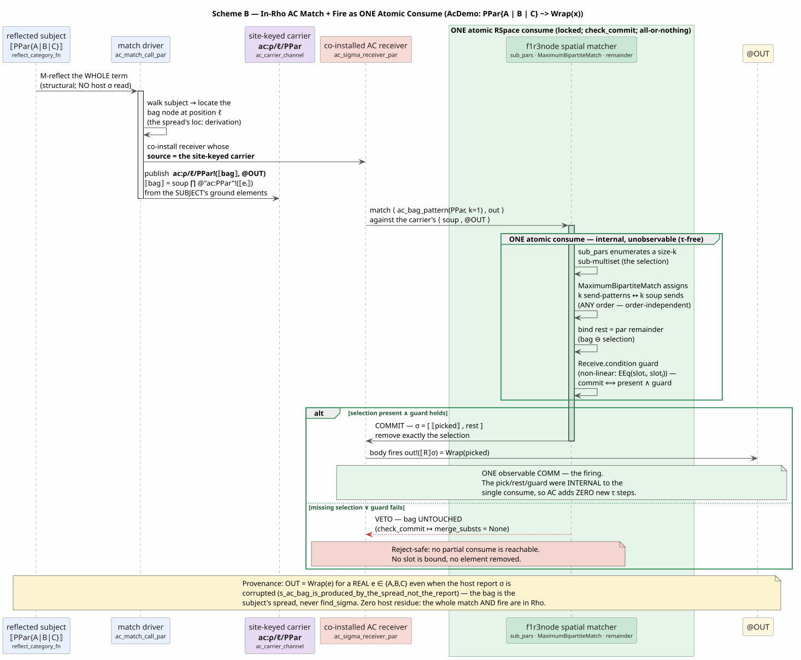
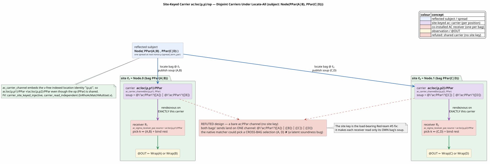
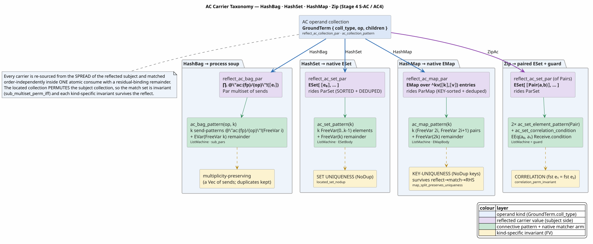
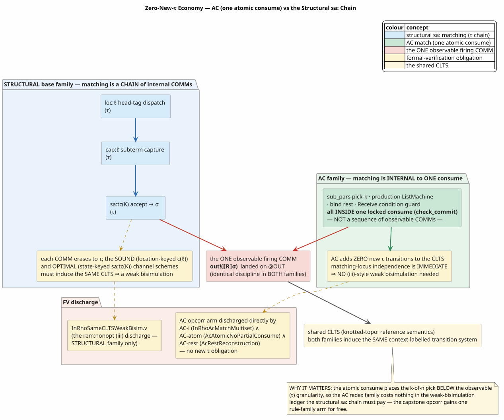

# 26 — In-Rho AC Matching: The Associative-Commutative Family

> **Status.** COMPLETE and formally verified for the **associative-commutative (AC)
> family** — the S-AC slices (HashBag linear, with-`rest`, and non-linear) plus **AC4**
> (the native `HashSet`, `HashMap`, and `Zip` carriers). The matching *and* the firing
> run ON the f1r3node Rholang interpreter: the operand collection is **re-sourced from
> the spread of the reflected subject** (never the host report substitution), and the
> whole match — pick the fixed elements, bind the residual, check the non-linear guard —
> resolves inside **one atomic `consume`**. This is the "Scheme B" design. The host
> runtime AC matcher is **retired** from the match path; the decisive evidence is a probe
> that *corrupts* the report substitution and still observes the correct firing
> ([section 5](#5-re-sourcing-from-the-spread-replacement-not-replay)).
>
> **How this document relates to the campaign log.** The numbered file
> [`18-in-rho-ac-matching.md`](18-in-rho-ac-matching.md) is the *incremental campaign
> log* — it records Stage AC one section at a time, and its worked mechanism predates the
> S-AC re-sourcing (its `ac_contract_call` reconstructs the bag from the report). **This**
> document is the consolidated, reconstruction-grade **architecture reference** for the
> finished AC family: it re-derives the mechanism from first principles so a reader can
> rebuild it from scratch, folding in the S-AC spread re-sourcing, the site-keyed carrier,
> and AC4. Where the two overlap, this document is authoritative for the *completed*
> mechanism. It is the AC sibling of the base-family reference
> [`25-in-rho-base-family-reference.md`](25-in-rho-base-family-reference.md), whose notation,
> reflection, spread, and locate-all machinery it inherits.

---

## Table of contents

1. [What problem this solves](#1-what-problem-this-solves)
2. [Notation and glossary](#2-notation-and-glossary)
3. [Theoretical basis](#3-theoretical-basis)
4. [Scheme B: matching as one atomic consume](#4-scheme-b-matching-as-one-atomic-consume)
5. [Re-sourcing from the spread: replacement, not replay](#5-re-sourcing-from-the-spread-replacement-not-replay)
6. [The site-keyed carrier](#6-the-site-keyed-carrier)
7. [The carrier taxonomy: HashBag, Set, Map, Zip](#7-the-carrier-taxonomy-hashbag-set-map-zip)
8. [Non-linear AC and the consistency guard](#8-non-linear-ac-and-the-consistency-guard)
9. [rest reconstruction and the RHS bag flatten](#9-rest-reconstruction-and-the-rhs-bag-flatten)
10. [The zero-new-tau economy](#10-the-zero-new-tau-economy)
11. [Worked examples](#11-worked-examples)
12. [The formal-verification backing](#12-the-formal-verification-backing)
13. [The Ambient fragment: Cardelli–Gordon alignment](#13-the-ambient-fragment-cardelligordon-alignment)
14. [Scope and status](#14-scope-and-status)
15. [References](#15-references)

---

## 1. What problem this solves

A MeTTaIL `language! { … }` definition may declare an operator whose single argument is a
**collection** — a bag, a set, or a map — that is matched **up to associativity and
commutativity (AC)**: order and grouping of the elements do not matter. RhoCalc's parallel
composition, Ambient congruence, and the `HashBag` / `HashSet` / `HashMap` collections are
all of this shape. A rule over such an operator,

```math
\mathrm{op}\{L_1,\dots,L_k,\ \dots\mathit{rest}\} \;\Rightarrow\; R,
```

fires when the subject collection contains, **in any order**, a sub-collection matching the
$`k`$ fixed element patterns $`L_1,\dots,L_k`$; the leftover elements bind the residual variable
`rest`. This is *not* the structural (positional) matching the two set-automaton papers
compile — those read element $`i`$ against pattern $`i`$. AC matching is combinatorial: it must
consider every way to pick $`k`$ of the $`n`$ present elements.

The [base-family reference](25-in-rho-base-family-reference.md) moved *structural* matching
onto the interpreter. This document does the same for the AC family, subject to two
correctness constraints that the base family does not face:

- **Shuffle invariance.** The match must be invariant under any reordering of the bag; it
  must never silently impose a positional order on the elements.
- **No partial fire.** The match must be **all-or-nothing**: it may never bind some of the
  $`k`$ elements, leave `rest` unbound, and commit a half-formed firing. Binding $`k`$ elements
  and the residual is a single indivisible decision.

The design goals, in order:

| Goal | Meaning | Realized by |
|---|---|---|
| **On-interpreter AC match** | recognizing an AC redex is interpreter work, not Rust | the native par-bag matcher over the reflected carrier ([section 4](#4-scheme-b-matching-as-one-atomic-consume)) |
| **Shuffle invariance** | the match ignores element order | a *connective* / multiset carrier, never a positional `EList` ([section 4](#4-scheme-b-matching-as-one-atomic-consume)) |
| **Atomic, no partial fire** | pick-$`k`$ + bind `rest` + guard is indivisible | one locked `consume` with `check_commit` ([section 4](#4-scheme-b-matching-as-one-atomic-consume)) |
| **Replacement** | the bag comes from the subject, not the report | the corrupted-report probe ([section 5](#5-re-sourcing-from-the-spread-replacement-not-replay)) |
| **Disjoint sites** | two same-op bags never intermingle | the site-keyed carrier `ac:ρ/ℓ/op` ([section 6](#6-the-site-keyed-carrier)) |
| **Native carriers** | set/map are genuine sets/maps, not soups | `ESet` / `EMap` and their sorted-dedup invariants ([section 7](#7-the-carrier-taxonomy-hashbag-set-map-zip)) |
| **Zero-cost in the CLTS ledger** | AC adds no new internal transitions | the atomic consume is below observable granularity ([section 10](#10-the-zero-new-tau-economy)) |

Throughout, the running example is **AcDemo** (`languages/src/acdemo.rs`), the minimal
one-rule AC language whose only rewrite is the linear with-`rest` HashBag rule

```math
\mathrm{PPar}\{x,\ \dots\mathit{rest}\} \;\Rightarrow\; \mathrm{Wrap}(x)
```

over nullary constructors $`A`$, $`B`$, $`C`$. Because $`\mathrm{Wrap}(e)`$ is syntactically
distinct from the bag $`\mathrm{PPar}\{A,B,C\}`$, a positive observation of $`\mathrm{Wrap}(e)`$
for some $`e`$ in the bag is *non-vacuous* evidence that the AC match happened in Rho.

---

## 2. Notation and glossary

Mathematical prose uses MathJax; monospace names are Rust items or Rholang channels. Every
symbol is defined here before first use. Notation inherited unchanged from the
[base-family reference](25-in-rho-base-family-reference.md) — reflection $`[\![ t ]\!]`$, head tag $`\underline{f}`$, location $`\ell`$, root nonce $`\rho`$, the site path
$`\ulcorner(\rho,\ell)\urcorner`$, freshness-by-quoting (the `nu`-free INV-7 scheme), the
CLTS, and $`\tau`$ — is summarized only briefly.

- **AC (associative-commutative)**: a matching discipline in which the operator's argument is
  a **multiset** (bag), **set**, or **map**, matched up to reordering (commutativity) and
  regrouping of same-operator sub-collections (associativity). Contrast *structural*
  (positional) matching.
- **Multiset / bag**: a collection with repeated elements allowed and order irrelevant, e.g.
  $`\{A, A, B\}`$. A **set** forbids repeats; a **map** is a set of key-unique
  $`\mathit{key}\Rightarrow\mathit{value}`$ entries.
- **Operand `op`**: the collection operator, e.g. $`\mathrm{PPar}`$. The AC rule's left-hand
  side is `op` applied to one collection pattern.
- **Substitution $`\sigma`$**: a finite map from a rule's left-hand-side variables to ground
  subterms, e.g. $`\sigma = \{x \mapsto A,\ \mathit{rest} \mapsto \mathrm{PPar}\{B,C\}\}`$. We
  write $`[\![ R ]\!]\sigma`$ for the reflected right-hand side under $`\sigma`$.
- **`rest`**: the residual-binding variable of a with-`rest` AC pattern
  $`\mathrm{op}\{L_1,\dots,L_k,\ \dots\mathit{rest}\}`$. After the $`k`$ fixed elements are
  matched, `rest` binds the remaining sub-collection (the **complement**).
- **Selection**: the size-$`k`$ sub-multiset the matcher picks for the fixed elements
  $`L_1,\dots,L_k`$. **Complement** $`\mathit{bag} \ominus \mathit{selection}`$: the bag with one
  occurrence of each selected element removed — the value bound to `rest`. The **partition**
  law is $`\mathit{selection} \uplus \mathit{rest} \equiv \mathit{bag}`$ (as multisets), where
  $`\uplus`$ is multiset sum and $`\equiv`$ is multiset equality (a `Permutation`).
- **Carrier**: the reflected value the matcher reads the subject collection off. A `HashBag`
  reflects to a **process soup** (below); a `HashSet` to an `ESet`; a `HashMap` to an `EMap`.
- **Soup**: the process-`Par` reflection of a bag — a parallel composition
  $`\big\Vert_{i} \mathtt{@"ac:}\mathrm{op}\mathtt{"}!([\![ e_i ]\!])`$ of one
  ground send per element on the operand's shared element channel `ac:op`. Order-independence
  is inherited from parallel composition (a `Par` is a multiset of processes).
- **`ac:op` (element channel)**: the quoted name each bag element is sent on inside the soup.
  Scoped **inside** the carried message, so it never appears free in the tuplespace and needs
  no language fingerprint.
- **`ESet` / `EMap`**: the f1r3node process types for a native Rholang set and map. **`ParSet`
  / `ParMap`**: their normalized backing stores. `ParSet::new` **sorts and deduplicates** its
  elements (so an `ESet` is a genuine set); `ParMap::new` sorts by key and deduplicates on key
  (so an `EMap`'s keys are unique — the **key-uniqueness** invariant).
- **`^kv`**: the reserved synthetic constructor label a `HashMap` entry
  $`\mathit{key} \Rightarrow \mathit{value}`$ reflects to as a `GroundTerm` node — the label applied
  to the reflected key and value, written `^kv(⟦key⟧, ⟦value⟧)`. It cannot collide with any user
  constructor (a Rust identifier never contains `^`). Defined as `AC_MAP_ENTRY_LABEL`.
- **Connective pattern**: a Rholang pattern that matches **order-independently** with a
  remainder — the `sub_pars` path over a process-`Par`, or the `list_match_single_` path over
  an `ESet` / `EMap`. Contrast a positional `EList` pattern (`fold_match`), which matches
  element $`i`$ against pattern $`i`$ and would silently impose an order.
- **`sub_pars` / `MaximumBipartiteMatch` / `remainder`**: f1r3node's spatial matcher
  (`f1r3node/rholang/src/rust/interpreter/matcher/`). `sub_pars` enumerates selections
  (subset / complement); `MaximumBipartiteMatch` (`maximum_bipartite_match.rs`) assigns the
  $`k`$ element patterns to $`k`$ carrier elements in any order; the `remainder` binds the
  leftover — the residual `rest`. All inside one `consume`.
- **`Receive.condition`**: an optional guard on a Rholang `for`-receive that the reducer
  evaluates **before committing** the `consume`. AC uses it for the non-linear consistency
  guard ($`\mathtt{EEq}`$ over repeated occurrences) and the `Zip` correlation.
- **Site-keyed carrier `ac:ρ/ℓ/op`**: the per-position channel a located bag's soup is
  published on, keyed by the ground site path $`\ulcorner(\rho,\ell)\urcorner`$ **and** the
  operand `op`. Built by `ac_carrier_channel`. Distinct positions get disjoint carriers
  ([section 6](#6-the-site-keyed-carrier)).
- **$`\tau`$ (internal step)** and **CLTS (context-labelled transition system)**: as in the base
  reference — $`\tau`$ is an unobservable transition, and the CLTS is the `knotted-topoi`
  reference semantics whose transitions are labelled by the context in which a redex fires.
  Correctness means the in-Rho realization induces the *same* CLTS.

The semantic law the AC design serves is the same CLTS **firing law** as the base family — a
rewrite $`L \Rightarrow R`$ fires as one atomic COMM emitting $`[\![ R ]\!]\sigma`$ —
with the *matching* now an order-independent, all-or-nothing selection over the reflected
carrier. Everything below is the machinery that lets the interpreter *pick* the selection,
*bind* `rest`, and *check* the guard so this law fires, in Rho, at every AC redex.

---

## 3. Theoretical basis

Four sources fix the design.

**The set-automaton papers cover STRUCTURAL matching only.** Erkens and Groote (ICTAC 2021)
and Bouwman and Erkens (2022) compile a set of *first-order, positional* patterns into a
symbol-once automaton. An AC operand is not first-order in this sense: matching
$`\mathrm{op}\{x,\dots\mathit{rest}\}`$ against an $`n`$-element bag ranges over the $`n`$ ways to
choose the fixed element and the induced complement — a combinatorial selection the positional
automaton does not express. The base family therefore **rejects** a collection node from the
automaton (`reflect_category_fn`'s collection arm returns a typed rejection), and the AC family
supplies a *different* realization for exactly these nodes. The base machinery it keeps is
family-agnostic: whole-term reflection, the spread, and the locate-all site walk.

**Native par-bag AC is the right realization (Meredith's extension).** The rho-calculus already
*is* an AC system: parallel composition `P | Q` is associative and commutative, and a `Par` is
a **multiset** of processes. f1r3node's spatial matcher matches a *connective* process pattern
against a process soup by enumerating sub-multisets (`sub_pars`), assigning pattern slots to
elements with a maximum bipartite matching (`MaximumBipartiteMatch`), and binding the leftover
to a par-level `remainder` — this *is* order-independent multiset matching, already implemented
and already atomic. Reflecting the operand bag as a soup and matching it with one connective
receive therefore inherits AC matching from the host calculus rather than re-deriving a
bespoke combinatorial matcher in generated Rholang. This is the load-bearing design choice: the
**subject side** is a process soup (or a native `ESet` / `EMap`), never a positional `EList`,
because only the connective path matches order-independently and binds a remainder.

**The atomicity argument (`knotted-topoi`; RSpace).** The firing law demands one atomic COMM.
For AC this is *stronger* than for the base family: the base match binds each variable from a
distinct single-shot channel, but the AC match must bind $`k`$ elements *and* the residual *and*
check the guard as one indivisible act. RSpace's `consume` is exactly such an act: the reducer
takes a lock, runs the spatial matcher, evaluates the `Receive.condition`, and either
**commits** — removing the whole selection and binding the remainder — or **vetoes**, leaving
the tuplespace untouched (`check_commit`, the reject-safe `merge_substs = None`). Because the
pick-$`k`$, the remainder bind, and the guard are all internal to this one locked transaction, no
reachable state has consumed a proper subset of the selection. There is no reserve/commit
protocol to design and no partial-fire window to close: the host `consume` supplies the
atomicity the law needs.

**Knotted-topoi is the reference semantics.** As for the base family it fixes the firing law,
location channels, freshness-by-quoting, and equations as structural congruence. The AC family
adds one theoretical observation the base family does not enjoy: because the entire match is a
*single* consume rather than a chain of internal COMMs, it contributes **no new $`\tau`$
transitions** to the CLTS, so the sound-vs-optimal weak-bisimulation the base family must
discharge does not arise for AC ([section 10](#10-the-zero-new-tau-economy)).

---

## 4. Scheme B: matching as one atomic consume

**Intuition.** Reflect the whole operand bag as one order-independent carrier value, and match
it with one connective receive whose pattern has $`k`$ element slots and a residual remainder.
The reducer's `consume` does the combinatorial pick, the remainder bind, and the guard check as
one indivisible transaction. This is **Scheme B**: the AC decision resolves *inside* a single
`consume` rather than through any generated multi-step protocol.

**The subject side — the carrier.** For a `HashBag`, `reflect_ac_bag_par`
(`rholang-codegen/src/rho_net_lower.rs`) reflects the operand bag to the soup

```math
[\![ \mathrm{op}\{e_1,\dots,e_m\} ]\!] \;=\; \big\Vert_{i=1}^{m}\ \mathtt{@"ac:}\mathrm{op}\mathtt{"}!\bigl([\![ e_i ]\!]\bigr),
```

one ground send per element on the shared element channel `ac:op`. Order-independence is
inherited from parallel composition; multiplicity is preserved because the soup is a `Vec` of
sends (duplicates disambiguated by the reducer's `Indexed` bookkeeping). The native `ESet` /
`EMap` carriers ([section 7](#7-the-carrier-taxonomy-hashbag-set-map-zip)) are the analogous
subject values for sets and maps.

**The pattern side — the connective pattern.** `ac_bag_pattern(op, k)` builds a connective
process-`Par` with $`k`$ send-patterns and a process remainder:

| Piece | Rho shape | Binds |
|---|---|---|
| element slot $`i`$ ($`i < k`$) | `@"ac:op"!(FreeVar(i))` send-pattern | one bag element, $`\sigma_i`$ |
| `rest` | top-level `EVar(FreeVar(k))` process remainder | the residual soup (the complement) |

The native `MaximumBipartiteMatch` assigns the $`k`$ send-patterns to $`k`$ carrier sends in **any**
order and binds the residual to the remainder — the order-independent multiset match, all inside
one `consume`.

**The critical correction — soup, not `EList`.** The operand bag is a process-`Par` soup, *not*
an `EList`. An `EList`'s `fold_match` is **positional** (`Vec` semantics — element $`i`$ matches
pattern $`i`$); only the connective / `sub_pars` path over a process-`Par` (or an `ESet` / `EMap`)
matches order-independently and binds a par-level remainder. Matching a bag against a positional
`EList` pattern would silently impose an order — the shuffle-invariance goal would be violated.

**All-or-nothing.** The reducer runs the whole match inside one locked `consume`: `sub_pars`
proposes a size-$`k`$ selection, `MaximumBipartiteMatch` assigns the slots, the remainder binds the
complement, and the `Receive.condition` guard (if any) is evaluated. Then `check_commit` either
**commits** the whole thing — removing exactly the selection, binding `rest` to the complement,
and running the body — or **vetoes**, leaving the bag untouched. No reachable state has consumed
a proper subset of the $`k`$ elements. Figure A traces one firing end to end, including the
commit and veto branches.



**Figure A — Scheme B.** The whole match (pick-$`k`$, bind `rest`, check the guard) resolves inside
one atomic `consume`; on commit the receiver body fires $`[\![ R ]\!]\sigma`$ on
`@OUT`; on veto the bag is untouched. The pick is internal, so the match contributes no
observable steps.

**The receiver and firing.** `ac_sigma_receiver_par_with_condition(kind, op, k, rhs, source,
condition)` wraps the connective pattern in the persistent receiver

```text
for( <ac_collection_pattern(kind, op, k)> , out <- source )  where ( condition )  { out!(rhs) }
```

Let $`s = `$ `ac_element_slot_count(kind, k)` be the number of element slots the pattern binds — a
`HashMap` binds $`2k`$ (one key plus one value per entry), every other kind binds $`k`$. The bind has
$`s + 2`$ free variables (the $`s`$ element slots, then `rest`, then `out`), so under the reverse
De Bruijn frame `out = BoundVar(0)`, `rest = BoundVar(1)`, and element slot $`j`$ is
`BoundVar(s + 1 − j)`. The RHS $`[\![ R ]\!]\sigma`$ is pre-reflected in exactly this
frame (the `reflect_term_par` shift over the `[x_0..x_{s-1}, rest]` substitution order), so **no
new reflection machinery** is needed relative to the base family.

Literate form of the receiver build:

```text
⟨ac_sigma_receiver_par_with_condition(kind, op, k, rhs, source, condition)⟩ ≡
  s         ← ac_element_slot_count(kind, k)          ▷ HashMap: 2k ; else k
  free_count ← s + 2                                   ▷ s element slots + rest + out
  out       ← BoundVar(0)                              ▷ = bound_formal(free_count, s+1)
  body      ← out!(rhs)                                ▷ rhs references slots as BoundVar(s+1-j)
  pattern   ← ac_collection_pattern(kind, op, k)       ▷ soup | ESet | EMap connective
  return persistent for( ⟨pattern⟩ , FreeVar(s+1) <- source ) where (condition) { body }
```

---

## 5. Re-sourcing from the spread: replacement, not replay

**Intuition.** The strongest claim of this design — as for the base family — is that in-Rho AC
matching **replaces** the host matcher rather than duplicating it. The operand bag that fires the
rewrite is built from the **reflected subject term**, never from the host report's substitution.
The mechanism is the S-AC match driver, and the evidence is a corrupted-report probe.

**Mechanism.** The generated match entry point
`<Lang>::rho_net_match_invocation_from_dovetail_to(term, report, out)` structurally reflects the
**whole** subject `term` to a `GroundTerm` (M-reflect, exactly as the base family), consulting the
report only to *gate* — decide which rules fired, fail closed if a fired rule is not matchable in
Rho. The AC redexes are then located by a dedicated walk, `ac_match_call_par`
(`rholang-codegen/src/rho_net_lower.rs`), composed with the base locate-all call in
`in_rho_match_all_sites_call_par` (`rholang-codegen/src/rho_net_ruleset.rs`). An admitted AC family
has **no** automaton entry — its collection node has no positional image — so it is located by
this separate walk of the subject rather than by `collect_redex_sites`. At every bag node whose
operator is admitted, the walk:

1. derives the **site-keyed** carrier `ac:ρ/ℓ/op` (`ac_carrier_channel`,
   [section 6](#6-the-site-keyed-carrier)), disjoint per position;
2. co-installs an `ac_sigma_receiver_par` over that carrier — byte-identical to the installed AC
   receiver **except** its `source` is the per-site carrier — which picks $`k`$-of-$`n`$, binds `rest`,
   and checks the guard inside one `consume`, then fires $`[\![ R ]\!]\sigma`$ on `@out`;
3. publishes `carrier!(⟦bag⟧, @out)`, where `⟦bag⟧` is `reflect_ac_bag_par` over **this node's
   ground elements** — the subject bag, with **no** `find_sigma` and **no** report read.

A `HashBag` has no positional child descent, so the walk does not recurse into a bag's elements
(a nested bag is still located as the walk descends the structural children of non-bag nodes).

Literate form of the locate-and-co-install walk:

```text
⟨ac_match_install_at(node, loc, by_op, out, fp)⟩ ≡
  if node.coll_type = HashBag ∧ by_op contains node.op:
      entry    ← by_op[node.op]
      carrier  ← ac_carrier_channel(loc, node.op)          ▷ ac:⟨loc⟩/op — disjoint per position
      receiver ← ac_sigma_receiver_par_with_condition(       ▷ same shape as the installed receiver;
                    entry.kind, entry.op, entry.arity,        ▷   only the source differs
                    entry.rhs_par, quote(carrier), entry.condition)
      soup     ← reflect_ac_bag_par(node, fp)                ▷ from THIS subject bag's ground elements
      delivery ← carrier!(soup, @out)
      return receiver ∥ delivery
  else:                                                      ▷ a structural node — descend
      return ∥ over children i of  ac_match_install_at(child_i, spread_child_location(loc, node.op, i), …)
```

**The corrupted-report probe.** The probe `s_ac_bag_is_produced_by_the_spread_not_the_report`
(`rholang-runtime/tests/rho_net_ac_firing.rs`) builds a *real, complete* report for
$`\mathrm{PPar}\{A,B,C\}`$, then **corrupts** its substitution to nonsense — $`\{x \mapsto Z\_\mathrm{NONSENSE},\ \mathit{rest} \mapsto \mathrm{PPar}\{Z\_\mathrm{NONSENSE}, Z\_\mathrm{NONSENSE}\}\}`$ — leaving the rule label (`AcStep`, the location-independent identity)
valid so the gate still admits the path. A report-substitution AC arm would reconstruct the operand
bag from these bindings and wrap $`Z\_\mathrm{NONSENSE}`$. The observed `@OUT` is instead
$`\mathrm{Wrap}(e)`$ for a **real** $`e \in \{A,B,C\}`$ — asserted to be in the true universe and
distinct from the nonsense value. Therefore the bag came from the spread of the subject, not the
report; AC matching is a genuine in-Rho replacement, and the AC firing carries **no** host-supplied
residue — the whole match *and* fire are in Rho. This is the AC analogue of the base family's
`m_reflect_sigma_is_produced_by_the_automaton_not_the_report`, and it is verified as
`located_match_is_independent_of_report` (`InRhoAcMatchMultiset.v`,
[section 12](#12-the-formal-verification-backing)).

---

## 6. The site-keyed carrier

**Intuition.** Under locate-all, a subject may hold **two same-operator bags** at different
positions — e.g. $`\mathrm{Node}(\mathrm{PPar}\{A,B\}, \mathrm{PPar}\{C,D\})`$. If both bags' soups
were published on one shared `ac:op` channel, the native matcher could pick a **cross-bag**
selection $`\{A, D\}`$ — a latent soundness bug. The fix (the load-bearing Red-team #5 correction) is
to key each carrier by the bag's **position**.

**Mechanism.** `ac_carrier_channel(loc_channel, op)` returns `format!("ac:{loc_channel}/{op}")`,
embedding the `nu`-free location path $`\ulcorner(\rho,\ell)\urcorner`$ that the spread and the
automaton already agree on (via `spread_root_location` / `spread_child_location`). So two same-op
bags at distinct positions get **disjoint** carriers — `ac:ρ/ℓ₁/op` and `ac:ρ/ℓ₂/op` differ even
though `op` is shared. Both the carrier delivery and the co-installed receiver derive the channel
through this one helper, so they rendezvous on **exactly one** bag's soup. Figure B shows the
disjointness and the refuted shared-channel design.

> **★ INV-S6 (2026-07-25).** This site-keyed carrier takes **no** fingerprint argument, and
> deliberately so: `loc_channel` is already fingerprint-scoped at its root
> ([25 §2.1](25-in-rho-base-family-reference.md#21-inv-s6-the-channel-name-fingerprint-invariant)),
> so the carrier reads `ac:loc:{fingerprint}/{site}/…/{op}` and inherits cross-language
> disjointness from the same key that gives it cross-*position* disjointness. Red-team #5
> keyed by position; INV-S6 keys by language; one composition delivers both. The **bare**
> (non-site-keyed) soup carrier has no such parent and scopes itself — `ac_soup_channel`
> yields `ac:{fingerprint}/{op}`; see
> [18](18-in-rho-ac-matching.md) §2 for why the earlier "it needs no fingerprint"
> rationale did not hold.



**Figure B — the site-keyed carrier.** One spread of $`\mathrm{Node}(\mathrm{PPar}\{A,B\}, \mathrm{PPar}\{C,D\})`$ publishes the two bags on disjoint carriers `ac:ρ/Node.0/PPar` and
`ac:ρ/Node.1/PPar`; each receiver reads only its own bag. Without the site key both soups would
share `ac:PPar` and the matcher could pick the cross-bag $`\{A, D\}`$ (refuted, bottom).

**Why AC leaves are always co-installable.** An AC receiver reads only its own disjoint site-keyed
`ac:` carrier, which is disjoint from every other AC carrier (distinct positions) **and** from the
base family's `loc:` / `cap:` channels (distinct channel families). So co-installing one AC receiver
per bag over one spread never contends for a channel — with each other or with the base networks —
and AC leaves never trigger the base family's nested-multi-site contention gate (Red-team #4/#5).
This disjointness is verified as `carrier_site_keyed_injective` (distinct positions give distinct
carriers) and `carrier_read_independent` (a receiver's read is unchanged by any other bag's soup)
in `InRhoAcMatchMultiset.v`.

---

## 7. The carrier taxonomy: HashBag, Set, Map, Zip

**Intuition.** AC4 extends Scheme B from the `HashBag` process-soup carrier to the **native**
Rholang collection carriers — `ESet` for a set, `EMap` for a map — and to a structured **paired
set** for a `Zip` correlation. Each kind is re-sourced from the spread exactly as the soup is; the
new content per kind is (a) a native carrier value, (b) a kind-specific connective pattern, and
(c) a kind-specific invariant that survives the reflect. Figure C is the taxonomy.



**Figure C — the carrier taxonomy.** Each operand kind reflects to its native order-independent
carrier, is matched by a kind-specific connective pattern, and preserves a kind-specific invariant
across the reflect.

`reflect_ac_collection_par` routes a `GroundTerm` by its `coll_type`, and `ac_collection_pattern`
routes the matching pattern symmetrically. The four kinds:

| Kind | Carrier (subject side) | Backing / invariant | Connective pattern | Matcher arm |
|---|---|---|---|---|
| **HashBag** | soup $`\Vert_i`$ `@"ac:op"!(⟦eᵢ⟧)` | `Vec` of sends — multiplicity preserved | `ac_bag_pattern`: $`k`$ sends + `EVar` remainder | `sub_pars` · `MaximumBipartiteMatch` |
| **HashSet** | `ESet[⟦e₀⟧, …]` | `ParSet` — sorted + **deduped** (uniqueness) | `ac_set_pattern`: $`k`$ `FreeVar` + remainder | `list_match_single_` · `ESetBody` |
| **HashMap** | `EMap` over `^kv(⟦k⟧,⟦v⟧)` | `ParMap` — key-sorted + **key-deduped** | `ac_map_pattern`: $`k`$ `(FreeVar,FreeVar)` + remainder | `list_match_single_` · `EMapBody` |
| **Zip** | `ESet` of `Pair` elements | `ParSet` | `ac_set_element_pattern` ×2 + `EEq` guard | `list_match_single_` + `Receive.condition` |

**HashSet ($`\to`$ `ESet`).** `reflect_ac_set_par` reflects each element and builds a ground
`ESet`; because it rides `ParSet` (sorted, deduplicated) the carrier is a genuine
order-independent, uniqueness-preserving set. `ac_set_pattern(k)` is a connective `ESet` whose $`k`$
elements are `FreeVar(0..k−1)` plus a `FreeVar(k)` remainder; the native `list_match_single_`
(`ESetBody` arm) assigns the $`k`$ free-var patterns to $`k`$ set elements in any order and binds the
residual **set** to the remainder.

**HashMap ($`\to`$ `EMap`).** `reflect_ac_map_par` reads each `^kv(key, value)` entry back into a
`KeyValuePair` and builds a ground `EMap`; because it rides `ParMap` (key-sorted, key-deduped)
**key-uniqueness is enforced natively** — the sorted-dedup `ParMap` invariant survives the reflect.
`ac_map_pattern(k)` is a connective `EMap` whose $`k`$ entries are free-var pairs
$`(\mathtt{FreeVar}(2i), \mathtt{FreeVar}(2i{+}1))`$ (key slot $`2i`$, value slot $`2i{+}1`$) plus a
`FreeVar(2k)` remainder; the native `list_match_single_` (`EMapBody` arm) assigns the $`k`$ entry
patterns to $`k`$ map entries (matched key-first over the key-sorted list) and binds the residual
**map** to the remainder. Key-uniqueness holds because the target rides `ParMap` and each residual
is re-wrapped as an `EMap`.

**Zip (paired / correlated `ESet`).** `ac_set_paired_receiver_par` is the native-set analogue of
the process-soup correlated match: an `ESet` connective pattern whose elements are **structured**
element patterns (`ac_set_element_pattern(op, arity, base, fingerprint)`, a tagged `EList`
$`[\underline{op}, \mathtt{FreeVar}(\mathit{base}), \dots]`$ matching one `op`-headed set element and
binding its args), under a `Receive.condition` correlation guard. Two such patterns sharing a slot
via `ac_set_correlation_condition` (an $`\mathtt{EEq}`$ over the shared occurrence slots) express a
correlated pairing — e.g. $`\mathrm{Pair}(a, x)`$ and $`\mathrm{Pair}(a, y)`$ sharing the first
component $`a`$. Only correlated picks commit the `consume`.

---

## 8. Non-linear AC and the consistency guard

**Intuition.** A **non-linear** AC pattern repeats an element variable, e.g.
$`\mathrm{op}\{x, x, \dots\mathit{rest}\}`$: the two occurrences must bind the **same** value. The
native bipartite assignment binds the $`k`$ slots to $`k`$ bag elements without regard to equality, so a
guard must reject any selection whose repeated-variable slots disagree. This is the AC analogue of
the base family's `eq:`-guarded consistency join.

**Mechanism.** `ac_nonlinear_condition(element_vars, free_count)` groups the $`k`$ element positions by
variable name; each group of $`\geq 2`$ positions is a repeated variable whose occurrences must be
name-equal, contributing a `nonlinear_consistency_condition` — a conjunction of
$`\mathtt{EEq}(\mathtt{slot}_{\mathrm{first}}, \mathtt{slot}_{\mathrm{other}})`$ over the receiver's
formals — and multiple groups are conjoined with `EAnd`. A **linear** pattern (every element
variable distinct) passes `None`, byte-identical to the plain receiver. The guard is the
`Receive.condition` of `ac_sigma_receiver_par_with_condition`, so the reducer evaluates it **before**
committing: the $`k`$ elements the connective pattern binds are picked **only** when the repeated
occurrences are name-equal, and on inequality `check_commit` vetoes the **entire** consume (no
element removed — the reject-safe `merge_substs = None`).

Because the guard reads the selection's **output** (the bound slot values), not the bag, it is
invariant under the bag's shuffle order — the concrete $`x = x'`$ check the rho-into-rho pattern needs.
The `NlAcDemo` language (`languages/src/nlacdemo.rs`) is the generated witness: its non-linear AC
rule fires in Rho from the spread, and its corrupted-report probe is
`s_ac_nonlinear_guard_fires_in_rho_from_the_spread_not_the_report`
(`rholang-runtime/tests/rho_net_nl_ac_firing.rs`). The guard's soundness is
`AcNonLinearConsistency.v`: it is exactly the Stage-2 `eq:` consistency guard composed with the AC
selection's slot-gather, so it inherits commit-iff-name-equality and reject-safety rather than being
a new obligation.

---

## 9. rest reconstruction and the RHS bag flatten

**Intuition.** Two multiset facts make the `rest` binding and a bag-valued RHS faithful: the
**partition** law (the selection and the reconstructed `rest` together permute the whole bag) and the
**flatten** law (a bag-valued RHS with a same-operator fixed element *splices*, it does not nest).

**Partition.** When the pattern matches, the reducer binds `rest` to the complement
$`\mathit{bag} \ominus \mathit{selection}`$, and

```math
\mathit{selection} \uplus \mathit{rest} \;\equiv\; \mathit{bag} \qquad \text{(as multisets)},
```

so nothing is gained or lost. This is `selection_rest_partition` (`AcRestReconstruction.v`), and it
makes the `remainder` binding faithful for every kind: the residual bound to `rest` is exactly the
subject collection minus the matched selection.

**Flatten / splice.** When the RHS is itself a same-operator bag — e.g. the `AcBagDemo` rule
$`\mathrm{PPar}\{x, \dots\mathit{rest}\} \Rightarrow \mathrm{PPar}\{\mathrm{Mark}(x), \dots\mathit{rest}\}`$ — the reflected RHS $`[\![ \mathrm{PPar}\{\mathrm{Mark}(x), \dots\mathit{rest}\} ]\!]\sigma`$ is the flat soup
$`\mathtt{@"ac:PPar"}!([\![ \mathrm{Mark}(\mathit{picked}) ]\!]) \mid \mathit{rest}`$: the
`rest` slot **splices** the residual sends (a parallel composition of `@"ac:PPar"!(…)` sends) rather
than nesting them under a sub-bag. This reproduces the host `add_flattened_bag` (`dovetail/src/rules.rs`)
byte-for-byte — a `fixed` member that is itself a same-op sub-bag splices its elements inline
(associativity), and flattening distributes over append (order- and multiplicity-preserving). The
byte-identity is `flatten_splices_subbag` and `flatten_app` (`AcRestReconstruction.v`), and the
end-to-end firing is `acbagdemo_bag_rhs_ac_rewrite_fires_as_a_comm_on_the_reducer`
(`rholang-runtime/tests/rho_net_ac_bag_firing.rs`), which lands the transformed bag
$`\mathrm{PPar}\{\mathrm{Mark}(e), \langle\text{the rest}\rangle\}`$ on `@OUT` and reads it back with
`decode_ac_bag_soup`.

The complementary boundary — a collection-*valued* RHS whose remainder must be preserved rather than
spliced — is discussed in [section 14](#14-scope-and-status).

---

## 10. The zero-new-tau economy

**Intuition.** The base family recognizes a redex through a **chain** of internal COMMs — a `loc:`
head-tag dispatch, then `cap:` captures, then the `sa:` accept — each of which erases to $`\tau`$. That
chain is why the base family must prove a **weak bisimulation**: the sound (location-keyed) and
optimal (state-keyed) channel schemes induce internal steps at *different* channels, and one must show
they induce the *same* CLTS after erasing $`\tau`$ (the `rem:nonopt` discharge,
`InRhoSameCLTSWeakBisim.v`). The AC family incurs **none** of this. Figure D is the comparison.



**Figure D — the zero-new-$`\tau`$ economy.** The structural family's match is a $`\tau`$-chain that
forces an (iii)-style weak bisimulation; the AC family's match is one atomic consume, below observable
granularity, so it adds no new $`\tau`$ transitions and needs no such bisimulation.

**Why AC contributes zero new $`\tau`$ steps.** In Scheme B the pick-$`k`$, the remainder bind, and the
guard check happen **inside one `consume`** — they are not a sequence of observable COMMs on the CLTS,
they are the internal steps of a *single* transition. The only transition the AC redex adds to the
CLTS is the **one firing COMM** (`out!(⟦R⟧σ)`), which is the observable step the firing law already
prescribes for every family. So the AC family's matching is **matching-locus independent** by
construction: there is no second channel scheme to compare against, hence no weak bisimulation to
discharge. The capstone operational-correspondence (`opcorr`) proof gains one rule-family arm that is
discharged directly by the AC obligations — AC-i (the match set equals the multiset relation), AC-atom
(one atomic consume, no partial commit), and AC-rest (the residual partitions the bag) — with **no**
new $`\tau`$ obligation.

**Why this matters.** The weak-bisimulation obligation is the most technically delicate part of the
base-family verification: it is where "moving matching into Rho" could have changed the observable
semantics. The atomic consume sidesteps it entirely for the AC family by placing the combinatorial
pick *below* the $`\tau`$ granularity at which the CLTS observes. The AC redex family therefore costs
nothing in the weak-bisimulation ledger — a direct consequence of choosing native par-bag AC (one
consume) over any generated multi-step selection protocol (a chain of COMMs, each a new $`\tau`$).

---

## 11. Worked examples

Each example is an end-to-end firing on the live f1r3node reducer. The De Bruijn frames below follow
[section 4](#4-scheme-b-matching-as-one-atomic-consume): for element-slot count $`s`$ and
$`\mathit{free\_count} = s + 2`$, `out = BoundVar(0)`, `rest = BoundVar(1)`, and element slot at level
$`\lambda`$ is `BoundVar(free_count − 1 − λ)`.

**Example 1 — AcDemo, a HashBag rewrite.** Subject $`\mathrm{PPar}\{A, B, C\}`$, rule
$`\mathrm{PPar}\{x, \dots\mathit{rest}\} \Rightarrow \mathrm{Wrap}(x)`$, so $`k = 1`$, $`s = 1`$,
$`\mathit{free\_count} = 3`$, and the element slot $`x = \mathtt{FreeVar}(0)`$ is `BoundVar(2)`. The soup
$`\mathtt{@"ac:PPar"}!([\![ A ]\!]) \mid \mathtt{@"ac:PPar"}!([\![ B ]\!]) \mid \mathtt{@"ac:PPar"}!([\![ C ]\!])`$ is published on the site-keyed carrier; the receiver
picks one send, binds `rest` to the other two, and fires $`\mathrm{Wrap}(e)`$ on `@OUT` for some
$`e \in \{A,B,C\}`$. Verified by `acdemo_ac_rewrite_fires_as_a_comm_on_the_reducer` and — with a
corrupted report — `s_ac_bag_is_produced_by_the_spread_not_the_report`
(`rholang-runtime/tests/rho_net_ac_firing.rs`).

**Example 2 — a non-linear `{x, x, ...rest}`.** The `NlAcDemo` rule repeats the element variable.
The receiver carries the `Receive.condition` $`\mathtt{EEq}(\mathtt{slot}_0, \mathtt{slot}_1)`$ over the
two occurrence slots. Against a subject bag the matcher may propose any two-element selection, but the
`consume` **commits only** when the two picked elements are name-equal — otherwise it vetoes, leaving
the bag untouched. So the rule fires exactly on a bag holding a repeated element, order-independently,
and never on a mismatched pair. Verified by `nlacdemo_nonlinear_ac_rewrite_fires_as_a_comm_on_the_reducer`
and `s_ac_nonlinear_guard_fires_in_rho_from_the_spread_not_the_report`
(`rholang-runtime/tests/rho_net_nl_ac_firing.rs`).

**Example 3 — a Map key collision collapsing to one firing.** The carrier map has two entries with the
**same** key $`A`$: $`\{A \Rightarrow B,\ A \Rightarrow C\}`$. Because the `EMap` carrier rides `ParMap`
(key-sorted, key-deduped), `ParMap::new` collapses the duplicate key to **one** surviving entry on
reflect — key-uniqueness. So the $`k = 1`$ receiver picks that sole surviving entry (residual map empty)
and fires **once**, not twice — a per-multiplicity bag would fire twice. The fired value is the
survivor's ($`B`$ or $`C`$). Verified by `mapzipdemo_map_key_uniqueness_survives_the_reflect_match_split`
(`rholang-runtime/tests/rho_net_mapzip_firing.rs`), backed by `map_split_preserves_uniqueness`
(`AcMapKeyUniqueness.v`). For $`\mathrm{MapOp}\{k \Rightarrow v, \dots\mathit{rest}\} \Rightarrow v`$ the
frame is $`s = 2k = 2`$, $`\mathit{free\_count} = 4`$; the value slot $`\mathtt{FreeVar}(1)`$ is `BoundVar(2)`.

**Example 4 — a Zip correlation rejecting the uncorrelated pair.** The carrier
$`\mathrm{ZipOp}\{\mathrm{Pair}(A,B),\ \mathrm{Pair}(A,C),\ \mathrm{Pair}(D,E)\}`$ reflects to an `ESet`
of three `Pair` elements. The receiver matches **two** $`\mathrm{Pair}(a, \_)`$ elements
(`ac_set_element_pattern`) whose first components are correlated by
$`\mathtt{EEq}(a_0, a_1)`$ (`ac_set_correlation_condition` over slots $`[0, 2]`$, $`\mathit{free\_count} = 6`$), binding the residual set to the remainder — inside one `consume`. Only the two $`A`$-keyed pairs
share a first component, so the unique correlated match is $`a = A`$ and `@OUT` is $`A`$; the $`D`$-keyed
pair is **rejected by the guard on the reducer**. Verified by
`mapzipdemo_zip_rewrite_fires_as_a_comm_on_the_reducer`
(`rholang-runtime/tests/rho_net_mapzip_firing.rs`), backed by `correlation_perm_invariant`
(`AcMapKeyUniqueness.v`).

---

## 12. The formal-verification backing

All proofs below are **zero-admission** (they introduce no admitted goals, no axioms, and no
assumptions; each theory ends with `Print Assumptions`, and Rocq reports `Closed under the global
context`). This document *references* them; it does not re-prove them. Rocq 9.1.

### 12.1 `InRhoAcMatchMultiset.v` — the match set (AC-i, located-from-subject, disjointness, AC4)

`formal/rocq/advanced_automata/theories/InRhoAcMatchMultiset.v`. Grouped:

| Group | Results | What is established |
|---|---|---|
| **AC-i (match correspondence)** | `ac_match_iff_partition`, `ac_match_sound`, `ac_match_complete`, `ac_rest_unique_up_to_perm` | the native sub-multiset match holds **iff** the selection has an order-independent complement partitioning the bag — the in-Rho AC match set **equals** the AC matching relation over multisets; the `rest` is determined up to multiset equality |
| **Located = subject** | `sub_multiset_perm_iff`, `located_matches_subject`, `located_match_is_independent_of_report`, `located_ac_match_iff_partition_subject` | the match set is invariant under permutation of the bag, so re-sourcing the bag from the spread neither adds nor drops a match; the located match is **independent of any (corrupted) report** — the S-AC probe made precise |
| **Site-keyed disjointness** | `carrier_site_keyed_injective`, `carrier_read_independent` | distinct positions give distinct carriers; a receiver's read is unchanged by any other bag's soup (Red-team #5) |
| **AC4 located carriers** | `located_set_matches_subject`, `located_set_nodup`, `located_map_matches_subject`, `located_map_key_unique`, `located_zip_correlation_matches_subject` | the located set / map / zip equals the subject collection, and set uniqueness / map key-uniqueness / zip correlation each survive the reflect |

The load-bearing result is `located_ac_match_iff_partition_subject`: the located bag's matches are
**exactly** the subject operand bag's order-independent partitions — the genuine in-Rho AC replacement,
end to end.

### 12.2 The supporting theories

| Theory | Key results | Role |
|---|---|---|
| `AcRestReconstruction.v` | `selection_rest_partition`, `flatten_splices_subbag`, `flatten_app`, `instantiate_ac_shape` | **AC-rest**: the `rest` binding is the partition $`\mathit{bag} \ominus \mathit{selection}`$; the RHS flatten reproduces `add_flattened_bag` byte-for-byte ([section 9](#9-rest-reconstruction-and-the-rhs-bag-flatten)) |
| `AcAtomicNoPartialConsume.v` | `ac_consume_all_or_nothing`, `ac_veto_consumes_nothing`, `ac_missing_selection_consumes_nothing`, `ac_commit_removes_exactly_the_selection`, `ac_veto_preserves_all` | **AC-atom**: the consume is all-or-nothing — commit removes exactly the selection, veto/missing leaves the bag untouched, no partial removal is reachable (the removal-side dual of the base family's `AtomicFiringNoPartialMatch`) |
| `AcMapKeyUniqueness.v` | `remove_key_preserves_uniqueness`, `remove_key_drops_key`, `remove_key_keeps_other`, `key_unique_perm`, `reinsert_preserves_uniqueness`, `map_split_preserves_uniqueness`, `correlation_perm_invariant` | **AC-map / AC-zip**: key-uniqueness survives the whole reflect $`\to`$ match $`\to`$ RHS split, and the zip correlation is a property of the subject's pairs, not the spread ordering |
| `AcNonLinearConsistency.v` | `ac_nl_commits_iff_slots_agree`, `ac_nl_disagree_no_commit`, `ac_nl_two_slot_agree`, `ac_nl_oracle_agreement`, `ac_nl_spread_selection_two_slot`, `ac_nl_guard_selection_determined` | **AC-nl**: the non-linear guard is the Stage-2 `eq:` consistency guard composed with the AC selection's slot-gather — it inherits commit-iff-name-equality and reject-safety ([section 8](#8-non-linear-ac-and-the-consistency-guard)) |

**AC economy in the ledger.** Because the whole match is one atomic `consume`, the AC path adds **zero**
new $`\tau`$ steps to the CLTS ([section 10](#10-the-zero-new-tau-economy)); its matching-locus
independence is immediate, so — unlike the structural `sa:` chain — it needs **no** `(iii)`-style
weak-bisimulation. The capstone `opcorr` gains one rule-family arm discharged by AC-i, AC-atom, and
AC-rest.

---

## 13. The Ambient fragment: Cardelli–Gordon alignment

The structural-AC and nested-structural-AC families' flagship language is **Ambient** —
mettail's declaration of the ambient calculus (Cardelli & Gordon, *Mobile Ambients*
[MOBILE-AMBIENTS-1998](references.md#mobile-ambients-1998)). The Knotted-Topoi paper names
the ambient calculus only as an example GSLT and carries no equation table for it, so
`languages/src/ambient.rs` is mettail's own declaration and MUST align with Cardelli–Gordon
directly. The A-S5.4b campaign performed and mechanized that alignment; this section is the
authoritative record.

### 13.1 The equation set: three C-G axioms plus three documented extensions

The Cardelli–Gordon structural congruence for restriction is (in the paper's orientation):
(Struct Res Res) $`(n)(m)P \equiv (m)(n)P`$; (Struct Res Par)
$`(n)(P \mid Q) \equiv P \mid (n)Q`$ if $`n \notin fn(P)`$; (Struct Res Amb)
$`(n)(m[P]) \equiv m[(n)P]`$ if $`n \neq m`$; plus (Struct Par Comm/Assoc) and the Zero
rules, with $`\alpha`$-conversion as definitional identity. The declared equation set maps
onto it as:

| Equation (`ambient.rs`) | Premise (post-A-S5.4b) | C-G status |
|---|---|---|
| `NewComm` | none | **axiom** — (Struct Res Res) verbatim |
| `ScopeExtrusion` | `x # ...rest` | **axiom** — (Struct Res Par), freshness on the floated-past material, lifted pointwise over the AC bag |
| `AmbNew` | `x # N` | **axiom** — (Struct Res Amb) verbatim: the premise `x # N` coincides with $`x \neq N`$ because `Name` is variable-only in this grammar, so $`fn(N) = \{N\}`$ |
| `InNew` / `OutNew` / `OpenNew` | `x # N` | **documented sound extensions** — NOT C-G axioms; a $`\nu`$-float through a capability prefix is sound here because capability prefixes are inert until exercised, and the trio is NOT load-bearing for matching (every rewrite LHS binds its capability continuation as a pattern variable) — it matters only for restriction-normal-form canonicality |

The A-S5.4b premise correction (`x # P` to `x # N` on the four prefix-float equations) is
what makes `AmbNew` the C-G rule verbatim: the earlier `x # P` premise restricted each
float to VACUOUS binders — the opposite of what extrusion exists for (Res Par / Res Amb
move USED binders; that is their purpose), and not any rule of the theory.

### 13.2 The fragment boundaries (declared, with their discharges)

- **Replication-free.** The fragment has no $`!P`$, so the one classical $`\nu`$-float
  failure C-G itself flags ($`!(n)P \not\equiv (n)!P`$) is structurally absent —
  corroborating the capability-trio extensions' soundness here.
- **No Zero rules.** $`P \mid 0 \equiv P`$ and $`(\nu n)0 \equiv 0`$ are not declared.
  Harmless for In/Open redex exposure (the rewrite patterns' `...rest` absorbs a `PZero`
  element), and discharged for Out's singleton case by the redeclaration's empty-rest form
  (§13.3).
- **Par Comm/Assoc are representational.** The `HashBag` carrier absorbs commutativity and
  associativity by construction — WITH one proof obligation this creates: **bag
  FLATNESS**. Every bag producer (the float's extrusion seam, the driver's reassembly and
  contractum seams) must preserve flatness, because a nested $`\{\{A,B\},C\}`$ hides
  sibling redexes and no declared equation dissolves the nesting. The unconditional float
  SPLICES a bag-bodied $`\nu`$ body via the generated `insert_into_<label>` mirror of the
  host flatten; the driver's three-case splice is proven equal to the host
  `add_flattened_bag` (`driver_flatten_agrees_with_add_flattened_bag`,
  `InRhoQuiescenceDriver.v`), and every bag drive rests FLAT (`bag_quiescence_sound`).
- **`n[p]` versus `n[{p}]`.** A bagless ambient body and a singleton-bag body are distinct
  terms with no relating equation; the In/Out/Open rewrites fire only on **bag-bodied**
  ambients. This is a declared convention of the fragment, and the A-S5.4b test pins carry
  it (the `m[r]`-to-`m[{r}]` convention shift in the OutRule subjects).

### 13.3 The OutRule redeclaration: (Red Out), restored

The pre-A-S5.4b OutRule ejected the parent's residual `...rest2` through the ambient
membrane — for bodies of three or more elements the residual landed at TOP level, outside
`M` (an ambient-locality violation not derivable by C-G's $`\equiv`$ plus reduction), and
a singleton body `m[{n[{out(m,p)}]}]` could never fire (C-G fires it via Struct Zero Par,
which this fragment does not declare). The divergence was masked by the corpus: its only
Out subject was the exactly-two-element body on which the two forms coincide. The
redeclared rule keeps the residual INSIDE `M` — Cardelli–Gordon (Red Out)
($`m[\,n[\mathit{out}\ m.P \mid Q] \mid R\,] \to n[P \mid Q] \mid m[R]`$) verbatim modulo
the bag-body convention:

```text
(PAmb M (PPar {(PAmb N (PPar {(POut M P), ...rest1})), ...rest2}))
  ~> (PPar {(PAmb N (PPar {P, ...rest1})), (PAmb M (PPar {...rest2}))})
```

An empty `...rest2` is legal (the OpenRule precedent), so the singleton fires to
$`\{n[\{p\}],\ m[\{\}]\}`$ — where `m[{}]` versus C-G's $`m[0]`$ is exactly the
documented empty-bag-for-$`0`$ fragment deviation. This is a **breaking
language-semantics fix** (the rewrite fingerprint changed with A-S5.4b's); the
three-element-body and singleton subjects are pinned as tests, and
`AmbientInOutFiring.v` was re-proved against the corrected shape (`inout_step_complete` /
`inout_step_sound`, zero-admission).

### 13.4 The unconditional unbind-first float is pure theory

$`\alpha`$-conversion is definitional identity in C-G, so freshen-then-float — one
$`\alpha`$ step followed by an instance of Res Par / Res Amb / (extension) whose side
condition holds BY CONSTRUCTION (the freshened binder occurs in no pre-existing sibling;
moniker's unbind is a process-global gensym) — is a sequence of theory steps. The
conditional stall the A-S5.4a change replaced was an implementation artifact, not a theory
constraint. The match-completeness theorem (`float_nf_exposes_redexes_in` / `_open`,
`BinderFloatCanonicalization.v`) is proven over exactly the C-G subset — the capability-
trio extensions are not load-bearing for it — with the AM-2 flatness obligation carried
through the extrusion seam, and the Out-redex exposure re-proved after the §13.3
redeclaration.

## 14. Scope and status

This section records, precisely and honestly, the two boundaries of the delivered mechanism.

**AC4's demo is delivered as direct-construction reducer tests, not a generated `MapZipDemo`
language.** The `HashBag` family ships a *generated* `language!` witness (`AcDemo`, `NlAcDemo`,
`AcBagDemo`) whose subject is built through the generated typed AST and fired end to end. The AC4
Set / Map / Zip carriers are instead exercised by **direct-construction** reducer tests
(`rholang-runtime/tests/rho_net_mapzip_firing.rs`): the carrier and receiver are built by the
production codegen builders — `reflect_ground_term_par`, `ac_set_pattern` / `ac_map_pattern`,
`ac_set_paired_receiver_par` — and run on the live reducer with **no host report in the loop**, so
`@OUT` is provably the native pick over the reflected collection (the same discipline as the base
family's `ac_contract_call_fires_the_ac_receiver`). The reason there is no generated `MapZipDemo`
language is a **pre-existing base-codegen limitation, GROUP B** (documented at
`macros/src/gen/term_ops/subst.rs:2737`): a `HashSet` / `HashMap` collection **field** is classified as
a collection-literal wrapper and does not compile through the base term-operation generators (the
`subst` / `normalize` / visit / assemble arms were authored for category-direct collection fields such
as `PPar . ps:HashBag(Proc)`, not for the literal wrappers; `HashSetLit` is not the iterable `HashSet`,
and reclassifying regresses the `List` semantics). A correct fix needs literal-wrapper-aware collection
arms (a dedicated variant kind for native collection literals). **This limitation is orthogonal to AC
matching**: the AC4 matching capability and its formal verification are proven regardless of it — the
matcher operates on the reflected carrier, which the direct-construction tests build exactly as a
generated language would.

**Collection-valued RHS with `...rest` is a separate concern.** The RHS **flatten/splice**
([section 9](#9-rest-reconstruction-and-the-rhs-bag-flatten)) is complete for the `HashBag` soup: a
bag-valued RHS splices its residual sends. A collection-**valued** RHS over the native carriers is
governed by f1r3node's own substitution semantics: an `ESet` / `EMap` **remainder is preserved**, not
spliced (`f1r3node/rholang/src/rust/interpreter/substitute.rs`, where `par_set.remainder` /
`par_map.remainder` are carried through unchanged, around line 876). So a native-carrier RHS that
carries a residual set/map preserves the remainder rather than flattening it — the intended semantics
for a set/map, and distinct from the bag splice. The AC **matching** side documented here is complete
and verified for all four carriers; the collection-valued RHS remainder is this separate,
already-correct f1r3node behavior.

---

## 15. References

Full bibliographic detail (with verified DOIs where available) is in [`references.md`](references.md);
the entries this document depends on:

- **Erkens, R. and Groote, J. F. (2021).** *A Set Automaton to Locate All Pattern Matches in a Term.*
  In *Theoretical Aspects of Computing — ICTAC 2021*, LNCS 12819, pp. 67–85. Springer.
  DOI: [10.1007/978-3-030-85315-0_5](https://doi.org/10.1007/978-3-030-85315-0_5);
  arXiv:[2106.15311](https://arxiv.org/abs/2106.15311). *The symbol-once automaton for STRUCTURAL
  patterns — the family the AC operand is deliberately outside of ([section 3](#3-theoretical-basis)).*
- **Bouwman, M. and Erkens, R. (2022).** *Term Rewriting Based On Set Automaton Matching.*
  arXiv:[2202.08687](https://arxiv.org/abs/2202.08687).
  DOI: [10.48550/arXiv.2202.08687](https://doi.org/10.48550/arXiv.2202.08687). *Term rewriting on
  set-automaton matching — the base-family bridge the AC family sits beside.*
- **Meredith, L. G. (2026).** *Optimal Channel Naming for Compositional Rewrite Translations via Set
  Automaton Partial Evaluation.* F1R3FLY.io manuscript, `docs/papers/optimal-channels.tex`. *The
  optimal channel-naming scheme and the same-CLTS (`rem:nonopt`) claim the base family discharges and
  the AC family sidesteps ([section 10](#10-the-zero-new-tau-economy)).* (Manuscript; no DOI.)
- **Meredith, L. G. (2026).** *Knotted Topoi: … fully abstract denotational semantics for the category
  of graph-structured lambda theories.* Manuscript,
  `../publications/knotted-topoi/knotted-topoi.tex`. *The CLTS reference semantics, the firing law,
  freshness-by-quoting, and equations as structural congruence.* See also
  [`13-knotted-topoi-operational-invariants.md`](13-knotted-topoi-operational-invariants.md).
  (Manuscript; no DOI.)
- **Meredith, L. G. and Radestock, M. (2005).** *A Reflective Higher-Order Calculus.* *ENTCS* 141(5),
  49–67. DOI: [10.1016/j.entcs.2005.05.016](https://doi.org/10.1016/j.entcs.2005.05.016). *The
  rho-calculus basis — quoted processes as names, reflection, and the associative-commutative parallel
  composition the process-soup carrier matches against.*
- **Cardelli, L. and Gordon, A. D. (1998).** *Mobile Ambients.* In *FoSSaCS 1998*, LNCS 1378, pp.
  140–155. Springer. DOI: [10.1007/BFb0053547](https://doi.org/10.1007/BFb0053547); journal version
  *TCS* 240(1), 177–213 (2000),
  DOI: [10.1016/S0304-3975(99)00231-5](https://doi.org/10.1016/S0304-3975%2899%2900231-5). *The
  normative ambient-calculus theory `languages/src/ambient.rs` is aligned against
  ([section 13](#13-the-ambient-fragment-cardelligordon-alignment)).*

**f1r3node spatial matcher** (the native par-bag AC engine this design reuses):
`f1r3node/rholang/src/rust/interpreter/matcher/` — `sub_pars.rs` (selection / complement),
`maximum_bipartite_match.rs` (`MaximumBipartiteMatch`), `list_match.rs` (`ESetBody` / `EMapBody` /
remainder), and `spatial_matcher.rs` (the connective / `var_level` remainder).

**Formal-verification theories referenced** (all zero-admission, under `formal/rocq/`):
`advanced_automata/theories/InRhoAcMatchMultiset.v`,
`advanced_automata/theories/AcRestReconstruction.v`,
`advanced_automata/theories/AcAtomicNoPartialConsume.v`,
`advanced_automata/theories/AcMapKeyUniqueness.v`,
`rho_bridge/theories/AcNonLinearConsistency.v`.

**Source of record** (all under this repository):
`rholang-codegen/src/rho_net_lower.rs` (the carrier, connective patterns, receiver build, reflection,
and the `ac_match_call_par` locate walk);
`rholang-codegen/src/rho_net_ruleset.rs` (the base+AC locate-all integration);
`macros/src/gen/runtime/rho_invocation.rs` (whole-term reflection and the `^kv` map-entry arm);
`dovetail/src/rules.rs` (`add_flattened_bag`);
`languages/src/acdemo.rs`, `languages/src/nlacdemo.rs` (the generated AC witnesses);
`rholang-runtime/tests/rho_net_ac_firing.rs`, `rholang-runtime/tests/rho_net_nl_ac_firing.rs`,
`rholang-runtime/tests/rho_net_ac_bag_firing.rs`, `rholang-runtime/tests/rho_net_mapzip_firing.rs`
(the in-Rho firing and corrupted-report tests).
