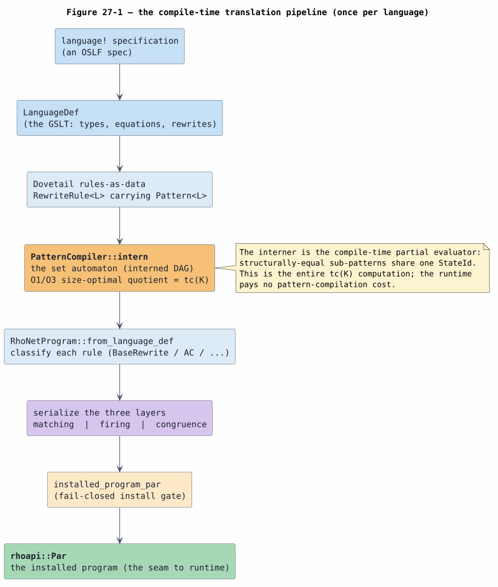
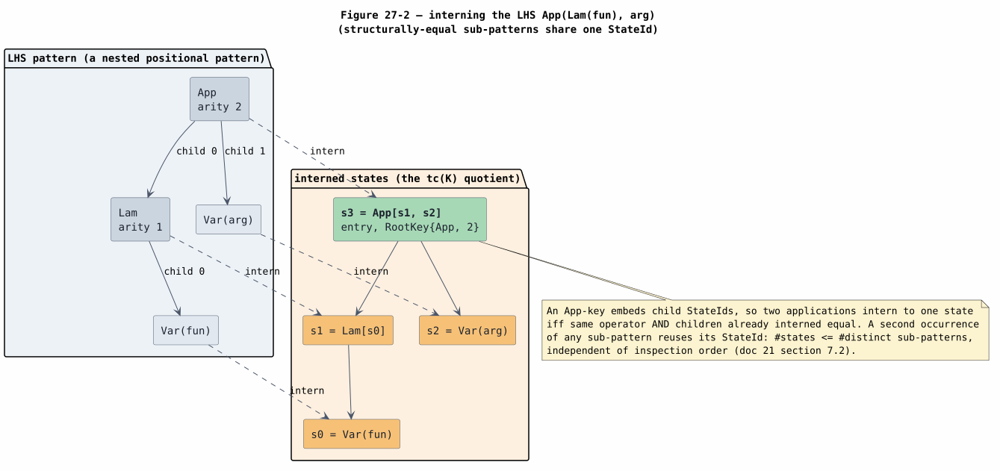
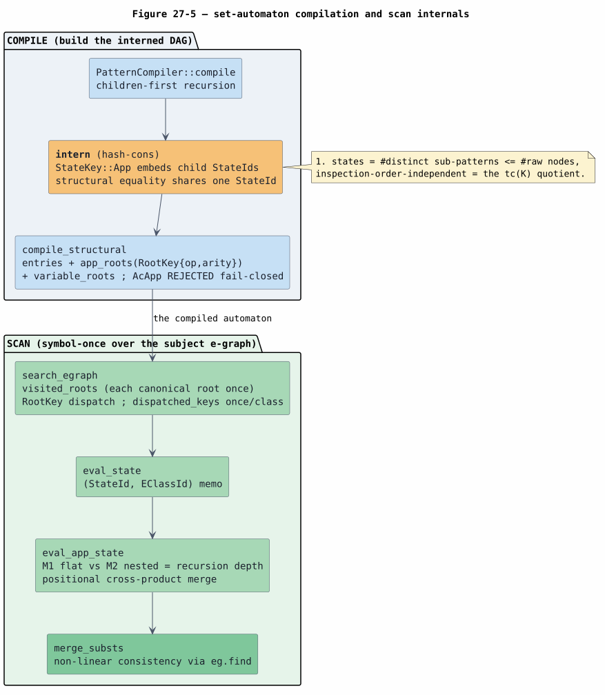
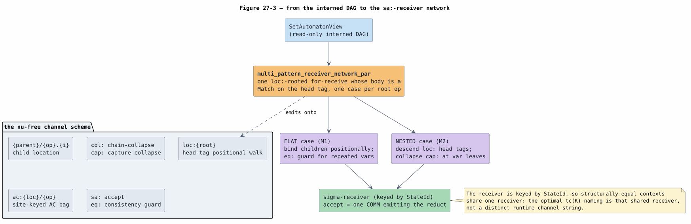
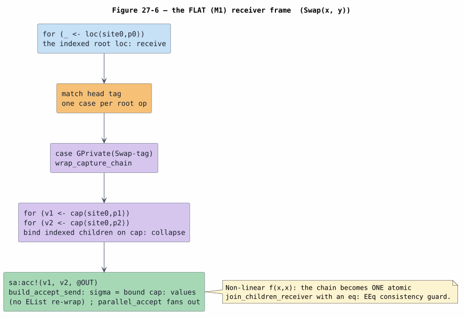
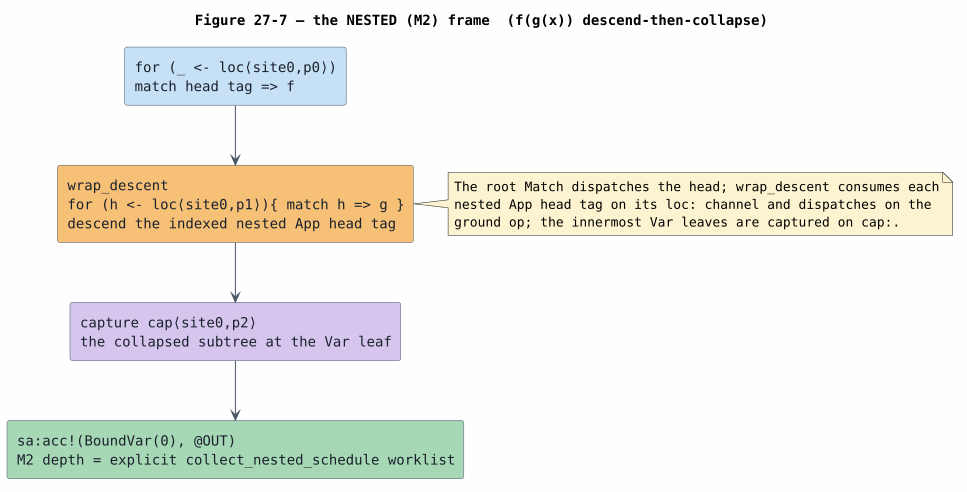
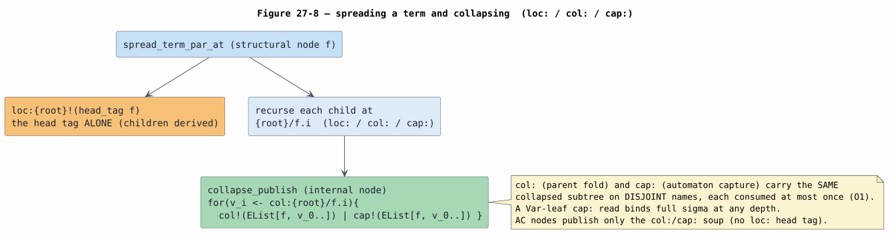
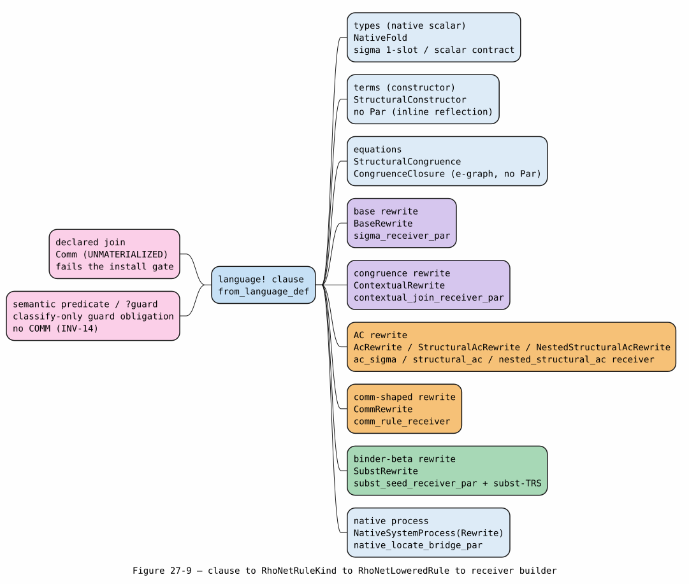
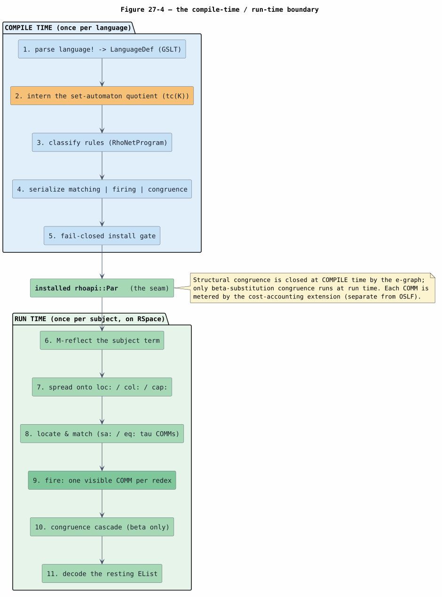

# 27 — Compiling OSLF `language!` Specifications to Rholang: the Set-Automaton Pipeline

> **Altitude — the COMPILE-TIME translation, in full.** This document owns the complete
> compiler's-eye account of **how every clause of an OSLF `language!` specification — types,
> terms, equations, rewrites of every family, literals, and logic/guards — is translated into
> the installed Rholang program** (`rhoapi::Par`) for the runtime backend. The **set automaton
> is the spine**: how the rewrite left-hand sides are interned into it, and how it is serialized
> into the receiver network, is the major focus (§5–§7). This document is reconstruction-grade —
> a reader can rebuild the compile pipeline from it. It stops at the moment the `Par` is
> installed, and **defers all *runtime* firing** to the family references: base
> ([25](25-in-rho-base-family-reference.md)), AC ([18](18-in-rho-ac-matching.md),
> [26](26-in-rho-ac-family-reference.md)), binder-$`\beta`$
> ([19](19-in-rho-binder-beta-substitution.md)), the execution model and staging history
> ([15](15-in-rho-set-automaton-matching.md)); the *why-optimal* theory to
> [21](21-set-automata-optimization-theory.md); the correctness proofs to
> [22](22-end-to-end-formal-verification.md); the paper mandate to
> [13](13-knotted-topoi-operational-invariants.md); and the OSLF theory to the papers
> ([OSLF-2017](references.md#oslf-2017), [KNOTTED-TOPOI-2026](references.md#knotted-topoi-2026)).

## 1. Introduction

**OSLF** — *Operational Semantics in Logical Form* ([OSLF-2017](references.md#oslf-2017)) — is
the program of presenting a language's operational semantics as a categorical algebraic theory
and deriving its observational logic functorially. The mettail-rust toolchain implements OSLF:
a language is written as a `language!` specification, which presents a **graph-structured lambda
theory (GSLT)** — a grammar, equations, and rewrites — and the toolchain compiles it to run on
F1r3node's Rho machine.

This document specifies that compilation exhaustively. Every clause of a `language!` spec is
classified and lowered to a Rholang construct; the rewrites' left-hand sides are compiled into a
**set automaton** that decides all matches in one symbol-once pass, and that automaton is
serialized into a network of persistent guarded receivers whose guarded consumes fire as COMMs.

Two viewpoints run through the document. The **specification** viewpoint is the Knotted-Topoi
paper's desugaring $`[\![ - ]\!]`$ from a GSLT to core rho (§11), which names the matching
channel by the runtime **location** $`c(\ell)`$. The **implementation** viewpoint is this
branch's realization, which names and shares the matching channels through the **optimal set
automaton** — the interned-DAG quotient $`tc(K)`$ of
[OPTIMAL-CHANNEL-NAMING-2026](references.md#optimal-channel-naming-2026), symbol-once ($`O1`$).
The two schemes induce the **same** context-labelled transition system (Theorem 6 of
[22](22-end-to-end-formal-verification.md)); the paper says *what* to build, and the set
automaton is *how* this branch builds it. The set automaton is therefore central to both the
correctness story and the implementation, and is the focus of §5–§7.

### 1.1 On the name "OSLF"

"OSLF" abbreviates **Operational Semantics in Logical Form** — the logic-and-type derivation over
a GSLT, not the funding/cost discipline (metering is the separate cost-accounted rho calculus,
[COST-RHO](references.md#cost-rho); it is what §12 refers to when each COMM is charged).

### 1.2 Contributions and roadmap

- The full compile pipeline (§4) and its per-clause classification (§8).
- The set-automaton construction — interning, the symbol-once scan, and size-optimality (§5).
- Its serialization into the Rholang receiver network — the root `Match` router, the FLAT (M1)
  and NESTED (M2) receiver frames, the non-linear `eq:` guard, and the fail-closed cases (§6).
- The subject-side spread and collapse that feed the automaton (§7).
- The exhaustive per-family lowering — every rewrite family and every non-rewrite clause (§8).
- The RHS/ABI lowering (§9), the install gate and the two invocation paths (§10), the
  Knotted-Topoi desugaring (§11), the compile/run boundary (§12), and worked translations (§13).

## 2. Notation and preliminaries

Every symbol is defined before first use; terms shared with [01](01-concepts-and-glossary.md) are
recalled. Where a definition is realized by a mechanized construct, that construct is named in a
trailing parenthetical.

| Term | Definition |
|---|---|
| **OSLF** | *Operational Semantics in Logical Form* ([OSLF-2017](references.md#oslf-2017)). |
| **GSLT** | *Graph-structured lambda theory* — a triple $`(\text{grammar},\ \text{equations},\ \text{rewrites})`$. A `language!` definition presents one. |
| **`Pattern<L>`** | The rewrite left/right-hand-side pattern language (`dovetail/src/rules.rs:20`): `Var(name)` (a pattern variable), `App(op, args)` (a **positional** constructor application), `AcApp(op, fixed, rest)` (an associative-commutative bag with an optional `...rest` complement). |
| **set automaton** | The interned structure compiled from all `App` left-hand sides that decides, in one symbol-once pass, which patterns match a subject and where ([SET-AUTOMATON-LOCATE-2021](references.md#set-automaton-locate-2021), [SET-AUTOMATON-MATCHING-2022](references.md#set-automaton-matching-2022)). An implementation notion, not an OSLF/GSLT theory term. |
| **`StateId`** | The dense index of one interned automaton state (`set_automaton.rs:88`); structurally-equal sub-patterns share one `StateId`, and the in-Rho lowering keys a state's `sa:` receiver by it (`.index()`, `:96`). |
| **`StateKey<L>`** | The hash-cons key (`set_automaton.rs:101`): `Var(name)` or `App{op, args: Vec<StateId>}`. The `App` key embeds **child `StateId`s, not child syntax** — the source of the collapse. |
| **`RootKey<L>`** | `{op, arity}` (`set_automaton.rs:75`) — the root-symbol dispatch index. |
| **`Subst`** | `HashMap<String, EClassId>` (`rules.rs:59`) — a match substitution $`\sigma`$, variable name → e-class. |
| **M1 / M2** | A **flat** (M1) match binds direct-child variable leaves; a **nested** (M2) match has a child that is itself an `App` — the automaton descends one level. The distinction is purely recursion depth in `eval_app_state`. |
| **$`[\![ t ]\!]`$** | The lowering of a term/rule $`t`$ to a rho process (`rhoapi::Par`). |
| **location $`\ell`$, $`c(\ell)`$** | A path $`\ell = \langle(f_1,i_1),\dots\rangle`$ from the root; the location channel $`c(\ell) = \ulcorner\ell\urcorner`$. |
| **$`tc(K)`$** | The optimal channel of context $`K`$: the interned `StateId` trace ([OPTIMAL-CHANNEL-NAMING-2026](references.md#optimal-channel-naming-2026)), realized as the shared `StateId`-keyed `sa:` receiver — not a distinct runtime string. |
| **COMM / $`\sigma`$-receiver** | One RSpace communication ([RHO-2005](references.md#rho-2005)); the persistent guarded receiver a rule lowers to, whose guarded consume fires as a COMM emitting $`[\![ R ]\!]\sigma`$. |
| **reflected-`EList` ABI** | The wire format: a constructor $`C(t_0,\dots)`$ reflects to `EList[GPrivate(mettail.term.{fp}.{label}), …]` (`reflect_tag`, `rho_net_lower.rs:1378`; prefix `lib.rs:66`). |

**Core rho grammar** (the target, [RHO-2005](references.md#rho-2005)):

```math
P, Q ::= 0 \;\big|\; P \parallel Q \;\big|\; \mathsf{for}(y \leftarrow x)\,P \;\big|\; x!(Q) \;\big|\; {*}x, \qquad x ::= @P
```

(parallel is written `|` in Rholang; the receive is `for(y <- x){P}`; quotation `@P`, dereference
`*x`; no name-restriction $`\nu`$ — freshness comes from quoting.)

**The compile-time artifacts.** Classification produces a `RhoNetProgram` of `RhoNetRule`s tagged
by a `RhoNetRuleKind` (`rho_net.rs:95`):

```rust
pub enum RhoNetRuleKind {
    StructuralConstructor, BaseRewrite, ContextualRewrite,
    StructuralCongruence, NativeFold, NativeSystemProcess, Comm,
}
```

Lowering turns each into a `RhoNetLoweredRule` (`rho_net_lower.rs:100`) carrying the emitted `Par`
— the materialized variants are `BaseRewrite`, `AcRewrite`, `CommRewrite`, `StructuralAcRewrite`,
`NestedStructuralAcRewrite`, `ContextualRewrite`, `SubstRewrite`, `NativeFold`,
`NativeSystemProcessRewrite`; the no-`Par` variants are `StructuralConstructor` (inline reflection)
and `CongruenceClosure` (an equation, closed at compile time); the unmaterialized-and-fail-closed
variants are `Comm`, `NativeSystemProcess`, and `Unsupported` (§10).

**The channel scheme.** Four abstract channel prefixes are attached during classification
(`RhoNetChannel`, `rho_net.rs:53`) and refined into concrete lowered names (`rho_net_lower.rs`):

| Channel | Constructor | Meaning |
|---|---|---|
| `loc:{root}` | `spread_root_location` (`:2761`) | the head-tag channel for the positional walk |
| `{parent}/{op}.{i}` | `spread_child_location` (`:2770`) | the derived child location $`\ell\cdot(op,i)`$ |
| `col:{root}` | `collapse_chain_location` (`:2777`) | the bottom-up chain-collapse value $`[\![ \text{subtree} ]\!]`$, read once by a parent fold |
| `cap:{root}` | `collapse_capture_location` (`:2786`) | the capture-collapse value, read once at a variable leaf |
| `ac:{loc}/{op}` | `ac_carrier_channel` (`:2802`) | the site-keyed associative-commutative operand-bag carrier |
| `sa:{t}` | `RhoNetChannel::set_automaton_trace` (`rho_net.rs:69`) | the $`\sigma`$-receiver source, keyed by `StateId` |
| `eq:{name}` | `RhoNetChannel::consistency` (`rho_net.rs:74`) | the non-linear / premise name-equality guard |
| `obs:{name}` | `RhoNetChannel::observation` (`rho_net.rs:79`) | a user/runtime observation channel |

## 3. The source: a `language!` specification, clause by clause

A `language!` invocation parses to a `LanguageDef` (`ast/src/language/model.rs`) — the in-memory
GSLT. Its clauses:

- **`types`** — the grammar's categories. A bare `Name;` declares an object category; a
  native-wrapped type `![Rust] as Alias { … }` (`LangType.native_type`) wraps a Rust type; a
  collection category `List` / `Bag [delims]` / `Set` / `Map` / `Pathmap`
  (`LangType.collection_kind`) declares a `CollectionType` — `HashBag`, `HashSet`, `Vec`,
  `HashMap`, or `PathMap` (`ast/src/types.rs:8`). (`Zip` is a `Pattern::Zip`, not a
  `CollectionType`.)
- **`literals`** — a lexer regex plus an `eval` closure producing a literal constructor.
- **`tokens`** — lexing (modes, sync, tree invariants).
- **`terms`** — the constructors. A `terms` clause is a judgement
  `Label . <type-ctx / binders> |- <concrete syntax> : Category [ ![body] mode ] ;`. It may carry
  a binder (`^x.body`), a native body (`![…] fold` / `step`), an injection (body-less cast), a
  collection operand (`ps.*sep("|")`), or a guard slot (`?guard:Guard`).
- **`equations`** — symmetric identities `LHS = RHS` (structural congruence), with optional
  freshness/congruence premises.
- **`rewrites`** — directed steps `LHS ~> RHS`: base rewrites, AC-with-`...rest`, and congruences
  (premises above `|-`).
- **`logic` / `guards`** — predicated types: `logic { relation r(T,…); <ascent rules> }` and
  `guards { channels { channel N; join Label(p:Cat) } builtin_predicates … theories … }`.

The `LanguageDef` fields map one-to-one to these clauses. The three that constitute the GSLT are
`terms`, `equations`, and `rewrites`; the rest configure lexing, native evaluation, and predicated
types.

**A worked spec** (the $`\lambda`$-calculus GSLT, `languages/tests/definitions/lambdademo.rs`):

```text
language! {
    name: Lambda
    types { Term }
    terms {
        Lam . ^x.body:[Term -> Term] |- "lam " x "." body : Term ;
        App . fun:Term, arg:Term    |- "(" fun "," arg ")"   : Term ;
    }
    rewrites {
        Beta . |- (App (Lam fun) arg) ~> (eval fun arg) ;
    }
}
```

The `Beta` rewrite, in the Knotted-Topoi paper's notation, is the base rewrite

```math
\mathrm{App}(\mathrm{Lam}(\mathit{fun}),\ \mathit{arg}) \;\Longrightarrow\; \mathit{fun}[\mathit{arg}/0].
```

Its left-hand side lowers to the Dovetail pattern
$`\mathrm{App}(\mathrm{Lam}(\mathrm{Var}(\mathit{fun})),\ \mathrm{Var}(\mathit{arg}))`$ — a nested
positional pattern that the set automaton (§5) is built to decide. This example recurs throughout.

## 4. The compile pipeline

Compilation is one pass per language:

```text
language! ──parse──▶ LanguageDef (GSLT)
          ──from_language_def──▶ RhoNetProgram (classified RhoNetRules)     rho_net.rs:228
          ──PatternCompiler::intern──▶ the set automaton (interned DAG)     set_automaton.rs:140
          ──lower / lower_to_par──▶ per-rule RhoNetLoweredRule (emitted Par)
          ──installed_program_par──▶ ONE installable rhoapi::Par            rho_net_lower.rs:404
```

`RhoNetProgram::from_language_def` (`rho_net.rs:228`) walks the `LanguageDef` and classifies each
clause into a `RhoNetRuleKind`, in this order: `add_scalar_lowering` → `add_constructor_rules` →
`add_native_system_process_rules` → `add_term_guard_predicates` → `add_guard_config` →
`add_equations` → `add_rewrites` → `add_join_patterns`. The classification map:

| Clause | `add_*` (line) | `RhoNetRuleKind` | Predicate | Lowered variant / receiver | Runtime doc |
|---|---|---|---|---|---|
| native-wrapped scalar op | `add_scalar_lowering` (`:250`) | `NativeFold` | one per `scalar_contract_abi` entry | `NativeFold` (1-slot dispatch / scalar contract) | 20, 25 |
| a `terms` constructor | `add_constructor_rules` (`:273`) | `StructuralConstructor` | every `terms` rule | `StructuralConstructor` (inline reflection, no `Par`) | 25 |
| a native/rejected term | `add_native_system_process_rules` (`:305`) | `NativeSystemProcess` | `rejected ∧ term_requires_native_system_process` | `NativeSystemProcessRewrite` (`native_locate_bridge_par`) | 20 |
| an `equations` identity | `add_equations` (`:452`) | `StructuralCongruence` | every `equations` entry | `CongruenceClosure` (e-graph, no `Par`) | 03, 25 |
| a base `rewrites` rule | `add_rewrites` (`:482`) | `BaseRewrite` | `¬ is_congruence_rule` | the un-skip cascade → `sigma_receiver_par` / AC / β / … (§8) | 25/26/19 |
| a congruence `rewrites` rule | `add_rewrites` (`:482`) | `ContextualRewrite` | `is_congruence_rule` | `contextual_join_receiver_par` | 25 |
| a declared `join` | `add_join_patterns` (`:509`) | `Comm` | every `JoinPatternDecl` | `Comm` — **unmaterialized**, fails the gate (§8.13) | — |

The classifying predicate for rewrites (`rho_net.rs:482`):

```rust
let kind = if rewrite.is_congruence_rule() {   // has a Premise::Congruence { source, target }
    RhoNetRuleKind::ContextualRewrite
} else {
    RhoNetRuleKind::BaseRewrite
};
```

Premises become channels or off-machine obligations (`add_premise_input`, `rho_net.rs:587`):
`Freshness` / `RelationQuery` / `ForAll` → an `eq:` consistency input; `Congruence{source,target}`
→ a `loc:` contextual-premise input; a `BehavioralGuard` → an `eq:` input if it has a structural
(`AcMatch`) component, else a semantic-predicate obligation (off-machine, §8.13).



*Figure 27-1. The compile-time translation pipeline, once per language: a `language!` OSLF
specification is parsed to a `LanguageDef` (a GSLT), its clauses classified into a `RhoNetProgram`,
its rewrite left-hand sides interned into the set automaton (the $`tc(K)`$ quotient), each rule
lowered to a receiver, and the fail-closed gate emitting the installed `rhoapi::Par`. Source:
[figures/27-pipeline.puml](figures/27-pipeline.puml).*

## 5. The set automaton — construction

The compiler turns the rewrites' left-hand-side patterns into **one interned set automaton** that
decides all matches in a single symbol-once pass. This is the heart of the translation.

### 5.1 The pattern language

A left-hand side lowers to `Pattern<L>` (`dovetail/src/rules.rs:20`):

```rust
pub enum Pattern<L> {
    Var(String),                                   // a named pattern variable (binds an e-class)
    App { op: L, args: Vec<Pattern<L>> },          // a POSITIONAL constructor application
    AcApp { op: L, fixed: Vec<Pattern<L>>, rest: Option<String> },  // an AC bag + `...rest`
}
```

`App` is the positional path — the set automaton. `AcApp` is the associative-commutative path,
compiled separately (§8.5–§8.7); it is **rejected** from the positional automaton (§5.3).

### 5.2 Interning: the size-optimal quotient

The automaton is built bottom-up by a `PatternCompiler` (`set_automaton.rs:113`) that **hash-conses**
each node into a `StateId`. Children are compiled before parents, and the `App` key embeds the
children's `StateId`s (`compile`, `:129`; `intern`, `:140`):

```rust
fn compile(&mut self, pattern: &Pattern<L>) -> StateId {
    match pattern {
        Pattern::Var(name) => self.intern(StateKey::Var(name.clone())),
        Pattern::App { op, args } => {
            let args = args.iter().map(|arg| self.compile(arg)).collect();   // children first
            self.intern(StateKey::App { op: op.clone(), args })              // key embeds child StateIds
        }
        Pattern::AcApp { .. } => unreachable!("AcApp rejected before state compilation"),
    }
}
fn intern(&mut self, key: StateKey<L>) -> StateId {
    if let Some(&id) = self.interned.get(&key) { return id; }   // structural equality ⇒ share
    let id = StateId(self.states.len());
    self.states.push(state); self.interned.insert(key, id); id
}
```

Because the `App` `StateKey` embeds child `StateId`s (not child syntax), two applications intern to
one state **iff** they have the same operator and their children already interned to the same
`StateId`s. A repeated sub-pattern therefore hits the `get(&key)` fast path and returns the existing
`StateId` — one node shared. This collapse is the compile-time **partial evaluator** that computes
the $`tc(\cdot)`$ quotient of [OPTIMAL-CHANNEL-NAMING-2026](references.md#optimal-channel-naming-2026);
the interner is variable-name-aware, so $`\mathrm{Var}(x)`$ and $`\mathrm{Var}(y)`$ stay distinct.

**The $`\beta`$ pattern, interned.** Interning
$`\mathrm{App}(\mathrm{Lam}(\mathrm{Var}(\mathit{fun})),\ \mathrm{Var}(\mathit{arg}))`$ bottom-up
yields four states:

```math
s_0 = \mathrm{Var}(\mathit{fun}), \quad s_1 = \mathrm{Lam}[s_0], \quad s_2 = \mathrm{Var}(\mathit{arg}), \quad s_3 = \mathrm{App}[s_1, s_2],
```

with $`s_3`$ the entry state, keyed by $`\mathrm{RootKey}\{\mathrm{App}, 2\}`$.



*Figure 27-2. Interning the $`\beta`$ left-hand side
$`\mathrm{App}(\mathrm{Lam}(\mathit{fun}),\ \mathit{arg})`$ bottom-up into four states
$`s_0,\dots,s_3`$; because an `App` key embeds child `StateId`s, structurally-equal sub-patterns
share one state — the size-optimal $`tc(K)`$ quotient. Source:
[figures/27-set-automaton-dag.puml](figures/27-set-automaton-dag.puml).*

### 5.3 The compiled automaton and its view

`SetAutomaton::compile_structural` (`set_automaton.rs:233`) interns all left-hand sides into a shared
DAG and builds the dispatch index:

```rust
pub struct SetAutomaton<L> {
    entries: Vec<PatternEntry<L>>,          // one per LHS (id + root_state)
    states: Vec<PatternState<L>>,           // the interned DAG (index == StateId.0)
    variable_roots: Vec<usize>,             // entries whose ROOT pattern is a bare Var
    app_roots: HashMap<RootKey<L>, Vec<usize>>,  // (op, arity) → candidate entries (the O1 dispatch)
}
```

Per `(id, pattern)` it does: **`if contains_ac(&pattern) { unsupported.push(id); continue; }`**
(`:244`) — the AC rejection; then `root_state = compiler.compile(&pattern)` (`:250`); then routes
the root shape into `variable_roots` (a bare-`Var` root) or `app_roots[RootKey{op, args.len()}]`
(`:251`). If **any** pattern was AC, the *whole* compile fails closed
(`Err(SetAutomatonError{unsupported})`, `:266`) — never a partial automaton. `contains_ac` (`:406`)
recurses: `Var → false`, `App → args.any(contains_ac)`, `AcApp → true`. The AC path is separate
because AC matching is combinatorial (pick-$`k`$-of-$`n`$ plus a residual `...rest`), not positional
(§8.5).

The read-only `SetAutomatonView` (`:168`) is the serialization input; `AutomatonNode` (`:175`) is
`Var(&str)` or `App{op, args: &[StateId]}`; `entry_root_state` (`:195`), `node` (`:200`),
`entry_id` (`:216`, routes an accept to its rule), and `state_count` (`:223`, the number of distinct
`sa:` receivers a full serialization emits).

### 5.4 The symbol-once scan

`search_egraph` (`set_automaton.rs:279`) scans the subject e-graph once at root level:

```rust
let root = eg.find(class);
if !visited_roots.insert(root) { continue; }          // each CANONICAL root once
for &entry in &self.variable_roots { … }              // bare-Var patterns match ANY root
for node in eg.nodes(root) {                          // scan the class's e-nodes
    let key = RootKey { op: node.op.clone(), arity: node.children.len() };
    let Some(candidates) = self.app_roots.get(&key) else { continue };   // O1 head dispatch
    if !dispatched_keys.insert(key) { continue; }     // each (op,arity) key ONCE per class
    for &entry in candidates { self.extend_entry_matches(eg, entry, root, &mut cache, &mut run); }
}
```

`visited_roots` collapses merged classes to one canonical root; `dispatched_keys` evaluates a
duplicate `(op,arity)` root key once per class. Each candidate runs through `eval_state`
(`:334`), memoized by `(StateId, EClassId)` — so a shared interned sub-state is evaluated once and
reused across parents and patterns. A `Var` state binds the whole class into $`\sigma`$; an `App`
state recurses through `eval_app_state` (`:364`):

```rust
for node in eg.nodes(class).iter()
    .filter(|node| node.op == *op && node.children.len() == args.len()) {   // symbol + arity agreement
    let mut partial = vec![Subst::default()];
    for (&arg_state, &child) in args.iter().zip(&node.children) {           // POSITIONAL
        let child_matches = self.eval_state(eg, arg_state, child, cache, stats);   // recurse
        if child_matches.is_empty() { partial.clear(); break; }
        partial = partial.iter().flat_map(|l|                              // CROSS PRODUCT
            child_matches.iter().filter_map(|r| merge_substs(eg, l, r))).collect();
        if partial.is_empty() { break; }
    }
    out.extend(partial);
}
```

The **M1-vs-M2 distinction is entirely in `arg_state`**: if it names a `Var` state, `eval_state`
returns a single class-binding (a flat leaf, M1); if it names an `App` state, `eval_state`
re-enters `eval_app_state` (nested, M2). The merge is identical for both — nesting is just
recursion depth. `merge_substs` (`:414`) enforces **non-linear variable consistency** — a repeated
pattern variable must bind e-equal classes, canonicalized through the union-find `eg.find`:

```rust
match merged.get(name).copied() {
    Some(left) if eg.find(left) == right_class => {},   // consistent re-bind → keep
    Some(_) => return None,                             // CONFLICT → drop this pairing
    None    => { merged.insert(name.clone(), right_class); },
}
```



*Figure 27-5. The automaton internals: `compile`/`intern` build the interned DAG (children-first
hash-cons); `compile_structural` indexes roots by `RootKey` and rejects AC; `search_egraph` scans
each canonical root once and dispatches by head op; `eval_state`/`eval_app_state` positionally
match with a `(StateId, EClassId)` memo; `merge_substs` enforces non-linear consistency. Source:
[figures/27-automaton-internals.puml](figures/27-automaton-internals.puml).*

### 5.5 Size-optimality

Because equal sub-patterns share one `StateId`, the automaton is size-optimal:

```math
\#\text{states} = \#\{\text{distinct sub-patterns of } \mathcal{L}\} \;\le\; \#\{\text{raw pattern nodes of } \mathcal{L}\},
```

and this bound is **independent of the order** in which symbols are inspected — there are no
partial-match configuration states for an adaptive inspection order to multiply, so the size-optimal
automaton is *already achieved by the interning quotient itself* (proved in
[21 §7.2](21-set-automata-optimization-theory.md); locked by
`languages/tests/set_automaton_size_optimal.rs`). The in-file tests confirm the quotient:
`view_shares_one_state_for_structurally_equal_subpatterns` (`:479`) asserts a shared `pair(x,y)`
sub-pattern interns to one `StateId`; `view_exposes_entry_ids_and_state_count` (`:517`) pins
`state_count() == 6` for `Swap(x,y)` + `Pair(a,b)` (distinct ops **and** distinct var names share
nothing). Where a discrimination net blows up to $`\Theta(n^2)`$ match states for $`n`$ overlapping
patterns ([SEKAR-RAMESH-RAMAKRISHNAN-1995](references.md#sekar-ramesh-ramakrishnan-1995)), the
interned-DAG automaton collapses the textbook diagonal to exactly $`2n+1`$ states.

## 6. The set automaton — serialization into the receiver network

`multi_pattern_receiver_network_par` (`rholang-codegen/src/rho_net_automaton.rs:421`) serializes the
interned DAG into **one** `loc:`-rooted `for`-receive whose body is a `Match` on the subject's head
tag, with one case per distinct root operator — the reified `RootKey` router. Each accept routes to
a rule's $`\sigma`$-receiver via an `AutomatonAcceptTarget`:

```rust
pub struct AutomatonAcceptTarget {
    pub pattern: PatternId,     // must equal some view.entry_id(e)
    pub accept_channel: String, // the rule's sigma-receiver SOURCE channel
    pub out_channel: String,    // @out appended last to the sigma tuple
}
```

Per entry, the serializer requires an `App` root (else the `VariableRootPattern` fail-closed case,
`:458`), finds the accept target by `entry_id` (`:463`), and routes to the FLAT or NESTED path
depending on whether any direct child is itself an `App` (`is_nested`, `:471`).



*Figure 27-3. Serializing the interned DAG into the `sa:`-receiver network: one `loc:`-rooted
receive whose body is a per-operator `Match`, with FLAT (M1) and NESTED (M2) cases, feeding the
`StateId`-keyed $`\sigma`$-receivers over the $`\nu`$-free channel scheme. The optimal $`tc(K)`$
naming is the shared receiver, not a distinct channel string. Source:
[figures/27-receiver-network.puml](figures/27-receiver-network.puml).*

### 6.1 FLAT entries (M1)

For a flat entry (all direct children are variable leaves), the serializer partitions the child
positions by first occurrence of each distinct variable (`:534`), then, for a group of entries
sharing op and arity, builds the case body:

- `wrap_children` (`:197`) → `wrap_capture_chain` (`:210`): wraps $`k`$ variable-leaf `for`-receives,
  each reading its child's `cap:` collapse channel `spread_child_location(capture_root, op, i)`; the
  DFS-first leaf binds the highest De Bruijn index.
- `build_accept_send` (`:146`): emits `accept_channel!(σ_0, …, σ_{k-1}, @out)` with one $`\sigma`$
  slot per **distinct** variable, $`\sigma_d = \mathrm{BoundVar}(\mathit{arity}-1-p)`$ where
  $`p`$ is the variable's first-occurrence position. **The slot is the bound `cap:` collapse value
  $`[\![ \text{subtree} ]\!]`$ directly — no `EList[tag]` re-wrap** (the M-collapse soundness fix; an
  `EList[tag]` wrap dropped a non-nullary subject's children).
- `parallel_accept` (`:180`): parallel-composes every entry's accept send — the O3 "share the match,
  announce to every rule" fan-out.

The single-pattern M1 special case `automaton_receiver_network_par` (`:618`) delegates to the
multi-pattern serializer with one target. The worked `Swap(x,y)` frame (`:884`) is:

```text
for (_ <- loc:site0) {
  match BoundVar(0) {
    GPrivate(⌜Swap⌝) => for (v1 <- cap:site0/Swap.0) { for (v2 <- cap:site0/Swap.1) {
      sa:acc!(BoundVar(1), BoundVar(0), @OUT)
    }}
  }
}
```



*Figure 27-6. The FLAT (M1) receiver frame: the `loc:` root receive `Match`-dispatches the head tag,
binds each direct-child variable on its `cap:` collapse channel, and fires the accept send whose
$`\sigma`$ tuple is the bound collapse values. Source:
[figures/27-flat-frame.puml](figures/27-flat-frame.puml).*

### 6.2 Non-linear FLAT entries — the `eq:` guard

When a flat pattern repeats a variable (e.g. `f(x,x)`), the linear `wrap_children` chain is replaced
by `join_children_receiver` (`:366`): ONE atomic polyadic `Receive` binding all `arity` children on
their `cap:` channels, with a `condition` built by `consistency_guard` (`:321`). For each distinct
variable with occurrences $`q_0 < \dots < q_{m-1}`$ ($`m \ge 2`$), it emits
$`\mathrm{EEq}(\mathrm{BoundVar}(\mathit{arity}-1-q_0),\ \mathrm{BoundVar}(\mathit{arity}-1-q_j))`$
for each $`q_j`$, conjoined with `EAnd`. The guarded consume commits iff every repeated occurrence
bound the same value; on inequality the reducer's commit check vetoes the whole consume
(reject-safe). The accept then carries one $`\sigma`$ slot per distinct variable (its first
occurrence).

### 6.3 NESTED entries (M2)

For a nested entry (some direct child is an `App`), `collect_nested_schedule` (`:236`) DFS-walks the
subtree: a `Var` leaf pushes its `cap:` capture channel; an `App` node pushes a `Descent{loc_channel,
op}` and recurses over its args, deriving `child_loc = spread_child_location(loc, op, i)` and
`child_cap = spread_child_location(cap, op, i)`. `build_nested_case_body` (`:290`) then builds the
innermost closed $`\sigma`$ frame with `wrap_capture_chain`, and wraps the descents in DFS-reverse
(deepest `App` innermost) via `wrap_descent` (`:271`), which consumes each nested head tag on its
`loc:` channel and `Match`-dispatches on the ground `op` tag. Capture order = the pattern's
left-to-right first-occurrence order = the $`\sigma`$-receiver's formal order. The worked `f(g(x))`
frame descends `loc:site0` (`f`) → `loc:site0/f.0` (`g`) → captures `cap:site0/f.0/g.0`.



*Figure 27-7. The NESTED (M2) frame: the root `Match` dispatches the head, `wrap_descent` consumes
each nested App head tag on its `loc:` channel and dispatches on the ground op, and the innermost
variable leaves are captured on their `cap:` collapse channels — the M2 depth is recursion in
`collect_nested_schedule`. Source: [figures/27-nested-frame.puml](figures/27-nested-frame.puml).*

### 6.4 Fail-closed cases

The serializer never emits an incorrect network; it fails closed to a later slice with an
`AutomatonUnsupported` variant (`:42`): `MultiPattern` (a multi-entry view at a single-pattern
entrypoint), `NonLinearVariable` (a deep-position repeat), `NonLinearSharedOp` (two entries share an
op but partition their variables differently — e.g. `f(x,y)` and `f(x,x)`), `ConflictingArityForOp`
(same op, different arity, or a flat/nested clash on one op), `VariableRootPattern` (a bare-`Var`
root), `MissingAcceptTarget` (an entry with no accept target), `NestedEntryMultiSite`, and
`ContextualHoleMismatch`. Each keeps the guarantee that a compiled network exactly decides the
positional relation, deferring anything it cannot to the host (§10 REPLAY).

## 7. The subject side: spreading a term onto the automaton's channels

At run time the subject term is **spread** onto the automaton's channels; the compiler emits this
spread. `spread_term_par` (`rho_net_lower.rs:2832`) delegates to `spread_term_par_at` (`:2945`),
which for a structural node (`:2992`):

1. sends the head tag **alone** on `loc:`: `location!(GPrivate(reflect_tag(fp, constructor)))` —
   child locations are derived, never carried;
2. recurses over children left-to-right, deriving each child's `loc:`/`col:`/`cap:` channels;
3. appends `collapse_publish` (`:3044`).

`collapse_publish` rebuilds the reflected subtree on `col:` and `cap:`: a leaf ($`n=0`$) sends
`EList[head_tag]` on both; an internal node emits one polyadic join
`for(v_0 <- col:…/f.0 ; … ; v_{n-1} <- col:…/f.{n-1}){ col!(EList[f̲,v_0,…]) | cap!(EList[f̲,v_0,…]) }`
consuming each child's chain value once and reproducing `reflect_ground_term_par`'s shape. **This is
why a variable leaf reading `cap:ℓ` binds the full positional $`\sigma`$ for an arbitrary-depth
subterm**: the head tags land on `loc:`, the children on child `loc:` locations, and `col:`/`cap:`
carry the collapsed $`[\![ \text{subtree} ]\!]`$ on disjoint names so the parent's chain read and the
automaton's capture read never race (each consumed at most once — O1). An AC-collection node
publishes only the reflected soup on `col:`/`cap:`, with **no `loc:` head tag and no positional
child spread** (§8.5).



*Figure 27-8. The spread: head tags on `loc:`, children on derived child `loc:` locations, and the
`collapse_publish` join rebuilding $`[\![ \text{subtree} ]\!]`$ on the disjoint `col:` (parent fold)
and `cap:` (automaton capture) channels — so a variable-leaf `cap:` read binds full $`\sigma`$ at
any depth. Source: [figures/27-spread-collapse.puml](figures/27-spread-collapse.puml).*

`in_rho_match_all_sites_call_par` (`rho_net_ruleset.rs:651`) assembles the whole MATCH call: it
buckets candidate redex sites by head op (`collect_redex_sites`, `:614`, using the automaton's own
root-op set `rule_lhs_root_constructors`, `:579` — read only from the compiled automaton, never the
report), emits one receiver network per located site plus the AC/contextual co-installs, and appends
**one** whole-subject spread at the root site. A contention gate (`ruleset_all_entries_flat`, `:598`)
requires every entry to be App-over-Var-leaves when more than one site is located (a nested entry
would descend `loc:` head tags and race a co-installed root attempt, so it fails closed to
`NestedEntryMultiSite`). The located-site count of 0 = normal form (a bare spread that fires
nothing).

## 8. Per-clause / per-family lowering (exhaustive)

Each subsection: *source clause → `Pattern` → classification → emitted receiver `Par` → fail-closed →
runtime-doc pointer*. The `BaseRewrite` dispatch is an **un-skip cascade** (`lower_base_rewrite`),
tried in order: lossless-cast congruence → AC families → binder-$`\beta`$ seed → plain base.



*Figure 27-9. The classification-and-lowering map: each `language!` clause becomes a
`RhoNetRuleKind`, dispatched (the `BaseRewrite` un-skip cascade) to a `RhoNetLoweredRule` and a
receiver builder — or to a no-`Par` inline form, or fail-closed. Source:
[figures/27-family-map.puml](figures/27-family-map.puml).*

### 8.1 Terms → `StructuralConstructor`

Every `terms` constructor is classified `StructuralConstructor` (`add_constructor_rules`, `:273`)
with a `sa:term/{i}/{label}/syntax` input, per-child `loc:term/…/{item|binder|collection}/…` inputs,
and a `loc:term/{i}/{label}/value` output. It lowers to `RhoNetLoweredRule::StructuralConstructor` —
**no `Par`**: a constructor contributes no receiver; it is realized by the reflected-`EList` ABI
(§9), which reflects $`C(t_0,\dots)`$ to `EList[GPrivate(⌜C⌝), …]` wherever the term appears. Runtime:
[25](25-in-rho-base-family-reference.md). Formal rule:
[28 §4.1](28-translation-rule-system.md#41-terms-spread-and-reflection).

### 8.2 Equations → `StructuralCongruence`

Every `equations` identity is classified `StructuralCongruence` (`add_equations`, `:452`) and lowers
to `RhoNetLoweredRule::CongruenceClosure` — **no `Par`**: structural congruence is closed at
**compile time** by the e-graph (`dovetail/src/egraph.rs`), which folds equal forms into one class
before the automaton runs, so the automaton matches modulo the equations for free. Runtime: the only
congruence that runs at run time is binder-$`\beta`$ substitution (§8.9). Formal rule:
[28 §4.2](28-translation-rule-system.md#42-equations-compile-time-congruence).

### 8.3 Base rewrites → `sigma_receiver_par`

A plain base rewrite (LHS is App-over-Var, RHS is not a substitution) lowers via `lower_rhs` (§9) and
`sigma_receiver_par` (`rho_net_lower.rs:3516`) — a flat $`(k+1)`$-ary persistent receiver, $`k`$
$`\sigma`$-slots (the LHS free variables in first-occurrence order) plus the out channel:

```text
for (x_0, …, x_{k-1}, out <- source) { out!( ⟦R⟧σ ) }
```

`source` is the rule's own `sa:` trace channel (accept-triad coherence: the receiver source is
byte-identical to the automaton's accept channel and to the host injection channel). The RHS
references slot $`i`$ as $`\mathrm{BoundVar}(k-i)`$ (`rhs_var_index`). Runtime:
[25](25-in-rho-base-family-reference.md). Formal rule:
[28 §4.3](28-translation-rule-system.md#43-base-rewrites-the-flat-sigma-receiver).

### 8.4 Contextual rewrites → `contextual_join_receiver_par`

A congruence rule (`is_congruence_rule`, a `Premise::Congruence{source,target}`) is classified
`ContextualRewrite` and lowers via `contextual_join_receiver_par` (`:3573`) — an atomic $`n`$-ary
JOIN (INV-6) that blocks until all $`n`$ reduced holes arrive on their `loc:` premise channels, then
emits the rewritten outer right-hand side:

```text
for (T_0 <- c(ℓ_0) ; … ; (T_{n-1}, out) <- c(ℓ_{n-1})) { out!( ⟦K'⟧(T_0, …, T_{n-1}) ) }
```

Runtime: [25](25-in-rho-base-family-reference.md); proof: `ContextualAtomicJoinPlugging.v`. Formal
rule: [28 §4.4](28-translation-rule-system.md#44-contextual-rewrites-the-atomic-join).

### 8.5 AC-linear → `ac_sigma_receiver_par`

When `lower_lhs_vars` returns `Err(CollectionAc)`, the un-skip cascade tries the AC receivers. The
linear AC receiver `ac_sigma_receiver_par` (`:3625`) matches an order-independent sub-multiset in one
`consume`:

```text
for ( <ac_collection_pattern> , out <- source ) where(cond?) { out!( ⟦R⟧σ ) }
```

`ac_collection_pattern` dispatches on the `CollectionType`: `ac_bag_pattern(op, k)` = a connective
process-`Par` with $`k`$ send-patterns `@"ac:{op}"!(FreeVar(i))` plus a process remainder
`EVar(FreeVar(k))` (order-independent multiset match via the native `sub_pars` /
`MaximumBipartiteMatch`); `ac_set_pattern` = a connective `ESet` with $`k`$ free-var elements plus
remainder; `ac_map_pattern` = a connective `EMap` with $`k`$ `(FreeVar(2i),FreeVar(2i+1))` entries
plus remainder (slot count $`2k`$ for HashMap else $`k`$). A repeated variable adds an
$`\mathrm{EEq}`$ `condition` (`ac_nonlinear_condition`); `...rest` is the connective remainder free
var, re-spliced in the body via parallel composition. The AC path exists precisely because `AcApp`
is rejected from the positional automaton (§5.3): AC is combinatorial, not positional. The host
differential oracle (`collect_ac_matches` `rules.rs:574`, the lazy size-$`k`$ selection iterator
`lazy_ac_select` `:153`, `pair_fixed` `:636`, budget-gated `add_canonical_bag` `:681`) is used only
for offline checks, never at run time. Runtime: [26](26-in-rho-ac-family-reference.md). Formal rule:
[28 §4.5](28-translation-rule-system.md#45-ac-linear-the-one-consume-multiset-receiver).

### 8.6 Structural AC (Open) → `structural_ac_rule_receiver`

The ambient `OpenRule` shape `{(open N P), N[Q], ...rest} ~> {P, Q, ...rest}` (`k` structured
elements, `m` structural reduct vars) lowers via `structural_ac_rule_receiver` (`:4680`):

```text
for ( <rest | @"ac:op"!(⟦E_0⟧) | … >, r_0, …, r_{m-1}, out <- source ) where(N_0 == N_1 ∧ …)
  { out!( @"ac:op"!(r_0) | … | @"ac:op"!(r_{m-1}) | rest ) }
```

The guard enforces the ambient-name agreement; the body splices the $`m`$ $`\sigma`$-delivered
reducts back with `...rest`. Runtime: [26](26-in-rho-ac-family-reference.md); proof:
`AmbientOpenFiring.v`. Formal rule:
[28 §4.6](28-translation-rule-system.md#46-structural-ac-the-open-shape).

### 8.7 Nested structural AC (In/Out) → `nested_structural_ac_rule_receiver`

The depth-2 ambient `In`/`Out` shape lowers via `nested_structural_ac_rule_receiver` (`:5824`), gated
to binder-free languages (`def.equations.is_empty()`). Its guard is a **depth-agnostic** cross-level
name-equality $`\mathrm{EEq}(M_a, M_b)`$ over the shared channel occurrence slots of the flattened
frame. Runtime: [26](26-in-rho-ac-family-reference.md); proof: `AmbientInOutFiring.v`. Formal rule:
[28 §4.7](28-translation-rule-system.md#47-nested-structural-ac-the-in-and-out-shapes).

### 8.8 COMM-shaped rewrite → `comm_rule_receiver`

The canonical Rholang COMM rewrite `op{(PFor N cont),(POutput N Q),...rest} ~> op{(eval cont Q),...rest}`
lowers via `comm_rule_receiver` (`:4308`) when `comm_rule_shape` matches (two structured elements
over bare vars, one shared channel var `N`, RHS a single substitution with the same op and rest):

```text
for ( <rest | @"ac:op"!(⟦E_0⟧) | @"ac:op"!(⟦E_1⟧)>, reduct, out <- source ) where(N_recv == N_send)
  { out!( @"ac:op"!(reduct) | rest ) }
```

The repeated channel `N` becomes the `EEq` guard; the reduct is host-computed and delivered on a
$`\sigma`$ slot. **This is distinct from a declared join** (`RhoNetRuleKind::Comm` from
`add_join_patterns`), which is classified but **unmaterialized** and fails the install gate (§8.13,
§10). Runtime: [26](26-in-rho-ac-family-reference.md); proof: `CommRuleFiring.v`. Formal rule:
[28 §4.8](28-translation-rule-system.md#48-comm-shaped-rewrites).

### 8.9 Binder-$`\beta`$ → the substitution seed + subst-TRS

When the RHS is a top-level substitution (`is_top_level_substitution`), `lower_subst_rewrite`
(`rho_net_lower.rs:941`) materializes `RhoNetLoweredRule::SubstRewrite`. The LHS
`App(Lam(fun), arg)` is matched and $`\sigma`$-bound `(body, arg)` by the **same positional
automaton** (§5.3); only the fire differs: `subst_seed_receiver_par` (`rho_net_subst_trs.rs:1021`)
is a $`(k+1)`$-ary receiver whose body **sends** the seed
`^subst(⟦^Z⟧, BoundVar(repl_bv), BoundVar(scope_bv), BoundVar(0))` on the reserved `^subst` channel —
this one COMM is the observable $`\beta`$-fire. The five reserved receivers are installed once per
language by `subst_trs_program_par` (`:1003`) on disjoint `GPrivate(reflect_tag(fp, label))` roots:
`^cmp` (`:417`, Peano compare), `^pred` (`:494`, predecessor), `^shiftk` (`:524`, $`k`$ iterated
shifts), `^shift` (`:568`, free-variable shift with cutoff), `^subst` (`:663`, capture-avoiding
$`t[a/j]`$, with the depth-increment `S j` under `^lambda`). The C2 object-congruence arms
(`object_congruence_cases`, `:806`) reduce under user constructors as an atomic join so a partial
object term is never observable; the load-bearing invariant (`object_congruence_constructors`, `:915`)
is that emitted object constructors are disjoint from `reserved_subst_trs_labels()` (`:105`, the 11
`^`-prefixed labels) — else `^lambda` would lose its depth increment. Reflection totality/injectivity
is the compile-time well-definedness obligation (`BinderReflectionTotalOrReject.v`). Runtime cascade
(SN/CR/NF and the weak bisimulation): [19](19-in-rho-binder-beta-substitution.md). Formal rule:
[28 §4.9](28-translation-rule-system.md#49-binder-beta-the-substitution-seed-and-the-subst-trs).

### 8.10 Native fold → `NativeFold`

A native-wrapped scalar op that lowers to an in-Rho scalar contract is classified `NativeFold`
(`add_scalar_lowering`, `:250`). `lower_native_fold` splits on the fold-vs-equation criterion: a
`fold` op installs the one-slot dispatch receiver `sigma_receiver_par(1, …)` =
`for(result, out <- c){ out!(result) }` (the host delegates the reduced value); a non-`fold` op
keeps the Model-T scalar contract `contract @"L"(@a,@b,ret){ ret!(a op b) }`. Runtime:
[20](20-rholang-runtime-backend.md). Formal rule:
[28 §4.10](28-translation-rule-system.md#410-native-fold).

### 8.11 Native system process → `native_locate_bridge_par`

A term the report rejects that also `term_requires_native_system_process` (`:952`:
`rust_code.is_some() || eval_mode.is_some() || rule_has_scalar_operator_shape`) is classified
`NativeSystemProcess` (`:305`). It lowers to a **directed-compute** bridge `native_locate_bridge_par`
(`:1008`): the positional automaton **locates** the native head and captures its structural args as
`sa:` $`\tau`$ COMMs (which only gate); the bridge forwards the trusted handler `value` on the
dispatch channel, where the installed dispatch receiver forwards it on `@out`. The **location** is
the automaton's; only the **value** is the handler's payload (FV `NativeSystemProcessBoundary.v`:
`emitted_is_reflected_handler_value`, and the location-from-capture-not-report separation). Runtime:
[20](20-rholang-runtime-backend.md). Formal rule:
[28 §4.11](28-translation-rule-system.md#411-native-system-process-the-locate-to-value-bridge).

### 8.12 Literals → the `NativeFold` path

A `literals` regex-plus-`eval` constructor feeds the native path: its op surfaces in the scalar
contract ABI and is classified `NativeFold` (§8.10) or, if it has no scalar contract,
`NativeSystemProcess` (§8.11). A compile-time **fold-readiness** discipline (generated in
`macros/src/gen/runtime/dovetail_report/typed_report.rs:299`: `__is_fold_redex`, `__is_value_op`,
`__class_is_fold_value`, `__weigh`, `body_returns_option`) defers a fold until every object child is
a reduced value op, and gives a redex a high extraction weight so bottom-up saturation prefers the
contractum after the fire. Formal rule:
[28 §4.12](28-translation-rule-system.md#412-literals-and-ground-values-the-reflected-carrier).

### 8.13 Logic / guards (predicated types)

- **Declared joins.** A `guards { channels { channel N; join Label(p:Cat) } }` is classified `Comm`
  (`add_join_patterns`, `:509`) with `loc:join/{label}/input/{param}:{cat}` inputs and a
  `loc:join/{label}/continuation` output. It lowers to `RhoNetLoweredRule::Comm`, which is
  **not materialized** — installing a language whose fired set includes a declared join fails closed
  at the gate (§10). The materialized COMM firing instead comes from the Comm-*shaped rewrite*
  `CommRewrite` (§8.8), whose `where(N_recv == N_send)` guard is the compiled shared-channel join
  condition. Do not conflate the two.
- **Semantic predicates.** A `builtin_predicates` / `theories` entry, or a purely-semantic
  `BehavioralGuard` premise (no `AcMatch` structural component), becomes a `RhoNetSemanticPredicate`
  guard obligation (quality from `semantic_predicate_quality`: `ExactDecidable` / `RejectSafeApprox`
  / `RuntimeObservation`), recorded on `RhoNetRule.semantic_predicate_guards`. A semantic predicate
  **classifies and gates the accept-send but emits no COMM** (INV-14): it is dispatched off-machine
  (`RhoBackendInvocation::DeferToDovetailSemanticPredicate`). The formal fence is
  `semantic_predicates_emit_no_comm` (`WholeGsltInRhoOpCorrespondence.v:277`): a predicate
  disposition carries no $`c(\ell)`$ label, so it is absent from every operational-correspondence
  trace. Depth: [semantic-predicates suite](../semantic-predicates/README.md).
- **`logic { relation r(T,…); … }`** parses to a `LogicBlock` whose relations are emitted as Ascent
  relations (runtime `prattail`/LogicT), verbatim — not part of the rho-net receiver program (no
  COMM). A `Premise::RelationQuery` at the rewrite level becomes an `eq:` consistency input.
- **`?guard:Guard` slot.** `add_term_guard_predicates_for_rule` (`:577`) pushes a
  `RhoNetSemanticPredicate("term:{label}:guard:{name}", RuntimeObservation)` — again no receiver, no
  COMM, only a runtime-observation guard obligation.

Formal rule:
[28 §4.13](28-translation-rule-system.md#413-guards-semantic-predicates-and-declared-joins).

## 9. RHS lowering and the reflected-`EList` ABI

`lower_rhs` (`rho_net_lower.rs:1360`) delegates to `reflect_term_par`, which recurses over the RHS
pattern:

- a `Var` in the RHS binder env → a reflected bound-variable leaf
  `EList[GPrivate(⌜^bound⌝), GString(name)]`; else a $`\sigma`$-slot
  `BoundVar(rhs_var_index(k, i))`; else `Err(DanglingRhsVariable)`;
- an `Apply{constructor, args}` → the positional reflection

```math
[\![ f(t_1,\dots,t_n) ]\!] \;=\; \mathrm{EList}\big[\ @\ulcorner f\urcorner,\ [\![ t_1 ]\!],\ \dots,\ [\![ t_n ]\!]\ \big],
```

  with a **HashBag intercept** (Stage AC2b): if the constructor resolves to a `HashBag`, the bare
  process-soup carrier is emitted instead (each element `@"ac:{op}"!([\![ e_i ]\!]σ)`, `...rest`
  spliced);
- a `Lambda`/`MultiLambda` → `EList[⌜^lambda⌝, [\![ binder ]\!], [\![ body ]\!]]` with the binder
  pushed onto the env;
- a top-level `Subst`/`MultiSubst` → routed to `lower_subst_rewrite` (§8.9) *before* this reflector;
- a `Collection`/`Map`/`Zip` → the AC path (§8.5).

`reflect_ground_term_par` (`:2303`) reflects a closed `GroundTerm{constructor, children, coll_type}` (struct at `:1389`)
— byte-identical to `reflect_term_par`'s positional shape but with no `BoundVar` leaves — routing by
`coll_type`: `HashBag → reflect_ac_bag_par` (a process soup, one ground send per element),
`HashSet → ESet` (native `ParSet`, sorted+deduped), `HashMap → EMap` (native `ParMap` from `^kv`
entries, key-sorted+deduped ⇒ key-uniqueness), and `Vec`/`PathMap` → the positional tagged `EList`
(ordered ⇒ positional is correct). The ABI tag is `mettail.term.{fp}.{label}`
(`REFLECTED_TERM_ABI_PREFIX`, `lib.rs:66`) carried by an unforgeable `GPrivate` (collision-free with
any user `GString`); a plain (inert) bag value uses `RHOCALC_BAG_ABI_TAG = "mettail.rhocalc.bag.v1"`
(`lib.rs:54`).

## 10. The install gate and the two invocation paths

`installed_program_par` (`rho_net_lower.rs:404`) folds every lowered rule's `Par` into one program
and **fails closed**:

```rust
if !self.errors.is_empty() { return Err(LoweringErrors(self.errors.clone())); }
for rule in &self.rules {
    match rule {
        Comm{..} | NativeSystemProcess{..} | Unsupported{..} =>
            return Err(UnmaterializedRule { rule_id: …, family: … }),   // fail closed
        _ => continue,   // materialized variants + StructuralConstructor + CongruenceClosure
    }
}
let mut program = self.rules.iter().fold(Par::default(), |p, r| match r.par() {
    Some(par) => p.append(par.clone()), None => p });
if let Some(trs) = &self.subst_trs { program = program.append(trs.clone()); }   // append ONCE
Ok(program)
```

`StructuralConstructor` and `CongruenceClosure` legitimately contribute no `Par`; a declared `Comm`,
a `NativeSystemProcess`, or any `Unsupported` rule is a recognized-but-unmaterialized rule that fails
the gate. The de-Bruijn subst/shift TRS (built once iff any rule lowered to `SubstRewrite`) is
appended exactly once, on disjoint reserved roots.

At run time one of three generated entry points is chosen (`macros/src/gen/runtime/rho_invocation.rs`):

- **MATCH** (`rho_net_match_invocation_from_dovetail_to`, `:1765`, the default): `assert_complete()`
  gate → M-reflect the whole subject to a `GroundTerm` (not the report $`\sigma`$) → reconstruct the
  `LanguageDef` → `compile_in_rho_matching_ruleset` → a **capability gate** (fail closed
  pre-reduction if a fired rule is not matchable in Rho) → `in_rho_match_all_sites_call_par` — one
  $`\prod_\ell \text{network}_\ell \parallel \text{spread}`$ call; the automaton re-does matching and
  location in Rho.
- **CONTEXTUAL** (`:1802`): same M-reflect + gate, then `contextual_match_call_par` — the base
  automaton locates the hole's premise redex and the installed contextual join reassembles
  $`[\![ K' ]\!]`$.
- **REPLAY** (`:1827`, the fallback): one host-$`\sigma`$ injection per firing onto the same installed
  receivers, taken only when the gate rejects an off-machine rule (AC / contextual / binder / native)
  or a nested-App-entry ruleset.

The choice is a single `match` (e.g. `repl/src/rho_backends.rs:172`). Both paths drive the **same**
installed program (`installed_program_par` composed with the call) — the no-dual-path guarantee; only
the *producer* of the $`\sigma`$ tuple differs (in-Rho accept vs host injection). The subst-TRS is
appended once inside the install gate, so both paths run against the same $`\beta`$ cascade.

## 11. The desugaring, in the Knotted-Topoi style: the specification core

The specification viewpoint (§1) records the desugaring $`[\![ \cdot ]\!]`$ in the clause form of
[KNOTTED-TOPOI-2026](references.md#knotted-topoi-2026), threading the location $`\ell`$; the location
channel is $`c(\ell) = \ulcorner\ell\urcorner`$. The four clauses below are the paper's Appendix-A
**specification core** — Terms, Base rewrites, Contextual rewrites, and A whole GSLT. The
normative, per-clause statement of the *full* translation calculus — these four plus the nine
conservative extensions this compiler adds (equations, the AC families, COMM-shaped, binder-$`\beta`$,
native, literals, guards) — is the master rule table of
[28 §4](28-translation-rule-system.md#4-the-master-rule-table), with the whole-language assembly in
[28 §5](28-translation-rule-system.md#5-whole-language-assembly).

**Terms.**

```math
[\![ f(t_1, \dots, t_n) ]\!]_\ell \;=\; c(\ell)!(\underline{f}) \;\parallel\; [\![ t_1 ]\!]_{\ell\cdot(f,1)} \;\parallel\; \cdots \;\parallel\; [\![ t_n ]\!]_{\ell\cdot(f,n)}
```

**Base rewrites** (persistent by the reflection idiom, no replication):

```math
[\![ L \Rightarrow R ]\!] \;=\; \mathsf{for}\big([\![ L ]\!] \leftarrow c(\ell)\big)\big\{\ c(\ell)!\big([\![ R ]\!]_\ell\big) \;\parallel\; [\![ L \Rightarrow R ]\!]\ \big\}
```

**Contextual rewrites.**

```math
\mathsf{let}\ c = c(\ell)\ \mathsf{in}\ \mathsf{for}\big(([\![ L_1 ]\!], \dots, [\![ L_n ]\!]) \leftarrow c\big)\big\{\ c!\big([\![ K' ]\!]([\![ R_1 ]\!], \dots, [\![ R_n ]\!])\big)\ \big\}
```

**A whole GSLT.**

```math
[\![ G ]\!] \;=\; [\![ L_1 \Rightarrow R_1 ]\!] \;\parallel\; \cdots \;\parallel\; [\![ L_m \Rightarrow R_m ]\!], \qquad (L_i \Rightarrow R_i) \in \mathcal{R},
```

with equations compiled to structural congruence and a term run by injecting $`[\![ t ]\!]_\varepsilon`$
on a fresh root.

**The `rem:nonopt` bridge.** The clauses name every matching channel by the runtime location
$`c(\ell)`$, which re-inspects the symbols enclosing a redex, failing the symbol-once condition
$`O1`$. The paper adopts $`c(\ell)`$ for the lift and **defers** the optimal scheme. This branch
realizes the same desugaring via the interned set automaton (§5–§7), keying each matching receiver by
the automaton's `StateId` trace $`tc(K)`$ so structurally-equal contexts share one receiver and each
subject symbol is inspected once. The two schemes name channels differently but induce the **same**
context-labelled transition system (Theorem 6 of
[22](22-end-to-end-formal-verification.md)); every result stated over $`c(\ell)`$ transfers to the
$`tc(K)`$-keyed realization.

## 12. The compile-time / run-time boundary

**Compile time (once per language):** parse `language!` → `LanguageDef`; **intern the set-automaton
quotient** (`PatternCompiler::intern` — the entire $`tc(K)`$ partial evaluation; the runtime pays no
pattern-compilation cost); classify the rules (`from_language_def`); serialize the three layers —
matching (`multi_pattern_receiver_network_par`), firing (the $`\sigma`$-receiver family), congruence
(the subst-TRS appended once); run the fail-closed install gate.

**Run time (once per subject, entirely on RSpace):** M-reflect the subject; spread $`[\![ t ]\!]`$
onto `loc:`/`col:`/`cap:`; locate and match via `sa:`/`eq:` silent COMMs (descending nested apps,
collapsing `cap:` at variable leaves); fire — each accept sends $`\sigma`$ on the rule's `sa:`
channel and the $`\sigma`$-receiver publishes $`[\![ R ]\!]\sigma`$ on `out` (the one visible COMM per
redex); run the $`\beta`$-congruence cascade; decode the resting `EList`.

Structural congruence is closed at compile time by the e-graph; only binder-$`\beta`$ runs at run
time. Metering is by construction: every COMM is charged by the interpreter under the cost-accounting
extension ([COST-RHO](references.md#cost-rho); [20](20-rholang-runtime-backend.md)), with no manual
hook.



*Figure 27-4. The boundary: five compile-time steps (once per language) produce the installed
`rhoapi::Par`, the seam to six run-time steps (once per subject) on RSpace. Structural congruence is
closed at compile time; only binder-$`\beta`$ runs at run time. Source:
[figures/27-compile-run-boundary.puml](figures/27-compile-run-boundary.puml).*

## 13. Worked translations

**The $`\beta`$ rule end to end.** Source `Beta . |- (App (Lam fun) arg) ~> (eval fun arg) ;`, i.e.
$`\mathrm{App}(\mathrm{Lam}(\mathit{fun}),\ \mathit{arg}) \Rightarrow \mathit{fun}[\mathit{arg}/0]`$.
LHS pattern $`\mathrm{App}(\mathrm{Lam}(\mathrm{Var}(\mathit{fun})),\ \mathrm{Var}(\mathit{arg}))`$
interns to $`s_0,\dots,s_3`$ (§5.2). The serializer emits a `loc:`-rooted receive whose `Match` has an
`App`-arity-2 NESTED case: it descends child 0, matches a `Lam`-arity-1 head, collapses the `Lam`
body at `cap:` as $`\mathit{fun}`$, binds child 1 as $`\mathit{arg}`$, and fires
$`\sigma = \{\mathit{fun} \mapsto \text{body},\ \mathit{arg} \mapsto \text{argument}\}`$ on the `Beta`
`sa:` channel. Because the RHS is a top-level substitution, the firing $`\sigma`$-receiver is the
`subst_seed_receiver_par` (§8.9), which sends the `^subst` seed; the subst-TRS drives it to the normal
form $`\mathit{fun}[\mathit{arg}/0]`$ as silent COMMs.

**An AC firing.** For the Comm rewrite (§8.8) the LHS is `Err(CollectionAc)`; the un-skip cascade
selects `comm_rule_receiver`, which emits the order-independent sub-multiset receive with the
`where(N_recv == N_send)` channel-agreement guard; the located AC operands are re-sourced from the
`ac:` site-keyed carrier the spread published (§7), and the whole match plus the `...rest` residual
resolve inside one atomic `consume`.

## 14. Relation to companion documents

This document is the compile-time complement to the runtime backend
([20](20-rholang-runtime-backend.md)): 20 owns *how the installed `Par` runs*; this document owns
*how the `Par` is produced from a `language!` specification*, with the set automaton as the spine. The
per-family *runtime* mechanism is the family references — base
([25](25-in-rho-base-family-reference.md)), AC ([18](18-in-rho-ac-matching.md),
[26](26-in-rho-ac-family-reference.md)), binder-$`\beta`$
([19](19-in-rho-binder-beta-substitution.md)); the execution model and staging history are
[15](15-in-rho-set-automaton-matching.md); the *why-optimal* theory is
[21](21-set-automata-optimization-theory.md); the correctness proofs — including the
sound-$`\equiv`$-optimal equivalence this document relies on — are
[22](22-end-to-end-formal-verification.md); and the OSLF theory the toolchain implements is the papers
([OSLF-2017](references.md#oslf-2017), [BEHAVIOR-HOL](references.md#behavior-hol),
[HYPERCUBE](references.md#hypercube), [KNOTTED-TOPOI-2026](references.md#knotted-topoi-2026)).

## References

See [references.md](references.md). Primary sources for this document:
[OSLF-2017](references.md#oslf-2017) (the OSLF representation of operational semantics);
[KNOTTED-TOPOI-2026](references.md#knotted-topoi-2026) (the desugaring clauses and location channels
$`c(\ell)`$); [OPTIMAL-CHANNEL-NAMING-2026](references.md#optimal-channel-naming-2026) (the optimal
$`tc(K)`$ set-automaton channel naming and the same-CLTS claim);
[SET-AUTOMATON-LOCATE-2021](references.md#set-automaton-locate-2021) and
[SET-AUTOMATON-MATCHING-2022](references.md#set-automaton-matching-2022) (the symbol-once set
automaton); [SEKAR-RAMESH-RAMAKRISHNAN-1995](references.md#sekar-ramesh-ramakrishnan-1995) (the
discrimination-net $`\Theta(n^2)`$ blow-up the interned DAG linearizes); [RHO-2005](references.md#rho-2005)
(the core rho calculus, quoting, and COMM); and [COST-RHO](references.md#cost-rho) (the cost-accounting
extension that meters each COMM, distinct from OSLF). The compile-time obligations are mechanized in
the in-Rho campaign suite (`references.md` IN-RHO-CAMPAIGN-FORMAL): `InRhoMatchPositional.v`,
`PositionalSetAutomatonSound.v`, `SymbolOnceInjective.v`, `TcChannelNamingQuotient.v`,
`ContextualAtomicJoinPlugging.v`, `CommRuleFiring.v`, `AmbientOpenFiring.v`, `AmbientInOutFiring.v`,
`NativeSystemProcessBoundary.v`, `BinderReflectionTotalOrReject.v` — presented as numbered results in
[22](22-end-to-end-formal-verification.md).
