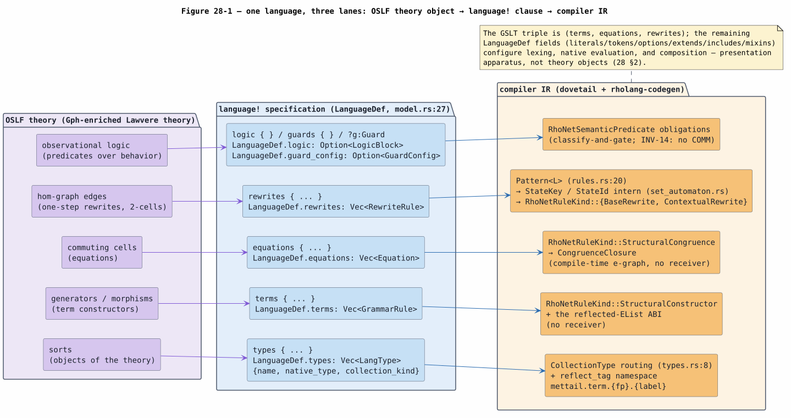
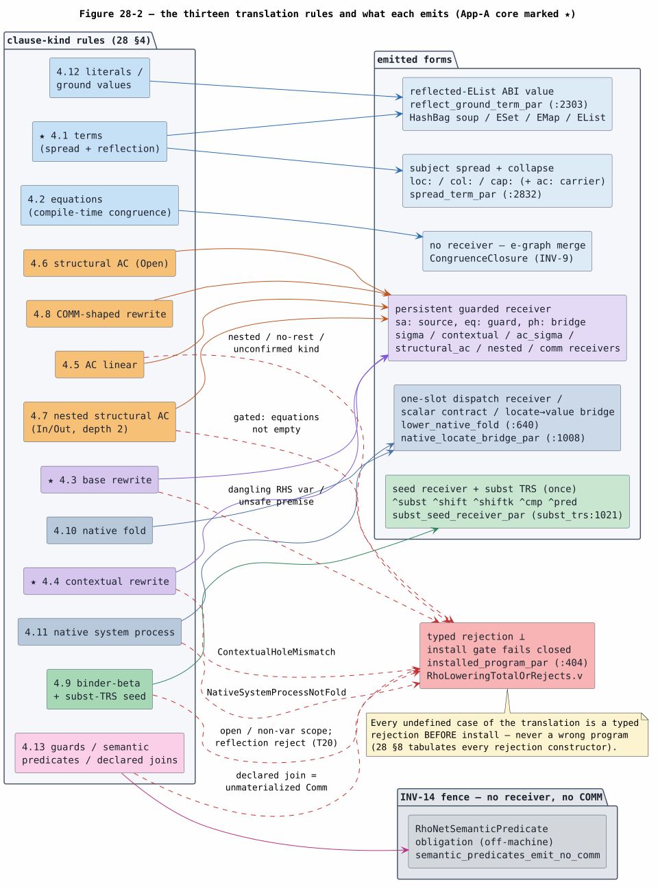
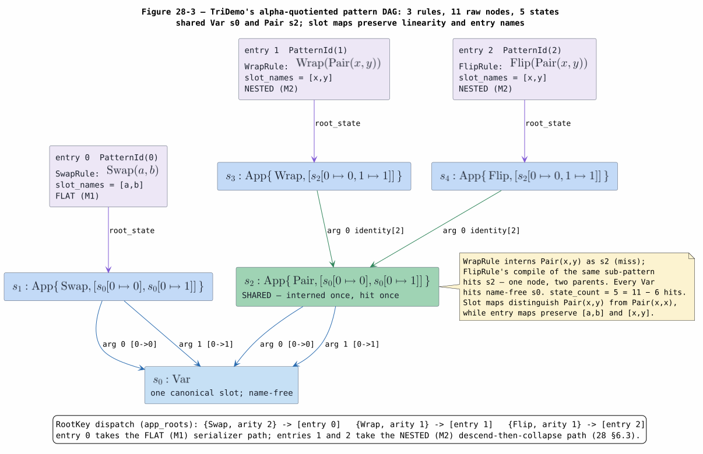
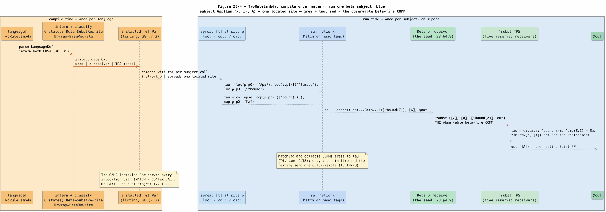

# 28 — The Translation-Rule System

> **Altitude — the SPECIFICATION-level translation calculus, with worked whole-language
> instances.** This document states, as one closed rule system, **what** the compiler's
> translation from an OSLF `language!` specification to the installed Rholang program *is*:
> a master table of all thirteen clause-kind rules in the Knotted-Topoi paper's
> $`[\![ \cdot ]\!]`$ style (§4), the single whole-language assembly formula (§5), and two
> worked whole languages carried to the end — a three-rule language whose left-hand sides
> share an interned automaton state, traced intern-call by intern-call (§6), and a two-rule
> $`\lambda`$ language whose **complete installed `rhoapi::Par`** is listed verbatim,
> pinned by a golden test (§7). The **mechanism** — how the emitters build each receiver,
> byte by byte — is owned by [27](27-oslf-language-to-rholang-compilation.md); the
> *why-optimal* theory by [21](21-set-automata-optimization-theory.md); the mechanized
> proofs by [22](22-end-to-end-formal-verification.md); and the per-item paper crosswalk by
> [29](29-knotted-topoi-satisfaction-crosswalk.md). This document is the calculus those
> four documents share.

## 1. Introduction and altitude

The compilation of a `language!` specification to the Rho machine is documented at four
altitudes: mechanism ([27](27-oslf-language-to-rholang-compilation.md)), optimality
([21](21-set-automata-optimization-theory.md)), proof
([22](22-end-to-end-formal-verification.md)), and paper satisfaction
([29](29-knotted-topoi-satisfaction-crosswalk.md)). What none of them owned before this
document is the **specification altitude**: the translation presented *as a rule system* —
one judgment per clause kind, each with its equation, its emitted template, and its
fail-closed condition — together with worked instances that carry a **whole language**
through every rule at once rather than one family at a time.

Two acceptance criteria, stated positively, fix what "worked instance" means here:

1. **The multi-rule criterion (§6).** A worked language with *several* rewrite rules whose
   left-hand sides overlap, showing the one shared set automaton the compiler actually
   builds: the full interning trace (every `intern()` call, hit or miss), the shared
   `StateId`, the `RootKey` dispatch map, and the FLAT/NESTED serializer route of every
   entry — with the state count pinned by a unit test against the production
   `PatternCompiler`.
2. **The complete-artifact criterion (§7).** A worked language carried to the **complete
   installed `rhoapi::Par`** — every receiver of the installed program listed, with only a
   stated mechanical elision (fingerprint shortening), generated by the production
   `plan_rho_default_backend` path and pinned by the golden test
   `rholang-codegen/tests/doc28_golden_listing.rs` so the listing can never drift from the
   emitters.

Both criteria are met with the real machinery: the traces and listings below are not
illustrative sketches but test-pinned outputs of the production compiler at the cited
source locations.

**Roadmap.** §2 grounds the source side — a `language!` specification *is* an
OSLF-presented GSLT, clause by clause, field by field. §3 fixes notation and the judgment
forms. §4 is the heart: the master rule table, all thirteen clause kinds, each entry an
equation plus its emitted receiver template plus its fail-closed condition, with the four
rules that constitute the paper's Appendix-A core marked as such. §5 assembles the whole
language into one formula. §6 and §7 are the worked instances. §8 tabulates every
fail-closed constructor against the rule it guards. §9 places the document.

## 2. The source theory: a language! specification presents an OSLF GSLT

### 2.1 The categorical reading

**OSLF** — *Operational Semantics in Logical Form*
([OSLF-2017](references.md#oslf-2017)) — represents a language's operational semantics as
a **Gph-enriched multisorted Lawvere theory**: a categorical algebraic theory whose
hom-*sets* are upgraded to hom-*graphs*. Under this reading, one theory carries the whole
language:

- the theory's **sorts** (objects) are the grammar's syntactic categories;
- its **generators** (morphisms) are the term constructors;
- its **commuting cells** (equations between morphisms) are the structural congruence;
- the **edges of its hom-graphs** (2-cells) are the one-step rewrites — the reduction
  relation as structure, not as an external relation;
- and the **observational logic** derived functorially over the theory is where
  predicates over behavior live — a layer *on top of* the theory, not among its
  generators.

A **GSLT** — *graph-structured lambda theory*
([GSLT-CONTEXT](references.md#gslt-context), [01](01-concepts-and-glossary.md)) — is
exactly this data presented concretely: a grammar, a set of equations, and a set of
rewrites. A `language!` invocation parses to a `LanguageDef`
(`ast/src/language/model.rs:27`), and the walk down from the theory to the struct is
one-to-one. The three fields that constitute the GSLT triple are `terms`, `equations`,
and `rewrites`; `types` names the sort set they are typed over; `logic`/`guard_config`
carry the observational layer; and the remaining fields (`literals` via `token_defs`,
`mode_defs`, `options`, and the composition fields `extends_names`/`include_names`/
`mixin_names`) configure lexing, native evaluation, and reuse — presentation apparatus,
not theory objects.

### 2.2 The four-column correspondence

| OSLF theory object | `language!` clause | `LanguageDef` field (`ast/src/language/model.rs:27`) | Compiler IR |
|---|---|---|---|
| sorts (objects) | `types { Term Name ... }` | `types: Vec<LangType>` — `{name, native_type, collection_kind}` (`model.rs:915`) | `CollectionType` routing (`ast/src/types.rs:8`: `HashBag`, `HashSet`, `Vec`, `HashMap`, `PathMap`) and the reflected-tag namespace `mettail.term.{fp}.{label}` (`rholang-codegen/src/lib.rs:67`) |
| generators (morphisms) | `terms { Label . params \|- syntax : Cat ; }` | `terms: Vec<GrammarRule>` | `RhoNetRuleKind::StructuralConstructor` (`rho_net.rs:97`) — no receiver; realized as the reflected-`EList` ABI (§4.1, §4.12) |
| commuting cells (equations) | `equations { LHS = RHS ; }` | `equations: Vec<Equation>` | `RhoNetRuleKind::StructuralCongruence` lowering to `CongruenceClosure` — the compile-time e-graph, no receiver (§4.2) |
| hom-graph edges (2-cells) | `rewrites { LHS ~> RHS ; }` | `rewrites: Vec<RewriteRule>` | `Pattern<L>` (`dovetail/src/rules.rs:20`) interned as `StateKey`/`PatternState` into `StateId`s (`dovetail/src/set_automaton.rs:89`, `:102`, `:108`); classified `BaseRewrite` or `ContextualRewrite` by `is_congruence_rule` (`model.rs:798`, `rho_net.rs:469`) |
| observational logic | `logic { ... }`, `guards { ... }`, `?g:Guard` slots | `logic: Option<LogicBlock>`, `guard_config: Option<GuardConfig>` | `RhoNetSemanticPredicate` obligations (`rho_net.rs`) — classify-and-gate, no receiver, no COMM (§4.13, INV-14) |

Figure 28-1 draws the three lanes.



*Figure 28-1. One language read three ways: the OSLF theory objects (violet), the
`language!` clauses and their `LanguageDef` fields that present them (blue), and the
compiler IR that carries them (amber). The GSLT triple is the middle three rows; the
observational layer compiles to obligations, never to receivers. Source:
[figures/28-theory-spec-ir.puml](figures/28-theory-spec-ir.puml).*

### 2.3 What is mechanized about this reading, honestly

The claim "MeTTaIL programs present finitely presentable GSLTs, essentially surjectively"
is the Knotted-Topoi paper's **definitional item** (`def:mettail`), and its categorical
content is the paper's own. What this repository mechanizes under the name
`MettaGsltPresentation.v` is the **deploy-signature funding-lane algebra** —
`decompositions_sound` / `decompositions_complete` / `decompositions_characterization`
(`formal/rocq/rho_bridge/theories/MettaGsltPresentation.v:59`, `:80`, `:96`): the
`Sig`/`MettaSig` split-join decompositions MeTTaIL re-presents are exactly the host lane
algebra's — **not** the categorical claim itself. The *data* correspondence of §2.2 is
carried by the `language!`-to-`LanguageDef` parse and the clause-by-clause classification
of §4; the crosswalk row that states this division precisely is
[29 §3](29-knotted-topoi-satisfaction-crosswalk.md#3-the-per-item-crosswalk)
(`def:mettail`), mirroring the corrected scoping in
[13 §6](13-knotted-topoi-operational-invariants.md#6-mapping-to-the-formal-verification-suite).

### 2.4 The interactive reading: the K-family

The repository-local theory context ([GSLT-CONTEXT](references.md#gslt-context),
`context/gslt-context.md`) refines a GSLT to an **interactive GSLT** by distinguishing the
family $`K`$ of term constructors that head the left-hand side of every **base** rewrite —
a base rewrite being precisely a rewrite with no hypotheses. Base rewrites are the *ground
interactions* (the dynamics itself); rules with premises are *modes of inference* that
propagate interactions through context. This division is exactly the master table's
division between §4.3 (base) and §4.4 (contextual), and it is why cost attaches per
firing COMM and never per congruence step ([COST-RHO](references.md#cost-rho),
[13 §5](13-knotted-topoi-operational-invariants.md) INV-9).

For the running $`\lambda`$ instance (`languages/src/lambdademo.rs`, and §7's
TwoRuleLambda), the K-family is the application constructor: $`K = \mathrm{App}`$, whose
one hypothesis-free rule is $`\beta`$ — `Beta . |- (App (Lam fun) arg) ~> (eval fun arg)`.
The program/environment cut is *absolute* there (function side vs argument side); for a
$`\pi`$/$`\rho`$-shaped language such as MiniRhoFor the K is parallel composition and the
cut is *relative* — both readings flow through the same §4 rules, which never depend on
which constructor plays $`K`$.

## 3. Notation and judgment forms

Terms shared with the suite are defined in [01](01-concepts-and-glossary.md) (COMM,
$`\tau`$, barb, CLTS, GSLT, e-graph) and recalled here only as needed. The rule system
uses five judgment forms:

| Judgment | Reading |
|---|---|
| $`[\![ t ]\!]_{\ell} \Rightarrow P`$ | the subject term $`t`$ at location $`\ell`$ **spreads** to the process $`P`$ (head tags on `loc:`, collapses on `col:`/`cap:`) — §4.1 |
| $`[\![ L \Rightarrow R ]\!] \Rightarrow P`$ | the rewrite rule translates to its **installed receiver** $`P`$ — §4.3 through §4.11 |
| $`[\![ e ]\!] \Rightarrow \varepsilon`$ | the clause translates to **no process** — a compile-time or classify-only artifact (equations, semantic predicates) — §4.2, §4.13 |
| $`[\![ G ]\!] \Rightarrow P`$ | the whole language assembles to the one installed program — §5 |
| $`[\![ e ]\!] \Rightarrow \bot(\rho)`$ | the translation **fails closed** with the typed reason $`\rho`$ — the install gate rejects the whole language rather than emit a partial or wrong program — §8 |

Supporting notation:

- $`\sigma`$ — a match substitution, variable name to bound subterm value
  (`Subst`, `dovetail/src/rules.rs:60`); $`[\![ R ]\!]\sigma`$ is the reflected right-hand
  side with each variable occurrence replaced by its $`\sigma`$ slot (a De Bruijn
  `BoundVar` in the receiver frame, `rhs_var_index`, `rho_net_lower.rs:459`).
- $`\underline{f}`$ — the head tag of constructor $`f`$: the unforgeable
  `GPrivate(reflect_tag(fp, f))`, where `reflect_tag` = `mettail.term.{fp}.{label}`
  (`rho_net_lower.rs:1378`; prefix `lib.rs:67`) and `fp` is the language fingerprint
  `mettail-langdef-v1:{16 hex digits}` (`ast/src/identity.rs:21`).
- **The reflected-`EList` ABI carrier.** Every term value on the wire is the tagged list
  $`[\![ C(t_1,\dots,t_n) ]\!] = \mathrm{EList}[\underline{C}, [\![ t_1 ]\!],\dots,[\![ t_n ]\!]]`$
  (`reflect_ground_term_par`, `rho_net_lower.rs:2303`), with the collection-kind
  exceptions of §4.12. The substitution TRS's module documentation
  (`rho_net_subst_trs.rs:1`) tabulates the same carrier for the binder shapes
  (`^bound(n)`, `^lambda(b)`, `^free(x)`, Peano `Z`/`S`), so a captured lambda body flows
  from the automaton into a `^subst` seed with no re-encoding.
- **Channels.** The nine concrete channel forms, all $`\nu`$-free deterministic quoted
  names: `loc:{site}` and the derived child `{parent}/{op}.{i}`
  (`spread_root_location` / `spread_child_location`, `rho_net_lower.rs:2761`, `:2770`);
  `col:{site}` and `cap:{site}` (`:2777`, `:2786`); `ac:{loc}/{op}` (`:2802`);
  `sa:{trace}` and `eq:{name}` and `obs:{name}` (`RhoNetChannel`, `rho_net.rs:55`);
  and the contextual premise-hole `ph:{premise}` (`:2690`).
- $`\bot`$ — fail-closed rejection. The translation is a **partial function by design**:
  every undefined case is a typed constructor (§8) surfaced at or before
  `installed_program_par` (`rho_net_lower.rs:404`), so no admitted program ever contains
  an approximated rule (INV-11,
  [13 §5](13-knotted-topoi-operational-invariants.md)).

Persistent receives are written `<=` in templates (the Rholang persistent-receive form);
the plain `<-` marks a linear receive. Rholang's parallel composition is written `|` in
templates and $`\parallel`$ in equations.

## 4. The master rule table

The thirteen clause kinds, one row each. **Core** marks the four rules that *are* the
Knotted-Topoi paper's Appendix-A desugaring clauses (`app:desugar`: Terms, Base rewrites,
Contextual rewrites, and — in §5 — A whole GSLT); every other row is a **conservative
extension**: a rule the paper's fragment does not name, compiled so that it either erases
to the same CLTS observations (equations, predicates) or fires as the same
one-visible-COMM shape the core rules fire as (AC, COMM-shaped, binder, native). The
un-skip order for a `BaseRewrite`-classified rule is the cascade of `lower_base_rewrite`
(`rho_net_lower.rs:685`): lossless-cast congruence first; then, when the flat walk fails
with `CollectionAc`, the AC ladder (linear §4.5, COMM-shaped §4.8, structural §4.6, nested
§4.7, in that order); then the binder-$`\beta`$ seed (§4.9) when the RHS is a top-level
substitution; else the plain base receiver (§4.3).

| § | Clause kind | Emits | Builder (provenance) | Fail-closed | Status | Proof | Runtime |
|---|---|---|---|---|---|---|---|
| 4.1 | terms (constructor) | subject spread + reflected ABI, no receiver | `spread_term_par` (`rho_net_lower.rs:2832`), `reflect_ground_term_par` (`:2303`) | never blocks | **Core** | T1 | [25](25-in-rho-base-family-reference.md) |
| 4.2 | equations | $`\varepsilon`$ (compile-time e-graph merge) | `add_equations` (`rho_net.rs:432`) | never blocks | extension (paper: equations-as-congruence) | INV-9 | [03](03-dovetail-rewrite-semantics.md) |
| 4.3 | base rewrite | flat $`(k{+}1)`$-ary $`\sigma`$-receiver | `sigma_receiver_par` (`rho_net_lower.rs:3516`) | dangling RHS var, unsafe premise | **Core** | T7, T9, T10 | [25](25-in-rho-base-family-reference.md) |
| 4.4 | contextual rewrite | atomic $`n`$-ary join | `contextual_join_receiver_par` (`:3573`) | `ContextualHoleMismatch` | **Core** | T8 | [25](25-in-rho-base-family-reference.md) |
| 4.5 | AC linear | one-consume multiset receiver | `ac_sigma_receiver_par` (`:3625`) | nested / no-rest / unresolved kind | extension | T5, T14, T15 | [18](18-in-rho-ac-matching.md), [26](26-in-rho-ac-family-reference.md) |
| 4.6 | structural AC (Open) | guarded multiset receiver + reduct splice | `structural_ac_rule_receiver` (`:4680`) | shape mismatch declines | extension | T11 | [26](26-in-rho-ac-family-reference.md) |
| 4.7 | nested structural AC (In/Out) | depth-2 guarded receiver | `nested_structural_ac_rule_receiver` (`:5824`) | gated to binder-free languages (`:800`) | extension | T12 | [26](26-in-rho-ac-family-reference.md) |
| 4.8 | COMM-shaped rewrite | non-linear AC receiver, channel-agreement guard | `comm_rule_receiver` (`:4308`) | non-COMM shape declines | extension | T14 | [26](26-in-rho-ac-family-reference.md) |
| 4.9 | binder-$`\beta`$ | seed receiver + subst TRS (appended once) | `subst_seed_receiver_par` (`rho_net_subst_trs.rs:1021`), `subst_trs_program_par` (`:1003`) | open/non-var scope; reflection reject (T20) | extension | T16 through T20 | [19](19-in-rho-binder-beta-substitution.md) |
| 4.10 | native fold | one-slot dispatch receiver / scalar contract | `lower_native_fold` (`rho_net_lower.rs:640`) | missing scalar contract | extension | T13-adjacent (D3) | [20](20-rholang-runtime-backend.md) |
| 4.11 | native system process | locate-to-value bridge | `native_locate_bridge_par` (`:1008`) | `NativeSystemProcessNotFold` | extension | T13 | [20](20-rholang-runtime-backend.md) |
| 4.12 | literals / ground values | reflected carrier by collection kind | `reflect_ground_term_par` (`:2303`) routing | `Zip` has no carrier | extension | T5 (AC carriers) | [20](20-rholang-runtime-backend.md), [26](26-in-rho-ac-family-reference.md) |
| 4.13 | guards / predicates / joins | $`\varepsilon`$ (obligation only); declared join is $`\bot`$ | `add_premise_input` (`rho_net.rs:628`), `add_join_patterns` (`:510`) | declared join = unmaterialized `Comm` | extension (outside the paper's fragment) | INV-14 fence | [12](12-runtime-invocation-migration.md) |

T-numbers are the numbered results of [22](22-end-to-end-formal-verification.md) (T1
matching, T6 sound-equals-optimal, T7 through T15 firing, T16 through T20 binder, T21
through T23 the capstone). Figure 28-2 is the same table as a map.



*Figure 28-2. The rule map: thirteen clause-kind rules (left, hued by family — blue
structural, violet positional receivers, amber AC, green binder, blue-grey native, pink
guards) routed to the six emitted forms (right). Red dashed edges are the fail-closed
routes into the typed-rejection gate; the grey package is the INV-14 fence — semantic
predicates emit no receiver and no COMM. Stars mark the Appendix-A core. Source:
[figures/28-rule-map.puml](figures/28-rule-map.puml).*

### 4.1 Terms: spread and reflection

**Core** (Appendix-A "Terms"). A constructor contributes *no receiver*
(`StructuralConstructor`, `rho_net.rs:274`); it is realized twice — as the subject-side
**spread** that the automaton matches over, and as the reflected-**value** carrier (§4.12)
wherever the term appears as data.

```math
[\![ f(t_1,\dots,t_n) ]\!]_{\ell} \;=\; \mathtt{loc:}\ell\,!\,(\underline{f}) \;\parallel\; \prod_{i=1}^{n} [\![ t_i ]\!]_{\ell\cdot(f,i)} \;\parallel\; \mathrm{collapse}(f,\ell)
```

The head tag travels **alone**; child locations are derived, never carried. The collapse
member rebuilds $`[\![ \text{subtree} ]\!]`$ bottom-up on the two disjoint channels `col:`
(read once by the parent's fold) and `cap:` (read once by an automaton variable leaf), so
a variable leaf binds a full arbitrary-depth subterm — the emitted template
(`spread_term_par` / `spread_term_par_at` / `collapse_publish`, `rho_net_lower.rs:2832`,
`:2945`, `:3044`):

```text
loc:ℓ!(GPrivate(⌜f⌝))
| ⟦t_1⟧ at ℓ/f.0  | … |  ⟦t_n⟧ at ℓ/f.{n-1}
| for (v_0 <- col:ℓ/f.0 ; … ; v_{n-1} <- col:ℓ/f.{n-1}) {
    col:ℓ!(EList[⌜f⌝, v_0, …, v_{n-1}])  |  cap:ℓ!(EList[⌜f⌝, v_0, …, v_{n-1}])
  }
```

A nullary constructor sends `EList[⌜f⌝]` on both collapse channels directly; an AC
collection node publishes only its reflected carrier with no `loc:` head tag (§4.5).
Fail-closed: none — the spread is total over ground structural terms. Mechanism:
[27 §7](27-oslf-language-to-rholang-compilation.md#7-the-subject-side-spreading-a-term-onto-the-automatons-channels);
proof: T1 (the in-Rho $`\sigma`$ equals the positional $`\sigma`$ over the spread).

### 4.2 Equations: compile-time congruence

```math
[\![ L = R ]\!] \;=\; \varepsilon \qquad \big(\text{$L$ and $R$ merged into one e-class before the automaton runs}\big)
```

An `equations` identity classifies as `StructuralCongruence` (`add_equations`,
`rho_net.rs:432`) and lowers to `CongruenceClosure` — **no receiver, ever** (INV-9:
equations are cost-free isomorphism, not motion). The e-graph closes the congruence at
compile time, so the automaton matches modulo the equations for free; the only congruence
that runs at run time is binder-$`\beta`$ substitution (§4.9). The same rule absorbs the
auto-injected lossless cast-canonicalization rewrites: `lower_base_rewrite` recognizes a
`NormCast` shape by its `SyntheticInjGuard` premise and routes it to `CongruenceClosure`
rather than to a firing receiver (the D3 fold-vs-equation criterion,
`FoldMotionVsCongruence.v`). Fail-closed: none — an equation never blocks the install.
Mechanism: [27 §8.2](27-oslf-language-to-rholang-compilation.md).

### 4.3 Base rewrites: the flat sigma-receiver

**Core** (Appendix-A "Base rewrites"). For a rule whose LHS is App-over-variables with
$`k`$ distinct variables (first-occurrence order) and a non-substitution RHS:

```math
[\![ L \Rightarrow R ]\!] \;=\; \mathsf{for}\big((x_0,\dots,x_{k-1},\mathit{out}) \Leftarrow \mathtt{sa:}s_L\big)\big\{\ \mathit{out}\,!\,([\![ R ]\!]\sigma)\ \big\}
```

— a **persistent** $`(k{+}1)`$-ary receiver on the rule's own `sa:` trace channel, which
is byte-identical to the automaton's accept channel and the host injection channel (the
accept-triad coherence). Template (`sigma_receiver_par`, `rho_net_lower.rs:3516`):

```text
for (x_0, …, x_{k-1}, out <= sa:{trace}) { out!( ⟦R⟧σ ) }     -- RHS slot i = BoundVar(k−i)
```

Fail-closed: a RHS variable with no LHS binding occurrence
(`UnsupportedFamily::DanglingRhsVariable`) and any premise the receiver cannot enforce
(`NonCongruenceSideCondition`) are $`\bot`$. Mechanism:
[27 §8.3](27-oslf-language-to-rholang-compilation.md);
proof: T7 (step correspondence), T9 (non-linear `eq:` consistency), T10 (atomicity).

### 4.4 Contextual rewrites: the atomic join

**Core** (Appendix-A "Contextual rewrites"). A rule with congruence premises
$`L_i \Rightarrow R_i`$ licensing the outer $`K \Rightarrow K'`$ (`is_congruence_rule`,
`model.rs:798`) compiles to one atomic $`n`$-ary join (INV-6) that blocks until every
reduced hole arrives:

```math
[\![ L_1 \Rightarrow R_1,\dots,L_n \Rightarrow R_n \vdash K \Rightarrow K' ]\!] \;=\; \mathsf{for}\big(T_1 \Leftarrow c(\ell_1);\ \dots;\ (T_n,\mathit{out}) \Leftarrow c(\ell_n)\big)\big\{\ \mathit{out}\,!\,\big([\![ K' ]\!](T_1,\dots,T_n)\big)\ \big\}
```

Template (`contextual_join_receiver_par`, `rho_net_lower.rs:3573`; the premise channels
are the `loc:{kind}/{name}/contextual-premise/{i}/{src}-to-{tgt}` names classification
assigned, `rho_net.rs:628`):

```text
for (T_0 <- loc:…/contextual-premise/0/… ; … ; (T_{n-1}, out) <- loc:…/contextual-premise/{n-1}/…) {
  out!( ⟦K'⟧(T_0, …, T_{n-1}) )
}
-- in-Rho matching routes each hole's nested firing through the disjoint premise-hole
-- channel first:   for (T <- ph:c(ℓ_i)) { c(ℓ_i)!(T [, @out]) }        (the hole bridge)
```

Hole $`i`$ sits at receiver level $`i`$, so the body references it as
$`\mathrm{BoundVar}(n-i)`$ — the same frame as §4.3, and for $`n=1`$ the join *is*
`sigma_receiver_par(1, ...)`. Fail-closed: the in-Rho contextual driver rejects any
subject whose located redexes are not exactly the $`n`$ hole positions
(`AutomatonUnsupported::ContextualHoleMismatch`). Mechanism:
[27 §8.4](27-oslf-language-to-rholang-compilation.md);
proof: T8.

### 4.5 AC linear: the one-consume multiset receiver

An associative-commutative LHS `op{x_0, …, x_{k-1}, ...rest}` has no positional image
(`contains_ac` rejection, `set_automaton.rs:406`); the un-skip cascade compiles it to a
receiver whose collection **pattern** matches an order-independent sub-multiset in one
atomic consume:

```math
[\![ \mathit{op}\{x_0,\dots,x_{k-1}, \mathord{\ldots}\mathit{rest}\} \Rightarrow R ]\!] \;=\; \mathsf{for}\big((\pi_{\mathit{op}}^{k} \uplus \mathit{rest},\ \mathit{out}) \Leftarrow \mathtt{sa:}s\big)\ \mathsf{where}\ \varphi\ \big\{\ \mathit{out}\,!\,([\![ R ]\!]\sigma)\ \big\}
```

where $`\pi_{\mathit{op}}^{k}`$ is the kind-dispatched connective pattern
(`ac_collection_pattern`, `rho_net_lower.rs:2429`) and $`\varphi`$ the optional non-linear
`EEq`-conjunction guard (`ac_nonlinear_condition`, `:3698`). Template
(`ac_sigma_receiver_par`, `:3625`):

```text
for ( <@"ac:{op}"!(x_0) | … | @"ac:{op}"!(x_{k-1}) | rest> , out <= sa:{trace} )
  where(x_i == x_j ∧ …)?              -- only when an element variable repeats
  { out!( ⟦R⟧σ ) }
-- the subject side publishes the bag on the SITE-KEYED carrier  ac:{loc:ρ/ℓ}/{op}
```

A `HashSet` operand swaps the soup for a connective `ESet` (`ac_set_pattern`, `:2445`); a
`HashMap` for a connective `EMap` with $`2k`$ key/value slots (`ac_map_pattern`, `:2458`;
`ac_element_slot_count`). The `...rest` complement binds the residual and is re-spliced in
the body. Fail-closed: a nested-element, no-rest, or kind-unresolved AC rule declines
every rung of the ladder and lands in $`\bot(\mathtt{CollectionAc})`$. Mechanism:
[27 §8.5](27-oslf-language-to-rholang-compilation.md);
proof: T5 (multiset relation), T14/T15 (payload and atomicity).

### 4.6 Structural AC: the Open shape

The ambient `OpenRule` shape — $`k`$ structured elements over bare variables, $`m`$
structural reduct variables, a shared name occurring across elements:

```math
[\![ \mathit{op}\{(\mathrm{open}\ N\ P),\ N[Q], \mathord{\ldots}\mathit{rest}\} \Rightarrow \mathit{op}\{P, Q, \mathord{\ldots}\mathit{rest}\} ]\!] \;=\; \mathsf{for}\big((E_0 \uplus E_1 \uplus \mathit{rest},\ r_0,\dots,r_{m-1},\ \mathit{out}) \Leftarrow \mathtt{sa:}s\big)\ \mathsf{where}\ N_0 = N_1\ \big\{\ \mathit{out}\,!\,(r_0 \uplus \dots \uplus r_{m-1} \uplus \mathit{rest})\ \big\}
```

Template (`structural_ac_rule_receiver`, `rho_net_lower.rs:4680`):

```text
for ( <rest | @"ac:{op}"!(⟦E_0⟧) | @"ac:{op}"!(⟦E_1⟧)> , r_0, …, r_{m-1}, out <= sa:{trace} )
  where(N_0 == N_1 ∧ …)
  { out!( @"ac:{op}"!(r_0) | … | @"ac:{op}"!(r_{m-1}) | rest ) }
```

The guard enforces the ambient-name agreement inside the one guarded consume; the body
splices the $`\sigma`$-delivered reducts back with the residual. Fail-closed: any
non-conforming shape declines (stays on the ladder toward $`\bot`$). Mechanism:
[27 §8.6](27-oslf-language-to-rholang-compilation.md);
proof: T11 (`AmbientOpenFiring.v`).

### 4.7 Nested structural AC: the In and Out shapes

The depth-2 ambient `In`/`Out` shape — a nested `PAmb N (PPar {…})` element carrying the
cross-level capability — compiles to the same guarded-consume form with a
**depth-agnostic** cross-level equality guard $`\mathrm{EEq}(M_a, M_b)`$ over the shared
channel-occurrence slots of the flattened frame
(`nested_structural_ac_rule_receiver`, `rho_net_lower.rs:5824`). The rule is **gated to
binder-free languages** — `def.equations.is_empty()` (`:800`) — because a `new`-scoped
language reduces its In/Out through the untyped binder-congruence float instead; the gate
keeps exactly one reduction path per language (no dual path). Fail-closed: the gate plus
any shape mismatch. Mechanism:
[27 §8.7](27-oslf-language-to-rholang-compilation.md);
proof: T12 (`AmbientInOutFiring.v`).

### 4.8 COMM-shaped rewrites

The canonical single-receive communication rewrite of a $`\rho`$-shaped language:

```math
[\![ \mathit{op}\{(\mathrm{PFor}\ N\ \mathit{cont}),\ (\mathrm{POutput}\ N\ Q), \mathord{\ldots}\mathit{rest}\} \Rightarrow \mathit{op}\{\mathit{cont}[Q/y], \mathord{\ldots}\mathit{rest}\} ]\!]
```

lowers, when `comm_rule_shape` recognizes it (two structured elements over bare variables,
one shared channel variable, an RHS that is a single substitution back into the same bag),
to a non-linear AC receiver whose repeated channel becomes the agreement guard
(`comm_rule_receiver`, `rho_net_lower.rs:4308`):

```text
for ( <rest | @"ac:{op}"!(⟦E_recv⟧) | @"ac:{op}"!(⟦E_send⟧)> , reduct, out <= sa:{trace} )
  where(N_recv == N_send)
  { out!( @"ac:{op}"!(reduct) | rest ) }
```

The reduct — the continuation with the payload substituted — is delivered on a
$`\sigma`$ slot. **This is distinct from a declared join** (`guards { channels { join …
} }`), which classifies as `RhoNetRuleKind::Comm`, is never materialized, and fails the
install gate (§4.13, §8) — the *compiled* COMM firing is this rewrite shape, not the
declaration. Fail-closed: any non-COMM shape declines. Mechanism:
[27 §8.8](27-oslf-language-to-rholang-compilation.md);
proof: T14 (`CommRuleFiring.v`).

### 4.9 Binder-beta: the substitution seed and the subst TRS

When the RHS is a top-level substitution (`is_top_level_substitution`,
`rho_net_lower.rs:865`), the LHS is matched by the **same positional automaton** as §4.3 —
with the binder constructor re-tagged to the reserved `^lambda` reflection label — and
only the fire differs:

```math
[\![ \mathrm{App}(\mathrm{Lam}(\hat{x}.\,b),\ a) \Rightarrow b[a/0] ]\!] \;=\; \mathsf{for}\big((\sigma_b, \sigma_a, \mathit{out}) \Leftarrow \mathtt{sa:}s_\beta\big)\big\{\ \widehat{\mathtt{subst}}\,!\,([\![ Z ]\!],\ \sigma_a,\ \sigma_b,\ \mathit{out})\ \big\}
```

This **one COMM is the observable $`\beta`$-fire**; the reduct is the $`\tau`$-cascade
normal form the TRS delivers on `out`. Template (`lower_subst_rewrite`,
`rho_net_lower.rs:941`; `subst_seed_receiver_par`, `rho_net_subst_trs.rs:1021`):

```text
for (fun, arg, out <= sa:{trace-of-Beta}) { ^subst!(⟦Z⟧, arg, fun, out) }
```

The five reserved receivers — installed once per language, iff any rule lowered to
`SubstRewrite`, on disjoint `GPrivate` roots (`subst_trs_program_par`,
`rho_net_subst_trs.rs:1003`) — compute the capture-avoiding de-Bruijn TRS
(module doc, `rho_net_subst_trs.rs:38`):

```text
^subst(j,a,^bound n) → ^cmp(n,j){ Eq → ^shiftk(j,a) ; Gt → ^bound(^pred n) ; Lt → ^bound n }
^subst(j,a,^lambda b)→ ^lambda(^subst(S j, a, b))       -- depth INCREMENTS under a binder
^subst(j,a,^free x)  → ^free x
^subst(j,a,C(t…))    → C(^subst(j,a,t)…)                -- C2: one case per object constructor
^shift(c,^bound n)   → ^cmp(n,c){ Lt → ^bound n ; _ → ^bound(S n) }
^shift(c,^lambda b)  → ^lambda(^shift(S c, b))
^shift(c,C(t…))      → C(^shift(c,t)…)
^shiftk(Z,a)=a ; ^shiftk(S k,a)=^shift(Z, ^shiftk(k,a))
^cmp(Z,Z)=Eq; ^cmp(Z,S_)=Lt; ^cmp(S_,Z)=Gt; ^cmp(S m,S n)=^cmp(m,n)
^pred(Z)=Z; ^pred(S n)=n
```

The object-congruence arms publish a rebuilt constructor only from a continuation join
over all child normal forms, so a partial object term is never observable
(`object_congruence_cases`, `:806`); the emitted object constructors are disjoint from
the eleven reserved `^`-prefixed labels by construction
(`reserved_subst_trs_labels`, `:105`; guarded by `object_congruence_constructors`,
`:915`). Fail-closed: an open or non-variable substitution scope declines inside
`lower_subst_rewrite`; binder-reflection totality and injectivity are the compile-time
obligation (T20, `BinderReflectionTotalOrReject.v`). Mechanism:
[27 §8.9](27-oslf-language-to-rholang-compilation.md);
proof: T16 (strong normalization), T17 (confluence), T18 (the normal form is
$`b[a/0]`$), T19 (the cascade weak bisimulation). Runtime:
[19](19-in-rho-binder-beta-substitution.md).

### 4.10 Native fold

A native-wrapped scalar op with a `fold` body installs the one-slot dispatch receiver —
the host computes the value, the machine performs the firing rendezvous:

```math
[\![ \mathit{op}_{\mathrm{fold}} ]\!] \;=\; \mathsf{for}\big((\mathit{result}, \mathit{out}) \Leftarrow \mathtt{sa:scalar}/L\big)\big\{\ \mathit{out}\,!\,(\mathit{result})\ \big\}
```

```text
for (result, out <= sa:scalar/{label}) { out!(result) }
```

A non-`fold` scalar op instead keeps the Model-T scalar contract
`contract @"L"(@a, @b, ret){ ret!(a op b) }` — installed, never driven by the fold
injection. The discriminator is `lower_native_fold` (`rho_net_lower.rs:640`);
classification is `add_scalar_lowering` over the scalar-contract ABI (`rho_net.rs:250`).
The D3 criterion separates this rule from §4.2: a computing fold changes a barb, so it
**fires**; a lossless cast preserves all barbs, so it is **congruence**
(`FoldMotionVsCongruence.v`). Fail-closed: a missing scalar contract is a lowering
error. Mechanism:
[27 §8.10](27-oslf-language-to-rholang-compilation.md);
runtime: [20](20-rholang-runtime-backend.md).

### 4.11 Native system process: the locate-to-value bridge

A rejected term that `term_requires_native_system_process` (`rho_net.rs:952`) classifies
as `NativeSystemProcess` lowers to a **directed-compute** bridge: the positional automaton
**locates** the native head and captures its structural arguments in Rho (gating
$`\tau`$ COMMs), and only the **value** is the trusted handler's payload:

```math
[\![ \mathrm{NativeProc}(a_0,\dots,a_{k-1}) ]\!] \;=\; \underbrace{\text{automaton locate}}_{\text{§4.1, §4.3 machinery}} \;\parallel\; \mathsf{for}\big((\overline{a}, \mathit{out}) \Leftarrow \mathit{trigger}\big)\big\{\ \mathit{dispatch}\,!\,([\![ v ]\!], \mathit{out})\ \big\}
```

```text
for (a_0, …, a_{k-1}, out <- trigger) { dispatch!(⟦value⟧, out) }     -- non-persistent
-- the installed dispatch receiver  for (result, out <= dispatch) { out!(result) }  completes it
```

(`native_locate_bridge_par`, `rho_net_lower.rs:1008`.) The location comes from the
capture, never from the report — the separation `NativeSystemProcessBoundary.v` proves
(`emitted_is_reflected_handler_value`). Fail-closed: a non-`fold` native process with no
value path is `UnsupportedFamily::NativeSystemProcessNotFold`; an unbridged
`NativeSystemProcess` classification is unmaterialized and fails the install gate (§5).
Mechanism:
[27 §8.11](27-oslf-language-to-rholang-compilation.md);
proof: T13. Runtime: [20](20-rholang-runtime-backend.md).

### 4.12 Literals and ground values: the reflected carrier

A `literals` regex-plus-`eval` constructor feeds the native path (§4.10/§4.11 classify
its operator), with the compile-time fold-readiness discipline generated at
`macros/src/gen/runtime/dovetail_report/typed_report.rs:313` holding a fold until every
object child is a reduced value. Every **ground value** — a closed $`\sigma`$ argument, a
literal, a resting result — is carried by the reflected ABI, routed by collection kind
(`reflect_ground_term_par`, `rho_net_lower.rs:2303`):

```math
[\![ C(t_1,\dots,t_n) ]\!] \;=\; \mathrm{EList}\big[\ \underline{C},\ [\![ t_1 ]\!],\ \dots,\ [\![ t_n ]\!]\ \big]
```

**Collection-kind routing.** The real dispatch set (`ast/src/types.rs:8`;
`rho_net_lower.rs:2303`, `:2429`):

- `HashBag` — the order-independent process-soup carrier: one ground send
  `@"ac:{op}"!(⟦e⟧)` per element (`reflect_ac_bag_par`, `:2333`), matched by the
  connective soup pattern (`ac_bag_pattern`, `:2478`);
- `HashSet` — a native `ESet` (sorted, deduplicated), matched by a connective `ESet`
  pattern (`:2445`);
- `HashMap` — a native `EMap` (key-sorted, key-deduplicated — key uniqueness by
  construction), matched by a connective `EMap` pattern with $`2k`$ slots (`:2458`);
- `Vec` and `PathMap` — **ordered** collections fall through to the positional tagged
  `EList`, where positional reflection is already correct;
- `Zip` — not a `CollectionType` at all but a correlated pattern form (`Pattern::Zip`),
  with no carrier: it fails closed as `UnsupportedFamily::ZipAc` (§8).

A plain inert bag value uses the separate `RHOCALC_BAG_ABI_TAG` (`lib.rs:55`), and every
structural tag is the unforgeable `GPrivate` of §3 — collision-free with any user
`GString`. Mechanism:
[27 §9](27-oslf-language-to-rholang-compilation.md#9-rhs-lowering-and-the-reflected-elist-abi).

### 4.13 Guards, semantic predicates, and declared joins

The observational layer compiles to **no receiver**. Three sub-cases:

```math
[\![ G_{\mathrm{sem}} ]\!] \;=\; \varepsilon \qquad\qquad
[\![ \mathtt{join}\ L(p{:}C) ]\!] \;=\; \bot(\mathtt{Comm}) \qquad\qquad
[\![ \mathtt{logic}\{\dots\} ]\!] \;=\; \varepsilon
```

- **Semantic predicates.** A `builtin_predicates`/`theories` entry, a purely-semantic
  `BehavioralGuard` premise, or a `?g:Guard` term slot becomes a `RhoNetSemanticPredicate`
  obligation (`add_premise_input`, `rho_net.rs:628`;
  `add_term_guard_predicates_for_rule`, `:584`) — it classifies and gates the accept but
  **emits no COMM**. The formal fence is INV-14: `semantic_predicates_emit_no_comm`
  (`formal/rocq/rho_bridge/theories/WholeGsltInRhoOpCorrespondence.v:277`) — a predicate
  disposition carries no $`c(\ell)`$ label, so it is absent from every
  operational-correspondence trace *by construction*; the sole off-machine action is
  `RhoBackendInvocation::DeferToDovetailSemanticPredicate`
  ([12](12-runtime-invocation-migration.md)).
- **Declared joins.** A `guards { channels { join … } }` declaration classifies as
  `RhoNetRuleKind::Comm` (`add_join_patterns`, `rho_net.rs:510`) and is **never
  materialized**: installing a language whose fired set includes one is $`\bot`$ at the
  gate (§5). The COMM that *does* fire is the compiled rewrite shape of §4.8. Do not
  conflate the two.
- **Structural premises.** A premise with a structural component becomes an `eq:`
  consistency input (`Freshness`, `RelationQuery`, `ForAll`, a structural
  `BehavioralGuard`); a `Congruence` premise becomes the `loc:` contextual-premise input
  of §4.4; a `logic { relation … }` block emits Ascent relations verbatim — a runtime
  logic layer, not a receiver.

Mechanism:
[27 §8.13](27-oslf-language-to-rholang-compilation.md);
depth: the [semantic-predicates suite](../semantic-predicates/README.md).

## 5. Whole-language assembly

**Core** (Appendix-A "A whole GSLT"). The installed program is the parallel composition
of every admitted rule's installation, with the substitution TRS appended **exactly
once** iff any rule lowered to `SubstRewrite`:

```math
[\![ G ]\!] \;=\; \Big(\ \prod_{r \,\in\, \mathcal{R}_{\mathrm{adm}}} [\![ r ]\!]\ \Big) \;\parallel\; \mathrm{TRS}_{\beta}^{(\le 1)}
```

and one invocation composes it with the per-site matching networks and **one**
whole-subject spread:

```math
\mathrm{call}(G, t) \;=\; [\![ G ]\!] \;\parallel\; \Big(\ \prod_{\ell \,\in\, \mathrm{sites}(t)} \mathrm{net}_{\ell}\ \Big) \;\parallel\; [\![ t ]\!]_{\rho}
```

The assembly is `installed_program_par` (`rho_net_lower.rs:404`): it fails closed on any
lowering error and on any recognized-but-unmaterialized rule (`Comm`,
`NativeSystemProcess`, `Unsupported`) before folding the materialized `Par`s —
`StructuralConstructor` and `CongruenceClosure` legitimately contribute none — and then
appends the TRS once. The call side is `in_rho_match_all_sites_call_par`
(`rho_net_ruleset.rs:651`): it buckets candidate redex sites by the automaton's own
root-constructor set (`rule_lhs_root_constructors`, `:579`), emits one receiver network
per located site plus the AC / structural-AC / nested / contextual / native co-installs,
and appends the single spread at the root; a multi-site install with any nested-App entry
fails closed (`ruleset_all_entries_flat`, `:598` —
`AutomatonUnsupported::NestedEntryMultiSite`), and zero located sites is a normal form (a
bare spread that fires nothing). The gate's formal statement is total-or-reject
(INV-11, `RhoLoweringTotalOrRejects.v`; consumed by the capstone as
`g_install_gate_admits`, citing `gate_admits_iff_all_fired_matchable`). All three
invocation entry points — MATCH (`macros/src/gen/runtime/rho_invocation.rs:1762`),
CONTEXTUAL (`:1799`), and the $`\sigma`$-replay fallback (`:1734`) — drive this **same**
installed program; only the producer of the $`\sigma`$ tuple differs
([27 §10](27-oslf-language-to-rholang-compilation.md#10-the-install-gate-and-the-two-invocation-paths)).

## 6. Worked whole language I: TriDemo, the multi-rule automaton

### 6.1 The specification

TriDemo is a three-rule language whose second and third left-hand sides share a whole
sub-pattern, chosen so the one compiled automaton exhibits an interner **hit** — the
acceptance criterion (1) of §1. Its `language!` body parses and validates as a
`LanguageDef` in `macros/src/doc_examples.rs`
(`tri_demo_doc_example_parses_as_language_def`), the same compile-validated idiom the
suite's MiniRhoFor example uses:

```text
language! {
    name: TriDemo,
    types { Term },
    terms {
        Pair . a:Term, b:Term |- "pair" "(" a "," b ")" : Term ;
        Swap . a:Term, b:Term |- "swap" "(" a "," b ")" : Term ;
        Wrap . t:Term         |- "wrap" "(" t ")"       : Term ;
        Flip . t:Term         |- "flip" "(" t ")"       : Term ;
    },
    equations {},
    rewrites {
        SwapRule . |- (Swap a b)        ~> (Pair b a) ;
        WrapRule . |- (Wrap (Pair x y)) ~> (Pair x y) ;
        FlipRule . |- (Flip (Pair x y)) ~> (Pair y x) ;
    }
}
```

All three rules classify as `BaseRewrite` (§4.3) — no premises, no AC, no binder — so all
three left-hand sides enter **one** `SetAutomaton::compile_structural`
(`set_automaton.rs:233`) through `compile_in_rho_matching_ruleset`
(`rho_net_ruleset.rs:306`), and the ruleset records zero routed-off rewrites: every rule
is an automaton entry.

### 6.2 The interning trace

`PatternCompiler::compile` (`set_automaton.rs:129`) interns children before parents;
`intern` (`:140`) returns the existing `StateId` on a `StateKey` table hit. Compile order
is rule order. The full trace — every `intern()` call the three patterns make:

| # | Rule | `intern()` key | Table | `StateId` |
|---|---|---|---|---|
| 1 | SwapRule | `Var("a")` | miss — allocate | $`s_0`$ |
| 2 | SwapRule | `Var("b")` | miss — allocate | $`s_1`$ |
| 3 | SwapRule | `App{Swap, [s0, s1]}` | miss — allocate | $`s_2`$ |
| 4 | WrapRule | `Var("x")` | miss — allocate | $`s_3`$ |
| 5 | WrapRule | `Var("y")` | miss — allocate | $`s_4`$ |
| 6 | WrapRule | `App{Pair, [s3, s4]}` | miss — allocate | $`s_5`$ |
| 7 | WrapRule | `App{Wrap, [s5]}` | miss — allocate | $`s_6`$ |
| 8 | FlipRule | `Var("x")` | **hit** — reuse | $`s_3`$ |
| 9 | FlipRule | `Var("y")` | **hit** — reuse | $`s_4`$ |
| 10 | FlipRule | `App{Pair, [s3, s4]}` | **hit** — reuse | $`s_5`$ |
| 11 | FlipRule | `App{Flip, [s5]}` | miss — allocate | $`s_7`$ |

Eleven `intern()` calls, three hits, **eight states** from eleven raw pattern nodes —
the size-optimal quotient of [21 §7](21-set-automata-optimization-theory.md#7-the-interner-as-partial-evaluator)
in action. The shared state is $`s_5 = \mathrm{App}\{\mathrm{Pair},[s_3,s_4]\}`$: one
node, two parents ($`s_6`$ and $`s_7`$). The hit at call 10 happens **because** calls 8
and 9 hit first — the `App` key embeds child `StateId`s, so sharing propagates bottom-up.
And the quotient is variable-name-aware: SwapRule's `Var("a")`/`Var("b")` share nothing
with `Var("x")`/`Var("y")`, exactly the behavior the in-tree tests pin
(`view_shares_one_state_for_structurally_equal_subpatterns`, `set_automaton.rs:479`;
`view_exposes_entry_ids_and_state_count`, `:518`). The TriDemo count itself is pinned by
`tridemo_interns_three_rules_into_eight_states_sharing_pair`
(`rholang-codegen/tests/doc28_golden_listing.rs`): `state_count() == 8`, and the `Wrap`
and `Flip` entries' argument states are **the same** `StateId`.



*Figure 28-3. The TriDemo DAG. Entries (violet) point at their root states; the shared
$`s_5`$ (saturated green) has two parents; SwapRule's variable states stay disjoint from
WrapRule/FlipRule's because the quotient keys variables by name. Source:
[figures/28-tridemo-interned-dag.puml](figures/28-tridemo-interned-dag.puml).*

### 6.3 Dispatch, routing, and the accept fan-out

The compiled automaton's dispatch index (`app_roots`, `set_automaton.rs:158`) and the
serializer's route for each entry (`multi_pattern_receiver_network_par`,
`rho_net_automaton.rs:438`):

| Entry | `RootKey` | `app_roots` bucket | Serializer route | Frame |
|---|---|---|---|---|
| 0 (SwapRule) | `{Swap, arity 2}` | `[0]` | FLAT (all children are `Var` leaves) | `Match` case `⌜Swap⌝`: two `cap:` child receives, then the accept send (partition `[0, 1]`, $`k = 2`$) |
| 1 (WrapRule) | `{Wrap, arity 1}` | `[1]` | NESTED (child 0 is an `App`) | `Match` case `⌜Wrap⌝`: descend `loc:ρ/Wrap.0`, `Match` `⌜Pair⌝`, capture `cap:ρ/Wrap.0/Pair.0` and `…/Pair.1` |
| 2 (FlipRule) | `{Flip, arity 1}` | `[2]` | NESTED (child 0 is an `App`) | as entry 1 under `Flip` — same `collect_nested_schedule` walk (`rho_net_automaton.rs:253`) |

One `loc:`-rooted receive hosts the whole network; its `Match` has three cases — one per
distinct root operator, the reified `RootKey` router. The **O3 accept fan-out**
(`parallel_accept`, `rho_net_automaton.rs:188`) parallel-composes every accept send of a
case's entry group — "share the match, announce to every rule". TriDemo's three groups
are singletons (its root operators are pairwise distinct), so each case carries exactly
one accept; the fan-out becomes non-degenerate precisely when two flat entries share a
root operator, arity, *and* variable-repetition partition, in which case they share the
one guarded child chain and both accepts fire from it (the O3 constraint made precise at
`:571`; differing partitions fail closed as `NonLinearSharedOp`, §8).

Three honest boundaries complete the picture. First, the compile-time sharing lives in
the DAG and in the `StateId`-keyed channel identity — structurally-equal sub-patterns
share one `StateId` and hence one `sa:` receiver key (`set_automaton.rs:89`) — while the
serializer walks each nested entry's schedule independently, so the emitted program's
*static size* does not shrink with the quotient (the measured account of exactly this is
[29 §5](29-knotted-topoi-satisfaction-crosswalk.md)).
Second, both admission gates pass for TriDemo by construction and by test: gate 1 is the
AC-free automaton compile (`compile_structural`), gate 2 the serializer admission
(`multi_pattern_receiver_network_par` returns `Ok`), the same pair the admission-matrix
audit (`rholang-codegen/tests/rho_net_admission_matrix.rs`) exercises family by family —
the golden-test file asserts both. Third, the correspondence between this interned DAG
and the Erkens–Groote match-goal automaton — each reachable goal-set state specializing
to the one residual sub-pattern — is
[21 §7.3](21-set-automata-optimization-theory.md#73-the-interned-dag-and-the-erkensgroote-match-goal-automaton);
TriDemo's $`s_5`$ is that correspondence's "one residual sub-pattern" shared by two
distinct announcement contexts.

## 7. Worked whole language II: TwoRuleLambda, the complete installed Par

### 7.1 The specification and its plan

TwoRuleLambda is the acceptance criterion (2) of §1: a whole language small enough to
list **completely**, large enough to exercise two different §4 rules — the
binder-$`\beta`$ seed (§4.9) and a plain base rewrite (§4.3) — plus the once-appended
TRS. It is `lambdademo`'s grammar (`languages/src/lambdademo.rs`: `Lam`, `App`, `F`, `A`)
with `Beta` kept and one base rewrite added:

```text
language! {
    name: TwoRuleLambda,
    types { Term },
    terms {
        Lam . ^x.body:[Term -> Term] |- "lam " x "." body : Term ;
        App . fun:Term, arg:Term     |- "(" fun "," arg ")" : Term ;
        F . a:Term                   |- "f" "(" a ")"       : Term ;
        A . |- "A" : Term ;
    },
    equations {},
    rewrites {
        Beta .   |- (App (Lam fun) arg) ~> (eval fun arg) ;
        Unwrap . |- (F a) ~> a ;
    }
}
```

`Beta` classifies `BaseRewrite` and un-skips to `SubstRewrite` (its RHS is the top-level
substitution `(eval fun arg)`, §4.9); `Unwrap` stays a plain `BaseRewrite` (§4.3). The
golden test `two_rule_lambda_installed_par_matches_the_pinned_listing`
(`rholang-codegen/tests/doc28_golden_listing.rs`) builds the installed program through
the **production path** — `plan_rho_default_backend`
(`rholang-codegen/src/backend.rs:1099`) with the standard requirements construction
(covered rejected-rule dispositions from `suggest_rejected_rule_dispositions`, no guard
obligations), then `RhoDefaultBackendPlan::installed_rho_net_program_par`
(`backend.rs:1068`) — the same chain every runtime invocation and the benchmark harness
compile through. The automaton behind it interns six states
($`s_0 = \mathrm{Var}(\mathit{fun})`$, $`s_1 = \mathrm{\widehat{lambda}}[s_0]`$,
$`s_2 = \mathrm{Var}(\mathit{arg})`$, $`s_3 = \mathrm{App}[s_1, s_2]`$,
$`s_4 = \mathrm{Var}(a)`$, $`s_5 = \mathrm{F}[s_4]`$), which the same test also pins.

### 7.2 The complete installed program listing

The listing below is the **entire** installed `Par` — the `Beta` seed receiver, the
`Unwrap` $`\sigma`$-receiver, and the five TRS receivers appended once — rendered by the
golden test's deterministic structural renderer and pinned three ways: against the
emitter output, against the listing file
[listings/28-two-rule-lambda-installed.txt](listings/28-two-rule-lambda-installed.txt),
and against this very fenced block (the test extracts it between the two marker comments
around the fence and asserts byte equality), so the document cannot drift from the
compiler. **The elision rule, stated exactly:** the rendering is complete except for one
mechanical substitution — every occurrence of the language fingerprint
`mettail-langdef-v1:{16 hex digits}` in the rendered text is shortened to `fp` (in this
listing every occurrence sits inside a decoded `GPrivate` tag) — and one decoding
convention: a `GPrivate` whose id is the prost-encoded tag string is printed as
`priv(tag)`. Nothing else is shortened, reordered, or omitted. Renderer
syntax: `for (ps <- src ; qs <- src')` is one receive with one `;`-separated group per
bind (`<=` when persistent), `where(c)` its commit condition,
`match v { pat => body … }` a `Match`, `new k { body }` a `New` binding `k` names,
`bv(i)`/`fv(i)`/`_` the De Bruijn bound/free/wildcard variables, and `[a, b, …]` an
`EList`. Seven receivers follow: the `Beta` seed (§4.9) on its
`sa:pattern/lhs:0ecc8282fec9495d` trace channel, the `Unwrap` $`\sigma`$-receiver (§4.3)
on `sa:pattern/lhs:cfd391d0e3aae3c9`, and the five reserved TRS receivers
(`^cmp`, `^pred`, `^shiftk`, `^shift`, `^subst`) — the last two carrying the C2
object-congruence arms for exactly the object constructors `App`, `F`, `A` (`Lam` is
absent: the binder constructor is remapped to the reserved `^lambda` tag, §4.9).

<!-- doc28-golden-listing:begin -->
```text
for (fv(0), fv(1), fv(2) <= "sa:pattern/lhs:0ecc8282fec9495d") {
  priv(mettail.term.fp.^subst)!([priv(mettail.term.fp.Z)], bv(1), bv(2), bv(0))
} |
for (fv(0), fv(1) <= "sa:pattern/lhs:cfd391d0e3aae3c9") {
  bv(0)!(bv(1))
} |
for (fv(0), fv(1), fv(2) <= priv(mettail.term.fp.^cmp)) {
  match bv(2) {
    [priv(mettail.term.fp.Z)] => {
      match bv(1) {
        [priv(mettail.term.fp.Z)] => {
          bv(0)!([priv(mettail.term.fp.^Eq)])
        } |
        [priv(mettail.term.fp.S), _] => {
          bv(0)!([priv(mettail.term.fp.^Lt)])
        }
      }
    } |
    [priv(mettail.term.fp.S), fv(0)] => {
      match bv(2) {
        [priv(mettail.term.fp.Z)] => {
          bv(1)!([priv(mettail.term.fp.^Gt)])
        } |
        [priv(mettail.term.fp.S), fv(0)] => {
          priv(mettail.term.fp.^cmp)!(bv(1), bv(0), bv(2))
        }
      }
    }
  }
} |
for (fv(0), fv(1) <= priv(mettail.term.fp.^pred)) {
  match bv(1) {
    [priv(mettail.term.fp.Z)] => {
      bv(0)!([priv(mettail.term.fp.Z)])
    } |
    [priv(mettail.term.fp.S), fv(0)] => {
      bv(1)!(bv(0))
    }
  }
} |
for (fv(0), fv(1), fv(2) <= priv(mettail.term.fp.^shiftk)) {
  match bv(2) {
    [priv(mettail.term.fp.Z)] => {
      bv(0)!(bv(1))
    } |
    [priv(mettail.term.fp.S), fv(0)] => {
      new 1 {
        priv(mettail.term.fp.^shiftk)!(bv(1), bv(3), bv(0)) |
        for (fv(0) <- bv(0)) {
          priv(mettail.term.fp.^shift)!([priv(mettail.term.fp.Z)], bv(0), bv(3))
        }
      }
    }
  }
} |
for (fv(0), fv(1), fv(2) <= priv(mettail.term.fp.^shift)) {
  match bv(1) {
    [_, priv(mettail.term.fp.^gnd), ..._] => {
      bv(0)!(bv(1))
    } |
    [priv(mettail.term.fp.^bound), _, fv(0)] => {
      new 1 {
        priv(mettail.term.fp.^cmp)!(bv(1), bv(4), bv(0)) |
        for (fv(0) <- bv(0)) {
          match bv(0) {
            [priv(mettail.term.fp.^Lt)] => {
              bv(3)!([priv(mettail.term.fp.^bound), priv(mettail.term.fp.^nog), bv(2)])
            } |
            _ => {
              bv(3)!([priv(mettail.term.fp.^bound), priv(mettail.term.fp.^nog), [priv(mettail.term.fp.S), bv(2)]])
            }
          }
        }
      }
    } |
    [priv(mettail.term.fp.^lambda), _, fv(0)] => {
      new 1 {
        priv(mettail.term.fp.^shift)!([priv(mettail.term.fp.S), bv(4)], bv(1), bv(0)) |
        for (fv(0) <- bv(0)) {
          bv(3)!([priv(mettail.term.fp.^lambda), priv(mettail.term.fp.^nog), bv(0)])
        }
      }
    } |
    [priv(mettail.term.fp.^free), _, fv(0)] => {
      bv(1)!([priv(mettail.term.fp.^free), priv(mettail.term.fp.^gnd), bv(0)])
    } |
    [priv(mettail.term.fp.App), _, fv(0), fv(1)] => {
      new 2 {
        priv(mettail.term.fp.^shift)!(bv(6), bv(3), bv(1)) |
        priv(mettail.term.fp.^shift)!(bv(6), bv(2), bv(0)) |
        for (fv(0) <- bv(1) ; fv(0) <- bv(0)) {
          bv(6)!([priv(mettail.term.fp.App), priv(mettail.term.fp.^nog), bv(1), bv(0)])
        }
      }
    } |
    [priv(mettail.term.fp.F), _, fv(0)] => {
      new 1 {
        priv(mettail.term.fp.^shift)!(bv(4), bv(1), bv(0)) |
        for (fv(0) <- bv(0)) {
          bv(3)!([priv(mettail.term.fp.F), priv(mettail.term.fp.^nog), bv(0)])
        }
      }
    } |
    [priv(mettail.term.fp.A), _] => {
      bv(0)!([priv(mettail.term.fp.A), priv(mettail.term.fp.^gnd)])
    }
  }
} |
for (fv(0), fv(1), fv(2), fv(3) <= priv(mettail.term.fp.^subst)) {
  match bv(1) {
    [_, priv(mettail.term.fp.^gnd), ..._] => {
      bv(0)!(bv(1))
    } |
    [priv(mettail.term.fp.^bound), _, fv(0)] => {
      new 1 {
        priv(mettail.term.fp.^cmp)!(bv(1), bv(5), bv(0)) |
        for (fv(0) <- bv(0)) {
          match bv(0) {
            [priv(mettail.term.fp.^Eq)] => {
              priv(mettail.term.fp.^shiftk)!(bv(6), bv(5), bv(3))
            } |
            [priv(mettail.term.fp.^Gt)] => {
              new 1 {
                priv(mettail.term.fp.^pred)!(bv(3), bv(0)) |
                for (fv(0) <- bv(0)) {
                  bv(5)!([priv(mettail.term.fp.^bound), priv(mettail.term.fp.^nog), bv(0)])
                }
              }
            } |
            [priv(mettail.term.fp.^Lt)] => {
              bv(3)!([priv(mettail.term.fp.^bound), priv(mettail.term.fp.^nog), bv(2)])
            }
          }
        }
      }
    } |
    [priv(mettail.term.fp.^lambda), _, fv(0)] => {
      new 1 {
        priv(mettail.term.fp.^subst)!([priv(mettail.term.fp.S), bv(5)], bv(4), bv(1), bv(0)) |
        for (fv(0) <- bv(0)) {
          bv(3)!([priv(mettail.term.fp.^lambda), priv(mettail.term.fp.^nog), bv(0)])
        }
      }
    } |
    [priv(mettail.term.fp.^free), _, fv(0)] => {
      bv(1)!([priv(mettail.term.fp.^free), priv(mettail.term.fp.^gnd), bv(0)])
    } |
    [priv(mettail.term.fp.App), _, fv(0), fv(1)] => {
      new 2 {
        priv(mettail.term.fp.^subst)!(bv(7), bv(6), bv(3), bv(1)) |
        priv(mettail.term.fp.^subst)!(bv(7), bv(6), bv(2), bv(0)) |
        for (fv(0) <- bv(1) ; fv(0) <- bv(0)) {
          bv(6)!([priv(mettail.term.fp.App), priv(mettail.term.fp.^nog), bv(1), bv(0)])
        }
      }
    } |
    [priv(mettail.term.fp.F), _, fv(0)] => {
      new 1 {
        priv(mettail.term.fp.^subst)!(bv(5), bv(4), bv(1), bv(0)) |
        for (fv(0) <- bv(0)) {
          bv(3)!([priv(mettail.term.fp.F), priv(mettail.term.fp.^nog), bv(0)])
        }
      }
    } |
    [priv(mettail.term.fp.A), _] => {
      bv(0)!([priv(mettail.term.fp.A), priv(mettail.term.fp.^gnd)])
    }
  }
}
```
<!-- doc28-golden-listing:end -->

### 7.3 One reduction, end to end

Take the subject $`t = \mathrm{App}(\mathrm{Lam}(\hat{x}.\,x),\ \mathrm{A})`$ and the
MATCH invocation at the fresh site root $`\rho`$. The reflected subject is
$`\mathrm{App}(\mathrm{\widehat{lambda}}(\mathrm{\widehat{bound}}(Z)),\ \mathrm{A})`$,
and its only located site is the root — `collect_redex_sites` pre-filters by the rule
roots $`\{\mathrm{App}, \mathrm{F}\}`$ and finds one — so the nested `Beta` entry is
admitted (§5). The complete event sequence, with real channel names and the
$`\tau`$/visible split of [13 §5](13-knotted-topoi-operational-invariants.md) (INV-3):

1. **Spread** (§4.1): the injector publishes the head tags
   `loc:ρ!(⌜App⌝)`, `loc:ρ/App.0!(⌜^lambda⌝)`, `loc:ρ/App.0/^lambda.0!(⌜^bound⌝)`,
   `loc:ρ/App.0/^lambda.0/^bound.0!(⌜Z⌝)`, `loc:ρ/App.1!(⌜A⌝)`, and the collapse folds
   publish $`[\![ \text{subtree} ]\!]`$ bottom-up on the `col:`/`cap:` mirrors — all
   $`\tau`$.
2. **Match** (§4.3 machinery): the network's root receive consumes `loc:ρ`'s head tag,
   `Match`-dispatches on `⌜App⌝` into the `Beta` NESTED case, descends
   `loc:ρ/App.0` to match `⌜^lambda⌝`, and captures
   `cap:ρ/App.0/^lambda.0` as $`\sigma_{\mathit{fun}} = [\![ \mathrm{\widehat{bound}}(Z) ]\!]`$
   and `cap:ρ/App.1` as $`\sigma_{\mathit{arg}} = [\![ \mathrm{A} ]\!]`$ — `sa:` $`\tau`$
   COMMs, each spread message consumed exactly once (O1).
3. **Accept** ($`\tau`$): the case body sends
   `sa:pattern/lhs:0ecc8282fec9495d!(⟦^bound(Z)⟧, ⟦A⟧, @out)` — the accept triad's
   channel, byte-identical to the seed receiver's source in the §7.2 listing.
4. **The observable $`\beta`$-fire** (the one visible COMM of this reduction, §4.9): the
   `Beta` seed receiver fires
   `^subst!(⟦Z⟧, ⟦A⟧, ⟦^bound(Z)⟧, out)`.
5. **Cascade** ($`\tau`$): the `^subst` receiver's `^bound` arm compares the index
   against the depth via `^cmp(Z, Z)` — equal at depth zero — so `^shiftk(Z, ⟦A⟧)`
   returns the replacement unshifted, and the continuation delivers it to the seed's
   threaded `out`. (A deeper body walks the object-congruence arms instead: each child
   re-sent on `^subst` with a `new`-bound return, the parent rebuilt only from the
   continuation join over all child normal forms — §4.9.)
6. **Resting normal form**: `out!(⟦A⟧)` — the reflected `EList` `[⌜A⌝]` at rest on the
   dynamic out channel.

The second rule fires through the same installed program: injecting the subject
$`\mathrm{F}(\mathrm{A})`$ locates one flat site, the `⌜F⌝` `Match` case captures
`cap:ρ'/F.0` as $`\sigma_a = [\![ \mathrm{A} ]\!]`$, the accept fires
`sa:pattern/lhs:cfd391d0e3aae3c9!(⟦A⟧, @out)`, and the `Unwrap` $`\sigma`$-receiver
(§4.3, the second receiver of the §7.2 listing) publishes `out!(⟦A⟧)` — its slot
forwarded directly, no TRS involved. And one honest boundary completes the account: a subject that contains an
**interior** rule root — say
$`\mathrm{App}(\mathrm{Lam}(\hat{x}.\,\mathrm{F}(x)),\ \mathrm{A})`$, whose reflected
form carries an `F` node at `ρ/App.0/^lambda.0` — yields **two** candidate sites, and a
ruleset with a nested entry co-installs none of them: the call fails closed
(`AutomatonUnsupported::NestedEntryMultiSite`, §8) to the $`\sigma`$-replay driver, which
drives the **same** installed receivers with a host-produced $`\sigma`$ — a route change,
never a semantics change
([27 §10](27-oslf-language-to-rholang-compilation.md#10-the-install-gate-and-the-two-invocation-paths)).



*Figure 28-4. The end-to-end sequence: the compile-time band (amber) interns, classifies,
and installs once; the run-time band (blue) spreads the subject, matches by $`\tau`$
COMMs (grey), fires the one observable $`\beta`$-COMM (red, the `^subst` seed), cascades
to the normal form, and rests on `out` (green). Source:
[figures/28-two-rule-lambda-sequence.puml](figures/28-two-rule-lambda-sequence.puml).*

## 8. Fail-closed completeness

Every undefined case of the §4 rules is a **named** constructor, and each is either a
reroute to a still-correct path (the $`\sigma`$-replay driver) or a whole-language
rejection at the install gate — never an approximation. The production inventory, with
the §4 rule each guards:

| Constructor (provenance) | Guards | Consequence |
|---|---|---|
| `SetAutomatonError { unsupported }` (`set_automaton.rs:233`, via `contains_ac` `:406`) | §4.3/§4.9 vs §4.5–§4.8: an `AcApp` anywhere in a pattern set | the whole positional compile is refused — AC patterns never enter the automaton; the AC ladder owns them |
| `AutomatonUnsupported::MultiPattern` (`rho_net_automaton.rs:43`) | §4.3: a multi-entry view at the single-pattern entry point | serializer refuses; caller uses the multi-pattern serializer |
| `AutomatonUnsupported::NonLinearVariable` | §4.3: a repeated variable at a deep (nested) position | fail closed to replay — the flat `eq:` join hosts only direct-child repeats |
| `AutomatonUnsupported::NonLinearSharedOp` | §4.3 fan-out: two entries share a root op but induce different repetition partitions | one guarded join cannot host both; fail closed |
| `AutomatonUnsupported::NonNullaryVarSubtree` | reserved, no longer emitted (M-collapse serializes these; a deep repeat reports `NonLinearVariable` instead) | kept for API stability |
| `AutomatonUnsupported::VariableRootPattern` | §4.3: a bare-`Var` root | no head to dispatch on; fail closed |
| `AutomatonUnsupported::ConflictingArityForOp` | §4.3: one op with two arities, or a flat/nested clash on one op | one `Match` case per op; fail closed |
| `AutomatonUnsupported::MissingAcceptTarget` | §4.3: an entry with no routed accept channel | fail closed — an unannounced match would be a silent drop |
| `AutomatonUnsupported::NestedEntryMultiSite` (`rho_net_ruleset.rs:651`, `:598`) | §5: locate-all co-install with a nested-App entry | a descent position would contend with a co-installed root read (one linear message, two readers); fail closed to replay |
| `AutomatonUnsupported::ContextualHoleMismatch` | §4.4: located redexes are not exactly the $`n`$ hole positions | never a wrong reassembly; fail closed |
| `DeferReason::NotBaseRewrite` (`rho_net_ruleset.rs:204`) | §4.4–§4.11: a rewrite with no base-rewrite injection site (congruence, AC, binder, native) | recorded on the ruleset's `DeferredRewrite` list (`:216`) and served by its own family driver — routed, not dropped |
| `DeferReason::Convert(Binder / Subst / CollectionSearch)` (`:42`) | §4.9/§4.5: an LHS with no structural automaton image | ditto — the binder and AC drivers own these shapes |
| `DeferReason::Ac` | §4.5: the LHS compiled to an `AcApp` | ditto — served by the AC match driver |
| `UnsupportedFamily::CollectionAc / MapAc / ZipAc` (`rho_net_lower.rs:58`) | §4.5/§4.12: an AC shape no ladder rung accepts (nested elements, no rest, a map/zip form) | the rule lowers to `Unsupported` and the install gate rejects the language |
| `UnsupportedFamily::LambdaBinder / MultiLambda / Substitution` | §4.9: a binder or substitution outside the recognized seed shape | ditto |
| `UnsupportedFamily::DanglingRhsVariable` | §4.3: an RHS variable with no LHS binding | ditto — no fabricated $`\sigma`$ slot |
| `UnsupportedFamily::NonCongruenceSideCondition` | §4.3: a premise the receiver cannot enforce | ditto |
| `UnsupportedFamily::NativeSystemProcessNotFold` | §4.11: a native process exposing no funded value | ditto |
| Install gate: `LoweringErrors`, `UnmaterializedRule { Comm / NativeSystemProcess / Unsupported }` (`rho_net_lower.rs:404`) | §5, §4.13: any error above, or a declared join / unbridged native classification in the fired set | `installed_program_par` returns the typed error — **no program is installed at all** |

The completeness claim is the executable half of INV-11: `compile_in_rho_matching_ruleset`
is total over `def.rewrites` — every rewrite is an automaton entry **or** carries a typed
`DeferReason` (`rho_net_ruleset.rs:306`) — and `installed_program_par` admits a program
only when every fired rule is materialized (`RhoLoweringTotalOrRejects.v`:
`lowering_total`, `install_ok_drops_nothing`). What §8 adds over
[27 §6.4](27-oslf-language-to-rholang-compilation.md#64-fail-closed-cases) and
[27 §10](27-oslf-language-to-rholang-compilation.md#10-the-install-gate-and-the-two-invocation-paths)
is the closure property read against the rule system: **for every §4 rule, the complement
of its side condition is covered by a named constructor in this table** — the translation
has no unnamed undefined case.

## 9. Relations and references

This document is the specification tier of the compilation stack. Its equations are
realized by the emitters that [27](27-oslf-language-to-rholang-compilation.md) documents
mechanism-first (the per-family sections
[27 §8.1](27-oslf-language-to-rholang-compilation.md)
through
[27 §8.13](27-oslf-language-to-rholang-compilation.md)
carry back-pointers to §4 here, and
[27 §11](27-oslf-language-to-rholang-compilation.md#11-the-desugaring-in-the-knotted-topoi-style-the-specification-core)
is the paper-style statement of the four core clauses this table extends). The channel
naming the templates share is optimal by
[21](21-set-automata-optimization-theory.md); the numbered results cited per rule are
[22](22-end-to-end-formal-verification.md)'s T1 through T23; the runtime firing of each
family is [25](25-in-rho-base-family-reference.md),
[26](26-in-rho-ac-family-reference.md), [19](19-in-rho-binder-beta-substitution.md), and
[20](20-rholang-runtime-backend.md); coverage and probes are
[23](23-coverage-and-correctness.md); and the per-item paper accounting — including which
of these rules the paper names and which are extensions — is
[29](29-knotted-topoi-satisfaction-crosswalk.md).

Primary sources ([references.md](references.md)):
[KNOTTED-TOPOI-2026](references.md#knotted-topoi-2026) (the $`[\![ \cdot ]\!]`$ clause
style, Appendix A's four core clauses, and the location channels — vendored at
[docs/papers/knotted-topoi.tex](../../papers/knotted-topoi.tex));
[OSLF-2017](references.md#oslf-2017) (the Gph-enriched Lawvere-theory reading of §2);
[GSLT-CONTEXT](references.md#gslt-context) (the GSLT definition and the interactive
K-family refinement);
[OPTIMAL-CHANNEL-NAMING-2026](references.md#optimal-channel-naming-2026) (the
$`tc(K)`$ naming the `sa:` channels realize);
[SET-AUTOMATON-LOCATE-2021](references.md#set-automaton-locate-2021) and
[SET-AUTOMATON-MATCHING-2022](references.md#set-automaton-matching-2022) (the symbol-once
set automaton §6 traces), with
[ERKENS-THESIS-2024](references.md#erkens-thesis-2024) as the archival record behind the
correspondence cited from [21 §7.3](21-set-automata-optimization-theory.md#73-the-interned-dag-and-the-erkensgroote-match-goal-automaton);
and [RHO-2005](references.md#rho-2005) (quoting, reflection, COMM). The mechanized
suite backing the T-numbers is
[IN-RHO-CAMPAIGN-FORMAL](references.md#in-rho-campaign-formal).
