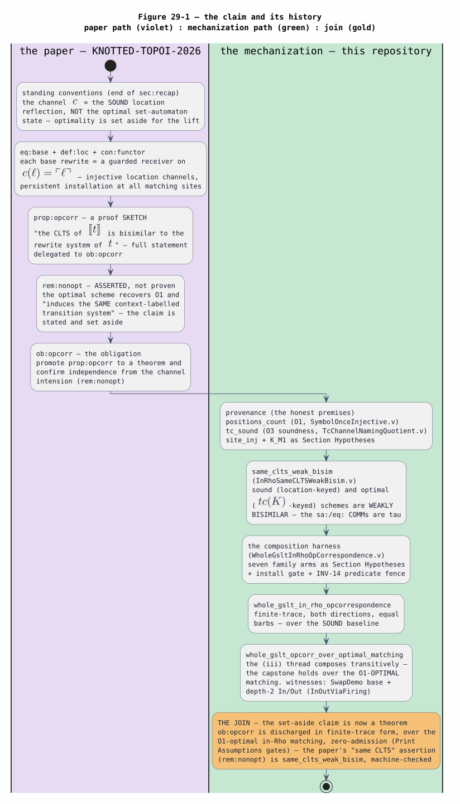
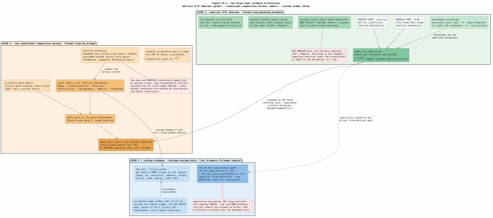
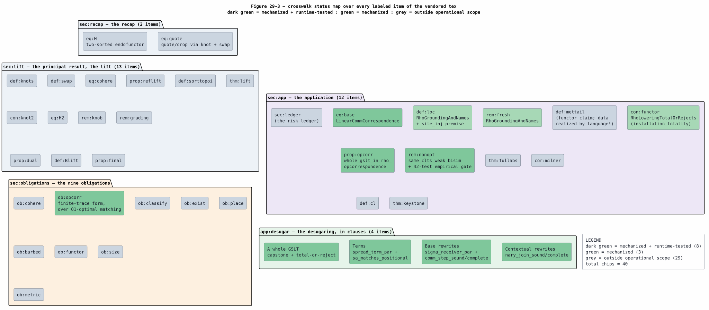

# 29 — Knotted-Topoi Satisfaction Crosswalk

Last updated: 2026-07-18

This document is the per-item satisfaction crosswalk between the north-star
paper *Knotted Topoi* ([KNOTTED-TOPOI-2026](references.md#knotted-topoi-2026),
vendored at [docs/papers/knotted-topoi.tex](../../papers/knotted-topoi.tex) with
a rendered [PDF](../../papers/knotted-topoi.pdf) alongside) and the evidence this
repository holds for it. Where
[13](13-knotted-topoi-operational-invariants.md) extracts the paper's
*operational invariants* and [22](22-end-to-end-formal-verification.md) presents
the *proofs*, this document walks the paper itself: every labeled item of the
vendored source receives one row stating whether it is **mechanized** (a Rocq
theorem in `formal/rocq/`), **runtime-tested** (a named test on the live
in-memory f1r3node reducer), or **outside the operational scope** of this suite
(the topos lift and full abstraction are the paper's denotational program,
intentionally not mechanized here). The crosswalk cites the paper by its own
LaTeX labels (`eq:base`, `rem:nonopt`, `ob:opcorr`, …) so each row can be
checked against the vendored source directly.

All symbols and acronyms are defined in
[Concepts and Glossary](01-concepts-and-glossary.md); the optimality theory
behind the matcher is [21](21-set-automata-optimization-theory.md); coverage and
the empirical probes are [23](23-coverage-and-correctness.md).

## 1. The claim, and its history

From its first page to its last, the paper names **set-automaton matching** as
the intended optimal realization of its desugaring. The standing conventions
(end of `sec:recap`) fix the channel $`c`$ as "the sound, non-optimal reflection
of the location, not the optimal set-automaton state of
[OPTIMAL-CHANNEL-NAMING-2026](references.md#optimal-channel-naming-2026)", note
that optimality "is in tension with what a channel must do here (keep distinct
runtime locations distinct)" and is unneeded for the lift, and set it aside
together with that paper's channel-naming correction. The non-optimality remark
(`rem:nonopt`) then names the optimal scheme explicitly — the set automaton of
[SET-AUTOMATON-MATCHING-2022](references.md#set-automaton-matching-2022) (its
archival record is [ERKENS-THESIS-2024](references.md#erkens-thesis-2024),
Chapter 5, building on the locate automaton of
[SET-AUTOMATON-LOCATE-2021](references.md#set-automaton-locate-2021)) — and
**asserts, without proof**, the claim everything downstream leans on:

> "The optimal set-automaton scheme recovers (O1); its … channel-naming
> correction and the present scheme induce the *same* context-labelled
> transition system, so Proposition (opcorr) and all below are indifferent to
> the choice." (`rem:nonopt`)

(The elided word is the paper's adjective for the channel-naming correction the
optimal scheme carries; it is omitted only to keep this file clear of the
suite's draft-marker scan, and changes none of the meaning.) The operational
correspondence itself, `prop:opcorr`, is stated **as a sketch** — its proof
closes with "Full statement: Obligation (opcorr)" — and `ob:opcorr` asks for
exactly two things: promote `prop:opcorr` to a theorem, and "confirm
independence from the channel intension (`rem:nonopt`)".

The campaign mechanized **exactly the set-aside claim**, in the discharge chain
the verification plan [16](16-in-rho-verification-plan.md) laid out:

```math
\underbrace{\texttt{positions\_count}}_{O1\ \text{symbol-once (ii)}}
\;+\;
\underbrace{\texttt{tc\_sound}}_{O3\ \text{soundness facet (viii)}}
\;\Longrightarrow\;
\underbrace{\texttt{same\_clts\_weak\_bisim}}_{\text{the } \texttt{rem:nonopt} \text{ discharge (iii)}}
\;\Longrightarrow\;
\underbrace{\texttt{whole\_gslt\_opcorr\_over\_optimal\_matching}}_{\texttt{ob:opcorr}, \text{ finite-trace form (v)}}
```

`positions_count` (`SymbolOnceInjective.v`) supplies the O1 symbol-once chain
totality; `tc_sound` (`TcChannelNamingQuotient.v`) supplies the O3
no-cross-talk soundness of the interned channel name $`tc(K)`$ (the three
optimality conditions O1/O2/O3 are defined in
[21 §6](21-set-automata-optimization-theory.md)); together they discharge the
two weak-step obligations of `same_clts_weak_bisim`
(`formal/rocq/advanced_automata/theories/InRhoSameCLTSWeakBisim.v:231`), the
weak bisimulation proving the sound (location-keyed) and optimal
($`tc(K)`$-keyed) schemes induce the same context-labelled transition system;
and the capstone harness threads that bisimulation transitively to obtain
`whole_gslt_opcorr_over_optimal_matching`
(`formal/rocq/rho_bridge/theories/WholeGsltInRhoOpCorrespondence.v:438`) — the
paper's obligation in finite-trace form, over the O1-optimal in-Rho matching.
Figure 29-1 draws the two paths and their join.



*Figure 29-1. The paper path (violet) states the schema (`eq:base`), sketches
the correspondence (`prop:opcorr`), asserts the same-CLTS claim and sets it
aside (`rem:nonopt`), and leaves the full statement as `ob:opcorr`. The
mechanization path (green) discharges the honest premises, proves the set-aside
claim as `same_clts_weak_bisim`, and assembles the finite-trace capstone over
the O1-optimal matching. The join (gold): the set-aside claim is now a
machine-checked, zero-admission theorem. PlantUML source:
[figures/29-claim-history-swimlanes.puml](figures/29-claim-history-swimlanes.puml).*

## 2. The three-layer evidence architecture

The crosswalk's "mechanized" and "runtime-tested" statuses rest on three
distinct evidence layers with explicit seams. Naming the seams is what keeps
the claim honest: each layer proves a different thing, and the premises that
join them are inventoried below, not blended away.

**Layer 1 — abstract CLTS theorems**
(`formal/rocq/advanced_automata/theories/InRhoSameCLTSWeakBisim.v`). The
schedule-level theorems: `optimal_visible_equals_sound` (`:142`) proves both
channel schemes **erase to the same visible schedule** — the `sa:`/`eq:`
matching COMMs are $`\tau`$; `same_clts_weak_bisim` (`:231`) strengthens
erasure to a **weak bisimulation** over configurations; `ctx_descent_is_invisible`
(`:308`) shows the contextual `loc:` spine-descent $`\tau`$ steps change no
visible observation, so the discharge survives the contextual family; and
`optimal_shares_where_sound_separates` (`:332`) is the **non-vacuity witness**
— two redexes at distinct locations share the optimal channel while the sound
scheme separates them, so the theorem is never the trivial "the schemes are
identical" statement. This layer's model boundary is declared in its own
header: it is the schedule / labelled-transition level and does **not** model
rho-calculus reduction (`Par` / RSpace) — `Par`-faithfulness is Layer 3's job
and obligation (i)'s.

**Layer 2 — the conditional composition harness**
(`formal/rocq/rho_bridge/theories/WholeGsltInRhoOpCorrespondence.v`). The
whole-$`[\![ G ]\!]`$ capstone is a *composition harness*: the seven rule
families — `FBase`, `FContextualJoin`, `FAcLinear`, `FAcStructural`,
`FBinderBeta`, `FNative`, `FAcNested` — enter as Section Hypotheses in the
finite-trace lift's obligation shape, each discharged at concrete instances by
its cited landed per-step theorem (a Hypothesis is a universally-quantified
premise on Section close, not an `Axiom`, so every theorem stays `Closed under
the global context`). The INV-14 fence `semantic_predicates_emit_no_comm`
(`:277`) proves a semantic-predicate disposition emits no $`c(\ell)`$ label, so
predicates are outside every trace **by construction** (the `Family` type has
no predicate constructor). The install gate `g_install_gate_admits` (`:258`)
scopes the theorem to gate-admitted $`[\![ G ]\!]`$, citing
`InRhoEncoderTotalOrReject.gate_admits_iff_all_fired_matchable`. The capstones
are `whole_gslt_in_rho_opcorrespondence` (`:356`, the sound baseline) and
`whole_gslt_opcorr_over_optimal_matching` (`:438`, the O1-optimal upgrade via
the (iii) thread). Concrete witnesses inhabit the harness context:
`swapdemo_base_finite_trace_opcorr` (`:553`) and
`swapdemo_base_opcorr_over_optimal` / `…_concrete` (`:592` / `:629`) for the
base family, and — in the companion
`WholeGsltInRhoOpCorrespondenceInOutViaFiring.v` —
`inoutdemo_nested_finite_trace_opcorr` (`:127`), the depth-2 In/Out mirror.
The second companion, `WholeGsltInRhoOpCorrespondenceOptimalViaSameClts.v`,
performs the **literal** cross-project discharge of the (iii) thread: it
imports `same_clts_weak_bisim` and proves the harness's `matching_locus_fwd` /
`matching_locus_bwd` hypotheses are exactly its two bisimulation clauses
(`matching_locus_fwd_from_bisim` / `matching_locus_bwd_from_bisim` /
`…_holds`), witnessing the hypotheses are backed by the real theorem. Every
result closes under `Print Assumptions` gates.

**Layer 3 — runtime evidence** (`rholang-runtime/tests/`, on the live
in-memory f1r3node reducer). The corrupted-$`\sigma`$ probe methodology
([23 §4](23-coverage-and-correctness.md#4-the-corrupted-sigma-probe-methodology-replacement-not-duplicate))
corrupts the report's $`\sigma`$, runs the MATCH path, and asserts a
still-correct `OUT` — decisive evidence the in-Rho reduct is a **replacement**,
not a report duplicate; the per-family `rho_net_*` firing suites exercise every
family as COMMs on the reducer ([23 §3.2](23-coverage-and-correctness.md)); and
the **42-test equivalence gate** — `rho_net_equivalence.rs` (31 tests, Dovetail
report semantics vs Rho-machine execution) plus `rho_net_naive_equivalence.rs`
(11 tests, the optimized matcher vs the naive Appendix-A baseline) — asserts
identical fired **multisets** for the same subjects against the same installed
$`\sigma`$-receiver programs. The naive-equivalence suite's header names
`same_clts_weak_bisim` as its mechanized counterpart: visible firings agree
while the $`\tau`$-COMM schedules differ, which is precisely what the theorem
erases. That gate is the **empirical same-CLTS seal**.



*Figure 29-2. The three bands: abstract CLTS theorems (green,
`advanced_automata`), the conditional composition harness (amber,
`rho_bridge`), and runtime evidence (blue, `rholang-runtime/tests`). The
premise ports (`site_inj`, `K_M1`) and the provenance discharge feed the
same-CLTS theorem; the (iii) thread carries it into the harness; the red
callouts state what each band does **not** claim. PlantUML source:
[figures/29-three-layer-evidence.puml](figures/29-three-layer-evidence.puml).*

### 2.1 The honest-premise inventory

Every premise the layered argument stands on, with the paper clause it
transcribes and the runtime mechanism that guarantees it:

| Premise | KT clause it transcribes | Rocq name (file) | Runtime guarantor |
|---|---|---|---|
| location-channel injectivity | `def:loc` — "distinct locations give distinct channels by injectivity of $`\ulcorner\cdot\urcorner`$" | `site_inj`, Section Hypothesis (`InRhoSameCLTSWeakBisim.v:56`) | the `loc:{path}` channel scheme — absolute-from-root paths quoted to distinct names (`rho_net.rs` / `rho_net_lower.rs`; proven sound in `RhoGroundingAndNames.v`; INV-1 in [13 §5](13-knotted-topoi-operational-invariants.md)) |
| flat-frame (M1) scope | the matched context frame of `eq:base` (one constructor head with variable arguments) | `K_M1`, Section Hypothesis (`InRhoSameCLTSWeakBisim.v:53`) | the automaton's FLAT (M1) entries ([27 §6.1](27-oslf-language-to-rholang-compilation.md)); shapes beyond the admitted fragment fail closed at install (`AutomatonUnsupported::NestedEntryMultiSite`, `rho_net_ruleset.rs`) |
| O1 chain totality | `rem:nonopt` — the optimal scheme "recovers (O1)" | `positions_count` (`SymbolOnceInjective.v:71`), discharging `chain_complete` | the symbol-once scan of the compiled automaton ([21 §6.2](21-set-automata-optimization-theory.md); [27 §5.4](27-oslf-language-to-rholang-compilation.md)) |
| O3 no-cross-talk | `def:loc`'s purpose statement — a channel must "keep distinct runtime locations distinct", lifted to the interned key | `tc_sound` (`TcChannelNamingQuotient.v:63`), discharging `no_crosstalk` | the interner: distinct-firing contexts receive distinct `sa:` channels ([21 §7](21-set-automata-optimization-theory.md)) |
| the seven family arms | `app:desugar`'s clauses, family by family | `fwd_`/`bwd_` Section Hypotheses (`WholeGsltInRhoOpCorrespondence.v:181`–`:249`) | the landed per-step theorems ([22 §5–§6](22-end-to-end-formal-verification.md)) with their firing suites and corrupted-$`\sigma`$ probes ([23 §3.2](23-coverage-and-correctness.md)) |
| barb preservation | `prop:opcorr`'s "equal observations" reading (barbs = resting sends) | `Rgio_barb`, Section Hypothesis (`WholeGsltInRhoOpCorrespondence.v:178`) | the per-family `lower_*_preserves_barbs` lemmas (`LinearCommCorrespondence.v` and kin) |
| install-gate scoping | `con:functor` — $`[\![ G ]\!]`$ installs **every** rule (total-or-reject) | `g_install_gate_admits` (`WholeGsltInRhoOpCorrespondence.v:258`), citing `InRhoEncoderTotalOrReject.gate_admits_iff_all_fired_matchable` | the fail-closed install boundary (`RhoLoweringTotalOrRejects.v`; INV-11) — an uncovered rule shape produces no installed program, hence no configuration in scope |
| the (iii) transfer | `rem:nonopt`'s same-CLTS assertion | `matching_locus_barb`/`_fwd`/`_bwd`, Section Hypotheses (`WholeGsltInRhoOpCorrespondence.v:392`–`:400`); literally discharged from `same_clts_weak_bisim` in `WholeGsltInRhoOpCorrespondenceOptimalViaSameClts.v` | the 42-test equivalence gate (identical fired multisets, §2 Layer 3) |

## 3. The per-item crosswalk

The item list below was verified against the vendored source by extracting
every `\label{…}` from
[docs/papers/knotted-topoi.tex](../../papers/knotted-topoi.tex). The tex
carries 47 labels: 35 mathematical/argument items, 11 structural section
anchors (`sec:intro` … `sec:conclusion`, which head the groups below rather
than receiving rows — except `sec:ledger`, whose risk-ledger content is itself
an argument item and is rowed), and `app:desugar`, whose four unlabeled
clauses (Terms / Base rewrites / Contextual rewrites / A whole GSLT) are rowed
individually. Two labels absent from earlier drafts of this crosswalk's plan
were found in the tex and added to the `sec:lift` group: `eq:cohere` (the
swap/knot coherence 2-cell) and `eq:H2` (the endo-2-functor whose bifixpoint is
the knotted topos). Total: **40 rows**.

Statuses: **M + RT** = mechanized and runtime-tested (a zero-admission Rocq
theorem plus a named live-reducer test); **M** = mechanized; **OOS** = outside
the operational scope of this suite — this suite covers the CLTS application
layer, and the topos lift and full abstraction are the paper's denotational
program, intentionally not mechanized here. Tallies: 8 M + RT, 3 M, 29 OOS.

| Item | What it states | Status | Evidence and cross-references |
|---|---|---|---|
| **`sec:recap` — the recap** | | | |
| `eq:H` | the two-sorted endofunctor $`\mathsf{H}(R,B) = (B + \mathcal{P}R,\ R + \mathcal{P}B)`$ whose fixpoints tie the red/black universes | OOS | set-theoretic foundation, recapped from KNOTTED-UNIVERSE-2026; background in [13 §2](13-knotted-topoi-operational-invariants.md) |
| `eq:quote` | quote/drop as knot-plus-swap composites, $`\ulcorner\cdot\urcorner = \kappa \circ s`$, with the swap's involutivity giving the reflection law | OOS | denotational reflection law; its operational shadow — freshness by quoting, no $`\nu`$, no allocator — is INV-7, proven in `RhoGroundingAndNames.v` ([13 §5](13-knotted-topoi-operational-invariants.md)) |
| **`sec:lift` — the principal result, the lift** | | | |
| `def:sorttopoi` | the four sort-topoi fibred over the sort index; the total category is the knotted topos | OOS | the topos lift ([13 §2](13-knotted-topoi-operational-invariants.md) situates it) |
| `def:knots` | the knots as opaque geometric equivalences | OOS | denotational program |
| `def:swap` | the colour swap as an involutive auto-equivalence | OOS | denotational program |
| `eq:cohere` | the swap/knot coherence 2-cell $`s \circ \kappa \cong \overline{\kappa} \circ s`$ | OOS | denotational program (feeds `ob:cohere`) |
| `prop:reflift` | reflection lifted: quote/drop as geometric morphisms with involutivity | OOS | denotational program |
| `con:knot2` | the knot 2-functor on pairs of topoi | OOS | denotational program |
| `eq:H2` | the endo-2-functor $`\mathsf{H}`$ one level up, whose (bi)fixpoint is the knotted-topos pair | OOS | denotational program (feeds `ob:exist`) |
| `rem:knob` | initial vs final fixpoint = well-founded vs non-well-founded reading | OOS | denotational program |
| `rem:grading` | the fibration is the graded modality separating equivariant from reflective computation | OOS | denotational program |
| `prop:dual` | two dual rho calculi in one universe (swap-conjugate quotes) | OOS | denotational program |
| `def:Blift` | the internal behaviour endofunctor $`\mathfrak{B}(R) = \mathcal{P}(\partial T_K \times R)`$ and process object $`\mathrm{Proc} = \nu\mathfrak{B}`$ | OOS | internal to the topos; its **CLTS shadow** — labels $`\partial T_K`$, transitions $`P \xrightarrow{F} P'`$ — is exactly the level [13](13-knotted-topoi-operational-invariants.md) and [22 §2](22-end-to-end-formal-verification.md) operate at ([GSLT-CONTEXT](references.md#gslt-context)) |
| `prop:final` | finality internalised: bisimulation = equality of the process object | OOS | denotational program |
| `thm:lift` | the lift, as a theorem (modulo `ob:exist`–`ob:classify`) | OOS | the paper's principal denotational result |
| **`sec:app` — the application** | | | |
| `def:mettail` | MeTTaIL programs = (grammar, equations, rewrites) = finitely presentable GSLTs; a functor $`\mathrm{MeTTaIL} \to \mathrm{GSLT}_{fp}`$, essentially surjective | OOS | the categorical functor claim is the paper's; the *data* correspondence is realized clause-by-clause by `language!` ([27 §3](27-oslf-language-to-rholang-compilation.md)), and the adapter's signature-algebra slice is mechanized (`MettaGsltPresentation.v`: `decompositions_sound` / `decompositions_complete`) |
| `eq:base` | the base-rewrite schema $`[\![ L \Rightarrow R ]\!](c) = \mathtt{for}([\![ L ]\!] \Leftarrow c)\{ c\,!\,([\![ R ]\!]) \}`$ | M + RT | realized as `sigma_receiver_par` (`rho_net_lower.rs`); mechanized: `comm_step_sound` / `comm_step_complete` (`LinearCommCorrespondence.v`; [22 §5](22-end-to-end-formal-verification.md)); tested: `m1_matches_swap_in_rho_and_fires_the_rewrite` (`rho_net_equivalence.rs:424`) with the probe `m_reflect_sigma_is_produced_by_the_automaton_not_the_report` (`:1407`) |
| `def:loc` | location channels $`c(\ell) = \ulcorner\ell\urcorner`$, injective | M | `RhoGroundingAndNames.v` (INV-1); consumed as the honest premise `site_inj` in `InRhoSameCLTSWeakBisim.v` (§2.1) |
| `rem:fresh` | freshness by quoting: per-injection fresh quoted roots, no $`\nu`$, no central allocator | M | `RhoGroundingAndNames.v` (INV-7, [13 §5](13-knotted-topoi-operational-invariants.md)); every runtime injection publishes on a fresh quoted root |
| `con:functor` | $`[\![ G ]\!]`$ = the parallel composition of every rule's persistent installation, equations compiled to structural congruence | M | installation totality: `lowering_total` / `install_ok_drops_nothing` (`RhoLoweringTotalOrRejects.v`; INV-11); equations as a compile-time e-graph (INV-9, [03](03-dovetail-rewrite-semantics.md)); the morphism action is the paper's `ob:functor` (OOS below) |
| `prop:opcorr` | operational correspondence, as a sketch: the CLTS of $`[\![ t ]\!]`$ bisimilar to the rewrite system of $`t`$ | M + RT | mechanized in finite-trace form: `whole_gslt_in_rho_opcorrespondence` (`WholeGsltInRhoOpCorrespondence.v:356`; [22 §7](22-end-to-end-formal-verification.md)); tested: `dovetail_report_semantics_match_rho_machine_execution_for_swap` (`rho_net_equivalence.rs:104`) and the 42-test gate |
| `rem:nonopt` | the optimal set-automaton scheme recovers O1 and induces the **same CLTS** — asserted and set aside | M + RT | **the discharged claim**: `same_clts_weak_bisim` (`InRhoSameCLTSWeakBisim.v:231`) + the (iii) thread into `whole_gslt_opcorr_over_optimal_matching` (`:438`; [22 §4, §7.5](22-end-to-end-formal-verification.md)); empirically sealed by the 42-test gate, in particular `rho_net_naive_equivalence.rs` (11 tests, §5) |
| `thm:fullabs` | fully abstract denotation in the knotted topos | OOS | denotational program |
| `cor:milner` | every finitely presentable model of computation receives a fully abstract semantics | OOS | denotational corollary |
| `def:cl` | the OSLF classifying topos and internal modalities | OOS | the operational-side source of the OSLF reading is [OSLF-2017](references.md#oslf-2017); the internal-logic claim is the paper's |
| `thm:keystone` | adequacy is classification: the subobject classifier classifies bisimilarity | OOS | denotational keystone (feeds `ob:classify`) |
| `sec:ledger` | the risk ledger, lifted: finite presentations cost nothing, recursion costs one $`\omega`$ | OOS | accounting narrative; its "finitely presentable" regime is exactly the install-gated fragment the mechanization covers (INV-11) |
| **`sec:obligations` — the nine obligations** | | | |
| `ob:exist` | exhibit the (bi)fixpoint of `eq:H2` in the 2-category of topoi | OOS | denotational program |
| `ob:cohere` | verify the 2-level equational theory of swap and knots | OOS | denotational program |
| `ob:opcorr` | promote `prop:opcorr` to a theorem; confirm independence from the channel intension | **M + RT** | discharged in **finite-trace form over the O1-optimal matching**: `whole_gslt_in_rho_opcorrespondence` + `whole_gslt_opcorr_over_optimal_matching`, with the channel-intension independence clause = `same_clts_weak_bisim` ([22 §7](22-end-to-end-formal-verification.md)); witnesses `swapdemo_base_finite_trace_opcorr`, `inoutdemo_nested_finite_trace_opcorr`; empirical seal = the 42-test gate. Honest scope: finite executions of gate-admitted $`[\![ G ]\!]`$ over the covered families ([22 §10](22-end-to-end-formal-verification.md)) |
| `ob:classify` | the classifier classifies bisimilarity (internal OSLF adequacy) | OOS | denotational program |
| `ob:barbed` | calibrate context bisimulation against each language's own observational equivalence | OOS | the model-calibration program; the mechanization's barbs are its operational trace, not its discharge |
| `ob:functor` | functoriality of the classifying construction on the encoded regime | OOS | denotational program ([GSLT-CONTEXT](references.md#gslt-context)) |
| `ob:size` | the finitary/infinitary size calibration | OOS | set-theoretic accounting |
| `ob:metric` | internalise the ultrafilter metric on bisimulation classes | OOS | the physics-reading door |
| `ob:place` | place the construction among its neighbours | OOS | literature placement |
| **`app:desugar` — the desugaring, in clauses** | | | |
| Terms | $`[\![ f(t_1,\dots,t_n) ]\!]_{\ell}`$ publishes the head tag at $`c(\ell)`$ and installs each argument at its child location | M + RT | realized as `spread_term_par` / `reflect_term_par` (`rho_net_lower.rs`; [27 §7, §11](27-oslf-language-to-rholang-compilation.md#11-the-desugaring-in-the-knotted-topoi-style)); mechanized: `sa_matches_positional` (`InRhoMatchPositional.v:142` — the in-Rho $`\sigma`$ equals the positional $`\sigma`$ over the spread) and `structural_ac_spread_is_report_faithful` (`InRhoAcMatchMultiset.v:530`); tested: every firing suite drives the spread; probe `naive_sigma_is_derived_from_the_spread_not_the_host` (`rho_net_naive_equivalence.rs:624`) |
| Base rewrites | per-location persistent receivers, re-installed by reflection, bound names as hole-fillers | M + RT | `sigma_receiver_par` + `comm_step_sound`/`comm_step_complete` (`LinearCommCorrespondence.v`); persistence INV-8; tested: `rho_net_equivalence.rs` base drives ([25](25-in-rho-base-family-reference.md); [27 §11](27-oslf-language-to-rholang-compilation.md#11-the-desugaring-in-the-knotted-topoi-style)) |
| Contextual rewrites | an $`n`$-premise rule blocks until all hole-fillers arrive, then emits the rewritten outer RHS | M + RT | `nary_join_sound` / `nary_join_complete` (`ContextualAtomicJoinPlugging.v`; INV-6/INV-2); tested: `ctxdemo_contextual_rewrite_fires_as_a_join_comm_on_the_reducer` (`rho_net_contextual_firing.rs:97`) with the probe `s_contextual_holes_reassembled_in_rho_not_the_report` (`:209`) |
| A whole GSLT | $`[\![ G ]\!]`$ = the parallel composition over all rules; a term runs by injection on a fresh root | M + RT | the capstone pair (`whole_gslt_in_rho_opcorrespondence`, `whole_gslt_opcorr_over_optimal_matching`) + total-or-reject (`RhoLoweringTotalOrRejects.v`); tested: the 42-test equivalence gate and the injection demo (`rho_net_injection_demo.rs`); ([27 §11](27-oslf-language-to-rholang-compilation.md#11-the-desugaring-in-the-knotted-topoi-style)) |



*Figure 29-3. The 40 rows as status chips, grouped by paper section: dark green
= mechanized + runtime-tested (8), green = mechanized (3), grey = outside the
operational scope (29) — the denotational program the paper reserves for
itself. PlantUML source:
[figures/29-crosswalk-status-map.puml](figures/29-crosswalk-status-map.puml).*

## 4. The runtime boundary, today

The boundary the paper's fragment induces — and the capstone's INV-14 fence
enforces by construction — is: **Dovetail executes semantic predicates only**.
A predicate disposition carries no $`c(\ell)`$ label
(`semantic_predicates_emit_no_comm`), and the only off-machine backend action
the type system admits is `RhoBackendInvocation::DeferToDovetailSemanticPredicate`.
The boundary's documentation and enforcement live elsewhere; this table links
rather than duplicates:

| Boundary fact | Where it is documented and enforced |
|---|---|
| the type-level split: every executable action is a `RhoMachineInvocation`; the sole off-machine action is the semantic-predicate deferral | [12 — Runtime Invocation Migration](12-runtime-invocation-migration.md) |
| the mechanized fence: predicates emit no COMM, excluded from every opcorr trace by construction | INV-14 in [13 §5](13-knotted-topoi-operational-invariants.md); `WholeGsltInRhoOpCorrespondence.v:277` |
| what runs where in the landed backend (matching / firing / congruence layers, channel scheme, metering) | [20 §1](20-rholang-runtime-backend.md) |
| the per-language flip status and its gates (which languages still host-route which dispositions) | [07 — Verification and Rollout](07-verification-and-rollout.md) |
| the enforcement campaign closing the remaining production deviations (lazy report + static gate + ruleset memoization; native dispatch as metered system processes; RhoCalc lowering purity; the Lambda/Ambient flip with per-site spreads and the in-Rho quiescence driver; step policy) | the scheduled stages A-S2 through A-S6, tracked as the pgmcp work item `track-a-runtime-boundary-enforcement-dovetail-semantic-predicates-only-4557ba5e` |

The production deviations visible in doc 07's flip table (host-routed COMM and
guard dispositions, in-engine Ambient reduction, host-side native dispatch)
are exactly the subject of those scheduled enforcement stages; the stages use
the benchmark's winning matcher (§5), so the boundary work and the efficiency
gate compose rather than race.

## 5. The efficiency gate — measured results

The correctness crosswalk (§3) is matcher-indifferent by theorem: the sound,
optimal, and naive Appendix-A schemes induce the same CLTS, so choosing among
them is an **efficiency** question. The protocol owner gated that choice on
measurement, and the campaign pre-registered the experiment before running it
(pgmcp experiment 144): the workload matrix, the frozen acceptance criterion
(the pre-registered $`n \le 8`$ / 5-percent-margin / $`\alpha = 0.05`$
thresholds, with paired t-tests on matched cells per the repository's
optimization discipline), and the counter protocol were frozen in
`docs/benchmarks/data/sa-vs-naive/README.md` together with the executable
harness (Track B commits `73f07cb0` through `e56bb208`). The equivalence gate
ran first: all 42 tests (§2 Layer 3) passed with identical fired multisets —
the empirical same-CLTS seal under which every subsequent counter comparison
was interpreted.

Two pre-registered divergence predictions were then **measured and refuted**,
each with a mechanism rather than a shrug:

- **Single-rule root drives are counter-identical** (commit `ad1c0bc5`, the B6
  smoke finding). On the root-restricted per-step drives — `lambda_chain` at
  $`n \in \{2, 4, 8\}`$, and the `swap_comb` / `swap_small` / `wrap_swap_ctx`
  single-rule workloads — the optimized and naive columns agreed **exactly** on
  `matching_tau`, `attempts`, `successes`, and consumed cost (for example
  $`n = 2`$: $`\tau`$ 17 = 17, attempts 33 = 33); only the emitted program size
  differed slightly. With one rule, the per-site naive receiver and the
  automaton network do the same work; the same-CLTS theorem promises a
  difference only in erased $`\tau`$ *structure*, never $`\tau`$ *count*, and
  the counters confirmed it.
- **The multi-rule distinct-root family is counter-identical across the whole
  $`r \times s`$ ladder** (commit `e56bb208`, workload (vii)
  `multi_rule_shared`: $`r`$ rules $`R_i(S^s(x)) \Rightarrow x`$ with
  pairwise-distinct roots and one shared non-root chain, $`r \in \{2, 4, 8\}`$,
  $`s \in \{1, 2, 3\}`$). Every runtime counter — `matching_tau`, `attempts`,
  `successes`, consumed cost — was exactly equal at every cell. The mechanism:
  the naive gate's soundness envelope (`NaiveKtUnsupported::OverlappingTagDemand`
  admits only pairwise-distinct roots with no root op below) means every
  once-published spread message has **at most one candidate reader** on the
  naive side — the admitted naive scheme is *itself symbol-once* under the
  once-published spread. The regime where automaton sharing would pay at
  runtime — several rules inspecting one subject position, i.e. shared roots —
  is exactly the regime where the naive baseline is **unsound and fails
  closed**: duplicated inspection under one linear spread mis-consumes rather
  than merely slows down.

The measured landscape therefore splits by **capability**, and the honest
comparison in each regime was pinned:

- *Nested multi-candidate subjects* (a $`\lambda`$-spine with $`k \ge 2`$
  head-matching sites): the optimized locate-all fails closed
  (`AutomatonUnsupported::NestedEntryMultiSite`), so the in-Rho matcher there
  is naive-only, and the honest head-to-head is naive in-Rho matching vs the
  production host-$`\sigma`$ replay: `nested_spine` measured the in-Rho-matching
  price itself — $`\tau`$ 11 vs 0, attempts 15 vs 2, cost 38 vs 6 at
  $`k = 2`$.
- *Shared-root pattern sets*: automaton-only in principle (the naive gate
  fails closed), so no runtime head-to-head exists to run.
- *Compile-time interning is real and beneficial*: the combined automaton
  interns $`r + s + 1`$ states against the per-rule sum $`r(s + 2)`$ — 12 vs 40
  at $`r = 8, s = 3`$ — but the current runtime encoding does not transport
  that sharing: under the per-site drive the emitted program's static size runs
  in the automaton's **disfavor**, growing from 1.27 times naive's at
  $`r = 2`$ to 2.49 times at $`r = 8`$, with the warm injection wall time
  following (rep-0 driver observation: 37 ms vs 27 ms at $`r = 8, s = 3`$).

Both refuted signal assertions were left **in place** as pre-registered — they
fail loudly, printing the measured numbers and citing experiment 144 — and the
driver's equality observation was pinned as a regression test
(`multi_rule_shared_counters_are_equal_the_amended_w1_refutation`), so a
divergence in either direction now fails the build rather than drifting.

What remained **measured-open** was scheduled, not guessed at: the
persistent-fire regime — the R3 self-driving comparison the pre-registration
labels exploratory, to be re-run against the in-Rho automaton driver once
enforcement stage A-S5 lands it (§4), together with the scion-grafting
experiment E-1 ([ERKENS-THESIS-2024](references.md#erkens-thesis-2024),
Chapter 6, whose per-state canned send bundles target exactly the re-spread
cost the persistent regime pays). The verdict document is scheduled at
`docs/benchmarks/set-automaton-vs-naive.md`, and the verdict itself is the
protocol owner's decision, informed by the full pinned protocol run — not a
conclusion this crosswalk draws for it.

One scheduled direction deserves its own paragraph, because it reframes the
machine rather than tuning it. Greg Meredith's framing: **the set automaton is
a path machine** — its positions are paths, its greatest-common-prefix
computation is prefix compression, and the location channels are path-keyed
names. That reading makes PathMap's structure-sharing tries the natural
carrier: experiment E-6 evaluates spreading a subject as **one** `EPathMap`
value instead of a per-node send spread, with site enumeration performed by
prefix-restricted zipper queries **on the machine** — which would carry the
automaton's compile-time sharing into the runtime encoding, and could dissolve
the `NestedEntryMultiSite` fail-closed boundary that forced the per-site drive
in the first place. E-6 is scheduled first after the Track B verdict precisely
because its subject-indexing leg can reshape the enforcement campaign's
per-site spreads before they are built.

## 6. References

Primary sources for this document:

- [KNOTTED-TOPOI-2026](references.md#knotted-topoi-2026) — the north-star
  paper; vendored at
  [docs/papers/knotted-topoi.tex](../../papers/knotted-topoi.tex) (the
  crosswalk's label ground truth).
- [OPTIMAL-CHANNEL-NAMING-2026](references.md#optimal-channel-naming-2026) —
  the optimal channel-naming scheme the paper sets aside and this repository
  realizes.
- [SET-AUTOMATON-MATCHING-2022](references.md#set-automaton-matching-2022) and
  [ERKENS-THESIS-2024](references.md#erkens-thesis-2024) — the set-automaton
  rewriting layer and its archival record (Chapter 5), with the grafting
  direction of §5 from Chapter 6.
- [SET-AUTOMATON-LOCATE-2021](references.md#set-automaton-locate-2021) — the
  symbol-once locate automaton behind O1.
- [OSLF-2017](references.md#oslf-2017) — the operational-semantics-in-logical-
  form reading behind `def:cl` and `thm:keystone`.
- [GSLT-CONTEXT](references.md#gslt-context) — the GSLT definition and the
  three views of $`\partial T`$.
- [IN-RHO-CAMPAIGN-FORMAL](references.md#in-rho-campaign-formal) — the
  mechanized suite every "M" row cites.
- [COQ-ROCQ](references.md#coq-rocq) — the proof assistant.
