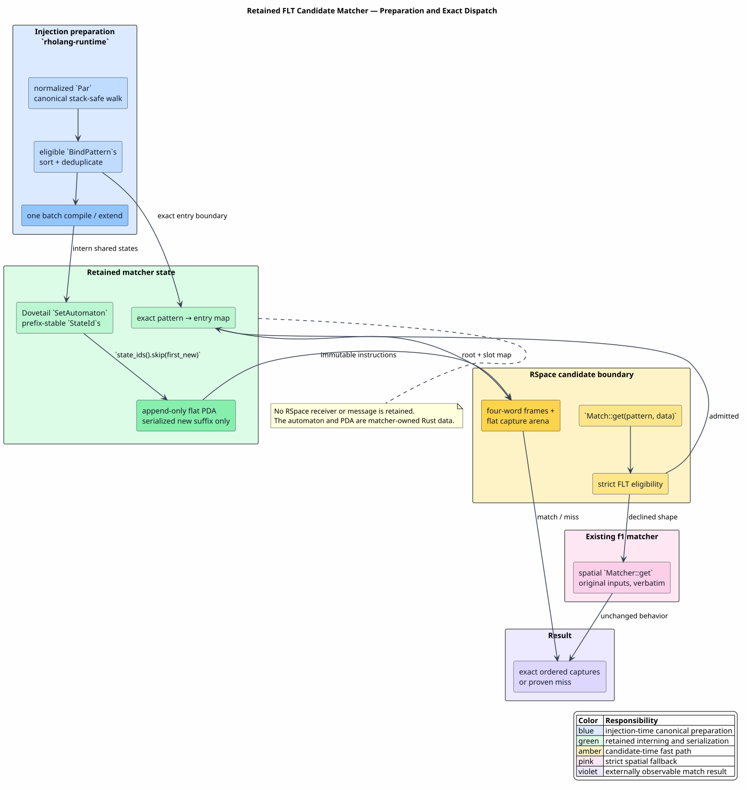

# 30 — Retained Foreign Language Term Candidate Matching

> **Status: landed and equivalence-gated.** The RSpace matcher retains one
> Dovetail positional set automaton, compiles its canonical state suffix into a
> flat pushdown automaton (PDA), and delegates every unsupported receive shape
> to f1r3node's spatial matcher unchanged. It neither installs a persistent
> inspection receiver nor changes RSpace candidate selection.

## 1. Terms and ownership boundary

A **Foreign Language Term (FLT)** is a value from a MeTTaIL-defined language
reflected into `rhoapi::Par`. A constructor is an `EList` whose first element is
an exact `GPrivate.id` tag and whose remaining elements are reflected children.
An FLT receive pattern has the same representation, with selected children
replaced by Rholang free variables or wildcards.

A **candidate match** is RSpace's question: does one stored `BindPattern` match
one candidate `ListParWithRandom`, and if so, which ordered values does it bind?
The existing `Match::get` trait is the authoritative boundary for that question.
`SubstrateGuardMatcher` implements it and owns the retained FLT accelerator.

A **retained automaton** is a `SetAutomaton<ReflectedOp>` whose structural
interner survives successive candidate matches. Equal subpatterns share one
canonical `StateId`; extending the pattern set appends only genuinely new
states. A **matcher-owned PDA** is the compact iterative program serialized from
those states. It is ordinary Rust data inside the matcher, not an RSpace
receiver network.

Figure 30-1 shows both the injection-time preparation path and the candidate-time
decision path.



*Figure 30-1. Normalized programs register eligible receives in one canonical
batch. Candidate matching uses the retained flat PDA; a strict eligibility
failure delegates the original pattern and data to the spatial matcher. Source:
[figures/30-retained-flt-candidate-matcher.puml](figures/30-retained-flt-candidate-matcher.puml).*

## 2. Why the matcher boundary is the correct seam

An earlier Track B sketch proposed incrementally installing persistent
`sa:{stateid}` inspection receivers. That design is invalid for RSpace receive
matching. A spread subject is linear data, and a receive is single-shot with
respect to that data. Multiple persistent inspectors can race to consume the
same message; a failed speculative inspection can also disturb the atomicity
expected from a rejected receive. The proposal is therefore superseded.

This correction does not remove the established in-Rho rewrite machinery.
The production rewrite path described in [17](17-stage-3-production-wiring.md)
installs persistent $`\sigma`$-receivers and composes a **single-shot** `sa:`
inspection network with each subject under a fresh site nonce. FLT candidate
matching has a different owner: RSpace already invokes `Match::get`, so the
accelerator can answer there without adding messages, receivers, channels, or
candidate-selection races.

## 3. Exact eligibility partition

The converter admits only shapes for which the flat PDA has the same semantics
as the spatial matcher. All other shapes take the existing implementation
verbatim.

| Pattern property | Retained PDA | Reason |
|---|---:|---|
| one reflected positional `EList` message | yes | fixed ordered arity and exact constructor tag |
| exact private-name leaf | yes | compares the existing byte array directly |
| each free-variable level occurs once | yes | Dovetail entry slots preserve ordered captures |
| wildcard child | yes | zero-slot match-any state; unlike a free variable, it may match an open target |
| remainder or multiple message patterns | no | RSpace's spatial envelope owns polyadic/remainder behavior |
| associative-commutative or native collection | no | positional state transitions cannot represent unordered rest complements |
| mixed or malformed FLT fingerprints | no | prevents cross-language constructor confusion |
| ordinary Rholang structure | no | it is not an FLT and retains the established matcher |

Declining is not a negative match. `FltMatchDecision::Declined` calls
`Matcher::get(pattern, data)` with the original values; `Miss` is returned only
when an admitted PDA execution proves that the reflected structure differs.

## 4. Retention and deterministic serialization

Before normalized `Par` injection, `prepare_flt_patterns` walks the program with
the canonical stack-safe `Par` visitor, extracts eligible bind patterns, sorts
them by exact model ordering, and removes duplicates. All new patterns enter
`SetAutomaton::compile_structural` or `SetAutomaton::extend` as one batch.

The Dovetail interner assigns dense, prefix-stable `StateId`s. The serializer
starts at the current program length and reads `state_ids().skip(first_new)`, so
the work for an extension is proportional to the new suffix rather than the
complete retained automaton. Existing state indices and serialized instructions
never move. Source-text evaluation, whose normalized `Par` remains internal to
f1r3node, uses the same converter through a defensive lazy-registration path.

`layout_fingerprint` covers exact lookup order, state instructions, slot
renamings, and entry boundaries. It exists only for deterministic tests and
diagnostics; it is not serialized into blocks and is not a consensus value.

## 5. Flat execution algorithm

The generated program contains variable states and application states. Each
application stores an exact reflected operator, child-state invocations, and a
dense local slot count. The executor uses one continuation vector and one flat
slot arena. It performs no per-node hashing, reference-count allocation, or
`Par` serialization.

```text
Algorithm RetainedFltMatch(program, entry, target)
  Enter the entry's root state with target.
  While a state remains to enter:
    If it is a variable, reject an open target; otherwise return that target.
    If it is an application, compare its exact operator and arity.
    For a non-nullary application:
      reserve its dense slots in the shared arena;
      push (state, target children, next child, slot base);
      enter the first child state.
    On a child return:
      copy borrowed captures through the invocation's slot renaming;
      reject inconsistent duplicate assignments;
      truncate the completed child's arena suffix;
      enter the next child, or return the completed parent slots.
  Reorder the root slots by the entry's Rholang free-variable levels.
  Clone only those final captures and preserve the candidate random state.
```

For $`v`$ visited reflected nodes, maximum target depth $`d`$, and $`b`$ bound
captures, matching takes $`O(v+b)`$ time. The continuation stack contains four
machine words per active application and the arena contains the active dense
slot interfaces; neither consumes the native call stack. Successful output owns
exactly $`b`$ cloned `Par` values. A failed operator or slot comparison exits
without constructing an output vector.

## 6. Runtime wiring

`build_runtime_with_definitions` installs one `SubstrateGuardMatcher` in RSpace
and returns a clone of the same handle to the driver. Every normalized-program
injection calls `prepare_flt_patterns` before checkpoint creation and injection.
The driver and RSpace therefore share the retained automaton, counters, and
refusal ledger; constructing an unrelated side index is impossible.

The hot path compares `GPrivate.id` byte slices and reflected-list metadata
directly. It does not protobuf-encode a pattern, hash a `Par`, materialize a
`Vec` view of a trie, or call into PathMap. The EPathMap/PathMap integration and
this FLT matcher are independent optimizations.

## 7. Correctness and resource evidence

The external suite `rholang-runtime/tests/flt_automaton_matcher.rs` treats
f1r3node's `Matcher` as an independent oracle. It covers exact matches and
misses, wildcards, repeated captures, canonical registration order, shared
state interning, suffix-only extension, every fallback class, and 128
property-generated unary pattern/target pairs. A 20,000-level pattern and target
prepare, match, compare with the oracle, and tear down on a 256 KiB Rust thread
stack.

### 7.1 Retained-match and construction measurements

The Criterion harness `rholang-runtime/benches/flt_automaton_matcher.rs`
constructs each fixture before measurement and refuses to run unless retained
and spatial results are exactly equal. The two arms therefore time the same
successful capture after pattern conversion, target reflection, automaton
construction, and oracle validation have completed. Measurements below used an
AMD Ryzen Threadripper PRO 5975WX and Rust
`1.99.0-nightly (87e5904f5 2026-07-20)`, with 20 samples, a one-second warm-up,
and a two-second requested measurement interval. The warm-cache replicate ran
inside `MemoryMax=4G`, `MemoryHigh=3G`, and `MemorySwapMax=0`; its peak was
186.9 MiB with zero swap.

| reflected depth | retained PDA median | spatial oracle median | paired speedup |
|---:|---:|---:|---:|
| 1 | 1.3811 µs | 11.461 µs | 8.30× |
| 8 | 4.5861 µs | 31.518 µs | 6.87× |
| 64 | 30.641 µs | 205.55 µs | 6.71× |
| 512 | 241.29 µs | 1.5592 ms | 6.46× |

An independent immediately preceding run produced retained/spatial medians of
1.3952/11.510 µs, 4.5801/31.759 µs, 30.638/204.23 µs, and
239.14 µs/1.5794 ms at the same depths. Thus every paired run preserves the
same ordering and the retained speedup remains between 6.46× and 8.30×. These
wall-clock values are secondary evidence because the host was not isolated or
frequency-pinned; exact result equality and deterministic structural counts are
the admission gates.

The batch-construction arm uses distinct roots with one shared eight-level
suffix. It proves that whole-program registration builds one shared automaton
rather than one automaton per receive:

| patterns | retained states | independent-state upper bound | median preparation |
|---:|---:|---:|---:|
| 1 | 11 | 11 | 15.352 µs |
| 8 | 18 | 88 | 124.78 µs |
| 64 | 74 | 704 | 1.0496 ms |
| 256 | 266 | 2,816 | 6.5323 ms |

The retained state count is exactly $`n+10`$ for this family: each new root adds
one state while all ten suffix/variable states remain shared. The 256-pattern
case therefore stores 90.6% fewer states than 256 independent automata. Initial
preparation records zero extensions and serializes exactly the automaton's state
count; later preparation serializes only the newly appended suffix.

`FltRetainedSetAutomaton.v` proves the compiled PDA equal to the recursive
specification for exact ordered captures, proves the eligibility/fallback
partition and verbatim delegation, preserves the old serialized prefix under
extension, and proves that the integration adds no persistent receiver. The
Rocq target is zero-admission: it contains no `Admitted`, new axiom, or
uninstantiated parameter.

These results establish semantic equivalence, not a new matching meaning. The
fast path changes neither candidate ordering nor COMM selection, block bytes,
term bytes, hashes, costs, event-log contents, nor settlement behavior.
