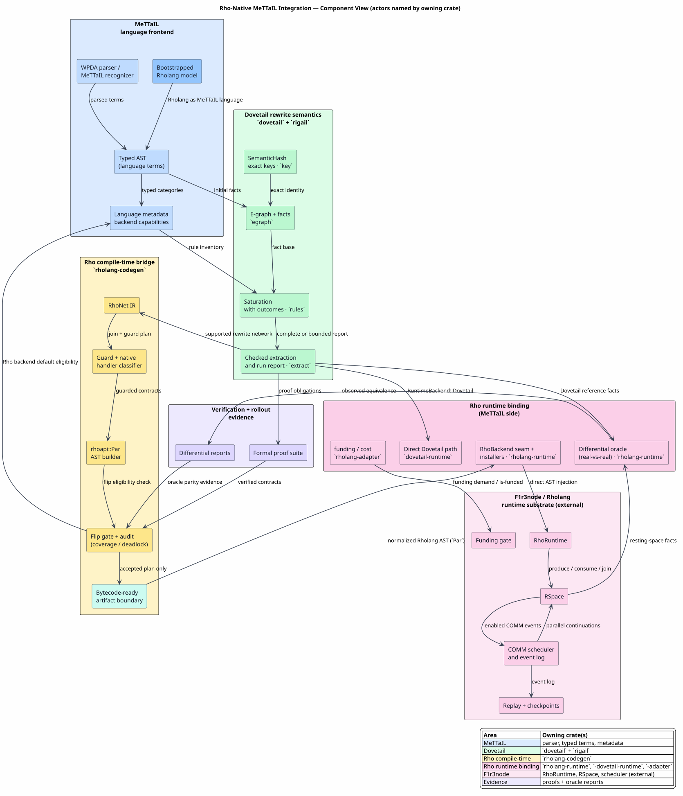

# Rho-Native MeTTaIL Integration

Last updated: 2026-07-10

This documentation explains how MeTTaIL, Dovetail, Rholang, F1r3node, RSpace,
and the Rho machine fit together.
For Dovetail's standalone rewrite-engine architecture, see
[../dovetail/README.md](../dovetail/README.md).

Scope note: this integration replaced the CESK runtime backend (retired in P6).
It is not a replacement for the active WPDA parser/recognizer. The generated
Ascent rewrite engine was also retired in P6; only the fail-closed
`Language::run_ascent` differential-oracle hook survives, and
`selected_default_runtime_backend` never selects it.

The theoretical background is the Rho calculus
([RHO-2005](references.md#rho-2005)), mobile-process calculi
([PI-1992-I](references.md#pi-1992-i),
[PI-1992-II](references.md#pi-1992-ii)), tuple-space coordination
([LINDA-1985](references.md#linda-1985)), and join-style synchronization
([JOIN-2000](references.md#join-2000)). The implementation-facing behavior of
Rholang and RSpace is taken from the F1r3node documentation
([RHOLANG-DOCS](references.md#rholang-docs),
[RSPACE-DOCS](references.md#rspace-docs)).
The repository-local design lineage comes from the Dovetail engine plans
([DOVETAIL-DESIGN-DOCS](references.md#dovetail-design-docs)), the prior
Rholang target design ([RHOLANG-TARGET-DESIGN](references.md#rholang-target-design)),
and the M-RHO execution-contract work
([RHO-FLIP-DESIGN](references.md#rho-flip-design)).

The short version:

1. A user writes a snippet in a language modeled by MeTTaIL.
2. MeTTaIL parses the snippet and produces typed terms.
3. Dovetail gives those terms a rewrite semantics: equations, rewrites,
   folds, guards, exact keys, saturation, and ambiguity-preserving extraction.
4. The Rho backend lowers the Dovetail rewrite network into Rho-native
   dataflow: facts are RSpace messages, rules are persistent Rholang contracts,
   and multi-premise rewrites are atomic RSpace joins.
5. F1r3node's RhoRuntime executes the resulting Rholang/RSpace network using
   native parallel `P | Q`, non-blocking sends, persistent receives, joins,
   checkpointing, replay logs, and cost/funding machinery.

The design goal is not to make F1r3node depend on MeTTaIL. MeTTaIL remains the
frontend/compiler, while F1r3node remains the runtime. The dependency direction
is one-way: MeTTaIL bridge crates may depend on F1r3node crates; F1r3node does
not depend on MeTTaIL.
The backend therefore reuses F1r3node's existing Rholang interpreter, RSpace
matcher, replay/checkpoint machinery, and cost/funding path; it does not define
a parallel Rho machine inside MeTTaIL.

## Reading Paths

For principals who need an accurate at-a-glance view:

1. [Executive Brief](00-executive-brief.md)
2. [End-to-End Architecture](02-end-to-end-architecture.md)
3. [Rho-Native Dataflow Lowering](04-rho-native-dataflow-lowering.md)
4. [Correctness and Coverage](06-correctness-and-coverage.md)

For implementers:

1. [Concepts and Glossary](01-concepts-and-glossary.md)
2. [Dovetail Rewrite Semantics](03-dovetail-rewrite-semantics.md)
3. [RSpace Parallel Scheduling](05-rspace-parallel-scheduling.md)
4. [Verification and Rollout](07-verification-and-rollout.md)
5. [Production Runtime Backend Completion Guide](08-production-runtime-backend-completion.md)
6. [Runtime Invocation Migration](12-runtime-invocation-migration.md)
7. [Knotted-Topoi Operational Invariants](13-knotted-topoi-operational-invariants.md)

For reviewers checking claims and citations:

1. [Requirements Traceability](00-requirements-traceability.md)
2. [Correctness and Coverage](06-correctness-and-coverage.md)
3. [References](references.md)

For the in-Rho matching campaign (how matching AND firing both moved onto the interpreter):

1. [Rholang Runtime Backend](20-rholang-runtime-backend.md) — how the whole backend runs
2. [Compiling OSLF `language!` Specifications to Rholang](27-oslf-language-to-rholang-compilation.md) — how the backend is produced, compile-time, set-automaton spine
3. [The Translation-Rule System](28-translation-rule-system.md) — the specification-level calculus: all thirteen clause-kind rules, whole-language assembly, and worked whole-language instances
4. [In-Rho Base-Family Reference](25-in-rho-base-family-reference.md) — the base family, reconstruction-grade
5. [In-Rho AC-Family Reference](26-in-rho-ac-family-reference.md) — the associative-commutative family
6. [In-Rho Binder Beta-Substitution](19-in-rho-binder-beta-substitution.md) — the binder-β family
7. [Set-Automata Optimization Theory](21-set-automata-optimization-theory.md) — why it is optimal
8. [End-to-End Formal Verification](22-end-to-end-formal-verification.md) — the operational-correspondence theorems
9. [Coverage and Correctness](23-coverage-and-correctness.md) — what is covered
10. [In-Rho Completion Audit](24-in-rho-completion-audit.md) — the closing audit

## Cohesive Reading Model

Read the suite as one artifact chain, not as independent subsystems:

`language! specification → generated semantic inventory → DovetailRunReport → RhoNet plan → rhoapi::Par → RSpace observations → RuntimeBackendReport`

The first two artifacts are MeTTaIL-owned. The middle report is Dovetail-owned:
it is the exact-keyed, completeness-checked rewrite result. The Rho backend
owns the plan and normalized AST artifact, including dynamic call and witness
payloads constructed as structured `RhoAstLiteral` values. F1r3node owns
execution and observations. The generic `RuntimeBackendReport` is produced only
after runtime execution; it is not a Dovetail report. Each document in this
suite explains one handoff in that chain, and the correctness documents prove
that a downstream artifact does not claim more than its upstream artifact
established.

Predicated types add one upstream evidence lane to the same chain:

`language! specification → LanguageDef → guard obligations → predicate dispositions → Dovetail guarded rules → RhoNet guarded plan`

The symbolic-transducer/effective-Boolean-algebra/tree/behavioral-predicate
substrate owns the obligation classification and disposition evidence.
Dovetail and Rho consume those dispositions; they do not maintain backend-local
category-head lists or reinterpret unknown behavioral evidence as complete.

When `RuntimeBackend::Dovetail` is selected directly, the chain stops earlier:

`language! specification → generated semantic inventory → DovetailRunReport → RuntimeBackendOutput::Dovetail`

That direct report-shaped output is installed by `dovetail-runtime`.
It is useful for production rewrite execution, differential checks, REPL
inspection, and simulation traces. The Rho-native chain starts from the same
checked report but lowers it further to `rhoapi::Par` and observes RSpace after
execution.

For generic call-by-need execution, the Rho generation segment is:

`generated-language computation → CallByNeedThunkSpec → audited CallByNeedThunkPlan → rhoapi::Par`

This segment is still AST-first. The spec carries the generated-language value
as a closed `RhoAstLiteral`, names the evaluation marker, output channel, and
evaluation-trace channel, and the plan proves budget admission and artifact
validation before the RhoRuntime receives the normalized `Par`.

The artifact spine below is the recommended mental model for the whole suite:

| Step | Owner | Artifact | What must be true before the next step |
|---:|---|---|---|
| 1 | MeTTaIL macro layer | `LanguageDef` | the `language!` body parsed and validated |
| 2 | generated language crate | `LanguageMetadata` plus typed AST constructors | categories, constructors, rules, guards, and handlers are discoverable from generated inventory |
| 3 | Dovetail | `SatReport` and `DovetailRunReport` | saturation outcome is explicit, extraction completeness is explicit, and exact keys identify every term |
| 4a | direct Dovetail adapter | `RuntimeBackendOutput::Dovetail` | the report is complete and remains report-shaped |
| 4b | Rho backend planner | `RhoNet plan` | every covered rule is lowered and every uncovered rule is rejected with evidence |
| 5 | Rho AST generator | `rhoapi::Par` | the executable artifact is normalized AST, not Rholang source text |
| 6 | F1r3node | RSpace resting facts and observations | host RhoRuntime executed the AST and RSpace scheduled enabled joins |
| 7 | MeTTaIL runtime envelope | `RuntimeBackendReport` | the output shape matches the selected backend and does not pretend to be another backend's artifact |

This table is also the vocabulary discipline for the documentation. A
`DovetailRunReport` is rewrite evidence before runtime execution. A
`rhoapi::Par` value is the generated executable artifact. A Rho observation is
the post-execution fact seen in RSpace. A generic `RuntimeBackendReport` is only
the outer language-level envelope returned to callers.

The quickest way to stay oriented is to separate the static and dynamic tracks:

| Track | Artifact chain | Cohesion rule |
|---|---|---|
| static language definition | `language! → LanguageDef → generated AST constructors + LanguageMetadata → Dovetail rule inventory` | there is one language source of truth, and every downstream category, constructor, guard, rewrite, and handler is derived from it |
| dynamic snippet execution | `source snippet → WPDA parser → typed AST → selected runtime backend` | parsing remains upstream; runtime backends consume typed terms and generated metadata |
| direct Dovetail runtime | `typed AST + metadata → SatReport → DovetailRunReport → RuntimeBackendOutput::Dovetail` | the runtime result is report-shaped rewrite evidence |
| Rho-native runtime | `complete DovetailRunReport → RhoNet plan → rhoapi::Par → RhoRuntime → observations → RuntimeBackendReport` | the runtime result is observation-shaped evidence after host Rho execution |
| generic call-by-need runtime | `typed computation → CallByNeedThunkSpec → CallByNeedThunkPlan → rhoapi::Par → observations` | generated-language computations are parameterized into an AST-first Rho thunk with explicit budget admission and AST validation, not lowered through text |

This separation is deliberately repetitive across the suite. It prevents three
common misreadings:

| Misreading | Correct reading |
|---|---|
| Dovetail replaces the parser. | The WPDA parser remains the source-text frontend; Dovetail consumes typed AST values. |
| The Rho backend emits Rholang text. | Documentation may show Rholang-like text, but the executable artifact is normalized AST such as `rhoapi::Par`. |
| A Dovetail report is the same thing as a runtime observation. | A report is pre-execution rewrite evidence; an observation is post-execution RSpace evidence. |

## Cross-Suite Cohesion Rules

The Dovetail suite and this Rho integration suite intentionally share one
running chain:

`language! → LanguageDef → LanguageMetadata → typed AST → DovetailRunReport → rhoapi::Par → RuntimeBackendReport`

The difference is scope. The Dovetail suite stops at a checked report except
when naming consumers. This suite starts with the same report and explains how
a complete report becomes host Rho-machine work. To keep that handoff readable,
apply these rules:

| Rule | Practical consequence |
|---|---|
| One language source of truth | `LanguageDef` is the structured macro-expanded value produced by `language!`; categories, constructors, guards, rewrites, and handlers are derived from generated metadata, not backend-local lists or display strings |
| One rewrite evidence boundary | the Rho backend consumes `DovetailRunReport`; it does not reconstruct Dovetail evidence from displayed terms |
| One executable Rho artifact kind | generated execution values are normalized `rhoapi::Par`, with Rholang text kept as annotation |
| One host runtime | F1r3node/RhoRuntime/RSpace schedule COMM and joins; MeTTaIL does not grow a second Rho machine |
| One runtime envelope | callers receive `RuntimeBackendReport` values whose output variant matches the selected backend |

The most important reader check is phase: before `DovetailRunReport`, the topic
is language definition, parsing, or rewrite proof; after `DovetailRunReport`,
the topic is lowering, host execution, or observation.

## Running Example Ownership

The canonical end-to-end example is MiniRhoFor in
[Dovetail Runtime-Facing Reports](../dovetail/10-runtime-facing-reports.md#minirhofor-report-example).
This suite reuses that example instead of introducing a second surface
language. The example is checked by
[`macros/src/doc_examples.rs`](../../../macros/src/doc_examples.rs), which means
the displayed `language!` body parses and validates as a `LanguageDef`.

Use the example to answer three questions in order:

| Question | Canonical artifact chain | Primary document |
|---|---|---|
| What did the language author define? | `language! spec → LanguageDef → LanguageMetadata` | [End-to-End Architecture](02-end-to-end-architecture.md#high-level-dispatch-trace) |
| What did Dovetail prove and report? | `typed AST → SatReport → DovetailRunReport` | [Dovetail Runtime-Facing Reports](../dovetail/10-runtime-facing-reports.md#minirhofor-report-example) |
| What did the Rho backend execute? | `complete DovetailRunReport → RhoNet plan → rhoapi::Par → RhoRuntime observations` | [Rho-Native Dataflow Lowering](04-rho-native-dataflow-lowering.md) |

Rholang-looking snippets in those pages are reader annotations. Generated
runtime values are normalized AST artifacts, and the executable form is
`rhoapi::Par`.

## Document Map

| Document | Question answered |
|---|---|
| [00 — Executive Brief](00-executive-brief.md) | What should principals understand at a glance? |
| [00 — Requirements Traceability](00-requirements-traceability.md) | Where is each explicit documentation requirement satisfied? |
| [01 — Concepts and Glossary](01-concepts-and-glossary.md) | What do all names, symbols, and acronyms mean? |
| [02 — End-to-End Architecture](02-end-to-end-architecture.md) | How does a source snippet become native Rho execution? |
| [03 — Dovetail Rewrite Semantics](03-dovetail-rewrite-semantics.md) | What rewrite rules does Dovetail implement? |
| [04 — Rho-Native Dataflow Lowering](04-rho-native-dataflow-lowering.md) | How are rewrite semantics compiled into Rholang/RSpace? |
| [05 — RSpace Parallel Scheduling](05-rspace-parallel-scheduling.md) | Why does RSpace naturally schedule enabled rewrites in parallel? |
| [06 — Correctness and Coverage](06-correctness-and-coverage.md) | What is proved, under which assumptions, and what is not claimed? |
| [07 — Verification and Rollout](07-verification-and-rollout.md) | How does M-RHO.0 through M-RHO.4 land safely? |
| [08 — Production Runtime Backend Completion Guide](08-production-runtime-backend-completion.md) | What evidence, gates, and exact AST contracts let another agent complete the runtime backend replacement? |
| [09 — Term-Level Reduction Split](09-term-level-reduction-split.md) | How do Dovetail folds and Rholang COMM compose in one term, and where is the boundary? |
| [10 — Adaptive Evaluation Model](10-adaptive-evaluation-model.md) | When does a reduction run sequentially vs trampoline, and how does the Tier-3 held-fold contract close the boundary? |
| [11 — Reactive COMM Stepper](11-reactive-comm-stepper.md) | How does `step` single-step COMM reductions on the Rho machine, lock-free and zero-cost when off? |
| [12 — Runtime Invocation Migration](12-runtime-invocation-migration.md) | How do downstream crates migrate from the legacy `RhoBackendInvocation` constructors to the `RhoMachineInvocation` / `RhoBackendInvocation` split? |
| [13 — Knotted-Topoi Operational Invariants](13-knotted-topoi-operational-invariants.md) | Which operational invariants does the north-star paper require, why host-side matching was a faithful stepping-stone, and how the in-Rho optimization (now landed) discharges the same invariants? |
| [14 — Completion Audit](14-completion-audit.md) | The final completion audit (plan #1956 Epic 1 #2078): change classification (#1970) + per-epic requirement-to-evidence matrix (#1972/#1973), verifying the persistent goal against current code. |
| [15 — In-Rho Set-Automaton Matching Integration](15-in-rho-set-automaton-matching.md) | How is Greg Meredith's set-automaton matching integration finished — compiling the set automaton into Rho for O1-optimal in-Rho matching, with every non-semantic-predicate rewrite firing as a COMM? Authored one campaign stage per section (Stage 0 firing driver; Stage 1 matching). |
| [16 — In-Rho Matching: Verification Plan](16-in-rho-verification-plan.md) | What is the end-to-end formal-verification strategy for the in-Rho matching — the Rocq-first obligations, the load-bearing rem:nonopt discharge chain, the tool fit, and what is proven vs outstanding? |
| [17 — Stage 3: Production Wiring](17-stage-3-production-wiring.md) | How does the derived in-Rho matching ruleset become a language's default backend — the match gate, the redex/subject reconstruction, and the end-to-end match + fire on the live reducer? |
| [18 — In-Rho AC Matching](18-in-rho-ac-matching.md) | How are associative-commutative operands (HashBag par-soups) matched ORDER-INDEPENDENTLY on the interpreter — the process-soup carrier (Scheme B), the connective pattern, the `AcRewrite` un-skip + collection-kind resolution, the injection, and the five zero-admission AC theorems? |
| [19 — In-Rho Binder Beta-Substitution](19-in-rho-binder-beta-substitution.md) | How does the lambda-calculus GSLT's beta rewrite fire FULLY in Rho — the MATCH and the capture-avoiding SUBSTITUTION alike — as a metered cascade of COMMs on the reducer? The de-Bruijn substitution TRS (five reserved receivers), the C1/C2/C3 corrections, Driver-B, the honest cost, the corrupted-report empirical proof, and the zero-admission strong-normalization / confluence / normal-form + weak-bisimulation suite. |
| [20 — Rholang Runtime Backend](20-rholang-runtime-backend.md) | How does the whole backend run — the three layers (matching / firing / congruence), the reflected-`EList` ABI, the `loc:`/`col:`/`cap:`/`sa:`/`eq:`/`ac:` channel scheme, the two paths, the fail-closed install gate, and metering — all on F1r3node's RhoRuntime / RSpace? |
| [21 — Set-Automata Optimization Theory](21-set-automata-optimization-theory.md) | Why is the in-Rho matching optimal — the Erkens–Groote locate automaton, the O1 / O2 / O3 conditions, Meredith's $`tc(K)`$ channel naming, and the interner as a compile-time partial evaluator computing the size-optimal quotient? |
| [22 — End-to-End Formal Verification](22-end-to-end-formal-verification.md) | Why is it correct — 37 mechanized theory files carrying 310 closure certificates (161 + 149), presented as numbered results (T1–T23), and the whole-⟦G⟧ operational-correspondence capstone established over O1-optimal matching? |
| [23 — Coverage and Correctness](23-coverage-and-correctness.md) | What is covered — the family × capability matrix, the corrupted-$`\sigma`$ "replacement not replay" probe methodology, the finite / symbolic complements, and the honest limits? |
| [24 — In-Rho Completion Audit](24-in-rho-completion-audit.md) | Did the campaign meet its north star — the requirement-to-evidence traceability matrix, the INV-1..14 reconciliation, the no-dual-path verification, and the residuals register? |
| [25 — In-Rho Base-Family Reference](25-in-rho-base-family-reference.md) | How is the base-rewrite family rebuilt from scratch — reconstruction-grade coverage of reflection, spread, the collapse fold, the automaton network, and locate-all multi-firing? |
| [26 — In-Rho AC-Family Reference](26-in-rho-ac-family-reference.md) | How is the associative-commutative family rebuilt from scratch — the Scheme-B spread re-sourcing, the site-keyed carrier, and AC4 (`HashSet` / `HashMap` / `Zip`)? |
| [27 — Compiling OSLF `language!` Specifications to Rholang](27-oslf-language-to-rholang-compilation.md) | How is an OSLF `language!` specification compiled to Rholang — the compile-time set-automaton translation pipeline (spec → `LanguageDef` → interned automaton → installed `Par`)? |
| [28 — The Translation-Rule System](28-translation-rule-system.md) | What is the specification-level translation calculus — the master table of all thirteen clause-kind rules in the paper's clause style with per-rule templates and fail-closed conditions, the whole-language assembly formula, a worked multi-rule automaton with its full interning trace and shared state, and a complete test-pinned installed-`Par` listing for a whole two-rule lambda language? |
| [29 — Knotted-Topoi Satisfaction Crosswalk](29-knotted-topoi-satisfaction-crosswalk.md) | Where does the north-star paper stand, item by item — every labeled claim of the vendored tex crosswalked to its mechanized theorem, named runtime test, or place in the denotational program, with the three-layer evidence architecture, the honest-premise inventory, and the measured efficiency-gate results? |
| [References](references.md) | Which papers, docs, and formal artifacts support the design? |
| [Validation Script](validate.sh) | How are the documentation structure checks reproduced locally? |

## Architecture at a Glance



PlantUML source: [figures/README.puml](figures/README.puml).

## Core Principle

The Rho backend should not implement a Rust scheduler that competes with RSpace.
It should compile rewrite semantics into a Rho-native dataflow network:

- facts are messages;
- rewrite rules are persistent contracts;
- multi-premise rules are atomic joins;
- guards are RSpace commit predicates or native guard handlers;
- ambiguity is explicit candidate data;
- RSpace readiness is the scheduler.

In formula form, the Dovetail fact iteration is:

`Fᵢ₊₁ = Fᵢ ∪ Δᵢ₊₁`

`Δᵢ₊₁ = derive(Fᵢ, Δᵢ) ∖ Fᵢ`

The Rho-native lowering preserves the same fixed point for the covered runtime
semantics, but lets RSpace discover enabled instances by communication instead
of by the CESK runtime backend's centralized scheduling path.

## Local Validation

Run the documentation suite checks from the repository root:

```text
docs/architecture/rho-native-integration/validate.sh
```

The script checks unfinished-work markers, proof-hole markers (allowing the
named/negated Rocq-vernacular mentions the FV docs legitimately carry),
fenced-block balance, PlantUML marker balance, PlantUML syntax, math-symbol
formatting, math-delimiter conformance (inline math must be the code-span-protected
dollar-backtick form; bare and double-dollar delimiters are rejected), a
GitHub-renderability check (banning MathJax commands GitHub cannot render, such as
the mathtools reflection brackets and the char primitive), rendered PlantUML SVG assets,
relative Markdown/source/image links, bibliography-local paths, and
`git diff --check` whitespace diagnostics. Link
and whitespace checks include `README.md`, `docs/README.md`, and
`docs/architecture.md` so the suite remains discoverable from the project and
documentation entry points.

When network access is available, run the DOI and external-link checks as well:

```text
docs/architecture/rho-native-integration/validate.sh --online
```
