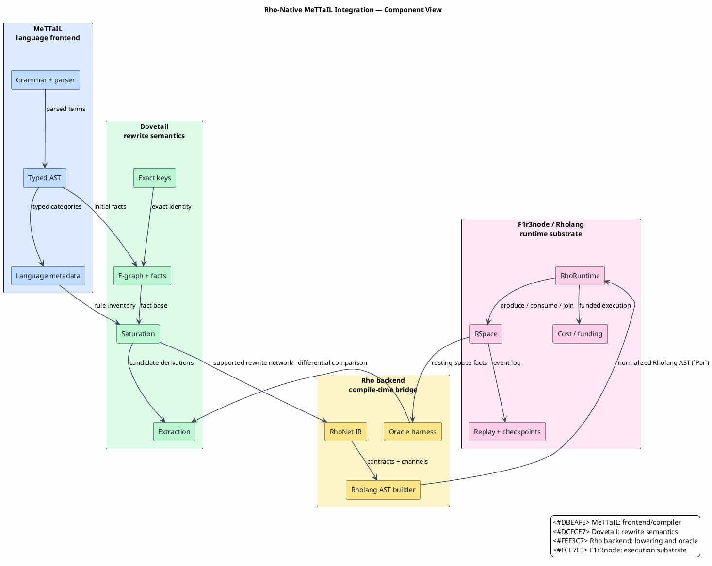

# Rho-Native MeTTaIL Integration

Last updated: 2026-06-13

This documentation explains how MeTTaIL, Dovetail, Rholang, F1r3node, RSpace,
and the Rho machine fit together.

Scope note: this integration is a replacement path for the CESK runtime backend.
It is not a replacement for the active WPDA parser/recognizer, and it does not
delete the Ascent reference/oracle path used for differential evidence. Ascent
is legacy for production rewrite execution; its retained role here is oracle
evidence during rollout.

The theoretical background is the Rho calculus
([RHO-2005](references.md#rho-2005)), mobile-process calculi
([PI-1992-I](references.md#pi-1992-i),
[PI-1992-II](references.md#pi-1992-ii)), tuple-space coordination
([LINDA-1985](references.md#linda-1985)), and join-style synchronization
([JOIN-2000](references.md#join-2000)). The implementation-facing behavior of
Rholang and RSpace is taken from the F1r3node documentation
([RHOLANG-DOCS](references.md#rholang-docs),
[RSPACE-DOCS](references.md#rspace-docs)).
The repository-local design lineage comes from the Dovetail engine plans
([DOVETAIL-DESIGN-DOCS](references.md#dovetail-design-docs)), the prior
Rholang target design ([RHOLANG-TARGET-DESIGN](references.md#rholang-target-design)),
and the M-RHO execution-contract work
([RHO-FLIP-DESIGN](references.md#rho-flip-design)).

The short version:

1. A user writes a snippet in a language modeled by MeTTaIL.
2. MeTTaIL parses the snippet and produces typed terms.
3. Dovetail gives those terms a rewrite semantics: equations, rewrites,
   folds, guards, exact keys, saturation, and ambiguity-preserving extraction.
4. The Rho backend lowers the Dovetail rewrite network into Rho-native
   dataflow: facts are RSpace messages, rules are persistent Rholang contracts,
   and multi-premise rewrites are atomic RSpace joins.
5. F1r3node's RhoRuntime executes the resulting Rholang/RSpace network using
   native parallel `P | Q`, non-blocking sends, persistent receives, joins,
   checkpointing, replay logs, and cost/funding machinery.

The design goal is not to make F1r3node depend on MeTTaIL. MeTTaIL remains the
frontend/compiler, while F1r3node remains the runtime. The dependency direction
is one-way: MeTTaIL bridge crates may depend on F1r3node crates; F1r3node does
not depend on MeTTaIL.
The backend therefore reuses F1r3node's existing Rholang interpreter, RSpace
matcher, replay/checkpoint machinery, and cost/funding path; it does not define
a parallel Rho machine inside MeTTaIL.

## Reading Paths

For principals who need an accurate at-a-glance view:

1. [Executive Brief](00-executive-brief.md)
2. [End-to-End Architecture](02-end-to-end-architecture.md)
3. [Rho-Native Dataflow Lowering](04-rho-native-dataflow-lowering.md)
4. [Correctness and Coverage](06-correctness-and-coverage.md)

For implementers:

1. [Concepts and Glossary](01-concepts-and-glossary.md)
2. [Dovetail Rewrite Semantics](03-dovetail-rewrite-semantics.md)
3. [RSpace Parallel Scheduling](05-rspace-parallel-scheduling.md)
4. [Verification and Rollout](07-verification-and-rollout.md)

For reviewers checking claims and citations:

1. [Requirements Traceability](00-requirements-traceability.md)
2. [Correctness and Coverage](06-correctness-and-coverage.md)
3. [References](references.md)

## Document Map

| Document | Question answered |
|---|---|
| [00 — Executive Brief](00-executive-brief.md) | What should principals understand at a glance? |
| [00 — Requirements Traceability](00-requirements-traceability.md) | Where is each explicit documentation requirement satisfied? |
| [01 — Concepts and Glossary](01-concepts-and-glossary.md) | What do all names, symbols, and acronyms mean? |
| [02 — End-to-End Architecture](02-end-to-end-architecture.md) | How does a source snippet become native Rho execution? |
| [03 — Dovetail Rewrite Semantics](03-dovetail-rewrite-semantics.md) | What rewrite rules does Dovetail implement? |
| [04 — Rho-Native Dataflow Lowering](04-rho-native-dataflow-lowering.md) | How are rewrite semantics compiled into Rholang/RSpace? |
| [05 — RSpace Parallel Scheduling](05-rspace-parallel-scheduling.md) | Why does RSpace naturally schedule enabled rewrites in parallel? |
| [06 — Correctness and Coverage](06-correctness-and-coverage.md) | What is proved, under which assumptions, and what is not claimed? |
| [07 — Verification and Rollout](07-verification-and-rollout.md) | How does M-RHO.0 through M-RHO.4 land safely? |
| [References](references.md) | Which papers, docs, and formal artifacts support the design? |
| [Validation Script](validate.sh) | How are the documentation structure checks reproduced locally? |

## Architecture at a Glance


PlantUML source: [figures/README.puml](figures/README.puml).



## Core Principle

The Rho backend should not implement a Rust scheduler that competes with RSpace.
It should compile rewrite semantics into a Rho-native dataflow network:

- facts are messages;
- rewrite rules are persistent contracts;
- multi-premise rules are atomic joins;
- guards are RSpace commit predicates or native guard handlers;
- ambiguity is explicit candidate data;
- RSpace readiness is the scheduler.

In formula form, the Dovetail fact iteration is:

`Fᵢ₊₁ = Fᵢ ∪ Δᵢ₊₁`

`Δᵢ₊₁ = derive(Fᵢ, Δᵢ) ∖ Fᵢ`

The Rho-native lowering preserves the same fixed point for the covered runtime
semantics, but lets RSpace discover enabled instances by communication instead
of by the CESK runtime backend's centralized scheduling path.

## Local Validation

Run the documentation suite checks from the repository root:

```text
docs/architecture/rho-native-integration/validate.sh
```

The script checks unfinished-work markers, proof-hole markers, fenced-block
balance, PlantUML marker balance, PlantUML syntax, math-symbol formatting,
rendered PlantUML SVG assets, relative Markdown/source/image links,
bibliography-local paths, and `git diff --check` whitespace diagnostics. Link
and whitespace checks include `README.md`, `docs/README.md`, and
`docs/architecture.md` so the suite remains discoverable from the project and
documentation entry points.

When network access is available, run the DOI and external-link checks as well:

```text
docs/architecture/rho-native-integration/validate.sh --online
```
