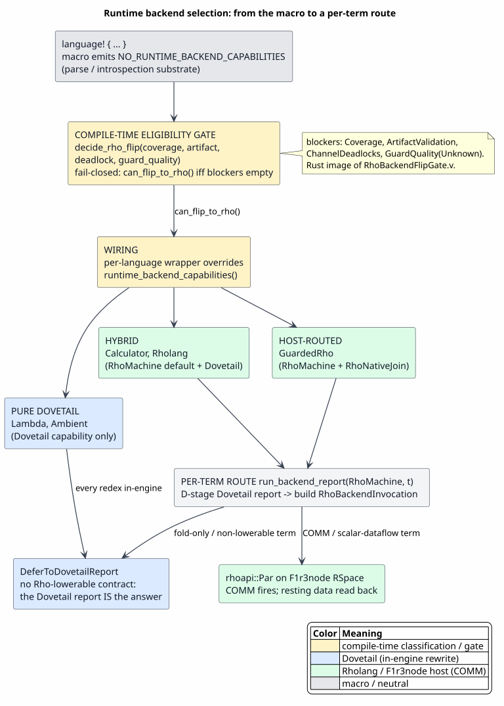

# Runtime Backend Replacement Spine

Last updated: 2026-06-24

This page is the connective tissue between the standalone
[Dovetail rewrite-engine suite](dovetail/README.md) and the
[Rho-native integration suite](rho-native-integration/README.md). It exists so
a reader can understand the whole runtime-backend replacement path before
opening the deeper design documents.

Here, **backend** means **runtime backend**. The active WPDA parser/recognizer
remains the source-to-typed-term frontend. The replacement work is about what
happens after parsing.

## One-Sentence Model

MeTTaIL defines and parses languages, Dovetail proves and reports
substrate-neutral rewrite consequences, and the Rho backend optionally compiles
complete Dovetail reports into host Rho-machine work executed by F1r3node.

The compact artifact spine is:

`language! specification → LanguageDef → LanguageMetadata → typed AST → DovetailRunReport → backend artifact → RuntimeBackendReport`

Read that as two paths that join at generated language metadata:

`static path: language! specification → LanguageDef → LanguageMetadata → Dovetail rewrite inventory`

`runtime path: source snippet → WPDA parser → typed AST → DovetailRunReport → selected runtime backend`

The static path answers "what language did the author define?" The runtime
path answers "what happens to this particular snippet?" Keeping those questions
separate is the simplest way to avoid conflating the macro, the rewrite engine,
and the runtime backend.

## How To Read The Whole Suite

Use this page as the reader contract for both architecture suites. Every deeper
document should preserve the same left-to-right interpretation:

`declare → generate → parse → report → execute → observe`

The words in that mnemonic are ownership boundaries:

| Step | Owner | Reader checkpoint |
|---|---|---|
| declare | `language!` macro input | Is this describing the modeled language, before any runtime exists? |
| generate | macro/codegen output | Did the category, constructor, rewrite, guard, and handler inventory come from generated metadata? |
| parse | WPDA frontend | Is this about source text becoming a typed AST term? |
| report | Dovetail | Is this exact-keyed rewrite evidence before runtime execution? |
| execute | selected runtime backend | Is this direct Dovetail report exposure or Rho AST execution? |
| observe | runtime envelope | Is this a post-runtime value inside `RuntimeBackendReport`? |

That checkpoint table is deliberately stricter than the prose. It keeps the
documentation cohesive when a page contains examples from several layers. If an
artifact is before `report`, it belongs to MeTTaIL language definition or
parsing. If an artifact is exactly `report`, it belongs to Dovetail. If an
artifact is after `report`, it belongs to a runtime backend or to the generic
runtime envelope.

The most common comprehension failure is to treat readable notation as the
artifact being executed. In this suite:

| Reader-facing notation | Executable or semantic artifact |
|---|---|
| Rholang-looking snippets in examples | annotations for humans |
| `language!` snippets | macro input parsed into `LanguageDef` |
| constructor displays such as `Proc::PPar(...)` | typed AST values from generated language crates |
| `DovetailRunReport { ... }` examples | exact-keyed report shape, not Rho execution |
| `b!(z)` annotations | explanation of a send, not generated source text |
| `rhoapi::Par` | generated host Rholang AST sent directly to `RhoRuntime` |

When another document repeats the artifact chain, read the repetition as a
local orientation marker. It should not introduce a second source of truth.

## Canonical Comprehension Path

Use the MiniRhoFor fixture as the running example across the documentation. It
is intentionally small, but it exercises the whole reader-facing chain:

`language! spec → LanguageDef → LanguageMetadata → Dovetail rules`

and then, for one snippet:

`source text → typed AST → DovetailRunReport → rhoapi::Par → RuntimeBackendReport`

The detailed example lives in one canonical place:
[Dovetail Runtime-Facing Reports](dovetail/10-runtime-facing-reports.md#minirhofor-report-example).
The Rho integration pages link back to that example rather than defining a
competing surface language. The syntax guard for the `language!` fixture is
[`macros/src/doc_examples.rs`](../../macros/src/doc_examples.rs), so the
example is checked as a real `LanguageDef` shape even though MiniRhoFor is only
a documentation fixture.

Read the example with this distinction in mind:

| Reader sees | Real artifact | Owner |
|---|---|---|
| `language! { name: MiniRhoFor, ... }` | macro input parsed into `LanguageDef` | MeTTaIL macro layer |
| `Proc::PPar(...)` | generated typed source-language AST | generated language crate |
| `k_par_out_b_z` | abbreviation for exact `ContentKey` bytes | Dovetail |
| `DovetailRunReport { ... }` | checked extraction/report artifact | Dovetail |
| `b!(z)` | reader annotation for the executable artifact | documentation only |
| `rhoapi::Par(send b z)` | normalized host Rholang AST value | Rho backend |
| observed value on a channel | runtime observation after host execution | F1r3node/RSpace plus MeTTaIL runtime envelope |

The cohesion rule is that every later artifact must be derived from the
previous checked artifact without changing its meaning. Category lists,
constructors, and rule inventories come from generated metadata; Dovetail
reports exact rewrite evidence; the Rho backend emits AST, not source text;
F1r3node executes that AST and produces observations.

There are two production runtime lanes after the Dovetail report:

| Lane | Artifact chain | Purpose |
|---|---|---|
| direct Dovetail runtime | `DovetailRunReport → RuntimeDovetailRunReport → RuntimeBackendOutput::Dovetail` | expose checked rewrite evidence as the selected runtime result |
| Rho-native runtime | `DovetailRunReport → RhoNet plan → rhoapi::Par → RhoRuntime → RSpace observations → RuntimeBackendReport` | execute covered rewrite semantics as host Rho-machine dataflow |

Ascent is outside these production lanes. `Language::run_ascent` remains a
reference/oracle method for verification and transition evidence, and
`RuntimeBackendOutput::Ascent` remains the report shape for that reference data.
The production dispatcher does not select Ascent as a default backend and does
not execute `RuntimeBackend::Ascent` through `run_backend_report` or seeded
report dispatch. The `Language::run_ascent` trait hook itself has a fail-closed
default; generated languages and tests override it only when they intentionally
install explicit oracle evidence.
The REPL follows the same rule: session state caches a `RuntimeBackendReport`
for the current term, and graph navigation moves the current cursor while
preserving that report envelope. Graph commands use a backend-neutral graph
view: an Ascent-shaped reference report projects the historical rewrite graph,
a Dovetail report projects its derivation-dependency graph, and Rho observation
reports remain terminal observation results rather than fabricated graphs. The
REPL crate itself does not carry the generated Ascent BYODS dependency or
crate-root `eqrel` re-export.
Runtime queries follow that report boundary as well: production query execution
uses `mettail_query::run_query_report` over `RuntimeBackendReport`, while
`run_ascent_oracle_query` is named as an explicit reference-oracle API for raw
`AscentResults`.

Generated language crates no longer carry the legacy Ascent engine at all. The
generated Ascent structs, `ascent_source!` inspection macros, `eqrel`, and the
dual-indexed Ascent BYODS provider were removed with the `oracle-ascent` feature
in P6 (commits `9d889894`/`c9cea652`), so the parser/AST/Rho-codegen surface has
no dependency on `ascent` or `ascent-byods-rels`. The retained
`Language::run_ascent` and `Language::run_ascent_with_facts` trait hooks now fail
closed by default with an oracle-disabled diagnostic rather than silently
selecting the legacy runtime path.

The Rho-native lane has two generation shapes. Rho-shaped or directly covered
rules lower through a RhoNet plan. Generic call-by-need computations lower
through `RhoAstLiteral` payloads inside
`CallByNeedThunkSpec → CallByNeedThunkPlan`, then to the same normalized
`rhoapi::Par` artifact kind. Both shapes use AST-first generation and both
execute through F1r3node's RhoRuntime.

Both lanes are runtime-backend paths. Neither replaces the parser.

## Responsibilities

| Layer | Owns | Does not own |
|---|---|---|
| `language!` and macro expansion | categories, constructors, syntax, equations, rewrites, guards, handlers, generated inventory | runtime scheduling, Dovetail exact-key proofs, Rho execution |
| WPDA parser/recognizer | source text to typed AST terms | runtime backend selection |
| Dovetail | exact keys, equality saturation, rule saturation, extraction, weights, boundedness, reports | parser generation, hard-coded category lists, RhoRuntime execution |
| direct Dovetail adapter | projection of complete checked reports into `runtime` report-shaped output | Rho lowering or RSpace observation |
| Rho backend | RhoNet planning, normalized `rhoapi::Par` AST generation, explicit rejection of uncovered rules | Rholang text reparsing, custom Rho machine implementation |
| F1r3node/RhoRuntime/RSpace | Rholang AST execution, COMM, joins, scheduling, replay, checkpoints, cost/funding | MeTTaIL language definition or Dovetail proof construction |
| Ascent path | fail-closed `run_ascent` differential-oracle evidence | production rewrite execution — the generated Ascent engine was retired in P6; Dovetail/Rho owns this |

The main dependency rule is:

`MeTTaIL bridge crates → F1r3node crates`

and not:

`F1r3node crates → MeTTaIL crates`

## Terms Not To Conflate

| Term | Meaning | Reader check |
|---|---|---|
| `LanguageDef` | macro-time language model parsed from `language!` | before Rust code generation |
| `LanguageMetadata` | generated inventory of categories, constructors, rules, guards, handlers, and backend capabilities | available from generated language crates |
| typed AST | source-language term produced by the retained parser | input to runtime backend execution |
| `SatReport` | Dovetail saturation terminal status and statistics | says how equality/rewrite growth stopped |
| `Extraction<T>` | Dovetail extracted value plus terminal completeness | keeps `Complete` and `BoundedByCycleCut` explicit |
| `DovetailRunReport` | exact-keyed derivation forest for downstream consumers | before runtime execution |
| `CallByNeedThunkSpec` | generated-language parameter block for a memoizing Rho thunk, including a closed `RhoAstLiteral` payload | before planned CBN AST generation |
| `CallByNeedThunkPlan` | budget-admitted and AST-validated call-by-need thunk plan | before RhoRuntime execution |
| `rhoapi::Par` | normalized host Rholang AST value | executable artifact, not Rholang source text |
| Rho observation | ground value left in RSpace after host execution | after runtime execution |
| `RuntimeBackendReport` | generic MeTTaIL runtime envelope | shape must match selected backend |

The negative rule is:

`DovetailRunReport ≠ rhoapi::Par ≠ RhoObservationReport ≠ RuntimeBackendReport`

Each object sits at a different phase boundary and carries different evidence.
The runtime envelope enforces that distinction at the Rust API boundary:
`RuntimeBackendReport` fields are private, and non-Ascent reports must be built
through checked constructors that validate backend, artifact, output shape, and
projected Dovetail table consistency.

## End-To-End Trace

| Step | Input | Output | Cohesion rule |
|---:|---|---|---|
| 1 | `language!` body | `LanguageDef` | the macro is the source of truth for categories and rules |
| 2 | validated `LanguageDef` | generated AST types and `LanguageMetadata` | downstream engines discover inventory, not hard-coded category lists |
| 3 | source snippet | typed AST term | WPDA parsing remains active |
| 4 | typed AST plus metadata | `SatReport` and `DovetailRunReport` | Dovetail preserves exact identity, ordering, and completeness |
| 5a | complete Dovetail report | `RuntimeBackendOutput::Dovetail` | direct Dovetail runtime stays report-shaped |
| 5b | complete Dovetail report | `RhoNet plan` | Rho lowering is total-or-explicit-reject |
| 5c | generated-language need computation | `RhoAstLiteral → CallByNeedThunkSpec → CallByNeedThunkPlan` | generic CBN lowering preserves typed payloads, thunk topology, and bounded admission |
| 6 | RhoNet plan or `CallByNeedThunkPlan` | `rhoapi::Par` | generated execution artifact is AST, never text to reparse |
| 7 | `rhoapi::Par` | RSpace resting observations | host RhoRuntime owns scheduling and COMM |
| 8 | backend-specific result | `RuntimeBackendReport` | output shape must match backend identity |

The direct Dovetail lane uses steps 1 through 5a and 8. The Rho-native lane
uses steps 1 through 4 and then 5b through 8.

## One Running Example

For a small Rholang-like language fragment with a one-input for-comprehension,
the static path is:

| Static step | Example artifact | Meaning |
|---:|---|---|
| 1 | `language! { name: MiniRhoFor, ... }` | the author declares `Proc`, `Name`, `PFor`, `POutput`, `PPar`, and `Comm` |
| 2 | `LanguageDef(MiniRhoFor)` | the macro parser has a typed model of that declaration |
| 3 | `LanguageMetadata` | generated inventory lists the categories, constructors, and rewrite rules |
| 4 | `Comm` Dovetail rule | `{ for (x <- N) { cont(x) } | N!(Q) | rest } → { cont(Q) | rest }` becomes an exact-keyed rewrite requirement |

The runtime path for one snippet is:

| Runtime step | Example artifact | Meaning |
|---:|---|---|
| 1 | `{ for (x <- a) { x!(z) } | a!(b) }` | source text in the modeled language |
| 2 | `Proc::PPar({PFor(a, λx. POutput(x, z)), POutput(a, b)})` | the retained parser returns typed AST, not a backend result |
| 3 | `SatReport + DovetailRunReport` | Dovetail proves the communication rewrite and reports `{ b!(z) }` with exact keys and completeness |
| 4a | `RuntimeBackendOutput::Dovetail` | the direct Dovetail runtime exposes the checked report as the result |
| 4b | `RhoNet plan → rhoapi::Par` | the Rho backend compiles the complete report to normalized host Rholang AST |
| 5 | RSpace observation on the selected channel | F1r3node executes the AST and records the runtime-visible datum |
| 6 | `RuntimeBackendReport` | callers receive a generic envelope whose output shape matches the selected backend |

The same source-level behavior appears in three different representations:

`source syntax: { for (x <- a) { x!(z) } | a!(b) }`

`Dovetail report root: exact-keyed derivation for { b!(z) }`

`Rho artifact: rhoapi::Par send on channel b with payload z`

These are intentionally not the same object. The source syntax is parsed, the
Dovetail report is checked rewrite evidence, and the Rho artifact is executable
host AST.

## Runtime Targets: Backend Selection, Rewrites, and Predicates

This section answers three questions a reader brings to the spine: how a language
is routed to a backend, how the spec's rewrite rules are handled on each, and how
semantic predicates are enforced on each. It stays at overview altitude; the deep
treatments live in the linked suite documents.

### Backend selection is a three-layer, capability-based decision

There is no single compile-time switch. The `language!` macro emits **no** backend
at all (`NO_RUNTIME_BACKEND_CAPABILITIES`); a raw generated language is a
parse/introspection substrate. Selection happens in three layers:

1. a **compile-time eligibility gate**, `decide_rho_flip` (`rholang-codegen`, the Rust
   image of `RhoBackendFlipGate.v`), fail-closed on four blockers — coverage, artifact
   validation, channel deadlocks, and guard-quality;
2. a **wiring-time wrapper** that overrides `runtime_backend_capabilities()` per language;
3. a **per-term run-time router**, `run_backend_report`, whose discharge rule routes
   each term to the Rho machine (folds run on Rho via extension E2), deferring only
   semantic predicates to Dovetail (`DeferToDovetailSemanticPredicate`).



*The macro advertises no backend; the compile-time gate decides eligibility; a wrapper
installs capabilities; the per-term router discharges each term to Dovetail or the host.*

The three operational categories, and where each bundled language lands:

| Category | Languages | What it means |
|---|---|---|
| pure Dovetail | Lambda, Ambient | every redex reduced in-engine by `saturate_with_native`; no host |
| hybrid | Calculator, RhoCalc | RhoMachine default; folds run on Rho via E2, only semantic predicates defer to Dovetail (`DeferToDovetailSemanticPredicate`) |
| host-routed | GuardedRho | a guard over external relations forces `RhoNativeJoin` (no `rhoapi::Par` form) |

`RuntimeBackend::Ascent` is a fail-closed reference oracle only — never a production
default.

### Rewrites: the spec's rules are the authority on every target

The spec's rewrite rules are **not** discarded in favor of the Rholang interpreter.
Reduction is split by node kind, not by target:

| Node kind | Reduced by |
|---|---|
| fold / cast / `β` (`Add`, `IntBinProc`, `CastInt`, `(eval)`, …) | **Dovetail** — the rule's own `![{…}]` body runs as a `NativeRule` in `saturate_with_native` |
| structural rewrite (`Pattern → Pattern`) | **Dovetail** — `RewriteRule` e-graph equalities |
| COMM / process (`POutput`, `PInputs`, `PPar`, `PNew`) | **Rholang** — the real `RhoRuntime` / RSpace |

Rholang is invoked **only** for process semantics; it is never handed a MeTTaIL fold
redex (mechanically enforced — `mettail-rust` is forbidden as a f1r3node dependency,
`BridgeInertness.v`). A hybrid (mixed) term flows one way: Dovetail folds first, the
result is lowered to `rhoapi::Par`, then Rholang fires the COMM — one pass, no callback.
The deep treatment is
[Term-Level Reduction Split](rho-native-integration/09-term-level-reduction-split.md).

### Predicates: classified at compile time, enforced by the host

The semantic-predicate algebra (EBA / SFA / SFT / the Heyting tower) runs **once at
compile time** and is never re-run at run time. On every target it emits an
`obligation → disposition → quality` classification and admits the language only through
the fail-closed flip gate. At run time the *surviving* decision is enforced:

| Target | Predicate enforcement |
|---|---|
| pure Dovetail | structural shape is the `AcApp` pattern; the funding resource axis (`is_funded`) gates native folds; no in-engine guard evaluation |
| pure Rholang | RSpace spatial match (structural), a `where` boolean, or a host-routed `RhoNativeJoin` (theory / transducer / behavioral) |
| hybrid | split by layer; the generated-runtime `Comm` path consults a closed-world fact snapshot (`evaluate_pred_with_bindings`) |

Both axes compose at the boundary as `COMM fires ⟺ guard-satisfied ∧ funded`
([Funding Composition](semantic-predicates/09-funding-composition.md)). The full per-target
treatment is [Runtime COMM Enforcement](semantic-predicates/08-runtime-comm-enforcement.md).

### Guarded contracts and their dispatch

A contract that awaits messages satisfying a semantic predicate is the guarded-receive
mechanism above, applied to a persistent receive: the predicate is classified at compile
time, enforced at the COMM boundary with guard atomicity (a failing message is left
resting), and composed with the funding discipline. The design, its proven core, and the pieces
that remain to be wired are
[Predicate-Guarded Contracts](semantic-predicates/16-predicate-guarded-contracts.md); how
a host dispatches one message to many guarded contracts without evaluating every
predicate — the per-channel minterm dispatch table — is
[Predicate Dispatch Optimization](semantic-predicates/17-predicate-dispatch-optimization.md).

## Correctness Spine

The runtime replacement claim is a composition of smaller claims:

`LanguageInventoryValid ∧ DovetailReportComplete ∧ RhoLoweringCovered ∧ RhoArtifactValid ∧ FairRSpaceSchedule ∧ RuntimeReportShapeValid`

For the direct Dovetail lane, the Rho-specific conjuncts are not required:

`LanguageInventoryValid ∧ DovetailReportComplete ∧ RuntimeReportShapeValid`

For the Rho-native lane, the intended observational preservation theorem is:

`obs(run_Rho(lower(report_Dovetail(L, t)))) = project(report_Dovetail(L, t))`

where `L` is a language, `t` is a typed source term, `report_Dovetail(L, t)` is
a complete checked Dovetail report, and `obs` projects the host RhoRuntime's
resting-space result to the documented runtime observation quotient.

Bounded evidence is not discarded, but it is not an exhaustive runtime success:

`completeness(report) = BoundedByCycleCut ⇒ ¬ProductionComplete(report)`

## Reader Path

Use this route when trying to understand or continue the work:

1. Read this page for the artifact spine and ownership boundaries.
2. Read [Dovetail Architecture](dovetail/README.md) for the standalone rewrite
   engine.
3. Read [Runtime-Facing Reports](dovetail/10-runtime-facing-reports.md) for
   the report boundary and MiniRhoFor example.
4. Read [Rho-Native Integration](rho-native-integration/README.md) for the
   whole MeTTaIL/Dovetail/F1r3node chain.
5. Read [End-to-End Architecture](rho-native-integration/02-end-to-end-architecture.md)
   for component contracts and execution modes.
6. Read [Rho-Native Dataflow Lowering](rho-native-integration/04-rho-native-dataflow-lowering.md)
   for AST-first lowering and RSpace scheduling.
7. Read [Production Runtime Backend Completion Guide](rho-native-integration/08-production-runtime-backend-completion.md)
   for the remaining production gates.

## Implementation Checklist

```text
When changing runtime backend behavior:
  Keep parsing concerns in the language/WPDA layer.
  Derive category and rule inventories from generated metadata.
  Preserve Dovetail report exact keys, root order, child indexes, and completeness.
  Reject incomplete Dovetail reports before production Rho execution.
  Generate normalized rhoapi::Par AST values, not Rholang source text.
  Let F1r3node/RSpace schedule enabled Rho communications.
  Build RuntimeBackendReport values through the checked try_* constructors.
  Return a RuntimeBackendReport whose output shape matches the selected backend.
  Update the relevant Dovetail proof, Rho bridge proof, docs, and coverage matrix.
```

This checklist is intentionally phase-oriented. Most mistakes in this part of
the system come from moving evidence across a boundary while silently changing
what the evidence means.
