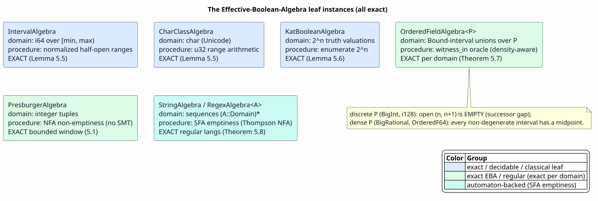

# Effective Boolean Algebra

Last updated: 2026-06-23

All symbols are defined in [Concepts and Glossary](01-concepts-and-glossary.md).
This document is the algebraic foundation: what an effective Boolean algebra (EBA)
is, the `BooleanAlgebra` trait that realizes it, the decision procedures it must
provide, why *minterms* make symbolic algorithms finite, and the concrete algebra
instances that populate the family.

## 1. Why predicates instead of symbols

A classical finite automaton labels each transition with a single symbol drawn
from a finite alphabet `Σ`. That is fine for `Σ = {a, b, c}` and hopeless for
`Σ = ℤ` or `Σ = char` or `Σ = {all process terms}`. A **symbolic** automaton
labels each transition with a *predicate* `φ` over a (possibly infinite) domain
`D`, and a transition fires on input `e` when `e ⊨ φ`.

To run the standard automaton algorithms — emptiness, intersection, complement,
determinization, equivalence — over predicates rather than symbols, the predicate
algebra must support a fixed set of *computable* operations. That algebra is an
**effective Boolean algebra** ([D'Antoni & Veanes, 2017](references.md#dantoni-veanes-2017)).

## 2. The formal object

> **Definition 2.1 (Effective Boolean Algebra).** An effective Boolean algebra is
> a tuple `𝓐 = (Φ, D, ⟦·⟧, ⊤, ⊥, ∧, ∨, ¬, sat, witness)` where:
> - `Φ` is a set of *predicates* and `D` a *domain* of elements;
> - `⟦·⟧ : Φ → 𝒫(D)` is the *denotation*, a homomorphism: `⟦⊤⟧ = D`, `⟦⊥⟧ = ∅`,
>   `⟦φ ∧ ψ⟧ = ⟦φ⟧ ∩ ⟦ψ⟧`, `⟦φ ∨ ψ⟧ = ⟦φ⟧ ∪ ⟦ψ⟧`, `⟦¬φ⟧ = D ∖ ⟦φ⟧`;
> - `sat : Φ → 𝔹` *decides* `⟦φ⟧ ≠ ∅`;
> - `witness : Φ → Option D` returns some `e ∈ ⟦φ⟧` when `sat(φ)`.
>
> "Effective" means each of `∧`, `∨`, `¬`, `sat`, `witness`, and the membership
> test `e ⊨ φ` is given by an algorithm.

The Boolean laws hold *up to denotation*: `⟦a ∧ ¬a⟧ = ∅`, `⟦a ∨ ¬a⟧ = D`,
commutativity, associativity, idempotence, absorption, and De Morgan all hold as
set identities. The mechanized version proves these as a setoid quotient by
denotational equivalence (about 28 derived identities, all `Qed`); the load-bearing
ones are stated and proved next.

### 2.1 The classical Boolean laws (the proof-home)

This is the proof-home for the effective-Boolean-algebra laws: each law the rest of
the suite cites is stated here as a Lemma or Proposition and proved in prose, with the
mechanizing Coq name given only as a parenthetical citation. The carrier is the
mechanized record `EBA` of `EffectiveBooleanAlgebra.v`: a domain `D`, a predicate
syntax `Φ`, the constructors `⊤, ⊥, ∧, ∨, ¬`, and three decision procedures
`eval : Φ → D → 𝔹`, `sat : Φ → 𝔹`, `wit : Φ → Option D`. Two predicates are
**denotationally equivalent**, written `p ≈ q`, when they evaluate alike everywhere:

`p ≈ q  :⟺  ∀d. eval p d = eval q d`

(mechanized as `equiv`, with notation `p ≈[A] q`). All Boolean identities below are
stated up to `≈`, because the Rust `and`/`or`/`not` are *syntactic* constructors that
are lawful only up to denotation. The proofs are uniform: unfold each side through the
homomorphism contract of Proposition 2.2, then decide the resulting Boolean expression
by truth table on the finitely-many values of `eval _ d`.

**Proposition 2.2 (the EBA contract — `eval` is a Boolean homomorphism; `sat`/`wit`
are sound and complete).** An EBA satisfies the laws `EBA_Laws`:

- **homomorphism:** `eval ⊤ d = true`, `eval ⊥ d = false`,
  `eval (p ∧ q) d = eval p d && eval q d`, `eval (p ∨ q) d = eval p d || eval q d`, and
  `eval (¬p) d = negb (eval p d)`;
- **`sat` sound and complete:** `sat p = true ⟹ ∃d. eval p d = true`, and conversely
  `eval p d = true ⟹ sat p = true`;
- **`wit` sound and total:** `wit p = Some d ⟹ eval p d = true`, and
  `sat p = true ⟹ ∃d. wit p = Some d`.

*Proof.* This is the contract that *defines* an effective Boolean algebra rather than a
theorem derived within one — it is the record `EBA_Laws` whose fields are exactly the
five homomorphism equations (`eval_top`, `eval_bot`, `eval_conj`, `eval_disj`,
`eval_neg`), the two satisfiability equations (`sat_sound`, `sat_complete`), and the two
witness equations (`wit_sound`, `wit_total`). Each shipped instance discharges these
fields when it is constructed; every law below is then derived from them. The contract
is consistent because it is inhabited — for instance by the two-element algebra
`D = unit`, `Φ = 𝔹`, `eval b _ = b`, `sat = id`, `wit true = Some tt`,
`wit false = None` — so assuming it introduces no contradiction. `∎`
(The record is `EBA_Laws` in `EffectiveBooleanAlgebra.v`, fields
`eval_top`/`eval_bot`/`eval_conj`/`eval_disj`/`eval_neg`, `sat_sound`/`sat_complete`,
`wit_sound`/`wit_total`.)

**Lemma 2.3 (excluded middle).** `p ∨ ¬p ≈ ⊤`.

*Proof.* Fix `d`. By the homomorphism (Proposition 2.2),
`eval (p ∨ ¬p) d = eval p d || negb (eval p d)` and `eval ⊤ d = true`. Decide on the
value of `eval p d`: if `true`, then `true || negb true = true || false = true`; if
`false`, then `false || negb false = false || true = true`. In both cases the left side
equals `true = eval ⊤ d`, so `p ∨ ¬p ≈ ⊤`. `∎` (Mechanized as `excluded_middle`.)

**Lemma 2.4 (non-contradiction).** `p ∧ ¬p ≈ ⊥`.

*Proof.* Fix `d`. By Proposition 2.2,
`eval (p ∧ ¬p) d = eval p d && negb (eval p d)` and `eval ⊥ d = false`. If
`eval p d = true`, then `true && negb true = true && false = false`; if `false`, then
`false && negb false = false && true = false`. Either way the left side is
`false = eval ⊥ d`, so `p ∧ ¬p ≈ ⊥`. `∎` (Mechanized as `non_contradiction`.)

**Lemma 2.5 (double negation).** `¬¬p ≈ p`.

*Proof.* Fix `d`. Applying the negation clause of Proposition 2.2 twice,
`eval (¬¬p) d = negb (negb (eval p d))`. The Boolean `negb` is an involution
(`negb (negb b) = b`, by cases `b = true` and `b = false`), so
`eval (¬¬p) d = eval p d`. Hence `¬¬p ≈ p`. `∎` (Mechanized as `double_neg`, using
`negb_involutive`.) This is the law that makes `¬` **involutive** — the defining mark
of the *classical* tier; the behavioral tier keeps only the one-directional
`p ≤ ¬¬p` ([12 Lemma 2.6](12-heyting-behavioral-logic.md)).

**Lemma 2.6 (De Morgan, conjunction).** `¬(p ∧ q) ≈ ¬p ∨ ¬q`.

*Proof.* Fix `d`. Through Proposition 2.2 the left side is
`negb (eval p d && eval q d)` and the right side is `negb (eval p d) || negb (eval q d)`.
These coincide by the four-row Boolean truth table for `negb (a && b) = negb a || negb b`:

| `eval p d` | `eval q d` | `negb(a && b)` | `negb a \|\| negb b` |
|---|---|---|---|
| `true`  | `true`  | `negb true = false`  | `false \|\| false = false` |
| `true`  | `false` | `negb false = true`  | `false \|\| true  = true`  |
| `false` | `true`  | `negb false = true`  | `true  \|\| false = true`  |
| `false` | `false` | `negb false = true`  | `true  \|\| true  = true`  |

Every row agrees, so `¬(p ∧ q) ≈ ¬p ∨ ¬q`. `∎` (Mechanized as `de_morgan_conj`; its
dual `¬(p ∨ q) ≈ ¬p ∧ ¬q` is `de_morgan_disj`.) Unlike the Heyting tier, **both**
directions and **both** De Morgan duals hold classically, because `¬` is involutive
(Lemma 2.5); the behavioral tier loses the `¬(p ∧ q)` direction
([12 §2.1](12-heyting-behavioral-logic.md)).

The remaining identities mentioned above — commutativity `conj_comm`/`disj_comm`,
associativity `conj_assoc`/`disj_assoc`, idempotence `conj_idem`/`disj_idem`,
absorption `absorb_conj_disj`/`absorb_disj_conj`, distributivity
`distrib_conj_disj`/`distrib_disj_conj`, and the unit/annihilator laws
`conj_top`/`disj_bot`/`conj_bot`/`disj_top` — are proved the same way (unfold through
Proposition 2.2, then truth-table) and are collected with their Coq names in §8. The
four derived analysis operators are then satisfiability queries over these laws:
`implies` is `decides_implies p q := negb (sat (p ∧ ¬q))` (correct by `implies_correct`),
`is_tautology` is `decides_tautology p := negb (sat (¬p))` (`tautology_correct`),
`overlaps` is `decides_overlaps p q := sat (p ∧ q)` (`overlaps_correct`), and
`equivalent` is their conjunction (`equivalent_correct`) — the bridge §3 draws from
algebra to analysis.

**Proposition 2.7 (every classical EBA is reject-safe).** Every EBA satisfying
`EBA_Laws` also satisfies the weaker **reject-safe** contract `RejectSafeLaws`: it keeps
the `∧`/`∨` homomorphism and the `sat`/`wit` soundness laws, and in place of the
classical involutive negation it has only the one-directional **reject-safe negation**
`eval (¬p) d = true ⟹ eval p d = false`. Thus the classical tier sits at the base of the
tower `BooleanAlgebra : HeytingAlgebra : RejectSafeAlgebra`, and every decidable algebra
drops into the reject-safe-bounded SFA/SFT machinery with no obligation of its own.

*Proof.* The conjunction/disjunction homomorphism and the `sat`/`wit` soundness laws are
shared verbatim between the two contracts. For reject-safe negation, assume
`eval (¬p) d = true`; by the classical negation clause (Proposition 2.2)
`eval (¬p) d = negb (eval p d)`, so `negb (eval p d) = true`, whence `eval p d = false`.
This is the substance; the full statement is the cross-referenced tower result. `∎`
This proposition is **proved in doc 12**: see
[12 — Proposition 6.2 (every classical EBA is reject-safe)](12-heyting-behavioral-logic.md);
it is mechanized as `eba_implies_reject_safe` (from the record `RejectSafeLaws`) in
`EffectiveBooleanAlgebra.v`. It is restated here, and not re-proved, because doc 12 is
the home of the reject-safe / Heyting tower, while this document is the home of the
classical laws it generalizes.

## 3. The trait

The Rust realization is `prattail/src/symbolic.rs::BooleanAlgebra`. It is the
single interface every automaton algorithm is written against:

```rust
pub trait BooleanAlgebra {
    type Predicate: Clone + Eq + Hash;
    type Domain;

    // constructors
    fn true_pred(&self) -> Self::Predicate;            // ⊤
    fn false_pred(&self) -> Self::Predicate;           // ⊥
    fn and(&self, a: &Self::Predicate, b: &Self::Predicate) -> Self::Predicate;  // ∧
    fn or(&self,  a: &Self::Predicate, b: &Self::Predicate) -> Self::Predicate;  // ∨
    fn not(&self, a: &Self::Predicate) -> Self::Predicate;                       // ¬ (involutive)

    // decisions
    fn is_satisfiable(&self, a: &Self::Predicate) -> bool;                       // sat
    fn witness(&self, a: &Self::Predicate) -> Option<Self::Domain>;
    fn evaluate(&self, a: &Self::Predicate, e: &Self::Domain) -> bool;           // e ⊨ φ

    // derived (default methods)
    fn implies(&self, a, b) -> bool { !self.is_satisfiable(&self.and(a, &self.not(b))) }
    fn equivalent(&self, a, b) -> bool { self.implies(a, b) && self.implies(b, a) }
    fn is_tautology(&self, a) -> bool { !self.is_satisfiable(&self.not(a)) }
    fn overlaps(&self, a, b) -> bool { self.is_satisfiable(&self.and(a, b)) }
}
```

The derived methods are the bridge from algebra to *analysis*: `implies` is
language inclusion of one guard in another, `overlaps` is dispatch ambiguity, and
`is_tautology` is "this guard always fires." Every one reduces to `is_satisfiable`,
which is why **satisfiability is the single decision procedure each instance must
get right**.

This trait is the *classical* tier — `not` is involutive (`¬¬a = a`) and
`is_satisfiable` is two-valued. The semi-decidable behavioral algebras live one
tier weaker and are introduced in
[05 — Algebra Pyramid and Decidability](05-algebra-pyramid-and-decidability.md);
everything in *this* document is classical.

## 4. Minterms: making the symbolic alphabet finite

Determinization and equivalence need to reason about "all the ways the guards on a
state's outgoing edges can be jointly satisfied." Enumerating `D` is impossible;
enumerating the **minterms** is not.

> **Definition 4.1 (Minterm).** Given a finite predicate set `Ψ = {φ₁, …, φₖ}`, a
> *minterm* is a satisfiable conjunction `ψ̃₁ ∧ … ∧ ψ̃ₖ` where each `ψ̃ᵢ` is either
> `φᵢ` or `¬φᵢ`. The set of minterms `Minterms(Ψ)` partitions `D`: every element
> falls in exactly one minterm, and within a minterm every element is treated
> identically by every guard in `Ψ`.

Minterms are the finite effective alphabet. The number of minterms is at most
`2ᵏ` but usually far fewer, because most sign combinations are unsatisfiable and
are pruned by `sat`. The construction is literate below.

> **Algorithm `Minterms` — partition the domain by a guard set.**
> *Input:* an EBA `𝓐` and a predicate set `Ψ = {φ₁, …, φₖ}`.
> *Output:* the satisfiable minterms partitioning `D`.
>
> ```
> Minterms(𝓐, Ψ):
>   frontier ← { ⊤ }                       ▷ start with the whole domain
>   for φ in Ψ:                            ▷ refine by one guard at a time
>     next ← ∅
>     for m in frontier:
>       for sign in { φ, ¬φ }:
>         c ← 𝓐.and(m, sign)
>         if 𝓐.is_satisfiable(c):          ▷ drop empty cells eagerly
>           next ← next ∪ { c }
>     frontier ← next
>   return frontier
> ```
>
> Each refinement at most doubles the cell count, and `is_satisfiable` prunes
> every empty cell immediately, so the live frontier stays small whenever the
> guards are mostly disjoint. The Rust entry point is `compute_minterms`
> (`symbolic.rs`).

With minterms in hand, determinization is classical subset construction over the
minterm alphabet, and equivalence is a product emptiness check — both detailed in
[03 — Symbolic Automata (SFA)](03-symbolic-automata-sfa.md).

## 5. The concrete instances



PlantUML source: [figures/02-eba-leaves.puml](figures/02-eba-leaves.puml).

Generalizing the framework "over all data types" is *populating the family of
EBA instances*, because every algorithm is already written against the trait. The
shipped instances:

| Instance | Domain `D` | Predicate shape | File |
|---|---|---|---|
| `IntervalAlgebra` | `i64` | unions of half-open ranges `[lo, hi)` | `symbolic.rs` |
| `CharClassAlgebra` | `char` | unions of Unicode ranges | `symbolic.rs` |
| `KatBooleanAlgebra` | propositional worlds | KAT `BooleanTest` formulas | `symbolic.rs` |
| `PresburgerAlgebra` | `ℤⁿ` | linear-integer-arithmetic formulas, decided by a binary-encoded NFA | `presburger.rs` |
| `StringAlgebra` | `String` | regular languages, as an SFA over `char` | `string_algebra.rs` / `regex_sfa.rs` |
| `OrderedFieldAlgebra<P>` | `BigInt`/`BigRat`/`Fixed`/`Float` | interval unions with `±∞` endpoints, density-aware witnesses | `ordered_field.rs` |
| `ProductAlgebra<A,B>` | `D_A × D_B` | classical cartesian-product predicates | `symbolic.rs` |
| `BagAlgebra<A>` / `MapAlgebra<K,V>` / `ListAlgebra<A>` | multisets / maps / sequences | per-minterm count vectors / key×value / SFA | `collection_algebra.rs` |
| `TreeAlgebra<A>` | ranked trees | "constructor `c` ∧ payload ⊨ φ ∧ childᵢ ⊨ φᵢ" | `sym_tree.rs` |
| `AnyAlgebra` | any of the above | a closed-enum uniform carrier | `any_algebra.rs` |

> **Note on satisfiability — automata, not SMT.** The integer instances decide
> satisfiability *automata-theoretically*, not via an external SMT solver. A
> Presburger predicate is compiled to a remainder NFA over the binary encoding of
> its integers ([Büchi, 1960](references.md#buchi-1960);
> [Bartzis & Bultan, 2003](references.md#bartzis-bultan-2003)); `is_satisfiable`
> is NFA non-emptiness (`is_satisfiable_nfa`, `presburger.rs`). There is no Z3 in
> this path. (The substrate *does* ship a Z3/SMT backend, but only as a
> `Sat3`-only secondary gap-filler for the mixed bit-vector guards the automata
> cannot express — [13 §2.1](13-constraint-theory-engine.md); it is never the
> integer decision procedure here.) This is a deliberate trade documented in
> `prattail/docs/design/constraint-theories/why-automata-instead-of-solvers.md`:
> automata give closure and exactness over the *whole* algebra (complement,
> projection, equivalence), which a solver's per-query yes/no cannot.

### 5.1 The Presburger instance, proved (no SMT solver)

This is the proof-home for the **Presburger instance**, the canonical witness that an
EBA need not call out to a solver. A Presburger-definable set is a decidable subset of
`ℤ`, so the mechanized model in `PresburgerBooleanAlgebra.v` takes the predicate type
to be Boolean-valued functions and the equivalence to be pointwise equality:

`Pred := ℤ → bool`,  `P ≈ Q  :⟺  ∀z. P z = Q z`

(mechanized as `Pred` and `pred_eq`). The Boolean-valued reading *is* decidability:
`P z` is precisely NFA acceptance of the binary encoding of `z`
([Büchi, 1960](references.md#buchi-1960)), and the three Boolean constructors are the
three NFA constructions —

| Boolean op | Definition (`P, Q : Pred`) | NFA construction (`presburger.rs`) |
|---|---|---|
| `P ∧ Q` (`pred_and`) | `fun z ⟼ P z && Q z` | product / intersection (`intersect_nfa`) |
| `P ∨ Q` (`pred_or`) | `fun z ⟼ P z \|\| Q z` | product / union (`union_nfa`) |
| `¬P` (`pred_not`) | `fun z ⟼ negb (P z)` | determinize + complement (`complement_nfa`) |

with `⊤ := fun _ ⟼ true` (`pred_true`, universal acceptance) and
`⊥ := fun _ ⟼ false` (`pred_false`, empty NFA). Satisfiability is NFA non-emptiness
(`is_satisfiable_nfa`), so no Z3 ever appears *in the Presburger path* (the optional
Z3/SMT backend of [13 §2.1](13-constraint-theory-engine.md) is a separate, `Sat3`-only
gap-filler). The first obligation is that each NFA op
**coincides definitionally** with its Boolean op.

**Lemma 5.1 (NFA Boolean ops are the Boolean ops).** For all `P, Q : Pred` and `z : ℤ`,

`(P ∧ Q) z = P z && Q z`,  `(P ∨ Q) z = P z || Q z`,  `(¬P) z = negb (P z)`.

*Proof.* Each holds by unfolding the corresponding definition: `pred_and P Q z` is
`P z && Q z` by the definition of `pred_and`, and likewise `pred_or P Q z` is
`P z || Q z` and `pred_not P z` is `negb (P z)`, each immediately by `reflexivity`. So
the product NFA's acceptance is exactly `&&`, the union NFA's is exactly `||`, and the
complement NFA's is exactly `negb`. `∎` (Mechanized as `nfa_intersect_correct`,
`nfa_union_correct`, `nfa_complement_correct`.)

Because the ops are literally `&&`, `||`, `negb` on `ℤ → bool`, the Boolean-algebra laws
reduce — as in §2.1 — to truth tables on the finitely many values of `P z, Q z, R z`.

**Lemma 5.2 (complement annihilation and excluded middle).**
`P ∧ ¬P ≈ ⊥` and `P ∨ ¬P ≈ ⊤`.

*Proof.* Fix `z` and decide on `P z`. For annihilation,
`(P ∧ ¬P) z = P z && negb (P z)`, which is `true && false = false` when `P z = true` and
`false && true = false` when `P z = false`; either way it equals `⊥ z = false`. For
excluded middle, `(P ∨ ¬P) z = P z || negb (P z)`, which is `true || false = true` when
`P z = true` and `false || true = true` when `P z = false`; either way it equals
`⊤ z = true`. `∎` (Mechanized as `complement_and` and `complement_or`. The NFA reading:
intersecting an automaton with its complement gives the empty automaton, and their
union gives the universal automaton.)

**Lemma 5.3 (De Morgan).** `¬(P ∧ Q) ≈ ¬P ∨ ¬Q` and `¬(P ∨ Q) ≈ ¬P ∧ ¬Q`.

*Proof.* Fix `z`. For the first, `(¬(P ∧ Q)) z = negb (P z && Q z)` and
`(¬P ∨ ¬Q) z = negb (P z) || negb (Q z)`, equal by the four-row truth table for
`negb (a && b) = negb a || negb b` (the table of Lemma 2.6, with `a := P z`, `b := Q z`).
For the second, `(¬(P ∨ Q)) z = negb (P z || Q z)` and
`(¬P ∧ ¬Q) z = negb (P z) && negb (Q z)`, equal by the dual table
`negb (a || b) = negb a && negb b`. Both directions of both duals hold because `negb` is
classical here. `∎` (Mechanized as `de_morgan_and` and `de_morgan_or`.)

**Lemma 5.4 (distributivity).**
`P ∧ (Q ∨ R) ≈ (P ∧ Q) ∨ (P ∧ R)` and `P ∨ (Q ∧ R) ≈ (P ∨ Q) ∧ (P ∨ R)`.

*Proof.* Fix `z`. Each side unfolds (Lemma 5.1) to a Boolean expression over the three
values `P z, Q z, R z`; exhausting the `2³ = 8` assignments shows the two sides agree in
every row. For instance with `P z = true` the meet-over-join law reduces to
`true && (Q z || R z) = (true && Q z) || (true && R z)`, i.e. `Q z || R z` on both sides;
with `P z = false` both sides are `false`. The join-over-meet law is the dual
enumeration. `∎` (Mechanized as `distributivity_and_or` and `distributivity_or_and`.)

The remaining Presburger laws — commutativity `and_comm`/`or_comm`, associativity
`and_assoc`/`or_assoc`, absorption `absorption_and_or`/`absorption_or_and`,
idempotence `and_idempotent`/`or_idempotent`, the unit/annihilator laws
`and_true`/`or_false`/`and_false`/`or_true`, and double negation `double_negation`
(`¬¬P ≈ P`, by involution of `negb`) — close the Boolean algebra and are proved by the
identical truth-table method; their Coq names are collected in §8. Together they
establish that the NFA-defined Presburger predicates form a Boolean algebra **purely
automata-theoretically**, which is what lets `complement`, projection, and equivalence
be exact over the whole algebra rather than a per-query solver verdict.

### 5.2 The interval instance — `IntervalAlgebra`

The bounded-integer leaf is `IntervalAlgebra` (`prattail/src/symbolic.rs`), the algebra
the live `SortRegistry::scalars` constructor instantiates for the `Int` sort
(`r.insert(Sort::Int, AnyAlgebra::Int(IntervalAlgebra::new(int_lo, int_hi)))` in
`any_algebra.rs`). It is the workhorse for every bounded machine-integer width, all of
which collapse to `Sort::Int` ([§6](#6-the-uniform-carrier-anyalgebra)).

**Domain.** A configured half-open universe `U = [min_val, max_val)` of `i64` values;
membership of any `e` outside `U` is *false* by construction (`evaluate` short-circuits
`e < min_val ∨ e ≥ max_val` to `false` before consulting the ranges).

**Predicate normal form.** A predicate is the syntax `IntervalPred = True | False |
Range(lo, hi) | Union(ranges) | Not(inner)`; its denotation is a **finite union of
half-open ranges** clipped to the universe. The function `normalize` maps any predicate
to the canonical sorted, non-overlapping list of ranges `⟦φ⟧ ⊆ U`: `True ↦ [(min_val,
max_val)]`, `False ↦ []`, a `Range(lo, hi)` is clipped to `[max(lo, min_val),
min(hi, max_val))` (dropped if empty), a `Union` is clipped, sorted, and merged
(`merge_ranges` coalesces overlapping or *adjacent* ranges, since `lo ≤ cur_hi`
extends the run), and `Not(inner)` is the gap-walk complement within `U`
(`complement_ranges`).

**The operations as set operations.** With both operands normalized to range lists:
`and` is interval **intersection** (`intersect_ranges`, the standard merge that emits
`[max(loₐ, lo_b), min(hiₐ, hi_b))` whenever non-empty), `or` is interval **union**
(`union_ranges`, concatenate-sort-merge), and `not` is **complement in `U`**
(`complement_ranges`, walking the gaps between the sorted ranges from `min_val` to
`max_val`). These compute `⟦φ⟧ ∩ ⟦ψ⟧`, `⟦φ⟧ ∪ ⟦ψ⟧`, and `U ∖ ⟦φ⟧` exactly on unions of
half-open intervals.

**Decision procedure.** `is_satisfiable(φ)` normalizes and tests the resulting list
non-empty; `witness(φ)` returns `lo` of the first (smallest) range. Both are read
directly off the canonical form.

**Complexity.** `normalize` sorts the `k` input ranges in `O(k log k)` and merges in
`O(k)`; `is_satisfiable` and `witness` are then `O(1)` on the normalized list. So every
operation is linear (up to the sort) in the number of ranges, independent of `|U|`.

**Lemma 5.5 (`IntervalAlgebra` is exact).** After normalization, `sat(φ) ⟺ ⟦φ⟧ ≠ ∅`,
and when `sat(φ)` holds, `witness(φ) = lo ∈ ⟦φ⟧` where `lo` is the lower endpoint of the
first range.

*Proof.* The three range procedures realize the Boolean homomorphism of Proposition 2.2
on unions of half-open intervals: `intersect_ranges` emits exactly the points common to
two range lists, so it computes `∩`; `union_ranges` concatenates then merges, so it
computes `∪`; `complement_ranges` walks the cursor from `min_val` across each range's
upper endpoint to `max_val`, emitting precisely the uncovered sub-intervals, so it
computes `U ∖ ·`. Normalization (clip, sort, merge) yields the unique canonical
representative of `⟦φ⟧`, in which every listed range satisfies `lo < hi` (empty ranges
are dropped) and distinct ranges are separated by a non-empty gap. Hence the list is
empty **iff** `⟦φ⟧ = ∅`, which is exactly `is_satisfiable`'s test; this gives
`sat(φ) ⟺ ⟦φ⟧ ≠ ∅`. When the list is non-empty its first range `[lo, hi)` has
`lo < hi`, so `lo` is a member of that range and therefore `lo ∈ ⟦φ⟧`; `witness`
returns this `lo`. `∎`

### 5.3 The character-class instance — `CharClassAlgebra`

`CharClassAlgebra` (`prattail/src/symbolic.rs`) is the `Char`-sort leaf
(`r.insert(Sort::Char, AnyAlgebra::Char(CharClassAlgebra::new()))`). It is **the
identical range engine as §5.2, transported to `u32`**: the domain is the Unicode scalar
universe `['\0', char::MAX]`, predicates `CharClassPred = True | False | Range(lo, hi) |
Union | Not` denote finite unions of *inclusive* character ranges `[lo, hi]`, and
`normalize_u32` maps each inclusive `(char, char)` range to the half-open `u32` interval
`[lo as u32, (hi as u32) + 1)` over the universe `[0, (char::MAX as u32) + 1)`. With
that single encoding the `and`/`or`/`not` are again interval intersect / union /
complement-in-universe (`intersect_u32_ranges`, `union_u32_ranges`,
`complement_u32_ranges`), and `from_u32_ranges` converts each half-open `u32` result
`[lo, hi)` back to the inclusive character pair `(lo, hi − 1)` (skipping the surrogate
gap, which `char::from_u32` rejects). Because the half-open `u32` engine is exactly the
one of §5.2, the exactness of **Lemma 5.5** applies verbatim: `sat(φ) ⟺ ⟦φ⟧ ≠ ∅`, and
`witness(φ)` is the character at the lower endpoint of the first range. So
`CharClassAlgebra` decides character classes exactly — `is_satisfiable` reports class
emptiness and `witness` produces a concrete member character — in `O(k log k)` for `k`
ranges.

### 5.4 The propositional-test instance — `KatBooleanAlgebra`

`KatBooleanAlgebra` (`prattail/src/symbolic.rs`) is the `Bool`-sort leaf
(`r.insert(Sort::Bool, AnyAlgebra::Bool(KatBooleanAlgebra::new(bool_atoms)))`); it is the
bridge to the Kleene-algebra-with-tests (KAT) layer, whose guard syntax is propositional.

**Domain.** Over a finite atom set `{p₁, …, pₙ}` (the algebra's `atoms` field), the
domain is the `2ⁿ` truth assignments `{0, 1}ⁿ`, represented as
`HashMap<String, bool>`; an atom absent from an assignment reads as `false`.

**Predicate normal form.** A predicate is a propositional KAT test `BooleanTest = True |
False | Atom(name) | Not(t) | And(t, t) | Or(t, t)`; its denotation `⟦φ⟧ ⊆ {0, 1}ⁿ` is
the set of **satisfying valuations**, evaluated atom-by-atom by `eval_test_public`.

**The operations as set operations.** `and`, `or`, `not` wrap the test AST in
`BooleanTest::And` / `Or` / `Not`; under `⟦·⟧` these are the pointwise `∩`, `∪`, and
complement on `{0, 1}ⁿ`, because `eval_test_public` interprets the three connectives as
`&&`, `||`, and `!` at every valuation.

**Decision procedure.** `all_valuations` enumerates the `2ⁿ` assignments (bit `i` of the
counter sets atom `i`); `is_satisfiable(φ)` returns whether *any* valuation evaluates
the test true; `witness(φ)` returns the first such valuation. The search is exhaustive,
hence both sound and complete.

**Complexity.** `O(2ⁿ · |φ|)` time and `O(2ⁿ · n)` space to materialize the valuation
table — exponential in the atom count, but `n` is small for the KAT bridge (typically
under ten atoms), so the table is tiny in practice.

**Lemma 5.6 (`KatBooleanAlgebra` is exact).** `sat(φ) ⟺ ∃ valuation v. v ⊨ φ`, decided
by enumerating all `2ⁿ` valuations, and `witness(φ)` returns the first satisfying `v`.

*Proof.* The domain `{0, 1}ⁿ` is finite with exactly `2ⁿ` elements, and
`all_valuations` constructs every one of them (the counter ranges over `0 … 2ⁿ − 1`, and
distinct counters give distinct atom-bit patterns). Evaluation `eval_test_public` is the
exact denotational reading of the test — `True`/`False` are constants, `Atom(name)` is a
lookup, and `Not`/`And`/`Or` are `!`/`&&`/`||` — so `v ⊨ φ ⟺ eval_test_public(φ, v) =
true`. The predicate `is_satisfiable` is the existential over this finite, fully
enumerated domain, so it is `true` **iff** some `v ⊨ φ`; this is both sound (a reported
`true` exhibits a witness) and complete (no satisfying valuation is skipped). The
returned `witness` is the first enumerated `v` with `v ⊨ φ`, which therefore lies in
`⟦φ⟧`. `∎`

### 5.5 The ordered-field instance — `OrderedFieldAlgebra<P>` (the priority leaf)

`OrderedFieldAlgebra<P>` (`prattail/src/ordered_field.rs`) is the **density-aware
generalization of §5.2 to an unbounded, point-generic universe**, and the live registry
instantiates it for *four* scalar sorts at once — `BigInt`, `BigRat`, `Fixed`, and
`Float` all map to it (`AnyAlgebra::BigInt(OrderedFieldAlgebra::new())`, and likewise
`BigRat`/`Fixed`/`Float`). It is the priority leaf because it covers the
arbitrary-precision and approximate numeric domains the calculus actually computes over.

**Domain.** A totally-ordered point type `P` (the `OrderedPoint` trait), instantiated at
`BigInt` (discrete, arbitrary precision), `BigRational` (dense exact rationals — also the
carrier for fixed-point decimals, whose value is `unscaled / 10^places`), `OrderedF64`
(a total order over `f64` via `total_cmp`), and `i128` (discrete, bounded machine
integer). The universe is the whole of `P`, unbounded in both directions.

**Predicate normal form.** A predicate is a normalized (sorted, disjoint,
maximally-merged) **finite union of intervals** whose endpoints are `Bound`s — `Bound =
NegInf | PosInf | Incl(p) | Excl(p)` — so open/closed and `±∞` endpoints are all
representable; the empty `Vec` is `⊥` and `[(NegInf, PosInf)]` is `⊤`. The denotation
`⟦φ⟧ ⊆ P` is the union of the points the intervals contain. Normalization
(`from_intervals`) is **density-aware**: it drops any interval that `witness_in` reports
empty for `P`, then merges two neighbours when they overlap **or** the gap between them
contains no point of `P`.

**The operations as set operations.** `and` is interval **intersection** (`intersect`,
taking the later lower bound and earlier upper bound of each pair via the endpoint
comparators `cmp_lower` / `cmp_upper`), `or` is interval **union** (`union`, concatenate
then `from_intervals`), and `not` is **complement** (`complement`, walking the gaps with
`flip_upper_to_lower` / `flip_lower_to_upper` to turn each covered interval's boundary
into the adjacent gap's boundary). These realize `∩`, `∪`, and `P ∖ ·` on the
totally-ordered line of `Bound` endpoints.

**Decision procedure — the single oracle.** Every emptiness, witness, and gap question
routes through one density-aware method, `OrderedPoint::witness_in(lo, hi)`, which
returns a representative point of the interval `(lo, hi)` honoring the endpoints'
inclusivities, or `None` when the interval contains no point of `P`. `is_satisfiable(φ)`
is `first_witness(φ).is_some()`; `witness(φ)` is `first_witness(φ)`, the first
`witness_in` success over the normalized intervals. That one method per point type is
what makes `not` and the merge correct on **both** discrete and dense domains with
shared code.

**Complexity.** Intersection is `O(m · k)` for `m`, `k` interval counts; union and
complement are `O((m + k) log(m + k))` (the normalizing sort dominates); each
`witness_in` is `O(1)` arithmetic (a successor, predecessor, or midpoint) in the point
type's own cost model (`O(1)` for `i128`/`f64`, bigint-arithmetic-bounded for
`BigInt`/`BigRational`).

**Theorem 5.7 (`OrderedFieldAlgebra<P>` is a density-aware exact EBA).** `sat(φ) ⟺
⟦φ⟧ ≠ ∅`, `witness(φ) ∈ ⟦φ⟧`, and `witness_in` decides interval emptiness correctly for
the density of `P`: over a **discrete** `P` (`BigInt`, `i128`) the open interval
`(n, n+1)` is **empty**, while over a **dense** `P` (`BigRational`, `OrderedF64`) every
non-degenerate interval is inhabited.

*Proof.* The `Bound` operations realize `∩`, `∪`, and complement on the totally-ordered
line: `cmp_lower` / `cmp_upper` order endpoints so that `intersect` keeps the larger
lower and smaller upper bound (the meet of two intervals), `union` concatenates before
re-normalizing (the join), and `complement` walks a cursor from `NegInf` across each
covered interval's upper endpoint (turning it into the adjacent gap's lower bound via
`flip_upper_to_lower`) and emits every uncovered run up to `PosInf` — the gap below the
first interval, the gaps between consecutive intervals, and the trailing gap to `PosInf`
— which is exactly `P ∖ ⟦φ⟧`. Emptiness is delegated to `witness_in`. For a
**discrete** `P`,
`witness_in` computes the effective inclusive minimum from the lower bound (`Excl(a) ↦
a + 1`, `Incl(a) ↦ a`) and the effective inclusive maximum from the upper bound
(`Excl(b) ↦ b − 1`, `Incl(b) ↦ b`), and returns the minimum **iff** `min ≤ max`; so the
open interval `(n, n+1)` gives `min = n + 1` and `max = (n + 1) − 1 = n`, whence
`min = n + 1 > n = max` forces `None` — exactly the empty successor gap. For a **dense**
`P`, a non-empty open interval `(lo, hi)` with `lo < hi` has the strict midpoint
`(lo + hi)/2` (rationals) or a next-representable float `lo.next_up()` strictly between
the endpoints, so `witness_in` returns a member and the interval is inhabited. Since
`from_intervals` drops every `witness_in`-empty interval, the normalized list is empty
**iff** `⟦φ⟧ = ∅`, giving `sat(φ) ⟺ ⟦φ⟧ ≠ ∅`; and `first_witness` returns the first
`witness_in` success, which lies in its interval and hence in `⟦φ⟧`. Both `sat` and
`witness` are therefore exact, per domain density. `∎`

**Worked example (density changes the answer).** The union `[1,2] ∪ [3,4]` collapses to
`[1,4]` over `BigInt` — the gap `(2, 3)` has `witness_in(Excl(2), Excl(3)) = None`
(`min = 3 > 2 = max`), so `from_intervals` merges the two intervals — but stays **split**
over `BigRational`, because `witness_in(Excl(2), Excl(3))` returns the midpoint
`5/2 = 2.5` (since `2 < 5/2 < 3`), so the gap is non-empty and the neighbours do not
merge. The same predicate syntax denotes a single interval over the integers and two
intervals over the rationals; the oracle, not the interval algebra, carries the density.

### 5.6 The string instance — `StringAlgebra` / `RegexAlgebra<A>`

`StringAlgebra` (`prattail/src/string_algebra.rs`) is the `Str`-sort leaf
(`r.insert(Sort::Str, AnyAlgebra::Str(StringAlgebra::new()))`); it is the specialization
`RegexAlgebra<CharClassAlgebra>` (`prattail/src/regex_sfa.rs`) with a `String` domain and
character-oriented conveniences. The general `RegexAlgebra<A>` is the **list/sequence
algebra over any element algebra `A`** — the same engine the collection layer uses for
`List` ([05 §7](05-algebra-pyramid-and-decidability.md)).

**Domain.** Sequences `(A::Domain)*` of elements drawn from the element algebra `A`; for
`StringAlgebra` the elements are characters, so the domain is `String` (a sequence of
Unicode scalars).

**Predicate normal form.** A predicate is a **symbolic regular expression** over `A`:
`RegexPred<P> = Empty | Epsilon | Elem(P) | Length(lo, hi) | Concat | Alt | Star | Inter
| Compl`, where each character class `Elem(P)` is an element predicate `P = A::Predicate`
(for strings, a `CharClassPred`). Its denotation `⟦φ⟧` is the regular language it
defines. The predicate compiles — via a Thompson `ε`-NFA, `ε`-eliminated by closure — to
a `SymbolicAutomaton<A>` (an SFA, [03](03-symbolic-automata-sfa.md)) whose transitions
carry element predicates of `A` as guards.

**The operations as set operations.** `and`, `or`, `not` build `RegexPred::Inter`,
`Alt`, `Compl`; under compilation these are the SFA **intersection**, **union**, and
**complement** (the `SymbolicAutomaton` closures `intersect` / `union` / `complement`),
which realize `∩`, `∪`, and `Σ* ∖ ·` on regular languages.

**Decision procedure.** `is_satisfiable(φ)` compiles `φ` and tests SFA non-emptiness
(`!compile(…).is_empty()`), where `is_empty` is **breadth-first reachability of an
accepting state through satisfiable guards** (a transition is traversable when its guard
predicate is satisfiable in `A`). `witness(φ)` is `shortest_accepted`, the shortest
accepted word, produced by the same BFS materializing one concrete element per traversed
guard via `A::witness`. `evaluate(φ, xs)` simulates the SFA on the sequence `xs`.

**Complexity.** Compilation is linear in `|φ|` for the regex operators; `Inter` and
`Compl` invoke SFA product and determinization (worst-case exponential in the automaton
size for complement, as for classical NFAs), after which emptiness and the
shortest-word witness are BFS over the product automaton, linear in its states and
transitions. Exactness holds whenever the element algebra `A` is exact.

**Theorem 5.8 (`RegexAlgebra<A>` is a regular-language EBA).** Regular languages over
`A` are closed under `∩`, `∪`, and complement, so `RegexAlgebra<A>` is an EBA; `sat(φ)
⟺ L(φ) ≠ ∅`, decided by SFA emptiness (reachability of an accepting state by BFS), and
`witness(φ)` is the shortest accepted word; the algebra is exact when `A` is exact.

*Proof.* The Thompson construction realizes the regex operators on the `ε`-NFA: `Empty`
and `Epsilon` are the one-state automata for `∅` and `{[]}`, `Elem(c)` is the single
guarded edge, and `Concat`, `Alt`, `Star` are the standard `ε`-linkages; `ε`-closure
then yields an SFA over `A`. The predicate-labeled SFA closures realize the Boolean
operators: `Inter` compiles to the guard-conjoined SFA product `sa.intersect(&sb)`
(computing `∩`), `Compl` compiles to the SFA `complement`, which determinizes over the
minterm alphabet of [03 §6](03-symbolic-automata-sfa.md) and flips accepting states
(computing `Σ* ∖ ·`), and `Alt` is the Thompson disjoint-sum of the two `ε`-NFAs, merging
their initial and accepting sets (computing `∪`); regular languages over an effective
Boolean algebra are closed under all three
([D'Antoni & Veanes, 2017](references.md#dantoni-veanes-2017)).
A language is non-empty **iff** some accepting state is reachable from an initial state
along satisfiable guards — decidable by the breadth-first search of `is_empty`, since the
automaton is finite and a guard is traversable exactly when satisfiable in `A`; this is
`is_satisfiable`. The same search, recording one `A::witness` element per traversed
guard, returns a shortest accepted word, which is a member of `L(φ)`; this is `witness`.
Each step appeals to `A`'s own `is_satisfiable` / `witness`, so the construction is exact
precisely when `A` is. `∎` (For the tree- and word-automaton background, see
[tata](references.md#tata).)

### 5.7 The carriers and the bridges

The six §5.2–§5.6 leaves are the *scalar* and *sequence* base of the family. The
**carriers** that close the family under the type constructors — product, sum,
collection (bag/map/list), tree, and theory combination — are each proved to be an EBA
in [05 §7](05-algebra-pyramid-and-decidability.md) (Theorems 7.2–7.6), so the SFA/SFT
algorithms run over them unchanged. The two **bridges** that present a non-numeric
analysis as a `BooleanAlgebra` — `TypeSystemAlgebra<S>` (refinement-type dispatch,
`prattail/src/type_system/refinement.rs`) and `DispatchAlgebra` (grammar dispatch
disambiguation, `prattail/src/predicate_dispatch/mod.rs`) — feed the same SFA machinery
and are documented with the dispatch analysis they serve in
[03 §8](03-symbolic-automata-sfa.md).

## 6. The uniform carrier `AnyAlgebra`

`prattail/src/any_algebra.rs` provides a single **closed-enum** carrier so that
one concrete `Predicate`/`Domain` pair drops directly into the SFA/SFT/tree
machinery by `match` dispatch — with **no `dyn`** (which would break the `Eq +
Hash` bounds the automata require and inject allocation into the hot path), and it
is the only design that lets a tree node's heterogeneous children share one
algebra.

- `AnyDomain` carries 8 scalar leaves (`Int`, `Char`, `Bool`, `BigInt`, `BigRat`,
  `Fixed`, `Float`, `Str`) plus 6 combinator variants (`Product`, `Sum`, `List`,
  `Bag`, `Map`, `Tree`); the `Sum` and `Tree` payloads are boxed to keep the enum
  finitely sized.
- `AnyPred` / `AnyAlgebra` mirror the domain. `fold_pred` is the many-sorted
  projection: a predicate of sort `Int` evaluated against a `Bool` element folds
  to `⊥` (a sort mismatch is *unsatisfiable*, not a type error). This projection is
  mechanized zero-admission as `fold_all_foreign_unsat` (foreign sort `⊥`) and
  `wrapper_eval_faithful` / `wrapper_sat_faithful` (the wrapper agrees with the bare
  leaf) in `AnyAlgebraProjectionSound.v`
  ([10 §2.1](10-formal-verification-and-tests.md)).
- A `Sort` registry (`Native(NativeKind) | Category | Tuple | Sum | List | Bag |
  Map`) indexes each language type to its algebra; `SortRegistry::from_grammar`
  derives the family from the `language!` `NativeKind`s and grammar categories,
  with **no hard-coded category list** — the boundary contract with the backend.

The closure constructors (`ProductAlgebra`, `SumAlgebra`, `BagAlgebra`,
`MapAlgebra`, `ListAlgebra`, `TreeAlgebra`) and the tower discipline they live in
are covered in [05](05-algebra-pyramid-and-decidability.md); each is itself a
`BooleanAlgebra` (or a reject-safe algebra), so the SFA/SFT code is reused verbatim
and the algebra-agnostic Coq proofs apply unchanged.

The carrier is wired into the live guard pipeline behind the `any-algebra-carrier`
Cargo feature, **off by default** (the default build is byte-identical), so the
uniform projection *augments* the per-leaf analyses rather than replacing them.

## 7. What this buys the rest of the suite

Because the EBA fixes a *small, computable* interface and the family is *closed*
under the type constructors, three things follow that the later documents rely on:

1. **One automaton library, every data type.** [03](03-symbolic-automata-sfa.md)
   and [04](04-symbolic-transducers-sft-stft.md) describe the algorithms once;
   they run over integers, characters, processes, bags, and trees unchanged.
2. **Analysis is satisfiability.** Guard overlap, subsumption, dead-guard, and
   ambiguity lints are all `is_satisfiable` queries — see the dispatch and
   disambiguation use in [07](07-language-to-rholang-integration.md).
3. **The classical/semi-decidable split is a type, not a convention.** Only the
   classical tier offers an involutive `not`; the behavioral algebras cannot, and
   the tower in [05](05-algebra-pyramid-and-decidability.md) enforces that at
   compile time.

## 8. The mechanized account

Every result stated above is collected here against its Coq witness, including the
laws cited but not individually re-proved (those proved by the same truth-table method
as their named siblings). All theories are zero-admission; build the EBA tier with
`make -C formal check-capped FORMAL_CAPPED_TARGET=rocq-symbolic-algebra` and the
Presburger tier with `=rocq-presburger`. Both files end with `Print Assumptions` /
`All proofs are COMPLETE` sentinels.

| Result (here) | Coq witness | File |
|---|---|---|
| Definition of `≈` (denotational equivalence) | `equiv` (notation `≈[A]`) | `EffectiveBooleanAlgebra.v` |
| Proposition 2.2 (the EBA contract / Boolean homomorphism, `sat`/`wit` sound+complete) | record `EBA_Laws`: `eval_top`, `eval_bot`, `eval_conj`, `eval_disj`, `eval_neg`, `sat_sound`, `sat_complete`, `wit_sound`, `wit_total` | `EffectiveBooleanAlgebra.v` |
| Lemma 2.3 (excluded middle) | `excluded_middle` | `EffectiveBooleanAlgebra.v` |
| Lemma 2.4 (non-contradiction) | `non_contradiction` | `EffectiveBooleanAlgebra.v` |
| Lemma 2.5 (double negation) | `double_neg` (via `negb_involutive`) | `EffectiveBooleanAlgebra.v` |
| Lemma 2.6 (De Morgan, conjunction) and its dual | `de_morgan_conj`, `de_morgan_disj` | `EffectiveBooleanAlgebra.v` |
| Remaining EBA identities (commutativity, associativity, idempotence, absorption, distributivity, units/annihilators) | `conj_comm`, `disj_comm`, `conj_assoc`, `disj_assoc`, `conj_idem`, `disj_idem`, `absorb_conj_disj`, `absorb_disj_conj`, `distrib_conj_disj`, `distrib_disj_conj`, `conj_top`, `disj_bot`, `conj_bot`, `disj_top` | `EffectiveBooleanAlgebra.v` |
| Derived analysis operators (`implies`/`is_tautology`/`overlaps`/`equivalent`) | `decides_implies`/`implies_correct`, `decides_tautology`/`tautology_correct`, `decides_overlaps`/`overlaps_correct`, `decides_equivalent`/`equivalent_correct`; helpers `sat_false_iff_empty`, `sat_true_iff_inhabited` | `EffectiveBooleanAlgebra.v` |
| Proposition 2.7 (every classical EBA is reject-safe) — *proved in [12 Prop 6.2](12-heyting-behavioral-logic.md)* | record `RejectSafeLaws`; `eba_implies_reject_safe` (and `wit_none_of_unsat`) | `EffectiveBooleanAlgebra.v` |
| Presburger model (`Pred := ℤ → bool`, `pred_eq`) and ops | `Pred`, `pred_eq`, `pred_and`, `pred_or`, `pred_not`, `pred_true`, `pred_false` | `PresburgerBooleanAlgebra.v` |
| Lemma 5.1 (NFA ops are the Boolean ops) | `nfa_intersect_correct`, `nfa_union_correct`, `nfa_complement_correct` | `PresburgerBooleanAlgebra.v` |
| Lemma 5.2 (complement annihilation, excluded middle) | `complement_and`, `complement_or` | `PresburgerBooleanAlgebra.v` |
| Lemma 5.3 (De Morgan) | `de_morgan_and`, `de_morgan_or` | `PresburgerBooleanAlgebra.v` |
| Lemma 5.4 (distributivity) | `distributivity_and_or`, `distributivity_or_and` | `PresburgerBooleanAlgebra.v` |
| Remaining Presburger laws (commutativity, associativity, absorption, idempotence, units/annihilators, double negation) | `and_comm`, `or_comm`, `and_assoc`, `or_assoc`, `absorption_and_or`, `absorption_or_and`, `and_idempotent`, `or_idempotent`, `and_true`, `or_false`, `and_false`, `or_true`, `double_negation` | `PresburgerBooleanAlgebra.v` |
| The `AnyAlgebra` uniform-carrier projection (foreign sort `⊥` unsatisfiable, wrapper faithful, product/sum layers EBA) | `fold_all_foreign_unsat`, `wrapper_eval_faithful`, `wrapper_sat_faithful`, `carrier_product_layer_is_eba`, `carrier_sum_layer_is_eba` | `AnyAlgebraProjectionSound.v` |

The minterm construction (Definition 4.1 and the `Minterms` algorithm of §4) is **not**
a Coq theorem but an algorithm; its implementation is `compute_minterms`
(`prattail/src/symbolic.rs`), and its correctness obligation — that the live cells
partition `D` — is the partition property stated in Definition 4.1, used by the
determinization and equivalence procedures of [03](03-symbolic-automata-sfa.md).
