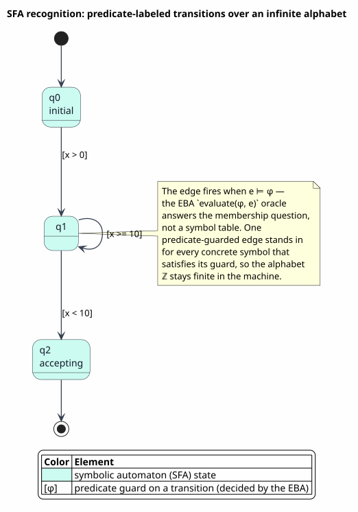

# Symbolic Automata (SFA)

Last updated: 2026-06-22

All symbols are defined in [Concepts and Glossary](01-concepts-and-glossary.md).
This document is the automaton layer: what a Symbolic Finite Automaton is, how it
recognizes input by *evaluating predicates* instead of matching symbols, the exact
algorithms that realize recognition, emptiness, witnesses, the Boolean closure
operations, minterm determinization, and equivalence — and how the very same
machinery, run only as an *analysis*, detects guard overlap and subsumption to
drive dispatch disambiguation. The algebraic substrate it stands on is the
effective Boolean algebra (EBA) of
[02 — Effective Boolean Algebra](02-effective-boolean-algebra.md); the Rust
realization is `prattail/src/symbolic.rs`.

Following the house style of
[12 — Heyting Behavioral Logic](12-heyting-behavioral-logic.md), each mechanized
guarantee is **stated here as a Theorem and proved in ordinary mathematical prose**,
each proof closed with `∎`, with the Coq witness named only as a *citation* (e.g.
"mechanized as `dispatch_completeness`"). The Rust **analysis** functions — which
compute diagnostics rather than discharge theorems — are instead presented as
**Definitions/algorithms** with their `prattail/src/symbolic.rs` realization cited,
and carry no `∎`. The SFA decision procedures (recognition, emptiness, witnesses,
determinization, the Boolean closures) are likewise algorithms; their per-data-type
EBA correctness obligations are cross-referenced to the closure theorems of
[05 — Algebra Pyramid and Decidability](05-algebra-pyramid-and-decidability.md).

## 1. What an SFA is

A classical nondeterministic finite automaton (NFA) labels every transition with a
single symbol from a finite alphabet `Σ`. A **Symbolic Finite Automaton (SFA)**
labels every transition with a *predicate* `φ` drawn from an EBA `𝓐` over a
possibly infinite domain `D`, and the transition fires on an input element `e`
exactly when `e ⊨ φ` — that is, when `𝓐.evaluate(φ, e)` holds. One
predicate-guarded edge stands in for *every* concrete edge whose symbol satisfies
its guard, so an automaton over `Σ = ℤ` or `Σ = char` or `Σ = {all process terms}`
stays finite no matter how large or infinite the alphabet is.

> **Definition 1.1 (Symbolic Finite Automaton).** Over an EBA
> `𝓐 = (Φ, D, ⟦·⟧, ⊤, ⊥, ∧, ∨, ¬, sat, witness)`, an SFA is a tuple
> `M = (Q, 𝓐, Δ, q₀, F)` where:
> - `Q` is a finite set of **states**;
> - `Δ ⊆ Q × Φ × Q` is a finite set of **predicate-labeled transitions**, written
>   `q --[φ]--> q′`, that fires on input `e` iff `e ⊨ φ`;
> - `q₀ ⊆ Q` is the set of **initial states**;
> - `F ⊆ Q` is the set of **accepting (final) states**.
>
> A word `w = e₁ … eₙ ∈ Dⁿ` is **accepted** when some run
> `s₀ --[φ₁]--> s₁ --[φ₂]--> … --[φₙ]--> sₙ` exists with `s₀ ∈ q₀`,
> `sₙ ∈ F`, and `eᵢ ⊨ φᵢ` for every `i`. The recognized language is
> `L(M) = { w ∈ D* : w is accepted }`.

The Rust type mirrors the tuple field for field. `SymbolicAutomaton<A>` carries
the algebra `A` plus `states: Vec<SymbolicState>`, `transitions:
Vec<SymbolicTransition<A>>`, `initial_states: HashSet<usize>`, and
`accepting_states: HashSet<usize>`. A `SymbolicState` is `{ id, is_accepting,
label }`; a `SymbolicTransition<A>` is `{ from, to, guard }` with `guard:
A::Predicate`. The type parameter `A: BooleanAlgebra` simultaneously fixes the
predicate type (the transition guards) and the domain type (the elements consumed
during concrete simulation), so a single generic body serves intervals,
character classes, KAT worlds, Presburger vectors, bags, and ranked trees without
specialization.

SFAs occupy the *same* expressiveness tier as NFAs — they recognize exactly the
regular languages over `D` when `𝓐` has decidable satisfiability — but with a
fundamentally more compact representation
([D'Antoni & Veanes, 2017](references.md#dantoni-veanes-2017), Theorem 3.1). The
gain is representational, not classificatory: a guard `[0, 1000)` is one edge, not
a thousand.

## 2. Recognition at a glance



PlantUML source: [figures/03-sfa-recognition.puml](figures/03-sfa-recognition.puml).

The figure traces a single input element `e` through one step of an SFA. The
machine holds a *set* of current states (NFA-style nondeterminism). For each
current state `q` it scans the outgoing transitions `q --[φ]--> q′` and asks the
algebra the membership question `e ⊨ φ`; every edge whose guard `e` satisfies
contributes its target `q′` to the next state set. Crucially, the automaton never
consults a symbol table or an alphabet — it consults the *algebra*. Where a
classical NFA would compare `e` against a stored symbol, the SFA evaluates a
predicate, and that single substitution is what lets the machine range over an
infinite domain in finite space. The colors in the figure separate the three
actors that collaborate on each step: the **state frontier** (the live set of
states), the **guard predicates** on the fan-out edges, and the **EBA oracle**
that answers `evaluate`. When the input is exhausted, acceptance is decided by
asking whether the frontier intersects `F`.

## 3. The recognition algorithm — `accepts`

Recognition is NFA simulation in which the per-symbol transition relation is
replaced by a per-element predicate evaluation. We carry a frontier `current ⊆ Q`,
seeded with the initial states. For each input element we compute the successor
frontier by evaluating every outgoing guard against that element; if the frontier
ever empties, no run survives and the word is rejected early. After the last
element, the word is accepted iff the frontier meets an accepting state. The Rust
entry point is `SymbolicAutomaton::accepts`.

> **Algorithm `Accepts` — does `M` accept the concrete word `w`?**
> *Input:* an SFA `M = (Q, 𝓐, Δ, q₀, F)` and a word `w = e₁ … eₙ`.
> *Output:* `true` iff `w ∈ L(M)`.
>
> ```
> Accepts(M, w):
>   if q₀ = ∅: return false                 ▷ no run can even start
>   current ← q₀                            ▷ the live state frontier
>   for e in w:                             ▷ consume one element at a time
>     next ← ∅
>     for q in current:                     ▷ fan out over the frontier
>       for (q --[φ]--> q′) in Δ:
>         if 𝓐.evaluate(φ, e):              ▷ predicate replaces symbol match
>           next ← next ∪ { q′ }
>     if next = ∅: return false             ▷ frontier died → reject early
>     current ← next
>   return (current ∩ F ≠ ∅)                ▷ accept iff a final state is live
> ```
>
> The membership test `𝓐.evaluate(φ, e)` is the *only* place the domain `D`
> enters; everything else is set bookkeeping over `Q`. The cost is
> `O(|w| · |Q| · |Δ|)` evaluations, each evaluation being one algebra call. The
> early-exit on an empty frontier means an unrecognizable prefix is rejected
> without scanning the rest of the word.

## 4. Emptiness and shortest-accepted witness

Two reachability queries underpin nearly every higher operation: *is the language
empty?* and, when it is not, *give me a shortest accepted word*. Both are
breadth-first searches over the transition graph; the only subtlety is that an edge
is traversable only when its guard is **satisfiable**, because an unsatisfiable
guard (`sat(φ) = false`) is a dead edge no input can ever cross.

### 4.1 Emptiness — `is_empty`

We first filter the graph to its *live* edges (those with `sat(φ)`), then BFS from
the initial states. The language is non-empty iff some accepting state is reached
along live edges. The Rust entry point is `SymbolicAutomaton::is_empty`.

> **Algorithm `IsEmpty` — is `L(M) = ∅`?**
> *Input:* an SFA `M = (Q, 𝓐, Δ, q₀, F)`.
> *Output:* `true` iff `L(M) = ∅`.
>
> ```
> IsEmpty(M):
>   if q₀ = ∅ or F = ∅: return true          ▷ nothing to start from / reach
>   adj ← empty adjacency list over Q
>   for (q --[φ]--> q′) in Δ:                 ▷ keep only satisfiable edges
>     if 𝓐.is_satisfiable(φ):
>       adj[q] ← adj[q] ∪ { q′ }
>   visited ← q₀; queue ← q₀                  ▷ BFS over live edges
>   while queue ≠ ∅:
>     q ← dequeue(queue)
>     if q ∈ F: return false                  ▷ reached an accept → non-empty
>     for q′ in adj[q]:
>       if q′ ∉ visited:
>         visited ← visited ∪ { q′ }; enqueue(queue, q′)
>   return true                               ▷ no accept reachable → empty
> ```
>
> The work is `O(|Q| + |Δ| · sat)`: each edge costs one satisfiability check to
> classify as live, after which the BFS is linear in the live graph. Filtering on
> `sat` before traversal is what makes emptiness *decidable* rather than merely
> reachable — a guard whose denotation is `∅` correctly blocks the path.

### 4.2 Shortest accepted word — `shortest_accepted`

When the language is non-empty we often want a concrete sample: a length-minimal
accepted word, useful as a counterexample for equivalence failures and as the
`witness` generator for derived algebras (for instance, the string algebra whose
predicates compile down to an SFA). The search is the same BFS, but each edge is
*materialized* by asking the algebra for one element of its guard via `witness`
(which returns `Some` exactly when the guard is satisfiable), and predecessor
links let us reconstruct the path. BFS visits states in non-decreasing distance, so
the first accepting state reached yields a shortest word. The Rust entry point is
`SymbolicAutomaton::shortest_accepted`.

> **Algorithm `ShortestAccepted` — a length-minimal `w ∈ L(M)`.**
> *Input:* an SFA `M = (Q, 𝓐, Δ, q₀, F)`.
> *Output:* `Some(w)` with `w ∈ L(M)` of minimal length, or `None` if `L(M) = ∅`.
>
> ```
> ShortestAccepted(M):
>   if q₀ = ∅ or F = ∅: return None
>   if q₀ ∩ F ≠ ∅: return Some(ε)             ▷ empty word accepted at the start
>   visited ← q₀
>   pred[q] ← none for all q                  ▷ pred[q′] = (q, element on edge)
>   queue ← q₀
>   while queue ≠ ∅:
>     q ← dequeue(queue)
>     for (q --[φ]--> q′) in Δ with q′ ∉ visited:
>       if 𝓐.witness(φ) = Some(e):            ▷ one concrete element of ⟦φ⟧
>         visited ← visited ∪ { q′ }
>         pred[q′] ← (q, e)
>         if q′ ∈ F:                           ▷ first accept reached = shortest
>           return Some(reconstruct(pred, q′)) ▷ walk pred-links, reverse
>         enqueue(queue, q′)
>   return None
> ```
>
> Each edge is realized at most once; `reconstruct` walks the predecessor chain
> from the accepting state back to an initial state and reverses it. Because BFS
> dequeues states in breadth order, the materialized word is of minimum length.

## 5. Closure operations

The payoff of the EBA abstraction is that the textbook Boolean closure properties
of regular languages carry over to SFAs *symbolically* — the constructions
manipulate guards with `∧`, `∨`, `¬`, and prune with `sat`, never touching `D`
([D'Antoni & Veanes, 2017](references.md#dantoni-veanes-2017), Section 3). Each
operation below is stated as a theorem on the recognized languages and realized by
a named method on `SymbolicAutomaton<A>`. The *language*-closure theorems below are
parametric in the algebra; their per-data-type **correctness obligation** — that the
guard operations `∧`, `∨`, `¬`, `sat`, `wit` the constructions invoke really are a
sound EBA for whatever type `A` instantiates (intervals, character classes,
products, sums, ranked trees, …) — is discharged once and for all by the
EBA-closure theorems of
[05 — Algebra Pyramid and Decidability](05-algebra-pyramid-and-decidability.md):
Theorem 7.2 (product), Theorem 7.3 (sum), Theorem 7.4 (collection/bag), and
Theorem 7.5 (tree) each prove the corresponding constructor preserves the EBA
contract, so the SFA algorithms apply verbatim over every derived algebra.

### 5.1 Intersection — product with conjunctive guards

> **Theorem 5.1 (Intersection closure).** For SFAs `M₁`, `M₂` over the same EBA,
> there is an SFA `M₁ ⊓ M₂` with `L(M₁ ⊓ M₂) = L(M₁) ∩ L(M₂)`, of at most
> `|Q₁| · |Q₂|` states.

The construction is the standard product automaton: a state is a pair `(q₁, q₂)`,
accepting iff *both* components accept, and a product edge
`(q₁, q₂) --[φ₁ ∧ φ₂]--> (q₁′, q₂′)` exists for each pair of component edges
`q₁ --[φ₁]--> q₁′` and `q₂ --[φ₂]--> q₂′`. The product edge fires on `e` exactly
when both component edges fire — i.e. when `e ⊨ φ₁ ∧ e ⊨ φ₂`, which is `e ⊨ φ₁ ∧ φ₂`.
Conjunctions that are unsatisfiable are dropped at construction time
(`if 𝓐.is_satisfiable(φ₁ ∧ φ₂)`), so the product never carries a dead edge. The
Rust entry point is `SymbolicAutomaton::intersect`; its cost is
`O(|Q₁| · |Q₂| + |Δ₁| · |Δ₂| · (∧ + sat))`.

### 5.2 Union — structural disjoint sum

> **Theorem 5.2 (Union closure).** For SFAs `M₁`, `M₂` over the same EBA, there is
> an SFA `M₁ ⊔ M₂` with `L(M₁ ⊔ M₂) = L(M₁) ∪ L(M₂)`, of `|Q₁| + |Q₂|` states.

Union needs no product. The result is the disjoint union of the two state spaces:
both state sets are copied under a renumbering offset, the initial sets of *both*
operands are marked initial in the combined machine, accepting flags are preserved,
and every transition is copied into the combined index space with its guard intact.
A word is accepted iff it is accepted by one side or the other, which is precisely
`L(M₁) ∪ L(M₂)`. The construction is purely structural, costing
`O(|Q₁| + |Q₂| + |Δ₁| + |Δ₂|)`. The Rust entry point is
`SymbolicAutomaton::union`.

### 5.3 Complement — determinize, complete, flip

> **Theorem 5.3 (Complement closure, classical tier).** For an SFA `M` over a
> *classical* EBA, there is an SFA `Mᶜ` with `L(Mᶜ) = D* ∖ L(M)`.

Complement is the operation that genuinely *requires the classical tier*, because
it rests on two-valued reasoning: the result must accept exactly the words `M`
rejects, with no third outcome. The construction first **determinizes** `M`
(Section 6) so that each input has a single run, then makes the automaton
*complete* by routing every otherwise-unmatched input to an accepting sink, then
**flips** acceptance. Completion is where the algebra's involutive `¬` is
indispensable: for each state, the disjunction `covered = ⋁ φᵢ` of its outgoing
guards is formed, its complement `uncovered = ¬covered` is taken, and — when
`sat(uncovered)` — an edge to the sink on `uncovered` is added so that *no* input
falls off the automaton silently. The sink loops to itself on `⊤` and is accepting
in the complement, capturing every word with no surviving run in `M`. The Rust
entry point is `SymbolicAutomaton::complement`; its cost is dominated by
determinization. On a semi-decidable behavioral algebra this construction is
unavailable, because `¬covered` would not soundly denote `D ∖ ⟦covered⟧` (see the
decidability boundary in Section 9 and the tower in
[05](05-algebra-pyramid-and-decidability.md)).

## 6. Determinization via minterm subset construction

Determinization is the classical subset (powerset) construction, but the
ever-present obstacle is that the "alphabet" is infinite — we cannot iterate over
`D` to compute, for a state set `S`, the successor under each symbol. The
resolution is **minterms**. Given the guards on the edges leaving `S`, their
minterms (Definition 4.1 of [02 §4](02-effective-boolean-algebra.md#4-minterms-making-the-symbolic-alphabet-finite))
partition `D` into the finitely many cells on which *every* guard is either wholly
true or wholly false. Within a minterm all domain elements trigger exactly the same
set of transitions, so the minterms are precisely the finite *effective alphabet*
that subset construction needs. We use minterms — rather than the raw guards —
because two overlapping guards (say `[0,50)` and `[30,80)`) must be split at their
boundary (`[30,50)`) for the successor to be a *function* of the input cell; the
minterm refinement performs exactly that split, and `sat` prunes every empty cell
so the live alphabet stays small. The Rust entry point is
`SymbolicAutomaton::determinize`, computing per-state minterms with
`compute_minterms`.

> **Definition 6.1 (`compute_minterms`).** Given a finite guard list
> `φ₁, …, φ_k` over an EBA `𝓐`, `compute_minterms` returns the finite set of
> **maximal satisfiable Boolean combinations** of those guards — every cell
> `ψ₁ ∧ ⋯ ∧ ψ_k` in which each `ψᵢ` is either `φᵢ` or `¬φᵢ` and the whole
> conjunction is satisfiable (`sat(ψ₁ ∧ ⋯ ∧ ψ_k)`). It is computed by iterative
> refinement: start from the singleton `{⊤}`; for each successive guard `φ`,
> replace every current cell `m` by the two splits `m ∧ φ` and `m ∧ ¬φ`, keeping
> only the cells the algebra reports satisfiable; the guard list is deduplicated
> before refinement. The result partitions `D` into the cells on which every guard
> is wholly true or wholly false, so within a cell all domain elements trigger the
> same set of transitions. This is an *algorithm*, not a theorem — its correctness
> obligation (that the cells genuinely partition `D`, which needs `¬φ` to be a true
> complement) is discharged by the classical-tier EBA laws of
> [02 §4](02-effective-boolean-algebra.md#4-minterms-making-the-symbolic-alphabet-finite).
> Realized in `prattail/src/symbolic.rs` as `compute_minterms`.

> **Algorithm `Determinize` — minterm subset construction.**
> *Input:* an SFA `M = (Q, 𝓐, Δ, q₀, F)`.
> *Output:* a deterministic SFA `M′` with `L(M′) = L(M)`.
>
> ```
> Determinize(M):
>   S₀ ← q₀                                   ▷ macro-state = set of NFA states
>   accepting(S₀) ← (S₀ ∩ F ≠ ∅)
>   states ← { S₀ }; worklist ← { S₀ }
>   while worklist ≠ ∅:
>     S ← pop(worklist)
>     guards ← { φ : (q --[φ]--> q′) ∈ Δ, q ∈ S }   ▷ guards leaving this set
>     if guards = ∅: continue                       ▷ dead macro-state
>     for m in Minterms(𝓐, guards):                 ▷ finite effective alphabet
>       S′ ← { q′ : (q --[φ]--> q′) ∈ Δ, q ∈ S, 𝓐.overlaps(m, φ) }
>       if S′ = ∅: continue
>       if S′ ∉ states:
>         accepting(S′) ← (S′ ∩ F ≠ ∅)
>         states ← states ∪ { S′ }; push(worklist, S′)
>       add transition  S --[m]--> S′                ▷ one target per minterm
>   return ({ states }, 𝓐, { new transitions }, { S₀ }, { S : accepting(S) })
> ```
>
> The successor of `S` under a minterm `m` collects the targets of every edge
> whose guard *overlaps* `m`; since `m` lies entirely inside or outside each
> guard, "overlaps" here means "is contained in," and the successor is a genuine
> function of `m`. The construction yields at most `2^|Q|` macro-states, each with
> at most `2^k` minterms for `k` distinct outgoing guards
> ([D'Antoni & Veanes, 2014](references.md#dantoni-veanes-2014), Theorem 4.2). In
> practice both blowups are mild: grammars present few guards per state, and `sat`
> discards the unsatisfiable sign combinations.

The `Minterms` refinement itself — start from `⊤`, split each cell against each
guard's `φ` and `¬φ`, keep only satisfiable cells — is given in literate form in
[02 §4](02-effective-boolean-algebra.md#4-minterms-making-the-symbolic-alphabet-finite)
and realized by `compute_minterms` (Definition 6.1, `symbolic.rs`), whose `sat`
pruning keeps the live cell count far below the `2^k` worst case in practice.

## 7. Equivalence as product-emptiness

Language equivalence reduces to emptiness of the **symmetric difference**: two
machines recognize the same language iff neither accepts a word the other rejects.

> **Theorem 7.1 (Equivalence).** For SFAs `A`, `B` over a classical EBA,
> `L(A) = L(B)` iff `(L(A) ∩ L(B)ᶜ) ∪ (L(B) ∩ L(A)ᶜ) = ∅`. Each side is an SFA
> (by Theorems 5.1 and 5.3), so equivalence is decided by two emptiness checks.

The procedure forms `A ∖ B = A ⊓ Bᶜ` and returns `false` if it is non-empty, then
forms `B ∖ A = B ⊓ Aᶜ` and returns whether *it* is empty; both empty means the
languages coincide. Every ingredient — complement (Section 5.3), intersection
(Section 5.1), emptiness (Section 4.1) — is already a decidable operation on the
classical tier, so equivalence is decidable, with cost dominated by the two
determinizations inside the complements. The Rust entry point is
`SymbolicAutomaton::is_equivalent`. A non-empty difference additionally yields a
concrete distinguishing word through `shortest_accepted` on the offending product,
turning a "not equivalent" answer into an actionable counterexample.

## 8. The guard-analysis use: dispatch disambiguation

The same SFA machinery, run not to *recognize* but to *analyze*, is what the
compiler uses to reason about a grammar's dispatch. A `language!` definition gives,
per rule, a guard — concretely, the set of leading terminals that can *start* a
match for that rule — and three questions decide whether the generated parser's
rule selection is sound:

- **Overlap.** Two guards `φ`, `ψ` overlap when `sat(φ ∧ ψ)`, i.e. some input
  satisfies both. Overlapping guards on rules of the same category mean *dispatch
  ambiguity*: a single token could begin more than one rule, so the parser cannot
  pick deterministically on first token alone.
- **Subsumption.** When `φ` *implies* `ψ` (`⟦φ⟧ ⊆ ⟦ψ⟧`, decided as
  `¬sat(φ ∧ ¬ψ)`), `φ`'s rule is strictly more specific than `ψ`'s. That is a
  *safe priority*: trying the subsumed (more specific) rule first resolves the
  overlap soundly, because anything matching `φ` also matches `ψ` but not
  conversely.
- **Unsatisfiability.** A guard with `sat(φ) = false` is a *dead rule*: no input
  can ever select it, and it is reported for dead-code elimination.

These three diagnostics are computed — not *proved*, but *computed* — by a small
family of analysis functions. They are algorithms over the guard set, so each is
stated below as a Definition of *what it returns*, with its Rust realization cited;
none carries a `∎` proof, because none is a theorem.

> **Definition 8.1 (the guard-analysis quantities).** Over an SFA `M` (or, at the
> grammar level, a syntax bundle), the analysis emits a `SymbolicAnalysis` record
> whose fields are defined as follows.
> - `num_states` and `num_transitions` return the counts `|Q|` and `|Δ|` of the
>   analyzed automaton (for a bundle, the category count and the rule count).
> - `guard_satisfiability` returns, for each transition, the pair
>   `(description, sat(φ))` — the guard's printed form together with its
>   satisfiability verdict.
> - `overlapping_guards` returns the pairs of guards whose conjunction is
>   satisfiable — `{ (φ, ψ) : sat(φ ∧ ψ) }` restricted to rules of the same
>   category (a non-disjoint pair, hence a first-token dispatch ambiguity).
> - `subsumed_guards` returns the pairs `(φ, ψ)` with `φ` implying `ψ`
>   (`¬sat(φ ∧ ¬ψ)`, i.e. `⟦φ⟧ ⊆ ⟦ψ⟧`) — the strictly-more-specific guard paired
>   with the one it refines, a safe priority order.
> - `unsatisfiable_rule_labels` returns the labels of rules whose guard is
>   unsatisfiable (`sat(φ) = false`) — the dead rules, fed to dead-code
>   elimination.
>
> Realized in `prattail/src/symbolic.rs`: `SymbolicAutomaton::analyze` populates
> these by scanning every transition, recording `(description, sat)` per guard, and
> pairwise testing `overlaps` and `implies`; the field accessors `num_states` and
> `num_transitions` read `|Q|` and `|Δ|` directly.

> **Definition 8.2 (`analyze_from_bundle`).** At the grammar level the same
> `SymbolicAnalysis` is produced directly from a syntax bundle by
> `analyze_from_bundle(all_syntax, categories)`. For each rule it extracts the
> **leading-terminal guard** — the set of terminal tokens that can start a match —
> via `collect_leading_terminals`; it then computes the Definition 8.1 quantities
> over those sets: a rule is *unsatisfiable* when its first item is neither a
> terminal, nor a dynamic start (`NonTerminal`/`IdentCapture`/`Binder`/`Collection`),
> nor an epsilon production; two same-category rules *overlap* when their
> leading-terminal sets intersect; and a rule is *subsumed* when its terminal set is
> a strict subset of a sibling's. This is an analysis algorithm, not a theorem;
> realized in `prattail/src/symbolic.rs` as `analyze_from_bundle`.

The adapter `SymbolicCompiler` (implementing `PredicateCompiler`, module M1 —
always active) routes the dispatch pipeline's per-predicate compilation through
`analyze_from_bundle`, so the overlap and subsumption findings flow straight into
the lint diagnostics. This analysis is the input to the language-to-Rholang dispatch
integration described in
[07 — Language to Rholang Integration](07-language-to-rholang-integration.md),
where overlap becomes an ambiguity diagnostic and subsumption becomes a generated
priority order.

### 8.1 Soundness of dispatch: the predicate-dispatch model

The diagnostics of Definitions 8.1–8.2 *describe* a grammar's dispatch; the question
this subsection settles is whether the dispatch mechanism that consumes them is
**sound** — whether every predicate combination a rule actually carries is routed to
a handler, and whether the only thing the dispatcher ever rejects is the empty
combination. This is mechanized, and the two guarantees are the following theorems.

The model (proof-home
`formal/rocq/predicate_dispatch/theories/DispatchCompleteness.v`) represents a
predicate-dispatch decision as a **feature signature**: a bitvector `sig` over the
eleven predicate modules `M₁, …, M₁₁`, where bit `i` is set exactly when module
`Mᵢ` is required by the predicate. The dispatch SFA routes a signature to the
handlers whose bits are set; abstractly, a signature is **accepted** — routed to at
least one handler — exactly when at least one bit is set, so the acceptance test is
`dispatch_accepts(sig) = (sig ≠ 0)`, realized as `dispatch_accepts(sig) = ¬(sig =? 0)`.
Feature extraction starts from a base signature `BASE = sig_union(M₁, M₁₀)` (the
M1 *Symbolic* and M10 *MSO* bits, always present) and only ever **adds** bits via
`sig_set`/`sig_union` — it never clears one.

> **Theorem 8.3 (dispatch completeness).** Every non-empty feature signature routes
> to a handler: for all `sig`, `sig ≠ 0 ⟹ dispatch_accepts(sig) = true`.
>
> *Proof.* By definition `dispatch_accepts(sig) = ¬(sig =? 0)`, where `=?` is
> Boolean equality on signatures. The reflection law `sig =? 0 = true ⟺ sig = 0`
> gives, contrapositively, `sig ≠ 0 ⟹ (sig =? 0) = false`, whence
> `dispatch_accepts(sig) = ¬false = true`. `∎` (Mechanized as
> `dispatch_completeness`, with the supporting equivalence
> `dispatch_accepts_iff_nonzero`.)

> **Theorem 8.4 (no silent rejection).** The only rejected signature is the empty
> one, and feature extraction never produces it. Formally:
> `dispatch_accepts(0) = false`, and for every additional bit set `extra`,
> `dispatch_accepts(sig_union(BASE, extra)) = true` — so no real feature signature
> is ever silently dropped.
>
> *Proof.* For the first claim, `dispatch_accepts(0) = ¬(0 =? 0) = ¬true = false`:
> the empty signature, requiring no module, is correctly the sole rejection. For the
> second, `sig_union(BASE, extra) = BASE ∨ extra` keeps every bit of `BASE` set, in
> particular the M1 bit; a value with a set bit is not `0`, so
> `sig_union(BASE, extra) ≠ 0`, and Theorem 8.3 yields
> `dispatch_accepts(sig_union(BASE, extra)) = true`. Since extraction's output is
> always of this `BASE ∨ extra` form, it is never `0` and never rejected. `∎`
> (Mechanized as `dispatch_zero_rejected` together with
> `extract_features_always_accepted`, resting on the base-bit invariants
> `base_invariant_m1`/`base_invariant_m10` and the non-degeneracy corollary
> `extract_features_nonzero`.)

Both theorems are closed with `Qed` in `DispatchCompleteness.v` — the proofs carry
no admissions or axioms. The abstraction gap is explicit in the development: the
Rocq acceptance criterion `dispatch_accepts(sig) = (sig ≠ 0)` is the simplified
shadow of the Rust 13-state dispatch SFA (`build_dispatch_sfa` — one initial state,
eleven per-module accepting states, one reject sink), provably equivalent because a
non-zero signature fires some `HasBit(i)` transition into an accepting module state,
while the zero signature falls through to the reject sink (`DispatchCompleteness.v`
§4.1).

## 9. The decidability boundary

Everything in Sections 5–7 — **complement**, **determinization**, and
**equivalence** — requires the *classical* `BooleanAlgebra` tier of
[02 §3](02-effective-boolean-algebra.md#3-the-trait): an **involutive** negation
(`¬¬a = a`) and a **two-valued** `is_satisfiable`. Complement needs `¬covered` to
denote exactly `D ∖ ⟦covered⟧`; determinization's minterms need `¬φ` to be a true
complement so the cells genuinely partition `D`; equivalence is built on both. A
semi-decidable behavioral algebra offers none of these soundly: its negation is at
best a *pseudo-complement* and its satisfiability is three-valued (`Sat / Unsat /
DontKnow`), so the classical constructions would over- or under-approximate the
language. On that weaker tier only the **reject-safe** operations survive —
emptiness and recognition still make sense (a satisfiable edge is still live, a
witness is still a witness), but complement, determinization, and equivalence are
*statically unavailable*: the methods are bounded on `A: BooleanAlgebra`, so an
algebra that is only `RejectSafeAlgebra` cannot even be passed to them. This split
is a *type* boundary, not a convention, and the full pyramid
`RejectSafeAlgebra ⊂ HeytingAlgebra ⊂ BooleanAlgebra`, with the three-valued
`Sat3` discipline that guards the weaker tiers, is the subject of
[05 — Algebra Pyramid and Decidability](05-algebra-pyramid-and-decidability.md).

## References

- L. D'Antoni and M. Veanes. *The Power of Symbolic Automata and Transducers.*
  Computer Aided Verification (CAV) 2017, LNCS 10427, pp. 47–67. Theorem 3.1
  (SFA–NFA correspondence) and Section 3 (closure). DOI:
  [10.1007/978-3-319-63387-9_3](https://doi.org/10.1007/978-3-319-63387-9_3).
  See [references.md](references.md#dantoni-veanes-2017).
- L. D'Antoni and M. Veanes. *Minimization of Symbolic Automata.* Principles of
  Programming Languages (POPL) 2014, pp. 541–553. Theorem 4.2 (minterm-based
  determinization and minimization). DOI:
  [10.1145/2535838.2535849](https://doi.org/10.1145/2535838.2535849). See
  [references.md](references.md#dantoni-veanes-2014).
- Local mechanization (proof-home of Theorems 8.3 and 8.4):
  `formal/rocq/predicate_dispatch/theories/DispatchCompleteness.v` —
  `dispatch_completeness`, `dispatch_zero_rejected`,
  `extract_features_always_accepted`, and `extract_features_nonzero`, all `Qed`
  (zero-admission). See [References](references.md).
- Companion documents: [02 — Effective Boolean Algebra](02-effective-boolean-algebra.md)
  (the algebra and minterms), [04 — Symbolic Transducers (SFT, STFT)](04-symbolic-transducers-sft-stft.md)
  (adding output functions), [05 — Algebra Pyramid and Decidability](05-algebra-pyramid-and-decidability.md)
  (the classical vs. semi-decidable tiers), and
  [07 — Language to Rholang Integration](07-language-to-rholang-integration.md)
  (where guard analysis drives dispatch).
