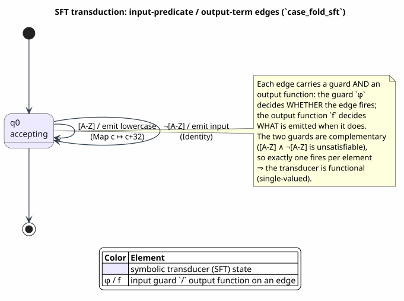
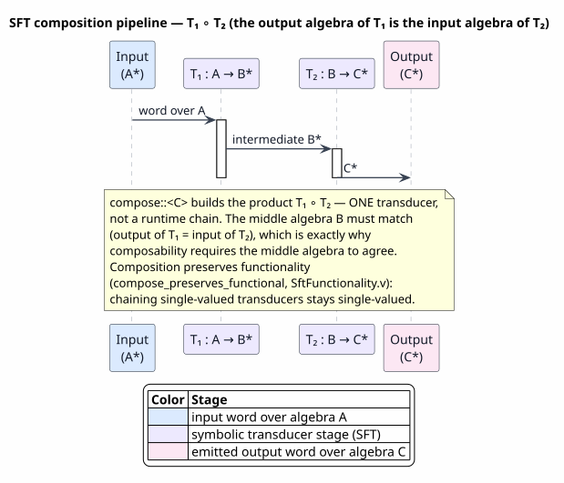

# Symbolic Transducers (SFT / STFT)

Last updated: 2026-06-22

All symbols are defined in [Concepts and Glossary](01-concepts-and-glossary.md).
This document is the transduction layer. Where a symbolic finite automaton (SFA,
[03](03-symbolic-automata-sfa.md)) *recognizes* a language over an infinite
alphabet, a **symbolic finite transducer** (SFT) *transforms* one — each edge
carries an output function as well as a guard, so the machine maps inputs to
outputs symbolically. The page covers the word transducer (`SFT`), its
first-class analyzable output algebra (`OutputTerm`), composition, pre-/post-image,
single-valuedness (functionality), and the ranked-tree analog (`STFT`), and ties
every operation to its Rust entry point and its zero-admission Coq theorem.

## 1. What an SFT is

An SFA labels each edge with a predicate `φ` of an effective Boolean algebra
(EBA) and fires when the input element satisfies it. An **SFT promotes that edge
to a rule**: it additionally attaches an *output function* `f` that maps the
consumed input element to a (possibly empty) sequence of output elements drawn
from a *second* algebra. A transition is drawn

```text
q --[ φ / f ]--> q′
```

and reads: "in state `q`, on an input element `e` with `e ⊨ φ`, emit the output
sequence `f(e)` and move to `q′`." The input guard lives in an input algebra
`𝓐ᵢₙ`; the output elements live in an output algebra `𝓐ₒᵤₜ`. The two algebras may
differ (case-folding maps `char → char`; an encoder maps `char → byte`), which is
why an SFT is parameterized by *two* EBAs rather than one
([D'Antoni & Veanes, 2017](references.md#dantoni-veanes-2017)).

> **Definition 1.1 (Symbolic Finite Transducer).** A symbolic finite transducer
> is a tuple `T = (Q, 𝓐ᵢₙ, 𝓐ₒᵤₜ, Δ, q₀, F)` where:
> - `Q` is a finite set of states, `q₀ ∈ Q` the initial state (a *set* of initial
>   states in the NFA-style realization), and `F ⊆ Q` the accepting states;
> - `𝓐ᵢₙ` is the input EBA and `𝓐ₒᵤₜ` the output EBA;
> - `Δ ⊆ Q × Φ(𝓐ᵢₙ) × (Dᵢₙ → Dₒᵤₜ*) × Q` is the transition relation: each edge
>   pairs an input guard `φ ∈ Φ(𝓐ᵢₙ)` with an *output function* `f : Dᵢₙ → Dₒᵤₜ*`
>   producing a finite output word.
>
> `T` transduces an input word `w = e₁ … eₙ ∈ Dᵢₙ*` by walking a path
> `q₀ →^{φ₁/f₁} q₁ → … →^{φₙ/fₙ} qₙ` with `qₙ ∈ F` and `eᵢ ⊨ φᵢ` for every step;
> the produced output word is the concatenation `f₁(e₁) · … · fₙ(eₙ)`. The
> *relation* computed by `T` is the set of all `(w, out)` over all accepting
> paths. `T` is **functional** when that relation is a partial function (each `w`
> has at most one output).

The Rust realization is `prattail/src/sft.rs::SymbolicFiniteTransducer<A, B>`,
whose fields mirror the tuple exactly: `input_algebra: A`, `output_algebra: B`,
`states`, `transitions`, `initial_states`, `accepting_states`. A single transition
is `SftTransition<A, B> { from, to, guard: A::Predicate, output: OutputFunction<A, B> }`.
The output function is a *closed enum* rather than a bare closure so that it can be
`Clone`, `Debug`, and — crucially — *inspected* by the analyses:

```rust
pub enum OutputFunction<A: BooleanAlgebra, B: BooleanAlgebra> {
    Epsilon,                 // ε — produce nothing
    Constant(Vec<B::Domain>),// fixed output, ignores the input
    Identity,                // pass the consumed element through (Dᵢₙ ≈ Dₒᵤₜ)
    Map(Arc<dyn Fn(&A::Domain) -> B::Domain + Send + Sync>),      // one computed element
    FlatMap(Arc<dyn Fn(&A::Domain) -> Vec<B::Domain> + Send + Sync>), // many computed elements
}
```

`Epsilon`, `Constant`, and `Identity` cover the overwhelming majority of practical
edges with **no closure at all**, and are exactly the cases the static analyses can
reason about precisely; `Map`/`FlatMap` are the escape hatch for arbitrary
computed output, and are treated conservatively wherever a structural decision is
required.

## 2. Reading the transduction figure



PlantUML source: [figures/04-sft-transduction.puml](figures/04-sft-transduction.puml).

The figure is a transducer state diagram. Each edge is labeled `φ / f` — the input
guard before the slash, the output function after it — using the suite's violet
`#EDE9FE` for the transducer. The illustration is the shipped `case_fold_sft`
factory: a single accepting state `q0` with two self-loops. The first edge
`[A‑Z] / Map(c ↦ c+32)` fires on an uppercase letter and emits its lowercase
counterpart; the second edge `¬[A‑Z] / Identity` fires on every other character
and passes it through unchanged. Because the two guards are complementary (their
conjunction is unsatisfiable), exactly one edge fires per input element — the
diagram is *visibly functional*, which is the property §7 decides mechanically.
The key reading is that an SFT edge carries **two** annotations where an SFA edge
carries one: the guard decides *whether* the edge fires, the output function
decides *what is emitted* when it does.

## 3. The `transduce` algorithm

Transduction is an NFA-style frontier simulation. The configuration is a set of
`(state, output-so-far)` pairs; each input element advances every pair along every
enabled edge, extending the accumulated output by that edge's emission. At
end-of-input the outputs of the pairs sitting in accepting states are collected.

> **Algorithm `Transduce` — run an SFT over an input word.**
> *Input:* an SFT `T = (Q, 𝓐ᵢₙ, 𝓐ₒᵤₜ, Δ, I, F)` and a word `w = e₁ … eₙ`.
> *Output:* the set of output words over all accepting paths.
>
> ```text
> Transduce(T, w):
>   if I = ∅: return ∅                       ▷ no start state ⇒ empty relation
>   frontier ← { (q, ε) | q ∈ I }            ▷ each start state, empty output
>   for e in w:                              ▷ consume one input element
>     next ← ∅
>     for (q, acc) in frontier:
>       for (q --[φ / f]--> q′) in Δ with q = from:
>         if 𝓐ᵢₙ.evaluate(φ, e):             ▷ guard fires on this element
>           next ← next ∪ { (q′, acc · f(e)) }   ▷ extend the accumulated output
>     frontier ← next
>   return { acc | (q, acc) ∈ frontier, q ∈ F }  ▷ outputs in accepting states
> ```
>
> The Rust entry point is `SymbolicFiniteTransducer::transduce` (`sft.rs`). Its
> time complexity is `O(|w| · |Q| · |Δ|)`: each of the `|w|` steps re-scans the
> frontier (bounded by `|Q|` distinct states, though the accumulator multiplicity
> grows with nondeterminism) against every transition. A *functional* SFT keeps a
> single output per step, so the accumulator count stays at one and the simulation
> is linear in the word length (Theorem 7.6 certifies `|out| ≤ |w|`, mechanized in
> [`SftFunctionality.v`](#10-references) as `functional_output_bounded`).

`domain_sfa` projects an SFT onto an SFA over `𝓐ᵢₙ` by dropping every output
function and keeping only the guards; the resulting automaton accepts exactly the
inputs for which `T` produces at least one output (`is_empty` is then an emptiness
check on that projection). This is the operational meaning of "domain of the
transduction" and is the bridge to the recognition algorithms in
[03](03-symbolic-automata-sfa.md).

## 4. `OutputTerm`: a first-class, analyzable output algebra

`OutputFunction::Map`/`FlatMap` are opaque: an `Arc<dyn Fn>` is a black box that
can only be *applied*, never *inspected*. That is fine for `transduce`, but it
defeats *composition* — when two SFTs are chained, an opaque output cannot be
folded into the downstream guard analysis, so the conservative arm of `compose`
must wrap it in a fresh `FlatMap` (over-approximating the product, §5). The fix is
to make the structural output a **finite term** instead of a closure:

```rust
pub enum OutputTerm<A: BooleanAlgebra, B: BooleanAlgebra> {
    Eps,                                                  // ε — produce nothing
    Id,                                                   // pass the consumed element through
    Const(Vec<B::Domain>),                                // fixed output
    Concat(Box<OutputTerm<A, B>>, Box<OutputTerm<A, B>>), // emit both sub-terms in order
    // _Input — a never-constructed marker tying the output-only term to `A`.
}
```

Every node is inspectable, so composition over `OutputTerm`s is a *precise symbolic
operation* (`then`) that yields another `OutputTerm` — never a closure. `OutputTerm`
carries **two compatible algebraic structures**, both proven up to denotational
equivalence in `formal/rocq/sft/theories/OutputTermAlgebra.v`. This section states
and proves both, in ordinary mathematical prose; the Coq names that mechanize each
result are given only as parenthetical citations. We work in the single-sorted
*endo* model `OTerm X` — input and output share one domain `X` — which the Coq
development uses; the Rust two-sorted `OutputTerm<A, B>` is the object-indexed
(typed) realization of the same algebra, identity-on-objects via the `Into`
coherence, so every identity below transfers verbatim.

**Definition 4.0 (denotation and denotational equivalence).** An output term `t`
*denotes* a function `apply t : X → list X` interpreting it as an emission rule:

`apply OEps x = []`,  `apply OId x = [x]`,  `apply (OConst v) x = v`,
`apply (OConcat a b) x = apply a x ++ apply b x`.

Its **sequence lift** is `apply_all t xs := flat_map (apply t) xs : list X → list X`
(run `t` on each element of the input sequence and concatenate). Two terms are
**denotationally equivalent**, written `s ≈ t`, when they denote the same function:
`oeq s t :⟺ ∀x. apply s x = apply t x`. The relation `≈` is reflexive, symmetric,
and transitive (mechanized in `OutputTermAlgebra.v` as `oeq_refl`, `oeq_sym`,
`oeq_trans`), so the laws below may be chained freely. Throughout we write `⟦t⟧` for
`apply t` and `⟦t⟧*` for `apply_all t`.

We first isolate the one combinatorial fact every proof in §4–§8 rests on; it is the
shared foundation noted at the end of §5.

**Lemma 4.1 (flat-map fusion).** For `f : Y → list Z`, `g : Z → list W`, and any
list `l : list Y`,

`flat_map g (flat_map f l) = flat_map (λy. flat_map g (f y)) l`.

*Proof.* Induction on `l`. If `l = []`, both sides are `[]`. If `l = y :: l′`, then
`flat_map f (y :: l′) = f y ++ flat_map f l′`, so the left side is
`flat_map g (f y ++ flat_map f l′)`. Distributing `flat_map g` over `++` (the law
`flat_map g (l₁ ++ l₂) = flat_map g l₁ ++ flat_map g l₂`, itself an easy induction on
`l₁` using associativity of `++`) gives
`flat_map g (f y) ++ flat_map g (flat_map f l′)`. By the induction hypothesis the
second summand is `flat_map (λy. flat_map g (f y)) l′`, and the first is the head of
the right side; so the two sides agree. `∎` (Mechanized in `OutputTermAlgebra.v` as
`flat_map_flat_map_`, with the append-distribution step `flat_map_app_` and the
companion `flat_map_singleton_` — `flat_map (λy.[y]) l = l` — reused below.)

**(a) A monoid `(Concat, Eps)` — output concatenation.** Concatenation is
associative with the empty output `Eps` as a two-sided unit. The three monoid laws
are stated and proved next; the smart constructor `OutputTerm::concat` performs the
unit normalization directly — `(Eps, t)` and `(t, Eps)` collapse to `t` — so monoid
identities never accumulate in a built term.

**Lemma 4.2 (concatenation is associative).** For all output terms `a, b, c`,
`OConcat (OConcat a b) c ≈ OConcat a (OConcat b c)`.

*Proof.* Fix `x`. By the denotation clause for `OConcat`,
`⟦OConcat (OConcat a b) c⟧(x) = (⟦a⟧(x) ++ ⟦b⟧(x)) ++ ⟦c⟧(x)` and
`⟦OConcat a (OConcat b c)⟧(x) = ⟦a⟧(x) ++ (⟦b⟧(x) ++ ⟦c⟧(x))`. List append is
associative, so the two are equal at every `x`; hence the terms are `≈`. `∎`
(Mechanized as `oconcat_assoc`.)

**Lemma 4.3 (left and right unit).** For every output term `a`,
`OConcat OEps a ≈ a` and `OConcat a OEps ≈ a`.

*Proof.* Fix `x`. For the left unit, `⟦OConcat OEps a⟧(x) = ⟦OEps⟧(x) ++ ⟦a⟧(x)
= [] ++ ⟦a⟧(x) = ⟦a⟧(x)`, using `[]` as the left-neutral element of `++`. For the
right unit, `⟦OConcat a OEps⟧(x) = ⟦a⟧(x) ++ [] = ⟦a⟧(x)`, using `[]` as the
right-neutral element. Both hold at every `x`. `∎` (Mechanized as `oconcat_eps_l`
and `oconcat_eps_r`.)

Lemmas 4.2 and 4.3 say `(OConcat, OEps)` is a monoid on `OTerm X` up to `≈`.

| Law | Statement | Proved as |
|---|---|---|
| associativity | `Concat(Concat(a, b), c) ≈ Concat(a, Concat(b, c))` | Lemma 4.2 (`oconcat_assoc`) |
| left unit | `Concat(Eps, a) ≈ a` | Lemma 4.3 (`oconcat_eps_l`) |
| right unit | `Concat(a, Eps) ≈ a` | Lemma 4.3 (`oconcat_eps_r`) |

**(b) A category `(then, Id)` — sequential composition.** `self.then(next)`
composes `self : A→B*` with `next : B→C*` into a term `A→C*`. The structural
definition mirrors `OutputTerm::then` exactly:

`othen OEps t = OEps`,  `othen (OConst v) t = OConst (⟦t⟧*(v))`,
`othen OId t = t`,  `othen (OConcat a b) t = OConcat (othen a t) (othen b t)`.

Its defining law is the β / compose-correctness equation — composing then applying
equals applying then re-applying — from which the category laws follow.

**Theorem 4.4 (β / compose-correctness).** For all output terms `s, t` and every
`x`, `⟦othen s t⟧(x) = ⟦t⟧*(⟦s⟧(x))`. That is, running the composite `othen s t`
on `x` is the same as running `s` on `x` and mapping `t` over each output.

*Proof.* Induction on the structure of `s`.
- `s = OEps`: `othen OEps t = OEps`, so `⟦othen OEps t⟧(x) = []`. On the right,
  `⟦OEps⟧(x) = []` and `⟦t⟧*([]) = flat_map (⟦t⟧) [] = []`. Equal.
- `s = OId`: `othen OId t = t`, so the left side is `⟦t⟧(x)`. On the right,
  `⟦OId⟧(x) = [x]` and `⟦t⟧*([x]) = flat_map (⟦t⟧) [x] = ⟦t⟧(x) ++ [] = ⟦t⟧(x)`.
  Equal.
- `s = OConst v`: `othen (OConst v) t = OConst (⟦t⟧*(v))`, so the left side is
  `⟦t⟧*(v)`. On the right, `⟦OConst v⟧(x) = v`, so the right side is also `⟦t⟧*(v)`.
  Equal.
- `s = OConcat a b`: `othen (OConcat a b) t = OConcat (othen a t) (othen b t)`, so
  the left side is `⟦othen a t⟧(x) ++ ⟦othen b t⟧(x)`. By the induction hypotheses
  for `a` and `b` this equals `⟦t⟧*(⟦a⟧(x)) ++ ⟦t⟧*(⟦b⟧(x))`. The right side is
  `⟦t⟧*(⟦OConcat a b⟧(x)) = ⟦t⟧*(⟦a⟧(x) ++ ⟦b⟧(x))`; since `⟦t⟧* = flat_map (⟦t⟧)`
  distributes over `++` (`flat_map_app_`, the append-distribution step of Lemma 4.1),
  this is `⟦t⟧*(⟦a⟧(x)) ++ ⟦t⟧*(⟦b⟧(x))`. Equal.
All four cases hold, so the equation holds for every `s`. `∎` (Mechanized as
`othen_correct`.)

A corollary used twice below records that the sequence lift of a composite factors:
`⟦othen t u⟧*(ys) = ⟦u⟧*(⟦t⟧*(ys))` for every list `ys` — apply Theorem 4.4
pointwise inside the `flat_map` and then Lemma 4.1 (mechanized as `oapply_all_othen`).
We also record the unit of the sequence lift: `⟦OId⟧*(xs) = xs`, which is exactly
`flat_map (λx.[x]) xs = xs` from Lemma 4.1 (mechanized as `oapply_all_id`).

**Theorem 4.5 (the category laws).** Up to `≈`, `(othen, OId)` is a category on
`OTerm X`: for all `s, t, u`,

1. (left unit) `othen OId t ≈ t`;
2. (right unit) `othen s OId ≈ s`;
3. (associativity) `othen (othen s t) u ≈ othen s (othen t u)`.

*Proof.*
1. `othen OId t = t` holds definitionally (the `OId` clause of `othen`), so in
   particular `othen OId t ≈ t` by reflexivity of `≈`.
2. Fix `x`. By Theorem 4.4, `⟦othen s OId⟧(x) = ⟦OId⟧*(⟦s⟧(x))`, and
   `⟦OId⟧*(ys) = ys` for every `ys` (the unit of the sequence lift). Hence
   `⟦othen s OId⟧(x) = ⟦s⟧(x)` at every `x`, so `othen s OId ≈ s`.
3. Fix `x`. Applying Theorem 4.4 twice on each side,
   `⟦othen (othen s t) u⟧(x) = ⟦u⟧*(⟦othen s t⟧(x)) = ⟦u⟧*(⟦t⟧*(⟦s⟧(x)))` and
   `⟦othen s (othen t u)⟧(x) = ⟦othen t u⟧*(⟦s⟧(x)) = ⟦u⟧*(⟦t⟧*(⟦s⟧(x)))`, the last
   step by the factoring corollary `⟦othen t u⟧*(ys) = ⟦u⟧*(⟦t⟧*(ys))`. Both sides
   reduce to `⟦u⟧*(⟦t⟧*(⟦s⟧(x)))` at every `x`, so they are `≈`. `∎` (Mechanized as
   `othen_id_l`, `othen_id_r`, `othen_assoc`.)

**Lemma 4.6 (`Eps` is left-absorbing).** For every `t`, `othen OEps t ≈ OEps`.

*Proof.* `othen OEps t = OEps` definitionally (the `OEps` clause of `othen`), so the
two sides are equal — in particular `≈` — at every `x`. `∎` (Mechanized as
`othen_eps_l`.)

| Law | Statement | Proved as |
|---|---|---|
| β (compose-correctness) | `⟦self.then(next)⟧(i) = ⟦next⟧*(⟦self⟧(i))` | Theorem 4.4 (`othen_correct`) |
| left unit (η) | `Id.then(t) ≈ t` | Theorem 4.5(1) (`othen_id_l`) |
| right unit (η) | `t.then(Id) ≈ t` | Theorem 4.5(2) (`othen_id_r`) |
| associativity | `(s.then(t)).then(u) ≈ s.then(t.then(u))` | Theorem 4.5(3) (`othen_assoc`) |
| absorbing `Eps` | `Eps.then(t) ≈ Eps` | Lemma 4.6 (`othen_eps_l`) |

`then` is *structural*, not closure-building: `Eps.then(_) = Eps`,
`Const(v).then(next) = Const(⟦next⟧*(v))` (the constant is pushed through eagerly),
`Id.then(next) = next` (re-typed to the new input algebra by `retype_input`, sound
because every generator either ignores the input or is a pure structural marker),
and `Concat(x, y).then(next) = Concat(x.then(next), y.then(next))` (composition
distributes over the monoid product). The result is always a concrete
`OutputTerm`, which is the whole point: **the term stays the source of truth for
static analysis even after composition.**

`From<OutputTerm<A, B>> for OutputFunction<A, B>` lowers an analyzable term to the
runtime function when an SFT must actually *run*: `Eps`/`Id`/a single `Const` map
to their direct `OutputFunction` counterparts, and a richer `Concat` lowers to a
`FlatMap` that evaluates the term. The lowering is one-directional on purpose —
analysis and composition happen on the term; only execution drops to the closure.

> **Why a term, not a closure.** The opaque `Map`/`FlatMap` arm of `compose`
> cannot statically tell which downstream guards a computed output can satisfy, so
> it connects to *every* satisfiable successor and re-wraps the output as a fresh
> `FlatMap` — a sound but lossy over-approximation. Replacing the structural cases
> with `OutputTerm` makes their composition *exact*: the β-law (Theorem 4.4)
> guarantees the composed term denotes precisely the function-composition of the two
> stages, with no spurious product edges and no nested closures. `Concat` is the
> genuinely new expressive power beyond `Epsilon`/`Constant`/`Identity`.

## 5. Composition

Composition chains two transducers: `self : A → B*` followed by `other : B → C*`
yields `self ∘ other : A → C*`, computed by a product construction over the two
state spaces ([D'Antoni & Veanes, 2017](references.md#dantoni-veanes-2017), §4).

> **Algorithm `Compose` — chain two SFTs.**
> *Input:* `T₁ = (Q₁, A, B, Δ₁, I₁, F₁)` and `T₂ = (Q₂, B, C, Δ₂, I₂, F₂)`.
> *Output:* `T = (Q₁ × Q₂, A, C, Δ, I₁ × I₂, F₁ × F₂)`.
>
> ```text
> Compose(T₁, T₂):
>   create product start states I₁ × I₂; mark (q₁, q₂) accepting iff q₁∈F₁ ∧ q₂∈F₂
>   worklist ← I₁ × I₂
>   while (q₁, q₂) ← worklist.pop():
>     for t₁ = (q₁ --[φ₁ / f₁]--> q₁′) in Δ₁:
>       match f₁:
>         Epsilon   → add (q₁,q₂) --[φ₁ / Epsilon]--> (q₁′, q₂)     ▷ advance T₁ only
>         Constant(v) → feed v through T₂ from q₂ (fixed-length run);
>                        if feasible, add edge to (q₁′, q₂_after) emitting the
>                        accumulated C-output
>         Identity  → for each t₂ = (q₂ --[φ₂/f₂]--> q₂′) with φ₁ satisfiable:
>                        add (q₁,q₂) --[φ₁ / (input ↦ f₂(input))]--> (q₁′, q₂′)
>         Map | FlatMap → for each satisfiable t₂ from q₂:           ▷ conservative
>                        add (q₁,q₂) --[φ₁ / compose(f₁, f₂)]--> (q₁′, q₂′)
>   return the accumulated product transducer
> ```
>
> The Rust entry point is `SymbolicFiniteTransducer::compose::<C>` (`sft.rs`); the
> structural arms (`Epsilon`, `Constant`, `Identity`) are exact, while the
> computed-output arm is the conservative over-approximation that `OutputTerm::then`
> (§4) replaces with a precise term wherever the output is structural.
> `compose_chain` folds a slice of same-algebra SFTs into one pipeline by repeated
> `compose`, and `restrict_domain` intersects an SFT's domain with an input SFA
> (product with the guards, outputs retained) so that only inputs in the SFA's
> language are transduced.



PlantUML source: [figures/04-sft-composition.puml](figures/04-sft-composition.puml).

The composition figure is a left-to-right pipeline: an input word over `A` enters
`T₁` (violet), whose intermediate `B*` output streams into `T₂` (violet), whose
`C*` output exits — with the product `T₁ ∘ T₂` drawn beneath as the single
transducer the construction yields. It makes the type discipline visible: the
output algebra of the first stage *is* the input algebra of the second
(`A → B*` then `B → C*`), which is exactly why composability requires the middle
algebra `B` to match.

**Composition is a monoid.** Model each SFT abstractly as a list-lifted per-element
function `f : A → list B`, lifted to words by `apply f w := flat_map f w` (transduce
each input element and concatenate). Composition is
`compose f g := λa. flat_map g (f a) : A → list C`, and the identity transducer is
`sft_identity x := [x]`. These form a monoid under composition; the three laws are
stated and proved next, in `formal/rocq/sft/theories/SftComposition.v`. All three
ride on Lemma 4.1 (flat-map fusion) and its append/singleton companions — the
*same* combinatorial foundation that closes the `OutputTerm` category laws of §4, so
`then` (§4) and `compose` agree by construction.

**Theorem 5.1 (composition is associative).** For `f : A → list B`,
`g : B → list C`, `h : C → list D`, and every input word `w`,

`apply (compose (compose f g) h) w = apply (compose f (compose g h)) w`,

and the composite realizes the relational composition of the two transductions.

*Proof.* Unfolding `apply` and `compose`, the goal at a word `w` is
`flat_map (λa. flat_map h (flat_map g (f a))) w
= flat_map (λa. flat_map (λb. flat_map h (g b)) (f a)) w`. It suffices that the two
λ-bodies agree on every `a`, i.e. `flat_map h (flat_map g (f a))
= flat_map (λb. flat_map h (g b)) (f a)`. That is exactly Lemma 4.1 (flat-map
fusion) with `f := g`, `g := h`, `l := f a`. (The mechanized proof inducts on `w`
and rewrites the single step by `flat_map_flat_map`, the local copy of Lemma 4.1.)
`∎` (Mechanized as `sft_compose_assoc`; the per-element form is
`sft_compose_assoc_element`.)

**Theorem 5.2 (identity is a two-sided unit).** For every `f : A → list B` and word
`w`,

`apply (compose sft_identity f) w = apply f w`  and  `apply (compose f sft_identity) w = apply f w`,

where on the right `sft_identity` is the `B`-typed identity `λx.[x]`.

*Proof.* For the left identity, induct on `w`. The base `w = []` gives `[] = []`. For
`w = a :: w′`, `compose sft_identity f` unfolds at `a` to `flat_map f (sft_identity a)
= flat_map f [a] = f a ++ []`; absorbing the trailing `[]` (`flat_map f [] = []`)
leaves `f a`, and the induction hypothesis handles `w′`, so the step matches
`apply f (a :: w′) = f a ++ apply f w′`. For the right identity, induct on `w`; the
step rewrites `flat_map (λx.[x]) (f a) = f a` by the singleton law
(`flat_map (λx.[x]) l = l`, the companion of Lemma 4.1), then applies the induction
hypothesis. `∎` (Mechanized as `sft_compose_left_identity` and
`sft_compose_right_identity`; the element-level corollaries are
`sft_compose_identity_element_left` / `_right`.)

Theorems 5.1 and 5.2 establish the monoid.

| Law | Statement | Proved as |
|---|---|---|
| left identity | `id ∘ T ≈ T` | Theorem 5.2 (`sft_compose_left_identity`) |
| right identity | `T ∘ id ≈ T` | Theorem 5.2 (`sft_compose_right_identity`) |
| associativity | `(T₁ ∘ T₂) ∘ T₃ ≈ T₁ ∘ (T₂ ∘ T₃)` | Theorem 5.1 (`sft_compose_assoc`) |

The three `flat_map` lemmas (`flat_map_app`, `flat_map_singleton`,
`flat_map_flat_map`) that close these are the local copies of Lemma 4.1 and its
companions — the same ones that close the `OutputTerm` category laws in
`OutputTermAlgebra.v`. The output-term algebra and the transducer-composition monoid
therefore rest on **one shared foundation**.

## 6. Pre-image and post-image

The two image operators turn a transducer plus an automaton on *one* side into an
automaton on the *other* side — the analytic core of static reasoning about a
transformation.

- **Pre-image** `pre_image(Aᵦ)`: given an SFA `Aᵦ` over the *output* algebra `B`,
  produce an SFA over the *input* algebra `A` accepting exactly those inputs whose
  transduction lands in `L(Aᵦ)`. Construction: the product of the SFT with `Aᵦ`,
  simulating `Aᵦ` forward over each edge's output (for `Epsilon` the acceptor state
  is unchanged; for `Constant` it is advanced by running `Aᵦ` on the constant word;
  for `Identity` the acceptor's `B`-guard is converted to an `A`-guard and
  intersected with the SFT guard; computed outputs connect conservatively). Its use:
  **answering "which inputs produce an output with property P?"** by setting
  `Aᵦ = ` the SFA for `P` and reading off the resulting input SFA — *without ever
  enumerating inputs*. The Rust entry point is `SymbolicFiniteTransducer::pre_image`.

- **Post-image** `post_image(Aₐ)`: given an SFA `Aₐ` over the *input* algebra `A`,
  produce an SFA over the *output* algebra `B` accepting exactly the outputs
  reachable from inputs in `L(Aₐ)`. Construction: the product `Aₐ × T` over
  compatible input guards (`φ_Aₐ ∧ φ_T` satisfiable), projecting each SFT edge's
  output to an output-side guard (exact for `Epsilon`; conservative `⊤` for
  `Identity`/`Constant`/computed). Its use: **bounding the reachable output
  language** of a transformation — what an encoder, normalizer, or rewriter can
  possibly emit.

Together they make a transformation *analyzable in both directions*: pre-image
pulls an output property back to an input property; post-image pushes an input
language forward to an output language. Both are pure SFA constructions, so every
downstream operation in [03](03-symbolic-automata-sfa.md) — emptiness,
intersection, equivalence — applies to the result unchanged.

## 7. Functionality (single-valuedness)

An SFT is **functional** when it is single-valued: every input word has at most
one output word. Functionality is what lets a transducer stand in for a *function*
(a normalizer, an encoder) rather than a one-to-many *relation*, and it is the
precondition for deciding equivalence.

`SymbolicFiniteTransducer::is_functional` (`sft.rs`) decides it by a structural
self-product check: for every pair of transitions leaving a common state, if their
guards overlap (`𝓐ᵢₙ.is_satisfiable(φᵢ ∧ φⱼ)`), then they must agree — same target
and structurally identical output (`output_structurally_equal`, which compares
`Epsilon`/`Identity`/`Const` precisely and conservatively treats `Map`/`FlatMap` as
unequal). Any overlapping-but-disagreeing pair witnesses nondeterminism and returns
`false`. Building on it:

- `is_equivalent_functional` decides `T₁ ≡ T₂` for functional `T₁`, `T₂`: it
  returns `Err(SftError::NotFunctional)` if either is nondeterministic, then checks
  domain equality (`domain_sfa().is_equivalent`) and a DFS over the reachable
  state-pairs confirming the outputs agree on every overlapping guard.
- `is_total` checks the domain SFA is universal (its complement is empty); `is_injective`
  is a conservative distinctness check on constant outputs.

The mechanized model (`formal/rocq/sft/theories/SftFunctionality.v`) abstracts an
SFT as `f : A → list B`, writes `in_domain f w :⟺ apply f w ≠ []` for domain
membership, and makes single-valuedness precise with a per-element bound.

**Definition 7.0 (functionality).** A transduction `f : A → list B` is **functional**
when `functional f :⟺ ∀a. |f a| ≤ 1`, i.e. every input element emits at most one
output element. The next lemma is the decidability hook: functionality unfolds to
exactly this checkable per-element condition.

**Lemma 7.1 (decidability hook).** `functional f ⟺ ∀a. |f a| ≤ 1`.

*Proof.* Immediate: `functional f` is *defined* as `∀a. |f a| ≤ 1`, so the
biconditional holds by unfolding the definition in both directions. `∎` (Mechanized
as `functional_iff_all_le1`.) The point of stating it is that the right-hand side is
the structural condition `SymbolicFiniteTransducer::is_functional` checks per state.

**Lemma 7.2 (identity and constant are functional).** `functional sft_identity`,
and for every constant `c`, `functional (sft_constant c)` (where
`sft_constant c _ := [c]`).

*Proof.* For both, the image of any input is a one-element list:
`sft_identity a = [a]` has length `1 ≤ 1`, and `sft_constant c a = [c]` has length
`1 ≤ 1`. So the bound of Definition 7.0 holds for every input. `∎` (Mechanized as
`identity_functional` and `constant_functional`; the empty transducer
`sft_epsilon _ := []` is functional likewise, `epsilon_functional`.)

The load-bearing closure result rests on a single combinatorial step.

**Lemma 7.3 (functional pushforward of a `≤1` list).** If `g : B → list C` is
functional and `|l| ≤ 1`, then `|flat_map g l| ≤ 1`.

*Proof.* A list of length `≤ 1` is either `[]` or a singleton `[x]`. If `l = []`
then `flat_map g [] = []` has length `0 ≤ 1`. If `l = [x]` then
`flat_map g [x] = g x ++ [] = g x`, whose length is `≤ 1` because `g` is functional
(Definition 7.0 at `x`). Both cases give the bound. `∎` (Mechanized as
`flat_map_functional_le1`, using the case split `length_le_1_cases`.)

**Theorem 7.4 (composition preserves functionality).** If `f : A → list B` and
`g : B → list C` are both functional, then `compose f g` is functional.

*Proof.* Fix an input `a`. We must show `|flat_map g (f a)| ≤ 1`. Since `f` is
functional, `|f a| ≤ 1` (Definition 7.0); since `g` is functional, Lemma 7.3 with
`l := f a` gives `|flat_map g (f a)| ≤ 1`. As `a` was arbitrary, `compose f g` is
functional. `∎` (Mechanized as `compose_preserves_functional`.)

Theorem 7.4 is the result the whole section exists for: chaining single-valued
transducers (the `compose`/`then` of §4–§5) never introduces ambiguity, so a
pipeline of functions is itself a function.

**Theorem 7.5 (domain characterization).** `in_domain f w ⟺ ∃a. a ∈ w ∧ f a ≠ []`:
a word lies in the domain exactly when at least one of its letters produces output.

*Proof.* By definition `in_domain f w ⟺ flat_map f w ≠ []`, so it suffices to show
`flat_map f w ≠ [] ⟺ ∃a ∈ w. f a ≠ []`. (⟹) Induct on `w`. The empty word makes
`flat_map f [] = []`, contradicting the hypothesis, so it does not arise. For
`w = x :: w′`: if `f x ≠ []` take `a := x`; otherwise `f x = []`, so
`flat_map f (x :: w′) = flat_map f w′ ≠ []`, and the induction hypothesis yields a
witness in `w′`, hence in `w`. (⟸) Given `a ∈ w` with `f a ≠ []`, induct on `w` to
locate `a`: when `a` is the head, `flat_map f (a :: w′) = f a ++ … ≠ []` because
`f a ≠ []`; when `a` lies in the tail, the tail's `flat_map` is non-empty by the
induction hypothesis, and prepending `f x` keeps it non-empty. `∎` (Mechanized as
`domain_characterization`, via `flat_map_nonempty_iff`.) Operationally this is what
`domain_sfa` recovers: the projected SFA accepts a word iff the SFT emits on it.

**Theorem 7.6 (functional output bound).** If `f` is functional, then
`|apply f w| ≤ |w|` for every word `w`: a single-valued SFT never emits more
elements than it consumes.

*Proof.* Unfold `apply f w = flat_map f w` and induct on `w`. The empty word gives
`|[]| = 0 ≤ 0`. For `w = a :: w′`, `flat_map f (a :: w′) = f a ++ flat_map f w′`, so
its length is `|f a| + |flat_map f w′|` (length of an append). Functionality gives
`|f a| ≤ 1`, and the induction hypothesis gives `|flat_map f w′| ≤ |w′|`; summing,
`|f a| + |flat_map f w′| ≤ 1 + |w′| = |a :: w′|`. `∎` (Mechanized as
`functional_output_bounded`; the exact-length companion for the identity is
`identity_preserves_length`.) This is the bound §3 cites to keep the `transduce`
simulation linear when the SFT is functional.

| Property | Statement | Proved as |
|---|---|---|
| identity is functional | `functional sft_identity` | Lemma 7.2 (`identity_functional`) |
| constant is functional | `∀c. functional (sft_constant c)` | Lemma 7.2 (`constant_functional`) |
| **composition preserves it** | `functional f → functional g → functional (f ∘ g)` | Theorem 7.4 (`compose_preserves_functional`) |
| decidability hook | `functional f ↔ ∀a. length (f a) ≤ 1` | Lemma 7.1 (`functional_iff_all_le1`) |
| domain characterization | `in_domain f w ↔ ∃a ∈ w. f a ≠ []` | Theorem 7.5 (`domain_characterization`) |
| output bound | `functional f → length (transduce f w) ≤ length w` | Theorem 7.6 (`functional_output_bounded`) |

Theorem 7.4 is the load-bearing result: it certifies that chaining single-valued
transducers (the `compose`/`then` of §4–§5) never introduces ambiguity, so a
pipeline of functions is itself a function. Its single step is Lemma 7.3 — feeding a
`≤ 1`-length intermediate through a functional second stage stays `≤ 1`.

## 8. Symbolic tree transducers (STFT)

The word transducer reads a sequence; the **symbolic tree transducer** reads a
*ranked tree* and rebuilds it bottom-up. Its realization is
`prattail/src/sym_tree_transducer.rs::SymbolicTreeTransducer<A, B>`. Where an SFT
edge matches one input element, an STFT *rule* matches a node — its constructor,
its payload (against an input guard), and the states its already-transduced
children occupy — and an **output builder** assembles the output node:

```rust
pub struct TransducerRule<A: BooleanAlgebra, B: BooleanAlgebra> {
    pub constructor: String,                 // input head constructor
    pub payload_guard: Option<A::Predicate>, // input payload guard (None ⇒ structural node)
    pub child_states: Vec<usize>,            // required state of each input child
    pub target: usize,                       // resulting state
    pub output: OutputBuilder<A, B>,         // how to build the output node
}

pub enum OutputBuilder<A: BooleanAlgebra, B: BooleanAlgebra> {
    Build { constructor: String, payload: PayloadOut<A, B>, children: Vec<usize> },
    Project(usize),  // emit the i-th transduced child directly (delete this node)
}

pub enum PayloadOut<A: BooleanAlgebra, B: BooleanAlgebra> {
    Structural,                                          // output node has no payload
    Const(B::Domain),                                    // fixed output payload
    Map(Arc<dyn Fn(&A::Domain) -> B::Domain + Send + Sync>), // payload computed from input payload
}
```

`transduce` runs bottom-up (`run_outputs`): it recursively computes, for each
child, the set of output terms producible in each state; for every rule whose
constructor, child-state vector, and payload guard match the node, it forms the
cartesian product of one chosen output per child (`cartesian_terms`, hence the
*set* of outputs under nondeterminism) and applies the builder. `Build` reorders
and selects children by index (`children: Vec<usize>` is a permutation/selection
into the input's children) and sets the payload from `Structural`/`Const`/`Map`;
`Project(i)` emits a child directly, deleting the current node. The accepting
(root) states' outputs are the transduction. `domain_sta` drops the builders to
recover the underlying symbolic tree automaton; `is_total` complements that domain
and checks emptiness. Sequential composition of two transductions is
`compose_transduce(t1, t2, input) = t1.transduce(input).flat_map(|mid| t2.transduce(mid))`
— transduce with the first, then each intermediate with the second.

These rules realize **structural rewriting / pattern-output over ranked trees**:
a `Build` that reuses the input shape and selects children in order is exactly a
bottom-up *relabeling homomorphism* (rename each head, keep the structure), and a
`Project` is node deletion — the building blocks of a tree-to-tree transformation.

**Two algebraic layers, both zero-admission.** `StftComposition.v` and
`StftFunctionality.v` model the tree machine and prove two layers of laws. We state
the model, then each layer's results in prose with the Coq names cited.

**Definition 8.0 (ranked trees and their operations).** A **ranked tree** over `X`
is `Tree X`, generated by `tnode : X → list (Tree X) → Tree X` (a head label with an
ordered child list — the Coq model of the Rust `SymTerm`, whose `constructor` and
`payload` collapse into the head and whose `children` is the child list). Two
recursive functions are needed:
- the **node count** `tcount (tnode _ ch) := 1 + Σ (map tcount ch)` — a node
  contributes `1` plus its children's counts; this is the tree analog of word
  `length`;
- the **bottom-up relabeling homomorphism** `thom g (tnode a ch) := tnode (g a) (map (thom g) ch)`
  — rebuild every node with the *same* shape, relabeling its head by `g` and
  recursing into the children. `thom` is the `OutputBuilder::Build` case that reuses
  the input shape and selects children in order: a pure structural rebuild.

Because the child subtrees sit under `list`, Coq's auto-generated induction
principle for `Tree` gives no hypothesis about them; the development therefore uses a
hand-rolled strong principle `tree_ind'` — a plain `Fixpoint` that builds a
`Forall P ch` witness over the children, hence axiom-free (mechanized as `tree_ind'`,
audited by `Print Assumptions`). Every tree-recursive proof below proceeds by this
principle: the `Forall` hypothesis supplies the child induction hypotheses pointwise,
and `map_ext_in` rewrites the child list using them.

*(a) the deterministic relabeling homomorphism* `thom g`. The relabels form a monoid
under fusion and preserve node count exactly.

**Theorem 8.1 (relabel fusion).** For head maps `g₁ : X → Y`, `g₂ : Y → Z` and every
tree `t`, `thom g₂ (thom g₁ t) = thom (λa. g₂ (g₁ a)) t` — two successive relabels
fuse into one relabel by the composed head map. This is the tree analog of Lemma 4.1
(the doubled rebuild commutes through composition).

*Proof.* Strong induction on `t = tnode a ch` via `tree_ind'`. Unfolding `thom`
twice on the left, `thom g₂ (thom g₁ (tnode a ch)) = tnode (g₂ (g₁ a)) (map (thom g₂) (map (thom g₁) ch))`;
unfolding `thom` once on the right,
`thom (λa. g₂ (g₁ a)) (tnode a ch) = tnode (g₂ (g₁ a)) (map (λc. thom g₂ (g₁-relabel of c)) ch)`.
The heads already agree. For the children, fuse the doubled `map` by
`map (thom g₂) (map (thom g₁) ch) = map (λc. thom g₂ (thom g₁ c)) ch` (the
`map`-fusion law `map f (map h l) = map (f ∘ h) l`); then `map_ext_in` reduces it
child-by-child, each child fixed by the `Forall` induction hypothesis
`thom g₂ (thom g₁ c) = thom (λa. g₂ (g₁ a)) c`. The child lists agree, so the trees
do. `∎` (Mechanized as `thom_fusion`, with the unfolding step `thom_unfold`.)

**Corollary 8.2 (identity relabel; associativity).** `thom (λa. a) t = t` for every
`t`, and relabeling associates: `thom g₃ (thom g₂ (thom g₁ t)) = thom (λa. g₃ (g₂ (g₁ a))) t`.

*Proof.* For the identity relabel, strong-induct on `t = tnode a ch`: the head
`(λa.a) a = a` is unchanged, and `map (thom (λa.a)) ch = ch` because each child is
fixed by the induction hypothesis (`map_ext_in` against the `Forall`, then `map_id`),
so `thom (λa.a) (tnode a ch) = tnode a ch`. For associativity, apply Theorem 8.1
twice: `thom g₃ (thom g₂ (thom g₁ t)) = thom g₃ (thom (λa. g₂ (g₁ a)) t)` and a
second fusion gives `thom (λa. g₃ (g₂ (g₁ a))) t`. `∎` (Mechanized as `thom_id` and
`thom_compose_assoc`.)

**Theorem 8.3 (relabel preserves node count).** `tcount (thom g t) = tcount t` for
every head map `g` and tree `t`: relabeling never changes the shape, so the node
count is unchanged. This is the tree analog of Theorem 7.6's word-length bound —
here an exact equality, the role `length` plays for words.

*Proof.* Strong induction on `t = tnode a ch` via `tree_ind'`. Unfolding `thom` and
`tcount`, both sides become `1 + Σ (map tcount …)`, so it remains to equate
`Σ (map tcount (map (thom g) ch))` with `Σ (map tcount ch)`. Fuse the doubled `map`
by `map tcount (map (thom g) ch) = map (λc. tcount (thom g c)) ch`, then `map_ext_in`
reduces it child-by-child, each child fixed by the induction hypothesis
`tcount (thom g c) = tcount c`. The summands agree termwise, so the sums — and the
node counts — agree. `∎` (Mechanized as `tcount_thom` in `StftComposition.v` and
identically as `thom_preserves_tcount` in `StftFunctionality.v`.)

| Property | Statement | Proved as |
|---|---|---|
| identity relabel | `thom (λa.a) t = t` | Corollary 8.2 (`thom_id`) |
| forest fusion | `thom g₂ (thom g₁ t) = thom (λa. g₂ (g₁ a)) t` | Theorem 8.1 (`thom_fusion`) |
| associativity | `thom g₃ (thom g₂ (thom g₁ t)) = thom (λa. g₃ (g₂ (g₁ a))) t` | Corollary 8.2 (`thom_compose_assoc`) |
| node-count preserved | `tcount (thom g t) = tcount t` | Theorem 8.3 (`tcount_thom` / `thom_preserves_tcount`) |

*(b) the forest transducer monoid* `ft` modeling the full nondeterministic
transduction `f : Tree A → list (Tree B)` (zero, one, or many output trees per
input), with composition `ft_compose f g := λt. flat_map g (f t)`, unit
`ft_identity t := [t]`, and functionality `functional f :⟺ ∀t. |f t| ≤ 1` exactly as
for words (Definition 7.0, with trees in place of letters). Layer (b) reuses the
**same** `flat_map` lemmas as the word proofs (local copies of Lemma 4.1 and its
companions), so word and tree transducers share their composition foundation.

**Theorem 8.4 (the forest-transducer monoid laws).** Up to pointwise equality of the
output lists, `(ft_compose, ft_identity)` is a monoid on forest transductions:

1. (left identity) `ft_compose ft_identity g ≈ g`;
2. (right identity) `ft_compose f ft_identity ≈ f`;
3. (associativity) `ft_compose (ft_compose f g) h ≈ ft_compose f (ft_compose g h)`.

*Proof.* These are the tree instances of the word laws of §5, with `Tree _` as the
element type. (1) `ft_compose ft_identity g t = flat_map g (ft_identity t)
= flat_map g [t] = g t ++ [] = g t`. (2) `ft_compose f ft_identity t
= flat_map (λx.[x]) (f t) = f t` by the singleton companion of Lemma 4.1. (3)
`ft_compose (ft_compose f g) h t = flat_map h (flat_map g (f t))` and
`ft_compose f (ft_compose g h) t = flat_map (λs. flat_map h (g s)) (f t)`; these are
equal by Lemma 4.1 (flat-map fusion) with `l := f t`. `∎` (Mechanized as
`ft_compose_left_identity`, `ft_compose_right_identity`, `ft_compose_assoc`; the
pointwise corollaries are `ft_compose_identity_left_pointwise` / `_right_pointwise`
and `ft_compose_assoc_pointwise`.)

**Theorem 8.5 (composition preserves functionality; relabel is single-valued).** If
`f` and `g` are functional forest transducers then `ft_compose f g` is functional;
and the deterministic relabel viewed as a transduction, `λt. [thom g t]`, is
functional.

*Proof.* The composition argument is the word argument of Theorem 7.4 with trees as
elements: for any `t`, `|f t| ≤ 1` (f functional), and pushing a `≤1`-length list
through `flat_map g` with `g` functional keeps the length `≤ 1` (Lemma 7.3 at the
tree element type), so `|flat_map g (f t)| ≤ 1`. The relabel is single-valued because
`λt. [thom g t]` emits the one-element list `[thom g t]`, of length `1 ≤ 1`, for
every input. `∎` (Mechanized as `compose_preserves_functional` and
`thom_singleton_functional` in `StftFunctionality.v`; the per-input restatement of
the bound is `functional_output_le1`. The constant and epsilon tree transducers are
functional likewise, `constant_functional` / `epsilon_functional`.)

**Theorem 8.6 (domain characterization for composition).** A tree lies in the domain
of a composite iff the first stage produces some intermediate tree on which the
second stage is non-empty: `in_domain (ft_compose f g) t ⟺ ∃s. s ∈ f t ∧ g s ≠ []`.

*Proof.* By definition `in_domain (ft_compose f g) t ⟺ flat_map g (f t) ≠ []`, so it
suffices that `flat_map g (f t) ≠ [] ⟺ ∃s ∈ f t. g s ≠ []` — the same
non-emptiness characterization proved for words in Theorem 7.5, applied to the list
`f t` (the image set of the first stage). `∎` (Mechanized as
`domain_characterization` in `StftFunctionality.v`, via `flat_map_nonempty_iff`;
this is what the Rust `domain_sta` keeps — a node's transition survives exactly when
the transducer can emit there.)

| Property | Statement | Proved as |
|---|---|---|
| left identity | `id ; g ≈ g` | Theorem 8.4(1) (`ft_compose_left_identity`) |
| right identity | `f ; id ≈ f` | Theorem 8.4(2) (`ft_compose_right_identity`) |
| **associativity** | `(f ; g) ; h ≈ f ; (g ; h)` | Theorem 8.4(3) (`ft_compose_assoc`) |
| composition preserves functionality | `functional f → functional g → functional (f ; g)` | Theorem 8.5 (`compose_preserves_functional`, STFT) |
| relabel is single-valued | `functional (λt. [thom g t])` | Theorem 8.5 (`thom_singleton_functional`) |
| domain characterization | `in_domain (f ; g) t ↔ ∃s ∈ f(t). g(s) ≠ []` | Theorem 8.6 (`domain_characterization`, STFT) |

The two layers join in a bridge corollary: the deterministic relabels are a
*sub-monoid* of the forest-transducer monoid whose composition is precisely
homomorphism fusion.

**Corollary 8.7 (relabels are a sub-monoid via fusion).** For head maps `g₁ : A → B`,
`g₂ : B → C` and every tree `t`,
`ft_compose (λu. [thom g₁ u]) (λu. [thom g₂ u]) t = [thom (λa. g₂ (g₁ a)) t]`.

*Proof.* Unfold `ft_compose`: the left side is
`flat_map (λu. [thom g₂ u]) [thom g₁ t]`, which reduces to `[thom g₂ (thom g₁ t)]`
(applying the function to the single element and absorbing the trailing `[]`). By
Theorem 8.1 (relabel fusion), `thom g₂ (thom g₁ t) = thom (λa. g₂ (g₁ a)) t`, so the
list is `[thom (λa. g₂ (g₁ a)) t]`. `∎` (Mechanized as `ft_compose_thom_singleton`.)

So the structural-rewrite layer and the general transduction layer are one
algebra: composing single-valued relabel transductions stays inside the relabels and
agrees with head-map composition. As noted, `tcount` (node count) plays the role
word `length` plays in §7 — Theorem 8.3 is the tree analog of the identity's
exact-length law (`identity_preserves_length`, restated for trees as
`identity_relabel_preserves_tcount`).

## 9. Where SFTs sit in the integration

The substrate's job ends at the compile-time boundary: it classifies a guard and
emits *evidence + quality*, never an automaton or transducer into generated
Rholang (the classify-only boundary, [01](01-concepts-and-glossary.md)). An SFT is
the disposition the substrate records when a guard obligation is best discharged by
a *symbolic transduction* — the `RhoGuardDispositionKind::SymbolicFiniteTransducer`
case classified in the language-to-Rholang flow. Concretely, the input-normalizing
and encoder/decoder transformations (`case_fold_sft`, `whitespace_normalize_sft`,
and grammar-derived structural rewrites) are the family of guards whose coverage is
witnessed by an SFT/STFT: functionality (§7) is the evidence that the
transformation is a well-defined function, and pre-/post-image (§6) bound what it
reads and writes. How that disposition is collected, quality-graded, and gated into
a fail-closed flip decision is the subject of
[07 — Language-to-Rholang Integration](07-language-to-rholang-integration.md); the
run-time enforcement of the *surviving* predicate (never the SFT itself) is
[08 — Runtime COMM Enforcement](08-runtime-comm-enforcement.md).

## 10. References

Primary sources for the symbolic-transducer theory (full bibliographic detail and
the local Rocq/Rust anchors in [References](references.md)):

- Veanes, M., Hooimeijer, P., Livshits, B., Molnar, D., Björner, N. (2012).
  *Symbolic Finite State Transducers: Algorithms and Applications.* POPL 2012,
  137–150. DOI [10.1145/2103656.2103674](https://doi.org/10.1145/2103656.2103674).
  The foundational SFT model — predicate-guarded edges with output functions,
  composition, and functionality — that `sft.rs` realizes
  ([references.md#veanes-popl-2012](references.md#veanes-popl-2012)).
- D'Antoni, L., Veanes, M. (2013). *Static Analysis of String Encoders and
  Decoders.* VMCAI 2013, LNCS 7737, 209–228.
  DOI [10.1007/978-3-642-35873-9_14](https://doi.org/10.1007/978-3-642-35873-9_14).
  The pre-image/post-image static-analysis use of SFTs over encoders and decoders
  ([references.md#dantoni-veanes-2013](references.md#dantoni-veanes-2013)).
- D'Antoni, L., Veanes, M. (2017). *The Power of Symbolic Automata and Transducers
  (Invited Tutorial).* CAV 2017, LNCS 10426, 47–67.
  DOI [10.1007/978-3-319-63387-9_3](https://doi.org/10.1007/978-3-319-63387-9_3).
  The survey covering composition algorithms and **symbolic tree transducers**
  ([references.md#dantoni-veanes-2017](references.md#dantoni-veanes-2017)).
- Comon, H., Dauchet, M., Gilleron, R., Jacquemard, F., Lugiez, D., Tison, S.,
  Tommasi, M. *Tree Automata Techniques and Applications (TATA)*, Ch. 6 (tree
  transducers, homomorphisms, composition) — the classical tree-transducer
  background for §8 ([references.md#tata](references.md#tata)).

The consolidated proof-to-Coq cross-reference. Every result stated and proved in
§4–§8 is a piece of ordinary mathematics in this document; the table below names the
zero-admission Coq theorem that *mechanizes* each, so a reader can locate the machine
witness without the Coq name ever standing in for the argument. All theories live in
`formal/rocq/sft/theories/`, each closes with a `Print Assumptions` audit, and the
suite is built by `make -C formal check-capped FORMAL_CAPPED_TARGET=rocq-sft`.

| Result (here) | Coq witness | File |
|---|---|---|
| Lemma 4.1 (flat-map fusion) and companions | `flat_map_flat_map_`, `flat_map_app_`, `flat_map_singleton_` | `OutputTermAlgebra.v` |
| Lemmas 4.2–4.3 (`OConcat`/`OEps` monoid) | `oconcat_assoc`, `oconcat_eps_l`, `oconcat_eps_r` | `OutputTermAlgebra.v` |
| Theorem 4.4 (β / compose-correctness) | `othen_correct` (with `oapply_all_othen`, `oapply_all_id`) | `OutputTermAlgebra.v` |
| Theorem 4.5 + Lemma 4.6 (`othen`/`OId` category, `OEps`-absorption) | `othen_id_l`, `othen_id_r`, `othen_assoc`, `othen_eps_l` | `OutputTermAlgebra.v` |
| Theorems 5.1–5.2 (composition monoid) | `sft_compose_assoc`, `sft_compose_left_identity`, `sft_compose_right_identity` | `SftComposition.v` |
| Lemmas 7.1–7.3, Theorems 7.4–7.6 (functionality) | `functional_iff_all_le1`, `identity_functional`, `constant_functional`, `flat_map_functional_le1`, `compose_preserves_functional`, `domain_characterization`, `functional_output_bounded` | `SftFunctionality.v` |
| Theorems 8.1, 8.3 + Corollary 8.2 (relabel layer) | `thom_fusion`, `thom_id`, `thom_compose_assoc`, `tcount_thom` | `StftComposition.v` |
| Theorem 8.4 + Corollary 8.7 (forest-transducer monoid, sub-monoid bridge) | `ft_compose_left_identity`, `ft_compose_right_identity`, `ft_compose_assoc`, `ft_compose_thom_singleton` | `StftComposition.v` |
| Theorems 8.5–8.6 + Theorem 8.3 (tree single-valuedness, domain, node count) | `compose_preserves_functional`, `thom_singleton_functional`, `domain_characterization`, `thom_preserves_tcount` | `StftFunctionality.v` |
| strong tree induction (axiom-free) | `tree_ind'` | `StftComposition.v` / `StftFunctionality.v` |

The Rust substrate lives in `prattail/src/sft.rs` (word transducer + `OutputTerm`)
and `prattail/src/sym_tree_transducer.rs` (tree transducer). Continue to
[05 — Algebra Pyramid and Decidability](05-algebra-pyramid-and-decidability.md) for
the tower the input/output algebras live in, or to
[References](references.md) for the complete bibliography.
