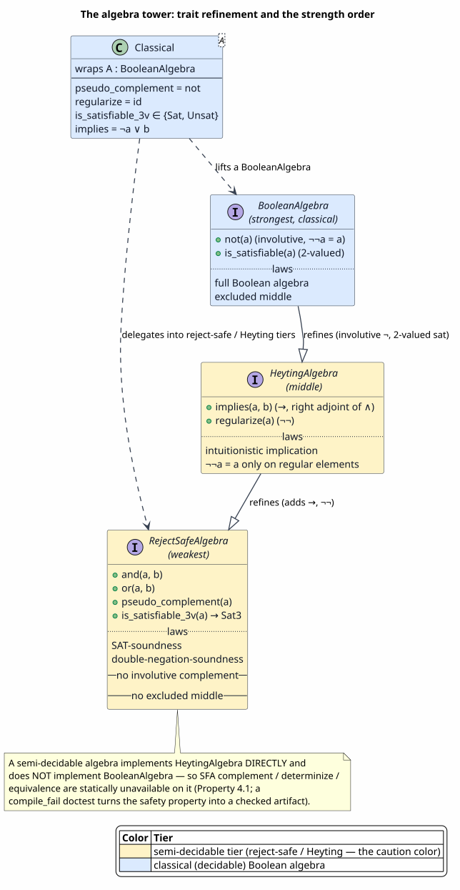
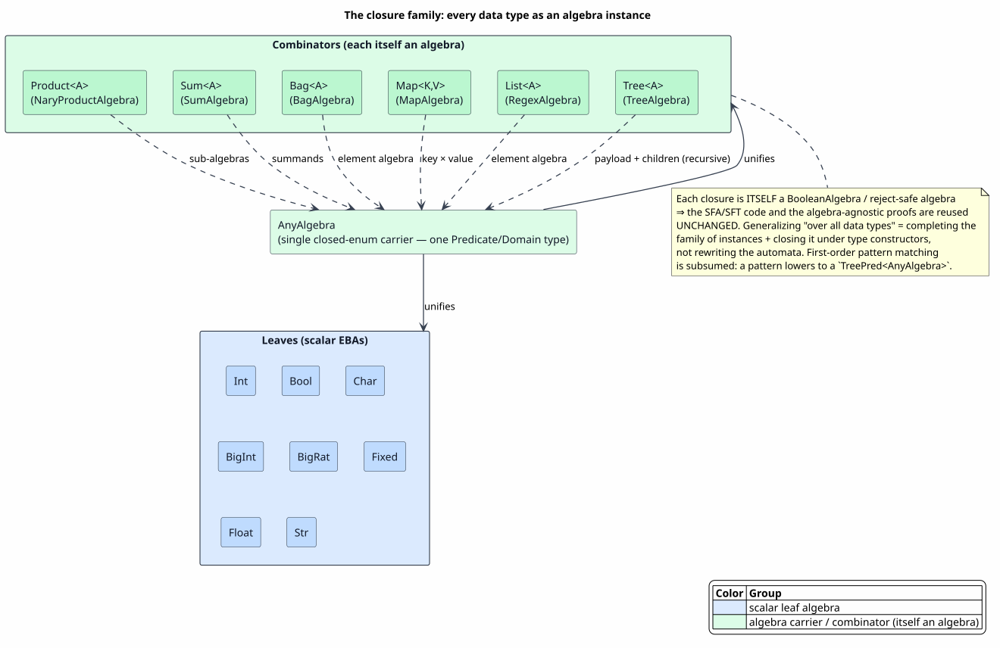

# Algebra Pyramid and Decidability

Last updated: 2026-06-22

All symbols are defined in [Concepts and Glossary](01-concepts-and-glossary.md).
This document is the conceptual heart of the substrate: the **algebra tower** that
keeps a semi-decidable behavioral algebra from ever being mistaken for a classical
one, the three-valued satisfiability and decidability tiers that quantify "how
decidable" a guard is, and the **closure family** that extends the whole framework
to every data type a `language!` can declare.

## 1. The problem the tower solves

[02 — Effective Boolean Algebra](02-effective-boolean-algebra.md) presented the
classical `BooleanAlgebra` trait: an involutive complement `¬` with `¬¬a = a`, and
a two-valued `is_satisfiable`. That is exactly right for **structural** predicates
— predicates over the *shape* of data (a constructor pattern, an interval, a
character class). Their satisfiability is decidable and their complement is exact.

It is exactly **wrong** for **behavioral** predicates — predicates over the
*dynamics* of a process, such as "does `P` halt?", "is `P` safe?", or a
modal/temporal property `AG φ`. These are only **semi-decidable**: a bounded
search can find a witness (proving satisfiability) but a budget-exhausted "no
witness found" is **not** a proof of unsatisfiability. Treating such an algebra
classically would let `¬(reachable)` be asserted from a failed bounded search —
an unsound complement that could wrongly *admit* a communication.

> **The danger, concretely.** If a behavioral algebra exposed a classical `not`,
> then an SFA `complement` or `determinize` over it would compute `¬φ` by "the
> states where `φ` failed within budget" — silently converting *don't-know* into
> *false*. A guard built on that complement could fire on a process that does
> **not** actually satisfy it.

The tower removes the danger by **type**: a semi-decidable algebra simply does not
have the classical operations, so no algorithm bounded on `BooleanAlgebra` can be
instantiated over it.



PlantUML source: [figures/05-algebra-tower.puml](figures/05-algebra-tower.puml).

## 2. The three tiers

The tower is realized in `prattail/src/algebra_tower.rs` as three traits, weakest
to strongest:

| Tier | Trait | Operations | Laws |
|---|---|---|---|
| weakest | `RejectSafeAlgebra` | `and`, `or`, `pseudo_complement`, `is_satisfiable_3v → Sat3` | SAT-soundness, double-negation-soundness. **No involutive complement, no excluded middle.** |
| middle | `HeytingAlgebra : RejectSafeAlgebra` | adds `implies` (`→`, the right adjoint of `∧`) and `regularize` (`¬¬`) | intuitionistic implication; `¬¬a = a` only on *regular* elements |
| strongest | `BooleanAlgebra` (the classical tier from [02](02-effective-boolean-algebra.md)) | involutive `not`, 2-valued `is_satisfiable` | full Boolean algebra; excluded middle |

Read the containment as *strength of available reasoning*: a `BooleanAlgebra` can
do everything a `HeytingAlgebra` can, which can do everything a `RejectSafeAlgebra`
can. The strength order is a lattice; the figure draws it as a Hasse diagram beside
the trait-inheritance view.

The middle tier's `regularize` (`¬¬`) is the **double-pseudo-complement closure
operator** — extensive, monotone, idempotent — whose fixed points (the *regular
elements*) are exactly where classical reasoning is sound; on them `¬` is involutive
and excluded middle holds for the De Morgan join, so the regular elements form a
Boolean algebra (the *Booleanization*). Those laws are the proof-home of
[12 — Heyting Behavioral Logic](12-heyting-behavioral-logic.md): the closure-operator
properties are its Lemmas 2.6–2.10, and the regular-element Booleanization
(`excluded_middle_reg`) is its Theorem 2.12. Lifting a classical algebra with
`Classical<A>` makes `regularize = id` — every element regular, the all-classical
special case.

> **Definition 2.1 (Reject-safe).** A decision procedure is *reject-safe* when it
> may **reject** a satisfiable element but **never admits** an unsatisfiable one.
> Formally, for a guard `φ` and element `e`: `decide(φ, e) = admit ⇒ e ⊨ φ`. The
> converse need not hold — a satisfiable `e` may be rejected when the bounded
> search is inconclusive. This is the only sound posture for a semi-decidable
> predicate, and it is the weak `RejectSafeLaws` contract of
> `EffectiveBooleanAlgebra.v`. That every classical (effective Boolean) algebra is
> *a fortiori* reject-safe — so existing decidable algebras drop into the
> reject-safe machinery with no obligation of their own — is proved in
> [12 — Heyting Behavioral Logic, Proposition 6.2](12-heyting-behavioral-logic.md)
> (`eba_implies_reject_safe`).

## 3. Three-valued satisfiability (`Sat3`)

A classical `is_satisfiable` returns `bool`. A semi-decidable one must be allowed
to say "I could not determine this within budget." That third answer is `Sat3`:

```rust
pub enum Sat3 { Sat, Unsat, DontKnow }
```

> **Definition 3.1 (Three-valued satisfiability).** `Sat3 := { Sat, Unsat, DontKnow }`
> is the satisfiability verdict of a possibly-incomplete decision procedure: `Sat`
> reports a witness was found, `Unsat` reports emptiness was *proved*, and `DontKnow`
> reports that a bounded search neither found a witness nor proved emptiness. The
> partial order `Unsat, Sat ⊑ DontKnow` (`DontKnow` least-defined) makes `DontKnow`
> the honest bottom; the constraint `Unsat ⇒ ¬∃` and `Sat ⇒ ∃` is what reject-safety
> (Definition 2.1) preserves.

`Sat3` carries Kleene three-valued `∧`/`∨`/`¬` and an `into_safe_bool` that maps
`DontKnow → None` (so a caller must *handle* the uncertainty rather than
accidentally coerce it to `false`). A classical algebra lifted into the tower only
ever produces `Sat`/`Unsat`; a genuinely semi-decidable algebra (for example
`BehavioralAlgebra`, a closed-world CTL model over a `FactBase`) produces
`DontKnow` precisely when a bounded reachability search neither found a witness nor
proved emptiness.

> ⚠ **Citation caveat.** `Sat3` is a **Rust** enum (`algebra_tower.rs`); it is
> **not** a Coq object, and there is no `Sat3` or `Esakia` lemma to cite. The
> mechanized account of three-valued reject-safe behavior is the `TriModel` of
> `BehavioralNegation.v` — that excluded middle fails and that negation is
> reject-safe — proved in
> [12 — Heyting Behavioral Logic, Propositions 3.2–3.4](12-heyting-behavioral-logic.md)
> (`excluded_middle_fails`, `no_classical_complement`, `tri_neg_sound`), together
> with the regular-element results — involutive `¬` on regulars and excluded middle
> for the De Morgan join — proved in
> [12 — Heyting Behavioral Logic, Lemma 2.11 and Theorem 2.12](12-heyting-behavioral-logic.md)
> (`neg_involutive_on_regular`, `excluded_middle_reg`). The consolidated proof
> ledger is [10 — Formal Verification](10-formal-verification-and-tests.md).

## 4. Realization: non-invasive lifting

The tower had to be added **without** touching the ~13 existing `BooleanAlgebra`
implementors and **without** introducing method-name ambiguity on the many
unqualified `.and()`/`.or()` calls in the existing combinators. The design that
achieves both:

- A classical algebra is lifted into the reject-safe / Heyting tiers by wrapping
  it in `Classical<A>`, whose impls *delegate* to the classical operations:
  `pseudo_complement = not`, `regularize = id`, `is_satisfiable_3v` only ever
  `Sat`/`Unsat`, `implies = ¬a ∨ b`.
- A genuinely semi-decidable algebra implements `HeytingAlgebra` **directly and
  does not implement `BooleanAlgebra`**.

The consequence is the **load-bearing safety property**:

> **Property 4.1.** Any operation bounded on `BooleanAlgebra` — every SFA
> `complement`, `determinize`, and exact `is_equivalent` — is *statically
> unavailable* on a semi-decidable algebra. Attempting to use it does not
> type-check.

This is verified by a `compile_fail` doctest on `RejectSafeProduct` in
`algebra_tower.rs`: the test *asserts that the code fails to compile*, turning the
safety property into a checked artifact rather than a convention.

## 5. The mixed guard: structural × behavioral

Most real guards are *both* structural and behavioral — for example "the message
matches pattern `P` **and** the sender `halts`." The combined algebra is
`RejectSafeProduct<S, B>`, where `S` is a classical structural algebra and `B` a
semi-decidable behavioral one. It is `RejectSafeAlgebra` **only** (never
`BooleanAlgebra`, by Property 4.1, since one leg is semi-decidable), and its
pseudo-complement is the **asymmetric De Morgan** law:

`¬(a ∧ b) = (¬a ∧ ⊤) ∨ (⊤ ∧ ¬b)`

where `¬a` is the *exact* structural complement and `¬b` is the *reject-safe*
behavioral pseudo-complement. The result is a proven **reject-safe
over-approximation** of the true complement: it may reject more than necessary but
never admits a non-member.

> **Theorem 5.1 (Mixed-negation soundness).** For the mixed guard `a ∧ b`, the
> asymmetric complement `(¬a ∧ ⊤) ∨ (⊤ ∧ ¬b)` accepts an element only if the true
> product `a ∧ b` rejects it — the guarded action cannot fire when its complement
> holds. This is proved in
> [12 — Heyting Behavioral Logic, Theorem 6.1](12-heyting-behavioral-logic.md)
> (`mixed_negation_soundness`, with corollary `mixed_guard_no_false_fire`, and the
> run-time mirror `rho_complement_no_commit`); zero-admission. The asymmetry of the
> two De Morgan laws that *forces* this padded `⊤`-disjoined shape — `¬(a ∨ b) = ¬a ∧ ¬b`
> survives intuitionistically but `¬(a ∧ b) = ¬a ∨ ¬b` does not — is doc 12 §2.1.

The practical payoff: a language may freely mix structural and behavioral guards
and still get a *sound* (reject-safe) compile-time analysis — never a false fire —
which is exactly what the integration in
[07 — Language-to-Rholang Integration](07-language-to-rholang-integration.md)
requires before it will admit the language.

## 6. Decidability tiers

Orthogonal to the algebra tier (which is about *available operations*) is the
**decidability tier**, which classifies a guard by *when* it can be decided.

> **Definition 6.1 (Decidability tier).** `DecidabilityTier := { T1 < T2 < T3 < T4 }`
> is the four-element chain ordered by *how late* a guard must be decided, with two
> derived flags: `tsound` (the verdict is reject-safe) holds on `T1, T2, T3` and
> fails on `T4`; `tcomplete` (the verdict is also exact) holds on `T1, T2` and fails
> on `T3, T4`. `T1` = compile-time decidable, `T2` = runtime-decidable, `T3` =
> semi-decidable (bounded), `T4` = undecidable / asserted.

| Tier | `DecidabilityTier` | `GuardTier` (Rho mirror) | Meaning |
|---|---|---|---|
| T1 | `CompileTimeDecidable` | `T1Exact` | decided entirely at compile time (pure structure / constants) |
| T2 | `RuntimeDecidable` | `T2Decidable` | decidable, but needs the runtime value |
| T3 | `SemiDecidable` | `T3Bounded` | decidable only up to a bound (reachability within budget) |
| T4 | `Undecidable` | `T4Asserted` | not decidable; must be trusted/asserted or host-observed |

The tier of a *combined* guard is the **weakest leg**: `tier(a ∧ b) = tier_max(tier a,
tier b)` under the order `T1 ≤ T2 ≤ T3 ≤ T4`. This `tier_max` operation is a
join-semilattice, and combination is a **homomorphism** into it — a guard built
from sub-guards has exactly the tier the lattice predicts.

> **Theorem 6.2 (Tier lattice and the regularity correspondence).** `(tier,
> tier_max)` is a join-semilattice and combination is a homomorphism into it
> (`tier_max(a, b)` returns the higher-indexed tier, and both `tsound` and
> `tcomplete` are conjunctive across it). The tier ↔ regularity correspondence ties
> the chain to the Heyting regular elements of §2: `Reg` (T1/T2) is the exact
> Boolean core, `Boundary` (T3) is the `Sat3::DontKnow` gap `¬¬a` above `a`, and
> `Closed` (T4) is the refutable/trusted class. This is proved in
> [12 — Heyting Behavioral Logic, Proposition 6.3](12-heyting-behavioral-logic.md)
> (`tier_max_sound_hom`, `tier_max_complete_hom`, `tier_regularity_reg`,
> `tier_regularity_boundary`, `tier_regularity_closed` in `GuardTierCertificate.v`);
> zero-admission.

The tier drives the **quality** grade the backend consumes (T1 and T2 yield exact,
T3 yields bounded, T4 yields trusted), detailed in
[07 — Language-to-Rholang Integration](07-language-to-rholang-integration.md).

## 7. Closing the family under type constructors

A `language!` declares arbitrary data types — tuples, variants, lists, bags, maps,
recursive trees. The substrate covers *all* of them not by writing new automata
but by **closing the EBA family under a small set of constructors**, each of which
is itself a `BooleanAlgebra` (or reject-safe algebra), so the SFA/SFT code and the
algebra-agnostic proofs of [10](10-formal-verification-and-tests.md) apply verbatim.



PlantUML source: [figures/05-closure-family.puml](figures/05-closure-family.puml).

| Constructor | Algebra | Predicate intuition | Closure theorem (proved below) |
|---|---|---|---|
| product (tuple/record) | `NaryProductAlgebra<A>` | a rectangle in `D_A × D_B × …`; complement is a DNF of rectangles | Theorem 7.2 (`product_eba_laws`) |
| sum (variant/alternation) | `SumAlgebra<A>` | a tagged choice; project into a summand | Theorem 7.3 (`sum_eba_laws`) |
| collection (bag) | `BagAlgebra<A>` | a per-minterm occupancy-count vector | Theorem 7.4 (`collection_eba_laws`) |
| collection (map) | `MapAlgebra<K,V>` | key × value counts + distinct-key cap | Theorem 7.4 (`collection_eba_laws`) |
| sequence (list) | `ListAlgebra<A>` = `RegexAlgebra<A>` | an ordered language, recognized by an SFA | Theorem 7.4 (`collection_eba_laws`) |
| recursive tree | `TreeAlgebra<A>` | "constructor `c` ∧ payload ⊨ `φ` ∧ childᵢ ⊨ `φᵢ`" | Theorem 7.5 (`tree_eba_laws`) |
| theory combination | exact union decision | two decidable atom theories plus a proved-exhaustive shared universe | Theorem 7.6 (`combined_eba_laws`) |

Each row is a stated-and-proved closure theorem in the subsections below: the
collection and tree complements rest on the SFA **minterms** of
[02 §4](02-effective-boolean-algebra.md) (every element falls in exactly one
minterm), and the tree case subsumes **first-order pattern matching**. The shared
contract comes first.

### 7.1 The EBA contract each constructor preserves

The closure proofs all establish the *same* nine-law contract. Stating it once fixes
exactly what each theorem below must reconstruct.

> **Definition 7.1 (Effective Boolean algebra).** An **effective Boolean algebra**
> (EBA) over a domain `D` is a predicate syntax `P` with constructors `⊤, ⊥`, `∧`,
> `∨`, `¬` and three decision procedures `eval : P → D → bool`, `sat : P → bool`,
> `wit : P → option D` satisfying:
> - **`eval` is a Boolean homomorphism:** `eval ⊤ d = true`, `eval ⊥ d = false`,
>   `eval(p ∧ q) d = eval p d ∧ eval q d`, `eval(p ∨ q) d = eval p d ∨ eval q d`,
>   and `eval(¬p) d = ¬eval p d`;
> - **`sat` is sound and complete vs `eval`:** `sat p = true ⟹ ∃ d. eval p d = true`
>   (sound) and `eval p d = true ⟹ sat p = true` (complete);
> - **`wit` is sound and total:** `wit p = Some d ⟹ eval p d = true` (sound) and
>   `sat p = true ⟹ ∃ d. wit p = Some d` (total).
>
> Mechanized as the record `EBA_Laws` in `EffectiveBooleanAlgebra.v`. Two derived
> facts of that file are reused throughout the closure proofs: `wit_none_of_unsat`
> (an unsatisfiable predicate has no witness — the contrapositive of `wit_sound`
> with `sat_complete`) and the standard bridge `existsb f l = true ⟹ ∃ x. find f l =
> Some x ∧ f x = true` (a positive `existsb` is witnessed by what `find` returns).

The **closure family** is the statement that this contract is *preserved* by each
type constructor: given EBAs for the parts, the constructor yields an EBA for the
whole, so the SFA/SFT code and the algebra-agnostic proofs of
[10](10-formal-verification-and-tests.md) apply verbatim to the composite. Each
theorem below names its mechanizing Coq result; all are zero-admission, built with
`make -C formal check-capped FORMAL_CAPPED_TARGET=rocq-symbolic-algebra`.

### 7.2 Product: independent tuples

> **Theorem 7.2 (the binary product of two EBAs is an EBA).** Let `A` and `B` be
> EBAs (Definition 7.1). Over the domain `D_A × D_B`, take predicates to be a
> **DNF of rectangles** — a finite list `L` of pairs `(pa, pb)` with `pa : Pred A`,
> `pb : Pred B` — under `eval L (da, db) = existsb (λ(pa,pb). eval_A pa da ∧ eval_B
> pb db) L`, with `⊤ = [(⊤_A, ⊤_B)]`, `⊥ = []`, `∨` = list append, `∧` the
> cross-product of rectangles, and complement the cross-product of the
> per-rectangle complements `¬(pa, pb) = (¬pa, ⊤_B) ∨ (⊤_A, ¬pb)`. This is an EBA.
>
> *Proof.* We discharge the nine laws of Definition 7.1.
>
> *`eval` homomorphism.* `⊤` and `⊥` are immediate: `eval [(⊤_A,⊤_B)] (da,db) =
> eval_A ⊤_A da ∧ eval_B ⊤_B db = true ∧ true = true` using the factor `eval_top`
> laws, and `eval [] = existsb _ [] = false`. For `∨`, `existsb` over an append
> splits: `eval(L₁ ∨ L₂) d = existsb f (L₁ ++ L₂) = existsb f L₁ ∨ existsb f L₂ =
> eval L₁ d ∨ eval L₂ d`. For `∧`, the cross-product `flat_map (λr₁. map (λr₂.
> r₁ ⊓ r₂) L₂) L₁` evaluates, by the `existsb`/`flat_map` and `existsb`/`map`
> distribution laws and the per-rectangle identity
> `eval_A(pa₁ ∧ pa₂) da ∧ eval_B(pb₁ ∧ pb₂) db = (eval_A pa₁ da ∧ eval_B pb₁ db) ∧ (eval_A pa₂ da ∧ eval_B pb₂ db)`
> (factor `eval_conj` plus Boolean rearrangement), to `eval L₁ d ∧ eval L₂ d`
> (`pdnf_conj_eval`). For `¬`, first one rectangle: by the factor `eval_neg` and
> `eval_top` laws, `eval (¬(pa,pb)) d = (¬eval_A pa da ∧ true) ∨ (true ∧ ¬eval_B pb
> db) = ¬(eval_A pa da ∧ eval_B pb db)` — exactly De Morgan on a single rectangle
> (`rect_neg_eval`). The complement of a list is `fold_right (λr acc. ¬r ⊓ acc) ⊤`
> over its rectangles; by induction on `L`, using the `∧`-homomorphism and the
> single-rectangle De Morgan at each step, `eval(¬L) d = ¬(eval L d)` — the De
> Morgan recursion that turns the disjunction-of-rectangles into the
> conjunction-of-complements (`pdnf_neg_eval`).
>
> *`sat`/`wit`.* Decide the list rectangle-wise: `sat L = existsb (λ(pa,pb). sat_A
> pa ∧ sat_B pb) L`, and `wit L` finds the first rectangle with both factors
> satisfiable and pairs their witnesses. *Soundness of `sat`:* a witnessing
> rectangle `(pa, pb)` gives, by the factors' `sat_sound`, points `da, db` with
> `eval_A pa da = eval_B pb db = true`, so `(da, db)` satisfies `L`. *Completeness:*
> if `(da, db)` satisfies `L`, the witnessing rectangle has each factor satisfied at
> `da`/`db`, so each factor's `sat_complete` makes its `sat` true. *`wit` soundness*
> follows from the factors' `wit_sound` on the found rectangle; *`wit` totality*
> from the factors' `wit_total`. Thus `sat`/`wit` reduce to the factors' `sat`/`wit`,
> and the product is an EBA. `∎`
> (Mechanized as `product_eba_laws` in `ProductAlgebraClosure.v`; the De Morgan crux
> is `pdnf_neg_eval`, conjunction `pdnf_conj_eval`. The N-ary `NaryProductAlgebra`
> iterates this binary closure.)

The per-rectangle complement `¬(pa, pb) = (¬pa, ⊤) ∨ (⊤, ¬pb)` is the **same
asymmetric, `⊤`-padded De Morgan shape** as the mixed guard of §5 and of
[12 — Heyting Behavioral Logic, Theorem 6.1](12-heyting-behavioral-logic.md): a
product's complement pads each factor with the other factor's `⊤` and disjoins,
because a plain `(¬pa, ¬pb)` would describe only the corner where *both* factors
fail.

### 7.3 Sum: tagged variants

> **Theorem 7.3 (the tagged coproduct of two EBAs is an EBA).** Let `A` and `B` be
> EBAs. Over the domain `D_A + D_B`, take predicates to be the Boolean closure of
> the tag/payload atoms (`InL pa`, `InR pb`, `TagL`, `TagR`) under the obvious
> case-on-tag `eval`. This is an EBA.
>
> *Proof.* The five `eval` laws are **definitional**: `⊤, ⊥, ∧, ∨, ¬` are carried as
> the syntactic constructors and `eval` is defined to commute with each, so every
> homomorphism equation holds by `reflexivity`. For `sat`/`wit`, push the Boolean
> structure into the matching factor by the **per-tag projections** `project_L :
> SumPred → Pred A` and `project_R : SumPred → Pred B` (mapping `InL pa ↦ pa`,
> `InR _ ↦ ⊥_A`, `TagL ↦ ⊤_A`, `TagR ↦ ⊥_A`, and `∧/∨/¬` homomorphically, and dually
> for `R`). The key lemma is **projection-correctness**: on a left injection,
> `eval p (inl da) = eval_A (project_L p) da` (and dually `project_R_correct` on
> `inr`), proved by induction on `p` using the factor's `eval_*` laws at each node.
> Then `sat p := sat_A (project_L p) ∨ sat_B (project_R p)` and `wit` returns the
> first projection that witnesses. *Soundness/completeness of `sat`* and *soundness/
> totality of `wit`* now reduce to the factors' own laws: a satisfying point lives in
> exactly one summand, where projection-correctness identifies satisfaction of `p`
> with satisfaction of the projected factor predicate (the fall-through `wit_total`
> case uses `wit_none_of_unsat` of Definition 7.1). Hence the coproduct is an EBA. `∎`
> (Mechanized as `sum_eba_laws` in `SumAlgebraClosure.v`; the crux is
> `project_L_correct` / `project_R_correct`. The N-ary homogeneous tagged union
> iterates this binary coproduct.)

### 7.4 Collection: order-insensitive bags

> **Theorem 7.4 (the bag algebra over a finite class basis is an EBA).** Fix an EBA
> `A` and a finite **basis** `classes = [c₀, …, c_{n−1}]` of element predicates. Over
> the domain of bags (finite multisets of `Dom A`, carried as lists since predicates
> only *count occupancy*), take predicates to be the Boolean closure of the
> **occupancy atoms** `CFAtom i` = "some element of the bag satisfies `cᵢ`", under
> `eval(CFAtom i) bag = existsb (λe. eval_A cᵢ e) bag`. This is an EBA.
>
> *Proof.* The five `eval` laws are again definitional (`⊤, ⊥, ∧, ∨, ¬` are the
> syntactic Boolean constructors and `eval` commutes with each by `reflexivity`).
> The content is `sat`/`wit`, decided by **occupancy-support enumeration**.
>
> Abstract a bag by its **support** `support(bag) : list bool` — bit `i` records
> whether the bag occupies class `cᵢ`. A formula's truth depends only on the support:
> `eval f bag = funder f (support bag)`, where `funder` reads `CFAtom i` off the
> bit vector (`ceval_funder_support`, by induction on `f`). There are finitely many
> supports — `all_bvecs n` enumerates the `2ⁿ` bit vectors of length `n = |classes|`,
> and that enumeration is exhaustive (`all_bvecs_complete`: every `support(bag)`
> occurs) and length-correct (`all_bvecs_length`). A support `a` is **realizable**
> when every occupied class is *jointly* satisfiable with the negations of the
> unoccupied classes — i.e. for each `i` with `a[i] = true`, the factor predicate
> `cᵢ ∧ ⋀_{a[j]=false} ¬cⱼ` is `A`-satisfiable (`neg_constraint a` is that
> conjunction of negations of unoccupied classes). Define `sat f = existsb (λa.
> realizable a ∧ funder f a) (all_bvecs n)` and let `wit` materialize, from a
> realizable formula-satisfying support, the bag `wit_bag a` = one factor-witness per
> occupied class.
>
> The decisive lemma is **`support_wit_bag`**: for a realizable `a` of the right
> length, `support(wit_bag a) = a` — the materialized bag occupies *exactly* the
> classes `a` prescribes. The occupied direction holds because realizability hands
> each occupied class a witness (`wit_total` on its factor predicate), which lands in
> `wit_bag a`; the unoccupied direction holds because every element of `wit_bag a`
> satisfies `neg_constraint a` (by `wit_sound` on the factors), so by
> `neg_constraint_sound` no element of `wit_bag a` satisfies an unoccupied class.
> Symmetrically, **`realizable_support`**: every actual bag's support is realizable
> (each occupied class is witnessed by an actual occupant, with the unoccupied classes
> genuinely absent, discharged by `neg_constraint_complete` and the factor's
> `sat_complete`). *Soundness of `sat`:* a realizable formula-satisfying support `a`
> yields the bag `wit_bag a`, and `eval f (wit_bag a) = funder f (support(wit_bag a))
> = funder f a = true`. *Completeness:* any satisfying bag contributes its support,
> realizable by `realizable_support` and formula-satisfying by the bridge. *`wit`
> soundness/totality* follow the same support, via `find` over `all_bvecs`. Hence the
> bag algebra is an EBA. `∎`
> (Mechanized as `collection_eba_laws` in `CollectionAlgebraClosure.v`; the crux is
> `support_wit_bag` and `realizable_support`. The map (`MapAlgebra`) and sequence
> (`ListAlgebra`/`RegexAlgebra`) constructors are built over this same occupancy /
> minterm idea — keys × values with a distinct-key cap, and an ordered language
> recognized by an SFA, respectively — and share this closure result.)

The collection complement uses the SFA **minterms** of
[02 §4](02-effective-boolean-algebra.md): every element falls in exactly one
minterm, so a bag is characterized by its per-minterm occupancy vector. This is the
mechanism the table's three collection rows share.

### 7.5 Tree: ranked recursive terms

> **Theorem 7.5 (the ranked-tree algebra over a payload EBA is an EBA).** Fix a
> payload EBA `A` whose domain is partitioned into a finite, complete, inhabited set
> of minterm classes `Σ` (every payload has a class via a total `letter : Dom A → Σ`,
> and every used class has a witness payload via `pick`). Over the domain of ranked
> trees with `A`-payloads, take predicates to be **deterministic complete bottom-up
> tree automata** over `Σ`, with `eval M t = final M (run M t)` the single bottom-up
> run. This is an EBA.
>
> *Proof.* `⊤` and `⊥` are the one-state automata whose `final` is constantly `true`
> / `false`. `∧` and `∨` are the **automaton product** `tprod fin M N` — state set
> `Qst M × Qst N`, transitions taken componentwise, `final` combined by `fin` (taking
> `fin = andb` for `∧`, `orb` for `∨`). Because the product runs to the pair of
> component runs, `run (tprod fin M N) t = (run M t, run N t)` (`run_tprod`, by
> induction on `t`), the homomorphism laws `eval(M ∧ N) t = eval M t ∧ eval N t` and
> the `∨` analogue follow immediately (`teval_tconj`, `teval_tdisj`). `¬` **flips the
> final states** — same transitions, `final` negated — and since the run is
> unchanged (`run_tneg`), `eval(¬M) t = ¬eval M t` (`teval_tneg`); no determinization
> is needed because every predicate is *born* deterministic and complete (the product
> of deterministic complete automata is again deterministic and complete).
>
> `sat`/`wit` are decided by **bottom-up saturation to a finite-lattice fixpoint**.
> Iterate the operator that adds, to a working set of (reachable state, witness tree)
> pairs, every leaf state and every node state reachable by combining states already
> present (`tstep`); its present-state projection is the set operator `Fstep`, which
> is **extensive, monotone, and bounded** by the finite state enumeration
> (`Fstep_extensive`, `Fstep_mono`, `Fstep_bounded`). A generic stabilization
> argument — an extensive, inclusion-monotone operator on subsets of a finite
> universe reaches a fixpoint within `|universe|` iterations from `∅`, proved by a
> strict-cardinality-growth-or-stall dichotomy — gives that iterating `length
> (q_enum M)` times closes the reachable set under one more step (`stabilizes`,
> hence `present_closed`). Every tree's run-state is therefore reached, *with a
> witness tree* (`present_complete` / `pairs_complete`), and the saturation invariant
> `run M t = q` holds for every carried pair `(q, t)` (`sat_pairs_inv`). Define `sat
> M = existsb (final M ∘ fst) (sat_pairs M)` and `wit M` = the witness tree of the
> first final pair. *Soundness of `sat`:* a final pair `(q, t)` has `run M t = q` by
> the invariant, so `eval M t = final M q = true`. *Completeness:* any accepted tree
> `t` has its run-state present with a witness, which is a final pair. *`wit`
> soundness/totality* follow the same `find`. Hence the tree algebra is an EBA. `∎`
> (Mechanized as `tree_eba_laws` in `TreeAlgebraClosure.v`; the Boolean crux is
> `teval_tconj` / `teval_tdisj` / `teval_tneg`, decidable emptiness is the generic
> `stabilizes` saturation, and acceptance soundness is `tsat_sound`. The finite,
> complete, inhabited payload partition `Σ` is exactly the per-constructor minterm
> set computed in `CollectionAlgebraClosure.v`, taken here as the abstract interface.)

This is what subsumes **first-order pattern matching**: a pattern lowers to a
`TreePred<AnyAlgebra>` (constructor node + `Var` wildcards + symbolic payload
guards), and `match P t ⟺ TreeAlgebra.evaluate(toTreePred(P), toSymTerm(t))`;
inhabitation is `is_satisfiable`, and `witness` even yields a sample matched term
the bespoke matcher cannot.

### 7.6 Theory combination: the Nelson–Oppen base case

> **Theorem 7.6 (two decidable theories over a shared enumerable domain combine into
> an EBA).** Let `D` be an enumerable domain with an **exhaustive** enumeration
> `enum : list D` (`∀d. In d enum`). Let two component theories be given by their
> atom syntaxes `Pred_A, Pred_B` and atom evaluators `eval_A, eval_B : Pred_· → D →
> bool` over the *shared* `D`. Take predicates to be the Boolean closure `CForm` of
> `A`-atoms and `B`-atoms (the shared-variable union `T_A ∪ T_B`), evaluated
> pointwise at a shared assignment `d : D`. Then `csat f := existsb (λd. eval f d)
> enum` and `cwit f := find (λd. eval f d) enum` make this an EBA.
>
> *Proof.* The five `eval` laws are definitional (the Boolean constructors are
> syntactic and `ceval` commutes with each by `reflexivity`). For the decision
> procedures, the search over `enum` is **exact precisely because `enum` is
> exhaustive**. *Soundness of `csat`:* if `existsb (λd. eval f d) enum = true` then
> by the `existsb` characterization some enumerated `d` has `eval f d = true`, so `f`
> is satisfiable (`csat_sound`). *Completeness:* if `eval f d = true` for any `d`,
> then since `In d enum` (exhaustiveness), `d` witnesses `existsb`, so `csat f =
> true` (`csat_complete`). *`cwit` soundness:* `find` returns an element satisfying
> the predicate (`cwit_sound`). *`cwit` totality:* a positive `csat` is witnessed by
> what `find` returns, via the `existsb`/`find` bridge of Definition 7.1
> (`cwit_total`). Hence the union theory is an EBA. `∎`
> (Mechanized as `combined_eba_laws` in `TheoryCombination.v`, with `csat_sound`,
> `csat_complete`, `cwit_sound`, `cwit_total`; exhaustiveness is the hypothesis
> `enum_all`.)

This is **the joint-search base case** of theory combination, *not* the full
Nelson–Oppen procedure. The exact joint search over an enumerable `D` is the sound,
possibly-exponential fallback; the crux of the actual
[Nelson & Oppen, 1979](references.md#nelson-oppen-1979) theorem — combining
decidable theories *without* enumerating an infinite domain, by exchanging only
equalities over the shared signature under the stably-infinite, disjoint-signature,
and convexity hypotheses — is deliberately **out of scope**, and Theorem 7.6 names
those stronger hypotheses it specializes rather than implying it. The full
infinite-domain equality-exchange engine is the subject of
[13 — Constraint Theory Engine](13-constraint-theory-engine.md).

## 8. The carrier that holds it all

All of these instances unify under the single closed-enum carrier `AnyAlgebra`
([02 §6](02-effective-boolean-algebra.md)), so a tree node's heterogeneous
children share one `Predicate`/`Domain` type and the whole family drops into the
automata by `match` dispatch with no `dyn` and no allocation in the hot path. The
`SortRegistry::from_grammar` derives the per-language family from the declared
`NativeKind`s and grammar categories — the boundary contract that
[07](07-language-to-rholang-integration.md) builds on.

## 9. Summary — what the tower guarantees

1. **Soundness by type.** A semi-decidable behavioral algebra cannot be used where
   a classical one is required; the `complement`/`determinize`/`equivalence`
   algorithms are statically unavailable on it (Property 4.1).
2. **Reject-safety end to end.** Mixed structural × behavioral guards complement by
   asymmetric De Morgan and are proven never to fire falsely (Theorem 5.1).
3. **Quantified decidability.** Every guard carries a tier; combination is a proven
   join-semilattice homomorphism (Theorem 6.2), and the tier sets the quality the
   backend gates on.
4. **Every data type, one library.** The family is closed under product (Theorem
   7.2), sum (Theorem 7.3), collection (Theorem 7.4), tree (Theorem 7.5), and theory
   combination (Theorem 7.6), each itself an EBA, so the automata and the proofs are
   reused unchanged.
