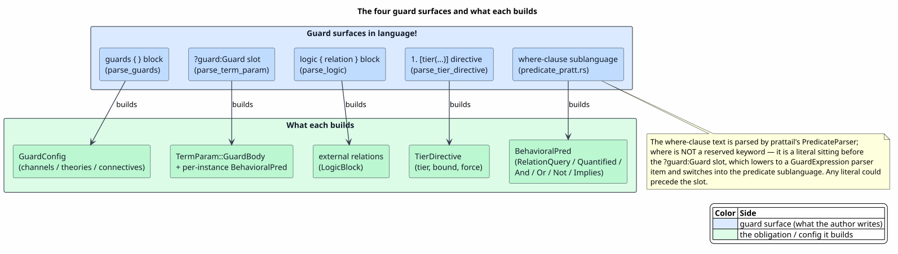
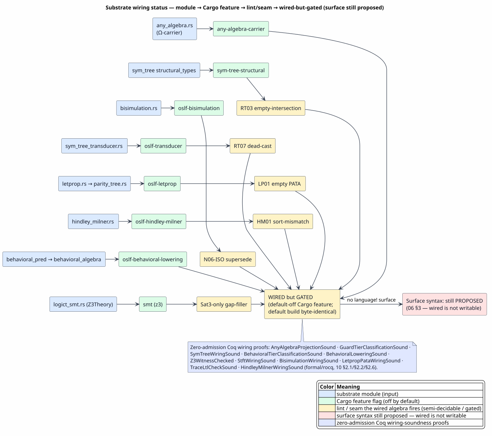

# Guard Syntax and Extensions

Last updated: 2026-06-23

All symbols are defined in [Concepts and Glossary](01-concepts-and-glossary.md).
This document is the **syntax reference** for semantic-predicate guards: exactly
what a language author can write today in a `language!` specification (grounded in
the real parser, not the design specs), and a **proposed** clean syntax for the
algebra features that have semantics and proofs but no surface form. The algebras
themselves are documented in [02](02-effective-boolean-algebra.md)–[05](05-algebra-pyramid-and-decidability.md);
the engine that evaluates a quantified or theory guard is
[13 — Constraint-Theory Engine](13-constraint-theory-engine.md); the reject-safe
behavioral (Heyting) tier is [12 — Heyting Behavioral Logic](12-heyting-behavioral-logic.md);
and how guards lower and execute is [07](07-language-to-rholang-integration.md)–[08](08-runtime-comm-enforcement.md).
This document is a **syntax reference**, so each construct's proved result is stated in
one line and **cross-referenced to its proof-home** in those documents rather than
re-proved here; the mechanizing Coq lemma is named only as a parenthetical citation.



PlantUML source: [figures/06-guard-surfaces.puml](figures/06-guard-surfaces.puml).

## 0. The status convention

Every construct in this document carries one status badge:

| Badge | Meaning |
|---|---|
| ✅ Supported | The parser produces it today from source; an entry point and a passing test exist. |
| ◐ Partial | Some surface syntax exists but the construct is incompletely wired (parses but lowers to a weaker node, or only one spelling works). |
| ⊳ Proposed | The algebra and (usually) the proof exist, but there is no way to write it in a `language!` spec. This document **proposes** the syntax. |

Each construct also carries an evidence line with four fixed fields:
`Algebra:` the Rust type/fn · `Proof:` the `.v` file or `none` · `Builds:` the
`BehavioralPred` variant or algebra instance · `Parser:` the parser fn or `—`.

Reserve `⊳` exclusively for proposed *surface syntax* — a reader can grep this
document for `⊳` to see every construct that has no `language!` spelling. Read the
scope carefully: `⊳` marks the **syntax** as unwritten, **not** the algebra as
unbuilt. Most of these algebras are in fact **wired into the live analysis pipeline**
behind a default-off Cargo feature, firing as a lint (`RT03`, `RT07`, `LP01`, `HM01`,
the `N06-ISO` bisimulation supersede, the `letprop → PATA` decision); the default
build stays byte-identical. So `⊳` means **wired but not writable** — the algebra runs
as analysis, you simply cannot name it from a `language!` spec.

> **Spec versus reality.** The design specifications `docs/design/predicated-types.md`
> and `docs/design/guards-block.md` describe several constructs as if live that the
> *actual parser* handles differently. Those differences are load-bearing, so each
> is flagged inline as a **Spec vs. reality** note. They are also consolidated in
> [§2.6](#26-what-the-spec-docs-claim-that-the-parser-does-not-do).

## 1. The four guard surfaces

A language author touches the guard machinery in exactly four places:

| Surface | Where written | Parser entry | Status |
|---|---|---|---|
| `guards { … }` block | top-level sibling of `terms { }` | `parse_guards` (`ast/src/language/parse.rs`) | ✅ block + `channels`; ◐ predicates/connectives/theories |
| `?name:Guard` term slot | inside a `terms { }` rule's term context | `parse_term_param` (`ast/src/grammar.rs`) | ✅ |
| `where`-clause predicate sublanguage | the source text a user types at the guard slot | `predicate_pratt.rs` via `parse_predicate_from_str` | ✅ |
| `logic { relation R(Cat); … }` block | top-level sibling of `terms { }` | `parse_logic` (`ast/src/language/parse.rs`) | ✅ |
| `#[tier(...)]` rule directive | immediately before a `terms { }` constructor | `parse_tier_directive` (`ast/src/grammar.rs`) | ✅ |

> **Spec vs. reality (two `BehavioralPred` types).** There are two distinct
> `BehavioralPred` enums. The macro-AST one (`ast/src/language/model.rs`) has
> `Quantified { quantifier, var, domain: Option<Ident>, bound: Option<usize>, body }`
> and `PredArg::{Var, Constant}`. The runtime/parser one
> (`prattail/src/behavioral_pred.rs`) has
> `Quantified { quantifier, var, domain: Option<QuantifiedDomain>, body }` — no
> separate `bound` field; the bound is folded into `QuantifiedDomain::Bounded(n)` —
> and `PredArg::{Var, IntLit, StringLit}` (no `Constant`, but integer and string
> literals). The `where`-clause parser produces the **prattail** enum; the
> AST enum is what `guard(...)` premises in `equations { }`/`rewrites { }` lower
> to. This document grounds the surface syntax in the prattail enum.

> **Spec vs. reality (`where` is not reserved).** `predicate_pratt.rs` is
> trigger-agnostic. The keyword `"where"` in GuardedRho's rule is simply a literal
> sitting before the guard parameter; the switch into the predicate sublanguage
> happens because the `?guard:Guard` slot lowers to a `GuardExpression` parser item,
> not because `where` is special. Any literal could precede the slot.

## 2. Existing syntax reference

### 2.1 The `guards { }` block

```ebnf
guards_block ::= "guards" "{" guard_item* "}" ","?
guard_item   ::= predicate_decl | connectives_blk | theories_blk | channels_blk
```

The sub-blocks are order-free and each appears at most once (`predicate_decl` any
number of times).

#### 2.1.1 Built-in predicate declarations — ◐

`Algebra:` n/a · `Proof:` none · `Builds:` `BuiltinPredicate` on `GuardConfig` ·
`Parser:` `parse_builtin_predicate`

```ebnf
predicate_decl ::= Label "." param_list "|-" syntax_form ("|" syntax_form)* annotations? ";"
param          ::= Ident (":" param_type)? quantifier?
param_type     ::= Ident | "(" Ident ("|" Ident)* ")"          (* single | union *)
quantifier     ::= "+" | "*" | "{" Int? "," Int? "}"           (* one-or-more | zero-or-more | range *)
annotations    ::= "@" "[" anno ("," anno)* "]"
anno           ::= "selectivity" "(" Float ")" | "cost" "(" Int ")"
```

A `Label . params |- form` declaration has the same judgment shape as a `terms { }`
rule; fixity is read off the form. The `selectivity` value lies in `[0.0, 1.0]` and
`cost` in `ℕ`. Examples:

```text
gt . x, y |- x ">" y | "gt" "(" x "," y ")" ;
eq . x, y |- x "==" y @[selectivity(0.1), cost(2)] ;
num . xs: (Int|Float) |- "num" "(" xs ")" ;
bounded . xs{2,5} |- "b" "(" xs ")" ;
```

Declaring any built-in predicate (the `Some(_)` case) switches the language to
**closed-world** resolution — only the listed predicates plus `logic { }` relations
are resolvable; the `None` case is **open-world**.

> **Spec vs. reality (unused in-tree).** `builtin_predicates`, `connectives`, and
> `theories` parse, but among the shipping languages in `languages/src/` **none**
> uses them — only `ast/src/language/tests.rs` exercises them. Treat the examples
> here as parser-validated, not battle-tested by a production language.

#### 2.1.2 `connectives { }` — ◐

`Builds:` `ConnectiveMap` · `Parser:` `parse_connectives_block`

```ebnf
connectives_blk ::= "connectives" "{" connective_decl* "}"
connective_decl ::= role "=" Str ("|" Str)* ";"
role            ::= "and" | "or" | "not" | "entails" | "implied_by" | "iff" | "forall" | "exists"
```

The role set is closed (`ConnectiveRole`). Each role maps to a fixed
`BehavioralPred` shape:

| role | builds | role | builds |
|---|---|---|---|
| `and` | `And` | `entails` | `Implies(p, c)` |
| `or` | `Or` | `implied_by` | `Implies(c, p)` |
| `not` | `Not` | `iff` | `And(Implies(a,b), Implies(b,a))` |
| `forall` | `Quantified { ForAll, … }` | `exists` | `Quantified { Exists, … }` |

Example: `and = "and" | "∧"; or = "or" | "∨"; not = "not" | "¬";`. The lint
`CONN01` rejects one keyword mapped to two roles.

> **Spec vs. reality (two connective paths).** With an active map, the macro path
> still recognizes the hardcoded tokens `&&`, `||`, `~`, `!`, `=>` for
> compatibility, while the string-based `predicate_pratt.rs` path (used for
> `?guard:Guard` slots) ignores those and uses its own default spellings. The two
> resolution paths have subtly different defaults; the `where`-clause spellings are
> the ones in [§2.3.2](#232-connective-spellings-and-comparison-desugaring).

#### 2.1.3 `theories { }` — ◐

`Builds:` `TheoryRegistration` · `Parser:` `parse_theories_block`

```ebnf
theories_blk ::= "theories" "{" theory_reg* "}"
theory_reg   ::= Ident "=" RustType ("for" "[" Ident ("," Ident)* "]")? ";"
```

`RustType` is a full Rust type; the optional `for [Cat…]` lists the handled
categories (omission means "all categories"). Examples:

```text
arithmetic = PresburgerAlgebra for [Int];
patterns   = UnificationTheory for [Proc, Name];
types_t    = LatticeTheory;
```

> **Spec vs. reality (string-match activation).** Theory activation is by
> *stringified type name*: `"PresburgerAlgebra" | "Presburger" | "PresburgerTheory"`
> activates module M12; `"UnificationTheory" | "Unification"` activates M13;
> `"LatticeTheory" | "Lattice"` activates M14. Any other type name silently
> activates no module. There is no way today to register a *new* theory type beyond
> these three by name.

#### 2.1.4 `channels { }` — ✅

`Builds:` `ChannelConfig` · `Parser:` `parse_channels_block`

```ebnf
channels_blk ::= "channels" "{" channel_item* "}"
channel_item ::= "channel" Ident ";"
               | "join" Ident "(" chan_param ("," chan_param)* ")" ";"
chan_param   ::= Ident ":" Ident                               (* param : Category *)
```

Activation is deterministic: a `join` with `≥ 2` parameters activates module M8; an
M8 join over `≥ 2` distinct categories activates M11. This is the **only**
`guards { }` sub-block any shipping language uses. From `languages/src/guarded_rho.rs`:

```text
guards { channels { channel Name; join PGuardedInput(ch: Name); } }
```

### 2.2 The `?name:Guard` term slot — ✅

`Builds:` `TermParam::GuardBody { name }` · `Parser:` `parse_term_param`

```ebnf
guard_slot ::= "?" Ident ":" "Guard"
```

The type marker must be literally `Guard`. The slot name must then appear as a
parameter reference in the syntax form after `|-`; at that position the generated
parser emits a `GuardExpression` item and switches into the predicate sublanguage.
The guard value is stored as a per-instance runtime `BehavioralPred` field on the
generated enum variant — it is *not* fixed at language-spec time. The canonical
example (`languages/src/guarded_rho.rs`):

```text
PGuardedInput . n:Name, ?guard:Guard, ^x.p:[Name -> Proc]
    |- "for" "(" x "<-" n "where" guard ")" "{" p "}" : Proc ;
```

### 2.3 The `where`-clause predicate sublanguage — ✅

`Builds:` prattail `BehavioralPred` · `Parser:` `predicate_pratt.rs`

This is the grammar of what a user types at the guard slot. Precedence runs lowest
to highest: implication, then `or`, then `and`, then `not`, then quantifier, then
atom.

```ebnf
pred        ::= implication
implication ::= ("entails"|"implied_by"|"iff") "(" pred "," pred ")" | disjunction
disjunction ::= "or"  "(" pred ("," pred)+ ")" | conjunction
conjunction ::= "and" "(" pred ("," pred)+ ")" | negation
negation    ::= "not" "(" pred ")" | "not" quantifier | quantifier
quantifier  ::= ("forall"|"exists") "(" Ident domain? "," pred ")" | atom
domain      ::= ("in"|":") domain_expr | "," domain_expr
domain_expr ::= Int | "{" arg ("," arg)* "}" | Ident
atom        ::= "(" pred ")"
              | Ident "(" arg? ("," arg)* ")"        (* relation query, call form *)
              | arg cmp_op arg                        (* comparison, infix *)
              | arg "in" Ident                        (* set membership *)
              | arg "->*" arg                         (* rewrite closure *)
              | Ident                                 (* bare ident, nullary query *)
arg         ::= Int | Str | Ident
cmp_op      ::= "==" | "!=" | "<" | ">" | "<=" | ">="
```

#### 2.3.1 The per-variant surface map

For each prattail `BehavioralPred` variant, what the user writes today:

| Variant | Status | What the user writes |
|---|---|---|
| `RelationQuery` (positive) | ✅ | `halts`, `halts(x)`, `reachable(x,y)`, `gt(x,5)`; infix `x < 5`, `x == y`; membership `x in PosInt`; closure `x ->* y` (builds `rewrites_to`) |
| `RelationQuery` (negated flag) | ◐ | only via `not(rel(x))` which builds `Not(RelationQuery)`, not a `negated:true` query; no token sets the `negated` flag directly |
| `Quantified { ForAll }` | ✅ | `forall(y, body)`, `forall(y, nodes, body)`, `forall(y in nodes, body)`, `forall(y, 100, body)`, `forall(y, {a,b,c}, body)`, `∀(y, nodes, body)` |
| `Quantified { Exists }` | ✅ | `exists(...)` / `∃(...)` with the same four domain forms |
| `And` | ✅ | `and(a, b)`, `and(a, b, c)` (folds right); `∧` |
| `Or` | ✅ | `or(a, b, …)`; `∨` |
| `Not` | ✅ | `not(p)`, prefix `not p` / `! p` / `¬ p` |
| `Implies` | ✅ | `entails(p, c)` / `implies(p, c)` / `⟹`; reversed `implied_by(c, p)` / `⟸`; `iff(a, b)` / `⟺` desugars to `And(Implies, Implies)` |
| `AcMatch` | ⊳ | **no real syntax** — see the correction below |
| `Top` | ✅ (indirect) | the identity guard; round-trips as `true()` |

> **Spec vs. reality (`ac_match` is not parsed).** The spec lists
> `ac_match(bag, pat)` as a built-in, and the AST has `BehavioralPred::AcMatch`. The
> Pratt parser has **no** `ac_match` handling, so `ac_match(bag, pat)` parses as an
> ordinary `RelationQuery { relation_name: "ac_match", args: [bag, pat] }`. The
> `AcMatch` variant is reachable only from internal codegen, never from source.
> [§3.4](#34-p4--tree--structural-pattern-predicate--) proposes a faithful surface.

#### 2.3.2 Connective spellings and comparison desugaring

When `connective_map` is `None` (the default in the `?guard:Guard` path), the
recognized spellings are: `and`/`∧`, `or`/`∨`, `not`/`¬`/`!`, `entails`/`implies`/`⟹`,
`implied_by`/`⟸`, `iff`/`⟺`, `forall`/`∀`, `exists`/`∃`, membership `in`/`∈`/`:`.

Comparisons desugar to named relation queries: `==` builds `eq`, `!=` builds `neq`,
`<` builds `lt`, `>` builds `gt`, `<=` builds `le`, `>=` builds `ge`. So `x < 5`
builds `RelationQuery { relation_name: "lt", args: [Var "x", IntLit 5] }`.

### 2.4 The `logic { }` block — ✅

`Builds:` `LogicBlock { relations, content }` · `Parser:` `parse_logic`

```ebnf
logic_block   ::= "logic" "{" ascent_program "}" ","?
relation_decl ::= "relation" Ident "(" Type ("," Type)* ")" ";"
```

External relations declared here are exactly what `where`-clause `RelationQuery`
names resolve against, and they are always available even in closed-world mode.
From `languages/src/guarded_rho.rs`:

```text
logic { relation halts(Proc); relation safe(Proc); }
```

### 2.5 The `#[tier(...)]` rule directive — ✅

`Builds:` `TierDirective { tier, bound, force }` · `Parser:` `parse_tier_directive`

```ebnf
tier_directive ::= "#" "[" "tier" "(" tier_id ("," "bound" "=" Int | "," "force")* ")" "]"
tier_id        ::= "t1" | "t2" | "t3" | "t4"
```

Attached to a `terms { }` constructor (not to a guard expression). `bound` sizes a
T3 bounded search; `force` skips the `TIER01` check against the analyzer's
auto-classification. This is the only decidability-tier annotation writable today,
and it sits on the rule, not the predicate.

### 2.6 What the spec docs claim that the parser does not do

The consolidated corrections, each load-bearing for an accurate mental model:

1. Two distinct `BehavioralPred` enums (AST vs prattail) with different fields
   ([§1](#1-the-four-guard-surfaces)).
2. `ac_match(bag, pat)` parses as a `RelationQuery`, not `AcMatch`
   ([§2.3.1](#231-the-per-variant-surface-map)).
3. The AST `Quantified.bound` field has no distinct surface; a bounded quantifier
   is spelled as the numeric *domain* argument `forall(v, 100, body)`.
4. `builtin_predicates`, `connectives`, and `theories` parse but no shipping
   language uses them ([§2.1.1](#211-built-in-predicate-declarations--)).
5. `where` is not a reserved keyword ([§1](#1-the-four-guard-surfaces)).
6. `theories { }` activates a module only for three stringified type names
   ([§2.1.3](#213-theories---)).
7. The bag/collection built-ins `count_ge`/`count_eq` listed in the spec parse as
   ordinary relation queries, not collection predicates
   ([§3.6](#36-p6--collection--product--sum-field-predicates--)).

## 3. Proposed extensions

Every proposal below is a new production in the `where`-expression grammar
(`predicate_pratt.rs`) — not a new block — so it composes with the existing
connectives and quantifiers for free. The design principles:

1. Stay inside the `where`-expression grammar.
2. Reuse the existing call-form skeleton `kw(args…)` and the Unicode/ASCII dual
   spelling.
3. Every construct names the variant or algebra it builds.
4. Additive and backward-compatible: a new keyword is recognized only in head
   position, so a language that does not opt in keeps it as a plain identifier.
5. Opt-in via `guards { }` where a construct needs a backing algebra.

Though the surface syntax below is proposed, the algebra behind most of these
proposals is already **wired into the live analysis pipeline** behind a default-off
Cargo feature, firing as a lint rather than as authorable syntax — the `RT03`
structural-disjointness, `RT07` dead-cast, `LP01` dead-behavioral-type, and `HM01`
base-sort lints, the `N06-ISO` bisimulation supersede, and the `letprop → PATA`
decision. The status map separates **wired-but-gated algebra** from **still-proposed
surface syntax**: wired is not the same as writable.



PlantUML source: [figures/06-substrate-wiring-status.puml](figures/06-substrate-wiring-status.puml).

### 3.1 P1 — Natural bounded quantifier — ⊳

`Algebra:` `logict::QuantifiedFormula` · `Proof:` [13 — Constraint-Theory Engine, §3](13-constraint-theory-engine.md) · `Modeled:` [14 — Quantification](14-quantification.md) · `Builds:`
`Quantified` · closes gap G1.

`forall(y, nodes, body)` reads awkwardly where the mathematics is `∀y ∈ nodes. φ`.
The proposal adds an infix/dotted spelling and keeps the call form:

```ebnf
quantifier ::= ("forall"|"∀") binders "." pred
             | ("exists"|"∃") binders "." pred
             | <existing call forms>
binders    ::= binder ("," binder)*
binder     ::= Ident (("in"|"∈") domain_expr)? ("<=" Int)?
```

```text
for (x <- n where ∀ y ∈ reachable. safe(y))                      { p }
for (x <- n where forall y in nodes <= 100. entails(visited(y), safe(y))) { p }
```

Maps `∀ y ∈ D. φ` to `Quantified { ForAll, var:"y", domain:Some(Named "D"), body:φ }`;
the `<= 100` suffix sets the AST `bound` field (and `QuantifiedDomain::Bounded` on
the prattail side), finally giving the separate-bound concept a surface. A
multi-binder `∀ x, y ∈ D. φ` desugars to nested `Quantified`. Adds `∉` / `not in`
as `Not(RelationQuery(D, [x]))`. The lowered `logict::QuantifiedFormula` is evaluated
to a three-valued verdict — exact on a finite domain, and on a bounded one a budget
exhaustion is reported as `Unknown` and collapsed to `false` (reject-safe: a bounded
quantifier never wrongly admits), the result stated and proved in
[13 — Constraint-Theory Engine, §3](13-constraint-theory-engine.md).

### 3.2 P2 — Modal and temporal behavioral operators — ⊳

`Algebra:` `behavioral_algebra::{ax,ex,ef,ag,af,eg,au,eu}` · `Proof:` [12 — Heyting Behavioral Logic, §4](12-heyting-behavioral-logic.md) · `Builds:` `BehavioralFormula` · closes gap G2.

The behavioral algebra already provides the eight branching-time (CTL) operators —
the state operators `AG`/`EG`/`AF`/`EF`/`AX`/`EX` and the path operators `AU`/`EU`,
each defined as sugar over the modal μ-calculus fixpoints (for example `AG φ` is
"`φ` holds in every reachable state" and `EF φ` is "`φ` is reachable on some run"),
with model checking over a finite labeled transition system *exact* and bounded-reach
truncation *reject-safe*; both the operator definitions and that exactness are stated
and proved in [12 — Heyting Behavioral Logic, §4](12-heyting-behavioral-logic.md). The
proposal exposes them so an author can write safety and liveness guards directly. They
bind tighter than the boolean connectives and scope the following predicate:

```ebnf
modal    ::= state_op pred | path_op "(" pred "," pred ")" | quantifier
state_op ::= "AG" | "EG" | "AF" | "EF" | "AX" | "EX"
path_op  ::= "AU" | "EU"
```

```text
for (q <- n where AG (not bad(q)))      { p }      (* safety / invariance *)
for (q <- n where EF done(q))           { p }      (* reachability *)
for (q <- n where AU(safe(q), done(q))) { p }      (* safe until done *)
```

Maps `AG φ` to `behavioral_algebra::ag(⟦φ⟧)`, `EF φ` to `ef(…)`, the path operators
`AU(φ, ψ)` to `au(⟦φ⟧, ⟦ψ⟧)` and `EU` to `eu`. Optional Unicode sugar `□φ` → `AG φ`,
`◇φ` → `EF φ`. The atoms `⟦φ⟧` are the existing propositional atoms built from the
relation-query syntax. Opt-in requirement: the language declares the LTS edge
relation (see P8's `transitions =` hint). The unbounded LTL fairness fragment
(`GF p`) is deliberately excluded from the guard fragment — it routes through a Büchi
construction outside this CTL fragment. That Büchi construction is, however, now
realized at *run time*: the simulation runner checks a language's `ltl_properties`
against its execution trace via `check_trace_ltl` (the LTL-to-Büchi acceptance proved
sound in `TraceLtlCheckSound.v`, [10 §2.6](10-formal-verification-and-tests.md)) — a
runtime trace check, not a compile-time guard operator, so it stays outside this
fragment.

### 3.3 P3 — Transducer-shaped guard — ⊳

`Algebra:` `sft::SymbolicFiniteTransducer` · `Proof:` `formal/rocq/sft/theories/*` ·
`Builds:` `RhoGuardDispositionKind::SymbolicFiniteTransducer` · closes gap G3.

Some guards are naturally "the input, transduced by `T`, satisfies `φ`" — for
example a case-folded string matching a pattern. The proposal registers a
transducer in `guards { }` and applies it in `where`:

```ebnf
transducers_blk ::= "transducers" "{" transducer_reg* "}"
transducer_reg  ::= Ident "=" RustType ("for" "[" Ident ("," Ident)* "]")? ";"
atom            ::= "transduce" "(" Ident "," arg ")" cmp_continuation
                  | arg "|>" Ident pred_tail
```

```text
guards { transducers { fold = case_fold_sft for [Str]; } }
for (s <- n where transduce(fold, s) == "yes") { p }
for (s <- n where s |> fold in Greeting)       { p }
```

Maps `transduce(T, x) ⊙ rhs` to a guard whose disposition is
`SymbolicFiniteTransducer`, lowering to "apply the registered transducer `T` to the
value bound to `x`, then evaluate the residual predicate on the output." The
`transducers { }` block mirrors `theories { }` exactly, so it parses with a clone of
`parse_theories_block`.

### 3.4 P4 — Tree / structural pattern predicate — ⊳

`Algebra:` `sym_tree::TreePred` / `TreeAlgebra` · `Proof:` [05 — Algebra Pyramid and Decidability, Theorem 7.5](05-algebra-pyramid-and-decidability.md#75-tree-ranked-recursive-terms) · `Builds:` `TreePred` (and a faithful `AcMatch`) · closes gaps G4 and G7.

`TreePred` / `TreeAlgebra` decide "does this term match constructor pattern `C` with
payload and child constraints." First-order patterns are already MeTTaIL's idiom in
`terms { }`; the proposal reuses that shape inside guards:

```ebnf
atom         ::= arg "~" tree_pattern                          (* matches *)
tree_pattern ::= "_"
               | Ctor ("(" tree_pattern ("," tree_pattern)* ")")?
               | Ctor "{" pred "}"                              (* node with payload guard *)
               | tree_pattern "&" tree_pattern
               | tree_pattern "|" tree_pattern
               | "!" tree_pattern
```

```text
for (q <- n where q ~ PPar(POutput{ k > 0 }, _)) { p }
for (q <- n where q ~ NQuote(_) | PDrop(_))      { p }
```

Maps `q ~ PPar(POutput{k>0}, _)` to
`TreePred::Node { constructor:"PPar", children:[ Node{"POutput", payload_guard:Some(⟦k>0⟧)}, Wild ] }`,
compiled by `TreeAlgebra`. The ranked alphabet is derived from the language's
`types { }` / `terms { }` — no new declaration. The ranked-tree algebra over a payload
EBA is itself a proven effective Boolean algebra — so its complement, satisfiability,
and witness are exact and it subsumes first-order pattern matching — the closure result
of [05 — Algebra Pyramid and Decidability, Theorem 7.5](05-algebra-pyramid-and-decidability.md#75-tree-ranked-recursive-terms)
(mechanized in `TreeAlgebraClosure.v` as `tree_eba_laws`).

A faithful **AC-match** (which the current `ac_match(...)` does not provide) is a
dedicated multiset form:

```ebnf
atom ::= "match" "(" arg "," "{" Ident ("," Ident)* ("," "..." Ident)? "}" ")"
```

`match(bag, {x, y, ...rest})` builds
`AcMatch { bag:Var "bag", elements:[x, y], rest:Some "rest" }`, using `{…}` and
`...rest` consistently with MeTTaIL collection metasyntax. The old `ac_match(...)`
spelling is documented as a non-feature pointing here.

### 3.5 P5 — Effective-theory literals — ⊳ (Presburger ◐)

`Algebra:` `IntervalAlgebra` / `CharClassAlgebra` / `presburger.rs` /
`regex_sfa::RegexPred` / `ordered_field.rs` · `Proof:` [02 — Effective Boolean Algebra, §5.1](02-effective-boolean-algebra.md#51-the-presburger-instance-proved-no-smt-solver) (Presburger) + the [02](02-effective-boolean-algebra.md)/[05 §7](05-algebra-pyramid-and-decidability.md#7-closing-the-family-under-type-constructors) EBA-closure family · closes gap G5.

Intervals, character classes, regexes, and full linear-integer terms have algebras
but no literal syntax. The proposal uses familiar mathematical and regex notation,
gated by the matching `theories { }` registration:

```ebnf
atom     ::= arg "in" "[" Int ".." Int "]"                          (* interval *)
           | arg "in" "[" char "-" char ("," char "-" char)* "]"   (* char class *)
           | arg "~" "/" regex_body "/"                             (* regex *)
           | lin_term cmp_op lin_term                               (* Presburger linear term *)
lin_term ::= Int | Ident | Int "*" Ident | lin_term ("+"|"-") lin_term
```

```text
guards { theories { arithmetic = PresburgerAlgebra for [Int]; text = CharClassAlgebra for [Str]; } }
for (k <- n where k in [1..10])            { p }     (* interval *)
for (k <- n where 2*k + 3 <= y)            { p }     (* Presburger linear term *)
for (c <- n where c in ['a'-'z', 'A'-'Z']) { p }     (* char class *)
for (s <- n where s ~ /he(llo)+/)          { p }     (* regex *)
```

Maps `k in [1..10]` to an `IntervalAlgebra` guard, `2*k + 3 <= y` to a
`PresburgerAlgebra` constraint (the general case extending the existing
`extract_numeric_guard`), `c in ['a'-'z']` to `CharClassAlgebra`, and `s ~ /…/` to a
`RegexPred` compiled via `regex_sfa`. The `PresburgerAlgebra` leg is a proven Boolean
algebra decided *automata-theoretically* — each linear-integer predicate compiles to an
NFA over the binary encoding of its integers and satisfiability is NFA non-emptiness, so
no SMT solver is on the path — the result stated and proved in
[02 — Effective Boolean Algebra, §5.1](02-effective-boolean-algebra.md#51-the-presburger-instance-proved-no-smt-solver)
(mechanized in `PresburgerBooleanAlgebra.v`), and each of these literal algebras joins
the EBA-closure family of [05 §7](05-algebra-pyramid-and-decidability.md#7-closing-the-family-under-type-constructors).
Integer comparisons are ◐ today (atoms parse, no general linear term); the literal forms
are ⊳. Each requires the matching `theories { }` registration, with a help diagnostic
when absent.

### 3.6 P6 — Collection / product / sum field predicates — ⊳

`Algebra:` `collection_algebra::{BagPred,MapPred}` / `product_nary::{NaryProductPred,SumPred}` ·
`Proof:` [05 — Algebra Pyramid and Decidability, Theorems 7.2–7.4](05-algebra-pyramid-and-decidability.md#7-closing-the-family-under-type-constructors) · closes gap G6.

```ebnf
atom ::= "count" "(" arg "," pred ")" cmp_op Int     (* bag cardinality *)
       | "size"  "(" arg ")" cmp_op Int
       | "has_key" "(" arg "," arg ")"                (* map *)
       | "entry"   "(" arg "," arg "," pred ")"
       | arg "." Int cmp_continuation                 (* product field *)
       | "is" Ctor "(" arg ")" ("{" pred "}")?        (* sum / variant *)
```

```text
for (b <- n where count(b, even(_)) >= 3)  { p }     (* at least 3 even elements *)
for (m <- n where has_key(m, "ready"))     { p }
for (t <- n where t.0 > 0 and t.1 == "ok") { p }     (* tuple field guards *)
for (v <- n where is Inl(v) { v > 0 })     { p }     (* variant + payload *)
```

Maps `count(b, φ) >= k` to `BagPred::Count { class:⟦φ⟧, lo:k, hi:None }`,
`has_key`/`entry` to `MapPred`, `t.i ⊙ rhs` to `NaryProductPred` lifting the residual
into field `i`, and `is Ctor(v){φ}` to `SumPred` selecting the variant and applying
`φ` to its payload. Each constructor preserves the EBA contract — given EBAs for the
parts, the product, sum, and collection algebras are themselves proven effective Boolean
algebras (so their complement, satisfiability, and witness stay exact) — the closure
theorems of [05 — Algebra Pyramid and Decidability, Theorems 7.2–7.4](05-algebra-pyramid-and-decidability.md#7-closing-the-family-under-type-constructors)
(mechanized as `product_eba_laws`, `sum_eba_laws`, and `collection_eba_laws` in
`ProductAlgebraClosure.v`, `SumAlgebraClosure.v`, and `CollectionAlgebraClosure.v`).

### 3.7 P7 — Per-guard tier / quality annotation — ⊳ (tier ◐)

`Algebra:` `guard_quality::{RhoGuardTier,RhoGuardQuality,RhoGuardClassification}` ·
`Proof:` [12 — Heyting Behavioral Logic, Proposition 6.3](12-heyting-behavioral-logic.md#6-how-heyting-completes-boolean-for-structural-behavioral-types) (tier classification) + [07 — Language-to-Rholang Integration, §4.3](07-language-to-rholang-integration.md#43-quality) (quality grading) · `Builds:` `RhoGuardClassification` · closes gap G8.

`#[tier(...)]` annotates only rules. Authors sometimes want to assert that a
*specific guard* is T4 (trusted) or carries reject-safe or machine-checked
evidence. The proposal reuses the existing `@[…]` annotation bracket (already used
for `selectivity`/`cost`) as a postfix on any predicate:

```ebnf
pred_annotated ::= pred ("@" "[" guard_anno ("," guard_anno)* "]")?
guard_anno     ::= "tier" "(" tier_id ("," "bound" "=" Int)? ")"
                 | "quality" "(" quality_tag ")" | "force"
quality_tag    ::= "exact" | "bounded" | "reject_safe" | "trusted" | "machine_checked" | "runtime"
```

```text
for (q <- n where halts(q) @[tier(t4), force])            { p }
for (q <- n where AG safe(q) @[quality(machine_checked)]) { p }
```

Maps `@[tier(t4)]` to `RhoGuardTier::T4Asserted`, `@[quality(reject_safe)]` to a
`RhoGuardClassification { reject_safe:true }` folding (via `classify_quality`, the
quality classifier defined in [07 — Language-to-Rholang Integration, §4.3](07-language-to-rholang-integration.md#43-quality))
to `RhoGuardQuality::RejectSafeApprox`, and `force` to skipping the tier/quality
mismatch gate. The decidability tiers carry a proven certificate — they form a
join-semilattice on which combination is a soundness/completeness homomorphism, and a
tier ↔ regularity correspondence ties `T1`/`T2` to the exact Boolean core, `T3` to the
`Sat3::DontKnow` boundary, and `T4` to the refutable/trusted class — the result stated
and proved in [12 — Heyting Behavioral Logic, Proposition 6.3](12-heyting-behavioral-logic.md#6-how-heyting-completes-boolean-for-structural-behavioral-types)
(mechanized in `GuardTierCertificate.v` as `tier_max_sound_hom` and the
`tier_regularity_*` family), and how that quality grade then gates the production-default
flip is [07 — Language-to-Rholang Integration, §4.3](07-language-to-rholang-integration.md#43-quality).

### 3.8 P8 — Theory combination and LTS hint — ⊳

`Algebra:` Nelson–Oppen joint-search combinator · `Proof:` [05 — Algebra Pyramid and Decidability, Theorem 7.6](05-algebra-pyramid-and-decidability.md#76-theory-combination-the-nelsonoppen-base-case) · `Builds:` combined `ConstraintTheory` · closes gap G10 and supports P2.

Two decidable theories over a shared enumerable domain combine into one effective
Boolean algebra by exhaustive joint search — the Nelson–Oppen *joint-search base case*
(not the full infinite-domain equality-exchange procedure) — a proven result, stated
and proved in [05 — Algebra Pyramid and Decidability, Theorem 7.6](05-algebra-pyramid-and-decidability.md#76-theory-combination-the-nelsonoppen-base-case)
(mechanized in `TheoryCombination.v` as `combined_eba_laws`); but `theories { }`
registers theories in isolation. The proposal adds a combination form and the LTS
edge-relation hint that P2 needs:

```ebnf
theory_reg  ::= Ident "=" Ident ("⊗"|"<+>") Ident ("for" "[" Ident ("," Ident)* "]")? ";"
guards_item ::= ... | "transitions" "=" Ident ";"
```

```text
guards {
    theories {
        arithmetic = PresburgerAlgebra for [Int];
        text       = StringAlgebra    for [Str];
        mixed      = arithmetic <+> text for [Pair];   (* Nelson–Oppen combination *)
    }
    transitions = step;                                (* step : relation step(Proc,Proc) *)
}
```

Maps `arithmetic <+> text` to a combined `ConstraintTheory` built by the
disjoint-signature Nelson–Oppen base-case combinator, letting one guard mix integer
and string constraints over a `Pair` category; `transitions = step;` records which
`logic { }` relation is the LTS edge relation so the P2 model checker has its `→`.

## 4. Master status table

`✅` supported · `◐` partial · `⊳` proposed (algebra exists — often wired as a default-off lint — surface syntax does not).

| Construct | Surface today | Builds | Algebra | Proof | Status | Proposed |
|---|---|---|---|---|---|---|
| Relation query | `r(x,y)`, `x<5`, `x in T`, `x ->* y` | `RelationQuery` | symbolic | — | ✅ | — |
| Negated query (direct flag) | `not(r(x))` only | `Not(RelationQuery)` | symbolic | — | ◐ | — |
| And / Or / Not / Implies / Iff | `and/or/not/entails/iff` | `And`/`Or`/`Not`/`Implies` | symbolic | — | ✅ | — |
| Quantifier (call form) | `forall(v[,dom],φ)` | `Quantified` | `logict` | model | ✅ | — |
| Quantifier (natural `∀x∈D.φ`) | — | `Quantified` | `logict` | model | ⊳ | §3.1 |
| Modal / temporal `AG/EF/AU…` | — | `behavioral_algebra` | CTL/LTS | exact | ⊳ | §3.2 |
| Transducer guard | — | `SymbolicFiniteTransducer` | `sft` | zero-admission | ⊳ | §3.3 |
| Tree / structural pattern | — | `TreePred` / `TreeAlgebra` | tree EBA | `TreeAlgebraClosure.v` | ⊳ | §3.4 |
| AC-match (faithful) | — (`ac_match` → query) | `AcMatch` | structural | — | ⊳ | §3.4 |
| Interval literal | — | `IntervalAlgebra` | EBA | closure | ⊳ | §3.5 |
| Char-class literal | — | `CharClassAlgebra` | EBA | closure | ⊳ | §3.5 |
| Regex literal | — | `RegexPred` | EBA | closure | ⊳ | §3.5 |
| Presburger linear term | `x<5` atoms only | `PresburgerAlgebra` | NFA | `PresburgerBooleanAlgebra.v` | ◐ | §3.5 |
| Ordered-field literal | — | `ordered_field` | EBA | closure | ⊳ | §3.5 |
| Bag / Map predicates | — (`count_ge` → query) | `BagPred` / `MapPred` | EBA | `CollectionAlgebraClosure.v` | ⊳ | §3.6 |
| Product / Sum field preds | — | `NaryProductPred` / `SumPred` | EBA | `ProductAlgebraClosure.v` | ⊳ | §3.6 |
| Tier directive (rule) | `#[tier(..)]` | `TierDirective` | — | `GuardTierCertificate.v` | ◐ | §3.7 |
| Per-guard tier / quality | — | `RhoGuardClassification` | — | — | ⊳ | §3.7 |
| Algebra-tower leg | inferred | `RejectSafeProduct` | tower | `BehavioralNegation.v` | ⊳ | §3.7 |
| Theory registration | `theories { n = T for […] }` | `TheoryRegistration` | theory | — | ◐ | — |
| Theory combination | — | Nelson–Oppen combinator | combination | `TheoryCombination.v` | ⊳ | §3.8 |
| Channels (M8 / M11) | `channels { channel/join }` | `ChannelConfig` | — | — | ✅ | — |
| Connective remap | `connectives { role="kw" }` | `ConnectiveMap` | — | — | ◐ | — |

The one-line summary: of the algebra families implemented and largely proved in
`prattail`, only relation queries, the propositional connectives, prefix-call
quantifiers, and integer comparisons are reachable from `language!` source today;
everything modal/temporal, transducer-shaped, tree/collection/product-shaped, and
every effective-theory literal beyond integer comparison is *algebra without surface
syntax* — the algebra is built (and, for several, now wired into the live pipeline as
a default-off lint; see §3's status map), but unreachable from `language!` source —
which §3 proposes to close on the syntax side.

## 5. Cross-references

- **Back to the algebras** each construct builds: [02 — Effective Boolean Algebra](02-effective-boolean-algebra.md),
  [03 — Symbolic Automata (SFA)](03-symbolic-automata-sfa.md),
  [04 — Symbolic Transducers (SFT / STFT)](04-symbolic-transducers-sft-stft.md),
  [05 — Algebra Pyramid and Decidability](05-algebra-pyramid-and-decidability.md).
- **Forward to lowering and execution**: [07 — Language-to-Rholang Integration](07-language-to-rholang-integration.md)
  (how a declared guard becomes an obligation, disposition, and quality), and
  [08 — Runtime COMM Enforcement](08-runtime-comm-enforcement.md) (how the surviving
  guard is enforced at run time).
- **The engine that evaluates a quantified or theory guard** (the proof-home for the
  P1 quantifier and P8 theory-combination results): [13 — Constraint-Theory Engine](13-constraint-theory-engine.md).
- **The reject-safe behavioral (Heyting) tier** (the proof-home for the P2 modal/temporal
  operators and the P7 tier ↔ regularity certificate): [12 — Heyting Behavioral Logic](12-heyting-behavioral-logic.md).
- **Proofs** per construct: [10 — Formal Verification and Tests](10-formal-verification-and-tests.md).
- **The design specs this document corrects and operationalizes**:
  `docs/design/predicated-types.md` §2A and `docs/design/guards-block.md`.
