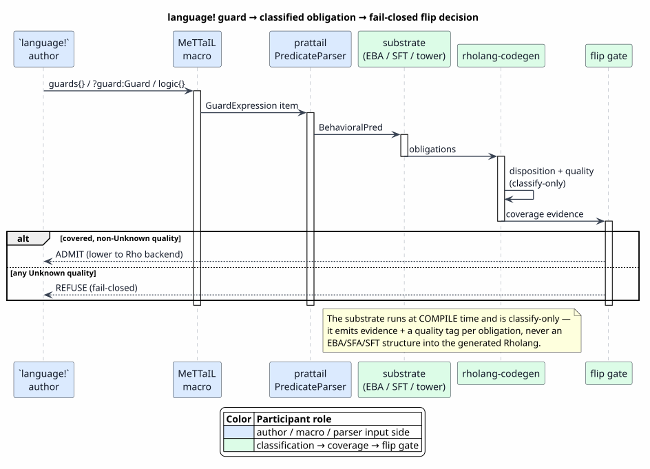
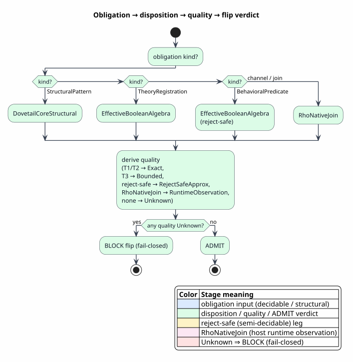

# Language-to-Rholang Integration

Last updated: 2026-06-22

All symbols are defined in [Concepts and Glossary](01-concepts-and-glossary.md).
This document traces the end-to-end spine: how a guard declared in a `language!`
specification becomes a parsed predicate, a classified obligation, a disposition
with a quality grade, and finally a **fail-closed flip decision** that admits (or
refuses) the language on the Rho backend. The run-time enforcement of the surviving
guard is the subject of [08](08-runtime-comm-enforcement.md); this document stops
at the admission boundary.

The single most important architectural fact, stated up front and proven through
the rest of the document: **the symbolic-predicate substrate runs at compile time
and is classify-only.** It emits *evidence + a quality tag* per obligation. It does
**not** emit an EBA, SFA, or SFT structure into the generated Rholang.



PlantUML source: [figures/07-end-to-end-sequence.puml](figures/07-end-to-end-sequence.puml).

## 1. The spine in one line

`guards{} / ?guard:Guard  →  GuardConfig / BehavioralPred (AST)  →  PredicateParser (prattail)  →  EBA/SFT/tree classification  →  obligation + disposition + quality  →  fail-closed flip gate  →  {lower | reject}`

Each arrow is an ownership boundary. The five sections below walk them in order.

## 2. Declaration — two surfaces in `language!`

A language author declares guards in two places, both parsed into the `ast` crate
(`mettail_ast`):

1. **The `?guard:Guard` term slot.** A grammar rule may carry a guard-body
   parameter, e.g. GuardedRho's
   `PGuardedInput . n:Name, ?guard:Guard, ^x.p:[Name → Proc] ⊢ "for" "(" x "<-" n "where" guard ")" "{" p "}" : Proc`.
   The `?guard:Guard` slot parses to `TermParam::GuardBody { name }`
   (`ast/src/grammar.rs`).
2. **The `guards { }` block.** A language-generic configuration parsed by
   `parse_guards` (`ast/src/language/parse.rs`) into `GuardConfig`
   (`ast/src/language/model.rs`), held at `LanguageDef.guard_config`. Its
   sub-blocks are:
   - `builtin_predicates` — the closed set of named predicates the guard
     sublanguage may use;
   - `connectives` — the keywords for the logical connectives (`ConnectiveDecl`);
   - `theories` — `TheoryRegistration`s naming a Rust type that implements
     `BooleanAlgebra`/`ConstraintTheory` plus the categories it handles;
   - `channels` — `channel <Cat>;` and `join <Label>(p: Cat);` declarations.

The predicate itself is the `BehavioralPred` AST (`ast/src/language/model.rs`):
`RelationQuery { relation_name, args, negated }`, `Quantified { quantifier, var,
domain, bound, body }`, `And`/`Or`/`Not`/`Implies`, the structural `AcMatch { bag,
elements, rest }`, and `Top`. It is carried as a rule premise
(`Premise::BehavioralGuard`) or rewrite condition (`Condition::BehavioralGuard`).

## 3. Compilation — into the prattail predicate sublanguage

The macro lowers the declared configuration into the prattail parser
specification. `lower_guard_config`
(`macros/src/gen/syntax/parser/prattail_bridge.rs`) turns each `?guard:Guard` slot
into a `SyntaxItemSpec::GuardExpression { param_name }`. At parse time the
generated prattail parser, on reaching a `GuardExpression` item, switches to the
**predicate sublanguage parser** (`PredicateParser`), which produces a runtime
`BehavioralPred` directly from the user's source tokens.

> **A correction worth stating, because the obvious file is the wrong one.**
> `macros/src/gen/runtime/guard_codegen.rs` is **vestigial**: its
> `generate_guard_codegen` emits only the `TriState` type, and the tier→codegen
> table in its module documentation is descriptive, not emitted. Behavioral
> predicates are *not* compiled into per-guard wrapper functions. The live compile
> path is `prattail_bridge.rs` → `PredicateParser`; the live *classification* path
> is `backend.rs` + `guard_quality.rs` (next sections). A reader tracing the
> integration should follow those, not `guard_codegen.rs`.

## 4. Classification — the substrate's "left half"

This is where the symbolic algebra of [02](02-effective-boolean-algebra.md)–[05](05-algebra-pyramid-and-decidability.md)
does its work, and where the classify-only boundary is enforced. The substrate
(`prattail/src/{symbolic,sft,sym_tree,algebra_tower,any_algebra,…}.rs`) takes the
parsed predicate and produces, for each guard obligation, an **evidence** that it
is covered by some effective theory and a **quality** grade for that evidence. It
emits no runtime structure.

> **`any-algebra-substrate.md §8`, made precise.** The substrate is the *left half*
> of the boundary with the Dovetail/Rho backend:
>
> ```
> language! → LanguageDef → guard obligations          [collect_guard_obligations — backend.rs]
>    → [SUBSTRATE]  EBA / SFT / tree / behavioral evidence  +  quality tag
>    → RhoGuardDisposition { kind, quality }              ──fills──▶ RhoGuardCoverageEvidence (fail-closed)
>    → [DOVETAIL] guarded rewrite rules + reports → [RHO] AST backend (rhoapi::Par)
> ```

### 4.1 Obligations

`collect_guard_obligations(def)` (`rholang-codegen/src/backend.rs`) walks the
`LanguageDef` and induces the exact obligation set, each tagged with a
`RhoGuardObligationKind`:

| Source in `language!` | Obligation id | `RhoGuardObligationKind` |
|---|---|---|
| `guards{}` builtins | `predicate:<name>` (or `predicate:standard-builtins`) | `BehavioralPredicate` |
| `theories{}` entry | `theory:<name>` | `TheoryRegistration` |
| `channels{}` / `join` | `channel:<Cat>` / `join:<Label>` | `RhoNativeJoin` |
| `?guard:Guard` slot | `term:<Label>:guard:<name>` | `BehavioralPredicate` |
| `BehavioralGuard` premise | `…:guard:<idx>` | `StructuralPattern` if it has an `AcMatch` component, else `BehavioralPredicate` |

The structural-vs-behavioral split is decided by `guard_pred_obligation_kind` via
`pred_has_structural_component` (an `AcMatch` component is structural; a `RelationQuery`/`Top`
is behavioral).

### 4.2 Dispositions and the compatibility matrix

A `RhoGuardDispositionKind` is the *mechanism* chosen to cover an obligation:

| Disposition | Covers | Realized by |
|---|---|---|
| `DovetailCoreStructural` | structural patterns | Dovetail exact-key / AC matching |
| `EffectiveBooleanAlgebra` | decidable value/theory predicates | an EBA instance ([02](02-effective-boolean-algebra.md)) |
| `SymbolicFiniteTransducer` | predicates needing input→output analysis | an SFT ([04](04-symbolic-transducers-sft-stft.md)) |
| `RhoNativeJoin` | channels, joins, external-relation behavioral guards | a host native join ([08](08-runtime-comm-enforcement.md)) |
| `NativeHandler` | host-specific computations | a native handler |
| `ExternalContract` | obligations met by an external contract | an out-of-band guarantee |

`guard_disposition_covers(obligation_kind, disposition_kind)`
(`rholang-codegen/src/backend.rs`) is the **compatibility matrix**: it answers
"may this disposition cover this obligation?" It is the falsifiable core of the
gate — an incompatible pairing is rejected.



PlantUML source: [figures/07-disposition-decision.puml](figures/07-disposition-decision.puml).

### 4.3 Quality

Orthogonal to *which* mechanism covers an obligation is *how good* the evidence is.
`guard_quality.rs` derives a `RhoGuardQuality` — the 7-value vocabulary, ordered so
`Unknown` sorts highest (most restrictive):

| Quality | Meaning | Typical source |
|---|---|---|
| `ExactDecidable` | decided exactly | structural (Dovetail-core) or T1/T2 EBA |
| `BoundedDecidable` | decided up to a bound | T3 (bounded reachability) |
| `RejectSafeApprox` | reject-safe over-approximation | a behavioral leg (Heyting / `RejectSafeProduct`) |
| `TrustedNativeGuard` | trusted host computation | `NativeHandler` / `ExternalContract` / T4 |
| `MachineCheckedModel` | backed by a mechanized proof | a verified disposition |
| `RuntimeObservation` | observed at run time | `RhoNativeJoin` |
| `Unknown` | no evidence | nothing classified — **fail-closed** |

`classify_quality` applies the precedence *runtime-observed ▷ machine-checked ▷
reject-safe*, else the mechanism and tier drive the tag (T1/T2 → `ExactDecidable`,
T3 → `BoundedDecidable`, T4 → `TrustedNativeGuard`). `default_classification` gives
the conservative default per obligation kind: structural to Dovetail-core exact;
theory to EBA exact; **behavioral to EBA with `reject_safe`** (the Heyting leg —
sound: may reject, never wrongly admits); `RhoNativeJoin` → runtime-observed.
`derive_guard_qualities(def)` is the per-language entry point that emits a
`RhoGuardDispositionQuality` for every obligation. Only `Unknown` returns `true`
from `refuses_production_default`.

## 5. Admission — the fail-closed flip gate

A language adopts the Rho backend as its production default only when the planner
`plan_rho_default_backend` and the flip gate `decide_rho_flip`
(`rholang-codegen/src/flip.rs`) agree. The executable flip predicate is:

`Flip(L) = Coverage(L) ∧ ArtifactValidation(L) ∧ NoNewDeadlocks(L)`

- **Coverage** is `RhoGuardCoverageEvidence::exactly_covers`: every obligation has
  a compatible disposition, with no uncovered, extraneous, or invalid obligation.
- **Quality** folds in via `guard_quality_blockers_for`: any obligation whose
  quality `refuses_production_default()` (i.e. `Unknown`) yields a
  `RhoFlipBlocker::GuardQuality` and blocks the flip.
- **ArtifactValidation** and **NoNewDeadlocks** are the Rho-backend artifact and
  deadlock checks documented in
  [Rho-Native Integration](../rho-native-integration/04-rho-native-dataflow-lowering.md).

The gate is **fail-closed**: absent positive coverage evidence with non-`Unknown`
quality, the default backend selection refuses rather than falling through. This is
mechanized as `RhoBackendFlipGate.v` (which composes with `RhoGuardedCommSoundness.v`)
and surfaced in [10 — Formal Verification](10-formal-verification-and-tests.md).

> **Lowering target follows the disposition.** Once a language passes the gate, the
> *surviving* guard is lowered to one of three run-time enforcement mechanisms
> depending on its disposition — RSpace structural matching, a host `where`
> boolean guard, or a host-routed native join. The choice and its run-time
> semantics are [08 — Runtime COMM Enforcement](08-runtime-comm-enforcement.md);
> the funding axis it composes with is
> [09 — OSLF Composition](09-oslf-composition.md).

## 6. The comprehension contract

Every page of this suite preserves the same left-to-right story, and this document
is its spine:

`predicate over language data → effective Boolean algebra element → decided + classified at compile time → fail-closed coverage evidence → host enforcement of the survivor`

If a page mentions an EBA, SFA, SFT, or the tower, it is *before* the coverage
boundary — compile-time classification. If a page mentions RSpace, `where`, COMM,
or `RhoNativeJoin`, it is *after* the boundary — host run-time enforcement. The two
never cross: **the substrate classifies; the host enforces.**
