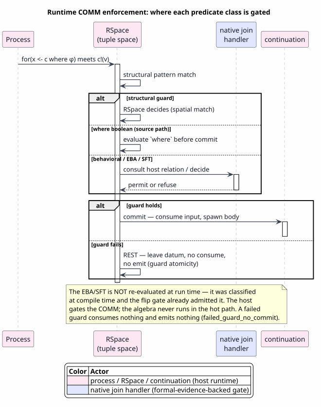

# Runtime COMM Enforcement

Last updated: 2026-07-25 (correction, §0). First published 2026-06-22.

All symbols are defined in [Concepts and Glossary](01-concepts-and-glossary.md).
This document answers the single most-asked and most-misunderstood question about
the substrate: **once a language has been dispatched, how is a semantic predicate
enforced at run time — and what, exactly, does Rholang do?** The honest answer is
the spine of this page, so it is stated immediately and then justified.

## 0. Correction notice — the AST-path premise was false when written

The 2026-06-22 edition of this document justified routing every non-structural
guard away from Rholang with a claim about the wire format. In §3.2 it read:

> MeTTaIL's production Rho lane builds `rhoapi::Par` **AST directly** (no source
> round-trip), and the `rhoapi::ReceiveBind` struct it constructs has fields
> `{patterns, source, remainder, free_count}` — **no guard field**. So MeTTaIL
> cannot emit a literal `where` through the AST path.

**The premise was false on the day it was written, and had been false for 53
days.** This is not a claim that expired: the guard field predated the document.
It exists, and it is on the enclosing `Receive` message rather than on
`ReceiveBind` — which is where a guard belongs, since one guard covers the
combined bindings of *all* binds of a join, not one bind in isolation.

| Statement in the 2026-06-22 edition | Verified status | Source of record |
|---|---|---|
| `ReceiveBind` has fields `{patterns, source, remainder, free_count}` and no guard field | **True**, and immaterial — a per-bind guard could not see cross-bind variables | `RhoTypes.proto:129-134` |
| therefore MeTTaIL cannot emit a `where` guard through the AST path | **False** — `Receive` carries `Par condition = 8` | `RhoTypes.proto:161-167` |
| therefore a pure boolean guard must be host-routed to `RhoNativeJoin` | **False** — it may be emitted as a `Receive.condition` and evaluated by the host before commit | `matcher/match.rs:141-167` |

The provenance, verified in the sibling checkout MeTTaIL path-depends on
(`Cargo.toml:59-63` points every f1r3node crate at `../f1r3node-rust-mettail`):

- **Commit** `8d540d2086f493f82008c5d3098447bb76860e1c`, authored **2026-04-30**,
  titled *"[agent] feat(rholang): normalize where-guards into `Receive.condition`
  and `MatchCase.guard`"*, and labelled **CONSENSUS-AFFECTING** in its own body
  (block hashes differ before versus after, so a coordinated upgrade was required
  — the strongest possible signal that the field is a live part of the wire
  format, not a sketch).
- **Ancestry**, on the exact branch the path dependencies resolve to:

  ```console
  $ git -C ../f1r3node-rust-mettail branch --show-current
  feature/mettail
  $ git -C ../f1r3node-rust-mettail merge-base --is-ancestor 8d540d20 HEAD; echo $?
  0
  ```

  Exit status `0` is `--is-ancestor`'s affirmative: the guard commit is reachable
  from the head MeTTaIL compiles against.
- **Elapsed interval.** 2026-04-30 to 2026-06-22 is 53 days (0 remaining days in
  April, 31 in May, 22 in June).
- **MeTTaIL already emits it.** The generated-AST claim is refuted by MeTTaIL's own
  production codegen, which sets the field on two lowering paths — cited by function
  because both files are under active development and line numbers drift:
  `rholang-codegen/src/rho_net_automaton.rs`, `join_children_receiver` (emits
  `condition: Some(guard)`, the in-Rho set automaton's non-linear consistency guard
  built by `consistency_guard`), and `rholang-codegen/src/rho_net_drive.rs`,
  `ac_carrier_receiver_par` (emits `condition: Some(condition)`, the drive-AC
  carrier's redex check).

What survives the correction is §1's *observation* — the EBA/SFA/SFT algebra is
not itself re-run inside a COMM commit — because `Receive.condition` carries a
**Rholang expression** evaluated by `rho_pure_eval`, not a request to re-execute a
symbolic-automaton decision procedure. What does **not** survive is the
*derivation*: the AST path was never the reason, so "pure boolean guard, therefore
host-routed" was never entailed. §1, §3.2, §3.3, §4 and §5 below are corrected
accordingly, and the classify-only posture is restated as the design decision it
is rather than as a consequence of a wire-format limitation.

## 1. The honest answer, up front

> **Rholang does not re-run the semantic-predicate algebra inside a COMM commit.**
> The prattail EBA/SFA/SFT substrate is used **at compile time** to classify each
> guard obligation and emit coverage evidence ([07](07-language-to-rholang-integration.md)).
> At run time the *surviving* guard is enforced in one of three ways, none of which
> re-executes a symbolic-automaton decision procedure:
>
> 1. **structural** guards, via RSpace **spatial pattern matching**;
> 2. **pure boolean** guards over bound ground values, via a Rholang **`where`
>    receive guard** that F1r3node evaluates before commit. This route is open to
>    generated `rhoapi::Par` as well as to Rholang source: the guard rides on
>    `Receive.condition` (§0), and MeTTaIL's own lowering already uses it;
> 3. **everything richer** (effective-theory, transducer, behavioral, multi-channel
>    join over non-Rholang-computable relations), via a **host-routed native join**
>    (`RhoNativeJoin`) that gates the COMM at the RSpace boundary.

Admission is decided *before* run time by the fail-closed flip gate of
[07 §5](07-language-to-rholang-integration.md): a language only runs on the Rho
backend if every guard obligation was covered with non-`Unknown` quality. So "how
Rholang applies the semantic predicate" is, precisely: it matches structure, it
evaluates the guard expression when the guard is a Rholang-computable boolean over
bound values, and it defers to a host gate exactly when the predicate is *not*
Rholang-computable. What is *guaranteed* at run time is **guard atomicity**: a
failed guard consumes nothing and emits nothing.



PlantUML source: [figures/08-comm-enforcement.puml](figures/08-comm-enforcement.puml).

## 2. What a COMM is, and what "enforcement" means

A Rholang communication — a **COMM** — is the meeting of a receive `for(P <- c)`
and a send `c!(Q)` on a shared channel `c`. When they meet, RSpace atomically
consumes the message and spawns the continuation with the receive's pattern bound.
A *guarded* COMM additionally requires a predicate to hold before it may commit.
"Enforcement at run time" means exactly this: deciding, at the moment a candidate
COMM is enabled, whether the guard permits the commit — and, if not, leaving the
data resting so a later candidate can still fire.

The mechanized semantics make the requirement precise. The firing condition is

`comm_fires(σ) = name_match(σ) ∧ structural_eval(σ) ∧ behavioral_eval(σ)`

— a candidate substitution `σ` fires iff the channel names match, the structural
predicate holds, and the behavioral predicate holds. Three results pin the gate down,
each stated here and proved in its own home (the run-time COMM model
`RhoGuardedCommSoundness.v`, zero-admission):

**Result 2.1 (the COMM gate is exactly the guard).** A guarded rule commits under `σ`
iff `comm_fires(σ)` holds — `name_match(σ) ∧ structural_eval(σ) ∧ behavioral_eval(σ)`.
This biconditional is the characterization of when a guarded rule may fire; both
directions are mechanized in `RhoGuardedCommSoundness.v` (`comm_fires_iff`), with the
positive direction — a satisfied guard over matching names *does* commit — separately
recorded as `rho_guard_true_commits`. The negative direction is **Result 2.2**.

**Result 2.2 (a complemented guard never commits).** If the guard's behavioral leg
holds *because its reject-safe complement holds* — a `DontKnow`/complemented behavioral
verdict — then `comm_fires(σ) = false` and no COMM fires. This is the run-time mirror of
the **asymmetric mixed De Morgan reject-safety** proved as
[12 — Heyting Behavioral Logic, Theorem 6.1](12-heyting-behavioral-logic.md#6-how-heyting-completes-boolean-for-structural-behavioral-types)
(`mixed_negation_soundness`); its COMM-boundary form is `RhoGuardedCommSoundness.v`'s
`rho_complement_no_commit`. It is **not re-proved here** — §5 item 1 below explains why a
semi-decidable guard must be reject-safe, and the algebraic content is doc 12's.

Crucially, the model treats `structural_eval` and `behavioral_eval` as **abstract**
boolean functions on `σ`: Result 2.1 *fixes the semantics* ("fires iff guard holds"),
while the *realizations* of those abstract functions at run time are exactly the three
concretization mechanisms of
[12 §4.2](12-heyting-behavioral-logic.md#42-the-three-concretization-mechanisms)
(model-check over a `HostTerm` LTS / closed-world `FactBase` / host observation at COMM
time) — cross-referenced there, not restated — projected onto the three enforcement
mechanisms of §3.

## 3. The three enforcement mechanisms

### 3.1 Structural guards — RSpace spatial matching

A structural predicate (`AcMatch`, a constructor pattern, a refinement of shape) is
enforced by RSpace's own pattern matching. A receive `for(@Pattern <- c)` is enabled
only when an incoming term *structurally matches* `Pattern`. This is native,
atomic, and free — it is what RSpace already does — but it can express only the
*shape* of data, never a value- or behavior-level property like "`x` is prime" or
"`P` halts."

This is the `DovetailCoreStructural` disposition reaching run time as ordinary
Rholang/RSpace matching.

### 3.2 Pure boolean guards — the Rholang `where` clause

Rholang supports a receive guard directly in the surface language:

```rholang
for (@x <- @"c" where x > 0) { @"OUT"!(x) }
```

F1r3node's `RhoRuntime` evaluates the `where` clause **before commit**, and the
behavior is exactly guard atomicity. This is verified live, not asserted, by
`rholang-runtime/tests/rho_guard_oracle.rs`:

| Test | What it proves |
|---|---|
| `false_single_bind_guard_leaves_data_and_emits_no_output` | a failed `where` guard emits no body and leaves the rejected datum resting |
| `guard_filters_multiple_messages_without_consuming_failed_candidate` | a later satisfying datum fires the receive; the earlier failing datum stays available |
| `false_cross_bind_guard_leaves_all_join_inputs` | a failed cross-bind join guard (`for (@x <- @"a" & @y <- @"b" where x + y > 10)`) consumes no join input |
| `cross_bind_guard_can_commit_later_without_consuming_failed_pair` | the later satisfying pair commits and consumes its inputs; the earlier failing input remains |

These run real Rholang source on the host RSpace and validate the guard-atomicity
theorems of §3.4 — in particular **Theorem 3.1** (`failed_guard_no_commit`) — against an
actual interpreter.

> **The boundary that forces host-routing (corrected).** The `where` clause is
> enforceable whenever the predicate is a **Rholang-computable boolean over bound
> values** — independently of whether the program arrives as Rholang source or as
> generated `rhoapi::Par`. MeTTaIL's production Rho lane builds AST directly, with
> no source round-trip, and that path carries the guard: `ReceiveBind` indeed has
> only `{patterns, source, remainder, free_count}`, but the guard is not a per-bind
> field — it is `Par condition = 8` on the enclosing `Receive`
> (`RhoTypes.proto:161-167`), precisely so that one guard can range over the
> combined bindings of every bind in a join. The **surviving** boundary that forces
> host-routing is therefore *computability*, not *encodability*: a predicate that
> Rholang cannot decide (an external relation such as `halts`, a Presburger
> decision, an SFT run) goes to the native join of §3.3; a predicate Rholang *can*
> decide rides on `Receive.condition` and is enforced by the same F1r3node guard
> path the oracle above exercises. See §0 for the provenance of the field and for
> the false premise this paragraph replaces.

The host-side evaluation path for a guard reaching the machine as AST is the same
one the source path uses, which is why the `where` oracle is an oracle for both:
`rholang/src/rust/interpreter/matcher/match.rs:141-167` (`guard_passes`) evaluates
the condition with `rho_pure_eval::eval_with` against the combined cross-bind
environment and commits only on `GBool(true)`; the sibling
`Reduce::eval_match` (`reduce.rs:1723`) does the same for the `match … where` case
guard, using the same evaluator. Three facts about that path matter downstream:

1. **Cross-bind scope.** The guard is evaluated after every spatial pattern has
   matched, against the combined bindings of all binds, which is exactly what a
   guard field on `Receive` (rather than on `ReceiveBind`) buys.
2. **Fail-closed collapse.** `false`, "did not reduce to a boolean", and
   "evaluation raised an error" collapse into a single **guard-fail** verdict
   (`guard_passes`, `Err(_) => false`). The collapse is deliberate and
   consensus-visible: it is what makes a partial guard reject-safe rather than
   commit-unsafe.
3. **Checked integer arithmetic.** `rho_pure_eval` uses `i64::checked_add`,
   `checked_sub`, and `checked_mul` through `int_binop_checked`
   (`rho-pure-eval/src/eval.rs:171-194, 398-417`), so an overflowing guard raises
   `EvalError::ArithmeticOverflow` and, by fact 2, fails the guard. A guard
   therefore never commits a COMM on a wrapped-around value.

### 3.3 Everything richer — the host-routed native join (`RhoNativeJoin`)

An effective-theory predicate (a Presburger formula), a transducer relation, or a
**behavioral** predicate over external relations (`halts`, `safe`) is **not
Rholang-computable**: Rholang cannot decide a linear-integer formula, run an SFT, or
query a host relation. That, and that alone, is what routes such a guard to the
`RhoNativeJoin` disposition. The 2026-06-22 edition adjoined a second reason —
"and cannot even carry a guard field in the AST it is handed" — which was false
when written (§0) and is withdrawn here; encodability never bore on the routing
decision, and a Rholang-decidable guard is *not* routed away merely because its
program arrived as AST.

At run time a **native join handler** sits at the RSpace COMM boundary. When a
candidate join is enabled, the handler decides whether the guard permits the commit
(consulting the host relation, evaluating the theory, or running the transducer),
and either lets RSpace commit or leaves the inputs resting. The predicate algebra is
**not** re-evaluated here either — the substrate already classified the obligation
at compile time and the gate already admitted it; the handler enforces the
*decision*, using host facilities, with the same non-consuming-on-false semantics.

GuardedRho is the canonical instance: its `?guard` is a `RelationQuery` over the
external relations `halts`/`safe` "populated by user code"
(`languages/tests/definitions/guarded_rho.rs`). Host-routing via `RhoNativeJoin` is still
**derived-required** there and not a preference — but on one premise, not two.
`halts` and `safe` are populated outside the Rholang state a validator replays, so
no `Receive.condition` expression can denote them; there is nothing for
`rho_pure_eval` to reduce. The 2026-06-22 edition rested the same conclusion
additionally on "`rhoapi::ReceiveBind` has no guard field", which was false (§0).
Removing the false premise does not weaken the conclusion for GuardedRho, because
non-Rholang-computability alone is sufficient — but it does narrow the conclusion's
*reach*: it no longer extends to guards that Rholang can decide. The worked trace
is [11 — Worked Example](11-worked-example.md).

### 3.4 The guard-atomicity model and its theorems

All three mechanisms of §3.1–§3.3 share one run-time guarantee — **guard atomicity** —
and that guarantee is what is proved here. The proof-home is the guarded-COMM model
`GuardedCommSoundness.v` (zero-admission), which abstracts an RSpace receive guard, or a
native guard handler, to its essential decision: given the current facts, either commit
the rule's output atomically or leave the store untouched. This is the model the §3.2
`where` oracle validates against a live interpreter, and the decision a §3.3
`RhoNativeJoin` handler enforces with host facilities; the theorems below hold uniformly
across all three mechanisms.

**Definition 3.2 (the guarded-COMM model).** A **fact store** is a finite set of facts.
A **guarded rule** `r` carries three components: a list of **premises** `premises(r)`, a
boolean **guard** `guard(r)`, and an **output fact** `output(r)`. Write
`all_present(facts, premises)` for the predicate "every premise of `premises` is in
`facts`", and `insert_exact(f, facts)` for the store that adds `f` to `facts` if absent
and is `facts` unchanged otherwise. The relation `guarded_attempt(facts, r, next)`
("attempting `r` against `facts` yields store `next`") is **inductive with exactly three
constructors**:

| Constructor | Precondition | Result `next` |
|---|---|---|
| **commit** | `all_present(facts, premises(r))` ∧ `guard(r) = true` | `insert_exact(output(r), facts)` |
| **reject-guard** | `all_present(facts, premises(r))` ∧ `guard(r) = false` | `facts` (unchanged) |
| **reject-missing** | `¬ all_present(facts, premises(r))` | `facts` (unchanged) |

The three constructors are mutually exhaustive on the two boolean dimensions (all
premises present or not; guard true or false), so every attempt lands in exactly one
case — and only **commit** modifies the store. Mechanized in `GuardedCommSoundness.v` as
the record `GuardedRule` and the inductive `guarded_attempt`, with `all_present` and
`insert_exact` as above. This is exactly RSpace's "consume-and-spawn iff the guard
permits" reduced to the one bit that the soundness argument turns on. The two
characterizing theorems are the negative gate (a failed guard changes nothing) and the
positive gate (a satisfied guard over present premises delivers the output).

**Theorem 3.1 (a failed guard commits nothing).** If `guard(r) = false` and
`guarded_attempt(facts, r, next)`, then `next = facts`.

*Proof.* Invert the derivation of `guarded_attempt(facts, r, next)` (Definition 3.2):
it was built by exactly one of the three constructors. The **commit** constructor is
impossible here — it requires `guard(r) = true`, contradicting the hypothesis
`guard(r) = false`. The remaining two constructors, **reject-guard** and
**reject-missing**, each conclude with `next = facts` by construction. So in every
possible case `next = facts`. `∎` (Mechanized as `failed_guard_no_commit`.)

**Theorem 3.2 (a satisfied guard over present premises commits the output).** If
`all_present(facts, premises(r))` and `guard(r) = true`, then there exists a store
`next` with `guarded_attempt(facts, r, next)` and `output(r) ∈ next`.

*Proof.* Take `next := insert_exact(output(r), facts)`. Both hypotheses
`all_present(facts, premises(r))` and `guard(r) = true` are exactly the preconditions of
the **commit** constructor (Definition 3.2), which therefore derives
`guarded_attempt(facts, r, insert_exact(output(r), facts))`. And
`output(r) ∈ insert_exact(output(r), facts)`: by definition of `insert_exact`, the
inserted fact is a member of the result whether or not it was already present. Hence the
witnessed `next` satisfies both conjuncts. `∎` (Mechanized as
`true_guard_enabled_adds_output`.)

Two further properties sharpen the no-commit guarantee, and §4 and §5 cite them:

**Theorem 3.3 (no fabrication).** If `guarded_attempt(facts, r, next)` and `x ∈ next`,
then `x = output(r)` or `x ∈ facts`. A guarded attempt never invents a fact other than
the rule's declared output.

*Proof.* Invert the attempt (Definition 3.2). In the **reject-guard** and
**reject-missing** cases `next = facts`, so `x ∈ next` gives `x ∈ facts` directly. In the
**commit** case `next = insert_exact(output(r), facts)`; by the membership law of
`insert_exact`, any `x ∈ insert_exact(output(r), facts)` is either `x = output(r)` or
`x ∈ facts`. All three cases discharge the disjunction. `∎` (Mechanized as
`guarded_attempt_no_fabrication`, over the supporting lemma `insert_exact_membership`.)

**Theorem 3.4 (a missing premise commits nothing).** If
`¬ all_present(facts, premises(r))` and `guarded_attempt(facts, r, next)`, then
`next = facts`.

*Proof.* Invert the attempt (Definition 3.2). The **commit** and **reject-guard**
constructors both require `all_present(facts, premises(r))`, contradicting the
hypothesis, so neither applies; the only available case is **reject-missing**, whose
conclusion is `next = facts`. `∎` (Mechanized as `missing_premise_no_commit`.)

Together Theorems 3.1, 3.3, and 3.4 are the formal content of "a failed guard consumes
nothing and emits nothing," and Theorem 3.2 is its dual — "a satisfied guard does
deliver the output." These are the run-time guarantee the §1 summary promised; the §4
matrix and §5 architecture rest on them.

## 4. What generated Rholang does and does not do

| Concern | Done by generated Rholang? | Done by | Evidence |
|---|---|---|---|
| structural shape match | yes (RSpace patterns) | RSpace | structural disposition |
| pure boolean over ground values, source path | yes (`where`) | F1r3node `where` eval | `rho_guard_oracle.rs` |
| pure boolean, AST path | yes — `Receive.condition` | the same F1r3node guard eval (`guard_passes`) | `RhoTypes.proto:167`; `rho_net_automaton.rs::join_children_receiver`; `rho_net_drive.rs::ac_carrier_receiver_par`; §0 |
| effective-theory predicate (Presburger, intervals) | no | compile-time classification + host gate | [02](02-effective-boolean-algebra.md), `RhoNativeJoin` |
| transducer relation (SFT/STFT) | no | compile-time classification + host gate | [04](04-symbolic-transducers-sft-stft.md) |
| behavioral predicate (`halts`/`safe`, modal) | no (not Rholang-computable) | host native join | `guarded_rho.rs`, `rho_guard_oracle.rs` |
| guard atomicity (no-commit-on-false) | enforced for all of the above | RSpace + handler | §3.4 Theorems 3.1–3.4 (`GuardedCommSoundness.v`) |

The pattern is uniform, and the discriminator in column 2 is **computability**:
Rholang/RSpace enforces structure and every guard Rholang can decide — from source
or from generated AST alike; the host gate enforces exactly what Rholang cannot
decide; and no symbolic-automaton decision procedure is re-executed inside a COMM
commit. The AST/source distinction, which the 2026-06-22 edition placed in this
column, is not a discriminator at all (§0).

## 5. Why this division is the correct architecture

It is not a limitation worked around, and — since §0 — it is not a wire-format
consequence either. It is the soundness boundary of
[05 — Algebra Pyramid](05-algebra-pyramid-and-decidability.md) projected onto run
time, chosen deliberately:

1. **Semi-decidable predicates must not be evaluated speculatively in the hot
   path.** A behavioral guard is reject-safe precisely because a bounded search can
   say `DontKnow`; embedding that search in a COMM commit would either block the
   scheduler or risk a false fire. Classifying it at compile time and gating it with
   a host handler keeps the run-time COMM decision *total and fast*.
2. **The decidable predicates are already decided.** An `ExactDecidable` or
   `BoundedDecidable` obligation was settled by the substrate before run time; the
   run-time job is to *match structure*, *evaluate the emitted `Receive.condition`*,
   or *consult the recorded decision* — not to re-derive the classification.
3. **Admission is fail-closed.** A language with any `Unknown`-quality obligation
   never reaches run time on the Rho backend, so the run-time mechanisms only ever
   face obligations that *were* coverable.
4. **Atomicity is the one universal run-time guarantee.** Whatever the mechanism, a
   failed guard consumes nothing and emits nothing (§3.4 Theorem 3.1), a missing premise
   likewise (Theorem 3.4), no fact is fabricated (Theorem 3.3), and a later satisfying
   candidate can still commit (Theorem 3.2). That is the property a developer can rely on
   regardless of how a particular guard is enforced.
5. **A guard site has exactly one decider, and the substrate is it.** Reasons 1-4
   say which *mechanism* enforces a guard; they do not say whose *semantics* the
   verdict is. That is the separate governing decision recorded as
   **Substrate-as-Definition** and **INV-14b′** in
   [13 — Knotted-Topoi Operational Invariants §5.2](../rho-native-integration/13-knotted-topoi-operational-invariants.md#52-substrate-as-definition-and-inv-14b-the-single-decider-at-a-guard-site):
   at a guard site the substrate's denotation *is* the specification, and the
   reducer's behaviour on the same expression is an obligation to discharge against
   it. That decision is what makes §3.2's checked-arithmetic observation a
   *guarantee* rather than a coincidence, and it is mechanized as
   `RhoHostObligationBoundary.guard_site_coverage_excludes_host_dispositions`
   (T-HB4).

The resource axis this gate composes with — *a COMM fires iff the guard is
satisfied **and** the rewrite is funded* — is
[09 — Funding Composition](09-funding-composition.md).
